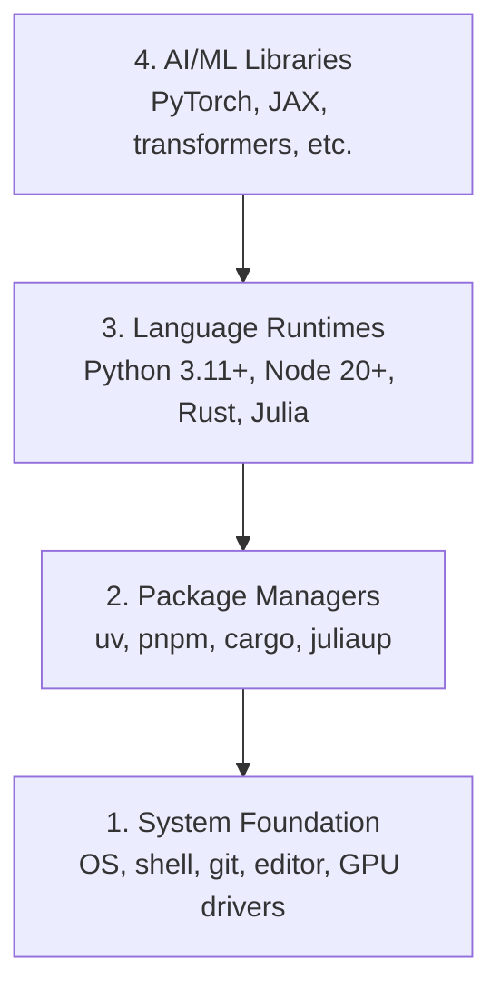

# 开发环境

> 你的工具塑造你的思维。一次设置，正确设置。

**类型：** 构建  
**语言：** Python, Node.js, Rust  
**前提条件：** 无  
**时间：** 约 45 分钟

## 学习目标

- 从零开始设置 Python 3.11+、Node.js 20+ 和 Rust 工具链
- 配置虚拟环境和包管理器以实现可重现构建
- 验证 CUDA/MPS 的 GPU 访问并运行测试张量操作
- 理解四层堆栈：系统、包、运行时、AI 库

## 问题

你将通过 200 多节课程学习 AI 工程，涉及 Python、TypeScript、Rust 和 Julia。如果你的环境坏了，每一节课都会变成与工具的搏斗，而不是学习。

大多数人跳过环境设置。然后他们花几个小时调试导入错误、版本冲突和缺失的 CUDA 驱动。我们将一次性正确地完成这项工作。

## 概念

AI 工程环境有四个层：



我们从下往上安装。每一层依赖于其下面的一层。

## 构建它

### 第一步：系统基础

检查你的系统并安装基本组件。

```bash
# macOS
xcode-select --install
brew install git curl wget

# Ubuntu/Debian
sudo apt update && sudo apt install -y build-essential git curl wget

# Windows (use WSL2)
wsl --install -d Ubuntu-24.04
```

### 第二步：使用 uv 的 Python

我们使用 `uv` —— 它比 pip 快 10-100 倍，并自动处理虚拟环境。

```bash
curl -LsSf https://astral.sh/uv/install.sh | sh

uv python install 3.12

uv venv
source .venv/bin/activate  # or .venv\Scripts\activate on Windows

uv pip install numpy matplotlib jupyter
```

验证：

```python
import sys
print(f"Python {sys.version}")

import numpy as np
print(f"NumPy {np.__version__}")
a = np.array([1, 2, 3])
print(f"Vector: {a}, dot product with itself: {np.dot(a, a)}")
```

### 第三步：使用 pnpm 的 Node.js

用于 TypeScript 课程（智能体、MCP 服务器、Web 应用）。

```bash
curl -fsSL https://fnm.vercel.app/install | bash
fnm install 22
fnm use 22

npm install -g pnpm

node -e "console.log('Node', process.version)"
```

### 第四步：Rust

用于性能关键型课程（推理、系统）。

```bash
curl --proto '=https' --tlsv1.2 -sSf https://sh.rustup.rs | sh

rustc --version
cargo --version
```

### 第五步：Julia（可选）

用于数学密集型课程，Julia 表现出色。

```bash
curl -fsSL https://install.julialang.org | sh

julia -e 'println("Julia ", VERSION)'
```

### 第六步：GPU 设置（如果你有的话）

```bash
# NVIDIA
nvidia-smi

# Install PyTorch with CUDA
uv pip install torch torchvision torchaudio --index-url https://download.pytorch.org/whl/cu124
```

```python
import torch
print(f"CUDA available: {torch.cuda.is_available()}")
if torch.cuda.is_available():
    print(f"GPU: {torch.cuda.get_device_name(0)}")
```

没有 GPU？没问题。大多数课程在 CPU 上运行。对于训练密集型课程，使用 Google Colab 或云端 GPU。

### 第七步：验证一切

运行验证脚本：

```bash
python phases/00-setup-and-tooling/01-dev-environment/code/verify.py
```

## 使用它

你的环境现在已准备好用于本课程的每一节课。以下是你将在什么地方使用什么：

| 语言 | 使用阶段 | 包管理器 |
|----------|---------|-----------------|
| Python | 阶段 1-12（ML, DL, NLP, Vision, Audio, LLMs） | uv |
| TypeScript | 阶段 13-17（Tools, Agents, Swarms, Infra） | pnpm |
| Rust | 阶段 12、15-17（性能关键系统） | cargo |
| Julia | 阶段 1（数学基础） | Pkg |

## 交付它

本课程生成了一个验证脚本，任何人都可以运行它来检查他们的设置。

参见 `outputs/prompt-env-check.md` 中帮助 AI 助手诊断环境问题的提示。

## 练习

1. 运行验证脚本并修复任何失败
2. 为本课程创建一个 Python 虚拟环境并安装 PyTorch
3. 用所有四种语言编写"hello world"并运行每一个
