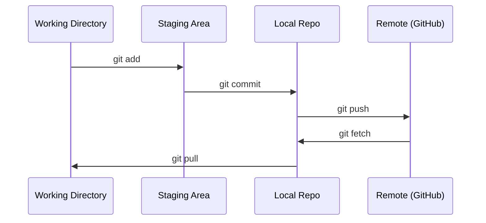

# Git 与协作

> 版本控制不是可选项。你在此构建的每一次实验、每一个模型、每一节课程都会被追踪。

**类型：** 学习
**语言：** --
**前置条件：** 阶段 0，第 01 课
**时间：** 约30分钟

## 学习目标

- 配置 git 身份，并使用每日工作流：添加、提交和推送
- 创建和合并分支，以便在隔离环境下进行实验而不破坏主分支
- 编写一个 `.gitignore` 文件，排除模型检查点和大二进制文件
- 使用 `git log` 浏览提交历史，理解项目演变过程

## 问题

你即将在 20 个阶段中编写数百个代码文件。没有版本控制，你将丢失工作、破坏无法撤销的内容，并且无法与他人协作。

Git 是工具，GitHub 是代码存储的地方。本节课程涵盖你在本课程中所需的内容，不多也不少。

## 概念



需要记住三件事：
1. 经常保存（`git commit`）
2. 推送到远程（`git push`）
3. 为实验创建分支（`git checkout -b experiment`）

## 动手实践

### 第 1 步：配置 git

```bash
git config --global user.name "Your Name"
git config --global user.email "you@example.com"
```

### 第 2 步：日常工作流

```bash
git status
git add file.py
git commit -m "Add perceptron implementation"
git push origin main
```

### 第 3 步：为实验创建分支

```bash
git checkout -b experiment/new-optimizer

# ... make changes, commit ...

git checkout main
git merge experiment/new-optimizer
```

### 第 4 步：与本课程仓库协作

```bash
git clone https://github.com/rohitg00/ai-engineering-from-scratch.git
cd ai-engineering-from-scratch

git checkout -b my-progress
# work through lessons, commit your code
git push origin my-progress
```

## 使用

在本课程中，你只需要以下命令：

| 命令 | 何时使用 |
|------|---------|
| `git clone` | 获取课程仓库 |
| `git add` + `git commit` | 保存你的工作 |
| `git push` | 备份到 GitHub |
| `git checkout -b` | 尝试新功能而不破坏主分支 |
| `git log --oneline` | 查看你做了哪些操作 |

仅此而已。在本课程中，你不需要使用 rebase、cherry-pick 或子模块。

## 练习

1. 克隆此仓库，创建一个名为 `my-progress` 的分支，创建一个文件，提交它，并推送
2. 创建一个 `.gitignore` 文件，排除模型检查点文件（`.pt`、`.pth`、`.safetensors`）
3. 使用 `git log --oneline` 查看此仓库的提交历史，并了解课程内容是如何逐步添加的

## 关键术语

| 术语 | 大家常说 | 实际含义 |
|------|---------|---------|
| Commit | “保存” | 项目在某个时间点的快照 |
| Branch | “一个副本” | 指向某个提交的指针，在你工作时向前移动 |
| Merge | “合并代码” | 将一个分支的更改应用到另一个分支 |
| Remote | “云端” | 托管在其他地方（GitHub、GitLab）的仓库副本 |
