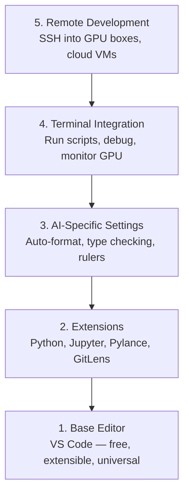

# 编辑器设置

> 你的编辑器就是你的副驾驶。只需配置一次，它就会退居幕后并开始发挥作用。

**类型：** 构建  
**语言：** --  
**前置条件：** 阶段 0，课程 01  
**时间：** 约 20 分钟

## 学习目标

- 安装 VS Code 以及用于 Python、Jupyter、代码检查和远程 SSH 的核心扩展
- 配置保存时格式化、类型检查以及适用于 AI 工作流的笔记本输出滚动
- 设置 Remote SSH，像编辑本地代码一样在远程 GPU 机器上编辑和调试代码
- 评估编辑器替代方案（Cursor、Windsurf、Neovim）及其在 AI 工作中的权衡

## 问题

你将在编辑器里花费数千小时编写 Python、运行笔记本、调试训练循环以及 SSH 进入 GPU 机器。配置不当的编辑器会让每一次会话都充满摩擦：没有自动补全、没有类型提示、没有内联错误、手动格式化以及笨重的终端工作流。

正确的设置只需 20 分钟。跳过它每天会浪费你 20 分钟。

## 概念

一个 AI 工程师的编辑器设置需要五样东西：



## 动手构建

### 步骤 1：安装 VS Code

VS Code 是推荐的编辑器。它免费、可在所有操作系统上运行、拥有一流的 Jupyter 笔记本支持，并且扩展生态覆盖了你进行 AI 工作所需的一切。

从 [code.visualstudio.com](https://code.visualstudio.com/) 下载。

在终端中验证：

```bash
code --version
```

如果在 macOS 上找不到 `code` 命令，请打开 VS Code，按下 `Cmd+Shift+P`，输入 "Shell Command"，然后选择 "Install 'code' command in PATH"。

### 步骤 2：安装核心扩展

在 VS Code 中打开集成终端（`Ctrl+`` ` 或 `Cmd+`` `），并安装对 AI 工作重要的扩展：

```bash
code --install-extension ms-python.python
code --install-extension ms-python.vscode-pylance
code --install-extension ms-toolsai.jupyter
code --install-extension eamodio.gitlens
code --install-extension ms-vscode-remote.remote-ssh
code --install-extension ms-python.debugpy
code --install-extension ms-python.black-formatter
code --install-extension charliermarsh.ruff
```

每个扩展的作用：

| 扩展 | 为什么需要 |
|------|-----------|
| Python | 语言支持、虚拟环境检测、运行/调试 |
| Pylance | 快速的类型检查、自动补全、导入解析 |
| Jupyter | 在 VS Code 内运行笔记本、变量查看器 |
| GitLens | 查看谁更改了什么、内联 Git 指责 |
| Remote SSH | 将远程 GPU 机器上的文件夹当作本地文件夹打开 |
| Debugpy | Python 的逐步调试 |
| Black Formatter | 保存时自动格式化，保持风格一致 |
| Ruff | 快速代码检查，捕捉常见错误 |

本课程中 `code/.vscode/extensions.json` 文件包含了完整的推荐扩展列表。当你打开项目文件夹时，VS Code 会提示你安装它们。

### 步骤 3：配置设置

从本课程中的 `code/.vscode/settings.json` 复制设置，或通过 `设置 > 打开设置 (JSON)` 手动应用它们。

适用于 AI 工作的关键设置：

```jsonc
{
    "python.analysis.typeCheckingMode": "basic",
    "editor.formatOnSave": true,
    "editor.rulers": [88, 120],
    "notebook.output.scrolling": true,
    "files.autoSave": "afterDelay"
}
```

为什么这些设置重要：

- **Basic 级别的类型检查**：在运行之前捕获错误的参数类型。节省调试张量形状不匹配和错误 API 参数的时间。
- **保存时格式化**：再也不用考虑格式化的问题。Black 会处理。
- **标尺在 88 和 120 列**：Black 在 88 列处换行。120 标记显示文档字符串和注释何时过长。
- **笔记本输出滚动**：训练循环会打印数千行。如果不滚动，输出面板会爆炸。
- **自动保存**：你会忘记保存，训练脚本会运行过时的代码。自动保存可以防止这种情况。

### 步骤 4：终端集成

VS Code 的集成终端是你运行训练脚本、监控 GPU 和管理环境的地方。

正确配置它：

```jsonc
{
    "terminal.integrated.defaultProfile.osx": "zsh",
    "terminal.integrated.defaultProfile.linux": "bash",
    "terminal.integrated.fontSize": 13,
    "terminal.integrated.scrollback": 10000
}
```

有用的快捷键：

| 操作 | macOS | Linux/Windows |
|------|-------|---------------|
| 切换终端 | `` Ctrl+` `` | `` Ctrl+` `` |
| 新建终端 | `Ctrl+Shift+`` ` | `Ctrl+Shift+`` ` |
| 分割终端 | `Cmd+\` | `Ctrl+\` |

分割终端很有用：一个用于运行脚本，一个用于通过 `nvidia-smi -l 1` 或 `watch -n 1 nvidia-smi` 监控 GPU。

### 步骤 5：远程开发（SSH 进入 GPU 机器）

这是 AI 工作中最重要的扩展。你会在远程机器（云虚拟机、实验室服务器、Lambda、Vast.ai）上运行训练。Remote SSH 允许你打开远程文件系统、编辑文件、运行终端和调试，就像一切都是本地的一样。

设置：

1. 安装 Remote SSH 扩展（步骤 2 已完成）。
2. 按下 `Ctrl+Shift+P`（或 `Cmd+Shift+P`），输入 "Remote-SSH: Connect to Host"。
3. 输入 `user@your-gpu-box-ip`。
4. VS Code 会自动在远程机器上安装其服务器组件。

要实现无密码访问，设置 SSH 密钥：

```bash
ssh-keygen -t ed25519 -C "your-email@example.com"
ssh-copy-id user@your-gpu-box-ip
```

为了方便，将主机添加到 `~/.ssh/config`：

```
Host gpu-box
    HostName 203.0.113.50
    User ubuntu
    IdentityFile ~/.ssh/id_ed25519
    ForwardAgent yes
```

现在 `Remote-SSH: Connect to Host > gpu-box` 可以立即连接。

## 替代方案

### Cursor

[cursor.com](https://cursor.com) 是 VS Code 的一个分支，内置了 AI 代码生成。它使用相同的扩展生态系统和设置格式。如果你使用 Cursor，本课程中的所有内容仍然适用。导入相同的 `settings.json` 和 `extensions.json` 即可。

### Windsurf

[windsurf.com](https://windsurf.com) 是另一个以 AI 优先的 VS Code 分支。同样的情况：相同的扩展、相同的设置格式、相同的 Remote SSH 支持。

### Vim/Neovim

如果你已经在使用 Vim 或 Neovim 并且能够高效工作，请继续使用。对于 AI Python 工作的最低要求设置：

- **pyright** 或 **pylsp** 用于类型检查（通过 Mason 或手动安装）
- **nvim-lspconfig** 用于语言服务器集成
- **jupyter-vim** 或 **molten-nvim** 用于类似笔记本的执行
- **telescope.nvim** 用于文件/符号搜索
- **none-ls.nvim** 配合 black 和 ruff 进行格式化/代码检查

如果你目前还没有使用 Vim，现在不要开始。学习曲线会与学习 AI 工程产生竞争。请使用 VS Code。

## 使用它

有了这个设置，你的日常工作流将如下所示：

1. 在 VS Code 中打开项目文件夹（或通过 Remote SSH 连接到 GPU 机器）。
2. 在编辑器中编写 Python，享受自动补全、类型提示和内联错误提示。
3. 使用 Jupyter 扩展内联运行 Jupyter 笔记本。
4. 使用集成终端运行训练脚本、执行 `uv pip install` 和监控 GPU。
5. 提交前使用 GitLens 查看更改。

## 练习

1. 安装 VS Code 以及步骤 2 中列出的所有扩展。
2. 将本课程中的 `settings.json` 复制到你的 VS Code 配置中。
3. 打开一个 Python 文件，验证 Pylance 是否显示类型提示，以及 Black 是否在保存时自动格式化。
4. 如果你有权访问远程机器，设置 Remote SSH 并在其上打开一个文件夹。

## 关键术语

| 术语 | 人们常说的 | 实际含义 |
|------|------------|---------|
| LSP | “自动补全引擎” | 语言服务器协议：一种标准，允许编辑器从特定语言服务器获取类型信息、补全和诊断 |
| Pylance | “Python 插件” | 微软的 Python 语言服务器，使用 Pyright 进行类型检查和 IntelliSense |
| Remote SSH | “在服务器上工作” | VS Code 扩展，它在远程机器上运行一个轻量级服务器，并将 UI 流式传输到本地编辑器 |
| Format on save | “自动美化” | 编辑器在每次保存时运行格式化工具（Black、Ruff），确保代码风格始终一致 |
