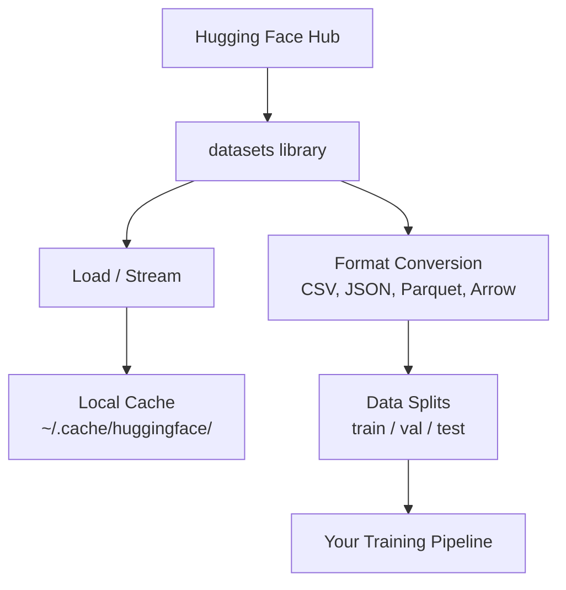

# 数据管理

> 数据是燃料。你如何管理它决定了你能跑多快。

**类型：** 构建  
**语言：** Python  
**前置条件：** 阶段0，第01课  
**时间：** ~45分钟  

## 学习目标

- 使用 Hugging Face `datasets` 库加载、流式传输和缓存数据集  
- 在 CSV、JSON、Parquet 和 Arrow 格式之间转换并解释它们的取舍  
- 使用固定随机种子创建可复现的训练/验证/测试集拆分  
- 使用 `.gitignore`、Git LFS 或 DVC 管理大型模型和数据集文件  

## 问题

每个 AI 项目都从数据开始。你需要找到数据集、下载它们、在不同格式间转换、拆分为训练和评估集，并进行版本管理，以便实验可复现。每次都手动操作既慢又容易出错。你需要一个可重复的工作流程。

## 概念



Hugging Face `datasets` 库是为 AI 工作加载数据的标准方式。它开箱即用地处理下载、缓存、格式转换和流式传输。

## 构建

### 第1步：安装 datasets 库

```bash
pip install datasets huggingface_hub
```

### 第2步：加载数据集

```python
from datasets import load_dataset

dataset = load_dataset("imdb")
print(dataset)
print(dataset["train"][0])
```

这会下载 IMDB 电影评论数据集。首次下载后，它会从 `~/.cache/huggingface/datasets/` 的缓存中加载。

### 第3步：流式传输大数据集

有些数据集太大，无法存放到磁盘上。流式传输可以逐行加载它们，而无需下载完整内容。

```python
dataset = load_dataset("wikimedia/wikipedia", "20220301.en", split="train", streaming=True)

for i, example in enumerate(dataset):
    print(example["title"])
    if i >= 4:
        break
```

流式传输给你一个 `IterableDataset`。你随着数据行的到达进行处理。无论数据集多大，内存占用都是恒定的。

### 第4步：数据集格式

`datasets` 库底层使用 Apache Arrow。你可以根据流水线的需求转换为其他格式。

```python
dataset = load_dataset("imdb", split="train")

dataset.to_csv("imdb_train.csv")
dataset.to_json("imdb_train.json")
dataset.to_parquet("imdb_train.parquet")
```

格式对比：

| 格式 | 大小 | 读取速度 | 最佳用途 |
|------|------|---------|----------|
| CSV | 大 | 慢 | 人类可读性，电子表格 |
| JSON | 大 | 慢 | API，嵌套数据 |
| Parquet | 小 | 快 | 分析，列式查询 |
| Arrow | 小 | 最快 | 内存中处理（`datasets` 内部使用的格式） |

对于 AI 工作，Parquet 是最好的存储格式。Arrow 是你在内存中使用的格式。CSV 和 JSON 用于数据交换。

### 第5步：数据拆分

每个机器学习项目都需要三个拆分：

- **训练集（Train）**：模型从中学习（通常占80%）
- **验证集（Validation）**：你在训练过程中检查进度（通常占10%）
- **测试集（Test）**：训练完成后进行最终评估（通常占10%）

有些数据集自带拆分。如果没有，你需要自己拆分：

```python
dataset = load_dataset("imdb", split="train")

split = dataset.train_test_split(test_size=0.2, seed=42)
train_val = split["train"].train_test_split(test_size=0.125, seed=42)

train_ds = train_val["train"]
val_ds = train_val["test"]
test_ds = split["test"]

print(f"Train: {len(train_ds)}, Val: {len(val_ds)}, Test: {len(test_ds)}")
```

始终设置随机种子以保证可复现性。同样的种子每次都会产生相同的拆分。

### 第6步：下载并缓存模型

模型是大型文件。`huggingface_hub` 库负责下载和缓存。

```python
from huggingface_hub import hf_hub_download, snapshot_download

model_path = hf_hub_download(
    repo_id="sentence-transformers/all-MiniLM-L6-v2",
    filename="config.json"
)
print(f"Cached at: {model_path}")

model_dir = snapshot_download("sentence-transformers/all-MiniLM-L6-v2")
print(f"Full model at: {model_dir}")
```

模型缓存到 `~/.cache/huggingface/hub/`。一旦下载，后续运行时即可瞬间加载。

### 第7步：处理大文件

模型权重和大数据集不应纳入 git 管理。有三种选择：

**选项 A：.gitignore（最简单）**

```
*.bin
*.safetensors
*.pt
*.onnx
data/*.parquet
data/*.csv
models/
```

**选项 B：Git LFS（在 git 中跟踪大文件）**

```bash
git lfs install
git lfs track "*.bin"
git lfs track "*.safetensors"
git add .gitattributes
```

Git LFS 在仓库中存储指针，实际文件保存在单独的服务器上。GitHub 提供 1 GB 免费空间。

**选项 C：DVC（数据版本控制）**

```bash
pip install dvc
dvc init
dvc add data/training_set.parquet
git add data/training_set.parquet.dvc data/.gitignore
git commit -m "Track training data with DVC"
```

DVC 创建指向数据的小型 `.dvc` 文件。数据本身存储在 S3、GCS 或其他远程存储后端。

| 方法 | 复杂度 | 最佳用途 |
|------|--------|----------|
| .gitignore | 低 | 个人项目，已下载的数据（可重新获取） |
| Git LFS | 中 | 团队通过 git 共享模型权重 |
| DVC | 高 | 可复现的实验，大数据集，团队 |

对于本课程，`.gitignore` 就已足够。当你需要跨机器复现精确实验时，再使用 DVC。

### 第8步：存储模式

**本地存储** 适用于约 10 GB 以下的数据集。HF 缓存会自动处理。

**云存储** 适用于更大或需要跨机器共享的数据：

```python
import os

local_path = os.path.expanduser("~/.cache/huggingface/datasets/")

# s3_path = "s3://my-bucket/datasets/"
# gcs_path = "gs://my-bucket/datasets/"
```

DVC 可以直接与 S3 和 GCS 集成：

```bash
dvc remote add -d myremote s3://my-bucket/dvc-store
dvc push
```

对于本课程，本地存储就足够了。当你在远程 GPU 实例上进行微调时，云存储才会变得重要。

## 本课程使用的数据集

| 数据集 | 课程 | 大小 | 教学要点 |
|--------|------|------|----------|
| IMDB | 分词，分类 | 84 MB | 文本分类基础 |
| WikiText | 语言建模 | 181 MB | 下一个词元预测 |
| SQuAD | 问答系统 | 35 MB | 问答，片段抽取 |
| Common Crawl（子集） | 嵌入 | 不等 | 大规模文本处理 |
| MNIST | 视觉基础 | 21 MB | 图像分类基础 |
| COCO（子集） | 多模态 | 不等 | 图像-文本对 |

你现在不需要全部下载。每个课程会指定所需的资源。

## 使用

运行实用脚本来验证一切正常：

```bash
python code/data_utils.py
```

这会下载一个小数据集，转换它，拆分它，并输出摘要。

## 交付

本课程产出：
- `code/data_utils.py` —— 可复用的数据加载和缓存工具
- `outputs/prompt-data-helper.md` —— 为任务寻找合适数据集的提示词

## 练习

1. 加载 `glue` 数据集的 `mrpc` 配置，检查前5个示例
2. 流式传输 `c4` 数据集，统计10秒内能处理多少个示例
3. 将数据集转换为 Parquet，比较文件大小与 CSV 的差异
4. 使用固定种子创建70/15/15的训练/验证/测试拆分，验证各部分大小

## 关键术语

| 术语 | 通俗说法 | 实际含义 |
|------|---------|---------|
| 数据集拆分 (Dataset split) | “训练数据” | 一个命名的子集（训练/验证/测试），在机器学习生命周期的不同阶段使用 |
| 流式传输 (Streaming) | “惰性加载” | 从远程源逐行处理数据，而不下载完整数据集 |
| Parquet | “压缩版 CSV” | 一种列式文件格式，针对分析查询和存储效率进行了优化 |
| Arrow | “快速数据框” | 一种内存列式格式，datasets 库内部用于零拷贝读取 |
| Git LFS | “大文件的 Git” | 一种扩展，将大文件存储在 git 仓库之外，同时在版本控制中保留指针 |
| DVC | “数据的 Git” | 一种数据集和模型的版本控制系统，与云存储集成 |
| 缓存 (Cache) | “已下载” | 先前获取的数据的本地副本，默认存储在 ~/.cache/huggingface/ |
