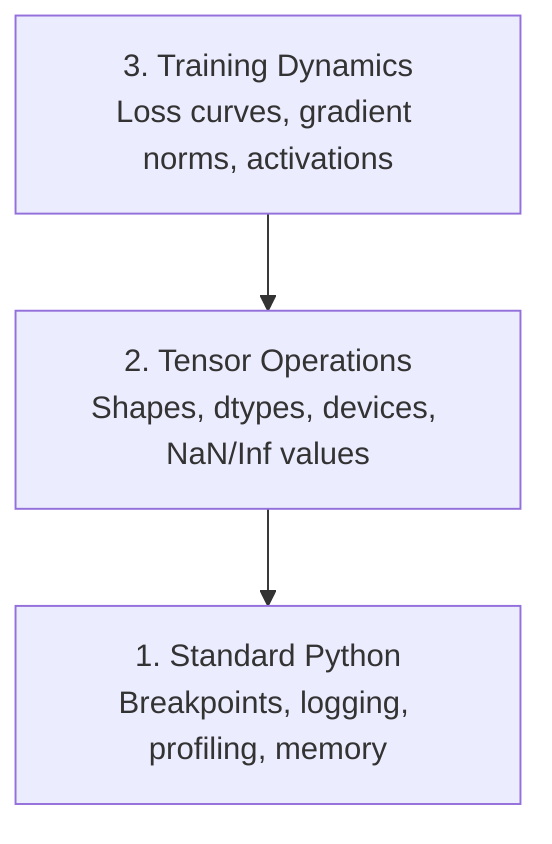

# 调试与性能分析

> 最糟糕的AI错误不会崩溃。它们会在垃圾数据上默默训练，并报告一条漂亮的损失曲线。

**类型:** 构建  
**语言:** Python  
**先修知识:** 第一课（开发环境），基础的PyTorch熟悉度  
**时长:** 约60分钟  

## 学习目标

- 使用条件 `breakpoint()` 和 `debug_print` 在训练中间检查张量形状、数据类型和NaN值
- 使用 `cProfile`、`line_profiler` 和 `tracemalloc` 对训练循环进行性能分析，找出瓶颈
- 检测常见的AI错误：形状不匹配、NaN损失、数据泄漏和错误设备张量
- 设置TensorBoard以可视化损失曲线、权重直方图和梯度分布

## 问题所在

AI代码的失败方式与常规代码不同。一个Web应用会因堆栈跟踪而崩溃。而一个配置错误的训练循环会运行8小时，烧掉200美元的GPU时间，并生成一个预测每个输入均值的模型。代码从未报错。错误可能是张量在错误的设备上、忘了调用 `.detach()`，或者标签泄漏到了特征中。

你需要那些能在这些静默失败浪费你的时间和算力之前就捕获它们的调试工具。

## 概念

AI调试在三个层次上运作：



大多数人直接跳到层次3（盯着TensorBoard）。但80%的AI错误存在于层次1和2。

## 构建它

### 第一部分：打印调试（没错，它管用）

打印调试常被忽视。但它不应该被忽视。对于张量代码，有针对性的打印语句胜过单步调试，因为你需要同时看到形状、数据类型和值范围。

```python
def debug_print(name, tensor):
    print(f"{name}: shape={tensor.shape}, dtype={tensor.dtype}, "
          f"device={tensor.device}, "
          f"min={tensor.min().item():.4f}, max={tensor.max().item():.4f}, "
          f"mean={tensor.mean().item():.4f}, "
          f"has_nan={tensor.isnan().any().item()}")
```

在每个可疑操作后调用此函数。找到错误后，删除打印语句。简单。

### 第二部分：Python调试器（pdb 和 breakpoint）

内置调试器在AI工作中被低估了。将 `breakpoint()` 放入训练循环中，并交互式检查张量。

```python
def training_step(model, batch, criterion, optimizer):
    inputs, labels = batch
    outputs = model(inputs)
    loss = criterion(outputs, labels)

    if loss.item() > 100 or torch.isnan(loss):
        breakpoint()

    loss.backward()
    optimizer.step()
```

当调试器将你带入时，有用的命令：

- `p outputs.shape` 检查形状
- `p loss.item()` 查看损失值
- `p torch.isnan(outputs).sum()` 统计NaN数量
- `p model.fc1.weight.grad` 检查梯度
- `c` 继续，`q` 退出

这是条件调试。只有在看起来不对劲时才停下来。对于10,000步的训练运行，这很关键。

### 第三部分：Python日志记录

当调试超出快速检查时，用日志记录替换打印语句。

```python
import logging

logging.basicConfig(
    level=logging.INFO,
    format="%(asctime)s [%(levelname)s] %(message)s",
    handlers=[
        logging.FileHandler("training.log"),
        logging.StreamHandler()
    ]
)
logger = logging.getLogger(__name__)

logger.info("Starting training: lr=%.4f, batch_size=%d", lr, batch_size)
logger.warning("Loss spike detected: %.4f at step %d", loss.item(), step)
logger.error("NaN loss at step %d, stopping", step)
```

日志记录提供时间戳、严重性级别和文件输出。当训练运行在凌晨3点失败时，你需要一个日志文件，而不是已经滚出屏幕的终端输出。

### 第四部分：对代码段计时

了解时间花在哪里是优化的第一步。

```python
import time

class Timer:
    def __init__(self, name=""):
        self.name = name

    def __enter__(self):
        self.start = time.perf_counter()
        return self

    def __exit__(self, *args):
        elapsed = time.perf_counter() - self.start
        print(f"[{self.name}] {elapsed:.4f}s")

with Timer("data loading"):
    batch = next(dataloader_iter)

with Timer("forward pass"):
    outputs = model(batch)

with Timer("backward pass"):
    loss.backward()
```

常见发现：数据加载占训练时间的60%。解决方案是DataLoader中的 `num_workers > 0`，而不是更快的GPU。

### 第五部分：cProfile 和 line_profiler

当你需要比手动计时器更强大的工具时：

```bash
python -m cProfile -s cumtime train.py
```

这会显示每个函数调用，按累积时间排序。对于逐行性能分析：

```bash
pip install line_profiler
```

```python
@profile
def train_step(model, data, target):
    output = model(data)
    loss = F.cross_entropy(output, target)
    loss.backward()
    return loss

# Run with: kernprof -l -v train.py
```

### 第六部分：内存分析

#### CPU内存与 tracemalloc

```python
import tracemalloc

tracemalloc.start()

# your code here
model = build_model()
data = load_dataset()

snapshot = tracemalloc.take_snapshot()
top_stats = snapshot.statistics("lineno")
for stat in top_stats[:10]:
    print(stat)
```

#### CPU内存与 memory_profiler

```bash
pip install memory_profiler
```

```python
from memory_profiler import profile

@profile
def load_data():
    raw = read_csv("data.csv")       # watch memory jump here
    processed = preprocess(raw)       # and here
    return processed
```

使用 `python -m memory_profiler your_script.py` 运行以查看逐行内存使用情况。

#### GPU内存与 PyTorch

```python
import torch

if torch.cuda.is_available():
    print(torch.cuda.memory_summary())

    print(f"Allocated: {torch.cuda.memory_allocated() / 1e9:.2f} GB")
    print(f"Cached: {torch.cuda.memory_reserved() / 1e9:.2f} GB")
```

当你遇到OOM（内存不足）时：

1. 减小批量大小（始终首先尝试）
2. 使用 `torch.cuda.empty_cache()` 释放缓存内存
3. 对于大型中间变量，使用 `del tensor` 后跟 `torch.cuda.empty_cache()`
4. 使用混合精度（`torch.cuda.amp`）将内存使用减半
5. 对于非常深的模型，使用梯度检查点

### 第七部分：常见AI错误及如何捕获它们

#### 形状不匹配

最频繁的错误。张量形状为 `[batch, features]`，而模型期望 `[batch, channels, height, width]`。

```python
def check_shapes(model, sample_input):
    print(f"Input: {sample_input.shape}")
    hooks = []

    def make_hook(name):
        def hook(module, inp, out):
            in_shape = inp[0].shape if isinstance(inp, tuple) else inp.shape
            out_shape = out.shape if hasattr(out, "shape") else type(out)
            print(f"  {name}: {in_shape} -> {out_shape}")
        return hook

    for name, module in model.named_modules():
        hooks.append(module.register_forward_hook(make_hook(name)))

    with torch.no_grad():
        model(sample_input)

    for h in hooks:
        h.remove()
```

使用一个示例批次运行一次。它会映射模型中每个形状变换。

#### NaN损失

NaN损失意味着某些东西爆炸了。常见原因：

- 学习率过高
- 自定义损失函数中除以零
- 对零或负数取对数
- RNN中的梯度爆炸

```python
def detect_nan(model, loss, step):
    if torch.isnan(loss):
        print(f"NaN loss at step {step}")
        for name, param in model.named_parameters():
            if param.grad is not None:
                if torch.isnan(param.grad).any():
                    print(f"  NaN gradient in {name}")
                if torch.isinf(param.grad).any():
                    print(f"  Inf gradient in {name}")
        return True
    return False
```

#### 数据泄漏

你的模型在测试集上获得了99%的准确率。听起来很棒。但是一个错误。

```python
def check_data_leakage(train_set, test_set, id_column="id"):
    train_ids = set(train_set[id_column].tolist())
    test_ids = set(test_set[id_column].tolist())
    overlap = train_ids & test_ids
    if overlap:
        print(f"DATA LEAKAGE: {len(overlap)} samples in both train and test")
        return True
    return False
```

还要检查时间泄漏：使用未来数据预测过去。在分割之前按时间戳排序。

#### 错误设备

不同设备（CPU与GPU）上的张量会导致运行时错误。但有时一个张量静静地留在CPU上，而其他所有都在GPU上，训练就会运行得很慢。

```python
def check_devices(model, *tensors):
    model_device = next(model.parameters()).device
    print(f"Model device: {model_device}")
    for i, t in enumerate(tensors):
        if t.device != model_device:
            print(f"  WARNING: tensor {i} on {t.device}, model on {model_device}")
```

### 第八部分：TensorBoard基础

TensorBoard向你展示训练过程中随时间发生的情况。

```bash
pip install tensorboard
```

```python
from torch.utils.tensorboard import SummaryWriter

writer = SummaryWriter("runs/experiment_1")

for step in range(num_steps):
    loss = train_step(model, batch)

    writer.add_scalar("loss/train", loss.item(), step)
    writer.add_scalar("lr", optimizer.param_groups[0]["lr"], step)

    if step % 100 == 0:
        for name, param in model.named_parameters():
            writer.add_histogram(f"weights/{name}", param, step)
            if param.grad is not None:
                writer.add_histogram(f"grads/{name}", param.grad, step)

writer.close()
```

启动它：

```bash
tensorboard --logdir=runs
```

要查看什么：

- **损失不下降**：学习率过低，或模型架构问题
- **损失剧烈振荡**：学习率过高
- **损失变成NaN**：数值不稳定（参见上面的NaN部分）
- **训练损失下降，验证损失上升**：过拟合
- **权重直方图坍塌到零**：梯度消失
- **梯度直方图爆炸**：需要梯度裁剪

### 第九部分：VS Code调试器

对于交互式调试，使用 `launch.json` 配置VS Code：

```json
{
    "version": "0.2.0",
    "configurations": [
        {
            "name": "Debug Training",
            "type": "debugpy",
            "request": "launch",
            "program": "${file}",
            "console": "integratedTerminal",
            "justMyCode": false
        }
    ]
}
```

通过点击行号区域设置断点。使用变量面板检查张量属性。调试控制台允许你执行任意Python表达式。

适用于逐步执行数据预处理流水线，你想要查看每个变换。

## 使用它

以下调试工作流程能够捕获大多数AI错误：

1. **训练前**：使用一个示例批次运行 `check_shapes`。确认输入和输出维度与预期一致。
2. **前10步**：对损失、输出和梯度使用 `debug_print`。确认没有NaN且值在合理范围内。
3. **训练期间**：记录损失、学习率和梯度范数。使用TensorBoard进行可视化。
4. **当出现问题**：在失败点放置 `breakpoint()`。交互式检查张量。
5. **性能优化**：对数据加载、前向传播和反向传播进行计时。如果接近OOM，则分析内存。

## 交付它

运行调试工具包脚本：

```bash
python phases/00-setup-and-tooling/12-debugging-and-profiling/code/debug_tools.py
```

查看 `outputs/prompt-debug-ai-code.md` 获取有助于诊断AI特定错误的提示。

## 练习

1. 运行 `debug_tools.py` 并通读每个部分的输出。修改虚拟模型以引入NaN（提示：在前向传播中除以零）并观察检测器捕获它。
2. 使用 `cProfile` 对训练循环进行性能分析，并识别最慢的函数。
3. 使用 `tracemalloc` 找出数据加载流水线中哪一行分配了最多的内存。
4. 为一个简单的训练运行设置TensorBoard，并判断模型是否过拟合。
5. 在训练循环内部使用 `breakpoint()`。练习从调试器提示符检查张量形状、设备和梯度值。
