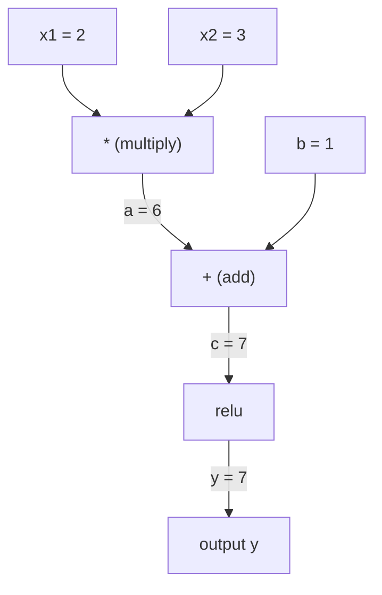
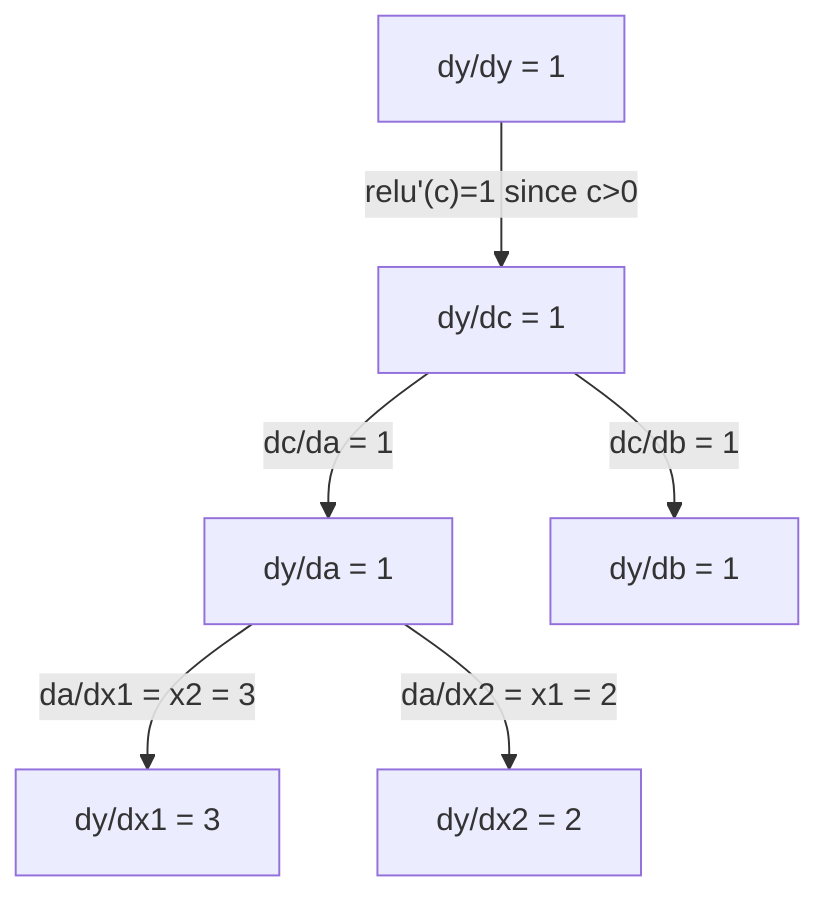

# 链式法则 & 自动微分

> 链式法则是每一个会学习的神经网络背后的引擎。

**类型：** 构建  
**语言：** Python  
**前置知识：** 阶段 1，第 04 课（导数与梯度）  
**时间：** ~90 分钟

## 学习目标

- 构建一个最小的自动求导引擎（Value 类），记录运算并通过反向模式自动微分计算梯度
- 使用拓扑排序实现计算图上的前向传播和反向传播
- 仅使用手写的自动求导引擎构造并训练一个多层感知机解决 XOR 问题
- 通过数值有限差分进行梯度检查，验证自动微分的正确性

## 问题

你可以计算简单函数的导数。但神经网络不是简单函数。它是数百个函数复合在一起：矩阵乘法、加偏置、应用激活、再次矩阵乘法、softmax、交叉熵损失。输出是函数的函数的函数。

要训练网络，你需要损失相对于每一个权重的梯度。对数百万个参数手工计算是不可能的。用数值方法（有限差分）又太慢。

链式法则提供了数学基础。自动微分提供了算法。两者结合让你能够在正比于单次前向传播的时间内，计算任意函数复合的精确梯度。

这就是 PyTorch、TensorFlow 和 JAX 的工作原理。你将从头构建一个微型版本。

## 概念

### 链式法则

如果 `y = f(g(x))`，那么 `y` 对 `x` 的导数为：

```
dy/dx = dy/dg * dg/dx = f'(g(x)) * g'(x)
```

沿着链乘以导数。每一个环节贡献它的局部导数。

例子：`y = sin(x^2)`

```
g(x) = x^2       g'(x) = 2x
f(g) = sin(g)     f'(g) = cos(g)

dy/dx = cos(x^2) * 2x
```

对于更深的复合，链会延伸：

```
y = f(g(h(x)))

dy/dx = f'(g(h(x))) * g'(h(x)) * h'(x)
```

神经网络中的每一层都是这个链中的一个环节。

### 计算图

计算图让链式法则变得可视化。每一个运算成为一个节点。数据向前流过图。梯度向后流动。

**前向传播（计算数值）：**



**反向传播（计算梯度）：**



反向传播在每个节点应用链式法则，将梯度从输出传播到输入。

### 前向模式与反向模式

通过图应用链式法则有两种方式。

**前向模式**从输入开始，向前推动导数。它计算 `dx/dx = 1` 并通过每个运算传播。适用于输入少、输出多的情况。

```
Forward mode: seed dx/dx = 1, propagate forward

  x = 2       (dx/dx = 1)
  a = x^2     (da/dx = 2x = 4)
  y = sin(a)  (dy/dx = cos(a) * da/dx = cos(4) * 4 = -2.615)
```

**反向模式**从输出开始，向后拉动梯度。它计算 `dy/dy = 1` 并通过每个运算反向传播。适用于输入多、输出少的情况。

```
Reverse mode: seed dy/dy = 1, propagate backward

  y = sin(a)  (dy/dy = 1)
  a = x^2     (dy/da = cos(a) = cos(4) = -0.654)
  x = 2       (dy/dx = dy/da * da/dx = -0.654 * 4 = -2.615)
```

神经网络有数百万个输入（权重）和一个输出（损失）。反向模式只需一次反向传播就能计算所有梯度。这就是反向传播使用反向模式的原因。

| 模式 | 种子 | 方向 | 最佳适用场景 |
|------|------|------|-------------|
| 前向 | `dx_i/dx_i = 1` | 输入到输出 | 输入少，输出多 |
| 反向 | `dy/dy = 1` | 输出到输入 | 输入多，输出少（神经网络） |

### 对偶数的前向模式

前向模式可以用对偶数优雅地实现。对偶数具有 `a + b*epsilon` 的形式，其中 `epsilon^2 = 0`。

```
Dual number: (value, derivative)

(2, 1) means: value is 2, derivative w.r.t. x is 1

Arithmetic rules:
  (a, a') + (b, b') = (a+b, a'+b')
  (a, a') * (b, b') = (a*b, a'*b + a*b')
  sin(a, a')         = (sin(a), cos(a)*a')
```

将输入变量以导数 1 初始化。导数会自动通过每个运算传播。

### 构建自动求导引擎

一个自动求导引擎需要三样东西：

1. **值包装。** 将每个数字包装在一个对象中，该对象存储它的值和梯度。
2. **图记录。** 每个运算记录其输入和局部梯度函数。
3. **反向传播。** 对图进行拓扑排序，然后反向遍历，在每个节点应用链式法则。

这正是 PyTorch 的 `autograd` 所做的。`torch.Tensor` 类包装值，当 `requires_grad=True` 时记录运算，当你调用 `.backward()` 时计算梯度。

### PyTorch 自动求导的内部工作原理

当你编写 PyTorch 代码时：

```python
x = torch.tensor(2.0, requires_grad=True)
y = x ** 2 + 3 * x + 1
y.backward()
print(x.grad)  # 7.0 = 2*x + 3 = 2*2 + 3
```

PyTorch 内部：

1. 为 `x` 创建一个 `requires_grad=True` 的 `Tensor` 节点
2. 每个运算（`**`、`*`、`+`）创建一个新节点并记录反向函数
3. `y.backward()` 触发通过记录图的反向模式自动微分
4. 每个节点的 `grad_fn` 计算局部梯度并将其传递给父节点
5. 梯度通过加法（而非替换）累积在 `.grad` 属性中

图是动态的（定义即运行）。每次前向传播都会构建一个新图。这就是为什么 PyTorch 支持模型内部的控制流（if/else、循环）。

## 动手构建

### 步骤 1：Value 类

```python
class Value:
    def __init__(self, data, children=(), op=''):
        self.data = data
        self.grad = 0.0
        self._backward = lambda: None
        self._prev = set(children)
        self._op = op

    def __repr__(self):
        return f"Value(data={self.data:.4f}, grad={self.grad:.4f})"
```

每个 `Value` 存储其数值数据、梯度（初始为零）、反向函数以及产生它的子节点指针。

### 步骤 2：带梯度跟踪的算术运算

```python
    def __add__(self, other):
        other = other if isinstance(other, Value) else Value(other)
        out = Value(self.data + other.data, (self, other), '+')
        def _backward():
            self.grad += out.grad
            other.grad += out.grad
        out._backward = _backward
        return out

    def __mul__(self, other):
        other = other if isinstance(other, Value) else Value(other)
        out = Value(self.data * other.data, (self, other), '*')
        def _backward():
            self.grad += other.data * out.grad
            other.grad += self.data * out.grad
        out._backward = _backward
        return out

    def relu(self):
        out = Value(max(0, self.data), (self,), 'relu')
        def _backward():
            self.grad += (1.0 if out.data > 0 else 0.0) * out.grad
        out._backward = _backward
        return out
```

每个运算创建一个闭包，知道如何计算局部梯度并乘以上游梯度（`out.grad`）。`+=` 处理一个值在多个运算中被使用的情况。

### 步骤 3：反向传播

```python
    def backward(self):
        topo = []
        visited = set()
        def build_topo(v):
            if v not in visited:
                visited.add(v)
                for child in v._prev:
                    build_topo(child)
                topo.append(v)
        build_topo(self)

        self.grad = 1.0
        for v in reversed(topo):
            v._backward()
```

拓扑排序确保每个节点的梯度在传播到其子节点之前已经完全计算好。种子梯度为 1.0（dy/dy = 1）。

### 步骤 4：更完整的引擎所需的更多运算

基本的 Value 类处理加法、乘法和 relu。一个真正的自动求导引擎需要更多。以下是构建神经网络所需的运算：

```python
    def __neg__(self):
        return self * -1

    def __sub__(self, other):
        return self + (-other)

    def __radd__(self, other):
        return self + other

    def __rmul__(self, other):
        return self * other

    def __rsub__(self, other):
        return other + (-self)

    def __pow__(self, n):
        out = Value(self.data ** n, (self,), f'**{n}')
        def _backward():
            self.grad += n * (self.data ** (n - 1)) * out.grad
        out._backward = _backward
        return out

    def __truediv__(self, other):
        return self * (other ** -1) if isinstance(other, Value) else self * (Value(other) ** -1)

    def exp(self):
        import math
        e = math.exp(self.data)
        out = Value(e, (self,), 'exp')
        def _backward():
            self.grad += e * out.grad
        out._backward = _backward
        return out

    def log(self):
        import math
        out = Value(math.log(self.data), (self,), 'log')
        def _backward():
            self.grad += (1.0 / self.data) * out.grad
        out._backward = _backward
        return out

    def tanh(self):
        import math
        t = math.tanh(self.data)
        out = Value(t, (self,), 'tanh')
        def _backward():
            self.grad += (1 - t ** 2) * out.grad
        out._backward = _backward
        return out
```

**每个运算的重要性：**

| 运算 | 反向规则 | 用于 |
|------|----------|------|
| `__sub__` | 复用 add + neg | 损失计算（pred - target） |
| `__pow__` | n * x^(n-1) | 多项式激活函数、MSE（error^2） |
| `__truediv__` | 复用 mul + pow(-1) | 归一化、学习率缩放 |
| `exp` | exp(x) * upstream | Softmax、对数似然 |
| `log` | (1/x) * upstream | 交叉熵损失、对数概率 |
| `tanh` | (1 - tanh^2) * upstream | 经典激活函数 |

巧妙之处：`__sub__` 和 `__truediv__` 是用现有运算定义的。它们通过链式法则在底层 add/mul/pow 运算上复合，从而免费获得正确的梯度。

### 步骤 5：从头实现迷你 MLP

有了完整的 Value 类，你就可以构建神经网络。没有 PyTorch。没有 NumPy。只有 Value 和链式法则。

```python
import random

class Neuron:
    def __init__(self, n_inputs):
        self.w = [Value(random.uniform(-1, 1)) for _ in range(n_inputs)]
        self.b = Value(0.0)

    def __call__(self, x):
        act = sum((wi * xi for wi, xi in zip(self.w, x)), self.b)
        return act.tanh()

    def parameters(self):
        return self.w + [self.b]

class Layer:
    def __init__(self, n_inputs, n_outputs):
        self.neurons = [Neuron(n_inputs) for _ in range(n_outputs)]

    def __call__(self, x):
        return [n(x) for n in self.neurons]

    def parameters(self):
        return [p for n in self.neurons for p in n.parameters()]

class MLP:
    def __init__(self, sizes):
        self.layers = [Layer(sizes[i], sizes[i+1]) for i in range(len(sizes)-1)]

    def __call__(self, x):
        for layer in self.layers:
            x = layer(x)
        return x[0] if len(x) == 1 else x

    def parameters(self):
        return [p for layer in self.layers for p in layer.parameters()]
```

一个 `Neuron` 计算 `tanh(w1*x1 + w2*x2 + ... + b)`。一个 `Layer` 是一组神经元。一个 `MLP` 堆叠多个层。每个权重是一个 `Value`，因此调用 `loss.backward()` 会将梯度传播到每个参数。

**在 XOR 上训练：**

```python
random.seed(42)
model = MLP([2, 4, 1])  # 2 inputs, 4 hidden neurons, 1 output

xs = [[0, 0], [0, 1], [1, 0], [1, 1]]
ys = [-1, 1, 1, -1]  # XOR pattern (using -1/1 for tanh)

for step in range(100):
    preds = [model(x) for x in xs]
    loss = sum((p - y) ** 2 for p, y in zip(preds, ys))

    for p in model.parameters():
        p.grad = 0.0
    loss.backward()

    lr = 0.05
    for p in model.parameters():
        p.data -= lr * p.grad

    if step % 20 == 0:
        print(f"step {step:3d}  loss = {loss.data:.4f}")

print("\nPredictions after training:")
for x, y in zip(xs, ys):
    print(f"  input={x}  target={y:2d}  pred={model(x).data:6.3f}")
```

这就是 micrograd。一个完整的神经网络训练循环，用纯 Python 实现，带有自动微分。每个商业深度学习框架都以大规模的方式做着同样的事情。

### 步骤 6：梯度检查

如何知道你的自动微分是正确的？将其与数值导数进行比较。这就是梯度检查。

```python
def gradient_check(build_expr, x_val, h=1e-7):
    x = Value(x_val)
    y = build_expr(x)
    y.backward()
    autodiff_grad = x.grad

    y_plus = build_expr(Value(x_val + h)).data
    y_minus = build_expr(Value(x_val - h)).data
    numerical_grad = (y_plus - y_minus) / (2 * h)

    diff = abs(autodiff_grad - numerical_grad)
    return autodiff_grad, numerical_grad, diff
```

在一个复杂表达式上测试：

```python
def expr(x):
    return (x ** 3 + x * 2 + 1).tanh()

ad, num, diff = gradient_check(expr, 0.5)
print(f"Autodiff:  {ad:.8f}")
print(f"Numerical: {num:.8f}")
print(f"Difference: {diff:.2e}")
# Difference should be < 1e-5
```

梯度检查在实现新运算时至关重要。如果你的反向传播有 bug，数值检查会捕捉到。每个严肃的深度学习实现都会在开发期间运行梯度检查。

**何时使用梯度检查：**

| 情况 | 进行梯度检查？ |
|------|---------------|
| 向自动求导引擎添加新运算 | 是，始终 |
| 调试不收敛的训练循环 | 是，先检查梯度 |
| 生产训练 | 否，太慢（每个参数需要 2 次前向传播） |
| 自动求导代码的单元测试 | 是，自动化 |

### 步骤 7：与手动计算对比验证

```python
x1 = Value(2.0)
x2 = Value(3.0)
a = x1 * x2          # a = 6.0
b = a + Value(1.0)    # b = 7.0
y = b.relu()          # y = 7.0

y.backward()

print(f"y = {y.data}")          # 7.0
print(f"dy/dx1 = {x1.grad}")   # 3.0 (= x2)
print(f"dy/dx2 = {x2.grad}")   # 2.0 (= x1)
```

手动检查：`y = relu(x1*x2 + 1)`。由于 `x1*x2 + 1 = 7 > 0`，relu 是恒等函数。
`dy/dx1 = x2 = 3`。`dy/dx2 = x1 = 2`。引擎匹配。

## 使用它

### 与 PyTorch 对比验证

```python
import torch

x1 = torch.tensor(2.0, requires_grad=True)
x2 = torch.tensor(3.0, requires_grad=True)
a = x1 * x2
b = a + 1.0
y = torch.relu(b)
y.backward()

print(f"PyTorch dy/dx1 = {x1.grad.item()}")  # 3.0
print(f"PyTorch dy/dx2 = {x2.grad.item()}")  # 2.0
```

相同的梯度。你的引擎计算结果与 PyTorch 相同，因为数学原理相同：通过链式法则的反向模式自动微分。

### 一个更复杂的表达式

```python
a = Value(2.0)
b = Value(-3.0)
c = Value(10.0)
f = (a * b + c).relu()  # relu(2*(-3) + 10) = relu(4) = 4

f.backward()
print(f"df/da = {a.grad}")  # -3.0 (= b)
print(f"df/db = {b.grad}")  #  2.0 (= a)
print(f"df/dc = {c.grad}")  #  1.0
```

## 交付成果

本课程产出：
- `outputs/skill-autodiff.md` —— 一项关于构建和调试自动求导系统的技能
- `code/autodiff.py` —— 一个你可以扩展的最小自动求导引擎

此处构建的 Value 类将在阶段 3 的神经网络训练循环中作为基础。

## 练习

1. 向 Value 类添加 `__pow__`，使你能够计算 `x ** n`。验证在 `x=2` 处 `d/dx(x^3)` 等于 `12.0`。

2. 将 `tanh` 作为激活函数添加。验证 `tanh'(0) = 1` 且 `tanh'(2) ≈ 0.0707`。

3. 为单个神经元构建计算图：`y = relu(w1*x1 + w2*x2 + b)`。计算所有五个梯度，并与 PyTorch 对比验证。

4. 使用对偶数实现前向模式自动微分。创建一个 `Dual` 类，并验证它给出与你的反向模式引擎相同的导数。

## 关键术语

| 术语 | 人们常说的 | 实际含义 |
|------|------------|----------|
| 链式法则 | "将导数相乘" | 复合函数的导数等于每个函数局部导数的乘积，并在正确的点求值 |
| 计算图 | "网络图" | 一个有向无环图，其中节点是运算，边携带数值（前向）或梯度（反向） |
| 前向模式 | "向前推动导数" | 从输入到输出传播导数的自动微分。每个输入变量一次传播。 |
| 反向模式 | "反向传播" | 从输出到输入传播梯度的自动微分。每个输出变量一次传播。 |
| 自动求导 | "自动梯度" | 记录值的运算、构建图，并通过链式法则计算精确梯度的系统 |
| 对偶数 | "值加导数" | 形式为 a + b*epsilon（epsilon^2 = 0）的数，通过算术携带导数信息 |
| 拓扑排序 | "依赖顺序" | 对图节点排序，使得每个节点出现在其所有依赖之后。正确的梯度传播需要。 |
| 梯度累积 | "相加而非替换" | 当一个值馈入多个运算时，它的梯度是所有传入梯度贡献之和 |
| 动态图 | "定义即运行" | 每次前向传播重新构建计算图，允许模型内部使用 Python 控制流（PyTorch 风格） |
| 梯度检查 | "数值验证" | 将自动微分梯度与数值有限差分梯度进行比较以验证正确性。调试中至关重要。 |
| MLP | "多层感知机" | 具有一个或多个隐藏层的神经网络。每个神经元计算加权和加偏置，然后应用激活函数。 |
| 神经元 | "加权和 + 激活" | 基本单元：输出 = activation(w1*x1 + w2*x2 + ... + b)。权重和偏置是可学习参数。 |

## 延伸阅读

- [3Blue1Brown：反向传播的微积分](https://www.youtube.com/watch?v=tIeHLnjs5U8) —— 链式法则在神经网络中的可视化解释
- [PyTorch Autograd 机制](https://pytorch.org/docs/stable/notes/autograd.html) —— 真实系统的工作原理
- [Baydin 等人，Machine Learning 中的自动微分：综述](https://arxiv.org/abs/1502.05767) —— 综合参考文献
