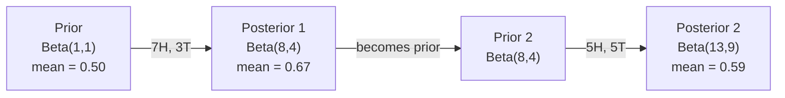

# 贝叶斯定理

> 概率论关乎你的预期。贝叶斯定理关乎你的学习。

**类型：** 构建  
**语言：** Python  
**前置知识：** 第一阶段，第06课（概率基础）  
**时长：** ~75分钟  

## 学习目标

- 应用贝叶斯定理，根据先验概率、似然和证据计算后验概率
- 从头构建一个朴素贝叶斯文本分类器，包含拉普拉斯平滑和对数空间计算
- 比较极大似然估计和最大后验估计，并解释MAP如何对应L2正则化
- 使用Beta-二项共轭先验实现序贯贝叶斯更新，用于A/B测试

## 问题

某项医学检测的准确率为99%。你检测结果为阳性。你实际患病的概率是多少？

大多数人会说99%。真正的答案取决于这种疾病的罕见程度。如果1万人中有1人患病，阳性结果仅意味着大约1%的概率你真的生病了。其余99%的阳性结果来自健康人群的误报。

这不是一个脑筋急转弯。这就是贝叶斯定理。每一个垃圾邮件过滤器、每一项医学诊断、每一个量化不确定性的机器学习模型都在使用这种精确的推理。你从一个信念开始。你观察到证据。然后你更新它。

如果你构建ML系统而不理解这一点，你将错误解读模型输出、设定不当的阈值，并交付过度自信的预测。

## 概念

### 从联合概率到贝叶斯

你已经在第06课中知道条件概率是：

```
P(A|B) = P(A and B) / P(B)
```

对称地：

```
P(B|A) = P(A and B) / P(A)
```

这两个表达式共享相同的分子：P(A and B)。将它们相等并重新排列：

```
P(A and B) = P(A|B) * P(B) = P(B|A) * P(A)

Therefore:

P(A|B) = P(B|A) * P(A) / P(B)
```

这就是贝叶斯定理。四个量，一个方程。

### 四个组成部分

| 部分 | 名称 | 含义 |
|------|------|------|
| P(A\|B) | 后验概率 | 看到证据B后，你对A的更新信念 |
| P(B\|A) | 似然 | 如果A为真，证据B出现的可能性有多大 |
| P(A) | 先验概率 | 在看到任何证据之前，你对A的信念 |
| P(B) | 证据 | 在所有可能情况下看到B的总概率 |

证据项P(B)充当归一化因子。你可以用全概率公式展开它：

```
P(B) = P(B|A) * P(A) + P(B|not A) * P(not A)
```

### 医学检测示例

一种疾病影响1/10000的人。检测准确率为99%（能检测出99%的病患，假阳性率1%）。

```
P(sick)          = 0.0001     (prior: disease is rare)
P(positive|sick) = 0.99       (likelihood: test catches it)
P(positive|healthy) = 0.01    (false positive rate)

P(positive) = P(positive|sick) * P(sick) + P(positive|healthy) * P(healthy)
            = 0.99 * 0.0001 + 0.01 * 0.9999
            = 0.000099 + 0.009999
            = 0.010098

P(sick|positive) = P(positive|sick) * P(sick) / P(positive)
                 = 0.99 * 0.0001 / 0.010098
                 = 0.0098
                 = 0.98%
```

不到1%。先验概率占主导地位。当一种条件罕见时，即使准确的检测也会产生大部分假阳性。这就是医生需要确认检测的原因。

### 垃圾邮件过滤器示例

你收到一封包含单词"lottery"的邮件。它是垃圾邮件吗？

```
P(spam)                = 0.3      (30% of email is spam)
P("lottery"|spam)      = 0.05     (5% of spam emails contain "lottery")
P("lottery"|not spam)  = 0.001    (0.1% of legitimate emails contain "lottery")

P("lottery") = 0.05 * 0.3 + 0.001 * 0.7
             = 0.015 + 0.0007
             = 0.0157

P(spam|"lottery") = 0.05 * 0.3 / 0.0157
                  = 0.955
                  = 95.5%
```

一个单词就将概率从30%提升到95.5%。真正的垃圾邮件过滤器会同时对数百个单词应用贝叶斯。

### 朴素贝叶斯：独立性假设

朴素贝叶斯通过假设所有特征在给定类别条件下条件独立来将其扩展到多个特征：

```
P(class | feature_1, feature_2, ..., feature_n)
  = P(class) * P(feature_1|class) * P(feature_2|class) * ... * P(feature_n|class)
    / P(feature_1, feature_2, ..., feature_n)
```

"朴素"的部分就是独立性假设。在文本中，单词的出现并不是独立的（"New"和"York"是相关的）。但这个假设在实践中出乎意料地好，因为分类器只需要对类别进行排序，而不需要生成校准的概率。

由于分母对所有类别都相同，你可以跳过它，只比较分子：

```
score(class) = P(class) * product of P(feature_i | class)
```

选择得分最高的类别。

### 极大似然估计

如何从训练数据中获得P(feature|class)？计数。

```
P("free"|spam) = (number of spam emails containing "free") / (total spam emails)
```

这就是极大似然估计：选择使得观测数据最有可能的参数值。你最大化似然函数，对于离散计数而言，它简化为相对频率。

问题：如果某个单词在训练期间从未出现在垃圾邮件中，MLE会赋予它零概率。一个看不见的单词就毁掉了整个乘积。用拉普拉斯平滑修复它：

```
P(word|class) = (count(word, class) + 1) / (total_words_in_class + vocabulary_size)
```

给每个计数加1，确保没有任何概率为零。

### 最大后验估计

MLE问：什么参数最大化P(data|parameters)？

MAP问：什么参数最大化P(parameters|data)？

根据贝叶斯定理：

```
P(parameters|data) proportional to P(data|parameters) * P(parameters)
```

MAP在参数本身上增加了一个先验。如果你认为参数应该很小，你就将其编码为一个惩罚大数值的先验。这在机器学习中与L2正则化完全相同。岭回归中的"岭"惩罚本质上就是权重的高斯先验。

| 估计方法 | 优化目标 | ML等价物 |
|------------|-----------|---------------|
| MLE | P(data\|params) | 无正则化训练 |
| MAP | P(data\|params) * P(params) | L2 / L1 正则化 |

### 贝叶斯派 vs 频率派：实际区别

频率派将参数视为固定的未知量。他们问："如果我将这个实验重复很多次，会发生什么？"

贝叶斯派将参数视为分布。他们问："根据我已观察到的情况，我对参数有什么信念？"

对于构建ML系统而言，实际区别：

| 方面 | 频率派 | 贝叶斯派 |
|--------|-------------|----------|
| 输出 | 点估计 | 值的分布 |
| 不确定性 | 置信区间（关于过程） | 可信区间（关于参数） |
| 小数据 | 可能过拟合 | 先验起到正则化作用 |
| 计算 | 通常更快 | 通常需要采样（MCMC） |

大多数生产环境的ML是频率派的（SGD，点估计）。当需要校准的不确定性（医疗决策、安全关键系统）或数据稀缺（少样本学习、冷启动）时，贝叶斯方法大放异彩。

### 为什么贝叶斯思维对ML很重要

这种联系比类比更深刻：

**先验就是正则化。** 权重上的高斯先验等价于L2正则化。拉普拉斯先验等价于L1。每当你添加一个正则化项时，你就在做出一个关于期望参数值的贝叶斯声明。

**后验是不确定性。** 单个预测概率并不能告诉你模型对该估计有多自信。贝叶斯方法提供了一个分布："我认为P(垃圾邮件)在0.8到0.95之间。"

**贝叶斯更新是在线学习。** 今天的后验成为明天的先验。当你的模型看到新数据时，它会增量地更新信念，而不是从头重新训练。

**模型比较是贝叶斯式的。** 贝叶斯信息准则、边际似然和贝叶斯因子都使用贝叶斯推理在没有过拟合的情况下选择模型。

## 构建它

### 第1步：贝叶斯定理函数

```python
def bayes(prior, likelihood, false_positive_rate):
    evidence = likelihood * prior + false_positive_rate * (1 - prior)
    posterior = likelihood * prior / evidence
    return posterior

result = bayes(prior=0.0001, likelihood=0.99, false_positive_rate=0.01)
print(f"P(sick|positive) = {result:.4f}")
```

### 第2步：朴素贝叶斯分类器

```python
import math
from collections import defaultdict

class NaiveBayes:
    def __init__(self, smoothing=1.0):
        self.smoothing = smoothing
        self.class_counts = defaultdict(int)
        self.word_counts = defaultdict(lambda: defaultdict(int))
        self.class_word_totals = defaultdict(int)
        self.vocab = set()

    def train(self, documents, labels):
        for doc, label in zip(documents, labels):
            self.class_counts[label] += 1
            words = doc.lower().split()
            for word in words:
                self.word_counts[label][word] += 1
                self.class_word_totals[label] += 1
                self.vocab.add(word)

    def predict(self, document):
        words = document.lower().split()
        total_docs = sum(self.class_counts.values())
        vocab_size = len(self.vocab)
        best_class = None
        best_score = float("-inf")
        for cls in self.class_counts:
            score = math.log(self.class_counts[cls] / total_docs)
            for word in words:
                count = self.word_counts[cls].get(word, 0)
                total = self.class_word_totals[cls]
                score += math.log((count + self.smoothing) / (total + self.smoothing * vocab_size))
            if score > best_score:
                best_score = score
                best_class = cls
        return best_class
```

对数概率防止下溢。将许多小概率相乘会产生对于浮点数而言过小的数字。对数概率求和是数值稳定的，并且在数学上等价。

### 第3步：在垃圾邮件数据上训练

```python
train_docs = [
    "win free money now",
    "free lottery ticket winner",
    "claim your prize today free",
    "urgent offer free cash",
    "congratulations you won free",
    "meeting tomorrow at noon",
    "project update attached",
    "can we schedule a call",
    "quarterly report review",
    "lunch on thursday sounds good",
    "team standup notes attached",
    "please review the pull request",
]

train_labels = [
    "spam", "spam", "spam", "spam", "spam",
    "ham", "ham", "ham", "ham", "ham", "ham", "ham",
]

classifier = NaiveBayes()
classifier.train(train_docs, train_labels)

test_messages = [
    "free money waiting for you",
    "meeting rescheduled to friday",
    "you won a free prize",
    "please review the attached report",
]

for msg in test_messages:
    print(f"  '{msg}' -> {classifier.predict(msg)}")
```

### 第4步：检查学到的概率

```python
def show_top_words(classifier, cls, n=5):
    vocab_size = len(classifier.vocab)
    total = classifier.class_word_totals[cls]
    probs = {}
    for word in classifier.vocab:
        count = classifier.word_counts[cls].get(word, 0)
        probs[word] = (count + classifier.smoothing) / (total + classifier.smoothing * vocab_size)
    sorted_words = sorted(probs.items(), key=lambda x: x[1], reverse=True)
    for word, prob in sorted_words[:n]:
        print(f"    {word}: {prob:.4f}")

print("\nTop spam words:")
show_top_words(classifier, "spam")
print("\nTop ham words:")
show_top_words(classifier, "ham")
```

## 使用它

scikit-learn 提供了生产就绪的朴素贝叶斯实现：

```python
from sklearn.feature_extraction.text import CountVectorizer
from sklearn.naive_bayes import MultinomialNB
from sklearn.metrics import classification_report

vectorizer = CountVectorizer()
X_train = vectorizer.fit_transform(train_docs)
clf = MultinomialNB()
clf.fit(X_train, train_labels)

X_test = vectorizer.transform(test_messages)
predictions = clf.predict(X_test)
for msg, pred in zip(test_messages, predictions):
    print(f"  '{msg}' -> {pred}")
```

相同的算法。CountVectorizer 处理分词和词汇表构建。MultinomialNB 内部处理平滑和对数概率。你从头实现的版本用40行代码做了同样的事情。

## 交付它

这里构建的 NaiveBayes 类展示了完整的流程：分词、带拉普拉斯平滑的概率估计、对数空间预测。`code/bayes.py` 中的代码无需 Python 标准库之外的任何依赖即可端到端运行。

### 共轭先验

当先验和后验属于同一分布族时，该先验被称为"共轭"。这使得贝叶斯更新在代数上非常简洁——你无需数值积分就能得到闭式后验。

| 似然 | 共轭先验 | 后验 | 示例 |
|-----------|----------------|-----------|---------|
| 伯努利 | Beta(a, b) | Beta(a + 成功数, b + 失败数) | 抛硬币偏差估计 |
| 正态（方差已知） | Normal(mu_0, sigma_0) | Normal(加权均值, 更小方差) | 传感器校准 |
| 泊松 | Gamma(a, b) | Gamma(a + 计数之和, b + n) | 到达率建模 |
| 多项分布 | Dirichlet(alpha) | Dirichlet(alpha + 计数) | 主题建模, 语言模型 |

为什么这很重要：没有共轭先验，你需要蒙特卡洛采样或变分推断来近似后验。有了共轭先验，你只需更新两个数字。

Beta 分布是实践中最常见的共轭先验。Beta(a, b) 表示你对一个概率参数的信念。均值为 a/(a+b)。a+b 越大，分布越集中（越有信心的）。

Beta 先验的特殊情况：
- Beta(1, 1) = 均匀分布。你对参数没有任何意见。
- Beta(10, 10) = 在0.5处有峰值。你强烈相信参数接近0.5。
- Beta(1, 10) = 偏向0。你相信参数很小。

更新规则非常简单：

```
Prior:     Beta(a, b)
Data:      s successes, f failures
Posterior: Beta(a + s, b + f)
```

没有积分。没有采样。只是加法。

### 序贯贝叶斯更新

贝叶斯推断天然是序贯的。今天的后验成为明天的先验。这就是真实系统如何无需重新处理所有历史数据就能增量学习的方式。

具体例子：估计一枚硬币是否公平。

**第1天：尚无数据。**
从 Beta(1, 1) 开始——一个均匀先验。你没有任何意见。
- 先验均值：0.5
- 先验在 [0, 1] 上平坦

**第2天：观察到7次正面，3次反面。**
后验 = Beta(1 + 7, 1 + 3) = Beta(8, 4)
- 后验均值：8/12 = 0.667
- 证据表明硬币偏向正面

**第3天：又观察到5次正面，5次反面。**
将昨天的后验作为今天的先验。
后验 = Beta(8 + 5, 4 + 5) = Beta(13, 9)
- 后验均值：13/22 = 0.591
- 平衡的新数据将估计拉回0.5



观测的顺序无关紧要。一次性用所有12个正面和8个反面更新 Beta(1,1) 得到 Beta(13,9)——相同的结果。序贯更新和批次更新在数学上是等价的。但序贯更新让你可以在每一步做出决策，而无需存储原始数据。

这是生产环境ML系统中在线学习的基础。汤普森采样用于强盗问题、增量推荐系统和流式异常检测都使用这种模式。

### 与A/B测试的联系

A/B测试本质上是贝叶斯推断。

设置：你正在测试两种按钮颜色。变体A（蓝色）和变体B（绿色）。你想知道哪个获得更多点击。

贝叶斯A/B测试：

1. **先验。** 对两个变体都从 Beta(1,1) 开始。没有先验偏好。
2. **数据。** 变体A：1000次浏览中50次点击。变体B：1000次浏览中65次点击。
3. **后验。**
   - A: Beta(1 + 50, 1 + 950) = Beta(51, 951). 均值 = 0.051
   - B: Beta(1 + 65, 1 + 935) = Beta(66, 936). 均值 = 0.066
4. **决策。** 计算 P(B > A) —— B的真实转化率高于A的概率。

解析计算 P(B > A) 很困难。但蒙特卡洛方法使其变得简单：

```
1. Draw 100,000 samples from Beta(51, 951)  -> samples_A
2. Draw 100,000 samples from Beta(66, 936)  -> samples_B
3. P(B > A) = fraction of samples where B > A
```

如果 P(B > A) > 0.95，你发布变体B。如果在0.05和0.95之间，你继续收集数据。如果 P(B > A) < 0.05，你发布变体A。

与频率派A/B测试相比的优势：
- 你得到一个直接的概率陈述："B更好的概率是97%"
- 没有p值的混淆。没有"未能拒绝零假设"这样的含糊说法。
- 你可以随时检查结果而不会增加假阳性率（没有"偷看问题"）
- 你可以纳入先验知识（例如，先前的测试表明转化率通常在3-8%之间）

| 方面 | 频率派A/B | 贝叶斯A/B |
|--------|----------------|--------------|
| 输出 | p值 | P(B > A) |
| 解释 | "如果A=B，这个数据有多令人惊讶？" | "B比A好的可能性有多大？" |
| 提前停止 | 增加假阳性 | 任何时刻都是安全的（给定良好选择的先验和正确指定的模型） |
| 先验知识 | 不使用 | 编码为Beta先验 |
| 决策规则 | p < 0.05 | P(B > A) > 阈值 |

## 练习

1. **多次检测。** 一名患者在两次独立的检测中均呈阳性（两次检测准确率均为99%，疾病患病率为1/10000）。两次检测后P(患病)是多少？将第一次检测的后验作为第二次的先验。

2. **平滑的影响。** 使用平滑值0.01、0.1、1.0和10.0运行垃圾邮件分类器。顶部单词的概率如何变化？当平滑=0且出现一个只在正常邮件中出现的单词时会发生什么？

3. **增加特征。** 扩展NaiveBayes类，使其除了单词计数外还使用消息长度（短/长）作为特征。从训练数据中估计P(短|垃圾邮件)和P(短|正常邮件)，并将其纳入预测得分。

4. **手动计算MAP。** 给定观测数据（10次抛硬币中7次正面），使用Beta(2,2)先验计算偏差的MAP估计。将其与MLE估计（7/10）进行比较。

## 关键术语

| 术语 | 人们常说的 | 实际含义 |
|------|----------------|----------------------|
| 先验概率 | "我的初始猜测" | 观测到证据前的P(假设)。在ML中：正则化项。 |
| 似然 | "数据拟合得有多好" | P(证据\|假设)。在特定假设下观测数据出现的可能性。 |
| 后验概率 | "我更新后的信念" | P(假设\|证据)。先验乘以似然，然后归一化。 |
| 证据 | "归一化常数" | 所有假设下的P(数据)。确保后验之和为1。 |
| 朴素贝叶斯 | "那个简单的文本分类器" | 一个分类器，假设在给定类别条件下特征相互独立。尽管假设不成立，但效果很好。 |
| 拉普拉斯平滑 | "加一平滑" | 给每个特征加上一个小计数，以防止未见数据导致的零概率。 |
| 极大似然估计 | "直接用频率" | 选择最大化P(数据\|参数)的参数。无先验。小数据可能过拟合。 |
| 最大后验估计 | "带先验的MLE" | 选择最大化P(数据\|参数) * P(参数)的参数。等价于正则化的MLE。 |
| 对数概率 | "在对数空间中工作" | 使用log(P)而不是P，以避免在相乘许多小概率时发生浮点下溢。 |
| 假阳性 | "错误的警报" | 检测结果为阳性，但真实状态为阴性。导致了基率谬误。 |

## 延伸阅读

- [3Blue1Brown: 贝叶斯定理](https://www.youtube.com/watch?v=HZGCoVF3YvM) - 结合医学检测示例的可视化解释
- [Stanford CS229: 生成学习算法](https://cs229.stanford.edu/notes2022fall/cs229-notes2.pdf) - 朴素贝叶斯及其与判别模型的联系
- [Think Bayes](https://greenteapress.com/wp/think-bayes/) - 免费书籍，使用Python代码的贝叶斯统计
- [scikit-learn 朴素贝叶斯](https://scikit-learn.org/stable/modules/naive_bayes.html) - 生产实现以及何时使用每种变体
