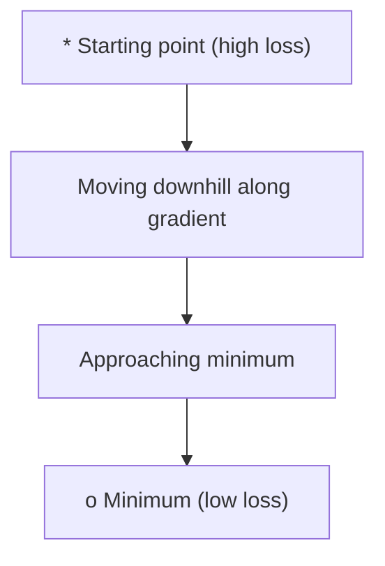
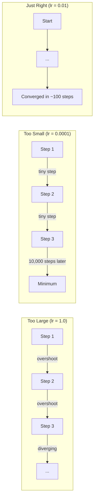
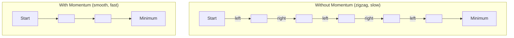
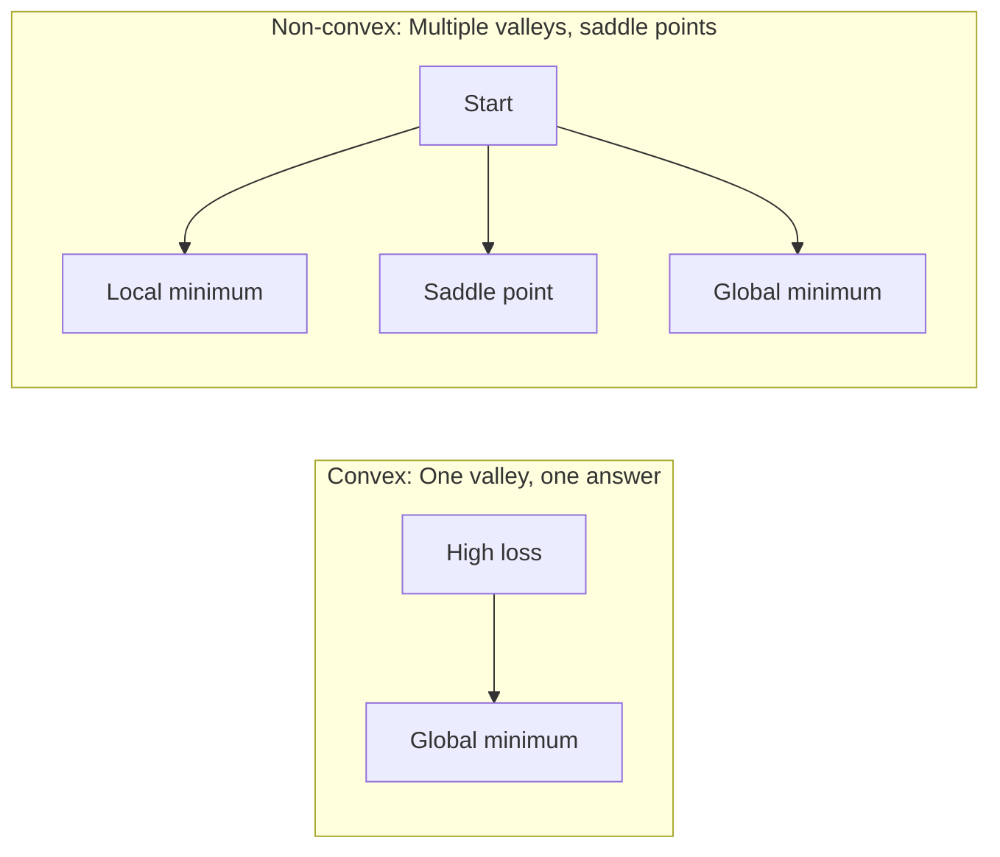
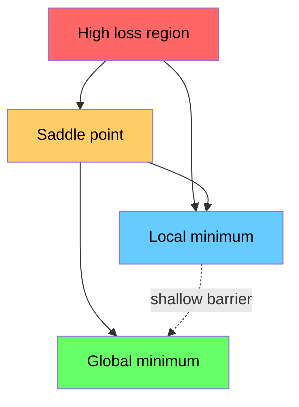

# 优化

> 训练神经网络无非就是寻找山谷的底部。

**类型：** 构建  
**语言：** Python  
**前置知识：** 第一阶段，第 04–05 课（导数、梯度）  
**时间：** 约 75 分钟  

## 学习目标

- 从零实现标准梯度下降、带动量的 SGD 以及 Adam
- 在 Rosenbrock 函数上比较优化器的收敛情况，并解释 Adam 为何能为每个权重自适应学习率
- 区分凸与非凸的损失景观，并解释高维空间中鞍点的作用
- 配置学习率调度（阶梯衰减、余弦退火、预热）以实现训练稳定

## 问题

你有一个损失函数。它告诉你模型有多糟糕。你也有梯度，它告诉你哪个方向会让损失变得更差。现在你需要一个下山策略。

简单的方法：朝着梯度的反方向移动，用某个称为学习率的数值缩放步长。重复。这就是梯度下降，它确实有效。但“有效”是有条件的。学习率太大，你会直接越过山谷，在墙壁之间来回反弹。学习率太小，你会慢慢爬向答案，浪费数千次不必要的步骤。遇到鞍点，即使你尚未找到最小值，也会停止移动。

深度学习中的每个优化器都是在回答同一个问题：如何更快、更可靠地到达山谷底部？

## 概念

### 优化是什么

优化就是找到使函数最小化（或最大化）的输入值。在机器学习中，这个函数就是损失，输入就是模型的权重。训练就是优化。

```
minimize L(w) where:
  L = loss function
  w = model weights (could be millions of parameters)
```

### 梯度下降（标准版）

最简单的优化器。计算损失相对于每个权重的梯度，将每个权重朝其梯度的反方向移动，用学习率缩放步长。

```
w = w - lr * gradient
```

这就是整个算法。一行代码。



### 学习率：最重要的超参数

学习率控制步长。它决定了收敛的一切。



没有公式能直接算出正确的学习率。你需要通过实验来寻找。常见的起点：Adam 用 0.001，带动量的 SGD 用 0.01。

### SGD vs 批量 vs 小批量

标准梯度下降在走一步之前计算整个数据集的梯度。这称为批量梯度下降。它稳定但缓慢。

随机梯度下降（SGD）在单个随机样本上计算梯度并立即更新。它嘈杂但快速。

小批量梯度下降则各取一半：在一小批样本（32、64、128、256 个样本）上计算梯度，然后更新。这正是每个人实际使用的方法。

| 变体 | 批次大小 | 梯度质量 | 每步速度 | 噪声 |
|---------|-----------|-----------------|---------------|-------|
| 批量 GD | 整个数据集 | 精确 | 慢 | 无 |
| SGD | 1 个样本 | 非常嘈杂 | 快 | 高 |
| 小批量 | 32–256 | 良好估计 | 平衡 | 中等 |

SGD 和小批量中的噪声并非 bug。它有助于逃离浅层局部极小点和鞍点。

### 动量：滚下山的球

标准梯度下降只考虑当前梯度。如果梯度呈锯齿状（常见于窄山谷），进展会很慢。动量通过将过去的梯度累积到速度项中来解决此问题。

```
v = beta * v + gradient
w = w - lr * v
```

类比：一个滚下山的球。它不会在每个凸起处停下再重新开始。它在一致的方向上积累速度，并抑制振荡。



`beta`（通常为 0.9）控制要保留多少历史信息。beta 越大，动量越大，路径越平滑，但对方向变化的响应也越慢。

### Adam：自适应学习率

不同的权重需要不同的学习率。一个很少获得大梯度的权重，在其最终获得大梯度时应迈出更大的步子。一个持续获得巨大梯度的权重则应迈出更小的步子。

Adam（自适应矩估计）为每个权重跟踪两个量：

1. 一阶矩（m）：梯度的运行平均值（类似于动量）
2. 二阶矩（v）：梯度平方的运行平均值（梯度大小）

```
m = beta1 * m + (1 - beta1) * gradient
v = beta2 * v + (1 - beta2) * gradient^2

m_hat = m / (1 - beta1^t)    bias correction
v_hat = v / (1 - beta2^t)    bias correction

w = w - lr * m_hat / (sqrt(v_hat) + epsilon)
```

除以 `sqrt(v_hat)` 是关键思想。梯度大的权重会被一个大数除（有效步长小），梯度小的权重会被一个小数除（有效步长大）。每个权重都有自己的自适应学习率。

默认超参数：`lr=0.001, beta1=0.9, beta2=0.999, epsilon=1e-8`。这些默认值对大多数问题都适用。

### 学习率调度

固定的学习率是一种折衷方案。训练初期，你需要大步子以快速推进；训练后期，你需要小步子以在最小值附近微调。

常见调度：

| 调度 | 公式 | 使用场景 |
|----------|---------|----------|
| 阶梯衰减 | 每 N 轮 lr = lr * factor | 简单，手动控制 |
| 指数衰减 | lr = lr_0 * decay^t | 平滑递减 |
| 余弦退火 | lr = lr_min + 0.5 * (lr_max - lr_min) * (1 + cos(pi * t / T)) | Transformer，现代训练 |
| 预热 + 衰减 | 线性上升，然后衰减 | 大型模型，防止初期不稳定 |

### 凸 vs 非凸

凸函数只有一个极小点。梯度下降总能找到它。像 `f(x) = x^2` 这样的二次函数就是凸函数。

神经网络的损失函数是非凸的。它们包含许多局部极小点、鞍点和平坦区域。



实际上，高维神经网络中的局部极小点很少成为问题。大多数局部极小点的损失值都接近全局最小值。鞍点（在某些方向平坦，在某些方向弯曲）才是真正的障碍。动量和来自小批量的噪声有助于逃离它们。

### 损失景观可视化

损失是所有权重的函数。对于一个有 100 万个权重的模型，损失景观存在于 1,000,001 维空间中。我们通过在权重空间中选取两个随机方向，并沿着这些方向绘制损失，从而得到一个二维曲面来可视化。



尖锐的极小点泛化能力差。平坦的极小点泛化能力强。这也是为什么带动量的 SGD 通常在最终测试准确率上优于 Adam：它的噪声阻止了陷入尖锐极小点。

## 动手构建

### 步骤 1：定义一个测试函数

Rosenbrock 函数是一个经典的优化基准。其最小值位于 (1, 1) 处，处于一个狭窄弯曲的山谷中，容易发现但难以跟随。

```
f(x, y) = (1 - x)^2 + 100 * (y - x^2)^2
```

```python
def rosenbrock(params):
    x, y = params
    return (1 - x) ** 2 + 100 * (y - x ** 2) ** 2

def rosenbrock_gradient(params):
    x, y = params
    df_dx = -2 * (1 - x) + 200 * (y - x ** 2) * (-2 * x)
    df_dy = 200 * (y - x ** 2)
    return [df_dx, df_dy]
```

### 步骤 2：标准梯度下降

```python
class GradientDescent:
    def __init__(self, lr=0.001):
        self.lr = lr

    def step(self, params, grads):
        return [p - self.lr * g for p, g in zip(params, grads)]
```

### 步骤 3：带动量的 SGD

```python
class SGDMomentum:
    def __init__(self, lr=0.001, momentum=0.9):
        self.lr = lr
        self.momentum = momentum
        self.velocity = None

    def step(self, params, grads):
        if self.velocity is None:
            self.velocity = [0.0] * len(params)
        self.velocity = [
            self.momentum * v + g
            for v, g in zip(self.velocity, grads)
        ]
        return [p - self.lr * v for p, v in zip(params, self.velocity)]
```

### 步骤 4：Adam

```python
class Adam:
    def __init__(self, lr=0.001, beta1=0.9, beta2=0.999, epsilon=1e-8):
        self.lr = lr
        self.beta1 = beta1
        self.beta2 = beta2
        self.epsilon = epsilon
        self.m = None
        self.v = None
        self.t = 0

    def step(self, params, grads):
        if self.m is None:
            self.m = [0.0] * len(params)
            self.v = [0.0] * len(params)

        self.t += 1

        self.m = [
            self.beta1 * m + (1 - self.beta1) * g
            for m, g in zip(self.m, grads)
        ]
        self.v = [
            self.beta2 * v + (1 - self.beta2) * g ** 2
            for v, g in zip(self.v, grads)
        ]

        m_hat = [m / (1 - self.beta1 ** self.t) for m in self.m]
        v_hat = [v / (1 - self.beta2 ** self.t) for v in self.v]

        return [
            p - self.lr * mh / (vh ** 0.5 + self.epsilon)
            for p, mh, vh in zip(params, m_hat, v_hat)
        ]
```

### 步骤 5：运行并比较

```python
def optimize(optimizer, func, grad_func, start, steps=5000):
    params = list(start)
    history = [params[:]]
    for _ in range(steps):
        grads = grad_func(params)
        params = optimizer.step(params, grads)
        history.append(params[:])
    return history

start = [-1.0, 1.0]

gd_history = optimize(GradientDescent(lr=0.0005), rosenbrock, rosenbrock_gradient, start)
sgd_history = optimize(SGDMomentum(lr=0.0001, momentum=0.9), rosenbrock, rosenbrock_gradient, start)
adam_history = optimize(Adam(lr=0.01), rosenbrock, rosenbrock_gradient, start)

for name, history in [("GD", gd_history), ("SGD+M", sgd_history), ("Adam", adam_history)]:
    final = history[-1]
    loss = rosenbrock(final)
    print(f"{name:6s} -> x={final[0]:.6f}, y={final[1]:.6f}, loss={loss:.8f}")
```

预期输出：Adam 收敛最快。带动量的 SGD 路径更平滑。标准 GD 沿狭窄山谷进展缓慢。

## 使用它

在实践中，使用 PyTorch 或 JAX 的优化器。它们处理参数分组、权重衰减、梯度裁剪和 GPU 加速。

```python
import torch

model = torch.nn.Linear(784, 10)

sgd = torch.optim.SGD(model.parameters(), lr=0.01, momentum=0.9)
adam = torch.optim.Adam(model.parameters(), lr=0.001)
adamw = torch.optim.AdamW(model.parameters(), lr=0.001, weight_decay=0.01)

scheduler = torch.optim.lr_scheduler.CosineAnnealingLR(adam, T_max=100)
```

经验法则：

- 从 Adam（lr=0.001）开始。它对大多数问题都有效，无需调参。
- 当你需要最佳最终准确率且可以承受更多调参时，切换到带动量的 SGD（lr=0.01, momentum=0.9）。
- 对于 Transformer，使用 AdamW（带解耦权重衰减的 Adam）。
- 如果训练时间超过几个 epoch，始终使用学习率调度。
- 如果训练不稳定，降低学习率。如果训练太慢，提高学习率。

## 交付

本课程产生一个用于选择正确优化器的提示。见 `outputs/prompt-optimizer-guide.md`。

这里构建的优化器类将在第三阶段从头训练神经网络时再次出现。

## 练习

1. **学习率扫描。** 使用学习率 [0.0001, 0.0005, 0.001, 0.005, 0.01] 在 Rosenbrock 函数上运行标准梯度下降。绘制或打印每个学习率下 5000 步后的最终损失。找出仍然能收敛的最大学习率。

2. **动量比较。** 使用动量值 [0.0, 0.5, 0.9, 0.99] 在 Rosenbrock 函数上运行带动量的 SGD。跟踪每一步的损失。哪个动量值收敛最快？哪个超调？

3. **逃离鞍点。** 定义函数 `f(x, y) = x^2 - y^2`（原点处有一个鞍点）。从 (0.01, 0.01) 开始。比较标准 GD、带动量的 SGD 和 Adam 的行为。哪个能逃离鞍点？

4. **实现学习率衰减。** 为 GradientDescent 类添加指数衰减调度：`lr = lr_0 * 0.999^step`。在 Rosenbrock 函数上比较有无衰减的收敛情况。

## 关键术语

| 术语 | 人们说的 | 实际含义 |
|------|----------------|----------------------|
| 梯度下降 | “下山” | 通过减去梯度乘以学习率来更新权重。最基本的优化器。 |
| 学习率 | “步长” | 一个标量，控制每次更新权重时移动多远。太大会导致发散，太小会浪费计算。 |
| 动量 | “继续滚” | 将过去的梯度累积到速度向量中。抑制振荡，加速沿一致方向运动。 |
| SGD | “随机采样” | 随机梯度下降。在随机子集上而非完整数据集上计算梯度。实践中几乎总是指小批量 SGD。 |
| 小批量 | “一块数据” | 一小块训练数据（32–256 个样本），用于估计梯度。平衡速度和梯度精度。 |
| Adam | “默认优化器” | 自适应矩估计。为每个权重跟踪梯度和梯度平方的运行平均值，从而为每个权重提供自己的学习率。 |
| 偏差校正 | “修复冷启动” | Adam 的一阶矩和二阶矩初始化为零。偏差校正通过除以 (1 - beta^t) 来补偿早期步长。 |
| 学习率调度 | “随时间改变学习率” | 一个函数，在训练期间调整学习率。前期大步，后期小步。 |
| 凸函数 | “一个山谷” | 任何局部极小点都是全局极小点的函数。梯度下降总能找到它。神经网络损失不是凸的。 |
| 鞍点 | “平坦但不是极小点” | 梯度为零的点，但在某些方向是极小点，在另一些方向是极大点。在高维空间中很常见。 |
| 损失景观 | “地形” | 损失函数在权重空间上的曲面图。通过沿两个随机方向切片来可视化。 |
| 收敛 | “达到了” | 优化器已到达一个点，进一步更新不会显著降低损失。 |

## 延伸阅读

- [Sebastian Ruder：梯度下降优化算法综述](https://ruder.io/optimizing-gradient-descent/) – 所有主要优化器的全面综述
- [为什么动量真正有效（Distill）](https://distill.pub/2017/momentum/) – 动量动力学的交互式可视化
- [Adam：一种随机优化方法（Kingma & Ba, 2014）](https://arxiv.org/abs/1412.6980) – 原始的 Adam 论文，可读性强且简短
- [可视化神经网络的损失景观（Li et al., 2018）](https://arxiv.org/abs/1712.09913) – 展示尖锐与平坦极小点的论文
