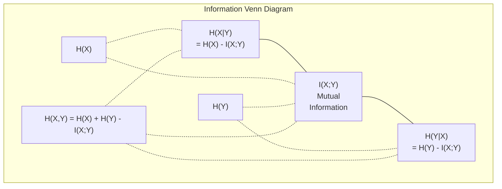

# 信息论

> 信息论衡量惊讶程度。损失函数建立于其上。

**类型：** 学习
**编程语言：** Python
**前置知识：** 第一阶段，第06课（概率论）
**时长：** ~60分钟

## 学习目标

- 从头计算熵、交叉熵和KL散度，并解释它们之间的关系
- 推导为什么最小化交叉熵损失等价于最大化对数似然
- 计算特征与目标之间的互信息以对特征重要性排序
- 将困惑度解释为语言模型选择的有效词汇量大小

## 问题

你在训练的每个分类模型中都调用了`CrossEntropyLoss()`。你在每篇语言模型论文中都看到了“困惑度”。你在VAE、蒸馏和RLHF中读到了KL散度。这些不是孤立的概念。它们是同一思想的不同表现。

信息论为你提供了推理不确定性、压缩和预测的语言。克劳德·香农在1948年为解决通信问题而发明了它。事实证明，训练神经网络就是一个通信问题：模型试图通过一个由学习权重组成的嘈杂信道传输正确的标签。

本课程从头构建每个公式，让你看到它们从何而来以及为何有效。

## 概念

### 信息量（惊讶程度）

当不太可能的事情发生时，它携带了更多信息。一枚硬币正面朝上？并不惊讶。中了彩票？非常惊讶。

概率为p的事件的信息量为：

```
I(x) = -log(p(x))
```

使用以2为底的对数得到比特(bit)。使用自然对数得到奈特(nat)。同样概念，不同单位。

```
Event              Probability    Surprise (bits)
Fair coin heads    0.5            1.0
Rolling a 6        0.167          2.58
1-in-1000 event    0.001          9.97
Certain event      1.0            0.0
```

必然事件携带的信息量为零。你早已知道它们会发生。

### 熵（平均惊讶程度）

熵是分布中所有可能结果的期望惊讶程度。

```
H(P) = -sum( p(x) * log(p(x)) )  for all x
```

对于二值变量，公平硬币具有最大熵：1比特。有偏硬币（99%正面）的熵很低：0.08比特。你早已知道会发生什么，所以每次抛硬币几乎不会告诉你任何信息。

```
Fair coin:    H = -(0.5 * log2(0.5) + 0.5 * log2(0.5)) = 1.0 bit
Biased coin:  H = -(0.99 * log2(0.99) + 0.01 * log2(0.01)) = 0.08 bits
```

熵衡量分布中不可约的不确定性。你不能压缩到低于它。

### 交叉熵（你每天使用的损失函数）

交叉熵衡量当你使用分布Q来编码实际来自分布P的事件时的平均惊讶程度。

```
H(P, Q) = -sum( p(x) * log(q(x)) )  for all x
```

P是真实分布（标签）。Q是你的模型预测。如果Q与P完美匹配，交叉熵等于熵。任何不匹配都会使其增大。

在分类中，P是独热向量（真实类概率为1，其他为0）。这简化了交叉熵：

```
H(P, Q) = -log(q(true_class))
```

这就是分类交叉熵损失的全部公式。最大化正确类别的预测概率。

### KL散度（分布之间的距离）

KL散度衡量使用Q替代P时带来的额外惊讶程度。

```
D_KL(P || Q) = sum( p(x) * log(p(x) / q(x)) )  for all x
             = H(P, Q) - H(P)
```

交叉熵等于熵加KL散度。由于真实分布的熵在训练期间是常数，最小化交叉熵等价于最小化KL散度。你正在将你的模型分布推向真实分布。

KL散度不是对称的：D_KL(P || Q) != D_KL(Q || P)。它不是一个真正的距离度量。

### 互信息

互信息衡量知道一个变量能告诉你多少关于另一个变量的信息。

```
I(X; Y) = H(X) - H(X|Y)
        = H(X) + H(Y) - H(X, Y)
```

如果X和Y独立，互信息为零。知道一个变量对你了解另一个变量没有帮助。如果它们完全相关，互信息等于任一变量的熵。

在特征选择中，特征与目标之间的高互信息意味着该特征有用。低互信息意味着它是噪声。

### 条件熵

H(Y|X)衡量在观察到X之后，关于Y仍然存在多少不确定性。

```
H(Y|X) = H(X,Y) - H(X)
```

两个极端情况：
- 如果X完全决定了Y，那么H(Y|X) = 0。知道X消除了关于Y的所有不确定性。例如：X = 摄氏度温度，Y = 华氏度温度。
- 如果X对Y毫无信息，那么H(Y|X) = H(Y)。知道X并没有减少你的不确定性。例如：X = 抛硬币，Y = 明天的天气。

条件熵总是非负且不超过H(Y)：

```
0 <= H(Y|X) <= H(Y)
```

在机器学习中，条件熵出现在决策树中。在每个分裂处，算法选择最小化H(Y|X)的特征X——即最能消除关于标签Y的不确定性的特征。

### 联合熵

H(X,Y)是X和Y联合分布的熵。

```
H(X,Y) = -sum sum p(x,y) * log(p(x,y))   for all x, y
```

关键性质：

```
H(X,Y) <= H(X) + H(Y)
```

当X和Y独立时等号成立。如果它们共享信息，联合熵小于各个熵之和。“缺失”的熵正好是互信息。



关系：
- H(X,Y) = H(X) + H(Y|X) = H(Y) + H(X|Y)
- I(X;Y) = H(X) - H(X|Y) = H(Y) - H(Y|X)
- H(X,Y) = H(X) + H(Y) - I(X;Y)

### 互信息（深入探讨）

互信息I(X;Y)量化知道一个变量减少关于另一个变量的不确定性的程度。

```
I(X;Y) = H(X) - H(X|Y)
       = H(Y) - H(Y|X)
       = H(X) + H(Y) - H(X,Y)
       = sum sum p(x,y) * log(p(x,y) / (p(x) * p(y)))
```

性质：
- 总是I(X;Y) >= 0。你永远不会因观察某事而损失信息。
- 当且仅当X和Y独立时，I(X;Y) = 0。
- I(X;Y) = I(Y;X)。它是对称的，不像KL散度。
- I(X;X) = H(X)。一个变量与自身共享其所有信息。

**用于特征选择的互信息。** 在机器学习中，你想要对目标有信息的特征。互信息为你提供了排序特征的原则性方法：

1. 对于每个特征X_i，计算I(X_i; Y)，其中Y是目标变量。
2. 按互信息得分对特征排序。
3. 保留前k个特征。

这适用于特征与目标之间的任何关系——线性、非线性、单调或非单调。相关性仅捕获线性关系。互信息捕获一切关系。

| 方法 | 检测 | 计算代价 | 能处理分类变量吗？ |
|------|------|---------|-------------------|
| 皮尔逊相关系数 | 线性关系 | O(n) | 否 |
| 斯皮尔曼相关系数 | 单调关系 | O(n log n) | 否 |
| 互信息 | 任意统计依赖 | O(n log n) (分箱) | 是 |

### 标签平滑与交叉熵

标准分类使用硬目标：[0, 0, 1, 0]。真实类概率为1，其他为0。标签平滑将这些替换为软目标：

```
soft_target = (1 - epsilon) * hard_target + epsilon / num_classes
```

epsilon = 0.1，4类时：
- 硬目标：[0, 0, 1, 0]
- 软目标：[0.025, 0.025, 0.925, 0.025]

从信息论角度看，标签平滑增加了目标分布的熵。硬独热目标的熵为零——没有不确定性。软目标具有正熵。

为什么有帮助：
- 防止模型将logit驱动到极端值（需要无限logit才能在交叉熵下完美匹配独热目标）
- 起到正则化作用：模型不能100%确定
- 改进校准：预测概率更好地反映真实不确定性
- 缩小训练与推理行为之间的差距

带有标签平滑的交叉熵损失变为：

```
L = (1 - epsilon) * CE(hard_target, prediction) + epsilon * H_uniform(prediction)
```

第二项惩罚那些远离均匀分布的预测——直接对置信度进行正则化。

### 为什么交叉熵是分类的标准损失函数

三种视角，同一结论。

**信息论视角。** 交叉熵衡量使用模型分布而不是真实分布时浪费了多少比特。最小化它使你的模型成为现实最有效的编码器。

**最大似然视角。** 对于N个训练样本，真实类别为y_i：

```
Likelihood     = product( q(y_i) )
Log-likelihood = sum( log(q(y_i)) )
Negative log-likelihood = -sum( log(q(y_i)) )
```

最后一行就是交叉熵损失。最小化交叉熵 = 最大化训练数据在模型下的似然。

**梯度视角。** 交叉熵关于logit的梯度就是(预测 - 真实)。干净、稳定且计算快速。这就是为什么它与softmax完美搭配。

### 比特与奈特

唯一的区别是对数的底数。

```
log base 2   -> bits      (information theory tradition)
log base e   -> nats      (machine learning convention)
log base 10  -> hartleys  (rarely used)
```

1 nat = 1/ln(2) bits = 1.4427 bits。PyTorch和TensorFlow默认使用自然对数（奈特）。

### 困惑度

困惑度是交叉熵的指数。它告诉你模型在平均意义上不确定于多少个等可能的选择。

```
Perplexity = 2^H(P,Q)   (if using bits)
Perplexity = e^H(P,Q)   (if using nats)
```

困惑度为50的语言模型平均而言就相当于它必须从50个可能的下一词元中均匀选择。越低越好。

GPT-2在常见基准上达到了约30的困惑度。现代模型在代表性良好的领域单位数。

## 构建它

### 第一步：信息量与熵

```python
import math

def information_content(p, base=2):
    if p <= 0 or p > 1:
        return float('inf') if p <= 0 else 0.0
    return -math.log(p) / math.log(base)

def entropy(probs, base=2):
    return sum(
        p * information_content(p, base)
        for p in probs if p > 0
    )

fair_coin = [0.5, 0.5]
biased_coin = [0.99, 0.01]
fair_die = [1/6] * 6

print(f"Fair coin entropy:   {entropy(fair_coin):.4f} bits")
print(f"Biased coin entropy: {entropy(biased_coin):.4f} bits")
print(f"Fair die entropy:    {entropy(fair_die):.4f} bits")
```

### 第二步：交叉熵与KL散度

```python
def cross_entropy(p, q, base=2):
    total = 0.0
    for pi, qi in zip(p, q):
        if pi > 0:
            if qi <= 0:
                return float('inf')
            total += pi * (-math.log(qi) / math.log(base))
    return total

def kl_divergence(p, q, base=2):
    return cross_entropy(p, q, base) - entropy(p, base)

true_dist = [0.7, 0.2, 0.1]
good_model = [0.6, 0.25, 0.15]
bad_model = [0.1, 0.1, 0.8]

print(f"Entropy of true dist:     {entropy(true_dist):.4f} bits")
print(f"CE (good model):          {cross_entropy(true_dist, good_model):.4f} bits")
print(f"CE (bad model):           {cross_entropy(true_dist, bad_model):.4f} bits")
print(f"KL divergence (good):     {kl_divergence(true_dist, good_model):.4f} bits")
print(f"KL divergence (bad):      {kl_divergence(true_dist, bad_model):.4f} bits")
```

### 第三步：作为分类损失的交叉熵

```python
def softmax(logits):
    max_logit = max(logits)
    exps = [math.exp(z - max_logit) for z in logits]
    total = sum(exps)
    return [e / total for e in exps]

def cross_entropy_loss(true_class, logits):
    probs = softmax(logits)
    return -math.log(probs[true_class])

logits = [2.0, 1.0, 0.1]
true_class = 0

probs = softmax(logits)
loss = cross_entropy_loss(true_class, logits)

print(f"Logits:      {logits}")
print(f"Softmax:     {[f'{p:.4f}' for p in probs]}")
print(f"True class:  {true_class}")
print(f"Loss:        {loss:.4f} nats")
print(f"Perplexity:  {math.exp(loss):.2f}")
```

### 第四步：交叉熵等于负对数似然

```python
import random

random.seed(42)

n_samples = 1000
n_classes = 3
true_labels = [random.randint(0, n_classes - 1) for _ in range(n_samples)]
model_logits = [[random.gauss(0, 1) for _ in range(n_classes)] for _ in range(n_samples)]

ce_loss = sum(
    cross_entropy_loss(label, logits)
    for label, logits in zip(true_labels, model_logits)
) / n_samples

nll = -sum(
    math.log(softmax(logits)[label])
    for label, logits in zip(true_labels, model_logits)
) / n_samples

print(f"Cross-entropy loss:      {ce_loss:.6f}")
print(f"Negative log-likelihood: {nll:.6f}")
print(f"Difference:              {abs(ce_loss - nll):.2e}")
```

### 第五步：互信息

```python
def mutual_information(joint_probs, base=2):
    rows = len(joint_probs)
    cols = len(joint_probs[0])

    margin_x = [sum(joint_probs[i][j] for j in range(cols)) for i in range(rows)]
    margin_y = [sum(joint_probs[i][j] for i in range(rows)) for j in range(cols)]

    mi = 0.0
    for i in range(rows):
        for j in range(cols):
            pxy = joint_probs[i][j]
            if pxy > 0:
                mi += pxy * math.log(pxy / (margin_x[i] * margin_y[j])) / math.log(base)
    return mi

independent = [[0.25, 0.25], [0.25, 0.25]]
dependent = [[0.45, 0.05], [0.05, 0.45]]

print(f"MI (independent): {mutual_information(independent):.4f} bits")
print(f"MI (dependent):   {mutual_information(dependent):.4f} bits")
```

## 使用它

使用NumPy的相同概念，你在实践中将使用的样子：

```python
import numpy as np

def np_entropy(p):
    p = np.asarray(p, dtype=float)
    mask = p > 0
    result = np.zeros_like(p)
    result[mask] = p[mask] * np.log(p[mask])
    return -result.sum()

def np_cross_entropy(p, q):
    p, q = np.asarray(p, dtype=float), np.asarray(q, dtype=float)
    mask = p > 0
    return -(p[mask] * np.log(q[mask])).sum()

def np_kl_divergence(p, q):
    return np_cross_entropy(p, q) - np_entropy(p)

true = np.array([0.7, 0.2, 0.1])
pred = np.array([0.6, 0.25, 0.15])
print(f"Entropy:    {np_entropy(true):.4f} nats")
print(f"Cross-ent:  {np_cross_entropy(true, pred):.4f} nats")
print(f"KL div:     {np_kl_divergence(true, pred):.4f} nats")
```

你从头构建了`torch.nn.CrossEntropyLoss()`内部所做的工作。现在你知道为什么训练过程中损失下降：你的模型预测分布正在接近真实分布，以浪费信息的奈特数来衡量。

## 练习

1. 假设均匀分布（26个字母）计算英文字母表的熵。然后使用实际字母频率估计它。哪个更高？为什么？
2. 一个模型对真实类别为1的样本输出logit [5.0, 2.0, 0.5]。手动计算交叉熵损失，然后用你的`cross_entropy_loss`函数验证。什么样的logit会导致零损失？
3. 展示KL散度不是对称的。选择两个分布P和Q，计算D_KL(P || Q)和D_KL(Q || P)。解释它们为何不同。
4. 构建一个函数计算一组词元预测的困惑度。给定一个(true_token_index, predicted_logits)对列表，返回序列的困惑度。

## 关键术语

| 术语 | 常用说法 | 实际含义 |
|------|---------|----------|
| 信息量 | “惊讶程度” | 编码一个事件所需的比特数（或奈特数）：-log(p) |
| 熵 | “随机性” | 一个分布中所有结果的平均惊讶程度。衡量不可约的不确定性。 |
| 交叉熵 | “损失函数” | 使用模型分布Q编码来自真实分布P的事件时的平均惊讶程度。 |
| KL散度 | “分布之间的距离” | 使用Q替代P浪费的额外比特数。等于交叉熵减去熵。不对称。 |
| 互信息 | “X和Y有多相关” | 知道Y后对X不确定性的减少量。零意味着独立。 |
| Softmax | “将logit转化为概率” | 指数化并归一化。将任意实值向量映射为有效的概率分布。 |
| 困惑度 | “模型有多困惑” | 交叉熵的指数。模型每一步从中选择的有效词汇量大小。 |
| 比特 | “香农的单位” | 以2为底对数所衡量的信息。一个比特解决一次公正的硬币抛掷。 |
| 奈特 | “机器学习的单位” | 以自然对数衡量的信息。PyTorch和TensorFlow默认使用。 |
| 负对数似然 | “NLL损失” | 对于独热标签，等同于交叉熵损失。最小化它最大化正确预测的概率。 |

## 延伸阅读

- [Shannon 1948: A Mathematical Theory of Communication](https://people.math.harvard.edu/~ctm/home/text/others/shannon/entropy/entropy.pdf) - 原始论文，至今仍可读
- [Visual Information Theory (Chris Olah)](https://colah.github.io/posts/2015-09-Visual-Information/) - 熵和KL散度的最佳可视化解释
- [PyTorch CrossEntropyLoss 文档](https://pytorch.org/docs/stable/generated/torch.nn.CrossEntropyLoss.html) - 框架如何实现你刚刚构建的内容
