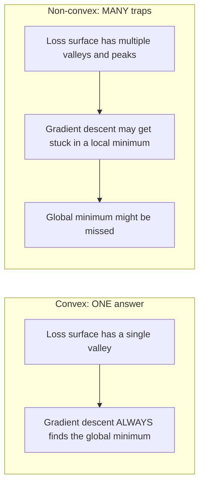
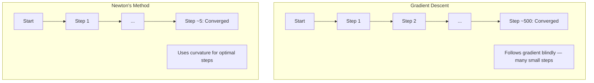
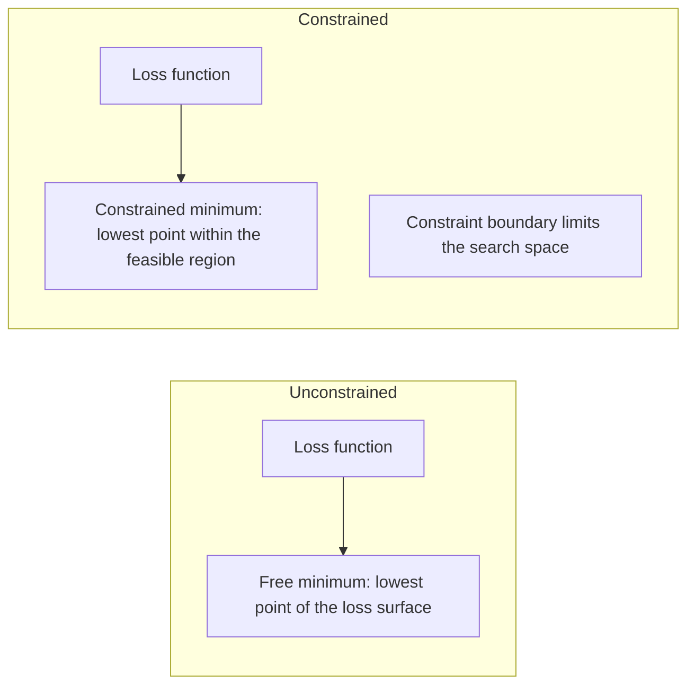
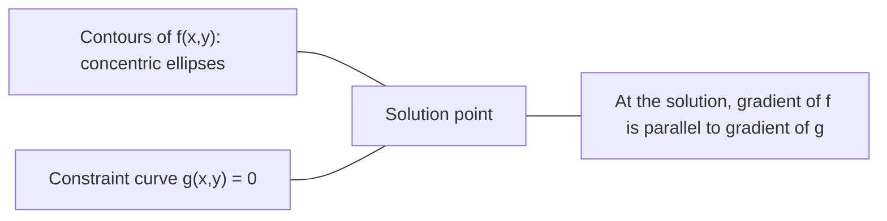

# 凸优化

> 凸问题只有一个谷底。神经网络有数百万个。理解这一差异至关重要。

**类型：** 构建  
**语言：** Python  
**前置要求：** 第一阶段，第04课（机器学习微积分）、第08课（优化）  
**时长：** ~90 分钟

## 学习目标

- 使用定义、二阶导数及 Hessian 矩阵准则判断函数是否凸
- 实现牛顿法，并将其二次收敛速度与梯度下降进行比较
- 使用拉格朗日乘子求解带约束优化问题，并解释 KKT 条件
- 解释为什么神经网络损失景观是非凸的，但 SGD 仍然能找到好的解

## 问题

第 08 课教你梯度下降、动量和 Adam。这些优化器能在任何曲面上沿着下坡走。但它们没有保证。在非凸景观上进行梯度下降可能陷入糟糕的局部最小值、卡在鞍点或永远振荡。你仍然使用它们，因为神经网络是非凸的，且没有替代方案。

但是机器学习中的许多问题是凸的：线性回归、逻辑回归、支持向量机、LASSO、岭回归。对于这些问题，存在更强的方法：具有数学保证的优化。凸问题只有一个谷底。任何走下坡的算法都会达到全局最小值。无需重新启动，无需学习率调度，无需祈祷。

理解凸性可以做三件事。第一，它告诉你问题何时是容易的（凸）还是困难的（非凸）。第二，它为你提供更快的工具，如针对凸问题的牛顿法。第三，它解释了整个 ML 中出现的概念：作为约束的正则化、SVM 中的对偶性，以及深度学习为何在违背凸性提供的所有优良性质时仍然有效。

## 概念

### 凸集

如果一个集合 S 中任意两点之间的线段也完全位于 S 内，则 S 是凸集。

| 凸集 | 非凸集 |
|---|---|
| **矩形**：内部任意两点连线，线段始终在内部 | **星形/月牙形**：两个内点之间的线段可能穿出集合 |
| **三角形**：所有内点均满足相同性质 | **环面/圆环**：空洞导致某些线段离开集合 |
| 任意两点间的线段都在集合内 | 某些点对之间的线段会离开集合 |

形式化检验：对任意 x, y ∈ S 和任意 t ∈ [0, 1]，点 tx + (1-t)y 也在 S 中。

凸集的例子：
- 直线、平面、整个 R^n
- 球体（圆、球面、超球面）
- 半空间：{x : a^T x ≤ b}
- 任意凸集交集的交集

非凸集的例子：
- 甜甜圈（圆环）
- 两个不相交的圆的并集
- 任何有“凹陷”或“空洞”的集合

### 凸函数

如果函数 f 的定义域是凸集，并且对于定义域中的任意两点 x, y 和任意 t ∈ [0, 1]，有：

```
f(tx + (1-t)y) <= t*f(x) + (1-t)*f(y)
```

几何上：图上任意两点之间的线段位于图像之上或与其重合。

| 性质 | 凸函数 | 非凸函数 |
|---|---|---|
| **线段检验** | 图上任意两点间的线段位于曲线 **上方或与之重合** | 图上某些点之间的线段会下穿曲线 **下方** |
| **形状** | 单个碗状/谷底，向上弯曲 | 多个峰和谷，曲率混合 |
| **局部最小值** | 每个局部最小值都是全局最小值 | 可能存在多个不同高度的局部最小值 |

常见的凸函数：
- f(x) = x²（抛物线）
- f(x) = |x|（绝对值）
- f(x) = eˣ（指数函数）
- f(x) = max(0, x)（ReLU，尽管是分段线性）
- f(x) = -log(x)，x > 0（负对数）
- 任意线性函数 f(x) = a^T x + b（既是凸函数也是凹函数）

### 凸性检验

三种实用检验，从最简单到最严格。

**检验一：二阶导数检验（一维）。** 如果对所有 x 有 f''(x) ≥ 0，则 f 是凸函数。

- f(x) = x²：f''(x) = 2 ≥ 0。凸。
- f(x) = x³：f''(x) = 6x。x < 0 时为负。非凸。
- f(x) = eˣ：f''(x) = eˣ > 0。凸。

**检验二：Hessian 矩阵检验（多维）。** 如果对所有 x，Hessian 矩阵 H(x) 是半正定的，则 f 是凸函数。Hessian 矩阵是二阶偏导数构成的矩阵。

**检验三：定义检验。** 直接检验不等式 f(tx + (1-t)y) ≤ tf(x) + (1-t)f(y)。适用于难以计算导数的函数。

### 为什么凸性重要

凸优化的核心定理：

**对于凸函数，每个局部最小值都是全局最小值。**

这意味着梯度下降不会被卡住。任何下坡路径都通向同一个答案。算法保证收敛到最优解。



推论：
- 无需随机重启
- 无需复杂的学习率调度
- 可以证明收敛性（收敛速度取决于函数性质）
- 解唯一（直到平坦区域）

### 机器学习中的凸与非凸问题

| 问题 | 是否凸 | 原因 |
|------|--------|------|
| 线性回归（MSE） | 是 | 损失函数关于权重是二次的 |
| 逻辑回归 | 是 | 对数损失关于权重是凸的 |
| SVM（合页损失） | 是 | 线性函数的最大值 |
| LASSO（L1 回归） | 是 | 凸函数求和仍是凸函数 |
| 岭回归（L2） | 是 | 二次+二次=凸函数 |
| 神经网络（任意损失） | 否 | 非线性激活函数产生非凸景观 |
| k-均值聚类 | 否 | 离散的分配步骤 |
| 矩阵分解 | 否 | 未知量的乘积 |

具有凸损失的线性模型是凸的。一旦加入隐藏层和非线性激活函数，凸性就被破坏了。

### Hessian 矩阵

函数 f: Rⁿ → R 的 Hessian 矩阵 H 是 n×n 的二阶偏导数矩阵。

```
H[i][j] = d^2 f / (dx_i dx_j)
```

对于 f(x, y) = x² + 3xy + y²：

```
df/dx = 2x + 3y       d^2f/dx^2 = 2      d^2f/dxdy = 3
df/dy = 3x + 2y       d^2f/dydx = 3      d^2f/dy^2 = 2

H = [ 2  3 ]
    [ 3  2 ]
```

Hessian 矩阵告诉我们曲率信息：
- 所有特征值为正：函数在每个方向上都向上弯曲（在该点凸）
- 所有特征值为负：在每个方向上都向下弯曲（凹，局部最大值）
- 符号混合：鞍点（某些方向向上，某些方向向下）
- 特征值为零：该方向平坦（退化）

对于凸性，Hessian 矩阵必须在所有点上（而不仅仅是一个点）半正定（所有特征值 ≥ 0）。

### 牛顿法

梯度下降使用一阶信息（梯度）。牛顿法使用二阶信息（Hessian 矩阵）。它在当前点拟合一个二次近似，并直接跳到该二次近似的极小点。

```
Update rule:
  x_new = x - H^(-1) * gradient

Compare to gradient descent:
  x_new = x - lr * gradient
```

牛顿法将标量学习率替换为逆 Hessian 矩阵。这根据局部曲率自动调整步长和方向。



优点：
- 接近最小值时具有二次收敛性（每一步误差平方）
- 无需调整学习率
- 尺度不变（无论问题如何参数化，都能工作）

缺点：
- 计算 Hessian 矩阵需要 O(n²) 内存和 O(n³) 求逆运算
- 对于一个有 100 万个权重的神经网络，就是 10¹² 个元素和 10¹⁸ 次运算
- 不适用于深度学习

### 约束优化

无约束优化：对所有 x 最小化 f(x)。  
约束优化：在满足约束的条件下最小化 f(x)。

实际问题都有约束。你想最小化成本，但预算有限。你想最小化误差，但模型复杂度有限。



### 拉格朗日乘子

拉格朗日乘子法将约束问题转化为无约束问题。

问题：在约束 g(x) = 0 下最小化 f(x)。

解：引入一个新变量（拉格朗日乘子 λ）并求解无约束问题：

```
L(x, lambda) = f(x) + lambda * g(x)
```

在解处，L 的梯度为零：

```
dL/dx = df/dx + lambda * dg/dx = 0
dL/dlambda = g(x) = 0
```

几何直觉：在约束最小值处，f 的梯度必须与约束 g 的梯度平行。如果它们不平行，你可以沿着约束曲面移动并进一步减小 f。



例子：在约束 x + y = 1 下最小化 f(x,y) = x² + y²。

```
L = x^2 + y^2 + lambda(x + y - 1)

dL/dx = 2x + lambda = 0  =>  x = -lambda/2
dL/dy = 2y + lambda = 0  =>  y = -lambda/2
dL/dlambda = x + y - 1 = 0

From first two: x = y
Substituting: 2x = 1, so x = y = 0.5, lambda = -1
```

直线 x + y = 1 上距离原点最近的点是 (0.5, 0.5)。

### KKT 条件

Karush-Kuhn-Tucker 条件将拉格朗日乘子法扩展到不等式约束。

问题：在约束 g_i(x) ≤ 0 (i = 1, ..., m) 下最小化 f(x)。

最优性必要条件（KKT 条件）：

```
1. Stationarity:    df/dx + sum(lambda_i * dg_i/dx) = 0
2. Primal feasibility:  g_i(x) <= 0  for all i
3. Dual feasibility:    lambda_i >= 0  for all i
4. Complementary slackness:  lambda_i * g_i(x) = 0  for all i
```

互补松弛是关键：要么约束是激活的（g_i = 0，解位于边界上），要么乘子为零（该约束无关紧要）。不影响解的约束有 λ = 0。

KKT 条件是 SVM 的核心。支持向量是约束被激活的数据点（λ > 0）。所有其他数据点的 λ = 0，不影响决策边界。

### 作为约束优化的正则化

L1 和 L2 正则化并非任意的技巧。它们实际上是约束优化问题。

**L2 正则化（岭回归）：**

```
minimize  Loss(w)  subject to  ||w||^2 <= t

Equivalent unconstrained form:
minimize  Loss(w) + lambda * ||w||^2
```

约束 ||w||² ≤ t 定义了一个球体（二维中是圆，三维中是球面）。解是损失等高线首次与这个球体接触的点。

**L1 正则化（LASSO）：**

```
minimize  Loss(w)  subject to  ||w||_1 <= t

Equivalent unconstrained form:
minimize  Loss(w) + lambda * ||w||_1
```

约束 ||w||₁ ≤ t 定义了一个菱形（二维中是旋转的正方形）。

| 性质 | L2 约束（圆） | L1 约束（菱形） |
|---|---|---|
| **约束形状** | 圆（高维是球体） | 菱形（二维是旋转的正方形） |
| **损失等高线接触点** | 平滑边界——圆上任意点 | 角——与坐标轴对齐 |
| **解的行为** | 权重小但不为零 | 某些权重恰好为零（稀疏） |
| **结果** | 权重收缩 | 特征选择 |

这解释了为什么 L1 产生稀疏模型（特征选择），而 L2 只收缩权重。菱形的角与坐标轴对齐。损失等高线更可能接触到角，导致一个或多个权重恰好为零。

### 对偶性

每个约束优化问题（原问题）都有一个伴随问题（对偶问题）。对于凸问题，原问题和对偶问题具有相同的最优值。这就是强对偶性。

拉格朗日对偶函数：

```
Primal: minimize f(x) subject to g(x) <= 0
Lagrangian: L(x, lambda) = f(x) + lambda * g(x)
Dual function: d(lambda) = min_x L(x, lambda)
Dual problem: maximize d(lambda) subject to lambda >= 0
```

为什么对偶性重要：
- 对偶问题有时比原问题更容易求解
- SVM 以对偶形式求解，问题依赖于数据点之间的内积（从而实现了核技巧）
- 对偶问题为原问题最优值提供了下界，有助于检验解的质量

对于 SVM 特别地：

```
Primal: find w, b that maximize the margin 2/||w|| subject to
        y_i(w^T x_i + b) >= 1 for all i

Dual:   maximize sum(alpha_i) - 0.5 * sum_ij(alpha_i * alpha_j * y_i * y_j * x_i^T x_j)
        subject to alpha_i >= 0 and sum(alpha_i * y_i) = 0

The dual only involves dot products x_i^T x_j.
Replace x_i^T x_j with K(x_i, x_j) to get the kernel trick.
```

### 深度学习为什么在非凸情况下仍然有效

神经网络损失函数是高度非凸的。按照所有经典的衡量标准，优化它们应该会失败。然而随机梯度下降却可靠地找到了好的解。几个因素可以解释这一点。

**大多数局部最小值都足够好。** 在高维空间中，随机临界点（梯度为零的点）绝大多数是鞍点，而非局部最小值。存在的少数局部最小值，其损失值往往接近全局最小值。当参数空间有数百万维时，陷入糟糕局部最小值的可能性极低。

**真正的障碍是鞍点，而非局部最小值。** 在一个有 n 个参数的函数中，鞍点具有正负曲率方向混合的特征。对于高维中的随机临界点，所有 n 个特征值都为正（局部最小值）的概率大约为 2^(-n)。几乎所有的临界点都是鞍点。SGD 的噪声有助于逃离它们。

**过参数化平滑了景观。** 参数比训练样本还多的网络具有更平滑、连接性更好的损失曲面。更宽的网络拥有更少的糟糕局部最小值。这违反直觉，但经验上是一致的。

**损失景观结构：**

| 性质 | 低维空间 | 高维空间 |
|---|---|---|
| **景观** | 许多孤立的峰和谷 | 平滑连接的谷 |
| **最小值** | 许多孤立的局部最小值 | 糟糕的局部最小值很少；大多数接近最优 |
| **导航** | 难以找到全局最小值 | 许多路径通向好的解 |
| **临界点** | 局部最小值和鞍点的混合 | 压倒性的是鞍点，而非局部最小值 |

**随机噪声起到隐式正则化的作用。** 小批量 SGD 添加的噪声阻止了陷入尖锐的最小值。尖锐的最小值过拟合；平坦的最小值泛化良好。噪声将优化偏向损失景观的平坦区域。

### 实践中使用的二阶方法

纯粹的牛顿法对于大型模型不实用。几种近似方法使得二阶信息变得可用。

**L-BFGS（有限内存 BFGS）：** 使用最近 m 次梯度差来近似逆 Hessian 矩阵。需要 O(mn) 内存而非 O(n²)。适用于最多约 10,000 个参数的问题。用于经典机器学习（逻辑回归、条件随机场），但不用于深度学习。

**自然梯度：** 使用 Fisher 信息矩阵（对数似然的期望 Hessian 矩阵）代替标准 Hessian 矩阵。这考虑了概率分布的几何结构。K-FAC（Kronecker 因子近似曲率）将 Fisher 矩阵近似为 Kronecker 积，使其适用于神经网络。

**无 Hessian 优化：** 使用共轭梯度法求解 Hx = g，而无需显式构造 H。只需要 Hessian-向量乘积，可通过自动微分在 O(n) 时间内计算。

**对角近似：** Adam 的第二动量是 Hessian 对角线的对角近似。AdaHessian 通过 Hutchinson 估计器使用实际的 Hessian 对角线元素，对此进行了扩展。

| 方法 | 内存 | 每步开销 | 何时使用 |
|---|---|---|---|
| 梯度下降 | O(n) | O(n) | 基准方法，大型模型 |
| 牛顿法 | O(n²) | O(n³) | 小型凸问题 |
| L-BFGS | O(mn) | O(mn) | 中型凸问题 |
| Adam | O(n) | O(n) | 深度学习默认方法 |
| K-FAC | O(n) | 每层 O(n) | 研究、大批量训练 |

## 动手构建

### 步骤 1：凸性检查器

构建一个通过采样点并检查定义来经验性地检验凸性的函数。

```python
import random
import math

def check_convexity(f, dim, bounds=(-5, 5), samples=1000):
    violations = 0
    for _ in range(samples):
        x = [random.uniform(*bounds) for _ in range(dim)]
        y = [random.uniform(*bounds) for _ in range(dim)]
        t = random.uniform(0, 1)
        mid = [t * xi + (1 - t) * yi for xi, yi in zip(x, y)]
        lhs = f(mid)
        rhs = t * f(x) + (1 - t) * f(y)
        if lhs > rhs + 1e-10:
            violations += 1
    return violations == 0, violations
```

### 步骤 2：二维牛顿法

使用显式 Hessian 矩阵实现牛顿法。将收敛速度与梯度下降进行比较。

```python
def newtons_method(f, grad_f, hessian_f, x0, steps=50, tol=1e-12):
    x = list(x0)
    history = [x[:]]
    for _ in range(steps):
        g = grad_f(x)
        H = hessian_f(x)
        det = H[0][0] * H[1][1] - H[0][1] * H[1][0]
        if abs(det) < 1e-15:
            break
        H_inv = [
            [H[1][1] / det, -H[0][1] / det],
            [-H[1][0] / det, H[0][0] / det],
        ]
        dx = [
            H_inv[0][0] * g[0] + H_inv[0][1] * g[1],
            H_inv[1][0] * g[0] + H_inv[1][1] * g[1],
        ]
        x = [x[0] - dx[0], x[1] - dx[1]]
        history.append(x[:])
        if sum(gi ** 2 for gi in g) < tol:
            break
    return history
```

### 步骤 3：拉格朗日乘子求解器

使用拉格朗日函数上的梯度下降求解约束优化。

```python
def lagrange_solve(f_grad, g_val, g_grad, x0, lr=0.01,
                   lr_lambda=0.01, steps=5000):
    x = list(x0)
    lam = 0.0
    history = []
    for _ in range(steps):
        fg = f_grad(x)
        gv = g_val(x)
        gg = g_grad(x)
        x = [
            xi - lr * (fgi + lam * ggi)
            for xi, fgi, ggi in zip(x, fg, gg)
        ]
        lam = lam + lr_lambda * gv
        history.append((x[:], lam, gv))
    return history
```

### 步骤 4：一阶与二阶方法对比

在相同的二次函数上运行梯度下降和牛顿法。统计收敛所需的步数。

```python
def quadratic(x):
    return 5 * x[0] ** 2 + x[1] ** 2

def quadratic_grad(x):
    return [10 * x[0], 2 * x[1]]

def quadratic_hessian(x):
    return [[10, 0], [0, 2]]
```

牛顿法将在 1 步内收敛（它对二次函数是精确的）。梯度下降则需要数百步，因为 Hessian 矩阵的特征值相差 5 倍，形成拉长的山谷。

## 实际应用

凸性分析直接适用于选择机器学习模型和求解器。

对于凸问题（逻辑回归、SVM、LASSO）：
- 使用专用的求解器（liblinear、CVXPY、scipy.optimize.minimize with method='L-BFGS-B'）
- 期望唯一的全局解
- 二阶方法实用且快速

对于非凸问题（神经网络）：
- 使用一阶方法（SGD、Adam）
- 接受解依赖于初始化和随机性
- 使用过参数化、噪声和学习率调度作为隐式正则化
- 不要浪费时间寻找全局最小值。一个好的局部最小值就足够了。

```python
from scipy.optimize import minimize

result = minimize(
    fun=lambda w: sum((y - X @ w) ** 2) + 0.1 * sum(w ** 2),
    x0=np.zeros(d),
    method='L-BFGS-B',
    jac=lambda w: -2 * X.T @ (y - X @ w) + 0.2 * w,
)
```

对于 SVM，对偶形式允许使用核技巧：

```python
from sklearn.svm import SVC

svm = SVC(kernel='rbf', C=1.0)
svm.fit(X_train, y_train)
print(f"Support vectors: {svm.n_support_}")
```

## 练习

1. **凸性画廊**：使用检查器测试以下函数的凸性：f(x) = x⁴, f(x) = sin(x), f(x,y) = x² + y², f(x,y) = xy, f(x) = max(x, 0)。解释每个结果为何合理。

2. **牛顿法 vs 梯度下降竞赛**：在函数 f(x,y) = 50x² + y² 上从起始点 (10, 10) 运行两种方法。各需要多少步达到损失 < 1e-10？当条件数（最大特征值与最小特征值之比）增加时，梯度下降会发生什么？

3. **拉格朗日乘子几何**：在约束 x + 2y = 4 下最小化 f(x,y) = (x-3)² + (y-3)²。通过检查在解处 f 的梯度与 g 的梯度平行来验证解。

4. **正则化约束**：实现 L1 约束优化：在约束 |x| + |y| ≤ 1 下最小化 (x-3)² + (y-2)²。证明解中有一个坐标为零（菱形约束产生的稀疏性）。

5. **Hessian 特征值分析**：计算 Rosenbrock 函数在 (1,1) 和 (-1,1) 处的 Hessian 矩阵。计算两点的特征值。这些特征值告诉你关于最小值处与远离最小值处的曲率的什么信息？

## 关键术语

| 术语 | 含义 |
|------|------|
| 凸集 | 其中任意两点间的线段仍在集合内的集合 |
| 凸函数 | 图上任意两点间的线段位于图像上方或与之重合的函数。等价地，Hessian 矩阵处处半正定 |
| 局部最小值 | 比所有邻近点都低的点。对于凸函数，每个局部最小值都是全局最小值 |
| 全局最小值 | 函数在整个定义域中的最低点 |
| Hessian 矩阵 | 所有二阶偏导数构成的矩阵。编码曲率信息 |
| 半正定 | 所有特征值非负的矩阵。是“二阶导数 ≥ 0”的多维对应物 |
| 条件数 | Hessian 矩阵最大特征值与最小特征值之比。高条件数意味着拉长的山谷和缓慢的梯度下降 |
| 牛顿法 | 使用逆 Hessian 矩阵确定步长和方向的二阶优化器。在最小值附近具有二次收敛性 |
| 拉格朗日乘子 | 为将有约束优化问题转化为无约束问题而引入的变量 |
| KKT 条件 | 带不等式约束的最优性必要条件。推广了拉格朗日乘子法 |
| 互补松弛 | 在解处，要么约束是激活的，要么其乘子为零。不会两者同时非零 |
| 对偶性 | 每个约束问题都有一个相伴的对偶问题。对于凸问题，两者具有相同的最优值 |
| 强对偶性 | 原问题和对偶问题的最优值相等。对于满足 Slater 条件的凸问题成立 |
| L-BFGS | 近似二阶方法，存储最近的 m 次梯度差而非完整的 Hessian 矩阵 |
| 鞍点 | 梯度为零但某些方向是最小值、另一些方向是最大值的点 |
| 过参数化 | 使用比训练样本更多的参数。平滑损失景观并减少糟糕的局部最小值 |

## 延伸阅读

- [Boyd & Vandenberghe: Convex Optimization](https://web.stanford.edu/~boyd/cvxbook/) - 标准教材，免费在线获取
- [Bottou, Curtis, Nocedal: Optimization Methods for Large-Scale Machine Learning (2018)](https://arxiv.org/abs/1606.04838) - 连接凸优化理论与深度学习实践
- [Choromanska et al.: The Loss Surfaces of Multilayer Networks (2015)](https://arxiv.org/abs/1412.0233) - 为什么非凸神经网络景观并不像看起来那么糟
- [Nocedal & Wright: Numerical Optimization](https://link.springer.com/book/10.1007/978-0-387-40065-5) - 关于牛顿法、L-BFGS 和约束优化的综合参考书
