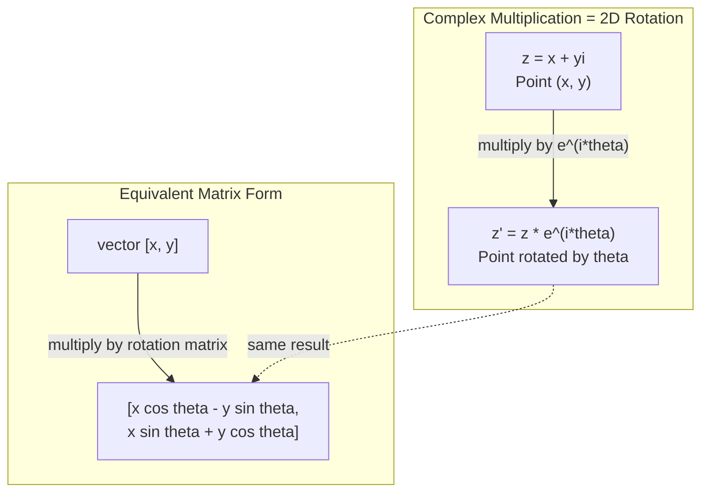
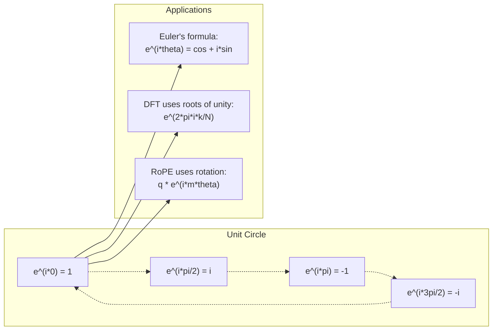

# 用于人工智能的复数

> -1 的平方根不是虚数。它是旋转、频率和一半信号处理的关键。

**类型:** 学习  
**语言:** Python  
**前置要求:** 阶段 1，课程 01-04（线性代数、微积分）  
**时长:** 约 60 分钟  

## 学习目标

- 在直角坐标和极坐标两种形式下执行复数算术（加、乘、除、共轭）
- 应用欧拉公式在复指数和三角函数之间进行转换
- 使用复数的单位根实现离散傅里叶变换
- 解释复数旋转如何构成 Transformer 中 RoPE 和正弦位置编码的基础

## 问题

你打开一篇关于傅里叶变换的论文，看到到处都是 `i`。你查看 Transformer 的位置编码，看到不同频率的 `sin` 和 `cos` —— 它们是复指数函数的实部和虚部。你阅读关于量子计算的内容，发现一切都用复向量空间表达。

复数似乎很抽象。一个建立在 -1 平方根之上的数字系统感觉像是一个数学把戏。但它不是把戏。它是旋转和振荡的自然语言。每当有东西旋转、振动或振荡时，复数都是合适的工具。

不理解复数，你就无法理解离散傅里叶变换。无法理解 FFT。无法理解 RoPE（旋转位置嵌入）在现代语言模型中如何工作。无法理解原始 Transformer 论文中的正弦位置编码为何使用它们所用的那些频率。

本课从零开始构建复数算术，将其与几何联系起来，并准确展示复数在机器学习中的出现位置。

## 概念

### 什么是复数？

一个复数有两个部分：一个实部和一个虚部。

```
z = a + bi

where:
  a is the real part
  b is the imaginary part
  i is the imaginary unit, defined by i^2 = -1
```

就是这样。你把数轴扩展成一个平面。实数位于一条轴上。虚数位于另一条轴上。每个复数都是这个平面中的一个点。

### 复数算术

**加法。** 实部相加，虚部相加。

```
(a + bi) + (c + di) = (a + c) + (b + d)i

Example: (3 + 2i) + (1 + 4i) = 4 + 6i
```

**乘法。** 使用分配律，并记住 i^2 = -1。

```
(a + bi)(c + di) = ac + adi + bci + bdi^2
                 = ac + adi + bci - bd
                 = (ac - bd) + (ad + bc)i

Example: (3 + 2i)(1 + 4i) = 3 + 12i + 2i + 8i^2
                            = 3 + 14i - 8
                            = -5 + 14i
```

**共轭。** 翻转虚部的符号。

```
conjugate of (a + bi) = a - bi
```

一个复数与其共轭的乘积总是实数：

```
(a + bi)(a - bi) = a^2 + b^2
```

**除法。** 将分子和分母同时乘以分母的共轭。

```
(a + bi) / (c + di) = (a + bi)(c - di) / (c^2 + d^2)
```

这消除了分母中的虚部，得到一个干净的复数。

### 复平面

复平面将每个复数映射到一个二维点。水平轴是实轴，垂直轴是虚轴。

```
z = 3 + 2i  corresponds to the point (3, 2)
z = -1 + 0i corresponds to the point (-1, 0) on the real axis
z = 0 + 4i  corresponds to the point (0, 4) on the imaginary axis
```

一个复数同时是一个点和一个从原点出发的向量。这种双重解释使得复数对几何非常有用。

### 极坐标形式

平面中的任何点都可以用其到原点的距离以及其与正实轴之间的角度来描述。

```
z = r * (cos(theta) + i*sin(theta))

where:
  r = |z| = sqrt(a^2 + b^2)     (magnitude, or modulus)
  theta = atan2(b, a)             (phase, or argument)
```

直角坐标形式 (a + bi) 适合加法。极坐标形式 (r, θ) 适合乘法。

**极坐标下的乘法。** 幅值相乘，角度相加。

```
z1 = r1 * e^(i*theta1)
z2 = r2 * e^(i*theta2)

z1 * z2 = (r1 * r2) * e^(i*(theta1 + theta2))
```

这就是为什么复数非常适合旋转。将一个幅值为 1 的复数相乘就是纯旋转。

### 欧拉公式

复指数与三角学之间的桥梁：

```
e^(i*theta) = cos(theta) + i*sin(theta)
```

这是本课中最重要的公式。当 θ = π 时：

```
e^(i*pi) = cos(pi) + i*sin(pi) = -1 + 0i = -1

Therefore: e^(i*pi) + 1 = 0
```

五个基本常数（e、i、π、1、0）在一个方程中联系起来。

### 为什么欧拉公式对机器学习很重要

欧拉公式表明，当 θ 变化时，`e^(i*θ)` 描摹出单位圆。在 θ = 0 时，你位于 (1, 0)。在 θ = π/2 时，你位于 (0, 1)。在 θ = π 时，你位于 (-1, 0)。在 θ = 3π/2 时，你位于 (0, -1)。一个完整的旋转是 θ = 2π。

这意味着复指数就是旋转。而旋转在信号处理和机器学习中无处不在。

### 与二维旋转的联系

将复数 (x + yi) 乘以 e^(i*θ) 会使点 (x, y) 绕原点旋转角度 θ。

```
Rotation via complex multiplication:
  (x + yi) * (cos(theta) + i*sin(theta))
  = (x*cos(theta) - y*sin(theta)) + (x*sin(theta) + y*cos(theta))i

Rotation via matrix multiplication:
  [cos(theta)  -sin(theta)] [x]   [x*cos(theta) - y*sin(theta)]
  [sin(theta)   cos(theta)] [y] = [x*sin(theta) + y*cos(theta)]
```

它们产生相同的结果。复数乘法就是二维旋转。旋转矩阵只是用矩阵符号写成的复数乘法。



### 相量与旋转信号

复指数 e^(i*ω*t) 是一个以角频率 ω 绕单位圆旋转的点。随着 t 增加，该点描摹出圆。

这个旋转点的实部是 cos(ω*t)，虚部是 sin(ω*t)。正弦信号是一个旋转复数的投影。

```
e^(i*omega*t) = cos(omega*t) + i*sin(omega*t)

Real part:      cos(omega*t)    -- a cosine wave
Imaginary part: sin(omega*t)    -- a sine wave
```

这就是相量表示法。你不再跟踪一个波动的正弦波，而是跟踪一个平滑旋转的箭头。相移变成角度偏移。幅度变化变成幅值变化。信号相加变成向量加法。

### 单位根

N 次单位根是在单位圆上等距分布的 N 个点：

```
w_k = e^(2*pi*i*k/N)    for k = 0, 1, 2, ..., N-1
```

对于 N = 4，根是：1、i、-1、-i（四个罗盘点）。
对于 N = 8，你得到四个罗盘点加上四个对角线方向点。

单位根是离散傅里叶变换的基础。DFT 将一个信号分解为这些 N 个等距频率的分量。

### 与 DFT 的联系

信号 x[0]、x[1]、……、x[N-1] 的离散傅里叶变换是：

```
X[k] = sum_{n=0}^{N-1} x[n] * e^(-2*pi*i*k*n/N)
```

每个 X[k] 度量信号与第 k 个单位根（频率为 k 的复正弦波）的相关程度。DFT 将一个信号分解为 N 个旋转相量，并告诉你每个相量的幅度和相位。

### 为什么 i 不是虚的

“虚数”这个词是个历史意外。笛卡尔轻蔑地使用了它。但 i 并不比负数在人们最初拒绝它时更虚。负数回答了“3 减去 5 得到什么？”这个问题。虚数单位回答了“什么数的平方是 -1？”

更有用的是：i 是一个 90 度旋转算子。将一个实数乘以一次 i，你就旋转 90 度到虚轴。再乘以一次 i（i^2），你再旋转 90 度——现在你指向负实轴方向。这就是为什么 i^2 = -1。这并不神秘。它是通过两个四分之一圈构成的一个半圈。

这就是为什么复数在工程中无处不在。任何旋转的东西——电磁波、量子态、信号振荡、位置编码——都自然地用复数来描述。

### 复指数与三角函数的对比

在欧拉公式之前，工程师将信号写成 A*cos(ω*t + φ) —— 幅度 A、频率 ω、相位 φ。这种方法可行，但算术计算麻烦。将两个不同相位的余弦相加需要三角恒等式。

使用复指数，同样的信号是 A*e^(i*(ω*t + φ))。将两个信号相加就是两个复数相加。相乘（调制）就是幅值相乘、角度相加。相移变成角度加法。频率偏移变成与相量相乘。

整个信号处理领域都转向了复指数表示法，因为数学更简洁。“真实信号”始终只是复数表示的实部。虚部作为记账工具被携带，使所有代数运算自然进行。

### 与 Transformer 的联系

**正弦位置编码**（原始 Transformer 论文）：

```
PE(pos, 2i) = sin(pos / 10000^(2i/d))
PE(pos, 2i+1) = cos(pos / 10000^(2i/d))
```

sin 和 cos 对是不同频率下复指数的实部和虚部。每个频率提供了编码位置的不同“分辨率”。低频变化缓慢（粗略位置）。高频变化快速（精细位置）。它们共同为每个位置提供了独特的频率指纹。

**RoPE（旋转位置嵌入）**在此基础上更进一步。它显式地将 query 和 key 向量乘以复数旋转矩阵。两个 token 之间的相对位置变成一个旋转角度。注意力计算使用这些旋转后的向量进行，使得模型通过复数乘法对相对位置敏感。

| 运算 | 代数形式 | 几何含义 |
|-----------|---------------|-------------------|
| 加法 | (a+c) + (b+d)i | 平面中的向量加法 |
| 乘法 | (ac-bd) + (ad+bc)i | 旋转并缩放 |
| 共轭 | a - bi | 关于实轴反射 |
| 幅值 | sqrt(a^2 + b^2) | 到原点的距离 |
| 相位 | atan2(b, a) | 与正实轴的夹角 |
| 除法 | 乘以共轭 | 反向旋转并重新缩放 |
| 幂 | r^n * e^(i*n*θ) | 旋转 n 次，按 r^n 缩放 |



## 动手搭建

### 步骤 1：复数类

构建一个支持算术、幅值、相位以及在直角坐标和极坐标之间转换的 Complex 数类。

```python
import math

class Complex:
    def __init__(self, real, imag=0.0):
        self.real = real
        self.imag = imag

    def __add__(self, other):
        return Complex(self.real + other.real, self.imag + other.imag)

    def __mul__(self, other):
        r = self.real * other.real - self.imag * other.imag
        i = self.real * other.imag + self.imag * other.real
        return Complex(r, i)

    def __truediv__(self, other):
        denom = other.real ** 2 + other.imag ** 2
        r = (self.real * other.real + self.imag * other.imag) / denom
        i = (self.imag * other.real - self.real * other.imag) / denom
        return Complex(r, i)

    def magnitude(self):
        return math.sqrt(self.real ** 2 + self.imag ** 2)

    def phase(self):
        return math.atan2(self.imag, self.real)

    def conjugate(self):
        return Complex(self.real, -self.imag)
```

### 步骤 2：极坐标转换与欧拉公式

```python
def to_polar(z):
    return z.magnitude(), z.phase()

def from_polar(r, theta):
    return Complex(r * math.cos(theta), r * math.sin(theta))

def euler(theta):
    return Complex(math.cos(theta), math.sin(theta))
```

验证：`euler(theta).magnitude()` 应始终为 1.0。`euler(0)` 应得到 (1, 0)。`euler(pi)` 应得到 (-1, 0)。

### 步骤 3：旋转

将点 (x, y) 旋转角度 θ 就是一次复数乘法：

```python
point = Complex(3, 4)
rotated = point * euler(math.pi / 4)
```

幅值保持不变。只有角度变化。

### 步骤 4：从复数算术构建 DFT

```python
def dft(signal):
    N = len(signal)
    result = []
    for k in range(N):
        total = Complex(0, 0)
        for n in range(N):
            angle = -2 * math.pi * k * n / N
            total = total + Complex(signal[n], 0) * euler(angle)
        result.append(total)
    return result
```

这是 O(N^2) 的 DFT。每个输出 X[k] 是信号样本乘以单位根后的和。

### 步骤 5：逆 DFT

逆 DFT 从频谱重建原始信号。与正向 DFT 的唯一变化是：翻转指数符号并除以 N。

```python
def idft(spectrum):
    N = len(spectrum)
    result = []
    for n in range(N):
        total = Complex(0, 0)
        for k in range(N):
            angle = 2 * math.pi * k * n / N
            total = total + spectrum[k] * euler(angle)
        result.append(Complex(total.real / N, total.imag / N))
    return result
```

这能实现完美重建。应用 DFT，然后 IDFT，你将得到原始信号，精度达到机器精度。没有信息丢失。

### 步骤 6：单位根

```python
def roots_of_unity(N):
    return [euler(2 * math.pi * k / N) for k in range(N)]
```

验证两个性质：
- 每个根的幅值正好为 1。
- 所有 N 个根的和为零（它们通过对称性相互抵消）。

这些性质使得 DFT 可逆。单位根构成了频域的正交基。

## 使用它

Python 内置了对复数的支持。字面量 `j` 表示虚数单位。

```python
z = 3 + 2j
w = 1 + 4j

print(z + w)
print(z * w)
print(abs(z))

import cmath
print(cmath.phase(z))
print(cmath.exp(1j * cmath.pi))
```

对于数组，numpy 原生支持复数：

```python
import numpy as np

z = np.array([1+2j, 3+4j, 5+6j])
print(np.abs(z))
print(np.angle(z))
print(np.conj(z))
print(np.real(z))
print(np.imag(z))

signal = np.sin(2 * np.pi * 5 * np.linspace(0, 1, 128))
spectrum = np.fft.fft(signal)
freqs = np.fft.fftfreq(128, d=1/128)
```

## 部署

运行 `code/complex_numbers.py` 以生成 `outputs/skill-complex-arithmetic.md`。

## 练习

1. **手算复数算术。** 计算 (2 + 3i) * (4 - i) 并用代码验证。然后计算 (5 + 2i) / (1 - 3i)。在复平面上绘制两个结果，并检查乘法是否旋转并缩放了第一个数。

2. **旋转序列。** 从点 (1, 0) 开始。乘以 e^(i*π/6) 十二次。验证经过 12 次乘法后你返回 (1, 0)。打印每一步的坐标，并确认它们描摹出一个正十二边形。

3. **已知信号的 DFT。** 创建一个信号，它是 sin(2*π*3*t) 和 0.5*sin(2*π*7*t) 之和，以 32 个点采样。运行你的 DFT。验证幅度谱在频率 3 和 7 处有峰值，并且 7 处的峰值高度是 3 处峰值高度的一半。

4. **单位根可视化。** 计算 8 次单位根。验证它们之和为零。验证将任意根乘以本原根 e^(2*π*i/8) 会得到下一个根。

5. **旋转矩阵等价性。** 对于 10 个随机角度和 10 个随机点，验证复数乘法得到的结果与使用 2x2 旋转矩阵的矩阵向量乘法结果相同。打印最大数值差异。

## 关键术语

| 术语 | 含义 |
|------|---------------|
| 复数 | 形如 a + bi 的数，其中 a 是实部，b 是虚部，且 i^2 = -1 |
| 虚数单位 | 数 i，定义为 i^2 = -1。在哲学意义上不是虚的 —— 它是一个旋转算子 |
| 复平面 | 二维平面，x 轴是实轴，y 轴是虚轴。也称为阿甘特平面 |
| 幅值（模） | 到原点的距离：sqrt(a^2 + b^2)。写作 \|z\| |
| 相位（辐角） | 与正实轴的夹角：atan2(b, a)。写作 arg(z) |
| 共轭 | 关于实轴的镜像：a + bi 的共轭是 a - bi |
| 极坐标形式 | 将 z 表示为 r * e^(i*θ) 而不是 a + bi。使乘法变得简单 |
| 欧拉公式 | e^(i*θ) = cos(θ) + i*sin(θ)。将指数与三角学联系起来 |
| 相量 | 一个旋转的复数 e^(i*ω*t)，代表一个正弦信号 |
| 单位根 | 对于 k = 0 到 N-1，N 个复数 e^(2*π*i*k/N)。单位圆上等距分布的 N 个点 |
| DFT | 离散傅里叶变换。使用单位根将信号分解为复正弦分量 |
| RoPE | 旋转位置嵌入。使用复数乘法在 Transformer 注意力中编码相对位置 |

## 延伸阅读

- [Visual Introduction to Euler's Formula](https://betterexplained.com/articles/intuitive-understanding-of-eulers-formula/) - 无需繁重符号即可建立几何直觉
- [Su et al.: RoFormer (2021)](https://arxiv.org/abs/2104.09864) - 引入使用复数旋转的旋转位置嵌入的论文
- [Vaswani et al.: Attention Is All You Need (2017)](https://arxiv.org/abs/1706.03762) - 包含正弦位置编码的原始 Transformer 论文
- [3Blue1Brown: Euler's formula with introductory group theory](https://www.youtube.com/watch?v=mvmuCPvRoWQ) - 关于为什么 e^(iπ) = -1 的视觉解释
- [Needham: Visual Complex Analysis](https://global.oup.com/academic/product/visual-complex-analysis-9780198534464) - 最好的复数视觉处理书，充满几何洞察
- [Strang: Introduction to Linear Algebra, Ch. 10](https://math.mit.edu/~gs/linearalgebra/) - 在线性代数和特征值背景下的复数
