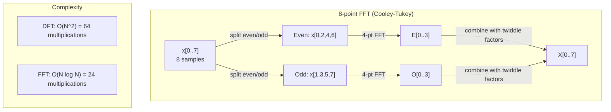
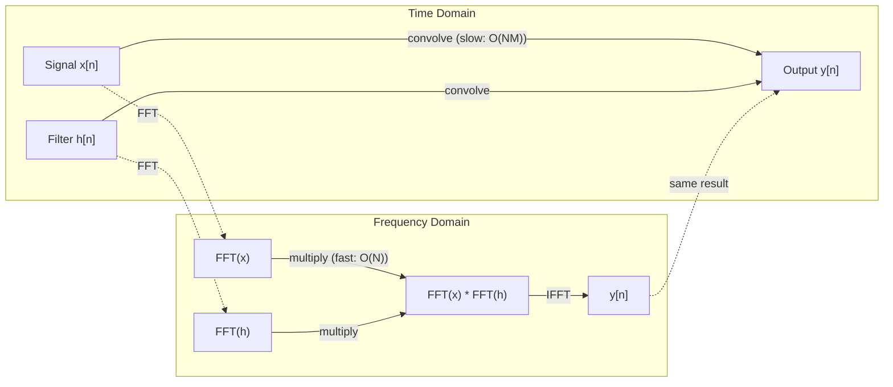

# 傅里叶变换

> 每一个信号都是正弦波的叠加。傅里叶变换告诉你具体是哪些。

**类型：** 动手实践
**语言：** Python
**前置知识：** 第一阶段，课程01-04，19（复数）
**时长：** ~90 分钟

## 学习目标

- 从头实现DFT，并对照O(N log N)的Cooley–Tukey FFT进行验证
- 解读频率系数：从信号中提取幅度、相位和功率谱
- 应用卷积定理，通过FFT乘法实现卷积
- 将傅里叶频率分解与Transformer位置编码和CNN卷积层联系起来

## 问题

一段音频记录就是一组随时间变化的压力测量值。一段股票价格就是一组按天取值的序列。一幅图像是一片空间上的像素强度网格。所有这些都是时域（或空域）数据——你看到的是某个索引上变化的值。

但很多模式在时域中是看不见的。这个音频信号是纯音还是和弦？这支股票有周周期吗？这幅图像有重复纹理吗？这些问题涉及频率内容，时域将其隐藏了。

傅里叶变换将数据从时域转换到频域。它把信号分解成不同频率的正弦波。每一个正弦波都有幅度（有多强）和相位（从哪里开始）。傅里叶变换同时给出了这两者。

这对机器学习很重要，因为频域思维无处不在。卷积神经网络执行卷积，而在频域中卷积就是乘法。Transformer的位置编码使用频率分解来表示位置。音频模型（语音识别、音乐生成）在声谱图——声音的频率表示——上运行。时间序列模型寻找周期性模式。理解傅里叶变换能为你提供与所有这些内容打交道所需的词汇。

## 概念

### DFT的定义

给定N个样本x[0], x[1], …, x[N-1]，离散傅里叶变换产生N个频率系数X[0], X[1], …, X[N-1]：

```
X[k] = sum_{n=0}^{N-1} x[n] * e^(-2*pi*i*k*n/N)

for k = 0, 1, ..., N-1
```

每个X[k]是一个复数。它的幅值|X[k]|告诉你频率k的幅度。它的辐角angle(X[k])告诉你该频率的相位偏移。

关键洞察：`e^(-2*pi*i*k*n/N)`是一个以频率k旋转的相量。DFT计算信号与N个等间隔频率之间的相关性。如果信号在频率k处包含能量，则相关值很大；否则接近于零。

### 每个系数的含义

**X[0]：直流分量。** 这是所有样本之和——与均值成正比。它代表信号的常数（零频）偏移。

```
X[0] = sum_{n=0}^{N-1} x[n] * e^0 = sum of all samples
```

**X[k] for 1 <= k <= N/2：正频率。** X[k]表示每N个样本k个循环的频率。k越大，频率越高（振荡越快）。

**X[N/2]：奈奎斯特频率。** 用N个样本能表示的最高频率。高于此频率会出现混叠——高频伪装成低频。

**X[k] for N/2 < k < N：负频率。** 对于实值信号，X[N-k] = conj(X[k])。负频率是正频率的镜像。这就是为什么有用信息集中在前N/2+1个系数中。

### 逆DFT

逆DFT从频率系数重构原始信号：

```
x[n] = (1/N) * sum_{k=0}^{N-1} X[k] * e^(2*pi*i*k*n/N)

for n = 0, 1, ..., N-1
```

与前向DFT的唯一区别：指数中的符号为正（而非负），并且有一个1/N的归一化因子。

逆DFT是完美重建的。没有任何信息丢失。你可以从时域到频域再返回而不产生任何误差。DFT是一种基变换——它将同样的信息以不同的坐标系重新表达。

### FFT：让它变快

上面定义的DFT是O(N^2)的：对于N个输出系数中的每一个，要对N个输入样本求和。当N = 100万时，就是10^12次操作。

快速傅里叶变换（FFT）以O(N log N)计算相同的结果。当N = 100万时，只需要大约两千万次操作，而不是一万亿次。这就是为什么频率分析变得可行。

Cooley–Tukey算法（最常见的FFT）通过分而治之实现：

1. 将信号分解为偶数索引和奇数索引样本。
2. 递归计算每一半的DFT。
3. 使用“旋转因子”e^(-2*pi*i*k/N)组合两个半规模的DFT。

```
X[k] = E[k] + e^(-2*pi*i*k/N) * O[k]          for k = 0, ..., N/2 - 1
X[k + N/2] = E[k] - e^(-2*pi*i*k/N) * O[k]    for k = 0, ..., N/2 - 1

where E = DFT of even-indexed samples
      O = DFT of odd-indexed samples
```

对称性意味着递归的每一层执行O(N)的工作，总共log2(N)层。总计：O(N log N)。



FFT要求信号长度为2的幂。实践中，信号会被补零到下一个2的幂。

### 频谱分析

**功率谱**是|X[k]|^2——每个频率系数幅值的平方。它展示每个频率上有多少能量。

**相位谱**是angle(X[k])——每个频率的相位偏移。在大多数分析任务中，你关心的是功率谱，而忽略相位。

```
Power at frequency k:  P[k] = |X[k]|^2 = X[k].real^2 + X[k].imag^2
Phase at frequency k:  phi[k] = atan2(X[k].imag, X[k].real)
```

### 频率分辨率

DFT的频率分辨率取决于样本数N和采样率fs。

```
Frequency of bin k:      f_k = k * fs / N
Frequency resolution:    delta_f = fs / N
Maximum frequency:       f_max = fs / 2  (Nyquist)
```

要分辨非常接近的两个频率，你需要更多的样本。要捕获高频，你需要更高的采样率。

### 卷积定理

这是信号处理中最重要的结果之一，并且直接与CNN相关。

**时域中的卷积等于频域中的逐点乘法。**

```
x * h = IFFT(FFT(x) . FFT(h))

where * is convolution and . is element-wise multiplication
```

为什么这很重要：

- 对长度为N和M的两个信号直接卷积需要O(N*M)次操作。
- 基于FFT的卷积只需要O(N log N)：对两者做变换，相乘，再逆变换。
- 对于大卷积核，FFT卷积明显更快。
- 这正是大感受野卷积层中发生的事情。

注意：DFT计算的是循环卷积（信号是绕回的）。对于线性卷积（不绕回），在计算之前将两个信号补零到长度N + M - 1。



### 加窗

DFT假设信号是周期性的——它把N个样本视为一个无限重复信号的一个周期。如果信号的首尾值不相等，就会在边界处产生不连续，表现为虚假的高频成分。这被称为频谱泄漏。

加窗通过在计算DFT之前将信号两端逐渐衰减到零来减少泄漏。

常见的窗：

| 窗函数 | 形状 | 主瓣宽度 | 旁瓣电平 | 使用场景 |
|--------|------|----------|----------|----------|
| 矩形窗 | 平坦（无窗） | 最窄 | 最高 (-13 dB) | 信号恰好周期为N个样本时 |
| 汉宁窗 | 上升余弦 | 中等 | 低 (-31 dB) | 通用频谱分析 |
| 海明窗 | 修正余弦 | 中等 | 更低 (-42 dB) | 音频处理、语音分析 |
| 布莱克曼窗 | 三重余弦 | 宽 | 非常低 (-58 dB) | 旁瓣抑制至关重要时 |

```
Hann window:    w[n] = 0.5 * (1 - cos(2*pi*n / (N-1)))
Hamming window: w[n] = 0.54 - 0.46 * cos(2*pi*n / (N-1))
```

在DFT之前将窗与信号逐元素相乘来应用窗：`X = DFT(x * w)`。

### DFT性质

| 性质 | 时域 | 频域 |
|------|------|------|
| 线性性 | a*x + b*y | a*X + b*Y |
| 时移 | x[n - k] | X[f] * e^(-2*pi*i*f*k/N) |
| 频移 | x[n] * e^(2*pi*i*f0*n/N) | X[f - f0] |
| 卷积 | x * h | X * H (逐点) |
| 乘法 | x * h (逐点) | X * H (循环卷积，缩放 1/N) |
| 帕塞瓦尔定理 | sum \|x[n]\|^2 | (1/N) * sum \|X[k]\|^2 |
| 共轭对称（实输入） | x[n] 为实 | X[k] = conj(X[N-k]) |

帕塞瓦尔定理说明总能量在两个域中相同。能量在变换中守恒。

### 与位置编码的联系

原始Transformer使用正弦位置编码：

```
PE(pos, 2i)   = sin(pos / 10000^(2i/d_model))
PE(pos, 2i+1) = cos(pos / 10000^(2i/d_model))
```

每个维度对 (2i, 2i+1) 以不同的频率振荡。频率从高（维度0,1）到低（最后维度）几何间隔。这使得每个位置在所有频段都有独特的模式——类似于傅里叶系数唯一标识一个信号。

这种方法提供的关键属性：

- **唯一性：** 没有两个位置具有相同的编码。
- **有界值：** sin和cos始终在[-1, 1]中。
- **相对位置：** 位置p+k的编码可以表示为位置p处编码的线性函数。模型可以学习关注相对位置。

### 与CNN的联系

卷积层通过在信号或图像上滑动一个学习到的滤波器（卷积核）来应用它。数学上，这就是卷积操作。

根据卷积定理，这等价于：
1. 对输入做FFT
2. 对卷积核做FFT
3. 在频域相乘
4. 对结果做IFFT

标准CNN实现使用直接卷积（对于小的3x3卷积核更快）。但对于大卷积核或全局卷积，基于FFT的方法显著更快。某些架构（如FNet）完全用FFT替代注意力，以O(N log N)复杂度而非O(N^2)的复杂度实现了具有竞争力的准确率。

### 声谱图与短时傅里叶变换

单次FFT给出整个信号的频率内容，但关于这些频率何时出现却一无所知。一个啁啾（频率随时间增加的信号）和一个和弦（所有频率同时存在）可以具有相同的幅度谱。

短时傅里叶变换（STFT）通过在信号的重叠窗口上计算FFT来解决这个问题。结果是声谱图：一个二维表示，时间在一轴，频率在另一轴。每个点的强度显示该时刻该频率的能量。

```
STFT procedure:
1. Choose a window size (e.g., 1024 samples)
2. Choose a hop size (e.g., 256 samples -- 75% overlap)
3. For each window position:
   a. Extract the windowed segment
   b. Apply a Hann/Hamming window
   c. Compute FFT
   d. Store the magnitude spectrum as one column of the spectrogram
```

声谱图是音频ML模型的标准输入表示。语音识别模型（Whisper、DeepSpeech）在梅尔声谱图上操作——将频率映射到梅尔刻度的声谱图，这更符合人类对音高的感知。

### 混叠

如果信号包含高于fs/2（奈奎斯特频率）的频率，以采样率fs采样将产生混叠副本。一个90 Hz的信号以100 Hz采样后与10 Hz的信号看起来完全相同。仅从样本无法区分它们。

```
Example:
  True signal: 90 Hz sine wave
  Sampling rate: 100 Hz
  Apparent frequency: 100 - 90 = 10 Hz

  The samples from the 90 Hz signal at 100 Hz sampling rate
  are identical to the samples from a 10 Hz signal.
  No amount of math can recover the original 90 Hz.
```

这就是为什么模数转换器包含抗混叠滤波器，在采样前移除高于奈奎斯特的频率。在ML中，当对特征图进行下采样而没有合适的低通滤波时就会出现混叠——有些架构通过抗混叠池化层来解决这个问题。

### 补零不会提高分辨率

一个常见的误解：在FFT之前对信号补零可以提高频率分辨率。事实并非如此。补零只是在现有频率仓之间进行插值，使频谱看起来更平滑。但它无法揭示原始样本中不存在的频率细节。

真正的频率分辨率仅取决于观测时间T = N / fs。要分辨间隔为delta_f的两个频率，你至少需要T = 1 / delta_f秒的数据。再多的补零也无法改变这个基本极限。

## 动手实现

### 步骤1：从零实现DFT

O(N^2)的DFT直接来自定义。

```python
import math

class Complex:
    ...

def dft(x):
    N = len(x)
    result = []
    for k in range(N):
        total = Complex(0, 0)
        for n in range(N):
            angle = -2 * math.pi * k * n / N
            w = Complex(math.cos(angle), math.sin(angle))
            xn = x[n] if isinstance(x[n], Complex) else Complex(x[n])
            total = total + xn * w
        result.append(total)
    return result
```

### 步骤2：逆DFT

相同的结构，正指数，除以N。

```python
def idft(X):
    N = len(X)
    result = []
    for n in range(N):
        total = Complex(0, 0)
        for k in range(N):
            angle = 2 * math.pi * k * n / N
            w = Complex(math.cos(angle), math.sin(angle))
            total = total + X[k] * w
        result.append(Complex(total.real / N, total.imag / N))
    return result
```

### 步骤3：FFT（Cooley–Tukey）

递归FFT要求长度为2的幂。分解为偶数和奇数，递归，用旋转因子组合。

```python
def fft(x):
    N = len(x)
    if N <= 1:
        return [x[0] if isinstance(x[0], Complex) else Complex(x[0])]
    if N % 2 != 0:
        return dft(x)

    even = fft([x[i] for i in range(0, N, 2)])
    odd = fft([x[i] for i in range(1, N, 2)])

    result = [Complex(0)] * N
    for k in range(N // 2):
        angle = -2 * math.pi * k / N
        twiddle = Complex(math.cos(angle), math.sin(angle))
        t = twiddle * odd[k]
        result[k] = even[k] + t
        result[k + N // 2] = even[k] - t
    return result
```

### 步骤4：频谱分析辅助函数

```python
def power_spectrum(X):
    return [xk.real ** 2 + xk.imag ** 2 for xk in X]

def convolve_fft(x, h):
    N = len(x) + len(h) - 1
    padded_N = 1
    while padded_N < N:
        padded_N *= 2

    x_padded = x + [0.0] * (padded_N - len(x))
    h_padded = h + [0.0] * (padded_N - len(h))

    X = fft(x_padded)
    H = fft(h_padded)

    Y = [xk * hk for xk, hk in zip(X, H)]

    y = idft(Y)
    return [y[n].real for n in range(N)]
```

## 使用它

在实际工作中，使用numpy的FFT，它由高度优化的C库支持。

```python
import numpy as np

signal = np.sin(2 * np.pi * 5 * np.arange(256) / 256)
spectrum = np.fft.fft(signal)
freqs = np.fft.fftfreq(256, d=1/256)

power = np.abs(spectrum) ** 2

positive_freqs = freqs[:len(freqs)//2]
positive_power = power[:len(power)//2]
```

对于加窗和更高级的频谱分析：

```python
from scipy.signal import windows, stft

window = windows.hann(256)
windowed = signal * window
spectrum = np.fft.fft(windowed)
```

对于卷积：

```python
from scipy.signal import fftconvolve

result = fftconvolve(signal, kernel, mode='full')
```

对于声谱图：

```python
from scipy.signal import stft

frequencies, times, Zxx = stft(signal, fs=sample_rate, nperseg=256)
spectrogram = np.abs(Zxx) ** 2
```

声谱图矩阵的形状为 (n_frequencies, n_time_frames)。每一列是一个时间窗口的功率谱。这就是音频ML模型作为输入使用的形式。

## 交付

运行 `code/fourier.py` 生成 `outputs/prompt-spectral-analyzer.md`。

## 练习

1. **纯音识别。** 创建一个包含单个未知频率（1至50 Hz之间）正弦波的信号，采样率128 Hz，时长1秒。使用你的DFT识别该频率。验证答案是否匹配。现在加入标准差为0.5的高斯噪声并重复。噪声如何影响频谱？

2. **FFT vs DFT 验证。** 生成长度为64的随机信号。同时计算DFT（O(N^2)）和FFT。验证所有系数在1e-10以内匹配。对长度256、512、1024、2048的信号计时两个函数。绘制DFT时间与FFT时间的比值。

3. **卷积定理的实例证明。** 创建信号x = [1, 2, 3, 4, 0, 0, 0, 0]和滤波器h = [1, 1, 1, 0, 0, 0, 0, 0]。直接（嵌套循环）计算它们的循环卷积。然后通过FFT（变换、相乘、逆变换）计算。验证结果匹配。现在通过适当补零进行线性卷积。

4. **加窗效果。** 创建一个由两个正弦波（10 Hz和12 Hz，非常接近）叠加而成的信号。采样率128 Hz，时长1秒。分别使用无窗、汉宁窗和海明窗计算功率谱。哪种窗最容易区分两个峰值？为什么？

5. **位置编码分析。** 生成d_model = 128、max_pos = 512的正弦位置编码。对于每对位置(p1, p2)，计算它们编码的点积。证明点积仅依赖于|p1 - p2|，而不是绝对位置。随着距离增加，点积会发生什么变化？

## 关键术语

| 术语 | 含义 |
|------|------|
| DFT（离散傅里叶变换） | 将N个时域样本转换为N个频域系数。每个系数是该频率与一个复正弦的相关性 |
| FFT（快速傅里叶变换） | 一种O(N log N)的算法用于计算DFT。Cooley–Tukey算法递归地分解偶/奇索引 |
| 逆DFT | 从频率系数重构时域信号。与DFT公式相同，但指数符号翻转并乘以1/N缩放 |
| 频率仓 | DFT输出中的每个索引k代表频率k*fs/N Hz。“仓”是离散的频率槽 |
| 直流分量 | X[0]，零频系数。与信号均值成正比 |
| 奈奎斯特频率 | fs/2，以采样率fs能表示的最大频率。高于此频率会出现混叠 |
| 功率谱 | \|X[k]\|^2，每个频率系数幅值的平方。显示跨频率的能量分布 |
| 相位谱 | angle(X[k])，每个频率分量的相位偏移。分析中常忽略 |
| 频谱泄漏 | 因将非周期信号当作周期信号处理而产生的虚假频率成分。通过加窗减少 |
| 窗函数 | 在DFT之前应用的渐变函数（汉宁、海明、布莱克曼），用于减少频谱泄漏 |
| 旋转因子 | 用于FFT蝶形计算中组合子DFT的复指数e^(-2*pi*i*k/N) |
| 卷积定理 | 时域卷积等于频域逐点乘法。是信号处理和CNN的基础 |
| 循环卷积 | 信号绕回的卷积。这是DFT天然计算的卷积 |
| 线性卷积 | 无绕回的标准卷积。通过在DFT前补零实现 |
| 帕塞瓦尔定理 | 总能量在傅里叶变换中守恒。sum \|x[n]\|^2 = (1/N) sum \|X[k]\|^2 |
| 混叠 | 当高于奈奎斯特的频率因采样率不足而表现为较低频率时的现象 |

## 延伸阅读

- [Cooley & Tukey: An Algorithm for the Machine Calculation of Complex Fourier Series (1965)](https://www.ams.org/journals/mcom/1965-19-090/S0025-5718-1965-0178586-1/) - 改变了计算界的原始FFT论文
- [3Blue1Brown: But what is the Fourier Transform?](https://www.youtube.com/watch?v=spUNpyF58BY) - 关于傅里叶变换最好的可视化介绍
- [Lee-Thorp et al.: FNet: Mixing Tokens with Fourier Transforms (2021)](https://arxiv.org/abs/2105.03824) - 在Transformer中用FFT替代自注意力
- [Smith: The Scientist and Engineer's Guide to Digital Signal Processing](http://www.dspguide.com/) - 免费在线教材，深度覆盖FFT、加窗和频谱分析
- [Vaswani et al.: Attention Is All You Need (2017)](https://arxiv.org/abs/1706.03762) - 基于傅里叶频率分解的正弦位置编码
- [Radford et al.: Whisper (2022)](https://arxiv.org/abs/2212.04356) - 使用梅尔声谱图作为输入表示的语音识别
