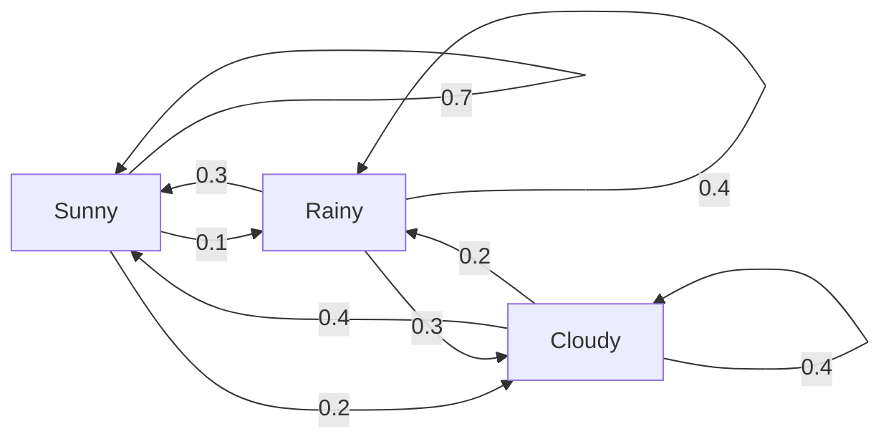
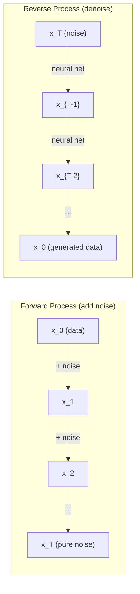

# 随机过程

> 具有结构的随机性。随机游走、马尔可夫链和扩散模型背后的数学。

**类型：** 学习
**语言：** Python
**先修知识：** 第一阶段，第06-07课（概率论，贝叶斯）
**时间：** 约75分钟

## 学习目标

- 模拟一维和二维随机游走，验证位移的 sqrt(n) 缩放规律
- 构建马尔可夫链模拟器，通过特征分解计算其平稳分布
- 实现 Metropolis-Hastings MCMC 和朗之万动力学，从目标分布中采样
- 将正向扩散过程与布朗运动联系起来，并解释反向过程如何生成数据

## 问题

许多人工智能系统涉及随时间演化的随机性。不是静态的随机性——而是结构化的、序列化的随机性，每一步都依赖于之前发生的事情。

语言模型一次生成一个 token。每个 token 依赖于之前的上下文。模型输出一个概率分布，从中采样，然后继续。这就是一个随机过程。

扩散模型逐步向图像添加噪声，直到图像变成纯静态。然后反转这个过程，逐步去噪，直到新图像出现。正向过程是一个马尔可夫链。反向过程是一个反向运行的学习过的马尔可夫链。

强化学习代理在环境中采取行动。每个行动以一定概率导致新的状态。代理在随机世界中遵循随机策略。整个过程是一个马尔可夫决策过程。

MCMC 采样——贝叶斯推断的支柱——构建一个马尔可夫链，其平稳分布就是你要采样的后验分布。

所有这些都建立在四个基础概念之上：
1. 随机游走——最简单的随机过程
2. 马尔可夫链——具有转移矩阵的结构化随机性
3. 朗之万动力学——带噪声的梯度下降
4. Metropolis-Hastings——从任何分布中采样

## 概念

### 随机游走

从位置 0 开始。每一步，抛一枚均匀硬币。正面：向右移动 (+1)。反面：向左移动 (-1)。

经过 n 步后，你的位置是 n 个随机 +/-1 值的和。期望位置是 0（游走无偏）。但距原点的期望距离随 sqrt(n) 增长。

这有点反直觉。游走是公平的——两个方向都没有漂移。但随着时间的推移，它会离起点越来越远。n 步后的标准差是 sqrt(n)。

```
Step 0:  Position = 0
Step 1:  Position = +1 or -1
Step 2:  Position = +2, 0, or -2
...
Step 100: Expected distance from origin ~ 10 (sqrt(100))
Step 10000: Expected distance from origin ~ 100 (sqrt(10000))
```

**在二维中**，游走以等概率向上、向下、向左或向右移动。距离原点的距离同样适用 sqrt(n) 缩放。路径描绘出一个类似分形的图案。

**为什么是 sqrt(n)？** 每一步是 +1 或 -1，概率相等。经过 n 步后，位置 S_n = X_1 + X_2 + ... + X_n，其中每个 X_i 是 +/-1。每一步的方差是 1，且各步独立，所以 Var(S_n) = n。标准差 = sqrt(n)。根据中心极限定理，S_n / sqrt(n) 收敛到标准正态分布。

这种 sqrt(n) 缩放出现在机器学习的许多地方。SGD 噪声的缩放比例为 1/sqrt(batch_size)。嵌入维度缩放比例为 sqrt(d)。平方根是独立随机加法的标志。

**与布朗运动的联系。** 取一个步长为 1/sqrt(n)、单位时间内有 n 步的随机游走。当 n 趋于无穷时，该游走收敛到布朗运动 B(t)——一种连续时间过程，其中 B(t) 服从均值为 0、方差为 t 的正态分布。

布朗运动是扩散的数学基础。它模拟了流体中粒子的随机抖动、股票价格的波动，以及——关键地——扩散模型中的噪声过程。

**赌徒破产问题。** 一个从位置 k 开始的随机游走者，在 0 和 N 处有吸收壁。到达 N 而非 0 的概率是多少？对于公平游走：P(到达 N) = k/N。这个结果出奇地简单且优雅。它与鞅理论相关——公平随机游走是一个鞅（期望未来值等于当前值）。

### 马尔可夫链

马尔可夫链是一个系统，它以固定的概率在状态之间转移。关键属性：下一个状态仅依赖于当前状态，而不依赖于历史。

```
P(X_{t+1} = j | X_t = i, X_{t-1} = ...) = P(X_{t+1} = j | X_t = i)
```

这就是马尔可夫性质。这意味着你可以用一个转移矩阵 P 来描述整个动态：

```
P[i][j] = probability of going from state i to state j
```

P 的每一行之和为 1（你必须去往某个地方）。

**示例——天气：**

```
States: Sunny (0), Rainy (1), Cloudy (2)

P = [[0.7, 0.1, 0.2],    (if sunny: 70% sunny, 10% rainy, 20% cloudy)
     [0.3, 0.4, 0.3],    (if rainy: 30% sunny, 40% rainy, 30% cloudy)
     [0.4, 0.2, 0.4]]    (if cloudy: 40% sunny, 20% rainy, 40% cloudy)
```

从任意状态开始。经过多次转移后，状态的分布收敛到平稳分布 pi，满足 pi * P = pi。这是 P 的特征值为 1 的左特征向量。

对于天气链，平稳分布可能是 [0.53, 0.18, 0.29]——从长期来看，无论起始状态如何，晴天的概率为 53%。



**计算平稳分布。** 有两种方法：

1. **幂法**：将任意初始分布反复乘以 P。经过足够多次迭代后，它就会收敛。
2. **特征值方法**：找到 P 的特征值为 1 的左特征向量。即 P^T 的特征值为 1 的特征向量。

两种方法都要求链满足收敛条件。

**收敛条件。** 一个马尔可夫链收敛到唯一平稳分布，如果它：
- **不可约的**：每个状态都可以从其他任何状态到达。
- **非周期的**：链不会以固定周期循环。

你在机器学习中遇到的大多数链都满足这两个条件。

**吸收态。** 一个状态是吸收态，如果一旦进入就永远不会离开（P[i][i] = 1）。吸收马尔可夫链模拟带有终止状态的过程——结束的游戏、流失的客户、遇到文本结束标记的 token 序列。

**混合时间。** 需要多少步才能使链“接近”平稳分布？形式上，使总变差距离低于某个阈值的步数。快速混合 = 所需步数少。P 的谱隙（1 减去第二大特征值）控制混合时间。隙越大，混合越快。

### 与语言模型的联系

语言模型中的 token 生成近似一个马尔可夫过程。给定当前上下文，模型输出下一个 token 的分布。温度控制分布的尖锐程度：

```
P(token_i) = exp(logit_i / temperature) / sum(exp(logit_j / temperature))
```

- 温度 = 1.0：标准分布
- 温度 < 1.0：更尖锐（更确定）
- 温度 > 1.0：更平坦（更随机）
- 温度 -> 0：argmax（贪心）

Top-k 采样截断到概率最高的 k 个 token。Top-p（核）采样截断到累积概率超过 p 的最小 token 集。两者都修改了马尔可夫转移概率。

### 布朗运动

随机游走的连续时间极限。位置 B(t) 具有三个性质：
1. B(0) = 0
2. B(t) - B(s) 服从均值为 0、方差为 t - s 的正态分布（对于 t > s）
3. 非重叠区间上的增量相互独立

布朗运动是连续的，但处处不可微——它在每个尺度上抖动。在平面中的路径具有分形维数 2。

在离散模拟中，近似布朗运动如下：

```
B(t + dt) = B(t) + sqrt(dt) * z,    where z ~ N(0, 1)
```

sqrt(dt) 缩放很重要。它来自于应用于随机游走的中心极限定理。

### 朗之万动力学

梯度下降找到函数的最小值。朗之万动力学找到与 exp(-U(x)/T) 成正比的概率分布，其中 U 是能量函数，T 是温度。

```
x_{t+1} = x_t - dt * gradient(U(x_t)) + sqrt(2 * T * dt) * z_t
```

作用在粒子上的两种力：
1. **梯度力** (-dt * gradient(U))：推向低能量（如梯度下降）
2. **随机力** (sqrt(2*T*dt) * z)：推向随机方向（探索）

在温度 T = 0 时，这是纯梯度下降。在高温时，它几乎是一个随机游走。在合适的温度下，粒子探索能景并花更多时间在低能量区域。

**与扩散模型的联系。** 扩散模型的正向过程是：

```
x_t = sqrt(alpha_t) * x_{t-1} + sqrt(1 - alpha_t) * noise
```

这是一个马尔可夫链，逐步将数据与噪声混合。经过足够多步后，x_T 是纯高斯噪声。

反向过程——从噪声回到数据——也是一个马尔可夫链，但其转移概率由神经网络学习。网络学习预测每一步添加的噪声，然后将其减去。



### MCMC：马尔可夫链蒙特卡罗

有时你需要从分布 p(x) 中采样，你可以计算 p(x)（至多一个常数），但不能直接采样。贝叶斯后验是经典例子——你知道似然乘以先验，但归一化常数难以处理。

**Metropolis-Hastings** 构造一个马尔可夫链，其平稳分布是 p(x)：

1. 从某个位置 x 开始
2. 从提议分布 Q(x'|x) 中提出一个新位置 x'
3. 计算接受比率：a = p(x') * Q(x|x') / (p(x) * Q(x'|x))
4. 以概率 min(1, a) 接受 x'。否则留在 x。
5. 重复。

如果 Q 是对称的（例如，Q(x'|x) = Q(x|x') = N(x, sigma^2)），该比率简化为 a = p(x') / p(x)。你只需要概率的比率——归一化常数被消去了。

在温和条件下，该链保证收敛到 p(x)。但如果提议太小（随机游走）或太大（高拒绝率），收敛可能很慢。调整提议是 MCMC 的艺术。

**为什么有效。** 接受比率确保了细致平衡：处于 x 且移动到 x' 的概率等于处于 x' 且移动到 x 的概率。细致平衡意味着 p(x) 是链的平稳分布。因此，经过足够多步后，样本来自 p(x)。

**实际考虑：**
- **燃烧期**：舍弃前 N 个样本。链需要时间从起始点到达平稳分布。
- **稀疏化**：每 k 个样本保留一个，以减少自相关。
- **多条链**：从不同的起始点运行多条链。如果它们收敛到相同分布，你就有了收敛的证据。
- **接受率**：对于 d 维的高斯提议，最优接受率约为 23% (Roberts & Rosenthal, 2001)。太高意味着链几乎不移动。太低意味着它拒绝一切。

### 人工智能中的随机过程

| 过程 | AI 应用 |
|------|---------|
| 随机游走 | 强化学习中的探索，Node2Vec 嵌入 |
| 马尔可夫链 | 文本生成，MCMC 采样 |
| 布朗运动 | 扩散模型（正向过程） |
| 朗之万动力学 | 基于分数的生成模型，SGLD |
| 马尔可夫决策过程 | 强化学习 |
| Metropolis-Hastings | 贝叶斯推断，后验采样 |

## 动手构建

### 步骤 1：随机游走模拟器

```python
import numpy as np

def random_walk_1d(n_steps, seed=None):
    rng = np.random.RandomState(seed)
    steps = rng.choice([-1, 1], size=n_steps)
    positions = np.concatenate([[0], np.cumsum(steps)])
    return positions


def random_walk_2d(n_steps, seed=None):
    rng = np.random.RandomState(seed)
    directions = rng.choice(4, size=n_steps)
    dx = np.zeros(n_steps)
    dy = np.zeros(n_steps)
    dx[directions == 0] = 1   # right
    dx[directions == 1] = -1  # left
    dy[directions == 2] = 1   # up
    dy[directions == 3] = -1  # down
    x = np.concatenate([[0], np.cumsum(dx)])
    y = np.concatenate([[0], np.cumsum(dy)])
    return x, y
```

一维游走存储累积和。每一步是 +1 或 -1。经过 n 步后，位置是和。方差随 n 线性增长，因此标准差随 sqrt(n) 增长。

### 步骤 2：马尔可夫链

```python
class MarkovChain:
    def __init__(self, transition_matrix, state_names=None):
        self.P = np.array(transition_matrix, dtype=float)
        self.n_states = len(self.P)
        self.state_names = state_names or [str(i) for i in range(self.n_states)]

    def step(self, current_state, rng=None):
        if rng is None:
            rng = np.random.RandomState()
        probs = self.P[current_state]
        return rng.choice(self.n_states, p=probs)

    def simulate(self, start_state, n_steps, seed=None):
        rng = np.random.RandomState(seed)
        states = [start_state]
        current = start_state
        for _ in range(n_steps):
            current = self.step(current, rng)
            states.append(current)
        return states

    def stationary_distribution(self):
        eigenvalues, eigenvectors = np.linalg.eig(self.P.T)
        idx = np.argmin(np.abs(eigenvalues - 1.0))
        stationary = np.real(eigenvectors[:, idx])
        stationary = stationary / stationary.sum()
        return np.abs(stationary)
```

平稳分布是 P 的特征值为 1 的左特征向量。我们通过计算 P^T 的特征向量来找到它（转置将左特征向量变为右特征向量）。

### 步骤 3：朗之万动力学

```python
def langevin_dynamics(grad_U, x0, dt, temperature, n_steps, seed=None):
    rng = np.random.RandomState(seed)
    x = np.array(x0, dtype=float)
    trajectory = [x.copy()]
    for _ in range(n_steps):
        noise = rng.randn(*x.shape)
        x = x - dt * grad_U(x) + np.sqrt(2 * temperature * dt) * noise
        trajectory.append(x.copy())
    return np.array(trajectory)
```

梯度将 x 推向低能量。噪声阻止它陷入局部极小。在平衡状态下，样本的分布与 exp(-U(x)/temperature) 成正比。

### 步骤 4：Metropolis-Hastings

```python
def metropolis_hastings(target_log_prob, proposal_std, x0, n_samples, seed=None):
    rng = np.random.RandomState(seed)
    x = np.array(x0, dtype=float)
    samples = [x.copy()]
    accepted = 0
    for _ in range(n_samples - 1):
        x_proposed = x + rng.randn(*x.shape) * proposal_std
        log_ratio = target_log_prob(x_proposed) - target_log_prob(x)
        if np.log(rng.rand()) < log_ratio:
            x = x_proposed
            accepted += 1
        samples.append(x.copy())
    acceptance_rate = accepted / (n_samples - 1)
    return np.array(samples), acceptance_rate
```

该算法提出一个新点，检查它是否有更高的概率（或者以比例概率接受），然后重复。接受率应在 23-50% 左右以获得良好的混合。

## 使用它

在实践中，你使用成熟的库来完成这些算法。但理解机制对于调试和调优至关重要。

```python
import numpy as np

rng = np.random.RandomState(42)
walk = np.cumsum(rng.choice([-1, 1], size=10000))
print(f"Final position: {walk[-1]}")
print(f"Expected distance: {np.sqrt(10000):.1f}")
print(f"Actual distance: {abs(walk[-1])}")
```

### 使用 numpy 处理转移矩阵

```python
import numpy as np

P = np.array([[0.7, 0.1, 0.2],
              [0.3, 0.4, 0.3],
              [0.4, 0.2, 0.4]])

distribution = np.array([1.0, 0.0, 0.0])
for _ in range(100):
    distribution = distribution @ P

print(f"Stationary distribution: {np.round(distribution, 4)}")
```

将初始分布反复乘以 P。经过足够多次迭代后，无论起始点如何，它都会收敛到平稳分布。这是找出主导左特征向量的幂法。

### 与真实框架的联系

- **PyTorch 扩散：** Hugging Face `diffusers` 中的 `DDPMScheduler` 实现了正向和反向马尔可夫链
- **NumPyro / PyMC：** 使用 MCMC（NUTS 采样器，改进了 Metropolis-Hastings）进行贝叶斯推断
- **Gymnasium (RL)：** 环境 step 函数定义了一个马尔可夫决策过程

### 验证马尔可夫链的收敛性

```python
import numpy as np

P = np.array([[0.9, 0.1], [0.3, 0.7]])

eigenvalues = np.linalg.eigvals(P)
spectral_gap = 1 - sorted(np.abs(eigenvalues))[-2]
print(f"Eigenvalues: {eigenvalues}")
print(f"Spectral gap: {spectral_gap:.4f}")
print(f"Approximate mixing time: {1/spectral_gap:.1f} steps")
```

谱隙告诉你链忘记初始状态的速度。隙为 0.2 意味着大约 5 步混合。隙为 0.01 意味着大约 100 步。在运行长模拟之前始终检查这一点——混合慢的链会浪费算力。

## 交付

本课程产出：
- `outputs/prompt-stochastic-process-advisor.md` —— 一个提示，帮助你识别特定问题适用哪个随机过程框架

## 联系

| 概念 | 出现的地方 |
|------|------------|
| 随机游走 | Node2Vec 图嵌入，强化学习中的探索 |
| 马尔可夫链 | LLM 中的 token 生成，MCMC 采样 |
| 布朗运动 | DDPM 中的正向扩散过程，基于 SDE 的模型 |
| 朗之万动力学 | 基于分数的生成模型，随机梯度朗之万动力学 (SGLD) |
| 平稳分布 | MCMC 收敛目标，PageRank |
| Metropolis-Hastings | 贝叶斯后验采样，模拟退火 |
| 温度 | LLM 采样，强化学习中的玻尔兹曼探索，模拟退火 |
| 混合时间 | MCMC 的收敛速度，谱隙分析 |
| 吸收态 | 序列结束 token，强化学习中的终止状态 |
| 细致平衡 | MCMC 采样器的正确性保证 |

扩散模型值得特别关注。DDPM (Ho et al., 2020) 定义了一个正向马尔可夫链：

```
q(x_t | x_{t-1}) = N(x_t; sqrt(1-beta_t) * x_{t-1}, beta_t * I)
```

其中 beta_t 是一个噪声调度。经过 T 步后，x_T 近似为 N(0, I)。反向过程由一个预测噪声的神经网络参数化：

```
p_theta(x_{t-1} | x_t) = N(x_{t-1}; mu_theta(x_t, t), sigma_t^2 * I)
```

生成的每一步都是学习过的马尔可夫链中的一步。理解马尔可夫链意味着理解扩散模型生成数据的方式和原因。

SGLD（随机梯度朗之万动力学）将小批量梯度下降与朗之万噪声结合起来。不是计算全梯度，而是使用随机估计并添加校准噪声。随着学习率衰减，SGLD 从优化过渡到采样——你免费获得近似的贝叶斯后验样本。这是从神经网络获得不确定性估计的最简单方法之一。

所有这些联系中的关键见解是：随机过程不仅仅是理论工具。它们是现代 AI 系统内部的计算机制。当你调整 LLM 的温度时，你是在调整一个马尔可夫链。当你训练扩散模型时，你是在学习逆转一个类布朗运动过程。当你进行贝叶斯推断时，你是在构建一个收敛到后验的链。

## 练习

1. **模拟 1000 条 10000 步的随机游走。** 绘制最终位置的分布。验证它近似为均值 0、标准差 sqrt(10000) = 100 的高斯分布。

2. **使用马尔可夫链构建一个文本生成器。** 在一小段语料上训练：对于每个词，统计到下一个词的转移次数。构建转移矩阵。通过从链中采样生成新句子。

3. **使用 Metropolis-Hastings 实现模拟退火。** 从高温开始（几乎接受一切），然后逐渐冷却（只接受改进）。用它来找到具有许多局部极小值的函数的最小值。

4. **比较不同温度下的朗之万动力学。** 从双阱势 U(x) = (x^2 - 1)^2 中采样。在低温下，样本聚集在一个阱中。在高温下，它们分布在两个阱中。找出链在两个阱之间混合的临界温度。

5. **实现正向扩散过程。** 从一个一维信号（如正弦波）开始。使用线性噪声调度逐步添加噪声，共 100 步。展示信号如何退化为纯噪声。然后实现一个简单的去噪器来逆转该过程（即使是朴素地减去估计噪声也行）。

## 关键术语

| 术语 | 人们怎么说 | 实际含义 |
|------|------------|---------|
| 随机游走 | “抛硬币移动” | 每一步位置按随机增量变化的过程 |
| 马尔可夫性质 | “无记忆性” | 未来只依赖于当前状态，而不依赖于历史 |
| 转移矩阵 | “概率表” | P[i][j] = 从状态 i 转移到状态 j 的概率 |
| 平稳分布 | “长期平均” | 满足 pi*P = pi 的分布——链的平衡态 |
| 布朗运动 | “随机抖动” | 随机游走的连续时间极限，B(t) ~ N(0, t) |
| 朗之万动力学 | “带噪声的梯度下降” | 结合确定性梯度与随机扰动的更新规则 |
| MCMC | “走向目标” | 构造一个平稳分布为你想要采样的分布的马尔可夫链 |
| Metropolis-Hastings | “提出并接受/拒绝” | 使用接受比率确保收敛的 MCMC 算法 |
| 温度 | “随机性旋钮” | 控制探索与利用权衡的参数 |
| 扩散过程 | “噪声进，噪声出” | 正向：逐步加噪。反向：逐步去噪。生成数据。 |

## 延伸阅读

- **Ho, Jain, Abbeel (2020)** —— "Denoising Diffusion Probabilistic Models." 引发扩散模型革命的 DDPM 论文。清晰推导了正向和反向马尔可夫链。
- **Song & Ermon (2019)** —— "Generative Modeling by Estimating Gradients of the Data Distribution." 使用朗之万动力学进行采样的基于分数的方法。
- **Roberts & Rosenthal (2004)** —— "General state space Markov chains and MCMC algorithms." 关于 MCMC 何时以及为何起作用的理论。
- **Norris (1997)** —— "Markov Chains." 标准教科书。涵盖收敛、平稳分布和打击时间。
- **Welling & Teh (2011)** —— "Bayesian Learning via Stochastic Gradient Langevin Dynamics." 将 SGD 与朗之万动力学结合，用于可扩展的贝叶斯推断。
