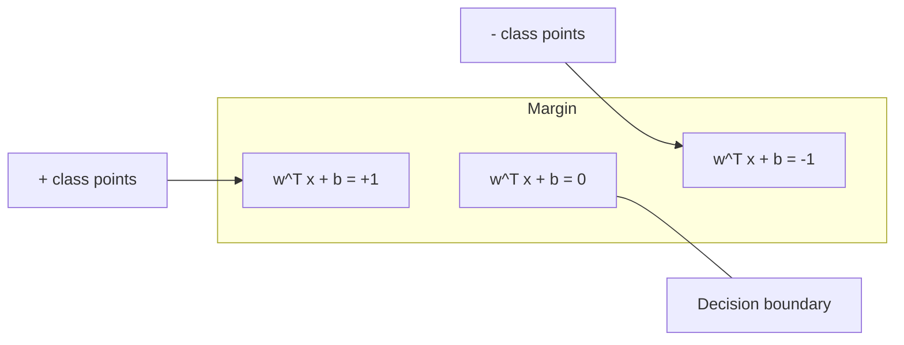
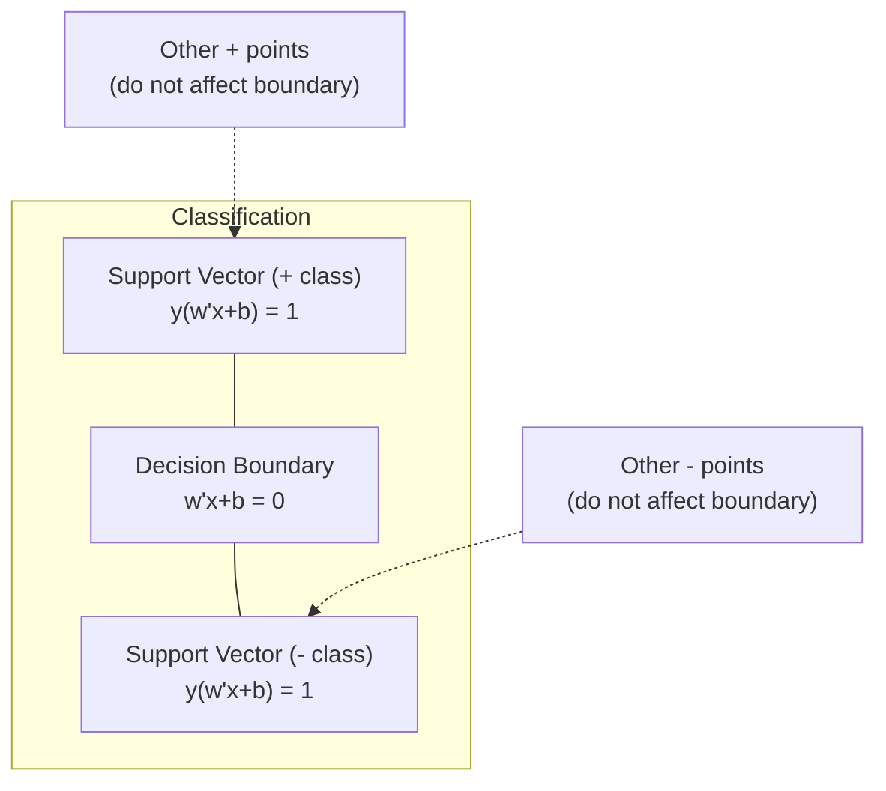
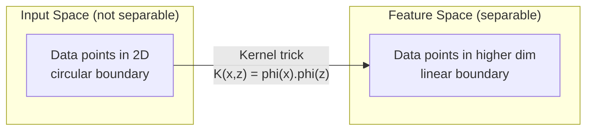

# 支持向量机

> 在两个类别之间找到最宽的“街道”。这就是核心思想。

**类型：** 构建
**语言：** Python
**前置知识：** 阶段一（第08课 优化，第14课 范数与距离，第18课 凸优化）
**时间：** 约90分钟

## 学习目标

- 使用合页损失和梯度下降从零实现一个线性SVM（原问题形式）
- 解释最大间隔原则，并能从训练好的模型中识别支持向量
- 比较线性核、多项式核与RBF核，解释核技巧如何避免显式的高维映射
- 评估参数C在间隔宽度与分类错误之间的权衡

## 问题描述

你有两类数据点，需要画一条直线（或超平面）将它们分开。理论上存在无数条可行直线。你该选择哪一条？

选择间隔最大的那一条。间隔是指决策边界与两侧最近数据点之间的距离。间隔越宽，分类器越自信，对未见数据的泛化能力也越强。

这一直觉引出了支持向量机——机器学习中最优雅的数学算法之一。在深度学习兴起之前，SVM一直是主导的分类方法，并且在数据集较小、数据维度较高，或者需要一种有理论保证、原理清晰的模型时，它仍然是首选方案。

SVM与阶段一的内容直接相关：优化是凸的（第18课），间隔通过范数度量（第14课），而核技巧利用内积处理非线性边界，无需在高维空间中进行显式计算。

## 核心概念

### 最大间隔分类器

给定线性可分的带标签数据，其中标签 y_i ∈ {-1, +1}，特征向量 x_i，我们希望找到一个超平面 w^T x + b = 0 使两类分开。

点 x_i 到超平面的距离为：

```
distance = |w^T x_i + b| / ||w||
```

对于正确分类的点：y_i * (w^T x_i + b) > 0。间隔等于超平面到两侧最近点距离的两倍。



优化问题为：

```
maximize    2 / ||w||     (the margin width)
subject to  y_i * (w^T x_i + b) >= 1  for all i
```

等价形式（最小化 ||w||² 更容易优化）：

```
minimize    (1/2) ||w||^2
subject to  y_i * (w^T x_i + b) >= 1  for all i
```

这是一个凸二次规划问题，有唯一的全局解。恰好位于间隔边界上的数据点（满足 y_i * (w^T x_i + b) = 1）就是支持向量。它们是唯一决定决策边界的点。移动或移除任何非支持向量的点，决策边界都不会改变。

### 支持向量：关键少数



大多数训练点无关紧要。只有支持向量才重要。这就是SVM在预测时内存效率高的原因：你只需要存储支持向量，而不是整个训练集。

支持向量的数量还给出了泛化误差的一个上界。相对于数据集大小，支持向量越少，泛化能力越好。

### 软间隔：用参数C处理噪声

真实数据很少是完美可分的。有些点可能位于边界的错误一侧，或者落在间隔内部。软间隔公式通过引入松弛变量允许违例。

```
minimize    (1/2) ||w||^2 + C * sum(xi_i)
subject to  y_i * (w^T x_i + b) >= 1 - xi_i
            xi_i >= 0  for all i
```

松弛变量 ξ_i 衡量了点 i 对间隔的违例程度。参数 C 控制权衡：

| C 值     | 行为                                                                 |
|----------|----------------------------------------------------------------------|
| C 较大   | 对违例惩罚严厉。间隔窄，误分类少。容易过拟合。                         |
| C 较小   | 允许更多违例。间隔宽，误分类多。容易欠拟合。                           |

C 是正则化强度的倒数。C 大 = 正则化弱。C 小 = 正则化强。

### 合页损失：SVM的损失函数

软间隔SVM可以改写为无约束优化问题：

```
minimize    (1/2) ||w||^2 + C * sum(max(0, 1 - y_i * (w^T x_i + b)))
```

项 max(0, 1 - y_i * f(x_i)) 就是合页损失。当点被正确分类且超出间隔时，损失为零；当点位于间隔内部或被错误分类时，损失是线性的。

```
Hinge loss for a single point:

loss
  |
  | \
  |  \
  |   \
  |    \
  |     \_______________
  |
  +-----|-----|-------->  y * f(x)
       0     1

Zero loss when y*f(x) >= 1 (correctly classified, outside margin).
Linear penalty when y*f(x) < 1.
```

与逻辑损失（逻辑回归）比较：

```
Hinge:     max(0, 1 - y*f(x))          Hard cutoff at margin
Logistic:  log(1 + exp(-y*f(x)))        Smooth, never exactly zero
```

合页损失产生稀疏解（只有支持向量有非零贡献）。逻辑损失则使用所有数据点。这使得SVM在预测时内存效率更高。

### 用梯度下降训练线性SVM

你可以使用梯度下降在合页损失上加上L2正则化来训练线性SVM，而不需要求解带约束的二次规划：

```
L(w, b) = (lambda/2) * ||w||^2 + (1/n) * sum(max(0, 1 - y_i * (w^T x_i + b)))

Gradient with respect to w:
  If y_i * (w^T x_i + b) >= 1:  dL/dw = lambda * w
  If y_i * (w^T x_i + b) < 1:   dL/dw = lambda * w - y_i * x_i

Gradient with respect to b:
  If y_i * (w^T x_i + b) >= 1:  dL/db = 0
  If y_i * (w^T x_i + b) < 1:   dL/db = -y_i
```

这称为原问题形式。每轮迭代的时间复杂度为 O(n×d)，其中 n 是样本数，d 是特征数。对于大规模、稀疏、高维数据（如文本分类），这种方法是快速的。

### 对偶形式与核技巧

SVM问题的拉格朗日对偶形式（来自阶段一第18课，KKT条件）为：

```
maximize    sum(alpha_i) - (1/2) * sum_ij(alpha_i * alpha_j * y_i * y_j * (x_i . x_j))
subject to  0 <= alpha_i <= C
            sum(alpha_i * y_i) = 0
```

对偶形式只涉及数据点之间的内积 x_i · x_j。这是关键洞察。将每个内积替换为核函数 K(x_i, x_j)，SVM就能学习非线性边界，而无需显式计算变换。

```
Linear kernel:      K(x, z) = x . z
Polynomial kernel:  K(x, z) = (x . z + c)^d
RBF (Gaussian):     K(x, z) = exp(-gamma * ||x - z||^2)
```

RBF核将数据映射到无限维空间。在输入空间中距离近的点，核函数值接近1；距离远的点，核函数值接近0。它可以学习任意平滑的决策边界。



核技巧计算高维空间中的内积，却从未真正进入那个空间。以 D 维空间中的 d 次多项式核为例，显式特征空间有 O(D^d) 个维度，但 K(x, z) 的计算时间仅为 O(D)。

### 支持向量回归（SVR）

支持向量回归在数据周围拟合一个宽度为 ε 的管道。在管道内部的点损失为零，管道外部的点被线性惩罚。

```
minimize    (1/2) ||w||^2 + C * sum(xi_i + xi_i*)
subject to  y_i - (w^T x_i + b) <= epsilon + xi_i
            (w^T x_i + b) - y_i <= epsilon + xi_i*
            xi_i, xi_i* >= 0
```

参数 ε 控制管道宽度。管道越宽 = 支持向量越少 = 拟合更平滑。管道越窄 = 支持向量越多 = 拟合更紧。

### SVM为何输给深度学习（以及何时仍占优势）

从20世纪90年代末到21世纪初，SVM主导了机器学习。深度学习在多个方面超越了SVM：

| 因素             | SVM                          | 深度学习                     |
|------------------|------------------------------|------------------------------|
| 特征工程         | 需要手工特征                  | 自动学习特征                 |
| 可扩展性         | 核方法 O(n²) 到 O(n³)        | 使用SGD每轮 O(n)             |
| 图像/文本/音频   | 需要手工构造特征              | 从原始数据学习               |
| 大数据集（>10万） | 较慢                         | 可良好扩展                   |
| GPU加速          | 受益有限                     | 显著加速                     |

SVM在以下场景仍然占优：
- 小数据集（几百到几千个样本）
- 高维稀疏数据（基于TF-IDF特征的文本）
- 需要数学保证（间隔界限）时
- 训练时间必须极短时（线性SVM非常快）
- 具有清晰间隔结构的二分类问题
- 异常检测（一类SVM）

## 动手实现

### 第一步：合页损失与梯度

基础。计算一个批次的合页损失及其梯度。

```python
def hinge_loss(X, y, w, b):
    n = len(X)
    total_loss = 0.0
    for i in range(n):
        margin = y[i] * (dot(w, X[i]) + b)
        total_loss += max(0.0, 1.0 - margin)
    return total_loss / n
```

### 第二步：用梯度下降实现线性SVM

通过最小化带正则化的合页损失来训练。不需要QP求解器。

```python
class LinearSVM:
    def __init__(self, lr=0.001, lambda_param=0.01, n_epochs=1000):
        self.lr = lr
        self.lambda_param = lambda_param
        self.n_epochs = n_epochs
        self.w = None
        self.b = 0.0

    def fit(self, X, y):
        n_features = len(X[0])
        self.w = [0.0] * n_features
        self.b = 0.0

        for epoch in range(self.n_epochs):
            for i in range(len(X)):
                margin = y[i] * (dot(self.w, X[i]) + self.b)
                if margin >= 1:
                    self.w = [wj - self.lr * self.lambda_param * wj
                              for wj in self.w]
                else:
                    self.w = [wj - self.lr * (self.lambda_param * wj - y[i] * X[i][j])
                              for j, wj in enumerate(self.w)]
                    self.b -= self.lr * (-y[i])

    def predict(self, X):
        return [1 if dot(self.w, x) + self.b >= 0 else -1 for x in X]
```

### 第三步：核函数

实现线性核、多项式核和RBF核。

```python
def linear_kernel(x, z):
    return dot(x, z)

def polynomial_kernel(x, z, degree=3, c=1.0):
    return (dot(x, z) + c) ** degree

def rbf_kernel(x, z, gamma=0.5):
    diff = [xi - zi for xi, zi in zip(x, z)]
    return math.exp(-gamma * dot(diff, diff))
```

### 第四步：间隔与支持向量识别

训练完成后，识别哪些点是支持向量并计算间隔宽度。

```python
def find_support_vectors(X, y, w, b, tol=1e-3):
    support_vectors = []
    for i in range(len(X)):
        margin = y[i] * (dot(w, X[i]) + b)
        if abs(margin - 1.0) < tol:
            support_vectors.append(i)
    return support_vectors
```

完整实现及所有演示请参阅 `code/svm.py`。

## 使用示例

使用scikit-learn：

```python
from sklearn.svm import SVC, LinearSVC, SVR
from sklearn.preprocessing import StandardScaler
from sklearn.pipeline import Pipeline

clf = Pipeline([
    ("scaler", StandardScaler()),
    ("svm", SVC(kernel="rbf", C=1.0, gamma="scale")),
])
clf.fit(X_train, y_train)
print(f"Accuracy: {clf.score(X_test, y_test):.4f}")
print(f"Support vectors: {clf['svm'].n_support_}")
```

重要：训练SVM前务必缩放特征。SVM对特征数值大小敏感，因为间隔取决于 ||w||，未缩放的特征会扭曲几何结构。

对于大型数据集，使用 `LinearSVC`（原问题形式，每轮 O(n)）代替 `SVC`（对偶形式，O(n²) 到 O(n³)）：

```python
from sklearn.svm import LinearSVC

clf = Pipeline([
    ("scaler", StandardScaler()),
    ("svm", LinearSVC(C=1.0, max_iter=10000)),
])
```

## 练习

1. 生成一个二维线性可分数据集。训练你自己的 LinearSVM，识别支持向量。验证支持向量是距离决策边界最近的点。

2. 在带噪声的数据集上，将 C 从 0.001 变化到 1000。绘制每个 C 值下的决策边界。观察从宽间隔（欠拟合）到窄间隔（过拟合）的转变过程。

3. 创建一个类别边界为圆形（非线性）的数据集。展示线性SVM会失败。计算RBF核矩阵，并展示在核诱导的特征空间中类别变得可分。

4. 在同一数据集上比较合页损失与逻辑损失。训练一个线性SVM和一个逻辑回归模型。统计每个模型决策边界所涉及的训练点数量（支持向量 vs 所有点）。

5. 实现SVR（ε-不敏感损失）。将其拟合到 y = sin(x) + 噪声上。绘制预测周围的 ε 管道，并突出显示支持向量（管道外部的点）。

## 关键术语

| 术语                | 实际含义                                                                 |
|---------------------|--------------------------------------------------------------------------|
| 支持向量             | 最靠近决策边界的训练点。唯一决定超平面的点。                               |
| 间隔                 | 决策边界与最近支持向量之间的距离。SVM最大化这个间隔。                       |
| 合页损失             | max(0, 1 - y·f(x))。当正确分类且超出间隔时为零，否则为线性惩罚。            |
| C 参数               | 间隔宽度与分类错误之间的权衡。C大 = 窄间隔，C小 = 宽间隔。                  |
| 软间隔               | 通过松弛变量允许间隔违例的SVM公式。处理不可分数据。                         |
| 核技巧               | 在高维特征空间中计算内积，而无需显式映射到该空间。                          |
| 线性核               | K(x, z) = x·z。等同于标准内积。用于线性可分数据。                          |
| RBF核                | K(x, z) = exp(-γ ||x-z||²)。映射到无限维空间。可学习任意平滑边界。         |
| 多项式核             | K(x, z) = (x·z + c)^d。映射到多项式组合的特征空间。                        |
| 对偶形式             | SVM问题的重新表述，仅依赖于数据点之间的内积。使得核方法成为可能。            |
| SVR                  | 支持向量回归。在数据周围拟合一个ε-管道。管道内部的点损失为零。               |
| 松弛变量             | ξ_i：衡量点i对间隔的违例程度。对正确分类且位于间隔外的点为零。              |
| 最大间隔             | 选择最大化与各类最近点之间距离的超平面的原则。                             |

## 扩展阅读

- [Vapnik: The Nature of Statistical Learning Theory (1995)](https://link.springer.com/book/10.1007/978-1-4757-3264-1) – SVM与统计学习理论的奠基之作
- [Cortes & Vapnik: Support-vector networks (1995)](https://link.springer.com/article/10.1007/BF00994018) – 原始SVM论文
- [Platt: Sequential Minimal Optimization (1998)](https://www.microsoft.com/en-us/research/publication/sequential-minimal-optimization-a-fast-algorithm-for-training-support-vector-machines/) – 使SVM训练实用的SMO算法
- [scikit-learn SVM documentation](https://scikit-learn.org/stable/modules/svm.html) – 包含实现细节的实用指南
- [LIBSVM: A Library for Support Vector Machines](https://www.csie.ntu.edu.tw/~cjlin/libsvm/) – 大多数SVM实现背后的C++库
