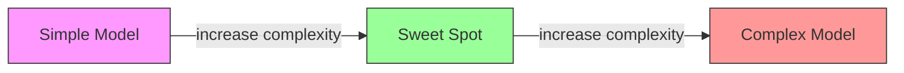
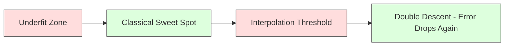
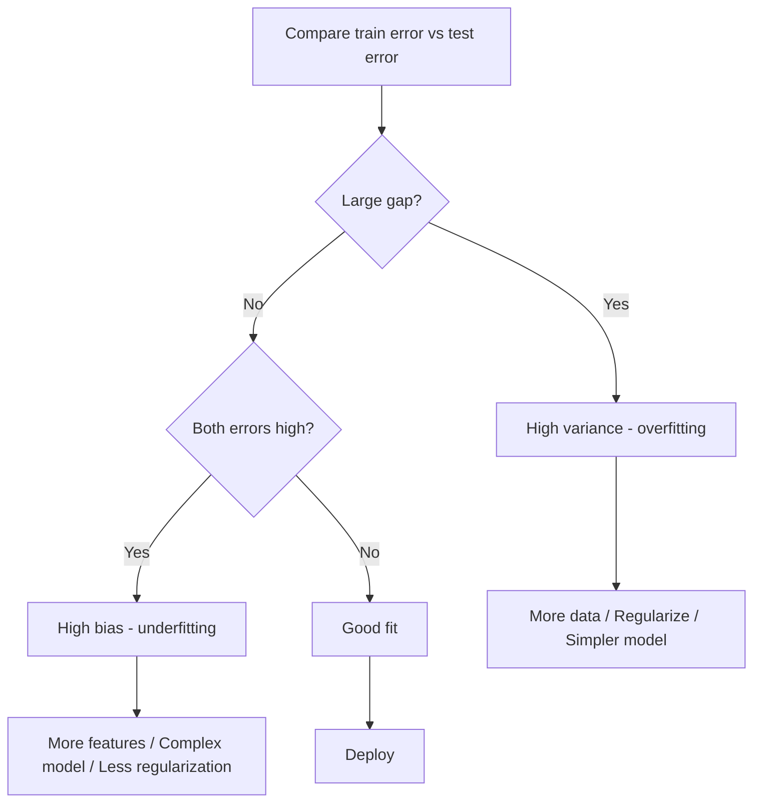
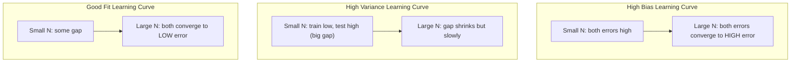
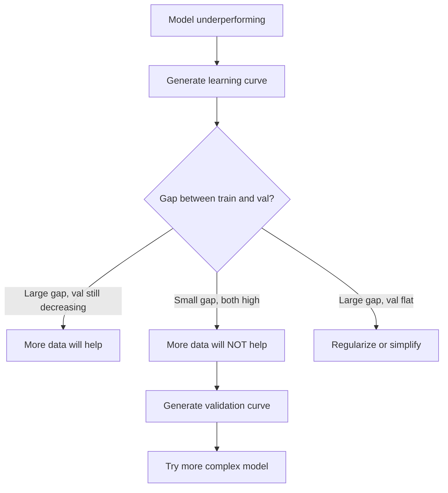

# 偏差-方差权衡

> 每个模型的误差都来自三个来源之一：偏差、方差或噪声。你只能控制前两个。

**类型：** 学习
**语言：** Python
**先修要求：** 阶段 2，课程 01-09（机器学习基础、回归、分类、评估）
**预计时间：** ~75 分钟

## 学习目标

- 推导期望预测误差的偏差-方差分解，并解释不可约噪声的作用
- 利用训练误差和测试误差模式诊断模型是存在高偏差还是高方差
- 解释正则化技术（L1、L2、Dropout、早停）如何用偏差换取方差
- 实现实验，在复杂度递增的模型上可视化偏差-方差权衡

## 问题

你训练了一个模型。它在测试数据上有一些误差。这些误差从何而来？

如果你的模型过于简单（在曲线数据集上的线性回归），它会始终遗漏真实模式。这就是偏差。如果你的模型过于复杂（15 个数据点上的 20 次多项式），它会完美拟合训练数据，但在新数据上给出截然不同的预测。这就是方差。

对于固定的模型容量，你无法同时最小化两者。降低偏差会使方差上升。降低方差会使偏差上升。理解这一权衡是机器学习中最有用的诊断技能。它告诉你应该让模型更复杂还是更简单，应该获取更多数据还是设计更好的特征，应该增加还是减少正则化。

## 概念

### 偏差：系统性误差

偏差衡量模型平均预测值偏离真实值的程度。如果你在从同一分布中抽取的不同训练集上训练同一个模型，并对预测值取平均，偏差就是那个平均值与真实值之间的差距。

高偏差意味着模型过于僵化，无法捕捉真实模式。用直线拟合抛物线，无论你给它多少数据，始终会偏离曲线。这就是欠拟合。

```
High bias (underfitting):
  Model always predicts roughly the same wrong thing.
  Training error: HIGH
  Test error: HIGH
  Gap between them: SMALL
```

### 方差：对训练数据的敏感度

方差衡量当你用不同子集的数据训练时，预测值的变化程度。如果训练集的小变化导致模型的大变化，方差就很高。

高方差意味着模型在拟合训练数据中的噪声，而非底层信号。一个 20 次多项式会穿过每个训练点，但会在它们之间剧烈振荡。这就是过拟合。

```
High variance (overfitting):
  Model fits training data perfectly but fails on new data.
  Training error: LOW
  Test error: HIGH
  Gap between them: LARGE
```

### 分解

对于任意点 x，平方损失下的期望预测误差精确分解为：

```
Expected Error = Bias^2 + Variance + Irreducible Noise

where:
  Bias^2   = (E[f_hat(x)] - f(x))^2
  Variance = E[(f_hat(x) - E[f_hat(x)])^2]
  Noise    = E[(y - f(x))^2]             (sigma^2)
```

- `f(x)` 是真实函数
- `f_hat(x)` 是你模型的预测
- `E[...]` 是在不同训练集上的期望
- `y` 是观测到的标签（真实函数加上噪声）

噪声项是不可约的。在含噪数据上，没有模型能做得比 σ² 更好。你的任务是在偏差² 和方差之间找到正确的平衡。

### 模型复杂度与环境



经典的 U 形曲线：

| 复杂度 | 偏差 | 方差 | 总误差 |
|--------|------|------|--------|
| 过低   | 高   | 低   | 高（欠拟合） |
| 恰好   | 中等 | 中等 | 最低   |
| 过高   | 低   | 高   | 高（过拟合） |

### 正则化作为偏差-方差控制

正则化有意增加偏差以降低方差。它约束模型，使其无法追逐噪声。

- **L2（Ridge）：** 将所有权重向零收缩。保留所有特征但削弱其影响。
- **L1（Lasso）：** 将某些权重精确推到零。执行特征选择。
- **Dropout：** 训练时随机禁用神经元。强制冗余表示。
- **早停：** 在模型完全拟合训练数据之前停止训练。

正则化强度（λ、dropout 率、训练轮数）直接控制你在偏差-方差曲线上的位置。正则化越多，偏差越大，方差越小。

### 双重下降：现代视角

经典理论认为：过了最优点之后，更多复杂度总是有害的。但自 2019 年以来的研究显示了一些出乎意料的结果。如果继续大幅增加模型容量，直到过插值阈值（模型有足够参数完美拟合训练数据），测试误差可能会再次下降。



这种“双重下降”现象解释了为什么过度参数化的神经网络（参数远多于训练样本）仍然具有良好的泛化能力。经典的偏差-方差权衡并非错误，但对于现代情景来说并不完整。

关于双重下降的关键观察：
- 它出现在线性模型、决策树和神经网络中
- 在插值区域，更多数据实际上可能有害（样本维度的双重下降）
- 更多训练轮数也会导致它（轮数的双重下降）
- 正则化可以平滑峰值，但无法消除它

为什么会这样？在插值阈值处，模型正好有足够容量拟合所有训练点。它被迫采用一个穿过每个点的非常特定的解，数据中的小扰动会导致拟合的巨大变化。这是方差最大的地方。过了阈值后，模型有许多可能的解都能完美拟合数据。学习算法（例如带有隐式正则化的梯度下降）倾向于从中选择最简单的那个。这种对简单解的隐式偏好就是过度参数化模型能够泛化的原因。

| 机制 | 参数与样本数 | 行为 |
|------|--------------|------|
| 欠参数化 | p << n | 经典权衡适用 |
| 插值阈值 | p ~ n | 方差达到峰值，测试误差飙升 |
| 过参数化 | p >> n | 隐式正则化生效，测试误差下降 |

实际意义：如果你使用神经网络或大型树集成，不要停在插值阈值处。要么远远低于它（带有显式正则化），要么远远超过它。最糟糕的位置正好在阈值上。

### 诊断你的模型



| 症状 | 诊断 | 修复 |
|------|------|------|
| 训练误差高，测试误差高 | 偏差 | 更多特征、更复杂模型、减少正则化 |
| 训练误差低，测试误差高 | 方差 | 更多数据、正则化、更简单模型、Dropout |
| 训练误差低，测试误差低 | 拟合良好 | 发布 |
| 训练误差下降，测试误差上升 | 正在过拟合 | 早停 |

### 实用策略

**当偏差是问题时：**
- 添加多项式或交互特征
- 使用更灵活的模型（树集成代替线性）
- 降低正则化强度
- 训练更长时间（如果尚未收敛）

**当方差是问题时：**
- 获取更多训练数据
- 使用装袋（随机森林）
- 增加正则化（更高的 λ、更多的 Dropout）
- 特征选择（去除含噪特征）
- 使用交叉验证早期发现

### 集成方法与方差降低

集成方法是对抗方差最实用的工具。

**装袋（Bootstrap 聚合）** 在训练数据的不同 Bootstrap 样本上训练多个模型，然后平均它们的预测。每个单独的模型具有高方差，但平均值的方差要低得多。随机森林是应用于决策树的装袋。

它在数学上有效的原因：如果你平均 N 个独立的预测，每个预测的方差为 σ²，则平均值的方差为 σ² / N。模型并非真正独立（它们都看到相似的数据），因此降低幅度小于 1/N，但仍非常显著。

**提升** 通过顺序构建模型来降低偏差，每个新模型都专注于当前集成中的误差。梯度提升和 AdaBoost 是主要例子。提升如果添加太多模型可能会过拟合，因此需要早停或正则化。

| 方法 | 主要效果 | 偏差变化 | 方差变化 |
|------|----------|----------|----------|
| 装袋 | 降低方差 | 无变化 | 降低 |
| 提升 | 降低偏差 | 降低 | 可能增加 |
| 堆叠 | 两者都降 | 取决于元学习器 | 取决于基模型 |
| Dropout | 隐式装袋 | 轻微增加 | 降低 |

**实用规则：** 如果你的基模型方差高（深层树、高次多项式），使用装袋。如果你的基模型偏差高（浅层树桩、简单线性模型），使用提升。

### 学习曲线

学习曲线将训练和验证误差绘制为训练集大小的函数。它们是你拥有的最实用的诊断工具。与单次的训练/测试比较不同，学习曲线展示了模型的轨迹，并告诉你更多数据是否有帮助。



如何解读：

| 场景 | 训练误差 | 验证误差 | 差距 | 含义 | 应对措施 |
|------|----------|----------|------|------|----------|
| 高偏差 | 高 | 高 | 小 | 模型无法捕捉模式 | 更多特征、复杂模型、减少正则化 |
| 高方差 | 低 | 高 | 大 | 模型记忆训练数据 | 更多数据、正则化、更简单模型 |
| 拟合良好 | 中等 | 中等 | 小 | 模型泛化良好 | 发布 |
| 高方差，正在改善 | 低 | 随数据增加而下降 | 缩小 | 数据能解决的方差问题 | 收集更多数据 |
| 高偏差，平坦 | 高 | 高且平坦 | 小且平坦 | 更多数据无效 | 改变模型架构 |

关键洞察：如果两条曲线都已平台化且差距很小，但两者误差都高，那么更多数据是无用的。你需要更好的模型。如果差距很大且仍在缩小，更多数据会有帮助。

### 如何生成学习曲线

有两种方法：

**方法 1：改变训练集大小，固定模型。** 保持模型和超参数固定。在训练数据的逐渐增大的子集上训练。在每个大小上测量训练误差和验证误差。这是标准的学习曲线。

**方法 2：改变模型复杂度，固定数据。** 保持数据固定。扫描一个复杂度参数（多项式次数、树深度、层数）。在每个复杂度上测量训练误差和验证误差。这是验证曲线，直接显示偏差-方差权衡。

两种方法互补。第一种告诉你更多数据是否有帮助。第二种告诉你不同的模型是否有帮助。在决定下一步之前，同时运行两者。



## 构建它

`code/bias_variance.py` 中的代码运行完整的偏差-方差分解实验。以下是分步方法。

### 步骤 1：从已知函数生成合成数据

我们使用 `f(x) = sin(1.5x) + 0.5x` 加上高斯噪声。知道真实函数使我们能够精确计算偏差和方差。

```python
def true_function(x):
    return np.sin(1.5 * x) + 0.5 * x

def generate_data(n_samples=30, noise_std=0.5, x_range=(-3, 3), seed=None):
    rng = np.random.RandomState(seed)
    x = rng.uniform(x_range[0], x_range[1], n_samples)
    y = true_function(x) + rng.normal(0, noise_std, n_samples)
    return x, y
```

### 步骤 2：Bootstrap 采样与多项式拟合

对于每个多项式次数，我们抽取多个 Bootstrap 训练集，拟合多项式，并在固定测试网格上记录预测值。这给出了每个测试点上预测值的分布。

```python
def fit_polynomial(x_train, y_train, degree, lam=0.0):
    X = np.column_stack([x_train ** d for d in range(degree + 1)])
    if lam > 0:
        penalty = lam * np.eye(X.shape[1])
        penalty[0, 0] = 0
        w = np.linalg.solve(X.T @ X + penalty, X.T @ y_train)
    else:
        w = np.linalg.lstsq(X, y_train, rcond=None)[0]
    return w
```

我们在 200 个不同的 Bootstrap 样本上拟合。每个 Bootstrap 样本从相同的底层分布中抽取，但包含不同的点。

### 步骤 3：计算偏差²、方差分解

有了每个测试点上的 200 组预测值，我们可以直接从定义中计算分解：

```python
mean_pred = predictions.mean(axis=0)
bias_sq = np.mean((mean_pred - y_true) ** 2)
variance = np.mean(predictions.var(axis=0))
total_error = np.mean(np.mean((predictions - y_true) ** 2, axis=1))
```

- `mean_pred` 是从 Bootstrap 样本估计的 E[f_hat(x)]
- `bias_sq` 是平均预测值与真实值之间的平方差距
- `variance` 是所有 Bootstrap 样本上预测值的平均离散度
- `total_error` 应近似等于 bias² + variance + noise

### 步骤 4：学习曲线

学习曲线在训练集大小上扫描，同时保持模型复杂度固定。它们显示你的模型是数据受限还是容量受限。

```python
def demo_learning_curves():
    sizes = [10, 15, 20, 30, 50, 75, 100, 150, 200, 300]
    degree = 5

    for n in sizes:
        train_errors = []
        test_errors = []
        for seed in range(50):
            x_train, y_train = generate_data(n_samples=n, seed=seed * 100)
            w = fit_polynomial(x_train, y_train, degree)
            train_pred = predict_polynomial(x_train, w)
            train_mse = np.mean((train_pred - y_train) ** 2)
            test_pred = predict_polynomial(x_test, w)
            test_mse = np.mean((test_pred - y_test) ** 2)
            train_errors.append(train_mse)
            test_errors.append(test_mse)
        # Average over runs gives the learning curve point
```

对于一个高方差模型（度数 5，小数据），你看到：
- 训练误差开始时很低，随着更多数据使记忆化变得困难而增加
- 测试误差开始时很高，随着模型获得更多信号而降低
- 差距随着更多数据而缩小

对于一个高偏差模型（度数 1），两条曲线迅速收敛到相同的高值，更多数据也没有帮助。

### 步骤 5：正则化扫描

代码还包含了 `demo_regularization_sweep()`，它固定一个高次多项式（度数 15），并在 Ridge 正则化强度上从 0.001 扫描到 100。这从另一个角度展示了偏差-方差权衡：不是改变模型复杂度，而是改变约束强度。

```python
def demo_regularization_sweep():
    alphas = [0.001, 0.005, 0.01, 0.05, 0.1, 0.5, 1.0, 5.0, 10.0, 50.0, 100.0]
    for alpha in alphas:
        results = bias_variance_decomposition([15], lam=alpha)
        r = results[15]
        print(f"alpha={alpha:.3f}  bias={r['bias_sq']:.4f}  var={r['variance']:.4f}")
```

在低 alpha 下，度数 15 的多项式几乎不受约束。方差占主导，因为模型在每次 Bootstrap 样本中追逐噪声。在高 alpha 下，惩罚如此之强，以至于模型实际上变成了一个接近常数的函数。偏差占主导。最优 alpha 介于这些极端之间。

这与通过改变多项式度数得到的 U 形曲线相同，但由一个连续旋钮而不是离散旋钮控制。在实践中，正则化是控制权衡的首选方式，因为它允许精细控制而无需改变特征集。

## 使用它

sklearn 提供了 `learning_curve` 和 `validation_curve` 来自动化这些诊断，无需编写 Bootstrap 循环。

### 验证曲线：扫描模型复杂度

```python
from sklearn.model_selection import validation_curve
from sklearn.pipeline import make_pipeline
from sklearn.preprocessing import PolynomialFeatures
from sklearn.linear_model import Ridge

degrees = list(range(1, 16))
train_scores_all = []
val_scores_all = []

for d in degrees:
    pipe = make_pipeline(PolynomialFeatures(d), Ridge(alpha=0.01))
    train_scores, val_scores = validation_curve(
        pipe, X, y, param_name="polynomialfeatures__degree",
        param_range=[d], cv=5, scoring="neg_mean_squared_error"
    )
    train_scores_all.append(-train_scores.mean())
    val_scores_all.append(-val_scores.mean())
```

这直接给出了偏差-方差权衡曲线。在验证分数相对于训练分数最差的地方，方差占主导。在两者都很差的地方，偏差占主导。

### 学习曲线：扫描训练集大小

```python
from sklearn.model_selection import learning_curve

pipe = make_pipeline(PolynomialFeatures(5), Ridge(alpha=0.01))
train_sizes, train_scores, val_scores = learning_curve(
    pipe, X, y, train_sizes=np.linspace(0.1, 1.0, 10),
    cv=5, scoring="neg_mean_squared_error"
)
train_mse = -train_scores.mean(axis=1)
val_mse = -val_scores.mean(axis=1)
```

将 `train_mse` 和 `val_mse` 针对 `train_sizes` 绘图。其形状告诉你关于模型的一切。

### 带有正则化扫描的交叉验证

```python
from sklearn.model_selection import cross_val_score

alphas = [0.001, 0.01, 0.1, 1.0, 10.0, 100.0]
for alpha in alphas:
    pipe = make_pipeline(PolynomialFeatures(10), Ridge(alpha=alpha))
    scores = cross_val_score(pipe, X, y, cv=5, scoring="neg_mean_squared_error")
    print(f"alpha={alpha:>7.3f}  MSE={-scores.mean():.4f} +/- {scores.std():.4f}")
```

这会为固定的模型复杂度扫描正则化强度。你会看到相同的偏差-方差权衡：低 alpha 意味着高方差，高 alpha 意味着高偏差。

### 综合应用：完整的诊断工作流程

在实践中，你按顺序运行这些诊断：

1. 训练你的模型。计算训练和测试误差。
2. 如果两者都高：你有偏差问题。跳到步骤 4。
3. 如果训练低但测试高：你有方差问题。生成学习曲线看看更多数据是否有帮助。如果没有，则正则化。
4. 生成一个验证曲线，扫描主要复杂度参数。找到最优点。
5. 在最优点处，生成学习曲线。如果差距仍然很大，你需要更多数据或正则化。
6. 使用 `cross_val_score` 尝试不同 alpha 值的 Ridge/Lasso。选择交叉验证误差最低的 alpha。

对于大多数表格数据集，这需要 10-15 分钟的计算时间，并能节省数小时的猜测。

## 发布

本课产出：`outputs/prompt-model-diagnostics.md`

## 练习

1. 以 `noise_std=0`（无噪声）运行分解。不可约误差项会发生什么变化？最优复杂度会改变吗？

2. 将训练集大小从 30 增加到 300。这对方差分量有什么影响？最优多项式次数会移动吗？

3. 向实验添加 L2 正则化（Ridge 回归）。固定一个高次多项式（度数 15），从 0 到 100 扫描 lambda。将偏差² 和方差绘制为 lambda 的函数。

4. 将真实函数从多项式修改为 `sin(x)`。偏差-方差分解如何变化？是否仍有一个清晰的最优次数？

5. 实现一个简单的 Bootstrap 聚合（装袋）包装器：在 Bootstrap 样本上训练 10 个模型并平均预测。证明这样可以降低方差而不会大幅增加偏差。

## 关键术语

| 术语 | 人们的说法 | 实际含义 |
|------|------------|----------|
| 偏差 | "模型太简单" | 因错误假设产生的系统误差。模型平均预测值与真实值之间的差距。 |
| 方差 | "模型过拟合了" | 因对训练数据敏感产生的误差。预测值在不同训练集之间的变化程度。 |
| 不可约误差 | "数据中的噪声" | 来自真实数据生成过程中随机性产生的误差。没有模型能消除它。 |
| 欠拟合 | "没有学到足够" | 模型偏差高。即使在训练数据上也遗漏了真实模式。 |
| 过拟合 | "记忆了数据" | 模型方差高。它拟合了训练数据中不泛化的噪声。 |
| 正则化 | "约束模型" | 添加惩罚以降低模型复杂度，用偏差换取更低的方差。 |
| 双重下降 | "更多参数可能有帮助" | 当模型容量远超过插值阈值时，测试误差再次下降。 |
| 模型复杂度 | "模型的灵活性" | 模型拟合任意模式的容量。由架构、特征或正则化控制。 |

## 延伸阅读

- [Hastie, Tibshirani, Friedman: Elements of Statistical Learning, Ch. 7](https://hastie.su.domains/ElemStatLearn/) —— 偏差-方差分解的权威论述
- [Belkin et al., Reconciling modern machine learning practice and the bias-variance trade-off (2019)](https://arxiv.org/abs/1812.11118) —— 双重下降论文
- [Nakkiran et al., Deep Double Descent (2019)](https://arxiv.org/abs/1912.02292) —— 轮数维度和样本维度的双重下降
- [Scott Fortmann-Roe: Understanding the Bias-Variance Tradeoff](http://scott.fortmann-roe.com/docs/BiasVariance.html) —— 清晰的视觉解释
