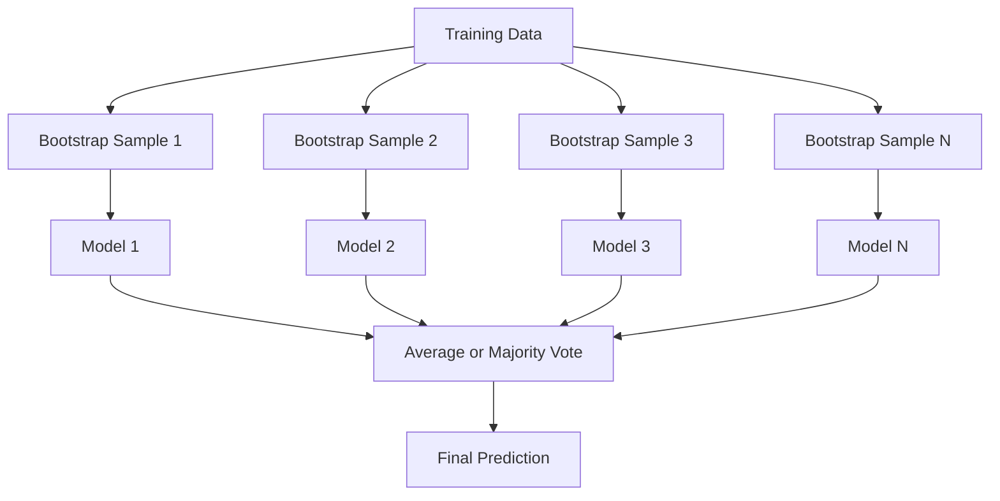
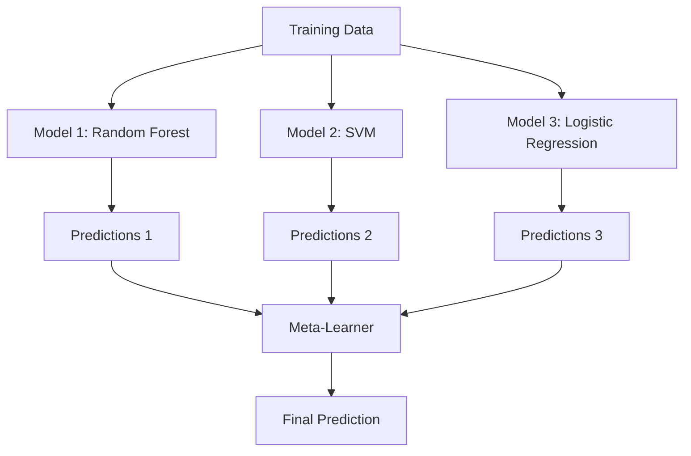

# 集成方法

> 一群弱学习器，若正确组合，就会变成一个强学习器。这不是比喻，而是一个定理。

**类型：** 构建  
**语言：** Python  
**前置知识：** 第二阶段，第 10 课（偏差‑方差权衡）  
**时长：** 约 120 分钟  

## 学习目标

- 从零实现 AdaBoost 和梯度提升，并解释提升如何逐步降低偏差  
- 构建一个装袋集成，并展示对去相关模型取平均如何在不增加偏差的情况下减少方差  
- 比较装袋、提升和堆叠在各自针对哪种误差成分上的区别  
- 评估集成多样性，并解释为什么随着更多独立弱学习器的加入，多数投票的准确率会提高  

## 问题

单个决策树训练快、易于解释，但容易过拟合。单个线性模型在复杂边界上则欠拟合。你可以花数天时间精心设计完美的模型架构，或者你也可以把一堆不完美的模型组合起来，得到比其中任何一个都更好的结果。

集成方法做的正是这件事。它们是在表格数据上赢得 Kaggle 竞赛最可靠的技术，驱动着大多数生产级机器学习系统，并且生动诠释了偏差‑方差权衡。装袋降低方差，提升降低偏差，堆叠则学习针对不同输入该信任哪个模型。

## 概念

### 集成为什么有效

假设你有 N 个独立的分类器，每个准确率为 p > 0.5。多数投票的准确率为：

```
P(majority correct) = sum over k > N/2 of C(N,k) * p^k * (1-p)^(N-k)
```

对于 21 个准确率均为 60% 的分类器，多数投票准确率约为 74%。当分类器增加到 101 个时，准确率上升至 84%。当模型犯的错误不同时，错误会相互抵消。

关键要求是**多样性**。如果所有模型都犯相同的错误，组合它们毫无意义。集成有效是因为它们通过以下方式产生了多样化的模型：

- 不同的训练子集（装袋）
- 不同的特征子集（随机森林）
- 顺序错误纠正（提升）
- 不同的模型族（堆叠）

### 装袋（Bootstrap 聚合）

装袋通过在每个不同的训练数据 Bootstrap 样本上训练模型来创造多样性。



Bootstrap 样本是从原始数据中有放回地抽取的，大小与原始数据集相同。每个 Bootstrap 中包含大约 63.2% 的不重复样本。剩下的 36.8%（袋外样本）提供了一个免费的验证集。

装袋在不显著增加偏差的情况下降低了方差。每个单独的树都会对其 Bootstrap 样本过拟合，但不同树的过拟合方式不同，因此取平均可以抵消噪声。

**随机森林** 是装袋加上一个额外的技巧：在每个分裂点处，只考虑随机选择的一部分特征。这迫使树之间更加多样化。分类任务中常用候选特征数为 `sqrt(n_features)`，回归任务中为 `n_features / 3`。

### 提升（顺序错误纠正）

提升按顺序训练模型。每个新模型重点关注之前模型预测错误的样本。


提升降低偏差。每个新模型都在纠正当前集成系统的误差。最终预测是所有模型的加权和，表现更好的模型获得更高的权重。

权衡：如果运行太多轮次，提升可能会过拟合，因为它会不断拟合那些越来越难的样本，其中一些可能是噪声。

### AdaBoost

AdaBoost（自适应提升）是第一个实用的提升算法。它可以与任何基础学习器配合使用，典型的是决策桩（深度为 1 的树）。

算法：

```
1. Initialize sample weights: w_i = 1/N for all i

2. For t = 1 to T:
   a. Train weak learner h_t on weighted data
   b. Compute weighted error:
      err_t = sum(w_i * I(h_t(x_i) != y_i)) / sum(w_i)
   c. Compute model weight:
      alpha_t = 0.5 * ln((1 - err_t) / err_t)
   d. Update sample weights:
      w_i = w_i * exp(-alpha_t * y_i * h_t(x_i))
   e. Normalize weights to sum to 1

3. Final prediction: H(x) = sign(sum(alpha_t * h_t(x)))
```

误差越小的模型，alpha 越大。被误分类的样本获得更高的权重，以便下一个模型重点关注它们。

### 梯度提升

梯度提升将提升推广到任意损失函数。它不是重新加权样本，而是让每个新模型去拟合当前集成的残差（损失函数的负梯度）。

```
1. Initialize: F_0(x) = argmin_c sum(L(y_i, c))

2. For t = 1 to T:
   a. Compute pseudo-residuals:
      r_i = -dL(y_i, F_{t-1}(x_i)) / dF_{t-1}(x_i)
   b. Fit a tree h_t to the residuals r_i
   c. Find optimal step size:
      gamma_t = argmin_gamma sum(L(y_i, F_{t-1}(x_i) + gamma * h_t(x_i)))
   d. Update:
      F_t(x) = F_{t-1}(x) + learning_rate * gamma_t * h_t(x)

3. Final prediction: F_T(x)
```

对于平方误差损失，伪残差就是实际的残差：`r_i = y_i - F_{t-1}(x_i)`。每棵树实际上都在拟合前一个集成的误差。

学习率（收缩）控制每棵树的贡献大小。较小的学习率需要更多的树，但泛化能力更好。典型值：0.01 到 0.3。

### XGBoost：为什么它在表格数据上占据主导地位

XGBoost（极端梯度提升）是梯度提升经工程优化后的版本，它快速、准确且抗过拟合：

- **正则化目标：** 对叶子权重施加 L1 和 L2 惩罚，防止单个树过于自信  
- **二阶近似：** 同时使用损失函数的一阶和二阶导数，得到更好的分裂决策  
- **稀疏感知分裂：** 天然处理缺失值，在每个分裂点学习缺失数据的最佳走向  
- **列子采样：** 类似随机森林，在每个分裂处对特征进行采样以增加多样性  
- **加权分位数草图：** 在分布式数据上高效寻找连续特征的分裂点  
- **缓存感知的块结构：** 针对 CPU 缓存行优化的内存布局  

对于表格数据，XGBoost（及其后继者 LightGBM）始终优于神经网络。这在短期内不会改变。如果你的数据能以行和列的形式放在一张表中，那就从梯度提升开始。

### 堆叠（元学习）

堆叠将多个基础模型的预测作为元学习器的输入特征。



元学习器学习针对不同输入该信任哪个基础模型。如果随机森林在某些区域表现更好，而 SVM 在其他区域表现更好，元学习器会学会相应地进行路由。

为了避免数据泄露，基础模型的预测必须通过在训练集上进行交叉验证来生成。你绝不能在同一份数据上既训练基础模型又生成元特征。

### 投票

最简单的集成。直接组合预测结果。

- **硬投票：** 对类别标签进行多数投票。  
- **软投票：** 平均预测概率，选择平均概率最高的类别。通常效果更好，因为它使用了置信度信息。

## 构建

### 第 1 步：决策桩（基础学习器）

`code/ensembles.py` 中的代码从零实现了所有内容。我们从决策桩开始：一棵只有一个分裂点的树。

```python
class DecisionStump:
    def __init__(self):
        self.feature_idx = None
        self.threshold = None
        self.polarity = 1
        self.alpha = None

    def fit(self, X, y, weights):
        n_samples, n_features = X.shape
        best_error = float("inf")

        for f in range(n_features):
            thresholds = np.unique(X[:, f])
            for thresh in thresholds:
                for polarity in [1, -1]:
                    pred = np.ones(n_samples)
                    pred[polarity * X[:, f] < polarity * thresh] = -1
                    error = np.sum(weights[pred != y])
                    if error < best_error:
                        best_error = error
                        self.feature_idx = f
                        self.threshold = thresh
                        self.polarity = polarity

    def predict(self, X):
        n = X.shape[0]
        pred = np.ones(n)
        idx = self.polarity * X[:, self.feature_idx] < self.polarity * self.threshold
        pred[idx] = -1
        return pred
```

### 第 2 步：从零实现 AdaBoost

```python
class AdaBoostScratch:
    def __init__(self, n_estimators=50):
        self.n_estimators = n_estimators
        self.stumps = []
        self.alphas = []

    def fit(self, X, y):
        n = X.shape[0]
        weights = np.full(n, 1 / n)

        for _ in range(self.n_estimators):
            stump = DecisionStump()
            stump.fit(X, y, weights)
            pred = stump.predict(X)

            err = np.sum(weights[pred != y])
            err = np.clip(err, 1e-10, 1 - 1e-10)

            alpha = 0.5 * np.log((1 - err) / err)
            weights *= np.exp(-alpha * y * pred)
            weights /= weights.sum()

            stump.alpha = alpha
            self.stumps.append(stump)
            self.alphas.append(alpha)

    def predict(self, X):
        total = sum(a * s.predict(X) for a, s in zip(self.alphas, self.stumps))
        return np.sign(total)
```

### 第 3 步：从零实现梯度提升

```python
class GradientBoostingScratch:
    def __init__(self, n_estimators=100, learning_rate=0.1, max_depth=3):
        self.n_estimators = n_estimators
        self.lr = learning_rate
        self.max_depth = max_depth
        self.trees = []
        self.initial_pred = None

    def fit(self, X, y):
        self.initial_pred = np.mean(y)
        current_pred = np.full(len(y), self.initial_pred)

        for _ in range(self.n_estimators):
            residuals = y - current_pred
            tree = SimpleRegressionTree(max_depth=self.max_depth)
            tree.fit(X, residuals)
            update = tree.predict(X)
            current_pred += self.lr * update
            self.trees.append(tree)

    def predict(self, X):
        pred = np.full(X.shape[0], self.initial_pred)
        for tree in self.trees:
            pred += self.lr * tree.predict(X)
        return pred
```

### 第 4 步：与 sklearn 对比

代码验证了我们从零实现的版本与 sklearn 的 `AdaBoostClassifier` 和 `GradientBoostingClassifier` 产生了相似的准确率，并并排比较了所有方法。

## 使用

### 何时使用每种方法

| 方法 | 减少 | 最佳适用 | 注意事项 |
|------|------|----------|----------|
| 装袋 / 随机森林 | 方差 | 噪声数据、大量特征 | 对偏差没有帮助 |
| AdaBoost | 偏差 | 干净数据、简单基础学习器 | 对异常值和噪声敏感 |
| 梯度提升 | 偏差 | 表格数据、竞赛 | 训练慢，未经调优容易过拟合 |
| XGBoost / LightGBM | 两者 | 生产级表格 ML | 超参数众多 |
| 堆叠 | 两者 | 追求最后 1‑2% 的准确率 | 复杂，元学习器有过拟合风险 |
| 投票 | 方差 | 快速组合多样化模型 | 只有模型多样时才会有帮助 |

### 表格数据生产级技术栈

对于大多数表格预测问题，推荐按以下顺序尝试：

1. **LightGBM 或 XGBoost** 使用默认参数  
2. 调整 n_estimators、learning_rate、max_depth、min_child_weight  
3. 如果你需要最后那 0.5% 的提升，用 3–5 个不同的模型构建堆叠集成  
4. 全程使用交叉验证  

尽管持续有研究尝试，但神经网络在表格数据上几乎总是比梯度提升差。TabNet、NODE 等架构偶尔能与之持平，但很少能超越调优良好的 XGBoost。

## 交付

本课程产出 `outputs/prompt-ensemble-selector.md` —— 一个帮助你针对给定数据集选择正确集成方法的提示。描述你的数据（规模、特征类型、噪声水平、类别平衡）以及你要解决的问题。该提示将引导你通过一个决策清单，推荐方法，建议起始超参数，并针对所选方法提醒常见错误。同时还会产出 `outputs/skill-ensemble-builder.md`，包含完整的选择指南。

## 练习

1. 修改 AdaBoost 实现，跟踪每一轮后的训练准确率。绘制准确率 vs. 估计器数量的图像。它何时收敛？  
2. 通过向回归树中添加随机特征子采样，从零实现一个随机森林。使用 `max_features=sqrt(n_features)` 训练 100 棵树并对预测取平均。与单棵树相比，方差降低了多少？  
3. 在梯度提升实现中加入早停：每一轮后跟踪验证损失，当连续 10 轮没有改善时停止。它实际需要多少棵树？  
4. 构建一个堆叠集成，包含三个基础模型（逻辑回归、决策树、K 近邻）和作为元学习器的逻辑回归。使用 5 折交叉验证生成元特征。与每个基础模型单独的结果进行比较。  
5. 在同一数据集上使用默认参数运行 XGBoost。将其准确率与你从零实现的梯度提升进行比较。对两者计时。速度差异有多大？

## 关键术语

| 术语 | 通俗说法 | 实际含义 |
|------|----------|----------|
| Bagging | “在随机子集上训练” | Bootstrap 聚合：在 Bootstrap 样本上训练模型，对预测取平均以降低方差 |
| Boosting | “聚焦困难样本” | 按顺序训练模型，每个模型纠正当前集成的错误，以降低偏差 |
| AdaBoost | “重新加权数据” | 通过样本权重更新进行提升；被误分类的点在下一个学习器中获得更高权重 |
| Gradient boosting | “拟合残差” | 通过让每个新模型拟合损失函数的负梯度来进行提升 |
| XGBoost | “Kaggle 武器” | 带有正则化、二阶优化和系统级速度技巧的梯度提升 |
| Stacking | “模型叠模型” | 将基础模型的预测作为元学习器的输入特征 |
| Random forest | “大量随机树” | 袋装决策树，并在每个分裂点添加随机特征子采样以增加多样性 |
| Ensemble diversity | “犯不同的错误” | 模型在错误上必须不相关，集成才能优于个体 |
| Out-of-bag error | “免费验证” | 不在 Bootstrap 抽取中的样本（约 36.8%）用作验证集，无需额外留出 |

## 进一步阅读

- [Schapire & Freund: Boosting: Foundations and Algorithms](https://mitpress.mit.edu/9780262526036/) —— AdaBoost 创始人的著作  
- [Friedman: Greedy Function Approximation: A Gradient Boosting Machine (2001)](https://statweb.stanford.edu/~jhf/ftp/trebst.pdf) —— 原始梯度提升论文  
- [Chen & Guestrin: XGBoost (2016)](https://arxiv.org/abs/1603.02754) —— XGBoost 论文  
- [Wolpert: Stacked Generalization (1992)](https://www.sciencedirect.com/science/article/abs/pii/S0893608005800231) —— 原始堆叠论文  
- [scikit-learn Ensemble Methods](https://scikit-learn.org/stable/modules/ensemble.html) —— 实用参考
