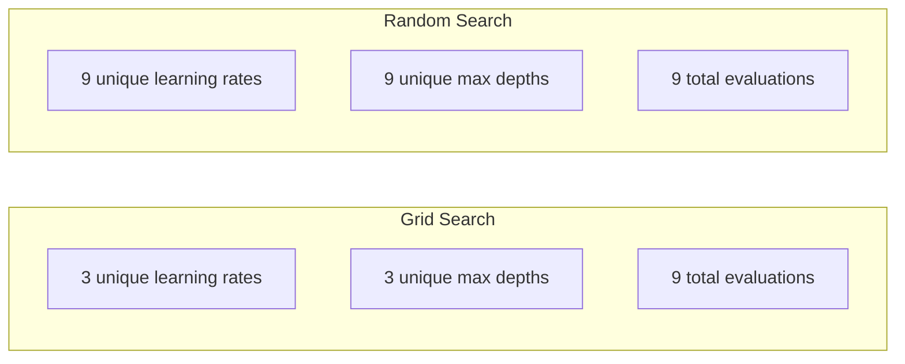
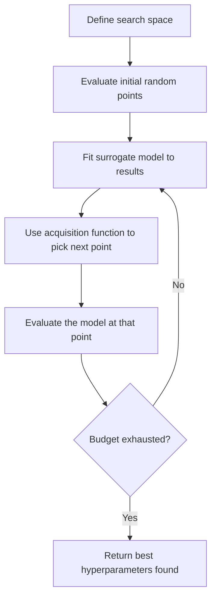
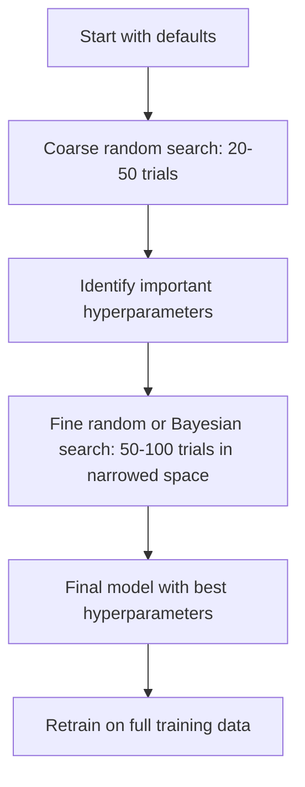
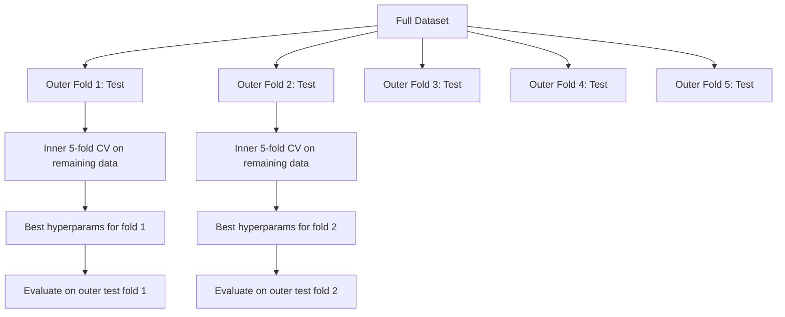

# 超参数调优

> 超参数是你在训练开始前调节的旋钮。调得好，平庸模型与优秀模型的差别就在于此。

**类型：** 构建  
**语言：** Python  
**前置知识：** 第二阶段，第11课（集成方法）  
**时间：** 约90分钟  

## 学习目标

- 从零实现网格搜索、随机搜索和贝叶斯优化，并比较其样本效率
- 解释为什么当大多数超参数有效维度较低时，随机搜索优于网格搜索
- 构建一个使用代理模型和采集函数来引导搜索的贝叶斯优化循环
- 设计一种通过适当交叉验证避免验证集过拟合的超参数调优策略

## 问题

你的梯度提升模型拥有学习率、树的数量、最大深度、叶节点最小样本数、子采样比例和列采样比例。这是六个超参数。如果每个参数有5个合理取值，那么网格就有5^6 = 15,625种组合。每种组合训练需要10秒。这意味着尝试所有组合需要43小时的计算时间。

网格搜索是最直观的方法，但也是大规模场景下最差的方法。随机搜索用更少的计算资源做得更好。贝叶斯优化通过从过去的评估中学习，效果更佳。知道使用哪种策略，以及哪些超参数真正重要，可以节省数天浪费的GPU时间。

## 概念

### 参数 vs 超参数

参数是在训练过程中学习到的（权重、偏置、分裂阈值）。超参数是在训练开始前设置的，并控制学习过程。

| 超参数 | 控制内容 | 典型范围 |
|--------|----------|----------|
| 学习率 | 每次更新的步长 | 0.001 到 1.0 |
| 树的数量/轮数 | 训练时长 | 10 到 10,000 |
| 最大深度 | 模型复杂度 | 1 到 30 |
| 正则化 (lambda) | 防止过拟合 | 0.0001 到 100 |
| 批量大小 | 梯度估计噪声 | 16 到 512 |
| Dropout率 | 丢弃神经元的比例 | 0.0 到 0.5 |

### 网格搜索

网格搜索评估所有指定取值的组合。它穷尽且易于理解，但随超参数数量指数级增长。

```
Grid for 2 hyperparameters:

  learning_rate: [0.01, 0.1, 1.0]
  max_depth:     [3, 5, 7]

  Evaluations: 3 x 3 = 9 combinations

  (0.01, 3)  (0.01, 5)  (0.01, 7)
  (0.1,  3)  (0.1,  5)  (0.1,  7)
  (1.0,  3)  (1.0,  5)  (1.0,  7)
```

网格搜索有一个根本缺陷：如果一个超参数重要而另一个不重要，那么大部分评估都是浪费的。9次评估中，你只能得到重要参数3个不同的取值。

### 随机搜索

随机搜索从分布中采样超参数，而不是从网格中。在相同9次评估的预算下，每个超参数你能得到9个不同的取值。



为什么随机胜过网格（Bergstra & Bengio, 2012）：

- 大多数超参数的有效维度较低。对于给定的问题，6个超参数中通常只有1-2个是重要的。
- 网格搜索在不重要的维度上浪费评估。
- 随机搜索在相同预算下，对重要维度的覆盖更密集。
- 在60次随机试验中，你有95%的概率找到一个距离最优值5%以内的点（如果搜索空间中存在最优值）。

### 贝叶斯优化

随机搜索忽略了结果。它并不知道高学习率会导致发散，或者深度3始终优于深度10。贝叶斯优化利用过去的评估来决定下一步搜索哪里。



两个关键组成部分：

**代理模型：** 一个评估代价低廉的模型（通常是高斯过程），用于近似计算代价高昂的目标函数。它在搜索空间的任何一点都给出预测和不确定性估计。

**采集函数：** 通过平衡利用（在已知好点附近搜索）和探索（在不确定性高的区域搜索）来决定下一步评估的位置。常见选择：

- **期望改进（EI）：** 在该点我们期望比当前最佳结果改进多少？
- **置信上界（UCB）：** 预测值加上不确定度的倍数。较高的UCB意味着要么有前景，要么尚未探索。
- **改进概率（PI）：** 该点优于当前最佳结果的概率是多少？

贝叶斯优化通常比随机搜索少用2-5倍的评估次数找到更好的超参数。拟合代理模型的开销与训练实际模型相比微不足道。

### 早停

并非每次训练运行都需要完成。如果一个配置在10个epoch后明显很差，就停止它，继续下一个。这是超参数搜索中的早停。

策略：
- **基于耐心：** 如果验证损失连续N个epoch没有改善，则停止
- **中位数剪枝：** 如果试验的中间结果在相同步骤上比已完成试验的中位数更差，则停止
- **Hyperband：** 给许多配置分配少量预算，然后逐步增加最优配置的预算

Hyperband特别有效。它从81个配置、每个1个epoch开始，保留前三分之一，给它们3个epoch，再保留前三分之一，依此类推。与对所有配置都分配完整预算进行评估相比，这种方法快10-50倍。

### 学习率调度器

学习率几乎总是最重要的超参数。与其保持固定，调度器可以在训练过程中调整它。

| 调度器 | 公式 | 使用时机 |
|--------|------|----------|
| 阶梯衰减 | 每N个epoch乘以0.1 | 经典CNN训练 |
| 余弦退火 | lr * 0.5 * (1 + cos(pi * t / T)) | 现代默认设置 |
| 预热+衰减 | 线性增加后余弦衰减 | 变换器 |
| 单周期 | 在一个周期内先增后减 | 快速收敛 |
| 在平台期衰减 | 当指标停滞时按因子衰减 | 安全默认设置 |

### 超参数重要性

并非所有超参数都同等重要。关于随机森林（Probst et al., 2019）和梯度提升的研究显示了一致的模式：

**高重要性：**
- 学习率（始终先调）
- 估计器数量/轮数（使用早停而非调参）
- 正则化强度

**中等重要性：**
- 最大深度/层数
- 叶节点最小样本数/权重衰减
- 子采样比例

**低重要性：**
- 最大特征数（对于随机森林）
- 具体激活函数的选择
- 批量大小（在合理范围内）

先调重要的参数，其余保持默认。

### 实用策略



具体工作流：

1. **从库的默认值开始。** 它们是由经验丰富的从业者选择的，通常能达到80%的效果。
2. **粗略随机搜索。** 大范围，20-50次试验。使用早停快速终止不良运行。
3. **分析结果。** 哪些超参数与性能相关？缩小搜索空间。
4. **精细搜索。** 在缩小的空间内进行贝叶斯优化或聚焦随机搜索。50-100次试验。
5. **使用找到的最佳超参数在所有训练数据上重新训练。**

### 交叉验证整合

在单个验证集上调整超参数是有风险的。最佳超参数可能过拟合到特定的验证折。嵌套交叉验证通过使用两个循环来解决这个问题：

- **外层循环**（评估）：将数据分为训练+验证和测试。报告无偏性能。
- **内层循环**（调参）：将训练+验证分为训练和验证。找到最佳超参数。



每个外层折独立地找到自己的最佳超参数。外层得分是泛化性能的无偏估计。

配合sklearn：

```python
from sklearn.model_selection import cross_val_score, GridSearchCV
from sklearn.ensemble import GradientBoostingRegressor

inner_cv = GridSearchCV(
    GradientBoostingRegressor(),
    param_grid={
        "learning_rate": [0.01, 0.05, 0.1],
        "max_depth": [2, 3, 5],
        "n_estimators": [50, 100, 200],
    },
    cv=5,
    scoring="neg_mean_squared_error",
)

outer_scores = cross_val_score(
    inner_cv, X, y, cv=5, scoring="neg_mean_squared_error"
)

print(f"Nested CV MSE: {-outer_scores.mean():.4f} +/- {outer_scores.std():.4f}")
```

这样做代价高昂（5个外层折 x 5个内层折 x 27个网格点 = 675次模型拟合），但它能给你一个可信的性能估计。在论文中报告最终结果或决策风险很高时，请使用这种方法。

### 实用提示

**从学习率开始。** 对于基于梯度的方法，它总是最重要的超参数。糟糕的学习率会让其他所有参数都无关紧要。将其他超参数固定在默认值，先扫描学习率。

**对学习率和正则化使用对数均匀分布。** 0.001和0.01之间的差异与0.1和1.0之间的差异同等重要。线性搜索会在大数值端浪费预算。

**使用早停代替调优n_estimators。** 对于提升树和神经网络，将n_estimators或epochs设高，让早停决定何时停止。这从搜索中移除一个超参数。

**预算分配。** 将60%的调优预算花在最关键的两个超参数上。其余40%花在其他所有参数上。这两个关键参数占了性能变化的大部分。

**尺度很重要。** 绝不要在对数尺度上搜索批量大小（16, 32, 64就很好）。始终在对数尺度上搜索学习率。使搜索分布与超参数影响模型的方式相匹配。

| 模型类型 | 关键超参数 | 推荐搜索方法 | 预算 |
|----------|------------|--------------|------|
| 随机森林 | n_estimators, max_depth, min_samples_leaf | 随机搜索，50次试验 | 低（训练快） |
| 梯度提升 | learning_rate, n_estimators, max_depth | 贝叶斯优化，100次试验 + 早停 | 中等 |
| 神经网络 | learning_rate, weight_decay, batch_size | 贝叶斯或随机，100+次试验 | 高（训练慢） |
| SVM | C, gamma (RBF核) | 对数尺度网格，25-50次试验 | 低（2个参数） |
| Lasso/Ridge | alpha | 对数尺度一维搜索，20次试验 | 极低 |
| XGBoost | learning_rate, max_depth, subsample, colsample | 贝叶斯优化，100-200次试验 + 早停 | 中等 |

**不确定时：** 随机搜索，试验次数至少为超参数数量的两倍（例如，6个超参数 = 至少12次以上试验）。你会惊讶于随机搜索50次试验常常能击败精心设计的网格搜索。

## 动手构建

### 第一步：从零实现网格搜索

`code/tuning.py`中的代码从零实现了网格搜索、随机搜索和一个简单的贝叶斯优化器。

```python
def grid_search(model_fn, param_grid, X_train, y_train, X_val, y_val):
    keys = list(param_grid.keys())
    values = list(param_grid.values())
    best_score = -float("inf")
    best_params = None
    n_evals = 0

    for combo in itertools.product(*values):
        params = dict(zip(keys, combo))
        model = model_fn(**params)
        model.fit(X_train, y_train)
        score = evaluate(model, X_val, y_val)
        n_evals += 1

        if score > best_score:
            best_score = score
            best_params = params

    return best_params, best_score, n_evals
```

### 第二步：从零实现随机搜索

```python
def random_search(model_fn, param_distributions, X_train, y_train,
                  X_val, y_val, n_iter=50, seed=42):
    rng = np.random.RandomState(seed)
    best_score = -float("inf")
    best_params = None

    for _ in range(n_iter):
        params = {k: sample(v, rng) for k, v in param_distributions.items()}
        model = model_fn(**params)
        model.fit(X_train, y_train)
        score = evaluate(model, X_val, y_val)

        if score > best_score:
            best_score = score
            best_params = params

    return best_params, best_score, n_iter
```

### 第三步：贝叶斯优化（简化版）

核心思想：将高斯过程拟合到观察到的（超参数，得分）对，然后使用采集函数决定下一步看哪里。

```python
class SimpleBayesianOptimizer:
    def __init__(self, search_space, n_initial=5):
        self.search_space = search_space
        self.n_initial = n_initial
        self.X_observed = []
        self.y_observed = []

    def _kernel(self, x1, x2, length_scale=1.0):
        dists = np.sum((x1[:, None, :] - x2[None, :, :]) ** 2, axis=2)
        return np.exp(-0.5 * dists / length_scale ** 2)

    def _fit_gp(self, X_new):
        X_obs = np.array(self.X_observed)
        y_obs = np.array(self.y_observed)
        y_mean = y_obs.mean()
        y_centered = y_obs - y_mean

        K = self._kernel(X_obs, X_obs) + 1e-4 * np.eye(len(X_obs))
        K_star = self._kernel(X_new, X_obs)

        L = np.linalg.cholesky(K)
        alpha = np.linalg.solve(L.T, np.linalg.solve(L, y_centered))
        mu = K_star @ alpha + y_mean

        v = np.linalg.solve(L, K_star.T)
        var = 1.0 - np.sum(v ** 2, axis=0)
        var = np.maximum(var, 1e-6)

        return mu, var

    def _expected_improvement(self, mu, var, best_y):
        sigma = np.sqrt(var)
        z = (mu - best_y) / (sigma + 1e-10)
        ei = sigma * (z * norm_cdf(z) + norm_pdf(z))
        return ei

    def suggest(self):
        if len(self.X_observed) < self.n_initial:
            return sample_random(self.search_space)

        candidates = [sample_random(self.search_space) for _ in range(500)]
        X_cand = np.array([to_vector(c) for c in candidates])
        mu, var = self._fit_gp(X_cand)
        ei = self._expected_improvement(mu, var, max(self.y_observed))
        return candidates[np.argmax(ei)]

    def observe(self, params, score):
        self.X_observed.append(to_vector(params))
        self.y_observed.append(score)
```

GP代理在每个候选点给出两个值：预测得分（mu）和不确定性（var）。期望改进平衡了这两者：它倾向于模型预测高得分或不确定性高的点。早期，大多数点不确定性高，因此优化器探索。后期，它聚焦于最有希望的区域。

### 第四步：比较所有方法

在相同的合成目标函数上运行所有三种方法并比较。这个比较使用了一个简化包装器，每个优化器直接调用目标函数（不训练模型），因此API不同于上面基于模型的实现：

```python
def synthetic_objective(params):
    lr = params["learning_rate"]
    depth = params["max_depth"]
    return -(np.log10(lr) + 2) ** 2 - (depth - 4) ** 2 + 10

param_grid = {
    "learning_rate": [0.001, 0.01, 0.1, 1.0],
    "max_depth": [2, 3, 4, 5, 6, 7, 8],
}

grid_best = None
grid_score = -float("inf")
grid_history = []
for combo in itertools.product(*param_grid.values()):
    params = dict(zip(param_grid.keys(), combo))
    score = synthetic_objective(params)
    grid_history.append((params, score))
    if score > grid_score:
        grid_score = score
        grid_best = params

param_dist = {
    "learning_rate": ("log_float", 0.001, 1.0),
    "max_depth": ("int", 2, 8),
}

rand_best = None
rand_score = -float("inf")
rand_history = []
rng = np.random.RandomState(42)
for _ in range(28):
    params = {k: sample(v, rng) for k, v in param_dist.items()}
    score = synthetic_objective(params)
    rand_history.append((params, score))
    if score > rand_score:
        rand_score = score
        rand_best = params

optimizer = SimpleBayesianOptimizer(param_dist, n_initial=5)
bayes_history = []
for _ in range(28):
    params = optimizer.suggest()
    score = synthetic_objective(params)
    optimizer.observe(params, score)
    bayes_history.append((params, score))
bayes_score = max(s for _, s in bayes_history)

print(f"{'Method':<20} {'Best Score':>12} {'Evaluations':>12}")
print("-" * 50)
print(f"{'Grid Search':<20} {grid_score:>12.4f} {len(grid_history):>12}")
print(f"{'Random Search':<20} {rand_score:>12.4f} {len(rand_history):>12}")
print(f"{'Bayesian Opt':<20} {bayes_score:>12.4f} {len(bayes_history):>12}")
```

在相同预算下，贝叶斯优化通常最快找到最佳得分，因为它不会在明显差的区域浪费评估。随机搜索比网格搜索覆盖更广。只有当超参数很少且你能承担穷举时，网格搜索才会胜出。

## 实际应用

### Optuna 实践

Optuna是用于严肃超参数调优的推荐库。它原生支持剪枝、分布式搜索和可视化。

```python
import optuna

def objective(trial):
    lr = trial.suggest_float("learning_rate", 1e-4, 1e-1, log=True)
    n_est = trial.suggest_int("n_estimators", 50, 500)
    max_depth = trial.suggest_int("max_depth", 2, 10)

    model = GradientBoostingRegressor(
        learning_rate=lr,
        n_estimators=n_est,
        max_depth=max_depth,
    )
    model.fit(X_train, y_train)
    return mean_squared_error(y_val, model.predict(X_val))

study = optuna.create_study(direction="minimize")
study.optimize(objective, n_trials=100)

print(f"Best params: {study.best_params}")
print(f"Best MSE: {study.best_value:.4f}")
```

Optuna的关键特性：
- `suggest_float(..., log=True)` 用于最好在对数尺度上搜索的参数（学习率、正则化）
- `suggest_int` 用于整数参数
- `suggest_categorical` 用于离散选择
- 内置的MedianPruner用于早停不良试验
- `study.trials_dataframe()` 用于分析

### Optuna 配合剪枝

剪枝可以提前终止无望的试验，节省大量计算。模式如下：

```python
import optuna
from sklearn.model_selection import cross_val_score

def objective(trial):
    params = {
        "learning_rate": trial.suggest_float("lr", 1e-4, 0.5, log=True),
        "max_depth": trial.suggest_int("max_depth", 2, 10),
        "n_estimators": trial.suggest_int("n_estimators", 50, 500),
        "subsample": trial.suggest_float("subsample", 0.5, 1.0),
    }

    model = GradientBoostingRegressor(**params)
    scores = cross_val_score(model, X_train, y_train, cv=3,
                             scoring="neg_mean_squared_error")
    mean_score = -scores.mean()

    trial.report(mean_score, step=0)
    if trial.should_prune():
        raise optuna.TrialPruned()

    return mean_score

pruner = optuna.pruners.MedianPruner(n_startup_trials=10, n_warmup_steps=5)
study = optuna.create_study(direction="minimize", pruner=pruner)
study.optimize(objective, n_trials=200)
```

`MedianPruner`在某个步骤上，如果试验的中间结果比所有已完成试验的中位数更差，则停止该试验。剪枝需要调用`trial.report()`报告中间指标，并调用`trial.should_prune()`检查是否应停止试验。`n_startup_trials=10`确保至少10次试验完全完成后再开始剪枝。这通常能节省40-60%的总计算量。

### sklearn内置调优器

对于快速实验，sklearn提供了`GridSearchCV`、`RandomizedSearchCV`和`HalvingRandomSearchCV`：

```python
from sklearn.model_selection import RandomizedSearchCV
from scipy.stats import loguniform, randint

param_dist = {
    "learning_rate": loguniform(1e-4, 0.5),
    "max_depth": randint(2, 10),
    "n_estimators": randint(50, 500),
}

search = RandomizedSearchCV(
    GradientBoostingRegressor(),
    param_dist,
    n_iter=100,
    cv=5,
    scoring="neg_mean_squared_error",
    random_state=42,
    n_jobs=-1,
)
search.fit(X_train, y_train)
print(f"Best params: {search.best_params_}")
print(f"Best CV MSE: {-search.best_score_:.4f}")
```

对学习率和正则化使用scipy的`loguniform`。对整数超参数使用`randint`。`n_jobs=-1`标志可跨所有CPU核心并行。

### 超参数调优中的常见错误

**通过预处理造成数据泄露。** 如果在交叉验证前对整个数据集拟合缩放器，验证折的信息会泄露到训练中。始终将预处理放在`Pipeline`内部，这样它只对训练折进行拟合。

**过拟合验证集。** 运行数千次试验实际上就是在验证集上进行训练。对于最终性能估计，应使用嵌套交叉验证，或者保留一个调优过程中从未使用过的独立测试集。

**搜索范围过窄。** 如果最佳值位于搜索空间的边界，说明你搜索得不够广。最优值可能在你范围之外。始终检查最佳参数是否在边缘。

**忽略交互效应。** 在提升树中，学习率和估计器数量有很强的交互。低学习率需要更多估计器。独立调优它们比一起调优效果更差。

**对迭代模型不使用早停。** 对于梯度提升和神经网络，将n_estimators或epochs设高并使用早停。这严格优于将迭代次数作为超参数来调优。

## 练习

1. 在相同总预算（例如50次评估）下运行网格搜索和随机搜索。比较找到的最佳得分。用不同随机种子重复10次实验。随机搜索获胜的频率有多高？

2. 从零实现Hyperband。从81个配置开始，每个训练1个epoch。在每一轮保留前1/3，并将其预算增加三倍。将总计算量（所有配置所有epoch的和）与81个配置全预算运行进行比较。

3. 为第11课的梯度提升实现添加一个学习率调度器（余弦退火）。与固定学习率相比，它有帮助吗？

4. 使用Optuna在真实数据集（例如sklearn的乳腺癌数据集）上调优RandomForestClassifier。使用`optuna.visualization.plot_param_importances(study)`查看哪些超参数最重要。是否与本课的重要性排名相符？

5. 实现一个简单的采集函数（期望改进），并展示探索与利用。绘制代理模型的均值和不确定性，并显示EI选择下一步评估的位置。

## 关键术语

| 术语 | 人们常说的 | 实际含义 |
|------|------------|----------|
| 超参数 | “你选择的一个设置” | 训练前设置的值，控制学习过程，而非从数据中学习 |
| 网格搜索 | “尝试每一种组合” | 在指定参数网格上进行穷举搜索，代价指数级增长 |
| 随机搜索 | “直接随机采样” | 从分布中采样超参数，比网格搜索更好地覆盖重要维度 |
| 贝叶斯优化 | “智能搜索” | 使用目标函数的代理模型决定下一步评估位置，平衡探索与利用 |
| 代理模型 | “一个廉价的近似” | 从已观测评估中近似昂贵目标函数的模型（通常是高斯过程） |
| 采集函数 | “下一步看哪里” | 通过平衡期望改进与不确定性对候选点评分，EI和UCB是常见选择 |
| 早停 | “别浪费时间了” | 当验证性能停止改善时提前终止训练 |
| Hyperband | “配置的锦标赛赛制” | 自适应资源分配：从少量预算的大量配置开始，保留最好的并增加其预算 |
| 学习率调度器 | “训练中改变学习率” | 在训练过程中调整学习率的函数，以获得更好的收敛性 |

## 延伸阅读

- [Bergstra & Bengio: Random Search for Hyper-Parameter Optimization (2012)](https://jmlr.org/papers/v13/bergstra12a.html) —— 证明随机优于网格的论文
- [Snoek et al., Practical Bayesian Optimization of Machine Learning Algorithms (2012)](https://arxiv.org/abs/1206.2944) —— 用于机器学习的贝叶斯优化
- [Li et al., Hyperband: A Novel Bandit-Based Approach (2018)](https://jmlr.org/papers/v18/16-558.html) —— Hyperband论文
- [Optuna: A Next-generation Hyperparameter Optimization Framework](https://arxiv.org/abs/1907.10902) —— Optuna论文
- [Probst et al., Tunability: Importance of Hyperparameters (2019)](https://jmlr.org/papers/v20/18-444.html) —— 哪些超参数重要
