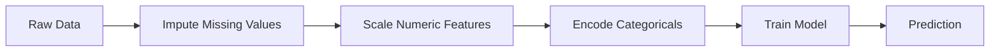
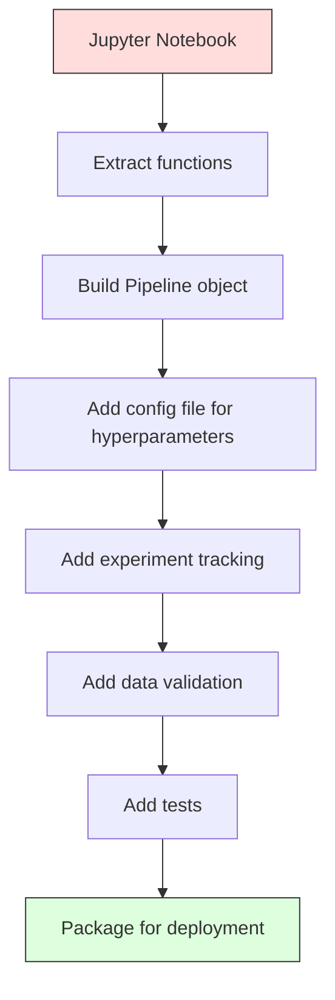

# 机器学习流水线（ML Pipelines）

> 模型不是产品，流水线才是。流水线涵盖从原始数据到部署预测的全过程，且每一步都必须可复现。

**类型：** 构建  
**语言：** Python  
**前置知识：** 第二阶段，第12课（超参数调优）  
**预计用时：** ~120分钟  

## 学习目标

- 从零构建一个机器学习流水线，将插补、缩放、编码和模型训练链接成一个可复现的对象  
- 识别数据泄露场景，并解释流水线如何通过在训练数据上仅拟合变换器来避免泄露  
- 构建一个`ColumnTransformer`，对数值型和类别型特征分别应用不同的预处理  
- 实现流水线序列化，并证明同一拟合后的流水线在训练和生产中产生完全一致的结果  

## 问题

你有一个笔记本，它加载数据、用中位数填充缺失值、缩放特征、训练模型并输出准确率。它运行正常。你把它交付了。

一个月后，有人重新训练模型却得到不同的结果。中位数是在包含测试数据的完整数据集上计算的（数据泄露）。缩放参数没有保存，因此推理使用了不同的统计量。特征工程代码在训练和服务之间复制粘贴，且副本发生了偏差。一个类别列在生产中出现了编码器从未见过的新值。

这些并非假设。它们是机器学习系统在生产环境中失败的最常见原因。流水线将所有变换步骤打包成一个有序、可复现的对象，解决了所有这些问题。

## 概念

### 什么是流水线

流水线是一个有序的数据变换序列，后面跟一个模型。每一步将上一步的输出作为输入。整个流水线在训练数据上拟合并只拟合一次。推理时，同一拟合后的流水线处理新数据并生成预测。



流水线保证了：
- 变换仅拟合在训练数据上（无泄露）
- 推理时应用相同的变换
- 整个对象可以序列化并作为一个构件部署
- 交叉验证会在每个折叠内应用流水线，防止细微的泄露

### 数据泄露：无声的杀手

数据泄露指测试集或未来数据的信息污染训练。流水线防止了最常见的泄露形式。

**有泄露（错误）：**
```python
X = df.drop("target", axis=1)
y = df["target"]

scaler = StandardScaler()
X_scaled = scaler.fit_transform(X)

X_train, X_test = X_scaled[:800], X_scaled[800:]
y_train, y_test = y[:800], y[800:]
```

缩放器看到了测试数据。均值和标准差包含了测试样本。这会夸大准确率估计。

**正确：**
```python
X_train, X_test = X[:800], X[800:]

scaler = StandardScaler()
X_train_scaled = scaler.fit_transform(X_train)
X_test_scaled = scaler.transform(X_test)
```

使用流水线时不需要考虑这个。流水线会自动处理。

### sklearn 流水线

sklearn 的 `Pipeline` 将变换器和估计器串联起来。它暴露了 `.fit()`、`.predict()` 和 `.score()`，这些方法会按顺序应用所有步骤。

```python
from sklearn.pipeline import Pipeline
from sklearn.preprocessing import StandardScaler
from sklearn.linear_model import LogisticRegression

pipe = Pipeline([
    ("scaler", StandardScaler()),
    ("model", LogisticRegression()),
])

pipe.fit(X_train, y_train)
predictions = pipe.predict(X_test)
```

当调用 `pipe.fit(X_train, y_train)` 时：
1. 缩放器在 `X_train` 上调用 `fit_transform`
2. 模型在缩放后的 `X_train` 上调用 `fit`

当调用 `pipe.predict(X_test)` 时：
1. 缩放器在 `X_test` 上调用 `transform`（而不是 `fit_transform`）
2. 模型在缩放后的 `X_test` 上调用 `predict`

缩放器在拟合阶段从未见过测试数据。这正是流水线的关键所在。

### ColumnTransformer：不同列的不同流水线

真实数据集包含数值型和类别型列，它们需要不同的预处理。`ColumnTransformer` 来处理这种情况。

```python
from sklearn.compose import ColumnTransformer
from sklearn.preprocessing import StandardScaler, OneHotEncoder
from sklearn.impute import SimpleImputer

numeric_pipe = Pipeline([
    ("impute", SimpleImputer(strategy="median")),
    ("scale", StandardScaler()),
])

categorical_pipe = Pipeline([
    ("impute", SimpleImputer(strategy="most_frequent")),
    ("encode", OneHotEncoder(handle_unknown="ignore")),
])

preprocessor = ColumnTransformer([
    ("num", numeric_pipe, ["age", "income", "score"]),
    ("cat", categorical_pipe, ["city", "gender", "plan"]),
])

full_pipeline = Pipeline([
    ("preprocess", preprocessor),
    ("model", GradientBoostingClassifier()),
])
```

OneHotEncoder 中的 `handle_unknown="ignore"` 对于生产环境至关重要。当出现新类别（模型从未见过的城市）时，它会生成零向量而不是崩溃。

### 实验跟踪

流水线使训练可复现，但你还需要跟踪不同实验中发生了什么：使用了哪些超参数、哪个数据集版本、指标是多少、运行了哪些代码。

**MLflow** 是最常用的开源解决方案：

```python
import mlflow

with mlflow.start_run():
    mlflow.log_param("max_depth", 5)
    mlflow.log_param("n_estimators", 100)
    mlflow.log_param("learning_rate", 0.1)

    pipe.fit(X_train, y_train)
    accuracy = pipe.score(X_test, y_test)

    mlflow.log_metric("accuracy", accuracy)
    mlflow.sklearn.log_model(pipe, "model")
```

每次运行都会记录参数、指标、产物和完整的模型。你可以比较运行、复现任何实验，并部署任何模型版本。

**Weights & Biases (wandb)** 通过托管的仪表盘提供相同功能：

```python
import wandb

wandb.init(project="my-pipeline")
wandb.config.update({"max_depth": 5, "n_estimators": 100})

pipe.fit(X_train, y_train)
accuracy = pipe.score(X_test, y_test)

wandb.log({"accuracy": accuracy})
```

### 模型版本管理

在实验跟踪之后，你需要管理模型版本。生产中是哪个模型？哪个是预发布版？上周的是哪个？

MLflow 的模型注册表（Model Registry）提供：
- **版本跟踪：** 每个保存的模型都获得一个版本号
- **阶段转换：** “预发布（Staging）”、“生产（Production）”、“归档（Archived）”
- **审批流程：** 模型必须显式提升到生产阶段
- **回滚：** 瞬间切换到之前版本

### 数据版本管理（DVC）

代码用 git 进行版本管理。数据也应该进行版本管理，但 git 无法处理大型文件。DVC（数据版本控制）解决了这个问题。

```
dvc init
dvc add data/training.csv
git add data/training.csv.dvc data/.gitignore
git commit -m "Track training data"
dvc push
```

DVC 将实际数据存储在远程存储中（S3、GCS、Azure），并在 git 中保留一个小的 `.dvc` 文件，该文件记录了哈希。当检出 git 提交时，`dvc checkout` 会恢复使用的确切数据。

这意味着每个 git 提交同时固定了代码和数据，实现完全可复现。

### 可复现的实验

一个可复现的实验需要四样东西：

1. **固定的随机种子：** 为 numpy、random 和框架（torch、sklearn）设置种子
2. **固定的依赖：** 带有确切版本的 requirements.txt 或 poetry.lock
3. **版本化的数据：** 使用 DVC 或类似工具
4. **配置文件：** 所有超参数放在配置中，而非硬编码

```python
import numpy as np
import random

def set_seed(seed=42):
    random.seed(seed)
    np.random.seed(seed)
    try:
        import torch
        torch.manual_seed(seed)
        torch.cuda.manual_seed_all(seed)
        torch.backends.cudnn.deterministic = True
    except ImportError:
        pass
```

### 从笔记本到生产流水线



典型的演进过程：

1. **笔记本探索：** 快速实验、可视化、特征思路
2. **提取函数：** 将预处理、特征工程、评估移到模块中
3. **构建流水线：** 将变换链接成 sklearn Pipeline 或自定义类
4. **配置管理：** 将所有超参数移到 YAML/JSON 配置中
5. **实验跟踪：** 添加 MLflow 或 wandb 日志记录
6. **数据验证：** 训练前检查 schema、分布和缺失值模式
7. **测试：** 变换器的单元测试、完整流水线的集成测试
8. **部署：** 序列化流水线，包装成 API（FastAPI、Flask），容器化

### 常见流水线错误

| 错误 | 为什么不好 | 修复方法 |
|------|-----------|----------|
| 划分前在完整数据上拟合 | 数据泄露 | 使用 Pipeline 与 cross_val_score 结合 |
| 在流水线外进行特征工程 | 训练和服务时变换不一致 | 将所有变换放入 Pipeline |
| 不处理未知类别 | 新值导致生产崩溃 | OneHotEncoder(handle_unknown="ignore") |
| 硬编码列名 | schema 变化时中断 | 从配置中获取列名列表 |
| 无数据验证 | 坏数据上静默预测错误 | 预测前添加 schema 检查 |
| 训练/服务偏差 | 模型在生产中看到不同特征 | 使用同一个 Pipeline 对象进行两者 |

## 构建它

`code/pipeline.py` 中的代码从零构建了一个完整的机器学习流水线：

### 第1步：自定义变换器

```python
class CustomTransformer:
    def __init__(self):
        self.means = None
        self.stds = None

    def fit(self, X):
        self.means = np.mean(X, axis=0)
        self.stds = np.std(X, axis=0)
        self.stds[self.stds == 0] = 1.0
        return self

    def transform(self, X):
        return (X - self.means) / self.stds

    def fit_transform(self, X):
        return self.fit(X).transform(X)
```

### 第2步：从零构建流水线

```python
class PipelineFromScratch:
    def __init__(self, steps):
        self.steps = steps

    def fit(self, X, y=None):
        X_current = X.copy()
        for name, step in self.steps[:-1]:
            X_current = step.fit_transform(X_current)
        name, model = self.steps[-1]
        model.fit(X_current, y)
        return self

    def predict(self, X):
        X_current = X.copy()
        for name, step in self.steps[:-1]:
            X_current = step.transform(X_current)
        name, model = self.steps[-1]
        return model.predict(X_current)
```

### 第3步：使用流水线进行交叉验证

代码演示了如何通过流水线进行交叉验证以防止数据泄露：缩放器在每个折叠的训练数据上单独拟合。

### 第4步：使用 sklearn 构建完整生产流水线

一个完整的流水线，包含 `ColumnTransformer`、多个预处理路径和一个模型，经过适当的交叉验证和实验日志记录。

## 交付它

本课程产出：
- `outputs/prompt-ml-pipeline.md` —— 构建和调试机器学习流水线的技能
- `code/pipeline.py` —— 从零到 sklearn 的完整流水线

## 练习

1. 构建一个流水线，处理包含3个数值列和2个类别列的数据集。使用 `ColumnTransformer` 对数值列应用中位数插补+缩放，对类别列应用众数插补+独热编码。使用5折交叉验证训练。

2. 故意引入数据泄露：在划分数据集之前，先将缩放器拟合到完整数据集。比较有泄露的交叉验证分数与流水线的干净交叉验证分数。差异有多大？

3. 用 `joblib.dump` 序列化你的流水线。在另一个脚本中加载它并运行预测。验证预测结果完全一致。

4. 在流水线中添加一个自定义变换器，为两个最重要的数值列创建多项式特征（次数2）。它应该放在流水线的什么位置？

5. 为流水线设置 MLflow 跟踪。运行5个不同超参数的实验。使用 MLflow 用户界面（`mlflow ui`）比较运行结果并选择最佳模型。

## 关键术语

| 术语 | 大家怎么说 | 真实含义 |
|------|-----------|----------|
| Pipeline | “变换+模型的链” | 一个有序的已拟合变换器和模型序列，作为一个整体应用以防止泄露 |
| Data leakage | “测试信息泄露到训练” | 使用训练集之外的信息构建模型，夸大性能估计 |
| ColumnTransformer | “不同列的不同预处理” | 对不同的列子集应用不同的流水线，合并结果 |
| Experiment tracking | “记录你的运行” | 记录每次训练运行的参数、指标、产物和代码版本 |
| MLflow | “跟踪和部署模型” | 用于实验跟踪、模型注册和部署的开源平台 |
| DVC | “数据的 Git” | 针对大型数据文件的版本控制系统，在 git 中存储哈希，在远程存储中存储数据 |
| Model registry | “模型版本目录” | 跟踪模型版本并带有阶段标签（预发布、生产、归档）的系统 |
| Training/serving skew | “笔记本里运行正常” | 训练和推理时数据处理方式的差异，导致静默错误 |
| Reproducibility | “相同代码，相同结果” | 从相同的代码、数据和配置获得完全相同的结果 |

## 延伸阅读

- [scikit-learn Pipeline 文档](https://scikit-learn.org/stable/modules/compose.html) —— 官方流水线参考
- [MLflow 文档](https://mlflow.org/docs/latest/index.html) —— 实验跟踪和模型注册
- [DVC 文档](https://dvc.org/doc) —— 数据版本管理
- [Sculley et al., Hidden Technical Debt in Machine Learning Systems (2015)](https://papers.nips.cc/paper/2015/hash/86df7dcfd896fcaf2674f757a2463eba-Abstract.html) —— 关于机器学习系统复杂性的开创性论文
- [Google ML Best Practices: Rules of ML](https://developers.google.com/machine-learning/guides/rules-of-ml) —— 生产环境机器学习的实用建议
