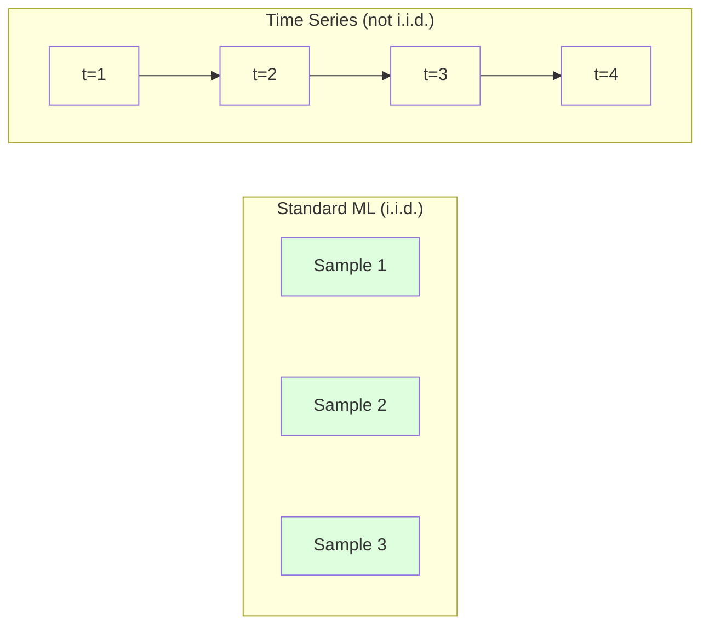
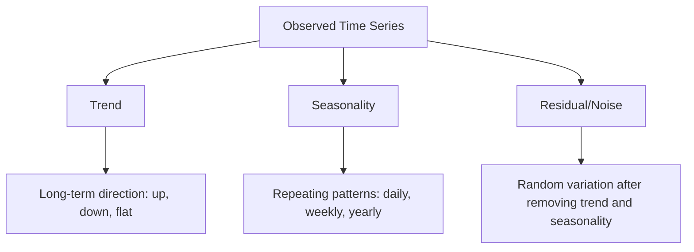
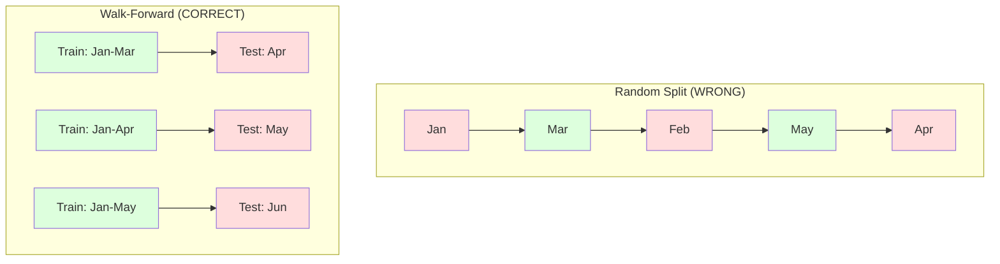

# 时间序列基础

> 过去的表现确实能预测未来的结果——前提是你先检查平稳性。

**类型：** 构建
**语言：** Python
**前置要求：** 第二阶段，第01-09课
**时长：** 约90分钟

## 学习目标

- 将时间序列分解为趋势、季节性和残差成分，并检验平稳性
- 实现滞后特征和滚动统计量，将时间序列转换为监督学习问题
- 构建一个前向验证框架，防止未来数据泄露到训练集中
- 解释为什么随机训练/测试拆分对时间序列无效，并展示其与正确时间拆分的性能差距

## 问题

你拥有按时间排序的数据。每日销售额、每小时温度、每分钟CPU使用率、每周股价。你想预测下一个值、下一周、下一季度。

你拿起标准的ML工具箱：随机训练/测试拆分、交叉验证、特征矩阵输入、预测输出。每一步都是错的。

时间序列打破了标准ML所依赖的假设。样本不是独立的——今天的温度取决于昨天的。随机拆分将未来信息泄露到过去。那些在回测中看起来很棒的特征在生产中失效，因为它们依赖于随时间变化的模式。

一个在随机交叉验证中达到95%准确率的模型，在基于时间的正确评估下可能只有55%。这种差异不是技术细节。它区分了一个在纸面上有效的模型和一个在生产中有效的模型。

本课涵盖基础知识：时间数据的不同之处，如何诚实评估模型，以及如何将时间序列转化为标准ML模型可以使用的特征。

## 概念

### 时间序列有何不同

标准ML假设i.i.d.——独立同分布。每个样本来自相同的分布，且独立于其他样本。时间序列违反了这两个条件：

- **不独立。** 今天的股价取决于昨天的。本周的销售额与上周的相关。
- **不同分布。** 分布随时间变化。十二月的销售额看起来与三月的不同。

这些违反不是小问题。它们改变了你构建特征的方式、评估模型的方式以及哪些算法有效。



在标准ML中，样本是可以互换的。打乱它们不会改变任何东西。在时间序列中，顺序就是一切。打乱顺序会破坏信号。

### 时间序列的组成部分

每个时间序列由以下部分组成：



- **趋势**：长期方向。收入每年增长10%。全球温度上升。
- **季节性**：在固定间隔内重复的模式。零售额在十二月飙升。空调使用量在七月达到峰值。
- **残差**：去除趋势和季节性后剩下的部分。如果残差看起来像白噪声，那么分解捕获了信号。

### 平稳性

如果一个时间序列的统计属性（均值、方差、自相关）不随时间变化，那么它就是平稳的。大多数预测方法假设平稳性。

**为什么重要：** 非平稳序列的均值会漂移。一个在1月数据上训练的模型学到的均值与2月将要显示的均值不同。它将系统地出错。

**如何检查：** 计算窗口内的滚动均值和滚动标准差。如果它们漂移，则该序列是非平稳的。

**如何修复：** 差分。不是对原始值建模，而是对连续值之间的变化建模：

```
diff[t] = value[t] - value[t-1]
```

如果一轮差分未能使序列平稳，则再应用一次（二阶差分）。大多数现实世界的序列最多需要两轮差分。

**示例：**

原始序列：[100, 102, 106, 112, 120]
一阶差分：[2, 4, 6, 8]（仍在上升趋势）
二阶差分：[2, 2, 2]（恒定——平稳）

原始序列有二次趋势。一阶差分将其变为线性趋势。二阶差分使其平坦。在实践中，你很少需要超过两轮。

**正式检验：** 增强迪基-富勒（ADF）检验是检验平稳性的标准统计检验。原假设是“序列非平稳”。p值低于0.05意味着你可以拒绝原假设并得出平稳的结论。我们不从头实现ADF（它需要渐近分布表），但我们代码中的滚动统计量方法提供了一个实用的视觉检查。

### 自相关

自相关衡量时间t的值与时间t-k（过去k步）的值之间的相关性。自相关函数（ACF）绘制每个滞后k的这种相关性。

**ACF告诉你：**
- 序列能记住多远。如果ACF在滞后5之后降至零，那么超过5步前的值就无关紧要。
- 是否存在季节性。如果ACF在滞后12处出现峰值（月度数据），则存在年度季节性。
- 要创建多少个滞后特征。使用直到ACF变得可忽略的滞后。

**PACF（偏自相关函数）** 去除间接相关性。如果今天与3天前相关仅仅是因为两者都与昨天相关，那么滞后3的PACF将为零，而滞后3的ACF则不会为零。

### 滞后特征：将时间序列转化为监督学习

标准ML模型需要一个特征矩阵X和一个目标y。时间序列只给你一列值。桥梁是滞后特征。

取序列[10, 12, 14, 13, 15]，创建滞后1和滞后2特征：

| lag_2 | lag_1 | 目标 |
|-------|-------|------|
| 10    | 12    | 14   |
| 12    | 14    | 13   |
| 14    | 13    | 15   |

现在你有了一个标准的回归问题。任何ML模型（线性回归、随机森林、梯度提升）都可以从滞后中预测目标。

你可以工程化其他特征：
- **滚动统计量：** 过去k个值的均值、标准差、最小值、最大值
- **日历特征：** 星期几、月份、是否为节假日、是否为周末
- **差分值：** 相对于前一步的变化
- **扩展统计量：** 累积均值、累积和
- **比率特征：** 当前值 / 滚动均值（距离近期平均值的程度）
- **交互特征：** lag_1 * 星期几（动量上的工作日效应）

**需要多少滞后？** 使用自相关函数。如果ACF在滞后10之前显著，则至少使用10个滞后。如果存在周季节性，则包括滞后7（以及可能的14）。更多滞后给模型更多历史，但也带来更多特征需要拟合，增加了过拟合的风险。

**目标对齐陷阱。** 在创建滞后特征时，目标必须是时间t的值，而所有特征必须使用时间t-1或更早的值。如果你不小心把时间t的值作为特征包含进来，你就有了一个完美的预测器——以及一个完全无用的模型。这是时间序列特征工程中最常见的错误。

### 前向验证

这是本课中最重要的概念。标准k折交叉验证随机将样本分配给训练集和测试集。对于时间序列，这会泄露未来信息。



前向验证：
1. 在截至时间t的数据上训练
2. 预测时间t+1（或t+1到t+k用于多步）
3. 向前滑动窗口
4. 重复

每个测试折只包含所有训练数据之后的数据。没有未来泄露。这让你诚实估计模型部署后的表现。

**扩展窗口** 使用所有历史数据进行训练（窗口增长）。**滑动窗口** 使用固定大小的训练窗口（窗口滑动）。当你认为旧数据仍然相关时使用扩展窗口。当世界发生变化且旧数据有害时使用滑动窗口。

### ARIMA直观理解

ARIMA是经典的时间序列模型。它有三个组成部分：

- **AR（自回归）：** 从过去的值预测。AR(p)使用最近p个值。
- **I（整合）：** 差分以达到平稳性。I(d)应用d轮差分。
- **MA（移动平均）：** 从过去的预测误差中预测。MA(q)使用最近q个误差。

ARIMA(p, d, q) 组合了这三者。你基于ACF/PACF分析或自动搜索（auto-ARIMA）选择p, d, q。

我们不会从头实现ARIMA——它需要进行数值优化，超出了本课的范围。关键洞察是理解每个组件的作用，以便你能解释ARIMA结果并知道何时使用它。

### 何时使用什么

| 方法 | 最适合 | 处理季节性 | 处理外部特征 |
|-------|---------|-----------|-------------|
| 滞后特征 + ML | 具有许多外部特征的表格数据 | 带有日历特征 | 是 |
| ARIMA | 单变量序列，短期 | SARIMA变体 | 否（有限制可用ARIMAX） |
| 指数平滑 | 简单趋势+季节性 | 是（Holt-Winters） | 否 |
| Prophet | 业务预测，节假日 | 是（傅里叶项） | 有限 |
| 神经网络（LSTM, Transformer） | 长序列，多序列 | 学习得到 | 是 |

对于大多数实际问题，**滞后特征 + 梯度提升**是最强的起点。它自然地处理外部特征，不需要平稳性，并且易于调试。

### 预测区间与策略

单步预测预测下一步。多步预测预测多步。有三种策略：

**递归（迭代）：** 预测下一步，将预测结果作为下一步的输入。简单但误差会累积——每个预测都使用前一个预测，因此错误会叠加。

**直接：** 为每个区间训练一个单独的模型。模型-1预测t+1，模型-5预测t+5。没有误差累积，但每个模型的训练样本较少，且它们不共享信息。

**多输出：** 训练一个模型同时输出所有区间。跨区间共享信息，但需要模型支持多个输出（或自定义损失函数）。

对于大多数实际问题，短区间（1-5步）从递归开始，较长区间从直接开始。

### 时间序列中的常见错误

| 错误 | 发生原因 | 如何修复 |
|------|----------|----------|
| 随机训练/测试拆分 | 标准ML的习惯 | 使用前向验证或时间拆分 |
| 使用未来特征 | 错误地包含了时间t的特征 | 审计每个特征的时间对齐 |
| 过拟合季节性 | 模型记住了日历模式 | 在测试集中保留一个完整的季节周期 |
| 忽略规模变化 | 收入翻倍但模式不变 | 对百分比变化而不是绝对值建模 |
| 滞后特征过多 | “更多历史更好” | 使用ACF确定相关滞后 |
| 不进行差分 | “模型自己会搞定” | 树模型可以处理趋势；线性模型需要平稳性 |

## 构建它

`code/time_series.py` 中的代码从头实现了核心构建块。

### 滞后特征创建器

```python
def make_lag_features(series, n_lags):
    n = len(series)
    X = np.full((n, n_lags), np.nan)
    for lag in range(1, n_lags + 1):
        X[lag:, lag - 1] = series[:-lag]
    valid = ~np.isnan(X).any(axis=1)
    return X[valid], series[valid]
```

这将一维序列转换为特征矩阵，其中每行将最近的 `n_lags` 个值作为特征，当前值作为目标。

### 前向验证交叉验证

```python
def walk_forward_split(n_samples, n_splits=5, min_train=50):
    assert min_train < n_samples, "min_train must be less than n_samples"
    step = max(1, (n_samples - min_train) // n_splits)
    for i in range(n_splits):
        train_end = min_train + i * step
        test_end = min(train_end + step, n_samples)
        if train_end >= n_samples:
            break
        yield slice(0, train_end), slice(train_end, test_end)
```

每个拆分确保训练数据严格先于测试数据。训练窗口随着每一折扩展。

### 简单自回归模型

纯AR模型只是在滞后特征上的线性回归：

```python
class SimpleAR:
    def __init__(self, n_lags=5):
        self.n_lags = n_lags
        self.weights = None
        self.bias = None

    def fit(self, series):
        X, y = make_lag_features(series, self.n_lags)
        # Solve via normal equations
        X_b = np.column_stack([np.ones(len(X)), X])
        theta = np.linalg.lstsq(X_b, y, rcond=None)[0]
        self.bias = theta[0]
        self.weights = theta[1:]
        return self
```

这在概念上与第02课的线性回归相同，但应用于同一个变量的时间滞后版本。

### 平稳性检查

代码计算滚动统计量以可视化和数值上评估平稳性：

```python
def check_stationarity(series, window=50):
    rolling_mean = np.array([
        series[max(0, i - window):i].mean()
        for i in range(1, len(series) + 1)
    ])
    rolling_std = np.array([
        series[max(0, i - window):i].std()
        for i in range(1, len(series) + 1)
    ])
    return rolling_mean, rolling_std
```

如果滚动均值漂移或滚动标准差变化，则序列是非平稳的。应用差分并再次检查。

代码还通过比较序列的前半部分和后半部分来检查平稳性。如果均值差异超过半个标准差或方差比超过2倍，则该序列被标记为非平稳。

### 自相关

```python
def autocorrelation(series, max_lag=20):
    n = len(series)
    mean = series.mean()
    var = series.var()
    acf = np.zeros(max_lag + 1)
    for k in range(max_lag + 1):
        cov = np.mean((series[:n-k] - mean) * (series[k:] - mean))
        acf[k] = cov / var if var > 0 else 0
    return acf
```

## 使用它

使用sklearn，你可以直接与任何回归器一起使用滞后特征：

```python
from sklearn.linear_model import Ridge
from sklearn.ensemble import GradientBoostingRegressor

X, y = make_lag_features(series, n_lags=10)

for train_idx, test_idx in walk_forward_split(len(X)):
    model = Ridge(alpha=1.0)
    model.fit(X[train_idx], y[train_idx])
    predictions = model.predict(X[test_idx])
```

对于ARIMA，使用statsmodels：

```python
from statsmodels.tsa.arima.model import ARIMA

model = ARIMA(train_series, order=(5, 1, 2))
fitted = model.fit()
forecast = fitted.forecast(steps=30)
```

`time_series.py` 中的代码演示了这两种方法，并使用前向验证进行比较。

### sklearn的TimeSeriesSplit

sklearn提供了 `TimeSeriesSplit`，它实现了前向验证：

```python
from sklearn.model_selection import TimeSeriesSplit

tscv = TimeSeriesSplit(n_splits=5)
for train_index, test_index in tscv.split(X):
    X_train, X_test = X[train_index], X[test_index]
    y_train, y_test = y[train_index], y[test_index]
    model.fit(X_train, y_train)
    score = model.score(X_test, y_test)
```

这相当于我们从头实现的 `walk_forward_split`，但集成到了sklearn的交叉验证框架中。你可以将其与 `cross_val_score` 一起使用：

```python
from sklearn.model_selection import cross_val_score

scores = cross_val_score(model, X, y, cv=TimeSeriesSplit(n_splits=5))
print(f"Mean score: {scores.mean():.4f} +/- {scores.std():.4f}")
```

### 评估指标

时间序列预测使用回归指标，但具有时间感知上下文：

- **MAE（平均绝对误差）：** |y_true - y_pred| 的平均值。易于以原始单位解释。“平均而言，预测偏差3.2度。”
- **RMSE（均方根误差）：** 均方误差的平方根。比MAE更惩罚较大的误差。当大误差比许多小误差更糟糕时使用。
- **MAPE（平均绝对百分比误差）：** |error / true_value| * 100 的平均值。尺度无关，有助于跨不同序列比较。但当真实值为零时未定义。
- **朴素基线比较：** 始终与简单基线比较。季节性朴素基线预测来自一个周期前的值（昨天，上周）。如果你的模型不能击败朴素，那么出了什么问题。

### 滚动特征

代码演示了将滚动统计量（窗口为7天和14天的均值、标准差、最小值、最大值）添加到滞后特征中。它们给模型提供了关于近期趋势和波动性的信息，而单独的滞后特征无法捕捉这些信息。

例如，如果滚动均值在上升，则表明存在上升趋势。如果滚动标准差在增加，则表明波动性在增长。这些是树模型可以学习但线性模型不能的模式。

## 交付它

本课产出：
- `outputs/prompt-time-series-advisor.md` —— 用于框定时间序列问题的提示
- `code/time_series.py` —— 滞后特征、前向验证、AR模型、平稳性检查

### 你必须击败的基线

在构建任何模型之前，先建立基线：

1. **最后一个值（持久性）。** 预测明天将与今天相同。对于许多序列，这出人意料地难以击败。
2. **季节性朴素。** 预测今天将与上周（或去年）的同一天相同。如果你的模型不能击败这个，它还没有学到任何超出季节性的有用模式。
3. **移动平均。** 预测最近k个值的平均值。平滑噪声但不能捕捉突变。

如果你花哨的ML模型输给了季节性朴素基线，那么你遇到了一个错误。最常见的是：特征中的未来泄露、错误的评估方法，或者序列确实是随机的且不可预测。

### 实用技巧

1. **从绘图开始。** 在任何建模之前，绘制原始序列。寻找趋势、季节性、异常值、结构性突变（行为的突然变化）。30秒的视觉检查通常比一小时的自动化分析告诉你更多。

2. **先差分，再建模。** 如果序列有明显的趋势，在创建滞后特征之前对其进行差分。树模型可以处理趋势，但线性模型不能，而且差分从不会有害。

3. **至少保留一个完整的季节周期。** 如果你有周季节性，你的测试集至少需要一整周。如果是月，至少需要一个完整月。否则你无法评估模型是否捕捉到了季节模式。

4. **在生产中监控。** 时间序列模型会随着世界变化而随时间退化。滚动跟踪预测误差。当误差开始增加时，在最新数据上重新训练模型。

5. **警惕体制变化。** 在疫情前数据上训练的模型不会预测疫情后的行为。将已知体制变化的指标作为特征包含进来，或者使用遗忘旧数据的滑动窗口。

6. **对偏斜序列进行对数变换。** 收入、价格和计数通常是右偏的。取对数可以稳定方差，并使乘法模式变为加法模式，线性模型可以处理。在对数空间中进行预测，然后指数化回到原始单位。

## 练习

1. **平稳性实验。** 生成一个带有线性趋势的序列。使用滚动统计量检查平稳性。应用一阶差分。再次检查。对于二次趋势，需要多少轮差分？

2. **滞后选择。** 在一个季节性序列（周期=7）上计算ACF。哪些滞后的自相关性最高？仅使用这些滞后（而不是连续滞后）创建滞后特征。与使用滞后1到7相比，准确率是否提高？

3. **前向验证与随机拆分。** 在滞后特征上训练一个Ridge回归。使用随机80/20拆分和前向验证进行评估。随机拆分高估了性能多少？

4. **特征工程。** 将滚动均值（窗口=7）、滚动标准差（窗口=7）和星期几特征添加到滞后特征中。使用前向验证比较有和没有这些额外特征时的准确率。

5. **多步预测。** 修改AR模型以预测未来5步而不是1步。比较两种策略：（a）预测一步，使用预测结果作为下一步的输入（递归），以及（b）为每个区间训练单独的模型（直接）。哪个更准确？

## 关键术语

| 术语 | 人们说的 | 实际含义 |
|------|----------|----------|
| 平稳性 | “统计量不随时间变化” | 均值、方差和自相关结构随时间恒定的序列 |
| 差分 | “减去连续值” | 计算 y[t] - y[t-1] 以去除趋势并实现平稳性 |
| 自相关 (ACF) | “序列与自身的相关性” | 时间序列与其滞后副本之间的相关性，作为滞后的函数 |
| 偏自相关 (PACF) | “仅直接相关” | 在去除所有更短滞后效应后，滞后k处的自相关 |
| 滞后特征 | “过去的值作为输入” | 使用 y[t-1], y[t-2], ..., y[t-k] 作为特征来预测 y[t] |
| 前向验证 | “尊重时间的交叉验证” | 训练数据在时间上始终先于测试数据的评估方式 |
| ARIMA | “经典时间序列模型” | 自回归整合移动平均：结合过去的值（AR）、差分（I）和过去的误差（MA） |
| 季节性 | “重复的日历模式” | 时间序列中与日历周期（每日、每周、每年）相关的规律、可预测的循环 |
| 趋势 | “长期方向” | 序列水平随时间持续增加或减少 |
| 扩展窗口 | “使用所有历史” | 前向验证中训练集随每一折增长 |
| 滑动窗口 | “固定大小的历史” | 前向验证中训练集是一个固定长度的窗口，向前滑动 |

## 延伸阅读

- [Hyndman and Athanasopoulos, Forecasting: Principles and Practice (3rd ed.)](https://otexts.com/fpp3/) —— 最好的免费时间序列预测教科书
- [scikit-learn Time Series Split](https://scikit-learn.org/stable/modules/generated/sklearn.model_selection.TimeSeriesSplit.html) —— sklearn 的前向验证拆分器
- [statsmodels ARIMA docs](https://www.statsmodels.org/stable/generated/statsmodels.tsa.arima.model.ARIMA.html) —— 带有诊断的ARIMA实现
- [Makridakis et al., The M5 Competition (2022)](https://www.sciencedirect.com/science/article/pii/S0169207021001874) —— 大规模预测竞赛，展示ML方法与统计方法的对比
