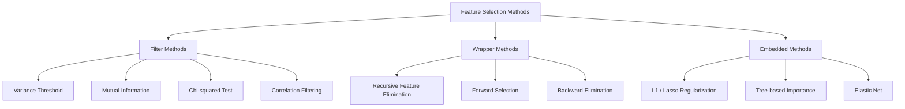
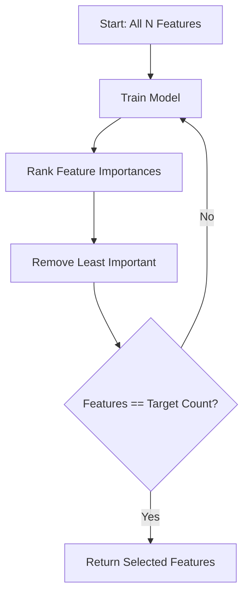
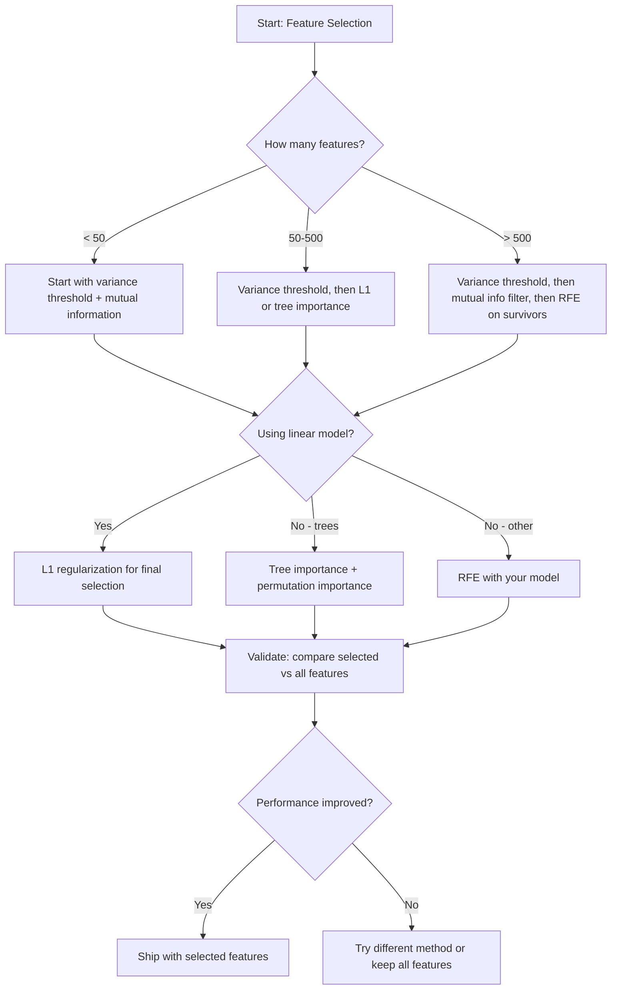

# 特征选择

> 特征并非越多越好。合适的特征才是王道。

**类型：** 构建  
**语言：** Python  
**前置要求：** 阶段 2，第 01-09 课，第 08 课（特征工程）  
**时长：** 约 75 分钟  

## 学习目标

- 从零实现过滤法（方差阈值、互信息、卡方）和包装法（RFE、前向选择）
- 解释为何互信息能捕捉相关性无法发现的非线性特征-目标关系
- 对比 L1 正则化（嵌入法）与 RFE（包装法），评估二者计算上的权衡
- 构建一个组合多种方法的特征选择流水线，并在留出数据上展示泛化性能的提升

## 问题所在

你有 500 个特征。模型训练缓慢，持续过拟合，谁也解释不清它学到了什么。你增加更多特征希望提升性能，结果更糟了。

这正是维度灾难的表现。随着特征数量增长，特征空间的体积呈爆炸式扩大。数据点变得稀疏，点间距离趋同。模型需要指数级更多的数据才能发现真实模式。噪声特征淹没了信号特征，过拟合成了默认状态。

特征选择就是解药。剥离噪声，去除冗余，只保留那些真正携带目标信息的特征。结果：训练更快，泛化更好，模型也更容易解释。

目标不是使用所有可用的信息，而是使用正确的信息。

## 概念

### 三类特征选择方法

每一种特征选择方法都归属于以下三类之一：



**过滤法** 使用统计指标对每个特征独立打分，不依赖模型。速度快，但会遗漏特征间的交互。

**包装法** 通过训练模型来评估特征子集，用模型性能作为分数。结果更好，但由于需要多次重新训练模型，代价高昂。

**嵌入法** 在模型训练的过程中完成特征选择。L1 正则化将权重推至零；决策树会在最有用的特征上进行分裂。选择发生在拟合过程中，而不是一个单独的步骤。

### 方差阈值

最简单的过滤法。如果一个特征在不同样本间几乎不变，那它几乎不携带任何信息。

考虑一个特征，它在 1000 个样本中的 999 个上为 0.0。它的方差接近于零。没有任何模型能利用它来区分类别。直接删除。

```
variance(x) = mean((x - mean(x))^2)
```

设定一个阈值（例如 0.01）。剔除所有方差低于该阈值的特征。这一步无需查看目标变量即可移除常数或近似常数的特征。

何时使用：作为其他方法之前的预处理步骤。能以近乎零的成本捕捉明显无用的特征。

局限性：高方差也可能纯属噪声。方差阈值是必要条件，但不是充分条件。

### 互信息

互信息度量了在知道特征 X 的值之后，目标 Y 的不确定性减少了多少。

```
I(X; Y) = sum_x sum_y p(x, y) * log(p(x, y) / (p(x) * p(y)))
```

如果 X 和 Y 独立，则 p(x, y) = p(x) * p(y)，对数项为零，I(X; Y) = 0。X 告诉你的信息越多，互信息就越高。

相较于相关性的关键优势：互信息能捕捉非线性关系。一个特征可能与目标的相关性为零，但由于关系是二次或周期性的，仍具有很高的互信息。

对于连续特征，先将其离散化为 bins（基于直方图的估计）。bin 的数量会影响估计结果——太少会丢失信息，太多会引入噪声。常见选择：sqrt(n) 个 bin 或 Sturges 规则（1 + log2(n)）。


### 递归特征消除 (RFE)

RFE 是一种包装法。它利用模型自身的特征重要性进行迭代剪枝：

1. 使用所有特征训练模型
2. 根据重要性对特征排名（线性模型用系数，树模型用不纯度减少量）
3. 移除最不重要的特征
4. 重复直到剩余特征数量达到目标



RFE 会考虑特征交互，因为模型看到的是剩余的所有特征。移除一个特征会改变其他特征的重要性，这使得它比过滤法更加彻底。

代价：需要训练模型 N - target 次。对于 500 个特征和目标为 10 的情况，这意味着 490 次训练。对于昂贵的模型来说，这很慢。你可以通过每步移除多个特征（例如每轮移除底部的 10%）来加速。

### L1（Lasso）正则化

L1 正则化将权重的绝对值加到损失函数中：

```
loss = prediction_error + alpha * sum(|w_i|)
```

参数 alpha 控制着特征被剪枝的激进程度。alpha 越大，就有越多的权重被精确置零。

为什么能精确置零？L1 惩罚在权重空间中构造了一个菱形约束区域。最优解往往落在该菱形的角上，此时一个或多个权重为零。L2 正则化（Ridge）构造的是圆形约束，权重会收缩但很少变为零。

这是一种嵌入式的特征选择：模型在训练过程中就学会了忽略哪些特征。权重为零的特征实际上被移除了。

优势：只需一次训练，能够处理相关特征（挑选一个并将其他归零），内置于大多数线性模型实现中。

局限性：仅适用于线性模型，无法捕捉非线性的特征重要性。

### 基于树的特征重要性

决策树及其集成方法（随机森林、梯度提升）天然地排序特征。每次分裂都会降低不纯度（分类用基尼系数或熵，回归用方差）。产生更大不纯度减少的特征更重要。

对于包含 T 棵树的随机森林：

```
importance(feature_j) = (1/T) * sum over all trees of
    sum over all nodes splitting on feature_j of
        (n_samples * impurity_decrease)
```

这样每个特征都得到了归一化的重要性分数。它能自动处理非线性关系和特征交互。

注意：基于树的重要性会偏向于具有许多唯一值（高基数）的特征。一个随机的 ID 列会显得重要，因为它完美地划分了每个样本。可以使用置换重要性进行验证。

### 置换重要性

一种与模型无关的方法：

1. 训练模型，在验证数据上记录基线性能
2. 对每个特征：随机打乱其值，衡量性能的下降
3. 下降越大，特征越重要

如果打乱一个特征没有损害性能，说明模型不依赖它。如果性能崩溃，则该特征至关重要。

置换重要性避免了树重要性的基数偏差，但速度较慢：每个特征需要一次完整的评估，并且为了稳定性需要重复多次。

### 对比表

| 方法 | 类型 | 速度 | 非线性 | 特征交互 |
|------|------|------|--------|----------|
| 方差阈值 | 过滤法 | 极快 | 否 | 否 |
| 互信息 | 过滤法 | 快 | 是 | 否 |
| 相关性过滤 | 过滤法 | 快 | 否 | 否 |
| RFE | 包装法 | 慢 | 取决于模型 | 是 |
| L1 / Lasso | 嵌入法 | 快 | 否（线性） | 否 |
| 树重要性 | 嵌入法 | 中等 | 是 | 是 |
| 置换重要性 | 模型无关 | 慢 | 是 | 是 |

### 决策流程图



## 动手构建

### 步骤 1：生成具有已知特征结构的合成数据

```python
import numpy as np


def make_feature_selection_data(n_samples=500, seed=42):
    rng = np.random.RandomState(seed)

    x1 = rng.randn(n_samples)
    x2 = rng.randn(n_samples)
    x3 = rng.randn(n_samples)
    x4 = x1 + 0.1 * rng.randn(n_samples)
    x5 = x2 + 0.1 * rng.randn(n_samples)

    informative = np.column_stack([x1, x2, x3, x4, x5])

    correlated = np.column_stack([
        x1 * 0.9 + 0.1 * rng.randn(n_samples),
        x2 * 0.8 + 0.2 * rng.randn(n_samples),
        x3 * 0.7 + 0.3 * rng.randn(n_samples),
        x1 * 0.5 + x2 * 0.5 + 0.1 * rng.randn(n_samples),
        x2 * 0.6 + x3 * 0.4 + 0.1 * rng.randn(n_samples),
    ])

    noise = rng.randn(n_samples, 10) * 0.5

    X = np.hstack([informative, correlated, noise])
    y = (2 * x1 - 1.5 * x2 + x3 + 0.5 * rng.randn(n_samples) > 0).astype(int)

    feature_names = (
        [f"info_{i}" for i in range(5)]
        + [f"corr_{i}" for i in range(5)]
        + [f"noise_{i}" for i in range(10)]
    )

    return X, y, feature_names
```

我们已知真实情况：特征 0-4 是有信息的（其中 3 和 4 是 0 和 1 的相关副本），特征 5-9 与有信息特征相关，特征 10-19 是纯噪声。一个好的选择方法应将 0-4 排得最高，10-19 排得最低。

### 步骤 2：方差阈值

```python
def variance_threshold(X, threshold=0.01):
    variances = np.var(X, axis=0)
    mask = variances > threshold
    return mask, variances
```

### 步骤 3：互信息（离散）

```python
def discretize(x, n_bins=10):
    min_val, max_val = x.min(), x.max()
    if max_val == min_val:
        return np.zeros_like(x, dtype=int)
    bin_edges = np.linspace(min_val, max_val, n_bins + 1)
    binned = np.digitize(x, bin_edges[1:-1])
    return binned


def mutual_information(X, y, n_bins=10):
    n_samples, n_features = X.shape
    mi_scores = np.zeros(n_features)

    y_vals, y_counts = np.unique(y, return_counts=True)
    p_y = y_counts / n_samples

    for f in range(n_features):
        x_binned = discretize(X[:, f], n_bins)
        x_vals, x_counts = np.unique(x_binned, return_counts=True)
        p_x = dict(zip(x_vals, x_counts / n_samples))

        mi = 0.0
        for xv in x_vals:
            for yi, yv in enumerate(y_vals):
                joint_mask = (x_binned == xv) & (y == yv)
                p_xy = np.sum(joint_mask) / n_samples
                if p_xy > 0:
                    mi += p_xy * np.log(p_xy / (p_x[xv] * p_y[yi]))
        mi_scores[f] = mi

    return mi_scores
```

### 步骤 4：递归特征消除

```python
def simple_logistic_importance(X, y, lr=0.1, epochs=100):
    n_samples, n_features = X.shape
    w = np.zeros(n_features)
    b = 0.0

    for _ in range(epochs):
        z = X @ w + b
        pred = 1.0 / (1.0 + np.exp(-np.clip(z, -500, 500)))
        error = pred - y
        w -= lr * (X.T @ error) / n_samples
        b -= lr * np.mean(error)

    return w, b


def rfe(X, y, n_features_to_select=5, lr=0.1, epochs=100):
    n_total = X.shape[1]
    remaining = list(range(n_total))
    rankings = np.ones(n_total, dtype=int)
    rank = n_total

    while len(remaining) > n_features_to_select:
        X_subset = X[:, remaining]
        w, _ = simple_logistic_importance(X_subset, y, lr, epochs)
        importances = np.abs(w)

        least_idx = np.argmin(importances)
        original_idx = remaining[least_idx]
        rankings[original_idx] = rank
        rank -= 1
        remaining.pop(least_idx)

    for idx in remaining:
        rankings[idx] = 1

    selected_mask = rankings == 1
    return selected_mask, rankings
```

### 步骤 5：L1 特征选择

```python
def soft_threshold(w, alpha):
    return np.sign(w) * np.maximum(np.abs(w) - alpha, 0)


def l1_feature_selection(X, y, alpha=0.1, lr=0.01, epochs=500):
    n_samples, n_features = X.shape
    w = np.zeros(n_features)
    b = 0.0

    for _ in range(epochs):
        z = X @ w + b
        pred = 1.0 / (1.0 + np.exp(-np.clip(z, -500, 500)))
        error = pred - y

        gradient_w = (X.T @ error) / n_samples
        gradient_b = np.mean(error)

        w -= lr * gradient_w
        w = soft_threshold(w, lr * alpha)
        b -= lr * gradient_b

    selected_mask = np.abs(w) > 1e-6
    return selected_mask, w
```

### 步骤 6：基于树的重要性（简单决策树）

```python
def gini_impurity(y):
    if len(y) == 0:
        return 0.0
    classes, counts = np.unique(y, return_counts=True)
    probs = counts / len(y)
    return 1.0 - np.sum(probs ** 2)


def best_split(X, y, feature_idx):
    values = np.unique(X[:, feature_idx])
    if len(values) <= 1:
        return None, -1.0

    best_threshold = None
    best_gain = -1.0
    parent_gini = gini_impurity(y)
    n = len(y)

    for i in range(len(values) - 1):
        threshold = (values[i] + values[i + 1]) / 2.0
        left_mask = X[:, feature_idx] <= threshold
        right_mask = ~left_mask

        n_left = np.sum(left_mask)
        n_right = np.sum(right_mask)

        if n_left == 0 or n_right == 0:
            continue

        gain = parent_gini - (n_left / n) * gini_impurity(y[left_mask]) - (n_right / n) * gini_impurity(y[right_mask])

        if gain > best_gain:
            best_gain = gain
            best_threshold = threshold

    return best_threshold, best_gain


def tree_importance(X, y, n_trees=50, max_depth=5, seed=42):
    rng = np.random.RandomState(seed)
    n_samples, n_features = X.shape
    importances = np.zeros(n_features)

    for _ in range(n_trees):
        sample_idx = rng.choice(n_samples, size=n_samples, replace=True)
        feature_subset = rng.choice(n_features, size=max(1, int(np.sqrt(n_features))), replace=False)

        X_boot = X[sample_idx]
        y_boot = y[sample_idx]

        tree_imp = _build_tree_importance(X_boot, y_boot, feature_subset, max_depth)
        importances += tree_imp

    total = importances.sum()
    if total > 0:
        importances /= total

    return importances


def _build_tree_importance(X, y, feature_subset, max_depth, depth=0):
    n_features = X.shape[1]
    importances = np.zeros(n_features)

    if depth >= max_depth or len(np.unique(y)) <= 1 or len(y) < 4:
        return importances

    best_feature = None
    best_threshold = None
    best_gain = -1.0

    for f in feature_subset:
        threshold, gain = best_split(X, y, f)
        if gain > best_gain:
            best_gain = gain
            best_feature = f
            best_threshold = threshold

    if best_feature is None or best_gain <= 0:
        return importances

    importances[best_feature] += best_gain * len(y)

    left_mask = X[:, best_feature] <= best_threshold
    right_mask = ~left_mask

    importances += _build_tree_importance(X[left_mask], y[left_mask], feature_subset, max_depth, depth + 1)
    importances += _build_tree_importance(X[right_mask], y[right_mask], feature_subset, max_depth, depth + 1)

    return importances
```

### 步骤 7：运行所有方法并比较

代码文件在同一个合成数据集上运行全部五种方法，并打印对比表，显示每种方法选择了哪些特征。

## 实际应用

在 scikit-learn 中，特征选择已内置于流水线中：

```python
from sklearn.feature_selection import (
    VarianceThreshold,
    mutual_info_classif,
    RFE,
    SelectFromModel,
)
from sklearn.linear_model import Lasso, LogisticRegression
from sklearn.ensemble import RandomForestClassifier

vt = VarianceThreshold(threshold=0.01)
X_filtered = vt.fit_transform(X)

mi_scores = mutual_info_classif(X, y)
top_k = np.argsort(mi_scores)[-10:]

rfe_selector = RFE(LogisticRegression(), n_features_to_select=10)
rfe_selector.fit(X, y)
X_rfe = rfe_selector.transform(X)

lasso_selector = SelectFromModel(Lasso(alpha=0.01))
lasso_selector.fit(X, y)
X_lasso = lasso_selector.transform(X)

rf = RandomForestClassifier(n_estimators=100)
rf.fit(X, y)
importances = rf.feature_importances_
```

从头实现揭示了每种方法的内部机制。方差阈值只是计算 `var(X, axis=0)` 并施掩膜。互信息是在列联表中计数联合频率和边际频率。RFE 是训练、排名、剪枝的循环。L1 是带有软阈值步长的梯度下降。树重要性是跨分裂累积不纯度减少值。没有魔法——只有统计和循环。

sklearn 的版本增加了稳健性（例如 `mutual_info_classif` 使用 k-NN 密度估计而非分箱）、速度（C 实现）和流水线集成。

## 交付成果

本课程产出：
- `outputs/skill-feature-selector.md` —— 快速参考决策树，帮助你选择合适的特征选择方法

## 练习

1. **前向选择**：实现 RFE 的相反过程。从零个特征开始，每一步添加一个使模型性能提升最大的特征。当添加特征不再有帮助时停止。将所选特征与 RFE 结果进行比较。哪种更快？哪种结果更好？

2. **稳定性选择**：运行 L1 特征选择 50 次，每次使用数据的随机 80% 子样本，并略微改变 alpha 值。统计每个特征被选中的频次。在超过 80% 的运行中被选中的特征是“稳定”的。将稳定特征与单次 L1 选择的结果比较。哪种更可靠？

3. **多重共线性检测**：计算所有特征的相关系数矩阵。实现一个函数，给定相关系数阈值（例如 0.9），从每个高度相关的特征对中移除一个特征（保留与目标互信息较高的那个）。在合成数据集上测试，并验证它移除了冗余的相关特征。

4. **特征选择流水线**：将方差阈值、互信息过滤和 RFE 链接成一条流水线。先移除近似零方差的特征，然后按互信息保留前 50% 的特征，最后对幸存特征运行 RFE。将该流水线与仅在所有特征上运行 RFE 进行比较。流水线是否更快？准确度是否相当？

5. **从头实现置换重要性**：实现置换重要性。对每个特征，将其值打乱 10 次，测量 F1 分数的平均下降。将排序与基于树的重要性进行比较。找出它们不一致的情况并解释原因（提示：相关特征）。

## 关键术语

| 术语 | 常被说成 | 实际含义 |
|------|----------|----------|
| Filter method | “独立地对特征评分” | 一种特征选择方法，使用统计指标对特征排序而不训练模型，评估每个特征的孤立表现 |
| Wrapper method | “让模型选特征” | 一种特征选择方法，通过训练模型并用其性能作为选择标准来评估特征子集 |
| Embedded method | “模型在训练过程中选择特征” | 特征选择作为模型拟合的一部分发生，例如 L1 正则化将权重推向零 |
| Mutual information | “一个变量告诉你另一个变量的多少信息” | 衡量知道 X 后 Y 不确定性的减少量，能捕捉线性和非线性依赖关系 |
| Recursive Feature Elimination | “训练、排序、剪枝、重复” | 一种迭代包装方法，训练模型、移除最不重要的特征，重复直到达到目标特征数量 |
| L1 / Lasso regularization | “杀死特征的惩罚” | 将权重绝对值之和加入损失函数，从而将不重要的特征权重精确置零 |
| Variance threshold | “移除常数特征” | 舍弃样本方差低于指定阈值的特征，过滤掉不携带信息的特征 |
| Feature importance | “哪些特征最重要” | 表示每个特征对模型预测贡献程度的分数，基于分裂增益（树）或系数大小（线性）计算 |
| Permutation importance | “打乱并测量损失” | 通过随机打乱每个特征的值并测量模型性能下降的程度来评估特征重要性 |
| Curse of dimensionality | “特征太多，数据不足” | 增加特征会使特征空间体积指数级增长，导致数据稀疏、距离失去意义的现象 |

## 延伸阅读

- [An Introduction to Variable and Feature Selection (Guyon & Elisseeff, 2003)](https://jmlr.org/papers/v3/guyon03a.html) —— 特征选择方法的基础综述，至今仍被广泛引用
- [scikit-learn Feature Selection Guide](https://scikit-learn.org/stable/modules/feature_selection.html) —— 过滤法、包装法和嵌入法的实践参考，含代码示例
- [Stability Selection (Meinshausen & Buhlmann, 2010)](https://arxiv.org/abs/0809.2932) —— 将子抽样与特征选择结合，以获得稳健、可重复的结果
- [Beware Default Random Forest Importances (Strobl et al., 2007)](https://bmcbioinformatics.biomedcentral.com/articles/10.1186/1471-2105-8-25) —— 展示了树重要性的基数偏差，并提出有条件重要性作为替代
