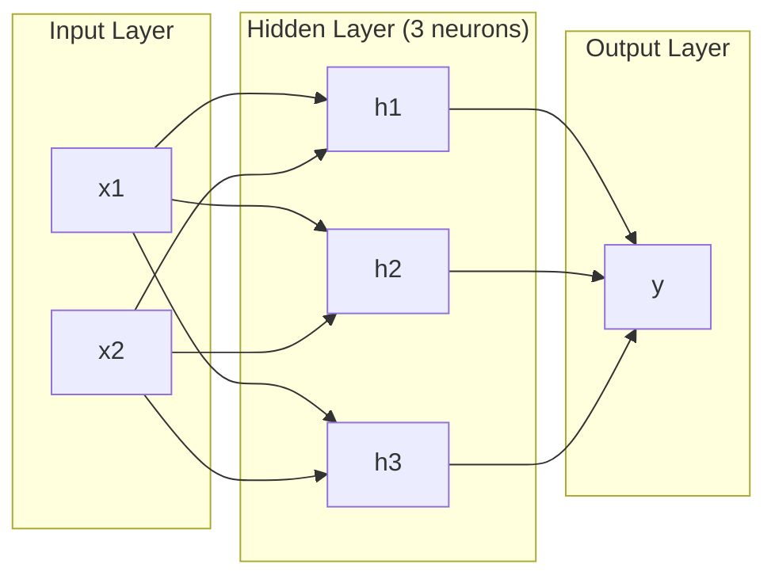
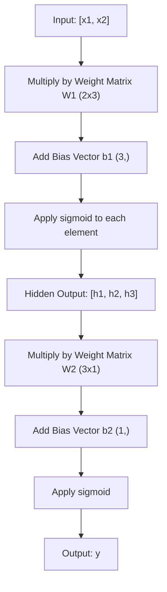
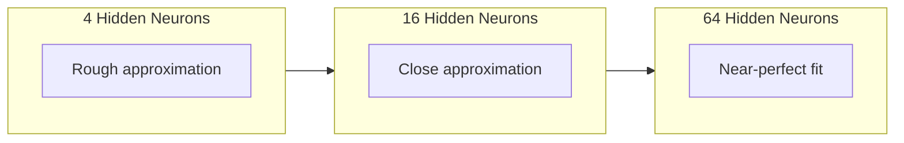

# 多层网络与前向传播

> 一个神经元画一条直线。将它们堆叠起来，你就能画出任何形状。

**类型:** 构建
**语言:** Python
**前置知识:** 阶段01 (数学基础), 第03.01课 (感知机)
**时间:** 约90分钟

## 学习目标

- 使用自定义的Layer和Network类从零构建一个多层网络，使其能够完成完整的前向传播
- 追踪矩阵在每个网络层中的维度变化，并能识别形状不匹配的情况
- 解释非线性激活函数的堆叠如何使网络学习弯曲的决策边界
- 使用2-2-1架构并手动调整sigmoid权重，解决XOR问题

## 问题所在

单个神经元就是一个画线器。仅此而已。一条穿过数据的直线。AI中的每个实际问题——图像识别、语言理解、下围棋——都需要曲线。将神经元堆叠成层，就是获得曲线的方法。

1969年，Minsky和Papert证明了这一限制是致命的：单层网络无法学习XOR。不是"难以学习"，而是数学上不可能。XOR真值表将[0,1]和[1,0]放在一侧，[0,0]和[1,1]放在另一侧。没有一条直线能分开它们。

这直接导致神经网络研究资金中断了十多年。事后看来，解决方案显而易见：不要再使用单层。将神经元堆叠成层。让第一层将输入空间雕刻成新的特征，让第二层将这些特征组合成任何单条直线都无法做出的决策。

这个堆叠就是多层网络。它是当今所有生产环境中的深度学习模型的基础。前向传播——数据从输入层流经隐藏层到输出层——是你需要构建的第一件事，在此之后其他一切才能工作。

## 概念

### 层：输入层、隐藏层、输出层

一个多层网络包含三种类型的层：

**输入层** —— 实际上不是真正的层。它只是存放原始数据的地方。两个特征意味着两个输入节点。此处不进行计算。

**隐藏层** —— 工作在这里完成。每个神经元接收前一层所有的输出，应用权重和偏置，然后将结果通过激活函数。"隐藏"是因为你在训练数据中从来不会直接看到这些值。

**输出层** —— 最终的答案。对于二分类，使用一个神经元加sigmoid。对于多分类，每个类别一个神经元。



这是一个2-3-1网络。两个输入，三个隐藏神经元，一个输出。每条连接都带有一个权重。每个神经元（除了输入层）都带有一个偏置。

每一层产生一个数字向量，称为隐藏状态。对于文本，隐藏状态会增加维度——将单词编码为768个数字以捕捉语义含义。对于图像，它们会减少维度——将数百万像素压缩成一个可管理的表示。隐藏状态就是学习发生的地方。

### 神经元与激活函数

每个神经元做三件事：

1. 将每个输入乘以对应的权重
2. 将所有乘积求和并加上偏置
3. 将和通过激活函数

目前，激活函数是sigmoid：

```
sigmoid(z) = 1 / (1 + e^(-z))
```

Sigmoid将任何数字压缩到区间(0, 1)。大的正输入推向1。大的负输入推向0。零映射到0.5。这个平滑曲线使得学习成为可能——与感知机的硬阶跃不同，sigmoid处处有梯度。

### 前向传播：数据如何流动

前向传播将输入数据逐层推过网络，直到到达输出。前向传播期间没有学习发生。它纯粹是计算：相乘、相加、激活、重复。



在每一层，三个操作按顺序执行：

```
z = W * input + b       (linear transformation)
a = sigmoid(z)           (activation)
```

一层的输出成为下一层的输入。这就是整个前向传播。

### 矩阵维度

追踪维度是深度学习中最最重要的调试技能。下面是2-3-1网络的情况：

| 步骤 | 操作 | 维度 | 结果形状 |
|------|------|------|---------|
| 输入 | x | -- | (2,) |
| 隐藏层线性变换 | W1 * x + b1 | W1: (3, 2), b1: (3,) | (3,) |
| 隐藏层激活 | sigmoid(z1) | -- | (3,) |
| 输出层线性变换 | W2 * h + b2 | W2: (1, 3), b2: (1,) | (1,) |
| 输出层激活 | sigmoid(z2) | -- | (1,) |

规则：在第k层，权重矩阵W的形状为 (当前层神经元数, 前一层神经元数)。行对应当前层，列对应前一层。如果形状不匹配，说明有错误。

### 通用逼近定理

1989年，George Cybenko证明了一个非凡的结果：一个具有单个隐藏层且神经元数量足够多的神经网络，可以以任意精度逼近任何连续函数。

这并不意味着单隐藏层总是最好的。它说明该架构在理论上是可行的。在实践中，更深的网络（更多层，每层更少的神经元）能用更少的总参数学到与浅宽网络相同的函数。这就是深度学习有效的原因。

直观理解：隐藏层中的每个神经元学习一个"凸起"或特征。在正确位置放置足够多的凸起，就能逼近任何光滑曲线。神经元越多，凸起越多，逼近效果越好。



### 可组合性

神经网络是可组合的。你可以堆叠它们、串联它们、并行运行它们。Whisper模型使用一个编码器网络处理音频，并使用一个独立的解码器网络生成文本。现代LLM是仅解码器架构。BERT是仅编码器架构。T5是编码器-解码器架构。架构的选择决定了模型能做什么。

## 构建实现

纯 Python。不使用numpy。每个矩阵操作都从头手动编写。

### 步骤1：Sigmoid激活函数

```python
import math

def sigmoid(x):
    x = max(-500.0, min(500.0, x))
    return 1.0 / (1.0 + math.exp(-x))
```

限制在 [-500, 500] 之内可以防止溢出。`math.exp(500)` 虽然很大但仍是有限值，而 `math.exp(1000)` 就是无穷大了。

### 步骤2：Layer类

深度学习中最最重要的运算是矩阵乘法。每一层、每个注意力头、每次前向传播——归根结底都是矩阵乘法。线性层接收一个输入向量，乘以权重矩阵，再加上偏置向量：y = Wx + b。仅仅这一个方程就占用了神经网络90%的计算量。

一个层持有一个权重矩阵和一个偏置向量。它的forward方法接收一个输入向量，并返回激活后的输出。

```python
class Layer:
    def __init__(self, n_inputs, n_neurons, weights=None, biases=None):
        if weights is not None:
            self.weights = weights
        else:
            import random
            self.weights = [
                [random.uniform(-1, 1) for _ in range(n_inputs)]
                for _ in range(n_neurons)
            ]
        if biases is not None:
            self.biases = biases
        else:
            self.biases = [0.0] * n_neurons

    def forward(self, inputs):
        self.last_input = inputs
        self.last_output = []
        for neuron_idx in range(len(self.weights)):
            z = sum(
                w * x for w, x in zip(self.weights[neuron_idx], inputs)
            )
            z += self.biases[neuron_idx]
            self.last_output.append(sigmoid(z))
        return self.last_output
```

权重矩阵的形状为 (神经元数量, 输入数量)。每一行代表一个神经元在所有输入上的权重。forward方法遍历每个神经元，计算加权和加偏置，应用sigmoid，并收集结果。

### 步骤3：Network类

一个网络就是层的一个列表。前向传播将它们串联起来：第k层的输出作为第k+1层的输入。

```python
class Network:
    def __init__(self, layers):
        self.layers = layers

    def forward(self, inputs):
        current = inputs
        for layer in self.layers:
            current = layer.forward(current)
        return current
```

这就是完整的前向传播。四行逻辑。数据进入，流经每一层，从另一端出来。

### 步骤4：手动调整权重的XOR

在第1课中，我们通过组合OR、NAND和AND感知机解决了XOR问题。现在用我们的Layer和Network类做同样的事情。2-2-1架构：两个输入，两个隐藏神经元，一个输出。

```python
hidden = Layer(
    n_inputs=2,
    n_neurons=2,
    weights=[[20.0, 20.0], [-20.0, -20.0]],
    biases=[-10.0, 30.0],
)

output = Layer(
    n_inputs=2,
    n_neurons=1,
    weights=[[20.0, 20.0]],
    biases=[-30.0],
)

xor_net = Network([hidden, output])

xor_data = [
    ([0, 0], 0),
    ([0, 1], 1),
    ([1, 0], 1),
    ([1, 1], 0),
]

for inputs, expected in xor_data:
    result = xor_net.forward(inputs)
    predicted = 1 if result[0] >= 0.5 else 0
    print(f"  {inputs} -> {result[0]:.6f} (rounded: {predicted}, expected: {expected})")
```

大权重（20, -20）使sigmoid表现得像阶跃函数。第一个隐藏神经元近似于OR。第二个近似于NAND。输出神经元将它们组合成AND，也就是XOR。

### 步骤5：圆形分类

一个更困难的问题：将二维点分类为以原点为中心、半径为0.5的圆内部或外部。这需要一个弯曲的决策边界——单个感知机无法做到。

```python
import random
import math

random.seed(42)

data = []
for _ in range(200):
    x = random.uniform(-1, 1)
    y = random.uniform(-1, 1)
    label = 1 if (x * x + y * y) < 0.25 else 0
    data.append(([x, y], label))

circle_net = Network([
    Layer(n_inputs=2, n_neurons=8),
    Layer(n_inputs=8, n_neurons=1),
])
```

使用随机权重，网络分类效果不会好。但前向传播仍然能运行。这就是关键——前向传播只是计算。学习正确的权重是反向传播的职责，将在第3课中介绍。

```python
correct = 0
for inputs, expected in data:
    result = circle_net.forward(inputs)
    predicted = 1 if result[0] >= 0.5 else 0
    if predicted == expected:
        correct += 1

print(f"Accuracy with random weights: {correct}/{len(data)} ({100*correct/len(data):.1f}%)")
```

随机权重的准确率很低——通常比猜测多数类还要差。经过训练（第3课）之后，同样的架构使用8个隐藏神经元将能画出弯曲的边界，将内部和外部区分开。

## 使用PyTorch

PyTorch用四行代码完成上述所有工作：

```python
import torch
import torch.nn as nn

model = nn.Sequential(
    nn.Linear(2, 8),
    nn.Sigmoid(),
    nn.Linear(8, 1),
    nn.Sigmoid(),
)

x = torch.tensor([[0.0, 0.0], [0.0, 1.0], [1.0, 0.0], [1.0, 1.0]])
output = model(x)
print(output)
```

`nn.Linear(2, 8)` 就是你的Layer类：形状为(8, 2)的权重矩阵，形状为(8,)的偏置向量。`nn.Sigmoid()` 就是你的sigmoid函数，逐元素应用。`nn.Sequential` 就是你的Network类：按顺序串联层。

区别在于速度和规模。PyTorch可以在GPU上运行，处理数百万样本的批次，并自动计算反向传播所需的梯度。但是前向传播的逻辑与你自己从零构建的完全相同。

## 交付成果

本课程产出一个可复用的提示词，用于设计网络架构：

- `outputs/prompt-network-architect.md`

当需要为给定问题决定层数、每层神经元数量和激活函数时，使用此提示词。

## 练习

1. 构建一个2-4-2-1网络（两个隐藏层），在XOR数据上使用随机权重运行前向传播。打印中间隐藏层的输出，观察表示在每一层如何变换。

2. 将圆形分类器中的隐藏层大小从8改为2，再改为32。每次使用随机权重运行前向传播。隐藏神经元的数量是否改变输出的范围或分布？为什么？

3. 在Network类上实现一个`count_parameters`方法，返回可训练权重和偏置的总数。在784-256-128-10网络（经典的MNIST架构）上测试它。它有多少参数？

4. 为3-4-4-2网络构建一个前向传播。输入RGB颜色值（归一化到0-1），观察两个输出。这是一个两类的简单颜色分类器架构。

5. 将sigmoid替换为一个"泄漏阶跃"函数：如果z < 0返回0.01 * z，否则返回1.0。使用步骤4中相同的手动调整权重在XOR上运行前向传播。它还能工作吗？为什么平滑的sigmoid比硬截止函数更受青睐？

## 关键术语

| 术语 | 人们常说 | 实际含义 |
|------|----------|----------|
| 前向传播 | "运行模型" | 将输入推过每一层——乘以权重、加偏置、激活——以产生输出 |
| 隐藏层 | "中间部分" | 输入和输出之间的任何层，它们的值在数据中不能直接观察到 |
| 多层网络 | "深度神经网络" | 按顺序堆叠的神经元层，每层的输出作为下一层的输入 |
| 激活函数 | "非线性变换" | 在线性变换之后应用的函数，向决策边界引入曲线 |
| Sigmoid | "S形曲线" | sigma(z) = 1/(1+e^(-z))，将任意实数压缩到(0,1)，处处光滑可微 |
| 权重矩阵 | "参数" | 形状为 (当前层神经元数, 前一层神经元数) 的矩阵W，包含可学习的连接强度 |
| 偏置向量 | "偏移量" | 矩阵乘法后加上的向量，使神经元即使输入全为零也能激活 |
| 通用逼近定理 | "神经网络能学任何东西" | 一个具有足够多神经元的隐藏层可以逼近任何连续函数——但"足够"可能意味着数十亿个 |
| 线性变换 | "矩阵乘法步骤" | z = W * x + b，激活之前的计算，将输入映射到一个新空间 |
| 决策边界 | "分类器切换的地方" | 输入空间中网络输出穿过分类阈值的那条曲面 |

## 进一步阅读

- Michael Nielsen, "Neural Networks and Deep Learning", Chapter 1-2 (http://neuralnetworksanddeeplearning.com/) —— 关于前向传播和网络结构最清晰免费的讲解，配有交互式可视化
- Cybenko, "Approximation by Superpositions of a Sigmoidal Function" (1989) —— 通用逼近定理的原始论文，出乎意料地可读
- 3Blue1Brown, "But what is a neural network?" (https://www.youtube.com/watch?v=aircAruvnKk) —— 20分钟的视觉讲解，带你走过层、权重和前向传播，构建正确的思维模型
- Goodfellow, Bengio, Courville, "Deep Learning", Chapter 6 (https://www.deeplearningbook.org/) —— 多层网络的标准参考书，免费在线版
