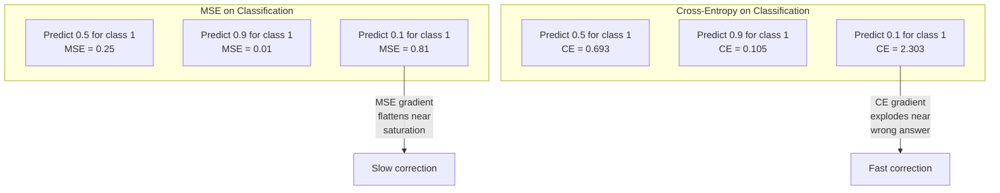
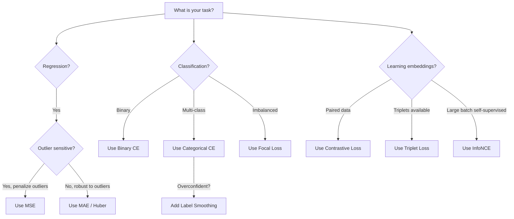
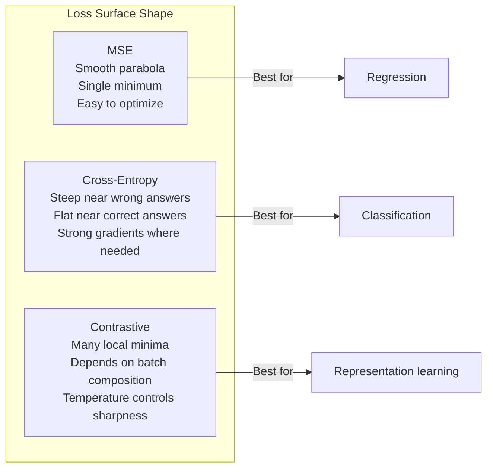

# 损失函数

> 你的网络做出了预测。真实情况却说不是这样。错得有多离谱？那个数字就是损失。选错了损失函数，你的模型就会彻底优化错东西。

**类型：** 构建  
**语言：** Python  
**前置要求：** 第三单元第4课（激活函数）  
**时长：** 约75分钟

## 学习目标

- 从零实现MSE、二元交叉熵、分类交叉熵和对比损失（InfoNCE）及其梯度
- 通过演示“对所有输出预测0.5”的失效模式，解释为什么MSE不适用于分类
- 对交叉熵应用标签平滑，并描述它如何防止过置信预测
- 为回归、二元分类、多分类和嵌入学习任务选择合适的损失函数

## 问题

一个在分类问题上最小化MSE的模型会自信地对所有输出预测0.5。它确实在最小化损失，但也毫无用处。

损失函数是模型唯一实际优化的东西。不是准确率，不是F1分数，也不是你报告给经理的任何指标。优化器根据损失函数的梯度调整权重，让那个数字变小。如果损失函数没有捕捉到你真正关心的东西，模型就会找到数学上最廉价的方式来满足它，而那种方式几乎从来不是你想要的。

举个具体的例子。你有一个二元分类任务，两个类别各占50%。你用MSE作为损失。模型对每个输入都预测0.5。平均MSE是0.25，这是在没有学到任何东西的情况下能达到的最小值。模型没有任何判别能力，但它在技术上已经最小化了你的损失函数。换成交叉熵，同一个模型就不得不把预测推向0或1，因为 -log(0.5) = 0.693 是一个很糟糕的损失，而 -log(0.99) = 0.01 会奖励正确且自信的预测。损失函数的选择，决定了模型是在学习还是在钻指标的空子。

更糟的是，在自监督学习中，你甚至没有标签。对比损失完全定义了学习信号：什么算相似，什么算不同，以及模型应该把它们推开的力度。如果把对比损失搞错了，你的嵌入就会坍缩成一个点——每个输入都映射到同一个向量。技术上损失为零，但完全没用。

## 概念

### 均方误差（MSE）

回归的默认选择。计算预测与目标之间的平方差，再对所有样本取平均。

```
MSE = (1/n) * sum((y_pred - y_true)^2)
```

为什么平方重要：它二次方地惩罚大误差。误差为2的代价是误差为1的4倍。误差为10的代价是100倍。这使得MSE对异常值敏感——一个严重错误的预测就会主导整个损失。

实际数字：如果你的模型预测房价，大多数房子误差1万美元，但有一栋豪宅误差20万美元，MSE会大力地去修正那一栋豪宅，反而可能损害其他99栋房子的性能。

MSE对预测的梯度是：

```
dMSE/dy_pred = (2/n) * (y_pred - y_true)
```

梯度与误差呈线性关系。误差越大，梯度越大。这对回归来说是好事（大误差需要大修正），但对分类来说是坏事（你希望指数级地惩罚自信的错误答案，而不是线性地惩罚）。

### 交叉熵损失

分类的损失函数。源于信息论——它衡量预测概率分布与真实分布之间的散度。

**二元交叉熵（BCE）：**

```
BCE = -(y * log(p) + (1 - y) * log(1 - p))
```

其中 y 是真实标签（0或1），p 是预测概率。

为什么 -log(p) 有效：真实标签为1时，如果预测 p = 0.99，损失为 -log(0.99) = 0.01。如果预测 p = 0.01，损失为 -log(0.01) = 4.6。这一460倍的差异就是交叉熵有效的原因。它狠狠地惩罚自信的错误预测，而几乎不惩罚自信的正确预测。

梯度同样说明了这一点：

```
dBCE/dp = -(y/p) + (1-y)/(1-p)
```

当 y=1 且 p 接近0时，梯度是 -1/p，趋近负无穷。模型得到巨大的修正信号。当 p 接近1时，梯度很小。已经正确，无需修正。

**分类交叉熵：**

用于多分类，目标是one-hot编码。

```
CCE = -sum(y_i * log(p_i))
```

只有真实类别对损失有贡献（因为其他所有 y_i 都是0）。如果有10个类别，正确类别的概率为0.1（随机猜测），损失为 -log(0.1) = 2.3。如果正确类别的概率为0.9，损失为 -log(0.9) = 0.105。模型学习将概率质量集中在正确答案上。

### 为什么MSE在分类中失效



当预测接近0或1时，MSE梯度会变平（由于sigmoid饱和）。交叉熵的梯度弥补了这一点——-log抵消了sigmoid的平坦区域，在最需要的地方给出强梯度。

### 标签平滑

标准的one-hot标签说“这个100%是第3类，其他类别0%”。这是一个很强的断言。标签平滑将其软化：

```
smooth_label = (1 - alpha) * one_hot + alpha / num_classes
```

当 alpha = 0.1 且有10个类别时：目标从 [0, 0, 1, 0, ...] 变成 [0.01, 0.01, 0.91, 0.01, ...]。模型的目标是0.91而不是1.0。

为什么有效：试图通过softmax输出精确1.0的模型需要将logits推向无穷大。这会导致过置信、损害泛化能力，并使模型对分布变化敏感。标签平滑将目标上限设为0.9（当alpha=0.1时），使logits保持在合理范围。GPT和大多数现代模型都使用标签平滑或其等价形式。

### 对比损失

没有标签，没有类别。只有成对的输入和问题：它们是相似还是不同？

**SimCLR风格对比损失（NT-Xent / InfoNCE）：**

取一张图片。创建它的两个增强视图（裁剪、旋转、颜色抖动）。它们构成“正样本对”——应该有相似的嵌入。批次中的其他所有图片构成“负样本对”——应该有不同的嵌入。

```
L = -log(exp(sim(z_i, z_j) / tau) / sum(exp(sim(z_i, z_k) / tau)))
```

其中 sim() 是余弦相似度，z_i 和 z_j 是正样本对，求和项针对所有负样本，tau（温度）控制分布的尖锐程度。温度越低，负样本越难，分离越激进。

实际数字：批次大小256意味着每个正样本对有255个负样本。温度 tau = 0.07（SimCLR默认值）。损失看起来像是相似度的softmax——它希望正样本对的相似度在256个选项中最高。

**三元组损失：**

接受三个输入：锚点、正样本（同类）、负样本（异类）。

```
L = max(0, d(anchor, positive) - d(anchor, negative) + margin)
```

边距（通常0.2-1.0）强制正负距离之间存在最小间隔。如果负样本已经足够远，损失为零——没有梯度，不更新。这使训练高效，但需要仔细的三元组挖掘（选择靠近锚点的难负样本）。

### 焦点损失

用于不平衡数据集。标准交叉熵对所有正确分类的样本一视同仁。焦点损失降低简单样本的权重：

```
FL = -alpha * (1 - p_t)^gamma * log(p_t)
```

其中 p_t 是真实类别的预测概率，gamma 控制聚焦程度。gamma = 0 时就是标准交叉熵。gamma = 2（默认值）：

- 简单样本（p_t = 0.9）：权重 = (0.1)^2 = 0.01，几乎被忽略。
- 难样本（p_t = 0.1）：权重 = (0.9)^2 = 0.81，完整的梯度信号。

焦点损失由Lin等人在目标检测中提出，当时99%的候选区域是背景（简单负样本）。没有焦点损失，模型会在大量简单背景样本中迷失，永远学不会检测目标。有了它，模型将能力集中在那些重要而模糊的难样本上。

### 损失函数决策树



### 损失景观



## 构建

### 第1步：MSE及其梯度

```python
def mse(predictions, targets):
    n = len(predictions)
    total = 0.0
    for p, t in zip(predictions, targets):
        total += (p - t) ** 2
    return total / n

def mse_gradient(predictions, targets):
    n = len(predictions)
    grads = []
    for p, t in zip(predictions, targets):
        grads.append(2.0 * (p - t) / n)
    return grads
```

### 第2步：二元交叉熵

log(0)问题真实存在。如果模型对正样本预测恰好为0，log(0) = 负无穷。裁剪可以防止这一点。

```python
import math

def binary_cross_entropy(predictions, targets, eps=1e-15):
    n = len(predictions)
    total = 0.0
    for p, t in zip(predictions, targets):
        p_clipped = max(eps, min(1 - eps, p))
        total += -(t * math.log(p_clipped) + (1 - t) * math.log(1 - p_clipped))
    return total / n

def bce_gradient(predictions, targets, eps=1e-15):
    grads = []
    for p, t in zip(predictions, targets):
        p_clipped = max(eps, min(1 - eps, p))
        grads.append(-(t / p_clipped) + (1 - t) / (1 - p_clipped))
    return grads
```

### 第3步：带Softmax的分类交叉熵

Softmax将原始logits转换为概率。然后我们计算与one-hot目标的交叉熵。

```python
def softmax(logits):
    max_val = max(logits)
    exps = [math.exp(x - max_val) for x in logits]
    total = sum(exps)
    return [e / total for e in exps]

def categorical_cross_entropy(logits, target_index, eps=1e-15):
    probs = softmax(logits)
    p = max(eps, probs[target_index])
    return -math.log(p)

def cce_gradient(logits, target_index):
    probs = softmax(logits)
    grads = list(probs)
    grads[target_index] -= 1.0
    return grads
```

softmax + 交叉熵的梯度优雅地简化了：对于真实类别，它就是 (预测概率 - 1)；对于其他所有类别，它就是 (预测概率)。这种优雅的简化并非巧合——这正是一起使用softmax和交叉熵的原因。

### 第4步：标签平滑

```python
def label_smoothed_cce(logits, target_index, num_classes, alpha=0.1, eps=1e-15):
    probs = softmax(logits)
    loss = 0.0
    for i in range(num_classes):
        if i == target_index:
            smooth_target = 1.0 - alpha + alpha / num_classes
        else:
            smooth_target = alpha / num_classes
        p = max(eps, probs[i])
        loss += -smooth_target * math.log(p)
    return loss
```

### 第5步：对比损失（简化版InfoNCE）

```python
def cosine_similarity(a, b):
    dot = sum(x * y for x, y in zip(a, b))
    norm_a = math.sqrt(sum(x * x for x in a))
    norm_b = math.sqrt(sum(x * x for x in b))
    if norm_a < 1e-10 or norm_b < 1e-10:
        return 0.0
    return dot / (norm_a * norm_b)

def contrastive_loss(anchor, positive, negatives, temperature=0.07):
    sim_pos = cosine_similarity(anchor, positive) / temperature
    sim_negs = [cosine_similarity(anchor, neg) / temperature for neg in negatives]

    max_sim = max(sim_pos, max(sim_negs)) if sim_negs else sim_pos
    exp_pos = math.exp(sim_pos - max_sim)
    exp_negs = [math.exp(s - max_sim) for s in sim_negs]
    total_exp = exp_pos + sum(exp_negs)

    return -math.log(max(1e-15, exp_pos / total_exp))
```

### 第6步：分类任务上的MSE vs 交叉熵

用两种损失函数训练同一网络（第4课的圆环数据集）。观察交叉熵收敛更快。

```python
import random

def sigmoid(x):
    x = max(-500, min(500, x))
    return 1.0 / (1.0 + math.exp(-x))

def make_circle_data(n=200, seed=42):
    random.seed(seed)
    data = []
    for _ in range(n):
        x = random.uniform(-2, 2)
        y = random.uniform(-2, 2)
        label = 1.0 if x * x + y * y < 1.5 else 0.0
        data.append(([x, y], label))
    return data


class LossComparisonNetwork:
    def __init__(self, loss_type="bce", hidden_size=8, lr=0.1):
        random.seed(0)
        self.loss_type = loss_type
        self.lr = lr
        self.hidden_size = hidden_size

        self.w1 = [[random.gauss(0, 0.5) for _ in range(2)] for _ in range(hidden_size)]
        self.b1 = [0.0] * hidden_size
        self.w2 = [random.gauss(0, 0.5) for _ in range(hidden_size)]
        self.b2 = 0.0

    def forward(self, x):
        self.x = x
        self.z1 = []
        self.h = []
        for i in range(self.hidden_size):
            z = self.w1[i][0] * x[0] + self.w1[i][1] * x[1] + self.b1[i]
            self.z1.append(z)
            self.h.append(max(0.0, z))

        self.z2 = sum(self.w2[i] * self.h[i] for i in range(self.hidden_size)) + self.b2
        self.out = sigmoid(self.z2)
        return self.out

    def backward(self, target):
        if self.loss_type == "mse":
            d_loss = 2.0 * (self.out - target)
        else:
            eps = 1e-15
            p = max(eps, min(1 - eps, self.out))
            d_loss = -(target / p) + (1 - target) / (1 - p)

        d_sigmoid = self.out * (1 - self.out)
        d_out = d_loss * d_sigmoid

        for i in range(self.hidden_size):
            d_relu = 1.0 if self.z1[i] > 0 else 0.0
            d_h = d_out * self.w2[i] * d_relu
            self.w2[i] -= self.lr * d_out * self.h[i]
            for j in range(2):
                self.w1[i][j] -= self.lr * d_h * self.x[j]
            self.b1[i] -= self.lr * d_h
        self.b2 -= self.lr * d_out

    def compute_loss(self, pred, target):
        if self.loss_type == "mse":
            return (pred - target) ** 2
        else:
            eps = 1e-15
            p = max(eps, min(1 - eps, pred))
            return -(target * math.log(p) + (1 - target) * math.log(1 - p))

    def train(self, data, epochs=200):
        losses = []
        for epoch in range(epochs):
            total_loss = 0.0
            correct = 0
            for x, y in data:
                pred = self.forward(x)
                self.backward(y)
                total_loss += self.compute_loss(pred, y)
                if (pred >= 0.5) == (y >= 0.5):
                    correct += 1
            avg_loss = total_loss / len(data)
            accuracy = correct / len(data) * 100
            losses.append((avg_loss, accuracy))
            if epoch % 50 == 0 or epoch == epochs - 1:
                print(f"    Epoch {epoch:3d}: loss={avg_loss:.4f}, accuracy={accuracy:.1f}%")
        return losses
```

## 使用

PyTorch提供了所有标准损失函数，并内置了数值稳定性：

```python
import torch
import torch.nn as nn
import torch.nn.functional as F

predictions = torch.tensor([0.9, 0.1, 0.7], requires_grad=True)
targets = torch.tensor([1.0, 0.0, 1.0])

mse_loss = F.mse_loss(predictions, targets)
bce_loss = F.binary_cross_entropy(predictions, targets)

logits = torch.randn(4, 10)
labels = torch.tensor([3, 7, 1, 9])
ce_loss = F.cross_entropy(logits, labels)
ce_smooth = F.cross_entropy(logits, labels, label_smoothing=0.1)
```

使用 `F.cross_entropy`（而不是 `F.nll_loss` 加手动softmax）。它将log-softmax和负对数似然合并为一个数值稳定的操作。先单独应用softmax再取对数稳定性较差——在大指数相减时会丢失精度。

对于对比学习，大多数团队使用自定义实现或像 `lightly`、`pytorch-metric-learning` 这样的库。核心循环始终相同：计算成对相似度，创建正负样本上的softmax，反向传播。

## 交付

本课产出：
- `outputs/prompt-loss-function-selector.md` —— 一个可复用的提示词，用于选择合适的损失函数
- `outputs/prompt-loss-debugger.md` —— 一个诊断提示词，用于当你的损失曲线看起来不对劲时

## 练习

1. 实现Huber损失（平滑L1损失），它对小误差用MSE，对大误差用MAE。在预测 y = sin(x) 的回归网络上，当5%的训练目标添加了随机噪声（异常值）时，分别用MSE和Huber训练，比较最终测试误差。

2. 在二元分类训练循环中添加焦点损失。创建一个不平衡数据集（90%类别0，10%类别1）。比较200轮后标准BCE与焦点损失（gamma=2）在少数类上的召回率。

3. 实现带半难负样本挖掘的三元组损失。生成5个类别的2D嵌入数据。对每个锚点，找到距离仍大于正样本的最难负样本（半难）。与随机三元组选择的收敛速度进行比较。

4. 运行MSE vs 交叉熵比较，但在训练过程中跟踪各层的梯度大小。绘制每轮的平均梯度范数。验证交叉熵在模型最不确定的早期轮次中产生更大的梯度。

5. 实现KL散度损失，并验证当真实分布是one-hot时，最小化KL(真实 || 预测)产生的梯度与交叉熵相同。然后尝试软目标（如知识蒸馏），其中“真实”分布来自教师模型的softmax输出。

## 关键术语

| 术语 | 人们常说的 | 实际含义 |
|------|-----------|----------|
| 损失函数 | “模型错得多严重” | 一个可微函数，将预测和目标映射为一个标量，优化器将其最小化 |
| MSE | “平均平方误差” | 预测与目标之间平方差的均值；二次方惩罚大误差 |
| 交叉熵 | “分类损失” | 使用 -log(p) 衡量预测概率分布与真实分布之间的散度 |
| 二元交叉熵 | “BCE” | 两个类别的交叉熵：-(y*log(p) + (1-y)*log(1-p)) |
| 标签平滑 | “软化目标” | 将硬0/1目标替换为软值（如0.1/0.9），防止过置信，提高泛化 |
| 对比损失 | “拉近相似，推远不同” | 一种损失，通过使相似对在嵌入空间中靠近、不相似对远离来学习表示 |
| InfoNCE | “CLIP/SimCLR损失” | 在相似度分数上归一化温度缩放交叉熵；将对比学习视为分类 |
| 焦点损失 | “处理不平衡数据” | 加权交叉熵，权重为 (1-p_t)^gamma，降低简单样本权重，聚焦难样本 |
| 三元组损失 | “锚点-正样本-负样本” | 在嵌入空间中，将锚点推近正样本至少一个边距，使之远于负样本 |
| 温度 | “尖锐度旋钮” | 对logits/相似度进行标量除法，控制最终分布的峰值程度；越低越尖锐 |

## 进一步阅读

- Lin等人，“Focal Loss for Dense Object Detection”（2017）——引入焦点损失处理目标检测中极端类别不平衡（RetinaNet）
- Chen等人，“A Simple Framework for Contrastive Learning of Visual Representations”（SimCLR，2020）——定义了现代对比学习管线，使用NT-Xent损失
- Szegedy等人，“Rethinking the Inception Architecture”（2016）——引入标签平滑作为正则化技术，现已成为大多数大型模型的标准做法
- Hinton等人，“Distilling the Knowledge in a Neural Network”（2015）——使用软目标和KL散度的知识蒸馏，是模型压缩的基础
