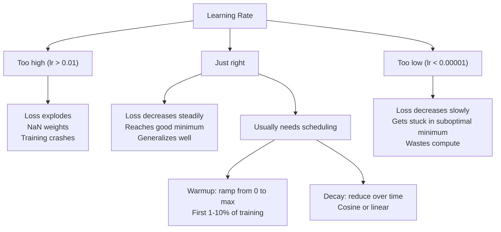
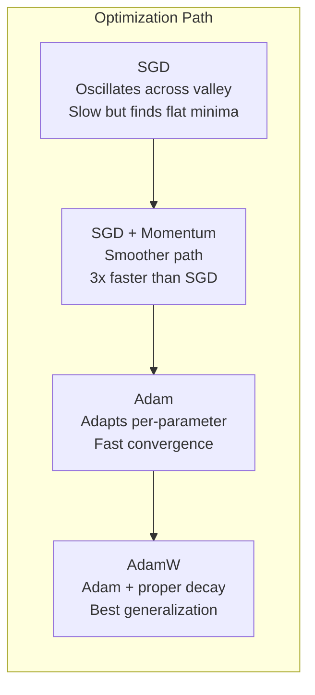
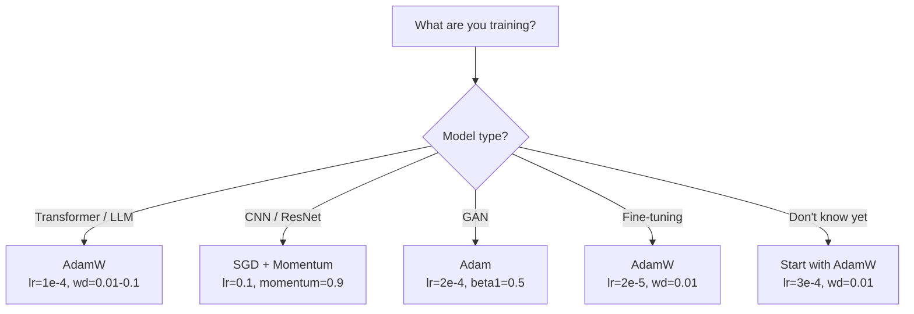

# 优化器

> 梯度下降告诉你该往哪个方向移动，但关于移动多远或多快则只字未提。SGD 是指南针，Adam 则是带交通数据的 GPS。

**类型：** 构建  
**语言：** Python  
**前置条件：** 第三课第五讲（损失函数）  
**时间：** 约 75 分钟  

## 学习目标

- 用 Python 从头实现 SGD、带动量的 SGD、Adam 和 AdamW 优化器
- 解释 Adam 的偏差校正如何在早期训练步骤中补偿零初始化的矩估计
- 在同一任务上，证明 AdamW 为何比带 L2 正则化的 Adam 产生更好的泛化效果
- 为 Transformer、CNN、GAN 和微调选择适当的优化器及默认超参数

## 问题

你已经计算好了梯度。你知道第 4,721 号权重应该减少 0.003 才能降低损失。但 0.003 是用什么单位？按什么缩放？而且在第 1 步和第 1,000 步时，你该移动相同的量吗？

朴素梯度下降在每一步对所有参数应用相同的学习率：w = w - lr * gradient。这导致了三个问题，使得在实践中训练神经网络变得痛苦。

首先是振荡。损失面的形状很少像光滑的碗。它更像一条狭长的山谷。梯度指向山谷的横跨方向（陡峭方向），而不是沿着山谷的方向（平缓方向）。梯度下降在狭窄的维度上来回弹跳，而在有用的方向上进展甚微。你可能见过这种情况：损失快速下降然后停滞，不是因为模型收敛了，而是因为它在振荡。

其次，对所有参数使用同一个学习率是错误的。有些权重需要较大的更新（它们处于早期欠拟合阶段），而其他权重只需要微小的更新（它们已经接近最优值）。适用于前者的学习率会破坏后者，反之亦然。

第三，鞍点。在高维空间中，损失面存在大片的平坦区域，梯度接近零。朴素的 SGD 以梯度的速度（实际上为零）在这些区域爬行。模型看起来卡住了。但它并没有卡住——它处于一个平坦区域，而另一边有用的下降路径就在那里。但 SGD 没有机制可以冲破这种困境。

Adam 解决了所有三个问题。它为每个参数维护两个运行平均值——梯度均值（动量，处理振荡）和梯度平方均值（自适应学习率，处理不同尺度）。结合前几步的偏差校正，它为你提供了一个单一的优化器，在 80% 的问题上使用默认超参数即可工作。本课程从头构建它，让你确切了解它在另外 20% 的问题上何时以及为何失效。

## 概念

### 随机梯度下降（SGD）

最简单的优化器。在小批量上计算梯度，然后朝相反方向迈出一步。

```
w = w - lr * gradient
```

“随机”意味着你使用数据的随机子集（小批量）来估计梯度，而不是整个数据集。这种噪声实际上是有益的——它有助于逃离尖锐的局部最小值。但噪声也会引起振荡。

学习率是唯一可调节的旋钮。太高：损失发散。太低：训练耗时漫长。最优值取决于架构、数据、批量大小和当前训练阶段。对于现代网络上的普通 SGD，典型值范围在 0.01 到 0.1 之间。但即使在单次训练运行中，理想的学习率也会发生变化。

### 动量

“球滚下山坡”的类比虽然用得多却很准确。你不是仅根据梯度来迈步，而是维持一个累积过去梯度的速度。

```
m_t = beta * m_{t-1} + gradient
w = w - lr * m_t
```

Beta（典型值 0.9）控制保留多少历史信息。当 beta = 0.9 时，动量大致是最近 10 个梯度的平均值（1 / (1 - 0.9) = 10）。

为什么这能解决振荡：指向同一方向的梯度会累积，而方向相反的梯度会抵消。在那个狭窄的山谷中，“横向”分量每一步都翻转符号而被抑制，“纵向”分量保持一致并被放大。结果是在有用方向上平滑加速。

真实数据：在病态的损失面上，仅用 SGD 可能需要 10,000 步。带动量（beta=0.9）的 SGD 在相同问题上通常只需 3,000-5,000 步。加速效果并非微不足道。

### RMSProp

第一个实际有效的逐参数自适应学习率方法。由 Hinton 在一次 Coursera 课程中提出（从未正式发表）。

```
s_t = beta * s_{t-1} + (1 - beta) * gradient^2
w = w - lr * gradient / (sqrt(s_t) + epsilon)
```

s_t 跟踪梯度平方的运行平均值。梯度始终很大的参数会被一个大数除（有效学习率更小）。梯度很小的参数则被一个小数除（有效学习率更大）。

这解决了“所有参数共享一个学习率”的问题。一个已经得到大更新的权重可能已经接近其目标——减慢它。一个只得到微小更新的权重可能训练不足——加快它。

Epsilon（典型值 1e-8）防止当某个参数从未被更新时除以零。

### Adam：动量 + RMSProp

Adam 结合了两种思想。它为每个参数维护两个指数移动平均值：

```
m_t = beta1 * m_{t-1} + (1 - beta1) * gradient        (first moment: mean)
v_t = beta2 * v_{t-1} + (1 - beta2) * gradient^2       (second moment: variance)
```

**偏差校正** 是大多数解释跳过的关键细节。在第 1 步，m_1 = (1 - beta1) * gradient。当 beta1 = 0.9 时，那就是 0.1 * gradient——小了十倍。移动平均尚未预热。偏差校正对此进行补偿：

```
m_hat = m_t / (1 - beta1^t)
v_hat = v_t / (1 - beta2^t)
```

在第 1 步，当 beta1 = 0.9 时：m_hat = m_1 / (1 - 0.9) = m_1 / 0.1 = 实际梯度。在第 100 步：(1 - 0.9^100) 约为 1.0，因此校正消失。偏差校正对前 ~10 步很重要，约 50 步后无关紧要。

更新步骤：

```
w = w - lr * m_hat / (sqrt(v_hat) + epsilon)
```

Adam 默认参数：lr = 0.001, beta1 = 0.9, beta2 = 0.999, epsilon = 1e-8。这些默认参数对 80% 的问题有效。当它们无效时，首先调整 lr，然后调整 beta2。几乎从不改变 beta1 或 epsilon。

### AdamW：正确的权重衰减

L2 正则化在损失中添加 lambda * w^2。在普通 SGD 中，这等价于权重衰减（每一步从权重中减去 lambda * w）。但在 Adam 中，这种等价性被打破。

Loshchilov & Hutter 的洞见：当你将 L2 添加到损失中，然后 Adam 处理梯度时，自适应学习率也会缩放正则化项。梯度方差大的参数得到较少的正则化，方差小的参数得到更多的正则化。这不是你想要的——你希望无论梯度统计如何，都应用统一的正则化。

AdamW 通过直接在 Adam 更新之后对权重应用权重衰减来修复这一点：

```
w = w - lr * m_hat / (sqrt(v_hat) + epsilon) - lr * lambda * w
```

权重衰减项（lr * lambda * w）不被 Adam 的自适应因子缩放。每个参数得到相同的成比例收缩。

这看起来是一个小细节。但并非如此。在几乎每项任务上，AdamW 比 Adam + L2 正则化收敛到更好的解。它是 PyTorch 中训练 Transformer、扩散模型和大多数现代架构的默认优化器。BERT、GPT、LLaMA、Stable Diffusion——都使用 AdamW 训练。

### 学习率：最重要的超参数



如果你只调优一个超参数，那就调学习率。学习率改变 10 倍比你做的任何架构决策都更重要。常见默认值：

- SGD：lr = 0.01 到 0.1
- Adam/AdamW：lr = 1e-4 到 3e-4
- 微调预训练模型：lr = 1e-5 到 5e-5
- 学习率预热：在前 1-10% 的步骤中线性上升

### 优化器对比



### 各优化器的适用场景



## 动手构建

### 第一步：朴素 SGD

```python
class SGD:
    def __init__(self, lr=0.01):
        self.lr = lr

    def step(self, params, grads):
        for i in range(len(params)):
            params[i] -= self.lr * grads[i]
```

### 第二步：带动量的 SGD

```python
class SGDMomentum:
    def __init__(self, lr=0.01, beta=0.9):
        self.lr = lr
        self.beta = beta
        self.velocities = None

    def step(self, params, grads):
        if self.velocities is None:
            self.velocities = [0.0] * len(params)
        for i in range(len(params)):
            self.velocities[i] = self.beta * self.velocities[i] + grads[i]
            params[i] -= self.lr * self.velocities[i]
```

### 第三步：Adam

```python
import math

class Adam:
    def __init__(self, lr=0.001, beta1=0.9, beta2=0.999, epsilon=1e-8):
        self.lr = lr
        self.beta1 = beta1
        self.beta2 = beta2
        self.epsilon = epsilon
        self.m = None
        self.v = None
        self.t = 0

    def step(self, params, grads):
        if self.m is None:
            self.m = [0.0] * len(params)
            self.v = [0.0] * len(params)

        self.t += 1

        for i in range(len(params)):
            self.m[i] = self.beta1 * self.m[i] + (1 - self.beta1) * grads[i]
            self.v[i] = self.beta2 * self.v[i] + (1 - self.beta2) * grads[i] ** 2

            m_hat = self.m[i] / (1 - self.beta1 ** self.t)
            v_hat = self.v[i] / (1 - self.beta2 ** self.t)

            params[i] -= self.lr * m_hat / (math.sqrt(v_hat) + self.epsilon)
```

### 第四步：AdamW

```python
class AdamW:
    def __init__(self, lr=0.001, beta1=0.9, beta2=0.999, epsilon=1e-8, weight_decay=0.01):
        self.lr = lr
        self.beta1 = beta1
        self.beta2 = beta2
        self.epsilon = epsilon
        self.weight_decay = weight_decay
        self.m = None
        self.v = None
        self.t = 0

    def step(self, params, grads):
        if self.m is None:
            self.m = [0.0] * len(params)
            self.v = [0.0] * len(params)

        self.t += 1

        for i in range(len(params)):
            self.m[i] = self.beta1 * self.m[i] + (1 - self.beta1) * grads[i]
            self.v[i] = self.beta2 * self.v[i] + (1 - self.beta2) * grads[i] ** 2

            m_hat = self.m[i] / (1 - self.beta1 ** self.t)
            v_hat = self.v[i] / (1 - self.beta2 ** self.t)

            params[i] -= self.lr * m_hat / (math.sqrt(v_hat) + self.epsilon)
            params[i] -= self.lr * self.weight_decay * params[i]
```

### 第五步：训练对比

使用所有四种优化器在课程第五讲中的 circle 数据集上训练同一个两层网络，比较收敛情况。

```python
import random

def sigmoid(x):
    x = max(-500, min(500, x))
    return 1.0 / (1.0 + math.exp(-x))

def make_circle_data(n=200, seed=42):
    random.seed(seed)
    data = []
    for _ in range(n):
        x = random.uniform(-2, 2)
        y = random.uniform(-2, 2)
        label = 1.0 if x * x + y * y < 1.5 else 0.0
        data.append(([x, y], label))
    return data


class OptimizerTestNetwork:
    def __init__(self, optimizer, hidden_size=8):
        random.seed(0)
        self.hidden_size = hidden_size
        self.optimizer = optimizer

        self.w1 = [[random.gauss(0, 0.5) for _ in range(2)] for _ in range(hidden_size)]
        self.b1 = [0.0] * hidden_size
        self.w2 = [random.gauss(0, 0.5) for _ in range(hidden_size)]
        self.b2 = 0.0

    def get_params(self):
        params = []
        for row in self.w1:
            params.extend(row)
        params.extend(self.b1)
        params.extend(self.w2)
        params.append(self.b2)
        return params

    def set_params(self, params):
        idx = 0
        for i in range(self.hidden_size):
            for j in range(2):
                self.w1[i][j] = params[idx]
                idx += 1
        for i in range(self.hidden_size):
            self.b1[i] = params[idx]
            idx += 1
        for i in range(self.hidden_size):
            self.w2[i] = params[idx]
            idx += 1
        self.b2 = params[idx]

    def forward(self, x):
        self.x = x
        self.z1 = []
        self.h = []
        for i in range(self.hidden_size):
            z = self.w1[i][0] * x[0] + self.w1[i][1] * x[1] + self.b1[i]
            self.z1.append(z)
            self.h.append(max(0.0, z))

        self.z2 = sum(self.w2[i] * self.h[i] for i in range(self.hidden_size)) + self.b2
        self.out = sigmoid(self.z2)
        return self.out

    def compute_grads(self, target):
        eps = 1e-15
        p = max(eps, min(1 - eps, self.out))
        d_loss = -(target / p) + (1 - target) / (1 - p)
        d_sigmoid = self.out * (1 - self.out)
        d_out = d_loss * d_sigmoid

        grads = [0.0] * (self.hidden_size * 2 + self.hidden_size + self.hidden_size + 1)
        idx = 0
        for i in range(self.hidden_size):
            d_relu = 1.0 if self.z1[i] > 0 else 0.0
            d_h = d_out * self.w2[i] * d_relu
            grads[idx] = d_h * self.x[0]
            grads[idx + 1] = d_h * self.x[1]
            idx += 2

        for i in range(self.hidden_size):
            d_relu = 1.0 if self.z1[i] > 0 else 0.0
            grads[idx] = d_out * self.w2[i] * d_relu
            idx += 1

        for i in range(self.hidden_size):
            grads[idx] = d_out * self.h[i]
            idx += 1

        grads[idx] = d_out
        return grads

    def train(self, data, epochs=300):
        losses = []
        for epoch in range(epochs):
            total_loss = 0.0
            correct = 0
            for x, y in data:
                pred = self.forward(x)
                grads = self.compute_grads(y)
                params = self.get_params()
                self.optimizer.step(params, grads)
                self.set_params(params)

                eps = 1e-15
                p = max(eps, min(1 - eps, pred))
                total_loss += -(y * math.log(p) + (1 - y) * math.log(1 - p))
                if (pred >= 0.5) == (y >= 0.5):
                    correct += 1
            avg_loss = total_loss / len(data)
            accuracy = correct / len(data) * 100
            losses.append((avg_loss, accuracy))
            if epoch % 75 == 0 or epoch == epochs - 1:
                print(f"    Epoch {epoch:3d}: loss={avg_loss:.4f}, accuracy={accuracy:.1f}%")
        return losses
```

## 使用

PyTorch 优化器支持参数组、梯度裁剪和学习率调度：

```python
import torch
import torch.optim as optim

model = torch.nn.Sequential(
    torch.nn.Linear(784, 256),
    torch.nn.ReLU(),
    torch.nn.Linear(256, 10),
)

optimizer = optim.AdamW(model.parameters(), lr=3e-4, weight_decay=0.01)

scheduler = optim.lr_scheduler.CosineAnnealingLR(optimizer, T_max=100)

for epoch in range(100):
    optimizer.zero_grad()
    output = model(torch.randn(32, 784))
    loss = torch.nn.functional.cross_entropy(output, torch.randint(0, 10, (32,)))
    loss.backward()
    torch.nn.utils.clip_grad_norm_(model.parameters(), max_norm=1.0)
    optimizer.step()
    scheduler.step()
```

模式始终是：zero_grad, forward, loss, backward, (clip), step, (schedule)。记住这个顺序。弄错（例如在 optimizer.step() 之前调用 scheduler.step()）是导致隐蔽错误的常见原因。

对于 CNN，许多实践者仍然偏好 SGD + 动量（lr=0.1, momentum=0.9, weight_decay=1e-4），配合 step 或余弦调度。SGD 能找到更平坦的最小值，这通常能带来更好的泛化。对于 Transformer 和 LLM，带预热 + 余弦衰减的 AdamW 是普遍的默认选择。在没有测量依据的情况下，不要违背共识。

## 交付

本课程产出：
- `outputs/prompt-optimizer-selector.md` —— 一个决策提示，用于为任何架构选择合适的优化器和学习率。

## 练习

1. 实现 Nesterov 动量，即在“前瞻”位置（w - lr * beta * v）而不是当前位置计算梯度。在 circle 数据集上比较标准动量与 Nesterov 动量的收敛情况。

2. 实现学习率预热调度：在前 10% 的训练步骤中从 0 线性上升到 max_lr，然后余弦衰减到 0。分别使用带预热和不带预热的 Adam 进行训练，测量在 circle 数据集上达到 90% 准确率所需的 epoch 数。

3. 在 Adam 训练过程中跟踪每个参数的有效学习率。有效学习率为 lr * m_hat / (sqrt(v_hat) + eps)。绘制 10、50 和 200 步后有效学习率的分布图。所有参数是否以相同的速度更新？

4. 实现梯度裁剪（按全局范数裁剪）。将最大梯度范数设置为 1.0。使用较高的学习率（对于 Adam 为 lr=0.01）分别训练带裁剪和不带裁剪的模型。统计在 10 个随机种子下，带裁剪和不带裁剪的训练中分别有多少次出现发散（损失变为 NaN）。

5. 在权重较大的网络上比较 Adam 与 AdamW。将所有权重初始化为 [-5, 5] 范围内的随机值（远大于正常值）。使用 weight_decay=0.1 训练 200 个 epoch。绘制两种优化器下权重 L2 范数随训练的变化曲线。AdamW 应表现出更快的权重收缩。

## 关键术语

| 术语 | 人们常说的意思 | 实际含义 |
|------|----------------|----------|
| 学习率 | "步长" | 梯度更新的标量乘数；训练中影响最大的单个超参数 |
| SGD | "基础梯度下降" | 随机梯度下降：通过减去 lr * 梯度来更新权重，计算基于小批量 |
| 动量 | "滚球类比" | 过去梯度的指数移动平均；抑制振荡，加速一致方向 |
| RMSProp | "自适应学习率" | 每个参数的梯度除以其最近梯度的运行 RMS；均衡学习率 |
| Adam | "默认优化器" | 结合动量（一阶矩）和 RMSProp（二阶矩），并对初始步骤进行偏差校正 |
| AdamW | "正确的 Adam" | 带解耦权重衰减的 Adam；直接对权重应用正则化，而非通过梯度 |
| 偏差校正 | "运行平均的预热" | 除以 (1 - beta^t) 以补偿 Adam 矩估计的零初始化 |
| 权重衰减 | "缩小权重" | 每一步减去权重值的一部分；一种惩罚大权重的正则化器 |
| 学习率调度 | "随时间改变学习率" | 在训练过程中调整学习率的函数；预热 + 余弦衰减是现代默认方案 |
| 梯度裁剪 | "限制梯度范数" | 当梯度向量的范数超过阈值时将其缩小；防止梯度爆炸更新 |

## 延伸阅读

- Kingma & Ba, "Adam: A Method for Stochastic Optimization" (2014) —— 原始 Adam 论文，包含收敛分析和偏差校正推导
- Loshchilov & Hutter, "Decoupled Weight Decay Regularization" (2017) —— 证明在 Adam 中 L2 正则化与权重衰减不等价，并提出 AdamW
- Smith, "Cyclical Learning Rates for Training Neural Networks" (2017) —— 引入学习率范围测试和循环调度，消除了调整固定学习率的需求
- Ruder, "An Overview of Gradient Descent Optimization Algorithms" (2016) —— 所有优化器变体的最佳单一综述，包含清晰的比较和直观理解
