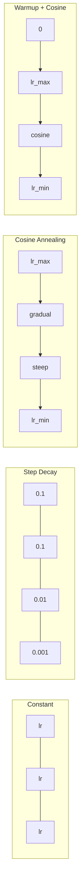
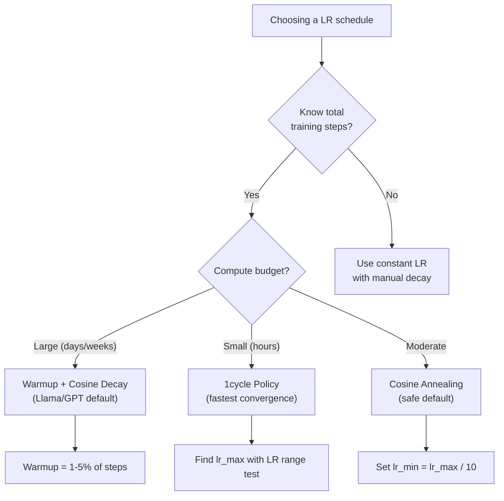
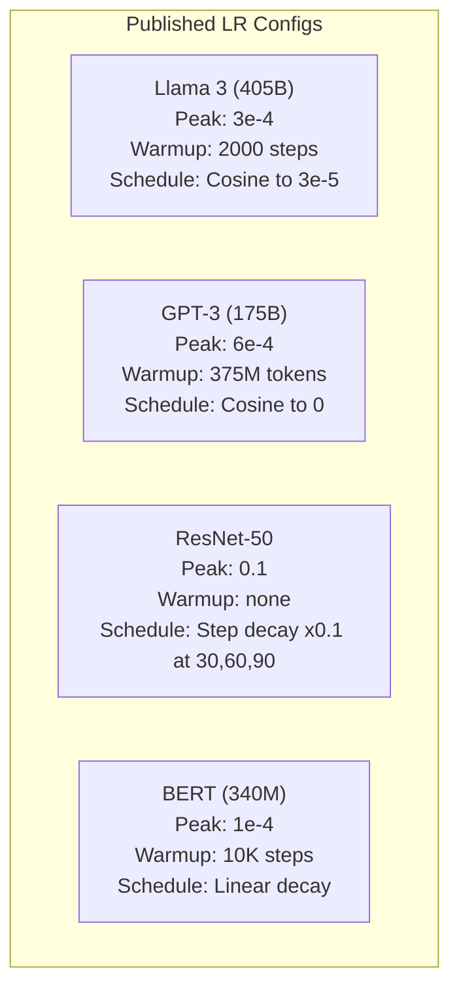

# 学习率调度与预热

> 学习率是唯一最重要的超参数。不是架构，不是数据集大小，不是激活函数。就是学习率。如果你什么都不调，那就调这个。

**类型：** 动手实践
**语言：** Python
**前置知识：** 第03.06课（优化器），第03.08课（权重初始化）
**时长：** 约90分钟

## 学习目标

- 从头实现恒定学习率、阶梯衰减、余弦退火、预热+余弦和1cycle学习率调度。
- 演示学习率选择的三种失败模式：发散（过高）、停滞（过低）和振荡（无衰减）。
- 解释为什么Adam类优化器需要预热，以及预热如何稳定早期训练。
- 在同一任务上比较所有五种调度的收敛速度，并为给定的训练预算选择合适的方法。

## 问题

设置学习率为0.1。训练发散——损失在3步内跳到无穷大。设置为0.0001。训练爬行——100个epoch后，模型几乎还没动。设置为0.01。训练正常进行50个epoch，然后损失在最小值附近振荡，永远无法抵达，因为步长太大。

最优学习率不是常数。它在训练过程中变化。早期你需要大步快速移动，后期你需要小步收敛到尖锐的最小值。90%准确率模型和95%准确率模型之间的差别往往只是调度本身。

过去三年发布的每个主要模型都使用了学习率调度。Llama 3使用峰值lr=3e-4，2000步预热，余弦衰减到3e-5。GPT-3使用lr=6e-4，预热超过3.75亿个token。这些都不是随意选择的，而是花费数百万美元进行大规模超参数搜索的结果。

你需要理解调度，因为默认值并不适用于你的问题。当你微调预训练模型时，正确的调度与从头训练不同。当你增加批量大小时，预热时长需要调整。当训练在第10000步中断时，你需要判断这是调度问题还是其他原因。

## 概念

### 恒定学习率

最简单的方法。选一个数字，每一步都用它。

```
lr(t) = lr_0
```

很少是最优的。要么对训练后期太高（在最小值附近振荡），要么对训练开始太低（小步浪费计算）。对于小模型和调试来说没问题。对于训练超过一小时的任务，这是一个糟糕的选择。

### 阶梯衰减

ResNet时代的经典方法。在固定epoch处将学习率乘以一个因子（通常是10倍）。

```
lr(t) = lr_0 * gamma^(floor(epoch / step_size))
```

其中 gamma = 0.1，step_size = 30 表示：每30个epoch学习率下降10倍。ResNet-50就用了这个——lr=0.1，在epoch 30、60和90时下降10倍。

问题在于：最优衰减点取决于数据集和架构。换到不同问题，你需要重新调整何时衰减。转换很突然——损失可能在学习率突然变化时飙升。

### 余弦退火

从最大学习率平滑衰减到最小值，遵循余弦曲线：

```
lr(t) = lr_min + 0.5 * (lr_max - lr_min) * (1 + cos(pi * t / T))
```

其中 t 是当前步数，T 是总步数。

在 t=0 时，余弦项为1，所以 lr = lr_max。在 t=T 时，余弦项为-1，所以 lr = lr_min。衰减开始缓慢，中间加速，最后再次变缓。

这是大多数现代训练运行的默认选项。除了 lr_max 和 lr_min 之外，没有需要调整的超参数。余弦形状与经验观察一致：大部分学习发生在训练中期——你希望在这个关键时期使用合理的步长。

### 预热：为什么要从小开始

Adam和其他自适应优化器维护梯度均值和方差的运行估计。在第0步，这些估计初始化为零。前几次梯度更新基于垃圾统计数据。如果学习率在这个阶段很大，模型会采取巨大且方向不佳的步骤。

预热解决了这个问题。从极小的学习率开始（通常是 lr_max / warmup_steps 甚至为零），在前 N 步中线性增加到 lr_max。当达到完整学习率时，Adam的统计量已经稳定。

```
lr(t) = lr_max * (t / warmup_steps)     for t < warmup_steps
```

典型的预热：占总训练步数的1-5%。Llama 3训练了约1.8万亿个token，预热了2000步。GPT-3预热了超过3.75亿个token。

### 线性预热 + 余弦衰减

现代默认方案。线性上升，然后余弦衰减：

```
if t < warmup_steps:
    lr(t) = lr_max * (t / warmup_steps)
else:
    progress = (t - warmup_steps) / (total_steps - warmup_steps)
    lr(t) = lr_min + 0.5 * (lr_max - lr_min) * (1 + cos(pi * progress))
```

Llama、GPT、PaLM以及大多数现代Transformer都使用这个方案。预热防止了早期不稳定。余弦衰减使模型落入一个好的最小值。

### 1cycle策略

Leslie Smith在2018年的发现：在训练的前半部分将学习率从一个低值上升到高值，在后半部分再降下来。反直觉——为什么要在中途*增加*学习率？

理论：高学习率通过向优化轨迹添加噪声来起到正则化作用。模型在上升阶段探索了更多损失景观，找到更好的盆地。下降阶段则在找到的最佳盆地内进行精炼。

```
Phase 1 (0 to T/2):    lr ramps from lr_max/25 to lr_max
Phase 2 (T/2 to T):    lr ramps from lr_max to lr_max/10000
```

对于固定的计算预算，1cycle通常比余弦退火训练得更快。权衡是：你必须事先知道总步数。

### 调度形状



### 决策流程图



### 来自已发表模型的真实数值



## 动手实现

### 第1步：调度函数

每个函数接收当前步数，返回该步数的学习率。

```python
import math


def constant_schedule(step, lr=0.01, **kwargs):
    return lr


def step_decay_schedule(step, lr=0.1, step_size=100, gamma=0.1, **kwargs):
    return lr * (gamma ** (step // step_size))


def cosine_schedule(step, lr=0.01, total_steps=1000, lr_min=1e-5, **kwargs):
    if step >= total_steps:
        return lr_min
    return lr_min + 0.5 * (lr - lr_min) * (1 + math.cos(math.pi * step / total_steps))


def warmup_cosine_schedule(step, lr=0.01, total_steps=1000, warmup_steps=100, lr_min=1e-5, **kwargs):
    if total_steps <= warmup_steps:
        return lr * (step / max(warmup_steps, 1))
    if step < warmup_steps:
        return lr * step / warmup_steps
    progress = (step - warmup_steps) / (total_steps - warmup_steps)
    return lr_min + 0.5 * (lr - lr_min) * (1 + math.cos(math.pi * progress))


def one_cycle_schedule(step, lr=0.01, total_steps=1000, **kwargs):
    mid = max(total_steps // 2, 1)
    if step < mid:
        return (lr / 25) + (lr - lr / 25) * step / mid
    else:
        progress = (step - mid) / max(total_steps - mid, 1)
        return lr * (1 - progress) + (lr / 10000) * progress
```

### 第2步：可视化所有调度

打印基于文本的图，展示每个调度在训练过程中的演变。

```python
def visualize_schedule(name, schedule_fn, total_steps=500, **kwargs):
    steps = list(range(0, total_steps, total_steps // 20))
    if total_steps - 1 not in steps:
        steps.append(total_steps - 1)

    lrs = [schedule_fn(s, total_steps=total_steps, **kwargs) for s in steps]
    max_lr = max(lrs) if max(lrs) > 0 else 1.0

    print(f"\n{name}:")
    for s, lr_val in zip(steps, lrs):
        bar_len = int(lr_val / max_lr * 40)
        bar = "#" * bar_len
        print(f"  Step {s:4d}: lr={lr_val:.6f} {bar}")
```

### 第3步：训练网络

一个简单的两层网络，使用圆圈数据集，与之前课程相同，但现在我们改变调度。

```python
import random


def sigmoid(x):
    x = max(-500, min(500, x))
    return 1.0 / (1.0 + math.exp(-x))


def relu(x):
    return max(0.0, x)


def relu_deriv(x):
    return 1.0 if x > 0 else 0.0


def make_circle_data(n=200, seed=42):
    random.seed(seed)
    data = []
    for _ in range(n):
        x = random.uniform(-2, 2)
        y = random.uniform(-2, 2)
        label = 1.0 if x * x + y * y < 1.5 else 0.0
        data.append(([x, y], label))
    return data


def train_with_schedule(schedule_fn, schedule_name, data, epochs=300, base_lr=0.05, **kwargs):
    random.seed(0)
    hidden_size = 8
    total_steps = epochs * len(data)

    std = math.sqrt(2.0 / 2)
    w1 = [[random.gauss(0, std) for _ in range(2)] for _ in range(hidden_size)]
    b1 = [0.0] * hidden_size
    w2 = [random.gauss(0, std) for _ in range(hidden_size)]
    b2 = 0.0

    step = 0
    epoch_losses = []

    for epoch in range(epochs):
        total_loss = 0
        correct = 0

        for x, target in data:
            lr = schedule_fn(step, lr=base_lr, total_steps=total_steps, **kwargs)

            z1 = []
            h = []
            for i in range(hidden_size):
                z = w1[i][0] * x[0] + w1[i][1] * x[1] + b1[i]
                z1.append(z)
                h.append(relu(z))

            z2 = sum(w2[i] * h[i] for i in range(hidden_size)) + b2
            out = sigmoid(z2)

            error = out - target
            d_out = error * out * (1 - out)

            for i in range(hidden_size):
                d_h = d_out * w2[i] * relu_deriv(z1[i])
                w2[i] -= lr * d_out * h[i]
                for j in range(2):
                    w1[i][j] -= lr * d_h * x[j]
                b1[i] -= lr * d_h
            b2 -= lr * d_out

            total_loss += (out - target) ** 2
            if (out >= 0.5) == (target >= 0.5):
                correct += 1
            step += 1

        avg_loss = total_loss / len(data)
        accuracy = correct / len(data) * 100
        epoch_losses.append(avg_loss)

    return epoch_losses
```

### 第4步：比较所有调度

用每个调度训练相同的网络，比较最终损失和收敛行为。

```python
def compare_schedules(data):
    configs = [
        ("Constant", constant_schedule, {}),
        ("Step Decay", step_decay_schedule, {"step_size": 15000, "gamma": 0.1}),
        ("Cosine", cosine_schedule, {"lr_min": 1e-5}),
        ("Warmup+Cosine", warmup_cosine_schedule, {"warmup_steps": 3000, "lr_min": 1e-5}),
        ("1cycle", one_cycle_schedule, {}),
    ]

    print(f"\n{'Schedule':<20} {'Start Loss':>12} {'Mid Loss':>12} {'End Loss':>12} {'Best Loss':>12}")
    print("-" * 70)

    for name, schedule_fn, extra_kwargs in configs:
        losses = train_with_schedule(schedule_fn, name, data, epochs=300, base_lr=0.05, **extra_kwargs)
        mid_idx = len(losses) // 2
        best = min(losses)
        print(f"{name:<20} {losses[0]:>12.6f} {losses[mid_idx]:>12.6f} {losses[-1]:>12.6f} {best:>12.6f}")
```

### 第5步：学习率过高 vs 过低

演示三种失败模式：过高（发散）、过低（爬行）和刚好合适。

```python
def lr_sensitivity(data):
    learning_rates = [1.0, 0.1, 0.01, 0.001, 0.0001]

    print("\nLR Sensitivity (constant schedule, 100 epochs):")
    print(f"  {'LR':>10} {'Start Loss':>12} {'End Loss':>12} {'Status':>15}")
    print("  " + "-" * 52)

    for lr in learning_rates:
        losses = train_with_schedule(constant_schedule, f"lr={lr}", data, epochs=100, base_lr=lr)
        start = losses[0]
        end = losses[-1]

        if end > start or math.isnan(end) or end > 1.0:
            status = "DIVERGED"
        elif end > start * 0.9:
            status = "BARELY MOVED"
        elif end < 0.15:
            status = "CONVERGED"
        else:
            status = "LEARNING"

        end_str = f"{end:.6f}" if not math.isnan(end) else "NaN"
        print(f"  {lr:>10.4f} {start:>12.6f} {end_str:>12} {status:>15}")
```

## 使用方式

PyTorch在`torch.optim.lr_scheduler`中提供了调度器：

```python
import torch
import torch.optim as optim
from torch.optim.lr_scheduler import CosineAnnealingLR, OneCycleLR, StepLR

model = nn.Sequential(nn.Linear(10, 64), nn.ReLU(), nn.Linear(64, 1))
optimizer = optim.Adam(model.parameters(), lr=3e-4)

scheduler = CosineAnnealingLR(optimizer, T_max=1000, eta_min=1e-5)

for step in range(1000):
    loss = train_step(model, optimizer)
    scheduler.step()
```

对于预热+余弦，可以使用lambda调度器或HuggingFace的`get_cosine_schedule_with_warmup`：

```python
from transformers import get_cosine_schedule_with_warmup

scheduler = get_cosine_schedule_with_warmup(
    optimizer,
    num_warmup_steps=2000,
    num_training_steps=100000,
)
```

HuggingFace函数是大多数Llama和GPT微调脚本使用的。拿不准时，使用预热+余弦，预热占总步数的3-5%。它几乎适用于所有情况。

## 交付物

本节课将产出：
- `outputs/prompt-lr-schedule-advisor.md` —— 一个提示，为你的训练设置推荐合适的学习率调度和超参数

## 练习

1. 实现指数衰减：lr(t) = lr_0 * gamma^t，其中 gamma = 0.999。在圆圈数据集上与余弦退火进行比较。
2. 实现学习率范围测试（Leslie Smith）：训练几百步，同时指数增加LR从1e-7到1。绘制损失 vs LR。最佳的max LR就在损失开始上升之前。
3. 使用预热+余弦训练，但改变预热长度：0%、1%、5%、10%、20%的总步数。找到训练最稳定的甜区。
4. 实现带热重启的余弦退火（SGDR）：每T步将学习率重置为 lr_max 并再次衰减。在更长的训练运行中与标准余弦进行比较。
5. 构建一个“调度外科医生”，监控训练损失，当损失稳定时自动从预热切换到余弦，如果损失长时间停滞则降低学习率。

## 关键术语

| 术语 | 人们常说的意思 | 实际含义 |
|------|----------------|----------------------|
| Learning rate | “模型学习的快慢” | 标量，乘以梯度以确定参数更新的大小 |
| Schedule | “随时间改变学习率” | 将训练步数映射到学习率的函数，旨在优化收敛 |
| Warmup | “从小学习率开始” | 在前N步将LR从接近零线性增加到目标值，以稳定优化器统计量 |
| Cosine annealing | “平滑的LR衰减” | 在整个训练过程中按照余弦曲线从lr_max减小到lr_min |
| Step decay | “在里程碑点下降LR” | 在固定epoch间隔将LR乘以一个因子（通常0.1） |
| 1cycle policy | “先升后降” | Leslie Smith的方法，在一个周期内先上升LR再下降，实现更快的收敛 |
| LR range test | “找出最佳学习率” | 短暂训练并增加LR，找到损失开始发散时的值 |
| Cosine with warm restarts | “重置并重复” | 定期将LR重置为lr_max并再次衰减（SGDR） |
| Eta min | “LR的下限” | 调度衰减到的最小学习率 |
| Peak learning rate | “最大LR” | 训练期间达到的最高LR，通常在预热之后 |

## 延伸阅读

- Loshchilov & Hutter, "SGDR: Stochastic Gradient Descent with Warm Restarts" (2017) —— 提出了余弦退火和热重启
- Smith, "Super-Convergence: Very Fast Training of Neural Networks Using Large Learning Rates" (2018) —— 1cycle策略论文
- Touvron et al., "Llama 2: Open Foundation and Fine-Tuned Chat Models" (2023) —— 记录了大规模使用的预热+余弦调度
- Goyal et al., "Accurate, Large Minibatch SGD: Training ImageNet in 1 Hour" (2017) —— 大规模批量训练的线性缩放规则和预热
