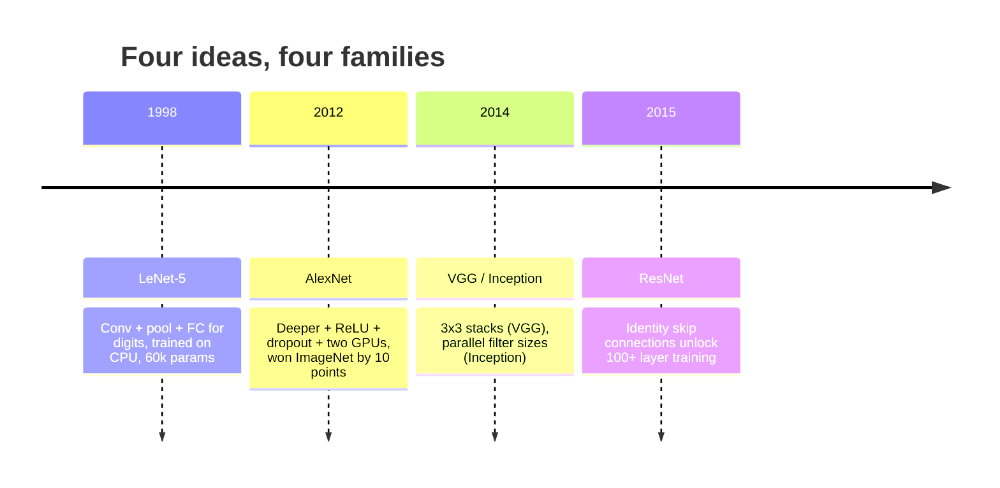
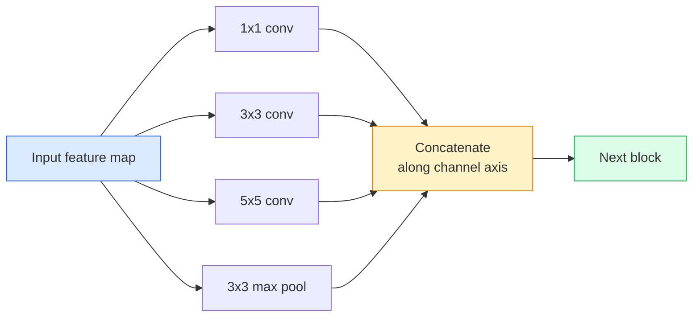
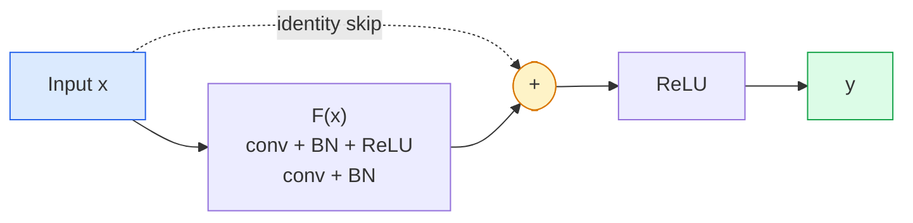

# CNN —— 从 LeNet 到 ResNet

> 过去三十年的每一款主要 CNN 都遵循相同的“卷积–非线性–下采样”配方，并加上一个新想法。按顺序理解这些想法。

**类型：** 学习 + 构建  
**语言：** Python  
**前置条件：** Phase 3 Lesson 11（PyTorch）、Phase 4 Lesson 01（图像基础）、Phase 4 Lesson 02（从头实现卷积）  
**时长：** ~75 分钟

## 学习目标

- 追溯 LeNet-5 → AlexNet → VGG → Inception → ResNet 的架构演进脉络，并说明每个系列贡献的单一新想法  
- 用 PyTorch 实现 LeNet-5、VGG 风格模块和 ResNet BasicBlock，每个不超过 40 行  
- 解释为什么残差连接能使 1000 层的网络从不可训练变为顶尖水平  
- 读懂现代骨干网络（ResNet-18、ResNet-50），在查看源码前预测其输出形状、感受野和参数量

## 问题

2011 年，最好的 ImageNet 分类器 top-5 准确率约为 74%。2012 年 AlexNet 达到 85%。2015 年 ResNet 达到 96%。没有新增数据，没有新 GPU 代际。这些提升来自架构设计思想。一名有实战经验的视觉工程师必须知道每个想法出自哪篇论文，因为你在 2026 年交付的每个生产级骨干网络都是对这些相同组件的重新组合——而且这些思想不断迁移：分组卷积从 CNN 传入 Transformer，残差连接从 ResNet 传入所有现有的大语言模型，批归一化存在于扩散模型中。

按顺序学习这些网络还能让你避免一个常见错误：当 LeNet 大小的网络就能解决问题时，却选择了最大的可用模型。MNIST 不需要 ResNet。了解每个系列的缩放曲线，你才能知道应该选择哪个规模。

## 概念

### 改变视觉领域的四个想法



在经典视觉领域，没有什么比这四个跃迁更重要。

### LeNet-5 (1998)

Yann LeCun 的数字识别器。6 万个参数。两个卷积-池化块、两个全连接层、tanh 激活函数。它定义了一个所有 CNN 都继承的模板：

```
input (1, 32, 32)
  conv 5x5 -> (6, 28, 28)
  avg pool 2x2 -> (6, 14, 14)
  conv 5x5 -> (16, 10, 10)
  avg pool 2x2 -> (16, 5, 5)
  flatten -> 400
  dense -> 120
  dense -> 84
  dense -> 10
```

现代世界所称的 CNN——交替进行卷积和下采样，最后接一个小型分类器头——无非就是 LeNet 加上更多层、更大通道数和更好的激活函数。

### AlexNet (2012)

三个变化共同突破了 ImageNet：

1. 用 **ReLU** 替代 tanh。梯度不再消失，训练速度提升六倍。
2. 在全连接头部使用 **Dropout**。正则化成为一个层，而非技巧。
3. **深度和宽度增加**。五个卷积层、三个全连接层，6000 万个参数，在两个 GPU 上训练并将模型拆分到两块 GPU 上。

论文中的图 2 仍以两条并行流展示了 GPU 拆分。这种并行性是应对硬件限制的折中方案，并非架构层面的洞见——但上述三个想法至今仍存在于你使用的每一个模型中。

### VGG (2014)

VGG 提出的问题是：如果我们只用 3×3 卷积并加深网络，会发生什么？

```
stack:   conv 3x3 -> conv 3x3 -> pool 2x2
repeat:  16 or 19 conv layers
```

两个 3×3 卷积能看到与一个 5×5 卷积相同的 5×5 输入区域，但参数更少（2*9*C² = 18C² vs 25*C²），并在中间多了一个 ReLU。VGG 将这个观察转化为了整个架构。这种简单性——一种模块类型、重复堆叠——使 VGG 成为后续所有工作的参考点。

代价：1.38 亿个参数，训练慢，推理成本高。

### Inception (2014，同年)

谷歌对“应该用多大的卷积核？”的回答是：全部使用，并行处理。



每个分支各司其职——1×1 用于通道混合，3×3 用于局部纹理，5×5 用于更大模式，池化用于平移不变特征——而连接操作让下一层可以选择任何有用的分支。Inception v1 在每个分支内部使用 1×1 卷积作为瓶颈层，以保持参数量合理。

### 退化问题

到 2015 年，VGG-19 可以工作，但 VGG-32 不行。深度本应有所帮助，但超过 ~20 层后，训练损失和测试损失都变得更差。这不是过拟合。而是优化器无法找到有效权重，因为梯度在每一层都乘法性地收缩。

```
Plain deep network:
  y = f_L( f_{L-1}( ... f_1(x) ... ) )

Gradient wrt early layer:
  dL/dW_1 = dL/dy * df_L/df_{L-1} * ... * df_2/df_1 * df_1/dW_1

Each multiplicative term has magnitude roughly (weight magnitude) * (activation gain).
Stack 100 of them with gains < 1 and the gradient is effectively zero.
```

VGG 能在 19 层工作，是因为批归一化（同期发表）保持了激活值的良好尺度。但即使有批归一化，也无法拯救超过 30 层左右的深度。

### ResNet (2015)

何恺明、张祥雨、任少卿、孙剑提出了一个改变一切的改动：

```
standard block:   y = F(x)
residual block:   y = F(x) + x
```

`+ x` 意味着该层总可以通过将 `F(x)` 驱动到零来选择什么都不做。一个 1000 层的 ResNet 现在最多与一个 1 层网络一样差，因为每个额外模块都有一个简单的逃生口。有了这个保证，优化器才愿意让每个模块“略微有用”——而“略微有用”叠加 100 次，就是最先进水平。



该模块的两种变体随处可见：

- **BasicBlock**（ResNet-18、ResNet-34）：两个 3×3 卷积，跳跃连接绕过两者。
- **Bottleneck**（ResNet-50、-101、-152）：1×1 降维、3×3 中间、1×1 升维，跳跃连接绕过三者。当通道数较高时，这种结构更节省计算。

当跳跃连接需要跨越下采样（stride=2）时，恒等路径会被替换为一个 1×1 stride=2 的卷积，以匹配形状。

### 为什么残差连接在视觉之外也很重要

这个想法实际上并不是关于图像分类。它是关于将深层网络从“祈祷梯度存活”转变为可靠、可扩展的工程工具。你在下一阶段将学习的每个 Transformer 在其每个模块中都有完全相同的跳跃连接。没有 ResNet，就没有 GPT。

## 动手构建

### 步骤 1：LeNet-5

一个最小且忠实的 LeNet。tanh 激活函数、平均池化。唯一向现代妥协的是我们在下游使用 `nn.CrossEntropyLoss` 而非原始的 Gaussian connections。

```python
import torch
import torch.nn as nn
import torch.nn.functional as F

class LeNet5(nn.Module):
    def __init__(self, num_classes=10):
        super().__init__()
        self.conv1 = nn.Conv2d(1, 6, kernel_size=5)
        self.conv2 = nn.Conv2d(6, 16, kernel_size=5)
        self.pool = nn.AvgPool2d(2)
        self.fc1 = nn.Linear(16 * 5 * 5, 120)
        self.fc2 = nn.Linear(120, 84)
        self.fc3 = nn.Linear(84, num_classes)

    def forward(self, x):
        x = self.pool(torch.tanh(self.conv1(x)))
        x = self.pool(torch.tanh(self.conv2(x)))
        x = torch.flatten(x, 1)
        x = torch.tanh(self.fc1(x))
        x = torch.tanh(self.fc2(x))
        return self.fc3(x)

net = LeNet5()
x = torch.randn(1, 1, 32, 32)
print(f"output: {net(x).shape}")
print(f"params: {sum(p.numel() for p in net.parameters()):,}")
```

预期输出：`output: torch.Size([1, 10])`, `params: 61,706`。这就是开启现代视觉的整个数字分类器。

### 步骤 2：一个 VGG 模块

一个可复用的模块：两个 3×3 卷积、ReLU、批归一化、最大池化。

```python
class VGGBlock(nn.Module):
    def __init__(self, in_c, out_c):
        super().__init__()
        self.conv1 = nn.Conv2d(in_c, out_c, kernel_size=3, padding=1)
        self.bn1 = nn.BatchNorm2d(out_c)
        self.conv2 = nn.Conv2d(out_c, out_c, kernel_size=3, padding=1)
        self.bn2 = nn.BatchNorm2d(out_c)
        self.pool = nn.MaxPool2d(2)

    def forward(self, x):
        x = F.relu(self.bn1(self.conv1(x)))
        x = F.relu(self.bn2(self.conv2(x)))
        return self.pool(x)

class MiniVGG(nn.Module):
    def __init__(self, num_classes=10):
        super().__init__()
        self.stack = nn.Sequential(
            VGGBlock(3, 32),
            VGGBlock(32, 64),
            VGGBlock(64, 128),
        )
        self.head = nn.Sequential(
            nn.AdaptiveAvgPool2d(1),
            nn.Flatten(),
            nn.Linear(128, num_classes),
        )

    def forward(self, x):
        return self.head(self.stack(x))

net = MiniVGG()
x = torch.randn(1, 3, 32, 32)
print(f"output: {net(x).shape}")
print(f"params: {sum(p.numel() for p in net.parameters()):,}")
```

在 CIFAR 大小的输入上使用三个 VGG 模块，一个自适应池化，一个全连接层。约 29 万个参数。对于 CIFAR-10 来说绰绰有余。

### 步骤 3：一个 ResNet BasicBlock

ResNet-18 和 ResNet-34 的核心构建模块。

```python
class BasicBlock(nn.Module):
    def __init__(self, in_c, out_c, stride=1):
        super().__init__()
        self.conv1 = nn.Conv2d(in_c, out_c, kernel_size=3, stride=stride, padding=1, bias=False)
        self.bn1 = nn.BatchNorm2d(out_c)
        self.conv2 = nn.Conv2d(out_c, out_c, kernel_size=3, stride=1, padding=1, bias=False)
        self.bn2 = nn.BatchNorm2d(out_c)
        if stride != 1 or in_c != out_c:
            self.shortcut = nn.Sequential(
                nn.Conv2d(in_c, out_c, kernel_size=1, stride=stride, bias=False),
                nn.BatchNorm2d(out_c),
            )
        else:
            self.shortcut = nn.Identity()

    def forward(self, x):
        out = F.relu(self.bn1(self.conv1(x)))
        out = self.bn2(self.conv2(out))
        out = out + self.shortcut(x)
        return F.relu(out)
```

卷积层上的 `bias=False` 是批归一化的惯例——BN 的 beta 参数已经处理了偏置，所以再携带卷积偏置是一种浪费。`shortcut` 只在步长或通道数变化时才需要真正的卷积；否则它就是一个 no-op 恒等映射。

### 步骤 4：一个微型 ResNet

堆叠四个 BasicBlock 组，得到一个可用于 CIFAR 大小输入的 ResNet。

```python
class TinyResNet(nn.Module):
    def __init__(self, num_classes=10):
        super().__init__()
        self.stem = nn.Sequential(
            nn.Conv2d(3, 32, kernel_size=3, stride=1, padding=1, bias=False),
            nn.BatchNorm2d(32),
            nn.ReLU(inplace=True),
        )
        self.layer1 = self._make_group(32, 32, num_blocks=2, stride=1)
        self.layer2 = self._make_group(32, 64, num_blocks=2, stride=2)
        self.layer3 = self._make_group(64, 128, num_blocks=2, stride=2)
        self.layer4 = self._make_group(128, 256, num_blocks=2, stride=2)
        self.head = nn.Sequential(
            nn.AdaptiveAvgPool2d(1),
            nn.Flatten(),
            nn.Linear(256, num_classes),
        )

    def _make_group(self, in_c, out_c, num_blocks, stride):
        blocks = [BasicBlock(in_c, out_c, stride=stride)]
        for _ in range(num_blocks - 1):
            blocks.append(BasicBlock(out_c, out_c, stride=1))
        return nn.Sequential(*blocks)

    def forward(self, x):
        x = self.stem(x)
        x = self.layer1(x)
        x = self.layer2(x)
        x = self.layer3(x)
        x = self.layer4(x)
        return self.head(x)

net = TinyResNet()
x = torch.randn(1, 3, 32, 32)
print(f"output: {net(x).shape}")
print(f"params: {sum(p.numel() for p in net.parameters()):,}")
```

四个组，每组两个模块。第 2、3、4 组的起始处 stride=2。每当下采样时，通道数翻倍。大约 280 万个参数。这是标准配方，可以干净地扩展到 ResNet-152。

### 步骤 5：比较参数与特征效率

将相同输入送入三个网络，比较参数数量。

```python
def summary(name, net, x):
    y = net(x)
    params = sum(p.numel() for p in net.parameters())
    print(f"{name:12s}  input {tuple(x.shape)} -> output {tuple(y.shape)}  params {params:>10,}")

x = torch.randn(1, 3, 32, 32)
summary("LeNet5",     LeNet5(),       torch.randn(1, 1, 32, 32))
summary("MiniVGG",    MiniVGG(),      x)
summary("TinyResNet", TinyResNet(),   x)
```

三个模型，三个时代，参数数量相差三个数量级。对于 CIFAR-10 准确率，你大约需要：LeNet 60%，MiniVGG 89%，TinyResNet 93%（经过少量 epoch 训练后）。

## 使用它

`torchvision.models` 提供了上述所有网络的预训练版本。不同系列之间的调用签名完全相同，这恰恰是骨干网络抽象的意义所在。

```python
from torchvision.models import resnet18, ResNet18_Weights, vgg16, VGG16_Weights

r18 = resnet18(weights=ResNet18_Weights.IMAGENET1K_V1)
r18.eval()

print(f"ResNet-18 params: {sum(p.numel() for p in r18.parameters()):,}")
print(r18.layer1[0])
print()

v16 = vgg16(weights=VGG16_Weights.IMAGENET1K_V1)
v16.eval()
print(f"VGG-16   params: {sum(p.numel() for p in v16.parameters()):,}")
```

ResNet-18 有 1170 万个参数。VGG-16 有 1.38 亿个。两者在 ImageNet 上的 top-1 准确率相近（69.8% vs 71.6%）。残差连接带来了 12 倍的参数效率优势。这就是为什么从 2016 年到 2021 年 ViT 出现之前，ResNet 变体一直占据主导——并且在计算资源受限的现实部署中仍然占据主导地位。

对于迁移学习，配方总是相同的：加载预训练模型，冻结骨干网络，替换分类器头部。

```python
for p in r18.parameters():
    p.requires_grad = False
r18.fc = nn.Linear(r18.fc.in_features, 10)
```

三行代码。你现在拥有了一个 10 类 CIFAR 分类器，它继承了 ImageNet 支付代价学到的表示。

## 投产使用

本节产出：

- `outputs/prompt-backbone-selector.md` —— 一个提示词，根据任务、数据集大小和计算预算，选择正确的 CNN 系列（LeNet/VGG/ResNet/MobileNet/ConvNeXt）。
- `outputs/skill-residual-block-reviewer.md` —— 一项技能，读取 PyTorch 模块并标记跳跃连接的错误（缺失 stride 变化时的 shortcut、shortcut 激活顺序、加法相对于 BN 的位置等）。

## 练习题

1. （简单）逐层手算 `TinyResNet` 的参数量。与 `sum(p.numel() for p in net.parameters())` 对比。大部分参数预算花在了哪里——卷积、BN 还是分类器头部？
2. （中等）实现 Bottleneck 模块（1×1 → 3×3 → 1×1 加跳跃连接），并用它构建一个适用于 CIFAR 的 ResNet-50 风格网络。与 `TinyResNet` 对比参数量。
3. （困难）移除 `BasicBlock` 中的跳跃连接，训练一个 34 模块的“平面”网络和一个 34 模块的 ResNet，各在 CIFAR-10 上训练 10 个 epoch。绘制两个网络的训练损失 vs. epoch 曲线。复现 He 等人论文中图 1 的结果：平面深层网络的收敛损失高于其较浅的兄弟网络。

## 关键术语

| 术语 | 人们常说的 | 实际含义 |
|------|-----------|---------|
| Backbone | “模型” | 生成特征图的卷积模块堆栈，该特征图被送入任务头部 |
| Residual connection | “跳跃连接” | `y = F(x) + x`；通过让优化器将 F 设为 0 来学习恒等映射，从而使任意深度可训练 |
| BasicBlock | “两个带跳跃的 3×3 卷积” | ResNet-18/34 构建模块：conv-BN-ReLU-conv-BN-add-ReLU |
| Bottleneck | “1×1 降维、3×3、1×1 升维” | ResNet-50/101/152 模块；在高通道数下计算成本低，因为 3×3 运行在缩减的宽度上 |
| Degradation problem | “越深越差” | 超过约 20 层普通卷积层后，训练误差和测试误差都会增加；由残差连接解决，而非更多数据 |
| Stem | “第一层” | 将 3 通道输入转换为基础特征宽度的初始卷积；ImageNet 通常为 7×7 stride 2，CIFAR 通常为 3×3 stride 1 |
| Head | “分类器” | 骨干网络最终模块后的层：自适应池化、展平、全连接层 |
| Transfer learning | “预训练权重” | 加载在 ImageNet 上训练的骨干网络，仅对头部进行微调以适应你的任务 |

## 扩展阅读

- [Deep Residual Learning for Image Recognition (He et al., 2015)](https://arxiv.org/abs/1512.03385) —— ResNet 论文；每一幅图都值得研究
- [Very Deep Convolutional Networks (Simonyan & Zisserman, 2014)](https://arxiv.org/abs/1409.1556) —— VGG 论文；仍然是“为什么用 3×3”的最佳参考
- [ImageNet Classification with Deep CNNs (Krizhevsky et al., 2012)](https://papers.nips.cc/paper_files/paper/2012/hash/c399862d3b9d6b76c8436e924a68c45b-Abstract.html) —— AlexNet；终结手工特征时代的论文
- [Going Deeper with Convolutions (Szegedy et al., 2014)](https://arxiv.org/abs/1409.4842) —— Inception v1；并行滤波器的思想至今仍出现在视觉 Transformer 中
