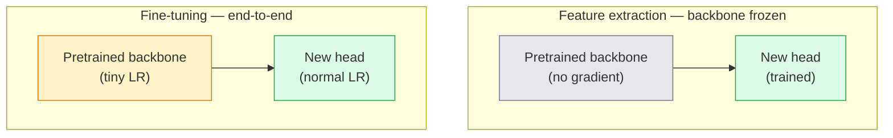

# 迁移学习 & 微调

> 别人花了百万 GPU 小时教会网络识别边缘、纹理和物体部件长什么样。在训练你自己的网络之前，请先借用这些特征。

**类型：** 构建  
**语言：** Python  
**先修知识：** 第四阶段第03课（CNN）、第四阶段第04课（图像分类）  
**时间：** 约75分钟

## 学习目标

- 区分特征提取与微调，并根据数据集大小、领域距离和计算预算选择正确的方法
- 加载预训练主干，替换其分类头，并在不到20行代码中仅训练分类头，获得一个可工作的基线
- 使用区别化学习率逐步解冻层，使早期通用特征获得比后期任务特定特征更小的更新
- 诊断三种常见失败情况：因解冻块上学习率过高导致的特征漂移、小数据集上的批量归一化统计量崩溃，以及灾难性遗忘

## 问题

在 ImageNet 上训练 ResNet-50 大约需要 2000 GPU 小时。很少有团队能为他们交付的每个任务预算这么多。实际上，几乎所有团队交付的都是一个预训练的主干，再加上一个在几百或几千张任务特定图像上训练的新分类头。

这并不是偷懒。任何在 ImageNet 上训练过的 CNN 的第一个卷积块学习的是边缘和类 Gabor 滤波器。接下来的几个块学习纹理和简单模式。中间块学习物体部件。最后几个块学习组合，开始看起来像 ImageNet 的 1000 个类别。这个层次结构的前 90% 几乎原封不动地迁移到医学影像、工业检测、卫星图像和几乎所有其他视觉任务——因为自然界的边缘和纹理词汇是有限的。最后 10% 才是你真正要训练的部分。

正确进行迁移学习有三个潜在的隐患：学习率过高破坏预训练特征、冻结过多导致模型信息匮乏、让 BatchNorm 的运行统计量漂移到小数据集上而后面的网络从未学习过该数据集。本课将逐一剖析这些问题。

## 概念

### 特征提取 vs 微调

两种方式，根据你对预训练特征的信任程度和你拥有的数据量来选择。



经验法则：

| 数据集大小 | 领域距离 | 策略 |
|------------|----------|------|
| < 1000 张 | 接近 ImageNet | 冻结主干，只训练分类头 |
| 1000-10000 张 | 接近 | 冻结前 2-3 个阶段，微调剩余部分 |
| 10000-100000 张 | 任意 | 端到端微调，使用区别化学习率 |
| 100000+ 张 | 远 | 微调所有层；如果领域足够远，考虑从头训练 |

"接近 ImageNet" 大致指含有类似物体的自然 RGB 图像。医学 CT 扫描、卫星遥感图像和显微图像属于远领域——预训练特征仍然有用，但你需要让更多层去适应。

### 为什么冻结有效

CNN 学习的 ImageNet 特征并非专门针对那 1000 个类别。它们专攻自然图像的统计特性：特定方向的边缘、纹理、对比度模式、形状基元。这些统计特性在人类能列举的几乎所有视觉领域都是稳定的。这就是为什么一个在 ImageNet 上训练的模型，在 CIFAR-10 上零样本评估（仅用一个新的线性分类头，不对主干进行微调）就能达到 80%+ 的准确率。分类头在学习的只是如何加权这些已经学习到的特征来完成当前任务。

### 区别化学习率

当你解冻层时，早期层应该比后期层训练得更慢。早期层编码的是通用特征，你需要保留；后期层编码的是任务特定结构，需要大幅调整。

```
Typical recipe:

  stage 0 (stem + first group): lr = base_lr / 100    (mostly fixed)
  stage 1:                       lr = base_lr / 10
  stage 2:                       lr = base_lr / 3
  stage 3 (last backbone group): lr = base_lr
  head:                          lr = base_lr  (or slightly higher)
```

在 PyTorch 中，这只是一个传给优化器的参数组列表。一个模型，五个学习率，零额外代码。

### BatchNorm 问题

BN 层持有在 ImageNet 上计算出的 `running_mean` 和 `running_var` 缓冲区。如果你的任务具有不同的像素分布——不同的光照、不同的传感器、不同的色彩空间——这些缓冲区就是错的。三种方案，按推荐顺序排列：

1. **将 BN 置于训练模式进行微调。** 让 BN 随其他参数一起更新其运行统计量。当任务数据集中等大小（≥ 5000 个样本）时的默认选择。
2. **将 BN 冻结为评估模式。** 保留 ImageNet 统计量，仅训练权重。当数据集很小、BN 的移动平均可能噪声过大时适用。
3. **用 GroupNorm 替换 BN。** 彻底消除移动平均问题。用于每个 GPU 批量大小很小的检测和分割主干。

忽略这个问题会默默导致准确率下降 5-15%。

### 分类头设计

分类头是 1-3 个线性层加上可选的 Dropout。每个 torchvision 主干都附带一个默认的分类头，你需要替换它：

```
backbone.fc = nn.Linear(backbone.fc.in_features, num_classes)          # ResNet
backbone.classifier[1] = nn.Linear(..., num_classes)                    # EfficientNet, MobileNet
backbone.heads.head = nn.Linear(..., num_classes)                       # torchvision ViT
```

对于小数据集，单个线性层通常就足够了。添加隐藏层（Linear -> ReLU -> Dropout -> Linear）有助于任务分布与主干训练分布差距较大的情况。

### 逐层学习率衰减

现代微调（BEiT、DINOv2、ViT-B 微调）中使用的一种更平滑的区别化学习率版本。不是将层分组为阶段，而是让每一层的学习率略小于其上一层：

```
lr_layer_k = base_lr * decay^(L - k)
```

如果 decay = 0.75，L = 12 个 transformer 块，那么第一个块的学习率是分类头的 `0.75^11 ≈ 0.04` 倍。在 transformer 微调中比在 CNN 中更常用，CNN 通常按阶段分组学习率就够了。

### 要评估什么

迁移学习实验需要跟踪两个数值，这在从头训练时通常不会关注：

- **仅预训练准确率** — 主干冻结时分类头的准确率。这是你的下限。
- **微调后准确率** — 端到端训练后同一模型的准确率。这是你的上限。

如果微调后准确率低于仅预训练准确率，那么存在学习率或 BN 的 bug。务必将两者都输出。

## 构建它

### 第1步：加载预训练主干并检查

```python
import torch
import torch.nn as nn
from torchvision.models import resnet18, ResNet18_Weights

backbone = resnet18(weights=ResNet18_Weights.IMAGENET1K_V1)
print(backbone)
print()
print("classifier head:", backbone.fc)
print("feature dim:", backbone.fc.in_features)
```

`ResNet18` 有四个阶段（`layer1..layer4`），加上一个主干和 `fc` 分类头。每个 torchvision 分类主干都有类似的结构。

### 第2步：特征提取——冻结所有层，替换分类头

```python
def make_feature_extractor(num_classes=10):
    model = resnet18(weights=ResNet18_Weights.IMAGENET1K_V1)
    for p in model.parameters():
        p.requires_grad = False
    model.fc = nn.Linear(model.fc.in_features, num_classes)
    return model

model = make_feature_extractor(num_classes=10)
trainable = sum(p.numel() for p in model.parameters() if p.requires_grad)
frozen = sum(p.numel() for p in model.parameters() if not p.requires_grad)
print(f"trainable: {trainable:>10,}")
print(f"frozen:    {frozen:>10,}")
```

只有 `model.fc` 是可训练的。主干是一个冻结的特征提取器。

### 第3步：区别化微调

一个构建参数组的工具，为每个阶段分配不同的学习率。

```python
def discriminative_param_groups(model, base_lr=1e-3, decay=0.3):
    stages = [
        ["conv1", "bn1"],
        ["layer1"],
        ["layer2"],
        ["layer3"],
        ["layer4"],
        ["fc"],
    ]
    groups = []
    for i, names in enumerate(stages):
        lr = base_lr * (decay ** (len(stages) - 1 - i))
        params = [p for n, p in model.named_parameters()
                  if any(n.startswith(k) for k in names)]
        if params:
            groups.append({"params": params, "lr": lr, "name": "_".join(names)})
    return groups

model = resnet18(weights=ResNet18_Weights.IMAGENET1K_V1)
model.fc = nn.Linear(model.fc.in_features, 10)
for p in model.parameters():
    p.requires_grad = True

groups = discriminative_param_groups(model)
for g in groups:
    print(f"{g['name']:>10s}  lr={g['lr']:.2e}  params={sum(p.numel() for p in g['params']):>8,}")
```

`decay=0.3` 意味着每个阶段的学习率是下一个阶段的 30%。`fc` 使用 `base_lr`，`layer4` 使用 `0.3 * base_lr`，`conv1` 使用 `0.3^5 * base_lr ≈ 0.00243 * base_lr`。看起来极端，但实验证实有效。

### 第4步：BatchNorm 处理

辅助函数，用于冻结 BN 的运行统计量而不冻结其权重。

```python
def freeze_bn_stats(model):
    for m in model.modules():
        if isinstance(m, (nn.BatchNorm1d, nn.BatchNorm2d, nn.BatchNorm3d)):
            m.eval()
            for p in m.parameters():
                p.requires_grad = False
    return model
```

在每轮训练开始时设置 `model.train()` 后调用它。`model.train()` 将所有层切换为训练模式；此函数仅对 BN 层反转该设置。

### 第5步：极简的端到端微调循环

```python
from torch.optim import SGD
from torch.utils.data import DataLoader
from torch.optim.lr_scheduler import CosineAnnealingLR
import torch.nn.functional as F

def fine_tune(model, train_loader, val_loader, device, epochs=5, base_lr=1e-3, freeze_bn=False):
    model = model.to(device)
    groups = discriminative_param_groups(model, base_lr=base_lr)
    optimizer = SGD(groups, momentum=0.9, weight_decay=1e-4, nesterov=True)
    scheduler = CosineAnnealingLR(optimizer, T_max=epochs)

    for epoch in range(epochs):
        model.train()
        if freeze_bn:
            freeze_bn_stats(model)
        tr_loss, tr_correct, tr_total = 0.0, 0, 0
        for x, y in train_loader:
            x, y = x.to(device), y.to(device)
            logits = model(x)
            loss = F.cross_entropy(logits, y, label_smoothing=0.1)
            optimizer.zero_grad()
            loss.backward()
            optimizer.step()
            tr_loss += loss.item() * x.size(0)
            tr_total += x.size(0)
            tr_correct += (logits.argmax(-1) == y).sum().item()
        scheduler.step()

        model.eval()
        va_total, va_correct = 0, 0
        with torch.no_grad():
            for x, y in val_loader:
                x, y = x.to(device), y.to(device)
                pred = model(x).argmax(-1)
                va_total += x.size(0)
                va_correct += (pred == y).sum().item()
        print(f"epoch {epoch}  train {tr_loss/tr_total:.3f}/{tr_correct/tr_total:.3f}  "
              f"val {va_correct/va_total:.3f}")
    return model
```

使用上述方法在 CIFAR-10 上训练五个 epoch，`ResNet18-IMAGENET1K_V1` 从零样本线性探测准确率约 70% 提升到微调后约 93%。而仅训练分类头（不动主干）会稳定在约 86%。

### 第6步：逐步解冻

一种调度策略，每轮训练从末尾向开头解冻一个阶段。可以缓解特征漂移，但需要额外几个 epoch。

```python
def progressive_unfreeze_schedule(model):
    stages = ["layer4", "layer3", "layer2", "layer1"]
    yielded = set()

    def start():
        for p in model.parameters():
            p.requires_grad = False
        for p in model.fc.parameters():
            p.requires_grad = True

    def unfreeze(epoch):
        if epoch < len(stages):
            name = stages[epoch]
            yielded.add(name)
            for n, p in model.named_parameters():
                if n.startswith(name):
                    p.requires_grad = True
            return name
        return None

    return start, unfreeze
```

在第一轮训练之前调用 `start()`。在每轮训练开始时调用 `unfreeze(epoch)`。每当可训练参数集合发生变化时，需要重建优化器，否则冻结的参数仍然持有旧的缓存状态，导致混淆。

## 使用它

对于大多数实际任务，`torchvision.models` 加上三行代码就足够了。上述更复杂的机制在你遇到库默认值无法解决的问题时才会用到。

```python
from torchvision.models import resnet50, ResNet50_Weights

model = resnet50(weights=ResNet50_Weights.IMAGENET1K_V2)
model.fc = nn.Linear(model.fc.in_features, num_classes)
optimizer = torch.optim.AdamW(model.parameters(), lr=1e-4, weight_decay=1e-4)
```

另外两个生产级默认选择：

- `timm` 提供了约 800 个预训练视觉主干，并具有一致的 API（`timm.create_model("resnet50", pretrained=True, num_classes=10)`）。对于 torchvision 动物园之外的任何微调任务，这已是标准。
- 对于 Transformer，`transformers.AutoModelForImageClassification.from_pretrained(name, num_labels=N)` 提供了 ViT / BEiT / DeiT，其加载语义与文本模型相同。

## 交付

本课产出：

- `outputs/prompt-fine-tune-planner.md` — 一个提示，根据数据集大小、领域距离和计算预算，选择特征提取、逐步微调或端到端微调。
- `outputs/skill-freeze-inspector.md` — 一个技能，给定 PyTorch 模型，报告哪些参数可训练、哪些 BatchNorm 层处于评估模式、以及优化器是否真的接收了可训练参数。

## 练习

1. **(简单)** 对同一个合成 CIFAR 数据集，分别训练一个线性探测（主干冻结）和一个完全微调的 `ResNet18`。并排报告两者的准确率。解释哪个差距说明特征迁移良好，哪个说明特征迁移不好。
2. **(中等)** 故意引入一个 bug：将主干阶段的学习率设为 `base_lr = 1e-1` 而不是分类头那样。展示训练损失如何爆炸，然后通过应用 `discriminative_param_groups` 辅助函数进行恢复。记录每个阶段开始发散时的学习率。
3. **(困难)** 选择一个医学影像数据集（如 CheXpert-small、PatchCamelyon 或 HAM10000），比较三种方式：(a) ImageNet 预训练冻结主干 + 线性分类头；(b) ImageNet 预训练端到端微调；(c) 从头训练。报告每种方式的准确率和计算成本。当数据集多大时，从头训练变得有竞争力？

## 关键术语

| 术语 | 大家说的 | 实际含义 |
|------|---------|----------|
| 特征提取 | "冻结并训练分类头" | 主干参数冻结，只有新的分类头接收梯度 |
| 微调 | "重新端到端训练" | 所有参数都可训练，通常学习率比从头训练小得多 |
| 区别化学习率 | "早期层使用更小的学习率" | 优化器参数组中，早期阶段的学习率是后期阶段的一个分数 |
| 逐层学习率衰减 | "平滑的学习率梯度" | 每层学习率乘以 decay^(L - k)；常见于 Transformer 微调 |
| 灾难性遗忘 | "模型丢失了 ImageNet 知识" | 学习率过高，在新任务信号学习之前就覆盖了预训练特征 |
| BN 统计量漂移 | "运行均值错误" | BatchNorm 的 running_mean/var 是在不同于当前任务的分布上计算的，悄无声息地损害准确率 |
| 线性探测 | "冻结主干 + 线性分类头" | 预训练特征评估——在冻结表示之上最佳线性分类器的准确率 |
| 灾难性崩溃 | "所有预测都指向一个类别" | 当微调学习率过高，在分类头梯度可以稳定之前就破坏了特征时发生 |

## 进一步阅读

- [How transferable are features in deep neural networks? (Yosinski et al., 2014)](https://arxiv.org/abs/1411.1792) — 量化层间特征可迁移性的论文
- [Universal Language Model Fine-tuning (ULMFiT, Howard & Ruder, 2018)](https://arxiv.org/abs/1801.06146) — 原始的区别化学习率 / 逐步解冻方案；其思想直接迁移到视觉领域
- [timm documentation](https://huggingface.co/docs/timm) — 现代视觉主干的参考，以及它们训练时使用的准确微调默认值
- [A Simple Framework for Linear-Probe Evaluation (Kornblith et al., 2019)](https://arxiv.org/abs/1805.08974) — 为什么线性探测准确率重要以及如何正确报告它
