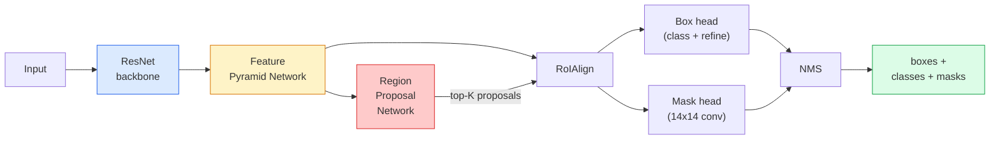

# 实例分割 — Mask R-CNN

> 给 Faster R-CNN 检测器添加一个微小的掩码分支，你就得到了实例分割。难点在于 RoIAlign，它比看起来要复杂得多。

**类型：** 构建 + 学习  
**语言：** Python  
**先修知识：** 阶段4 第06课（YOLO），阶段4 第07课（U-Net）  
**时间：** ~75分钟  

## 学习目标

- 端到端地追溯 Mask R-CNN 架构：骨干网络、FPN、RPN、RoIAlign、边界框头部、掩码头部  
- 从零实现 RoIAlign，并解释为何 RoIPool 已不再使用  
- 使用 torchvision 的 `maskrcnn_resnet50_fpn_v2` 预训练模型获得生产级别的实例掩码，并正确解读其输出格式  
- 通过替换边界框头部和掩码头部，冻结骨干网络，在小型自定义数据集上微调 Mask R-CNN  

## 问题

语义分割为每个类别提供一个掩码。实例分割为每个对象提供一个掩码，即使两个对象属于同一类别。计数个体、跟踪帧间对象、测量物体（例如墙上每块砖的边界框、显微镜图像中每个细胞的边界框）都需要实例分割。

Mask R-CNN（He 等人，2017）通过将实例分割重新定义为“检测加掩码”解决了这个问题。其设计如此简洁，以至于在接下来的五年里，几乎每篇实例分割论文都是 Mask R-CNN 的变体，而 torchvision 的实现至今仍是中小型数据集的生产默认选择。

其中困难的工程问题在于采样：如何从一个角点不与像素边界对齐的提议框中裁剪出固定大小的特征区域？如果处理不当，会在所有地方损失十分之几的 mAP 点。RoIAlign 就是答案。

## 概念

### 架构



需要理解五个部分：

1. **骨干网络** — 在 ImageNet 上训练的 ResNet-50 或 ResNet-101。生成步长分别为 4、8、16、32 的层级特征图。
2. **FPN（特征金字塔网络）** — 自上而下加横向连接，使每一层都获得 C 个通道的语义丰富特征。检测根据对象大小匹配相应的 FPN 层级进行查询。
3. **RPN（区域提议网络）** — 一个小型卷积头部，在每个锚点位置预测“这里是否有目标？”以及“如何优化边界框？”。每张图像生成约1000个提议框。
4. **RoIAlign** — 从任意边界框所在的 FPN 层级采样固定大小（例如 7×7）的特征块。采用双线性采样，无量化操作。
5. **头部** — 两层边界框头部，用于优化边界框并选择类别；外加一个小型卷积头部，为每个提议框输出一个 `28×28` 的二进制掩码。

### 为什么用 RoIAlign 而不是 RoIPool

最初的 Fast R-CNN 使用 RoIPool，它将提议框划分为网格，在每个单元格中取最大特征值，并将所有坐标四舍五入为整数。这种取整操作会导致特征图与输入像素坐标最多偏差一个完整的特征图像素——在 224×224 图像上影响较小，但当特征图步长为 32 时，后果是灾难性的。

```
RoIPool:
  box (34.7, 51.3, 98.2, 142.9)
  round -> (34, 51, 98, 142)
  split grid -> round each cell boundary
  misalignment accumulates at every step

RoIAlign:
  box (34.7, 51.3, 98.2, 142.9)
  sample at exact float coordinates using bilinear interpolation
  no rounding anywhere
```

RoIAlign 在 COCO 上免费提升了 3-4 个点的掩码 AP。所有关心定位的检测器现在都使用它——YOLOv7 seg、RT-DETR、Mask2Former 等。

### 一句话总结 RPN

在特征图的每个位置放置 K 个不同尺寸和形状的锚框。为每个锚框预测一个目标性分数，以及一个回归偏移量，用于将锚框调整为更贴合目标的边界框。保留分数最高的前约 1000 个框，应用 IoU 阈值 0.7 的非极大值抑制（NMS），将幸存者交给头部。RPN 使用自己的小损失进行训练——与第 6 课的 YOLO 损失结构相同，只是有两个类别（有目标 / 无目标）。

### 掩码头部

对于每个提议框（经过 RoIAlign 后），掩码头部是一个小的全卷积网络（FCN）：四个 3×3 卷积、一个 2× 转置卷积、最后一个 1×1 卷积，输出 `num_classes` 个通道，分辨率为 `28×28`。仅保留对应于预测类别的通道，其余被忽略。这样将掩码预测与分类解耦。

将 28×28 的掩码上采样到提议框的原始像素尺寸，得到最终的二进制掩码。

### 损失

Mask R-CNN 共有四个损失相加：

```
L = L_rpn_cls + L_rpn_box + L_box_cls + L_box_reg + L_mask
```

- `L_rpn_cls`、`L_rpn_box` — RPN 提议框的目标性分类和边界框回归损失。
- `L_box_cls` — 头部分类器在 (C+1) 个类别（包括背景）上的交叉熵损失。
- `L_box_reg` — 头部边界框优化的 smooth L1 损失。
- `L_mask` — 28×28 掩码输出的逐像素二元交叉熵损失。

每个损失都有其默认权重；torchvision 的实现允许通过构造函数参数设置。

### 输出格式

`torchvision.models.detection.maskrcnn_resnet50_fpn_v2` 返回一个字典列表，每张图像一个：

```
{
    "boxes":  (N, 4) in (x1, y1, x2, y2) pixel coordinates,
    "labels": (N,) class IDs, 0 = background so indices are 1-based,
    "scores": (N,) confidence scores,
    "masks":  (N, 1, H, W) float masks in [0, 1] — threshold at 0.5 for binary,
}
```

掩码已经是全图像分辨率。28×28 的头部输出已在内部进行上采样。

## 动手构建

### 步骤 1：从零实现 RoIAlign

这是 Mask R-CNN 中唯一一个用代码比用文字更容易理解的部分。

```python
import torch
import torch.nn.functional as F

def roi_align_single(feature, box, output_size=7, spatial_scale=1 / 16.0):
    """
    feature: (C, H, W) single-image feature map
    box: (x1, y1, x2, y2) in original image pixel coordinates
    output_size: side of the output grid (7 for box head, 14 for mask head)
    spatial_scale: reciprocal of the feature map stride
    """
    C, H, W = feature.shape
    x1, y1, x2, y2 = [c * spatial_scale - 0.5 for c in box]
    bin_w = (x2 - x1) / output_size
    bin_h = (y2 - y1) / output_size

    grid_y = torch.linspace(y1 + bin_h / 2, y2 - bin_h / 2, output_size)
    grid_x = torch.linspace(x1 + bin_w / 2, x2 - bin_w / 2, output_size)
    yy, xx = torch.meshgrid(grid_y, grid_x, indexing="ij")

    gx = 2 * (xx + 0.5) / W - 1
    gy = 2 * (yy + 0.5) / H - 1
    grid = torch.stack([gx, gy], dim=-1).unsqueeze(0)
    sampled = F.grid_sample(feature.unsqueeze(0), grid, mode="bilinear",
                            align_corners=False)
    return sampled.squeeze(0)
```

每个数值都位于双线性采样得到的位置上。没有取整，没有量化，没有梯度丢失。

### 步骤 2：与 torchvision 的 RoIAlign 进行比较

```python
from torchvision.ops import roi_align

feature = torch.randn(1, 16, 50, 50)
boxes = torch.tensor([[0, 10, 20, 100, 90]], dtype=torch.float32)  # (batch_idx, x1, y1, x2, y2)

ours = roi_align_single(feature[0], boxes[0, 1:].tolist(), output_size=7, spatial_scale=1/4)
theirs = roi_align(feature, boxes, output_size=(7, 7), spatial_scale=1/4, sampling_ratio=1, aligned=True)[0]

print(f"shape ours:   {tuple(ours.shape)}")
print(f"shape theirs: {tuple(theirs.shape)}")
print(f"max|diff|:    {(ours - theirs).abs().max().item():.3e}")
```

当 `sampling_ratio=1` 且 `aligned=True` 时，两者差异在 `1e-5` 以内。

### 步骤 3：加载预训练的 Mask R-CNN

```python
import torch
from torchvision.models.detection import maskrcnn_resnet50_fpn_v2, MaskRCNN_ResNet50_FPN_V2_Weights

model = maskrcnn_resnet50_fpn_v2(weights=MaskRCNN_ResNet50_FPN_V2_Weights.DEFAULT)
model.eval()
print(f"params: {sum(p.numel() for p in model.parameters()):,}")
print(f"classes (including background): {len(model.roi_heads.box_predictor.cls_score.out_features * [0])}")
```

4600 万参数，91 个类别（COCO）。第一个类别（id 0）是背景；模型实际检测到的所有类别从 id 1 开始。

### 步骤 4：执行推理

```python
with torch.no_grad():
    x = torch.randn(3, 400, 600)
    predictions = model([x])
p = predictions[0]
print(f"boxes:  {tuple(p['boxes'].shape)}")
print(f"labels: {tuple(p['labels'].shape)}")
print(f"scores: {tuple(p['scores'].shape)}")
print(f"masks:  {tuple(p['masks'].shape)}")
```

掩码张量的形状为 `(N, 1, H, W)`。以 0.5 为阈值得到每个对象的二进制掩码：

```python
binary_masks = (p['masks'] > 0.5).squeeze(1)  # (N, H, W) boolean
```

### 步骤 5：为自定义类别数量替换头部

常见的微调方案：复用骨干网络、FPN 和 RPN；替换两个分类头部。

```python
from torchvision.models.detection.faster_rcnn import FastRCNNPredictor
from torchvision.models.detection.mask_rcnn import MaskRCNNPredictor

def build_custom_maskrcnn(num_classes):
    model = maskrcnn_resnet50_fpn_v2(weights=MaskRCNN_ResNet50_FPN_V2_Weights.DEFAULT)
    in_features = model.roi_heads.box_predictor.cls_score.in_features
    model.roi_heads.box_predictor = FastRCNNPredictor(in_features, num_classes)
    in_features_mask = model.roi_heads.mask_predictor.conv5_mask.in_channels
    hidden_layer = 256
    model.roi_heads.mask_predictor = MaskRCNNPredictor(in_features_mask, hidden_layer, num_classes)
    return model

custom = build_custom_maskrcnn(num_classes=5)
print(f"custom cls_score.out_features: {custom.roi_heads.box_predictor.cls_score.out_features}")
```

`num_classes` 必须包含背景类别，因此有 4 个对象类别的数据集使用 `num_classes=5`。

### 步骤 6：冻结不需要训练的部分

在小型数据集上，冻结骨干网络和 FPN。只有 RPN 的目标性分类 + 回归以及两个头部进行学习。

```python
def freeze_backbone_and_fpn(model):
    # torchvision Mask R-CNN packs the FPN inside `model.backbone` (as
    # `model.backbone.fpn`), so iterating `model.backbone.parameters()` covers
    # both the ResNet feature layers and the FPN lateral/output convs.
    for p in model.backbone.parameters():
        p.requires_grad = False
    return model

custom = freeze_backbone_and_fpn(custom)
trainable = sum(p.numel() for p in custom.parameters() if p.requires_grad)
print(f"trainable after freeze: {trainable:,}")
```

在 500 张图像的数据集上，这是收敛与过拟合之间的分水岭。

## 使用

torchvision 中 Mask R-CNN 的完整训练循环大约 40 行，不同任务之间没有实质性变化——只需更换数据集即可运行。

```python
def train_step(model, images, targets, optimizer):
    model.train()
    loss_dict = model(images, targets)
    losses = sum(loss for loss in loss_dict.values())
    optimizer.zero_grad()
    losses.backward()
    optimizer.step()
    return {k: v.item() for k, v in loss_dict.items()}
```

`targets` 列表必须包含每个图像的字典，包含 `boxes`、`labels` 和 `masks`（作为 `(num_instances, H, W)` 的二进制张量）。训练时模型返回一个包含四个损失的字典，评估时返回预测列表，具体取决于 `model.training`。

`pycocotools` 评估器可以计算边界框和掩码的 mAP@IoU=0.5:0.95；你需要两个数值来判断是边界框头部还是掩码头部成为瓶颈。

## 交付

本课程产出：

- `outputs/prompt-instance-vs-semantic-router.md` — 一个提示词，用于提出三个问题，并选择实例分割 vs 语义分割 vs 全景分割以及具体起始模型。
- `outputs/skill-mask-rcnn-head-swapper.md` — 一个技能，用于生成 10 行代码，以便在给定新的 `num_classes` 时，为任何 torchvision 检测模型替换头部。

## 练习

1. **（简单）** 在 100 个随机边界框上，将你的 RoIAlign 实现与 `torchvision.ops.roi_align` 进行对比。报告最大绝对差异。同时运行 RoIPool（2017 年之前的行为），并展示其在靠近边界的边界框上与 RoIAlign 相差约 1-2 个特征图像素。
2. **（中等）** 在 50 张图像的自定义数据集（任意两个类别：气球、鱼、路坑、标志）上微调 `maskrcnn_resnet50_fpn_v2`。冻结骨干网络，训练 20 个 epoch，报告掩码 AP@0.5。
3. **（困难）** 将 Mask R-CNN 的掩码头部替换为输出 56×56 而非 28×28 的版本。测量改进前后的 mAP@IoU=0.75。解释为何增益（或没有增益）符合预期的边界精度与内存之间的权衡。

## 关键术语

| 术语 | 人们常说的 | 实际含义 |
|------|------------|----------|
| Mask R-CNN | “检测加掩码” | Faster R-CNN 加上一个小型 FCN 头部，为每个提议框和每个类别预测一个 28×28 的掩码 |
| FPN | “特征金字塔” | 自上而下加横向连接，使每个步长层级都获得 C 个通道的语义丰富特征 |
| RPN | “区域提议器” | 一个小型卷积头部，每张图像产生约 1000 个有目标/无目标的提议框 |
| RoIAlign | “无取整裁剪” | 从任意浮点坐标的边界框中双线性采样固定大小的特征网格 |
| RoIPool | “2017 年之前的裁剪” | 与 RoIAlign 目的相同，但会取整边界框坐标；已过时 |
| 掩码 AP | “实例 mAP” | 使用掩码 IoU 而非边界框 IoU 计算的平均精度；COCO 实例分割的度量标准 |
| 二进制掩码头部 | “逐类掩码” | 为每个提议框预测每个类别的一个二进制掩码；仅保留预测类别的通道 |
| 背景类别 | “类别 0” | 用于捕获所有“无目标”情况的类别；真实类别的索引从 1 开始 |

## 扩展阅读

- [Mask R-CNN（He 等人，2017）](https://arxiv.org/abs/1703.06870) — 原论文；第 3 节关于 RoIAlign 是必读内容
- [FPN：特征金字塔网络（Lin 等人，2017）](https://arxiv.org/abs/1612.03144) — FPN 论文；所有现代检测器都使用它
- [torchvision Mask R-CNN 教程](https://pytorch.org/tutorials/intermediate/torchvision_tutorial.html) — 微调循环的参考实现
- [Detectron2 模型动物园](https://github.com/facebookresearch/detectron2/blob/main/MODEL_ZOO.md) — 生产级实现，包含几乎所有检测和分割变体的预训练权重
