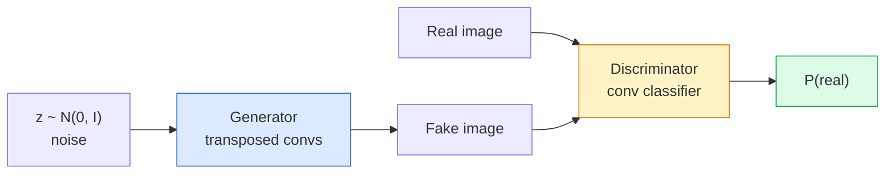
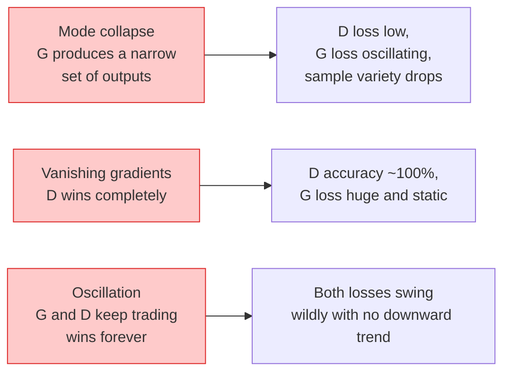

# 图像生成——生成对抗网络（GAN）

> GAN 由两个神经网络在一个固定博弈中组成。一个绘制，一个评判。它们共同进步，直到绘制的图像能够欺骗评判者。

**类型：** 动手构建  
**语言：** Python  
**前置知识：** 第 4 阶段第 03 课（CNN）、第 3 阶段第 06 课（优化器）、第 3 阶段第 07 课（正则化）  
**时间：** 约 75 分钟

## 学习目标

- 解释生成器与判别器之间的极小极大博弈，以及为什么均衡对应着 `p_model = p_data`
- 在 PyTorch 中实现一个 DCGAN，并使其在 60 行以内生成连贯的 32x32 合成图像
- 使用三种标准技巧稳定 GAN 训练：非饱和损失、谱归一化、TTUR（双时间尺度更新规则）
- 阅读训练曲线，区分健康收敛与模式坍塌、振荡、判别器完全获胜等情况

## 问题

分类任务教会网络将图像映射到标签。生成则是逆转问题：采样出看起来与同一分布相似的新图像。这里没有可以计算差值的“正确”输出，只有一个你想要模仿的分布。

标准的损失函数（MSE、交叉熵）无法衡量“这个样本是否来自真实分布”。最小化逐像素误差会产生模糊的平均图像，而非逼真样本。突破在于学习损失本身：训练第二个网络，其任务是区分真实与伪造图像，并用它的判断来推动生成器。

GAN（Goodfellow 等人，2014）定义了这一框架。到 2018 年，StyleGAN 已经能够生成 1024x1024 的面部图像，与照片难以区分。扩散模型此后在质量和可控性上取代了其地位，但使扩散变得实用的每一个技巧——归一化选择、潜空间、特征损失——最初都是在 GAN 上被理解的。

## 概念

### 两个网络



**生成器** G 接收噪声向量 `z` 并输出一幅图像。**判别器** D 接收一幅图像并输出一个标量：该图像是真实图像的概率。

### 博弈

G 希望 D 出错。D 希望自己正确。形式上：

```
min_G max_D  E_x[log D(x)] + E_z[log(1 - D(G(z)))]
```

从右往左读：D 在真实图像上最大化 `log D(real)`，在伪造图像上最大化 `log (1 - D(fake))`，从而提高准确率。G 在最小化 D 对伪造图像的准确率——它希望 `D(G(z))` 数值高。

Goodfellow 证明了该极小极大问题存在一个全局均衡，此时 `p_G = p_data`，D 在所有地方输出 0.5，生成分布与真实分布之间的 JS 散度为零。困难在于如何达到这个均衡。

### 非饱和损失

上述形式在数值上不稳定。在训练早期，`D(G(z))` 对每个伪造图像都接近零，因此 `log(1 - D(G(z)))` 相对于 G 的梯度消失。解决方法：翻转 G 的损失。

```
L_D = -E_x[log D(x)] - E_z[log(1 - D(G(z)))]
L_G = -E_z[log D(G(z))]                          # non-saturating
```

现在当 `D(G(z))` 接近零时，G 的损失很大，其梯度也富有信息。所有现代 GAN 都使用这种变体进行训练。

### DCGAN 架构规则

Radford、Metz、Chintala（2015）将多年的失败实验提炼为五条规则，使 GAN 训练变得稳定：

1. 用步进卷积替代池化（两个网络都适用）。
2. 在生成器和判别器中都使用批量归一化，但生成器输出层和判别器输入层除外。
3. 在更深的架构中移除全连接层。
4. 生成器所有层使用 ReLU，输出层使用 tanh（输出范围 [-1, 1]）。
5. 判别器所有层使用 LeakyReLU（negative_slope=0.2）。

每一个基于卷积的现代 GAN（StyleGAN、BigGAN、GigaGAN）仍然以这些规则为起点，然后逐块替换其中的部分。

### 失败模式及其标志



- **模式坍塌**：G 找到一张能欺骗 D 的图像，然后只生成这一种图像。解决办法：加入小批量判别、谱归一化或标签条件。
- **判别器获胜**：D 变得过于强大且速度太快，G 的梯度消失。解决办法：减小 D 的规模、降低 D 的学习率，或在真实标签上应用标签平滑。
- **振荡**：两个网络轮流获胜，从未接近均衡。解决办法：TTUR（D 的学习速度比 G 快 2-4 倍），或改用 Wasserstein 损失。

### 评估

GAN 没有真实标签，那么如何知道它们工作正常？

- **样本检查**——在每个 epoch 结束时直接观察 64 个样本。这是必不可少的步骤。
- **FID（Fréchet Inception Distance）**——真实图像集与生成图像集在 Inception-v3 特征分布之间的距离。值越低越好。这是社区标准。
- **Inception Score**——较老、更脆弱的指标；优先使用 FID。
- **生成模型的精确率/召回率**——分别衡量质量（精确率）和覆盖度（召回率）。比单独的 FID 提供更多信息。

对于小型的合成数据运行，样本检查就足够了。

## 动手构建

### 第 1 步：生成器

一个小型 DCGAN 生成器，接收 64 维噪声并生成 32x32 图像。

```python
import torch
import torch.nn as nn

class Generator(nn.Module):
    def __init__(self, z_dim=64, img_channels=3, feat=64):
        super().__init__()
        self.net = nn.Sequential(
            nn.ConvTranspose2d(z_dim, feat * 4, kernel_size=4, stride=1, padding=0, bias=False),
            nn.BatchNorm2d(feat * 4),
            nn.ReLU(inplace=True),
            nn.ConvTranspose2d(feat * 4, feat * 2, kernel_size=4, stride=2, padding=1, bias=False),
            nn.BatchNorm2d(feat * 2),
            nn.ReLU(inplace=True),
            nn.ConvTranspose2d(feat * 2, feat, kernel_size=4, stride=2, padding=1, bias=False),
            nn.BatchNorm2d(feat),
            nn.ReLU(inplace=True),
            nn.ConvTranspose2d(feat, img_channels, kernel_size=4, stride=2, padding=1, bias=False),
            nn.Tanh(),
        )

    def forward(self, z):
        return self.net(z.view(z.size(0), -1, 1, 1))
```

四个转置卷积层，每个使用 `kernel_size=4, stride=2, padding=1`，从而干净地将空间尺寸加倍。输出通过 tanh 激活，范围在 [-1, 1]。

### 第 2 步：判别器

生成器的镜像结构。使用 LeakyReLU、步进卷积，最终输出一个标量 logit。

```python
class Discriminator(nn.Module):
    def __init__(self, img_channels=3, feat=64):
        super().__init__()
        self.net = nn.Sequential(
            nn.Conv2d(img_channels, feat, kernel_size=4, stride=2, padding=1),
            nn.LeakyReLU(0.2, inplace=True),
            nn.Conv2d(feat, feat * 2, kernel_size=4, stride=2, padding=1, bias=False),
            nn.BatchNorm2d(feat * 2),
            nn.LeakyReLU(0.2, inplace=True),
            nn.Conv2d(feat * 2, feat * 4, kernel_size=4, stride=2, padding=1, bias=False),
            nn.BatchNorm2d(feat * 4),
            nn.LeakyReLU(0.2, inplace=True),
            nn.Conv2d(feat * 4, 1, kernel_size=4, stride=1, padding=0),
        )

    def forward(self, x):
        return self.net(x).view(-1)
```

最后一个卷积层将 `4x4` 的特征图缩减为 `1x1`。每个图像输出一个标量；仅在计算损失时应用 sigmoid。

### 第 3 步：训练步骤

交替进行：每批数据先更新一次 D，再更新一次 G。

```python
import torch.nn.functional as F

def train_step(G, D, real, z, opt_g, opt_d, device):
    real = real.to(device)
    bs = real.size(0)

    # D step
    opt_d.zero_grad()
    d_real = D(real)
    d_fake = D(G(z).detach())
    loss_d = (F.binary_cross_entropy_with_logits(d_real, torch.ones_like(d_real))
              + F.binary_cross_entropy_with_logits(d_fake, torch.zeros_like(d_fake)))
    loss_d.backward()
    opt_d.step()

    # G step
    opt_g.zero_grad()
    d_fake = D(G(z))
    loss_g = F.binary_cross_entropy_with_logits(d_fake, torch.ones_like(d_fake))
    loss_g.backward()
    opt_g.step()

    return loss_d.item(), loss_g.item()
```

在 D 的步骤中使用 `G(z).detach()` 至关重要：我们不想在更新 D 时让梯度流入 G。忘记这一点是初学者常犯的经典错误。

### 第 4 步：在合成形状上的完整训练循环

```python
from torch.utils.data import DataLoader, TensorDataset
import numpy as np

def synthetic_images(num=2000, size=32, seed=0):
    rng = np.random.default_rng(seed)
    imgs = np.zeros((num, 3, size, size), dtype=np.float32) - 1.0
    for i in range(num):
        r = rng.uniform(6, 12)
        cx, cy = rng.uniform(r, size - r, size=2)
        yy, xx = np.meshgrid(np.arange(size), np.arange(size), indexing="ij")
        mask = (xx - cx) ** 2 + (yy - cy) ** 2 < r ** 2
        color = rng.uniform(-0.5, 1.0, size=3)
        for c in range(3):
            imgs[i, c][mask] = color[c]
    return torch.from_numpy(imgs)

device = "cuda" if torch.cuda.is_available() else "cpu"
data = synthetic_images()
loader = DataLoader(TensorDataset(data), batch_size=64, shuffle=True)

G = Generator(z_dim=64, img_channels=3, feat=32).to(device)
D = Discriminator(img_channels=3, feat=32).to(device)
opt_g = torch.optim.Adam(G.parameters(), lr=2e-4, betas=(0.5, 0.999))
opt_d = torch.optim.Adam(D.parameters(), lr=2e-4, betas=(0.5, 0.999))

for epoch in range(10):
    for (batch,) in loader:
        z = torch.randn(batch.size(0), 64, device=device)
        ld, lg = train_step(G, D, batch, z, opt_g, opt_d, device)
    print(f"epoch {epoch}  D {ld:.3f}  G {lg:.3f}")
```

`Adam(lr=2e-4, betas=(0.5, 0.999))` 是 DCGAN 的默认设置——较低的 beta1 可以防止动量项过度稳定对抗博弈。

### 第 5 步：采样

```python
@torch.no_grad()
def sample(G, n=16, z_dim=64, device="cpu"):
    G.eval()
    z = torch.randn(n, z_dim, device=device)
    imgs = G(z)
    imgs = (imgs + 1) / 2
    return imgs.clamp(0, 1)
```

在采样前始终切换到评估模式。对于 DCGAN，这一点很重要，因为此时会使用批量归一化的运行统计量，而不是当前批次的统计量。

### 第 6 步：谱归一化

可作为判别器中批量归一化的直接替代，保证网络是 1-Lipschitz 的。可以解决大多数“D 过强”的失败问题。

```python
from torch.nn.utils import spectral_norm

def build_sn_discriminator(img_channels=3, feat=64):
    return nn.Sequential(
        spectral_norm(nn.Conv2d(img_channels, feat, 4, 2, 1)),
        nn.LeakyReLU(0.2, inplace=True),
        spectral_norm(nn.Conv2d(feat, feat * 2, 4, 2, 1)),
        nn.LeakyReLU(0.2, inplace=True),
        spectral_norm(nn.Conv2d(feat * 2, feat * 4, 4, 2, 1)),
        nn.LeakyReLU(0.2, inplace=True),
        spectral_norm(nn.Conv2d(feat * 4, 1, 4, 1, 0)),
    )
```

将 `Discriminator` 替换为 `build_sn_discriminator()`，通常就不需要 TTUR 技巧了。谱归一化是你能应用的最简单的单一鲁棒性升级。

## 使用它

对于严肃的生成任务，建议使用预训练权重或转向扩散模型。两个标准库：

- `torch_fidelity` 可以计算你的生成器上的 FID/IS，无需编写自定义评估代码。
- `pytorch-gan-zoo`（遗留库）和 `StudioGAN` 提供了经过测试的 DCGAN、WGAN-GP、SN-GAN、StyleGAN 和 BigGAN 实现。

在 2026 年，GAN 仍然是以下任务的最佳选择：实时图像生成（延迟 <10 ms）、风格迁移、具有精确控制的图像到图像转换（Pix2Pix、CycleGAN）。扩散模型在照片写实度和文本条件控制方面占优。

## 交付

本课程产出：

- `outputs/prompt-gan-training-triage.md` —— 一条提示，读取训练曲线描述并选出失败模式（模式坍塌、D 获胜、振荡）以及推荐的单一修复方法。
- `outputs/skill-dcgan-scaffold.md` —— 一项技能，根据 `z_dim`、目标 `image_size` 和 `num_channels` 编写一个 DCGAN 框架，包括训练循环和样本保存器。

## 练习

1. **（简单）** 在合成圆形数据集上训练上述 DCGAN，并在每个 epoch 结束时保存一个 16 张样本的网格。到第几个 epoch 时生成的圆形明显是圆形的？
2. **（中等）** 将判别器的批量归一化替换为谱归一化。并排训练两个版本。哪个收敛更快？哪个在三个随机种子上的方差更低？
3. **（困难）** 实现一个条件 DCGAN：将类别标签同时输入 G 和 D（在 G 中将 one-hot 编码与噪声拼接，在 D 中拼接一个类别嵌入通道）。在课程 7 的“圆形 vs 方形”合成数据集上训练，并通过使用特定标签进行采样，证明类别条件起作用。

## 关键术语

| 术语 | 人们常说的 | 实际含义 |
|------|------------|----------|
| 生成器 (G) | “画东西的网络” | 将噪声映射到图像；训练目标是欺骗判别器 |
| 判别器 (D) | “评判者” | 二分类器；训练目标是区分真实图像和生成图像 |
| 极小极大 (Minimax) | “博弈” | 对抗损失上的 G 最小化、D 最大化；均衡时 p_G = p_data |
| 非饱和损失 (Non-saturating loss) | “数值上更合理的版本” | G 的损失是 -log(D(G(z))) 而非 log(1 - D(G(z)))，以避免训练早期梯度消失 |
| 模式坍塌 (Mode collapse) | “生成器只产生一种东西” | G 只生成数据分布的一小部分子集；用 SN、小批量判别或更大批次来修复 |
| TTUR | “两个学习率” | D 的学习速度比 G 快，通常快 2-4 倍；稳定训练 |
| 谱归一化 (Spectral norm) | “1-Lipschitz 层” | 一种权重归一化，限制每个层的 Lipschitz 常数；防止 D 变得任意陡峭 |
| FID | “Fréchet Inception Distance” | 真实集与生成集在 Inception-v3 特征分布之间的距离；标准评估指标 |

## 延伸阅读

- [Generative Adversarial Networks (Goodfellow et al., 2014)](https://arxiv.org/abs/1406.2661) —— 开创一切的论文
- [DCGAN (Radford, Metz, Chintala, 2015)](https://arxiv.org/abs/1511.06434) —— 使 GAN 可训练的架构规则
- [Spectral Normalization for GANs (Miyato et al., 2018)](https://arxiv.org/abs/1802.05957) —— 最有用的单一稳定化技巧
- [StyleGAN3 (Karras et al., 2021)](https://arxiv.org/abs/2106.12423) —— GAN 的最新技术水平；就像过去十年所有技巧的金曲精选集
