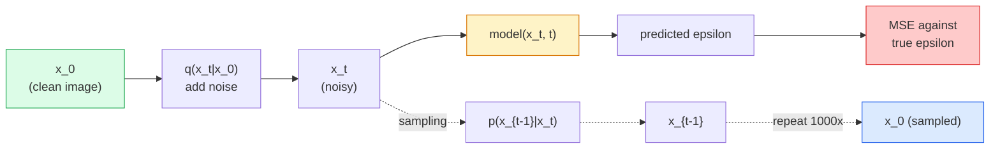

# 图像生成 — 扩散模型

> 扩散模型学习去噪。训练它从一张带噪声的图像中去除微小的噪声，将这一过程反向重复一千次，你就得到了一个图像生成器。

**类型:** 动手构建  
**语言:** Python  
**前置知识:** 第4阶段第07课（U-Net），第1阶段第06课（概率论），第3阶段第06课（优化器）  
**时间:** 约75分钟  

## 学习目标

- 推导前向加噪过程 `x_0 -> x_1 -> ... -> x_T`，并解释为什么闭式表达式 `q(x_t | x_0)` 对任意 t 成立  
- 实现一个DDPM风格的训练目标，回归每一步添加的噪声；并实现一个采样器，从纯噪声逐步反向回到图像  
- 构建一个时间条件U-Net（足够小，可在CPU上训练），预测任意时间步的噪声  
- 解释DDPM与DDIM采样的区别，以及各自适用的场景（第23课深入讲解流匹配与整流流）

## 问题

GAN一次生成：噪声输入，图像输出，一次前向传播。它们速度快但训练困难。扩散模型迭代生成：从纯噪声开始，逐步去噪，图像逐渐浮现。它们速度慢但训练容易。过去五年里，后者的特性占据了主导地位：任何小团队都能训练一个扩散模型并获得合理的样本；而GAN训练则是一门需要多年失败经验才能掌握的技艺。

除了训练稳定性，扩散模型的迭代结构正是现代图像生成解锁一切功能的关键：文本条件、图像修补、图像编辑、超分辨率、可控风格。采样循环的每一步都是注入新约束的切入点。这个特性正是Stable Diffusion、Imagen、DALL-E 3、Midjourney以及你将使用的所有可控图像模型都基于扩散的原因。

本节课构建最简的DDPM：前向加噪、反向去噪、训练循环。下一课（Stable Diffusion）将将其接入生产系统，配备VAE、文本编码器和无分类器引导。

## 概念

### 前向过程

取一张图像 `x_0`。添加微量的高斯噪声得到 `x_1`。再添加微量噪声得到 `x_2`。继续T步，直到 `x_T` 与纯高斯噪声几乎无法区分。

```
q(x_t | x_{t-1}) = N(x_t; sqrt(1 - beta_t) * x_{t-1},  beta_t * I)
```

`beta_t` 是一个小方差调度，通常从0.0001到0.02随T=1000步线性增加。每一步都略微缩小信号并注入新的噪声。

### 闭式跳跃

一步一步添加噪声是一个马尔可夫链，但数学上可以折叠：你可以一次性直接从 `x_0` 采样得到 `x_t`。

```
Define alpha_t = 1 - beta_t
Define alpha_bar_t = prod_{s=1..t} alpha_s

Then:
  q(x_t | x_0) = N(x_t; sqrt(alpha_bar_t) * x_0,  (1 - alpha_bar_t) * I)

Equivalently:
  x_t = sqrt(alpha_bar_t) * x_0 + sqrt(1 - alpha_bar_t) * epsilon
  where epsilon ~ N(0, I)
```

这个单一方程正是扩散模型实用的全部原因。训练时，你随机选一个 `t`，直接从 `x_0` 采样 `x_t`，然后在一步内完成训练——不需要模拟完整的马尔可夫链。

### 反向过程

前向过程是固定的。反向过程 `p(x_{t-1} | x_t)` 由神经网络学习。扩散模型并不直接预测 `x_{t-1}`；它们预测在步骤t添加的噪声 `epsilon`，然后通过数学推导得到 `x_{t-1}`。



### 训练损失

每一个训练步骤：

1. 采样一张真实图像 `x_0`。
2. 均匀地从 [1, T] 中采样一个时间步 `t`。
3. 采样噪声 `epsilon ~ N(0, I)`。
4. 计算 `x_t = sqrt(alpha_bar_t) * x_0 + sqrt(1 - alpha_bar_t) * epsilon`。
5. 用网络预测 `epsilon_theta(x_t, t)`。
6. 最小化 `|| epsilon - epsilon_theta(x_t, t) ||^2`。

就是这样。神经网络学习预测任意时间步的噪声。损失是均方误差。没有对抗博弈，没有崩溃，没有振荡。

### 采样器 (DDPM)

生成方式：从 `x_T ~ N(0, I)` 开始，一步一步反向走。

```
for t = T, T-1, ..., 1:
    eps = model(x_t, t)
    x_{t-1} = (1 / sqrt(alpha_t)) * (x_t - (beta_t / sqrt(1 - alpha_bar_t)) * eps) + sqrt(beta_t) * z
    where z ~ N(0, I) if t > 1, else 0
return x_0
```

关键在于，尽管反向条件概率通常没有闭式解，但对于这种特定的高斯前向过程，它是存在的。那些看起来丑陋的系数正是贝叶斯法则给出的结果。

### 为什么是1000步

前向噪声调度被设计成每一步只添加足够多的噪声，使得反向步近似为高斯分布。步数太少，反向步远离高斯分布，网络难以良好建模。步数太多，采样变得昂贵且收益递减。使用线性调度的T=1000是DDPM的默认值。

### DDIM：快20倍的采样

训练相同。采样不同。DDIM (Song et al., 2020) 定义了一个确定性的反向过程，可以在不重新训练的情况下跳过时间步。使用DDIM以50步采样，质量接近1000步的DDPM。每个生产系统都使用DDIM或更快的变体（DPM-Solver、Euler ancestral）。

### 时间条件

网络 `epsilon_theta(x_t, t)` 需要知道它在去噪的哪个时间步。现代扩散模型通过正弦时间嵌入（与Transformer中的位置编码思想相同）注入 `t`，这些嵌入被添加到U-Net每一层的特征图中。

```
t_embedding = sinusoidal(t)
feature_map += MLP(t_embedding)
```

没有时间条件，网络必须从图像本身猜测噪声水平，这虽然可行，但样本效率低得多。

## 动手构建

### 第1步：噪声调度

```python
import torch

def linear_beta_schedule(T=1000, beta_start=1e-4, beta_end=2e-2):
    return torch.linspace(beta_start, beta_end, T)


def precompute_schedule(betas):
    alphas = 1.0 - betas
    alphas_cumprod = torch.cumprod(alphas, dim=0)
    return {
        "betas": betas,
        "alphas": alphas,
        "alphas_cumprod": alphas_cumprod,
        "sqrt_alphas_cumprod": torch.sqrt(alphas_cumprod),
        "sqrt_one_minus_alphas_cumprod": torch.sqrt(1.0 - alphas_cumprod),
        "sqrt_recip_alphas": torch.sqrt(1.0 / alphas),
    }

schedule = precompute_schedule(linear_beta_schedule(T=1000))
```

预先计算一次，训练和采样时按索引获取。

### 第2步：前向扩散 (q_sample)

```python
def q_sample(x0, t, noise, schedule):
    sqrt_a = schedule["sqrt_alphas_cumprod"][t].view(-1, 1, 1, 1)
    sqrt_one_minus_a = schedule["sqrt_one_minus_alphas_cumprod"][t].view(-1, 1, 1, 1)
    return sqrt_a * x0 + sqrt_one_minus_a * noise
```

一行闭式表达式。`t` 是一个包含时间步的批次，每个图像对应一个时间步。

### 第3步：微型时间条件U-Net

```python
import torch.nn as nn
import torch.nn.functional as F
import math

def timestep_embedding(t, dim=64):
    half = dim // 2
    freqs = torch.exp(-math.log(10000) * torch.arange(half, device=t.device) / half)
    args = t[:, None].float() * freqs[None]
    emb = torch.cat([args.sin(), args.cos()], dim=-1)
    return emb


class TinyUNet(nn.Module):
    def __init__(self, img_channels=3, base=32, t_dim=64):
        super().__init__()
        self.t_mlp = nn.Sequential(
            nn.Linear(t_dim, base * 4),
            nn.SiLU(),
            nn.Linear(base * 4, base * 4),
        )
        self.t_dim = t_dim
        self.enc1 = nn.Conv2d(img_channels, base, 3, padding=1)
        self.enc2 = nn.Conv2d(base, base * 2, 4, stride=2, padding=1)
        self.mid = nn.Conv2d(base * 2, base * 2, 3, padding=1)
        self.dec1 = nn.ConvTranspose2d(base * 2, base, 4, stride=2, padding=1)
        self.dec2 = nn.Conv2d(base * 2, img_channels, 3, padding=1)
        self.time_proj = nn.Linear(base * 4, base * 2)

    def forward(self, x, t):
        t_emb = timestep_embedding(t, self.t_dim)
        t_emb = self.t_mlp(t_emb)
        t_proj = self.time_proj(t_emb)[:, :, None, None]

        h1 = F.silu(self.enc1(x))
        h2 = F.silu(self.enc2(h1)) + t_proj
        h3 = F.silu(self.mid(h2))
        d1 = F.silu(self.dec1(h3))
        d2 = torch.cat([d1, h1], dim=1)
        return self.dec2(d2)
```

两层U-Net，在瓶颈处注入时间条件。对于真实图像，增加深度和宽度。

### 第4步：训练循环

```python
def train_step(model, x0, schedule, optimizer, device, T=1000):
    model.train()
    x0 = x0.to(device)
    bs = x0.size(0)
    t = torch.randint(0, T, (bs,), device=device)
    noise = torch.randn_like(x0)
    x_t = q_sample(x0, t, noise, schedule)
    pred = model(x_t, t)
    loss = F.mse_loss(pred, noise)
    optimizer.zero_grad()
    loss.backward()
    optimizer.step()
    return loss.item()
```

这就是整个训练循环。没有GAN博弈，没有特殊损失，只有一个MSE调用。

### 第5步：采样器 (DDPM)

```python
@torch.no_grad()
def sample(model, schedule, shape, T=1000, device="cpu"):
    model.eval()
    x = torch.randn(shape, device=device)
    betas = schedule["betas"].to(device)
    sqrt_one_minus_a = schedule["sqrt_one_minus_alphas_cumprod"].to(device)
    sqrt_recip_alphas = schedule["sqrt_recip_alphas"].to(device)

    for t in reversed(range(T)):
        t_batch = torch.full((shape[0],), t, dtype=torch.long, device=device)
        eps = model(x, t_batch)
        coef = betas[t] / sqrt_one_minus_a[t]
        mean = sqrt_recip_alphas[t] * (x - coef * eps)
        if t > 0:
            x = mean + torch.sqrt(betas[t]) * torch.randn_like(x)
        else:
            x = mean
    return x
```

1000次前向传播生成一个批次的样本。在实际代码中，你会将其替换为50步的DDIM采样器。

### 第6步：DDIM采样器 (确定性，约快20倍)

```python
@torch.no_grad()
def sample_ddim(model, schedule, shape, steps=50, T=1000, device="cpu", eta=0.0):
    model.eval()
    x = torch.randn(shape, device=device)
    alphas_cumprod = schedule["alphas_cumprod"].to(device)

    ts = torch.linspace(T - 1, 0, steps + 1).long()
    for i in range(steps):
        t = ts[i]
        t_prev = ts[i + 1]
        t_batch = torch.full((shape[0],), t, dtype=torch.long, device=device)
        eps = model(x, t_batch)
        a_t = alphas_cumprod[t]
        a_prev = alphas_cumprod[t_prev] if t_prev >= 0 else torch.tensor(1.0, device=device)
        x0_pred = (x - torch.sqrt(1 - a_t) * eps) / torch.sqrt(a_t)
        sigma = eta * torch.sqrt((1 - a_prev) / (1 - a_t) * (1 - a_t / a_prev))
        dir_xt = torch.sqrt(1 - a_prev - sigma ** 2) * eps
        noise = sigma * torch.randn_like(x) if eta > 0 else 0
        x = torch.sqrt(a_prev) * x0_pred + dir_xt + noise
    return x
```

`eta=0` 是完全确定性的（相同的噪声输入始终产生相同的输出）。`eta=1` 恢复为DDPM。

## 使用它

在生产工作中，使用 `diffusers`：

```python
from diffusers import DDPMScheduler, UNet2DModel

unet = UNet2DModel(sample_size=32, in_channels=3, out_channels=3, layers_per_block=2)
scheduler = DDPMScheduler(num_train_timesteps=1000)
```

该库提供了现成的调度器（DDPM、DDIM、DPM-Solver、Euler、Heun）、可配置的U-Net、用于文本转图像和图像转图像的Pipeline，以及LoRA微调辅助工具。

在研究工作中，`k-diffusion`（Katherine Crowson）拥有最忠实的参考实现和最好的采样变体。

## 交付成果

本课产生：

- `outputs/prompt-diffusion-sampler-picker.md` — 一个提示，根据质量目标、延迟预算和条件类型选择 DDPM / DDIM / DPM-Solver / Euler。
- `outputs/skill-noise-schedule-designer.md` — 一个技能，根据给定的T和目标损坏程度生成线性、余弦或S形beta调度，并附带信噪比随时间的诊断图。

## 练习

1. **(简单)** 可视化前向过程：取一张图像，绘制 `x_t` 在 `t ∈ [0, 100, 250, 500, 750, 1000]` 时的图像。验证 `x_1000` 看起来像纯高斯噪声。
2. **(中等)** 在synthetic-circles数据集上训练TinyUNet 20个epoch，然后采样16个圆。比较DDPM（1000步）和DDIM（50步）采样——它们从相同的噪声种子生成的图像是否相似？
3. **(困难)** 实现余弦噪声调度（Nichol & Dhariwal, 2021）：`alpha_bar_t = cos^2((t/T + s) / (1 + s) * pi / 2)`。使用线性调度和余弦调度分别训练相同的模型，并证明余弦调度在较少步数下生成更好的样本。

## 关键术语

| 术语 | 人们常说的 | 实际含义 |
|------|------------|----------|
| Forward process (前向过程) | "随时间添加噪声" | 固定的马尔可夫链，在T步内将图像逐渐破坏为高斯噪声 |
| Reverse process (反向过程) | "逐步去噪" | 学习的分布，从噪声反向走回到图像 |
| Epsilon prediction (预测噪声) | "预测噪声" | 训练目标：`epsilon_theta(x_t, t)` 预测步骤t添加的噪声 |
| Beta schedule (Beta调度) | "噪声量" | 由T个小方差组成的序列，定义每一步注入多少噪声 |
| alpha_bar_t (累积保留因子) | "累积保留因子" | 截止到时间t的 (1 - beta_s) 乘积；t越大，信号保留越少 |
| DDPM sampler (DDPM采样器) | "祖先，随机性" | 从每个条件高斯分布中采样 x_{t-1}；1000步 |
| DDIM sampler (DDIM采样器) | "确定性，快速" | 将采样改写为确定性常微分方程；20-100步，质量接近 |
| Time conditioning (时间条件) | "告诉模型当前t" | 将t的正弦嵌入注入U-Net，使其知道噪声水平 |

## 延伸阅读

- [Denoising Diffusion Probabilistic Models (Ho et al., 2020)](https://arxiv.org/abs/2006.11239) — 使扩散模型实用化并在FID上超越GAN的论文
- [Improved DDPM (Nichol & Dhariwal, 2021)](https://arxiv.org/abs/2102.09672) — 余弦调度和v参数化
- [DDIM (Song, Meng, Ermon, 2020)](https://arxiv.org/abs/2010.02502) — 使实时推理成为可能的确定性采样器
- [Elucidating the Design Space of Diffusion (Karras et al., 2022)](https://arxiv.org/abs/2206.00364) — 对扩散模型所有设计选择的统一视角；当前最佳参考
