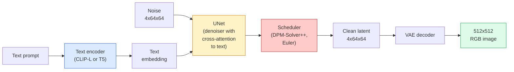

# Stable Diffusion — 架构与微调

> Stable Diffusion 是一种 DDPM，它在预训练 VAE 的潜在空间中运行，通过交叉注意力机制以文本为条件，使用快速的确定性 ODE 求解器进行采样，并由无分类器引导控制方向。

**类型：** 学习 + 使用  
**语言：** Python  
**前置知识：** 阶段 4 第 10 课（扩散模型），阶段 7 第 02 课（自注意力）  
**时长：** ~75 分钟

## 学习目标

- 梳理 Stable Diffusion 流水线的五个组件：VAE、文本编码器、U-Net、调度器、安全检查器——以及它们各自的实际作用
- 解释潜在扩散，并说明为什么在 4×64×64 的潜在空间中训练（而非 3×512×512 的图像）能在不损失质量的情况下将计算量降低 48 倍
- 使用 `diffusers` 生成图像、执行图像到图像转换、图像修复以及 ControlNet 引导的生成
- 在小型自定义数据集上使用 LoRA 微调 Stable Diffusion，并在推理时加载 LoRA 适配器

## 问题

直接在 512×512 的 RGB 图像上训练 DDPM 非常昂贵。每个训练步骤都需要通过一个处理 3×512×512 = 786,432 个输入值的 U-Net 进行反向传播，而采样则需要对该 U-Net 进行 50 次以上的前向传播。在 Stable Diffusion 1.5（2022 年发布）的质量水平下，像素空间扩散需要大约 256 个 GPU 月的训练时间，并且在消费级 GPU 上每张图像需要 10-30 秒。

使开放权重的文本到图像变得实用的技巧是**潜在扩散**（Rombach 等人，CVPR 2022）。训练一个 VAE，将 3×512×512 的图像映射为 4×64×64 的潜在张量并反向映射，然后在那个潜在空间中进行扩散。计算量降至 `(3*512*512)/(4*64*64) = 48` 倍。采样时间从几十秒降至同一 GPU 上的不到两秒。

几乎所有现代图像生成模型——SDXL、SD3、FLUX、HunyuanDiT、Wan-Video——都是潜在扩散模型，只是在自动编码器、去噪器（U-Net 或 DiT）和文本条件方面有所变化。学会 Stable Diffusion，你就学会了模板。

## 概念

### 流水线



- **VAE** — 冻结的自动编码器。编码器将图像转换为潜在变量（用于图像到图像和训练）。解码器将潜在变量转换回图像。
- **文本编码器** — CLIP 文本编码器（SD 1.x/2.x）、CLIP-L + CLIP-G（SDXL）或 T5-XXL（SD3/FLUX）。生成一系列 token 嵌入。
- **U-Net** — 去噪器。包含交叉注意力层，在每个分辨率级别，潜在变量会关注文本嵌入。
- **调度器** — 采样算法（DDIM、Euler、DPM-Solver++）。选择 sigma，将预测的噪声混合回潜在变量。
- **安全检查器** — 可选的对输出图像的 NSFW/非法内容过滤器。

### 无分类器引导（CFG）

纯文本条件针对每个提示 `c` 学习 `epsilon_theta(x_t, t, c)`。CFG 在 10% 的情况下丢弃 `c`（替换为空嵌入）来训练同一个网络，从而得到一个既能预测条件噪声又能预测无条件噪声的单一模型。在推理时：

```
eps = eps_uncond + w * (eps_cond - eps_uncond)
```

`w` 是引导尺度。`w=0` 为无条件，`w=1` 为纯条件，`w>1` 将输出推向“更受提示约束”的方向，但以牺牲多样性为代价。SD 默认值为 `w=7.5`。

CFG 是文本到图像能够达到生产质量的原因。没有它，提示对输出的影响较弱；有了它，提示占主导地位。

### 潜在空间几何

VAE 的 4 通道潜在变量不仅仅是一个压缩图像。它是一个流形，其上的算术运算大致对应于语义编辑（提示工程和插值都发生在这里），并且扩散 U-Net 被训练将其全部建模能力花在这个流形上。解码一个随机的 4×64×64 潜在变量并不会产生一个看起来随机的图像——它会产生垃圾，因为只有潜在变量的特定子流形才能解码为有效图像。

两个结果：

1. **图像到图像** = 将图像编码为潜在变量，添加部分噪声，运行去噪器，然后解码。由于编码几乎是可逆的，图像结构得以保留；根据提示改变内容。
2. **修复** = 与图像到图像相同，但去噪器只更新被掩码的区域；未掩码的区域保持为编码后的潜在变量。

### U-Net 架构

SD U-Net 是第 10 课中 TinyUNet 的大版本，并增加了三个部分：

- **Transformer 模块**，位于每个空间分辨率，包含自注意力和对文本嵌入的交叉注意力。
- **时间嵌入**，通过对正弦编码进行 MLP 处理得到。
- **跳跃连接**，在编码器和解码器之间以匹配的分辨率连接。

SD 1.5 的总参数量：约 860M。SDXL：约 2.6B。FLUX：约 12B。参数量的大幅增长主要来自注意力层。

### LoRA 微调

Stable Diffusion 的完整微调需要 20GB 以上的显存，并更新 860M 个参数。LoRA（低秩适配）保持基础模型冻结，并在注意力层中注入小的秩分解矩阵。一个用于 SD 的 LoRA 适配器通常为 10-50MB，在单个消费级 GPU 上训练 10-60 分钟，并在推理时作为即插即用的修改加载。

```
Original: W_q : (d_in, d_out)   frozen
LoRA:     W_q + alpha * (A @ B)   where A : (d_in, r), B : (r, d_out)

r is typically 4-32.
```

LoRA 是几乎所有社区微调模型的发布方式。CivitAI 和 Hugging Face 上有数百万个这样的适配器。

### 你会遇到的调度器

- **DDIM** — 确定性，约 50 步，简单。
- **Euler ancestral** — 随机，30-50 步，样本稍具创造性。
- **DPM-Solver++ 2M Karras** — 确定性，20-30 步，生产默认。
- **LCM / TCD / Turbo** — 一致性模型及其蒸馏变体；1-4 步，以牺牲部分质量为代价。

在 `diffusers` 中切换调度器只需一行代码，有时无需任何重新训练即可解决样本问题。

## 动手构建

本课程从头到尾使用 `diffusers`，而不是从头重建 Stable Diffusion。你需要重建的组件（VAE、文本编码器、U-Net、调度器）是其他课程的主题；这里的目标是熟练掌握生产 API。

### 第 1 步：文本到图像

```python
import torch
from diffusers import StableDiffusionPipeline

pipe = StableDiffusionPipeline.from_pretrained(
    "runwayml/stable-diffusion-v1-5",
    torch_dtype=torch.float16,
).to("cuda")

image = pipe(
    prompt="a dog riding a skateboard in tokyo, studio ghibli style",
    guidance_scale=7.5,
    num_inference_steps=25,
    generator=torch.Generator("cuda").manual_seed(42),
).images[0]
image.save("dog.png")
```

`float16` 可将显存减半，且无明显质量损失。默认的 DPM-Solver++ 使用 `num_inference_steps=25` 即可达到 DDIM 使用 `num_inference_steps=50` 的效果。

### 第 2 步：切换调度器

```python
from diffusers import DPMSolverMultistepScheduler, EulerAncestralDiscreteScheduler

pipe.scheduler = DPMSolverMultistepScheduler.from_config(pipe.scheduler.config)
pipe.scheduler = EulerAncestralDiscreteScheduler.from_config(pipe.scheduler.config)
```

调度器状态与 U-Net 权重解耦。你可以用 DDPM 训练，用任何调度器采样。

### 第 3 步：图像到图像

```python
from diffusers import StableDiffusionImg2ImgPipeline
from PIL import Image

img2img = StableDiffusionImg2ImgPipeline.from_pretrained(
    "runwayml/stable-diffusion-v1-5",
    torch_dtype=torch.float16,
).to("cuda")

init_image = Image.open("dog.png").convert("RGB").resize((512, 512))
out = img2img(
    prompt="a dog riding a skateboard, oil painting",
    image=init_image,
    strength=0.6,
    guidance_scale=7.5,
).images[0]
```

`strength` 表示在去噪前添加多少噪声（0.0 = 不变，1.0 = 完全重新生成）。0.5-0.7 是风格迁移的标准范围。

### 第 4 步：修复

```python
from diffusers import StableDiffusionInpaintPipeline

inpaint = StableDiffusionInpaintPipeline.from_pretrained(
    "runwayml/stable-diffusion-inpainting",
    torch_dtype=torch.float16,
).to("cuda")

image = Image.open("dog.png").convert("RGB").resize((512, 512))
mask = Image.open("dog_mask.png").convert("L").resize((512, 512))

out = inpaint(
    prompt="a cat",
    image=image,
    mask_image=mask,
    guidance_scale=7.5,
).images[0]
```

掩码中的白色像素是要重新生成的区域。黑色像素将被保留。

### 第 5 步：加载 LoRA

```python
pipe.load_lora_weights("sayakpaul/sd-lora-ghibli")
pipe.fuse_lora(lora_scale=0.8)

image = pipe(prompt="a village square in ghibli style").images[0]
```

`lora_scale` 控制强度；0.0 = 无效果，1.0 = 完全效果。`fuse_lora` 将适配器原位融合到权重中以提高速度，但会阻止切换。在加载不同适配器之前调用 `pipe.unfuse_lora()`。

### 第 6 步：LoRA 训练（概要）

真正的 LoRA 训练在 `peft` 或 `diffusers.training` 中实现。概要如下：

```python
# Pseudocode
for step, batch in enumerate(dataloader):
    images, prompts = batch
    latents = vae.encode(images).latent_dist.sample() * 0.18215

    t = torch.randint(0, num_train_timesteps, (batch_size,))
    noise = torch.randn_like(latents)
    noisy_latents = scheduler.add_noise(latents, noise, t)

    text_emb = text_encoder(tokenizer(prompts))

    pred_noise = unet(noisy_latents, t, text_emb)  # LoRA weights injected here

    loss = F.mse_loss(pred_noise, noise)
    loss.backward()
    optimizer.step()
```

只有 LoRA 矩阵接收梯度；基础的 U-Net、VAE 和文本编码器被冻结。当 batch size 为 1 并开启梯度检查点时，这可以装入 8GB 显存。

## 实际使用

在生产中，你实际需要做出的决策：

- **模型系列**：SD 1.5 用于开源社区微调变体，SDXL 用于更高保真度，SD3 / FLUX 用于最先进的技术和严格的许可要求。
- **调度器**：DPM-Solver++ 2M Karras 用于 20-30 步，LCM-LoRA 用于延迟低于 1s 的情况。
- **精度**：在 4080/4090 上使用 `float16`，在 A100 及更新型号上使用 `bfloat16`，在显存紧张时使用 `int8`（通过 `bitsandbytes` 或 `compel`）。
- **条件控制**：纯文本通常有效；如需更强控制，可在基础流水线之上添加 ControlNet（Canny 边缘检测、深度图、姿态估计）。

对于批量生成，社区工具为 `AUTO1111` / `ComfyUI`；对于生产 API，则使用 `diffusers` + `accelerate` 或 `optimum-nvidia`（搭配 TensorRT 编译）。

## 交付物

本课程产出：

- `outputs/prompt-sd-pipeline-planner.md` — 一个提示，根据延迟预算、保真度目标和许可约束，选择 SD 1.5 / SDXL / SD3 / FLUX 以及调度器和精度。
- `outputs/skill-lora-training-setup.md` — 一种技能，可以为自定义数据集编写完整的 LoRA 训练配置，包括字幕、秩、批次大小和学习率。

## 练习

1. **（简单）** 使用 `guidance_scale` 在 `[1, 3, 5, 7.5, 10, 15]` 范围内生成同一个提示。描述图像如何变化。在什么引导值下会出现伪影？
2. **（中等）** 取一张真实照片，通过 `StableDiffusionImg2ImgPipeline` 以 `strength` 在 `[0.2, 0.4, 0.6, 0.8, 1.0]` 范围内运行。哪个强度值能在改变风格的同时保留构图？为什么 1.0 会完全忽略输入？
3. **（困难）** 在 10-20 张单一主题（宠物、标志、角色）的图像上训练一个 LoRA，并生成包含该主题的新场景。报告在最佳身份保留且不对输入图像过拟合的情况下，所使用的 LoRA 秩和训练步数。

## 关键术语

| 术语 | 人们常说的 | 实际含义 |
|------|------------|----------|
| 潜在扩散 | “在潜在空间中扩散” | 将整个 DDPM 运行在 VAE 潜在空间（4×64×64）而非像素空间（3×512×512）中；节省 48 倍计算量 |
| VAE 缩放因子 | “0.18215” | 将 VAE 的原始潜在变量重新缩放至大致单位方差的常数；硬编码于每个 SD 流水线中 |
| 无分类器引导 | “CFG” | 混合条件和无条件噪声预测；影响最大的单一推理旋钮 |
| 调度器 | “采样器” | 将噪声和模型预测转换为去噪潜在轨迹的算法 |
| LoRA | “低秩适配器” | 小型秩分解矩阵，用于微调注意力层而不触碰基础权重 |
| 交叉注意力 | “文本-图像注意力” | 从潜在 token 到文本 token 的注意力；在每个 U-Net 层级注入提示信息 |
| ControlNet | “结构条件控制” | 一个单独训练的适配器，利用额外输入（Canny 边缘、深度图、姿态、分割）引导 SD |
| DPM-Solver++ | “默认调度器” | 二阶确定性 ODE 求解器；在 2026 年以较低步数（20-30）获得最佳质量 |

## 扩展阅读

- [High-Resolution Image Synthesis with Latent Diffusion (Rombach et al., 2022)](https://arxiv.org/abs/2112.10752) — Stable Diffusion 论文；包含证明其设计合理性的所有消融实验
- [Classifier-Free Diffusion Guidance (Ho & Salimans, 2022)](https://arxiv.org/abs/2207.12598) — CFG 论文
- [LoRA: Low-Rank Adaptation of Large Language Models (Hu et al., 2021)](https://arxiv.org/abs/2106.09685) — LoRA 最初用于 NLP；几乎未经修改便迁移至 SD
- [diffusers documentation](https://huggingface.co/docs/diffusers) — 所有 SD / SDXL / SD3 / FLUX 流水线的参考资料
