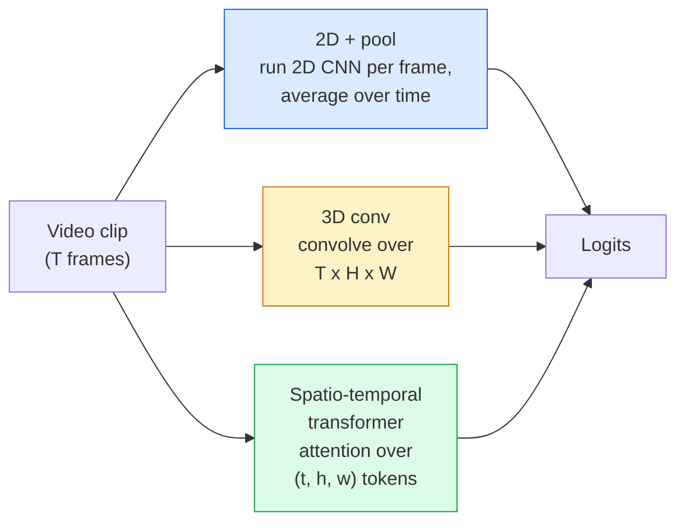

以下是课程材料的中文翻译，保留了所有必需的英文元素和Markdown结构。

---

# 视频理解——时间建模

> 视频是一系列图像加上连接它们的物理规律。每个视频模型要么将时间视为额外轴（3D卷积）、要么视为需要关注的序列（Transformer）、要么视为一次性提取并池化的特征（2D+池化）。

**类型：** 学习 + 构建  
**语言：** Python  
**前置知识：** Phase 4 Lesson 03 (CNNs), Phase 4 Lesson 04 (Image Classification)  
**时间：** 约45分钟  

## 学习目标

- 区分三种主要的视频建模方法（2D+池化、3D卷积、时空Transformer），并预测其计算成本与准确率之间的权衡
- 在PyTorch中实现帧采样、时间池化以及2D+池化基线分类器
- 解释为何I3D的“膨胀”3D卷积核能很好地从ImageNet权重迁移，以及因式分解的(2+1)D卷积有何不同
- 了解标准动作识别数据集和指标：Kinetics-400/600、UCF101、Something-Something V2；在片段层面和视频层面的Top-1准确率

## 问题

一段30秒、每秒30帧的视频包含900张图像。天真地看，视频分类就是对900张图像各做一次图像分类再进行某种聚合。当动作几乎在每一帧中都可见（体育、烹饪、健身视频）时，这种方法有效；但当动作本身由运动定义时——比如“将某物从左推到右”，在每一帧中看起来只是两个静止物体。

每个视频架构的核心问题是：时间结构在何时被建模，以及如何建模？答案决定了其他一切——计算代价、预训练策略、能否复用ImageNet权重、模型在哪些数据集上训练。

本节课刻意比静态图像课程更短。核心图像机制已经到位，视频理解主要围绕时间方面的故事：采样、建模和聚合。

## 概念

### 三个架构家族



### 2D + 池化

取一个2D CNN（ResNet、EfficientNet、ViT）。对每个采样帧独立运行。对每帧的嵌入向量进行平均（或最大池化、注意力池化）。将池化后的向量送入分类器。

优点：
- ImageNet预训练直接迁移。
- 实现最简单。
- 计算成本低：T帧 * 单张图像推理成本。

缺点：
- 无法建模运动。动作 = 外观的聚合。
- 时间池化与顺序无关；“开门”和“关门”看起来一样。

适用场景：外观密集型任务、小规模视频数据集的迁移学习、初始基线。

### 3D卷积

将2D (H, W) 卷积核替换为3D (T, H, W) 卷积核。网络同时在空间和时间上卷积。早期家族：C3D、I3D、SlowFast。

I3D技巧：取一个预训练的2D ImageNet模型，通过沿新的时间轴复制权重来“膨胀”每个2D卷积核。一个3×3的2D卷积变成3×3×3的3D卷积。这为3D模型提供了强大的预训练权重，而非从头训练。

优点：
- 直接建模运动。
- I3D膨胀提供免费的迁移学习。

缺点：
- 计算量约为对应2D模型的T/8倍（对于3次堆叠的时间卷积核大小为3的情况）。
- 时间卷积核较小；长程运动需要金字塔或双流方法。

适用场景：动作识别中运动本身就是信号（Something-Something V2、包含运动密集类别的Kinetics）。

### 时空Transformer

将视频令牌化为时空网格，并对所有令牌进行注意力计算。TimeSformer、ViViT、Video Swin、VideoMAE。

重要的注意力模式：
- **联合（Joint）** —— 一次大的注意力覆盖 (t, h, w)。计算复杂度与 `T*H*W` 成平方关系；昂贵。
- **分离（Divided）** —— 每块两次注意力：一次在时间上，一次在空间上。近似线性扩展。
- **因式分解（Factorised）** —— 时间注意力和空间注意力在块之间交替。

优点：
- 在各大主流基准上达到SOTA准确率。
- 通过补丁膨胀从图像Transformer（ViT）迁移。
- 通过稀疏注意力支持长上下文视频。

缺点：
- 计算密集。
- 需要精心选择注意力模式，否则运行时开销会激增。

适用场景：大型数据集、高保真视频理解、多模态视频+文本任务。

### 帧采样

一段10秒、30fps的片段包含300帧；将所有300帧送入任何模型都是浪费。标准策略：

- **均匀采样** —— 在片段中均匀选取T帧。2D+池化的默认方法。
- **密集采样** —— 选取随机连续的T帧窗口。3D卷积常用，因为运动需要相邻帧。
- **多片段采样** —— 从同一视频中采样多个T帧窗口，分别进行分类，测试时平均预测结果。

T通常为8、16、32或64。T越大意味着时间信号越多，计算量也越大。

### 评估

两个层面：
- **片段级别准确率** —— 模型看到一个T帧片段，报告Top-K。
- **视频级别准确率** —— 对每个视频的多个片段平均片段级别的预测结果；更稳定且值更高。

始终报告两者。一个模型若是78%片段/82%视频，则严重依赖测试时平均；而80%/81%则说明每个片段更稳健。

### 你会遇到的数据集

- **Kinetics-400 / 600 / 700** —— 通用动作数据集。40万片段；YouTube链接（很多现已失效）。
- **Something-Something V2** —— 运动定义的动作（“将X从左移到右”）。无法用2D+池化解决。
- **UCF-101**, **HMDB-51** —— 更旧、更小，但仍被报告。
- **AVA** —— 动作在空间和时间上的*定位*；比分类更困难。

## 构建它

### 第一步：帧采样器

均匀和密集采样器，作用于帧列表（或视频张量）。

```python
import numpy as np

def sample_uniform(num_frames_total, T):
    if num_frames_total <= T:
        return list(range(num_frames_total)) + [num_frames_total - 1] * (T - num_frames_total)
    step = num_frames_total / T
    return [int(i * step) for i in range(T)]


def sample_dense(num_frames_total, T, rng=None):
    rng = rng or np.random.default_rng()
    if num_frames_total <= T:
        return list(range(num_frames_total)) + [num_frames_total - 1] * (T - num_frames_total)
    start = int(rng.integers(0, num_frames_total - T + 1))
    return list(range(start, start + T))
```

两者都返回 `T` 个索引，用于切片视频张量。

### 第二步：2D+池化基线

在每一帧上运行2D ResNet-18，平均池化特征，进行分类。

```python
import torch
import torch.nn as nn
from torchvision.models import resnet18, ResNet18_Weights

class FramePool(nn.Module):
    def __init__(self, num_classes=400, pretrained=True):
        super().__init__()
        weights = ResNet18_Weights.IMAGENET1K_V1 if pretrained else None
        backbone = resnet18(weights=weights)
        self.features = nn.Sequential(*(list(backbone.children())[:-1]))  # global avg pool kept
        self.head = nn.Linear(512, num_classes)

    def forward(self, x):
        # x: (N, T, 3, H, W)
        N, T = x.shape[:2]
        x = x.view(N * T, *x.shape[2:])
        feats = self.features(x).view(N, T, -1)
        pooled = feats.mean(dim=1)
        return self.head(pooled)

model = FramePool(num_classes=10)
x = torch.randn(2, 8, 3, 224, 224)
print(f"output: {model(x).shape}")
print(f"params: {sum(p.numel() for p in model.parameters()):,}")
```

一千一百万参数，ImageNet预训练，逐帧运行，平均，分类。此基线在密集型任务上通常与真正3D模型相差5-10个百分点——有时甚至更好，因为它复用了更强的ImageNet骨干。

### 第三步：I3D风格的膨胀3D卷积

通过沿新时间轴重复权重，将单个2D卷积转换为3D卷积。

```python
def inflate_2d_to_3d(conv2d, time_kernel=3):
    out_c, in_c, kh, kw = conv2d.weight.shape
    weight_3d = conv2d.weight.data.unsqueeze(2)  # (out, in, 1, kh, kw)
    weight_3d = weight_3d.repeat(1, 1, time_kernel, 1, 1) / time_kernel
    conv3d = nn.Conv3d(in_c, out_c, kernel_size=(time_kernel, kh, kw),
                        padding=(time_kernel // 2, conv2d.padding[0], conv2d.padding[1]),
                        stride=(1, conv2d.stride[0], conv2d.stride[1]),
                        bias=False)
    conv3d.weight.data = weight_3d
    return conv3d

conv2d = nn.Conv2d(3, 64, kernel_size=3, padding=1, bias=False)
conv3d = inflate_2d_to_3d(conv2d, time_kernel=3)
print(f"2D weight shape:  {tuple(conv2d.weight.shape)}")
print(f"3D weight shape:  {tuple(conv3d.weight.shape)}")
x = torch.randn(1, 3, 8, 56, 56)
print(f"3D output shape:  {tuple(conv3d(x).shape)}")
```

除以 `time_kernel` 可以保持激活幅度大致恒定——对于首次前向时不破坏批归一化统计量很重要。

### 第四步：因式分解(2+1)D卷积

将3D卷积拆分为2D（空间）卷积和1D（时间）卷积。相同的感受野，更少的参数，在某些基准上准确率更高。

```python
class Conv2Plus1D(nn.Module):
    def __init__(self, in_c, out_c, kernel_size=3):
        super().__init__()
        mid_c = (in_c * out_c * kernel_size * kernel_size * kernel_size) \
                // (in_c * kernel_size * kernel_size + out_c * kernel_size)
        self.spatial = nn.Conv3d(in_c, mid_c, kernel_size=(1, kernel_size, kernel_size),
                                 padding=(0, kernel_size // 2, kernel_size // 2), bias=False)
        self.bn = nn.BatchNorm3d(mid_c)
        self.act = nn.ReLU(inplace=True)
        self.temporal = nn.Conv3d(mid_c, out_c, kernel_size=(kernel_size, 1, 1),
                                  padding=(kernel_size // 2, 0, 0), bias=False)

    def forward(self, x):
        return self.temporal(self.act(self.bn(self.spatial(x))))

c = Conv2Plus1D(3, 64)
x = torch.randn(1, 3, 8, 56, 56)
print(f"(2+1)D output: {tuple(c(x).shape)}")
```

一个完整的R(2+1)D网络与ResNet-18的结构相同，只是每个3×3卷积被替换为 `Conv2Plus1D`。

## 使用它

两个库覆盖了生产级视频工作：

- `torchvision.models.video` —— R(2+1)D、MViT、Swin3D，带有Kinetics预训练权重。API与图像模型相同。
- `pytorchvideo`（Meta） —— 模型动物园，Kinetics / SSv2 / AVA的数据加载器，标准变换。

对于视觉-语言视频模型（视频描述、视频问答），使用 `transformers`（`VideoMAE`、`VideoLLaMA`、`InternVideo`）。

## 交付它

本节课将产出：

- `outputs/prompt-video-architecture-picker.md` —— 一个提示，根据外观vs运动、数据集规模和计算预算选择2D+池化/I3D/(2+1)D/Transformer。
- `outputs/skill-frame-sampler-auditor.md` —— 一个技能，检查视频流水线的采样器并标记常见错误：索引差一、`num_frames < T` 时采样不均匀、缺少保持宽高比的裁剪等。

## 练习

1. **(简单)** 近似计算T=8的FramePool与T=8的I3D风格3D ResNet的FLOPs。论证为何2D+池化便宜3-5倍。
2. **(中等)** 生成合成视频数据集：随机小球沿随机方向运动，按运动方向标记（“从左到右”、“从右到左”、“对角线向上”）。在它上面训练FramePool。证明其准确率接近随机，表明仅凭外观不足以处理运动任务。
3. **(困难)** 构建R(2+1)D-18：将ResNet-18中的每个Conv2d替换为`Conv2Plus1D`。从ImageNet预训练的ResNet-18膨胀第一个卷积的权重。在练习2的运动数据集上训练，并击败FramePool。

## 关键术语

| 术语 | 人们通常说的 | 实际含义 |
|------|----------------|----------------------|
| 2D + 池化 | “逐帧分类器” | 在每个采样帧上运行2D CNN，对时间维度的特征进行平均池化，然后分类 |
| 3D卷积 | “时空卷积核” | 在(T, H, W)上卷积的卷积核；可以原生建模运动 |
| 膨胀 | “将2D权重提升为3D” | 通过沿新时间轴重复2D卷积的权重来初始化3D卷积权重，然后除以kernel_T以保持激活规模 |
| (2+1)D | “因式分解卷积” | 将3D拆分为2D空间+1D时间；参数更少，中间有额外非线性 |
| 分离注意力 | “先时间后空间” | Transformer块中每层有两个注意力：一个在同一帧的令牌之间，一个在同一位置的令牌之间 |
| 片段 | “T帧窗口” | 一个T帧的采样子序列；视频模型消费的基本单元 |
| 片段 vs 视频准确率 | “两种评估设置” | 片段 = 每个视频一个样本，视频 = 对多个采样片段的预测取平均 |
| Kinetics | “视频领域的ImageNet” | 400-700个动作类别，30万+ YouTube片段，标准的视频预训练语料库 |

## 进一步阅读

- [I3D: Quo Vadis, Action Recognition (Carreira & Zisserman, 2017)](https://arxiv.org/abs/1705.07750) —— 引入膨胀和Kinetics数据集
- [R(2+1)D: A Closer Look at Spatiotemporal Convolutions (Tran et al., 2018)](https://arxiv.org/abs/1711.11248) —— 因式分解卷积，仍是强基线
- [TimeSformer: Is Space-Time Attention All You Need? (Bertasius et al., 2021)](https://arxiv.org/abs/2102.05095) —— 第一个强大的视频Transformer
- [VideoMAE (Tong et al., 2022)](https://arxiv.org/abs/2203.12602) —— 视频的掩码自编码器预训练；当前主流的预训练方法

---
