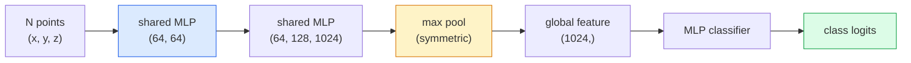

# 3D视觉——点云与NeRF

> 3D视觉有两种形式。点云是传感器的原始输出。NeRF是学习到的体素场。两者都回答"空间中有什么，在什么位置"。

**类型：** 学习 + 构建  
**语言：** Python  
**前置知识：** 第4阶段第03课（CNN），第1阶段第12课（张量操作）  
**时间：** ≈45分钟  

## 学习目标

- 区分显式（点云、网格、体素）和隐式（有符号距离场、NeRF）3D表示，并了解各自的适用场景
- 理解PointNet的对称函数技巧，该技巧使神经网络对无序点集具有置换不变性
- 追溯NeRF前向传播流程：光线投射、体渲染、位置编码、MLP密度+颜色头
- 使用`nerfstudio`或`instant-ngp`从少量带有姿态的图像进行预训练3D重建

## 问题

相机生成2D图像。激光雷达生成一组无序的3D点。运动恢复结构（SfM）管道生成稀疏的3D关键点云。NeRF从少量带有姿态的图像重建整个3D场景。所有这些都属于"视觉"，但没有一个看起来像CNN期望的密集张量。

3D视觉之所以重要，是因为几乎所有高价值的机器人任务都在3D中进行：抓取、避障、导航、AR遮挡、3D内容捕获。只理解2D图像的视觉工程师将被排除在该领域增长最快的部分之外（AR/VR内容、机器人技术、自动驾驶系统、面向房地产或建筑的NeRF三维重建）。

两种表示因不同原因而占据主导地位。点云是传感器免费提供的结果。NeRF及其后续方法（3D高斯泼溅、神经SDF）则是你让神经网络学习场景时得到的结果。

## 概念

### 点云

点云是R^3中N个点的无序集合，每个点可选地带有特征（颜色、强度、法线）。

```
cloud = [
  (x1, y1, z1, r1, g1, b1),
  (x2, y2, z2, r2, g2, b2),
  ...
  (xN, yN, zN, rN, gN, bN),
]
```

没有网格，没有连接性。两个属性使点云对神经网络具有挑战性：

- **置换不变性** —— 输出不能依赖于点的顺序。
- **可变N** —— 单个模型必须处理不同大小的点云。

PointNet（Qi et al., 2017）用一个想法解决了这两个问题：对每个点应用共享MLP，然后通过一个对称函数（最大池化）进行聚合。结果是一个固定大小的向量，不依赖于顺序。

```
f(P) = max_{p in P} MLP(p)
```

这是PointNet的整个核心。更深的变体（PointNet++、Point Transformer）增加了分层采样和局部聚合，但对对称函数技巧本身没有改变。

### PointNet架构



"共享MLP"意味着相同的MLP在每个点上独立运行。为提升效率，实现时通常采用在点维度上的1x1卷积。

### 神经辐射场（NeRF）

NeRF（Mildenhall et al., 2020）回答了"能否从N张照片重建3D场景？"这个问题，并用一个本身就是场景的神经网络来回答。该网络将`(x, y, z, 观察方向)`映射到`(密度, 颜色)`。渲染新视角就是在这个网络上进行光线投射循环。

```
NeRF MLP:  (x, y, z, theta, phi) -> (sigma, r, g, b)

To render a pixel (u, v) of a new view:
  1. Cast a ray from the camera through pixel (u, v)
  2. Sample points along the ray at distances t_1, t_2, ..., t_N
  3. Query the MLP at each point
  4. Composite the colours weighted by (1 - exp(-sigma * dt))
  5. The sum is the rendered pixel colour
```

损失函数将渲染出的像素与训练照片中的真实像素进行比较。通过渲染步骤的反向传播更新MLP。没有任何3D真值，没有显式几何——场景存储在MLP的权重中。

### NeRF中的位置编码

直接在`(x, y, z)`上的普通MLP无法表示高频细节，因为MLP具有偏向低频的光谱偏差。NeRF通过在每个坐标输入MLP之前将其编码为傅里叶特征向量来解决这个问题：

```
gamma(p) = (sin(2^0 pi p), cos(2^0 pi p), sin(2^1 pi p), cos(2^1 pi p), ...)
```

最高可达L=10个频率级别。这与Transformer用于位置的技巧相同，并再次出现在扩散时间条件中（第10课）。没有它，NeRF会显得模糊。

### 体渲染

```
C(r) = sum_i T_i * (1 - exp(-sigma_i * delta_i)) * c_i

T_i  = exp(- sum_{j<i} sigma_j * delta_j)
delta_i = t_{i+1} - t_i
```

`T_i`是透射率——光线到达点i时剩余的光量。`(1 - exp(-sigma_i * delta_i))`是点i处的不透明度。`c_i`是颜色。最终像素是沿光线的加权和。

### 取代NeRF的方法

纯NeRF训练缓慢（数小时），渲染缓慢（每张图像数秒）。之后的演变：

- **Instant-NGP**（2022）—— 哈希网格编码取代了MLP的位置输入；训练只需数秒。
- **Mip-NeRF 360** —— 处理无边界场景和抗锯齿。
- **3D高斯泼溅**（2023）—— 用数百万个3D高斯代替体素场；训练数分钟，实时渲染。当前生产环境默认选择。

2026年几乎每个真实的NeRF产品实际上都是3D高斯泼溅。但其心智模型仍然是NeRF。

### 数据集与基准

- **ShapeNet** —— 3D CAD模型的点云分类与分割。
- **ScanNet** —— 真实室内扫描，用于分割。
- **KITTI** —— 室外激光雷达点云，用于自动驾驶。
- **NeRF Synthetic / Blended MVS** —— 用于视图合成的带姿态图像数据集。
- **Mip-NeRF 360 数据集** —— 无边界真实场景。

## 构建

### 步骤1：PointNet分类器

```python
import torch
import torch.nn as nn

class PointNet(nn.Module):
    def __init__(self, num_classes=10):
        super().__init__()
        self.mlp1 = nn.Sequential(
            nn.Conv1d(3, 64, 1),    nn.BatchNorm1d(64),   nn.ReLU(inplace=True),
            nn.Conv1d(64, 64, 1),   nn.BatchNorm1d(64),   nn.ReLU(inplace=True),
        )
        self.mlp2 = nn.Sequential(
            nn.Conv1d(64, 128, 1),  nn.BatchNorm1d(128),  nn.ReLU(inplace=True),
            nn.Conv1d(128, 1024, 1), nn.BatchNorm1d(1024), nn.ReLU(inplace=True),
        )
        self.head = nn.Sequential(
            nn.Linear(1024, 512),   nn.BatchNorm1d(512),  nn.ReLU(inplace=True),
            nn.Dropout(0.3),
            nn.Linear(512, 256),    nn.BatchNorm1d(256),  nn.ReLU(inplace=True),
            nn.Dropout(0.3),
            nn.Linear(256, num_classes),
        )

    def forward(self, x):
        # x: (N, 3, num_points) — transposed for Conv1d
        x = self.mlp1(x)
        x = self.mlp2(x)
        x = torch.max(x, dim=-1)[0]       # (N, 1024)
        return self.head(x)

pts = torch.randn(4, 3, 1024)
net = PointNet(num_classes=10)
print(f"output: {net(pts).shape}")
print(f"params: {sum(p.numel() for p in net.parameters()):,}")
```

约160万个参数。每点云处理1024个点。

### 步骤2：位置编码

```python
def positional_encoding(x, L=10):
    """
    x: (..., D) -> (..., D * 2 * L)
    """
    freqs = 2.0 ** torch.arange(L, dtype=x.dtype, device=x.device)
    args = x.unsqueeze(-1) * freqs * 3.141592653589793
    sinc = torch.cat([args.sin(), args.cos()], dim=-1)
    return sinc.reshape(*x.shape[:-1], -1)

x = torch.randn(5, 3)
y = positional_encoding(x, L=10)
print(f"input:  {x.shape}")
print(f"encoded: {y.shape}     # (5, 60)")
```

乘以`2^l * pi`得到逐渐增高的频率。

### 步骤3：微型NeRF MLP

```python
class TinyNeRF(nn.Module):
    def __init__(self, L_pos=10, L_dir=4, hidden=128):
        super().__init__()
        self.L_pos = L_pos
        self.L_dir = L_dir
        pos_dim = 3 * 2 * L_pos
        dir_dim = 3 * 2 * L_dir
        self.trunk = nn.Sequential(
            nn.Linear(pos_dim, hidden), nn.ReLU(inplace=True),
            nn.Linear(hidden, hidden),  nn.ReLU(inplace=True),
            nn.Linear(hidden, hidden),  nn.ReLU(inplace=True),
            nn.Linear(hidden, hidden),  nn.ReLU(inplace=True),
        )
        self.sigma = nn.Linear(hidden, 1)
        self.color = nn.Sequential(
            nn.Linear(hidden + dir_dim, hidden // 2), nn.ReLU(inplace=True),
            nn.Linear(hidden // 2, 3), nn.Sigmoid(),
        )

    def forward(self, x, d):
        x_enc = positional_encoding(x, self.L_pos)
        d_enc = positional_encoding(d, self.L_dir)
        h = self.trunk(x_enc)
        sigma = torch.relu(self.sigma(h)).squeeze(-1)
        rgb = self.color(torch.cat([h, d_enc], dim=-1))
        return sigma, rgb

nerf = TinyNeRF()
x = torch.randn(128, 3)
d = torch.randn(128, 3)
s, c = nerf(x, d)
print(f"sigma: {s.shape}   rgb: {c.shape}")
```

相比于原始NeRF（两个深度为8的MLP主干）较小。足以演示架构。

### 步骤4：沿光线的体渲染

```python
def volumetric_render(sigma, rgb, t_vals):
    """
    sigma: (..., N_samples)
    rgb:   (..., N_samples, 3)
    t_vals: (N_samples,) distances along the ray
    """
    delta = torch.cat([t_vals[1:] - t_vals[:-1], torch.full_like(t_vals[:1], 1e10)])
    alpha = 1.0 - torch.exp(-sigma * delta)
    trans = torch.cumprod(torch.cat([torch.ones_like(alpha[..., :1]), 1.0 - alpha + 1e-10], dim=-1), dim=-1)[..., :-1]
    weights = alpha * trans
    rendered = (weights.unsqueeze(-1) * rgb).sum(dim=-2)
    depth = (weights * t_vals).sum(dim=-1)
    return rendered, depth, weights


N = 64
t_vals = torch.linspace(2.0, 6.0, N)
sigma = torch.rand(N) * 0.5
rgb = torch.rand(N, 3)
rendered, depth, weights = volumetric_render(sigma, rgb, t_vals)
print(f"rendered colour: {rendered.tolist()}")
print(f"depth:           {depth.item():.2f}")
```

一条光线，64个采样点，合成单个RGB像素和深度值。

## 使用

在实际工作中：

- `nerfstudio`（Tancik et al.）—— 当前NeRF / Instant-NGP / 高斯泼溅的参考库。命令行加上Web查看器。
- `pytorch3d`（Meta）—— 可微渲染、点云工具、网格操作。
- `open3d` —— 点云处理、配准、可视化。

在部署中，3D高斯泼溅很大程度上取代了纯NeRF，因为其渲染速度快100倍。重建质量相当。

## 交付

本课程产出：

- `outputs/prompt-3d-task-router.md` —— 一个提示，根据任务和输入数据路由到正确的3D表示（点云、网格、体素、NeRF、高斯泼溅）。
- `outputs/skill-point-cloud-loader.md` —— 一个技能，编写一个PyTorch `Dataset`，用于处理.ply / .pcd / .xyz文件，包含正确的归一化、居中处理和点采样。

## 练习

1. **（简单）** 证明PointNet是置换不变的：将同一个点云运行两次，其中一次打乱点的顺序。验证输出在浮点噪声范围内相同。
2. **（中等）** 实现一个最小化的光线生成函数，给定相机内参和姿态，为H x W图像的每个像素生成光线起点和方向。
3. **（困难）** 在一个由彩色立方体渲染视图（通过可微渲染或简单光线追踪生成）组成的合成数据集上训练一个TinyNeRF。报告第1、10、100个epoch的渲染损失。模型在哪个epoch开始产生可辨识的视图？

## 关键术语

| 术语 | 人们怎么说 | 实际含义 |
|------|------------|----------|
| 点云 | "来自激光雷达的3D点" | (x, y, z)的无序集合 + 每个点可选特征 |
| PointNet | "第一个处理点云的神经网络" | 每个点共享MLP + 对称（最大）池化；通过构造实现置换不变性 |
| NeRF | "作为场景的MLP" | 将 (x, y, z, 方向) 映射到 (密度, 颜色) 的网络；通过光线投射渲染 |
| 位置编码 | "傅里叶特征" | 将每个坐标编码为多个频率的sin/cos，以克服MLP的低频偏差 |
| 体渲染 | "光线积分" | 使用透射率和alpha将沿光线的采样点合成到单个像素中 |
| Instant-NGP | "哈希网格NeRF" | 用多分辨率哈希网格取代NeRF的坐标MLP；速度提升100-1000倍 |
| 3D高斯泼溅 | "数百万个高斯" | 场景 = 3D高斯集合；实时渲染，数分钟训练 |
| SDF | "有符号距离场" | 返回到最近表面的有符号距离的函数；另一种隐式表示 |

## 延伸阅读

- [PointNet (Qi et al., 2017)](https://arxiv.org/abs/1612.00593) —— 置换不变分类器
- [NeRF (Mildenhall et al., 2020)](https://arxiv.org/abs/2003.08934) —— 将照片的3D重建变为神经网络问题的论文
- [Instant-NGP (Müller et al., 2022)](https://arxiv.org/abs/2201.05989) —— 哈希网格，1000倍加速
- [3D Gaussian Splatting (Kerbl et al., 2023)](https://arxiv.org/abs/2308.04079) —— 在产线中取代NeRF的架构
