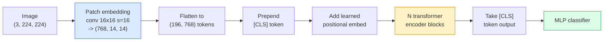

# Vision Transformers (ViT)

> 将图像切分为补丁，将每个补丁视为一个单词，运行标准 Transformer。不再回头。

**类型：** 构建  
**语言：** Python  
**前置知识：** 第七阶段第 02 课（自注意力）、第四阶段第 04 课（图像分类）  
**时长：** 约 45 分钟

## 学习目标

- 从零实现补丁嵌入、可学习位置嵌入、分类标记和 Transformer 编码器模块，构建一个最小化的 ViT
- 解释为什么 ViT 曾被认需要大规模预训练数据，直到 DeiT 和 MAE 证明并非如此
- 在架构先验（无先验、局部窗口注意力、卷积骨干）方面比较 ViT、Swin 和 ConvNeXt
- 使用 `timm` 和标准的线性探测 / 微调方法，在一个小数据集上微调预训练的 ViT

## 问题

十年来，卷积一直是计算机视觉的代名词。CNN 具有很强的归纳偏置——局部性、平移等变性——人们曾认为这一点无法被取代。然而 Dosovitskiy 等人（2020 年）证明，一个被应用到展平图像补丁上的普通 Transformer，没有任何卷积机制，就能在大规模下匹配甚至超越最好的 CNN。

关键在“大规模”。在 ImageNet-1k 上 ViT 输给了 ResNet。但在 ImageNet-21k 或 JFT-300M 上预训练后再在 ImageNet-1k 上微调的 ViT 则胜出了。结论是 Transformer 缺乏有用的先验，但可以通过足够的数据来学习。后续工作（DeiT、MAE、DINO）表明，借助合适的训练策略——强数据增强、自监督预训练、蒸馏——ViT 在小数据上也能良好训练。

到 2026 年，纯 CNN 在边缘设备上仍然具有竞争力（ConvNeXt 是最强的），但 Transformer 主导了其他一切：分割（Mask2Former、SegFormer）、检测（DETR、RT-DETR）、多模态（CLIP、SigLIP）、视频（VideoMAE、VJEPA）。ViT 的模块结构是必须掌握的。

## 概念

### 流程



七个步骤：补丁 → 标记 → 注意力 → 分类器。每个变体（DeiT、Swin、ConvNeXt、MAE 预训练）只改变其中一两个步骤，其余保持不变。

### 补丁嵌入

第一个卷积是秘密。核大小为 16，步长为 16，因此 224×224 的图像变成 14×14 的 16×16 补丁网格，每个补丁被投影到一个 768 维的嵌入。这一个卷积同时完成了补丁划分和线性投影。

```
Input:  (3, 224, 224)
Conv (3 -> 768, k=16, s=16, no padding):
Output: (768, 14, 14)
Flatten spatial: (196, 768)
```

196 个补丁 = 196 个标记。每个标记的特征维度为 768（ViT-B）、1024（ViT-L）或 1280（ViT-H）。

### 分类标记

一个可学习的向量被追加到序列的开头：

```
tokens = [CLS; patch_1; patch_2; ...; patch_196]   shape (197, 768)
```

经过 N 个 Transformer 模块后，`[CLS]` 的输出就是全局图像表示。分类头只读取这一个向量。

### 位置嵌入

Transformer 没有内置的空间位置概念。为每个标记添加一个可学习向量：

```
tokens = tokens + learned_pos_embedding   (also shape (197, 768))
```

该嵌入是模型的一个参数；梯度训练使其适应二维图像结构。虽然也存在二维正弦替代方案，但在实践中很少使用。

### Transformer 编码器模块

标准结构：多头自注意力、MLP、残差连接、pre-LayerNorm。

```
x = x + MSA(LN(x))
x = x + MLP(LN(x))

MLP is two-layer with GELU: Linear(d -> 4d) -> GELU -> Linear(4d -> d)
```

ViT-B/16 堆叠了 12 个这样的模块，每个模块有 12 个注意力头，共 8600 万参数。

### 为何使用 pre-LN

早期 Transformer 使用 post-LN（`x = LN(x + sublayer(x))`），在不使用预热训练的情况下很难训练超过 6-8 层。Pre-LN（`x = x + sublayer(LN(x))`）可以在不需要预热的情况下稳定训练更深的网络。所有 ViT 和所有现代 LLM 都使用 pre-LN。

### 补丁大小的权衡

- 16×16 补丁 → 196 个标记，标准配置。
- 32×32 补丁 → 49 个标记，更快但分辨率更低。
- 8×8 补丁 → 784 个标记，更精细但注意力代价为 O(n²)，随序列长度增长严重。

更大的补丁 = 更少的标记 = 更快但空间细节更少。SwinV2 在分层窗口中使用 4×4 补丁。

### DeiT 在 ImageNet-1k 上训练 ViT 的策略

原始 ViT 需要 JFT-300M 才能击败 CNN。DeiT（Touvron 等人，2020）仅使用 ImageNet-1k 就将 ViT-B 训练到 81.8% top-1 准确率，其四个改变是：

1. 强数据增强：RandAugment、Mixup、CutMix、Random Erasing。
2. 随机深度（训练期间随机丢弃整个模块）。
3. 重复增强（同一图像在每个批次中被采样 3 次）。
4. 来自 CNN 教师模型的蒸馏（可选，进一步提升准确率）。

每一个现代 ViT 训练策略都源自 DeiT。

### Swin 与 ConvNeXt

- **Swin**（Liu 等人，2021）——基于窗口的注意力。每个模块在局部窗口内进行注意力计算；交替模块通过移动窗口来混合窗口间的信息。在保留注意力算子的同时，重新引入了类似 CNN 的局部性先验。
- **ConvNeXt**（Liu 等人，2022）——重新设计的 CNN，匹配 Swin 的架构选择（深度可分离卷积、LayerNorm、GELU、倒瓶颈结构）。表明差距不在于“注意力 vs 卷积”，而在于“现代训练策略 + 架构”。

到了 2026 年，ConvNeXt-V2 和 Swin-V2 都是生产级模型；具体选择取决于你的推理栈（ConvNeXt 在边缘设备上编译更好）和预训练语料库。

### MAE 预训练

掩码自编码器（He 等人，2022）：随机掩码 75% 的补丁，训练编码器仅处理可见的 25%，训练一个小解码器从编码器的输出重建被掩码的补丁。预训练后，丢弃解码器并微调解码器。

MAE 使得 ViT 可以仅靠 ImageNet-1k 训练，达到 SOTA，并且是当前默认的自监督策略。

## 构建它

### 第 1 步：补丁嵌入

```python
import torch
import torch.nn as nn

class PatchEmbedding(nn.Module):
    def __init__(self, in_channels=3, patch_size=16, dim=192, image_size=64):
        super().__init__()
        assert image_size % patch_size == 0
        self.proj = nn.Conv2d(in_channels, dim, kernel_size=patch_size, stride=patch_size)
        num_patches = (image_size // patch_size) ** 2
        self.num_patches = num_patches

    def forward(self, x):
        x = self.proj(x)
        return x.flatten(2).transpose(1, 2)
```

一个卷积、一个展平、一个转置。这就是从图像到标记的完整步骤。

### 第 2 步：Transformer 模块

Pre-LN、多头自注意力、带 GELU 的 MLP、残差连接。

```python
class Block(nn.Module):
    def __init__(self, dim, num_heads, mlp_ratio=4, dropout=0.0):
        super().__init__()
        self.ln1 = nn.LayerNorm(dim)
        self.attn = nn.MultiheadAttention(dim, num_heads, dropout=dropout, batch_first=True)
        self.ln2 = nn.LayerNorm(dim)
        self.mlp = nn.Sequential(
            nn.Linear(dim, dim * mlp_ratio),
            nn.GELU(),
            nn.Dropout(dropout),
            nn.Linear(dim * mlp_ratio, dim),
            nn.Dropout(dropout),
        )

    def forward(self, x):
        a, _ = self.attn(self.ln1(x), self.ln1(x), self.ln1(x), need_weights=False)
        x = x + a
        x = x + self.mlp(self.ln2(x))
        return x
```

`nn.MultiheadAttention` 负责拆分为头、缩放点积注意力以及输出投影。`batch_first=True` 使得形状为 `(N, seq, dim)`。

### 第 3 步：ViT

```python
class ViT(nn.Module):
    def __init__(self, image_size=64, patch_size=16, in_channels=3,
                 num_classes=10, dim=192, depth=6, num_heads=3, mlp_ratio=4):
        super().__init__()
        self.patch = PatchEmbedding(in_channels, patch_size, dim, image_size)
        num_patches = self.patch.num_patches
        self.cls_token = nn.Parameter(torch.zeros(1, 1, dim))
        self.pos_embed = nn.Parameter(torch.zeros(1, num_patches + 1, dim))
        self.blocks = nn.ModuleList([
            Block(dim, num_heads, mlp_ratio) for _ in range(depth)
        ])
        self.ln = nn.LayerNorm(dim)
        self.head = nn.Linear(dim, num_classes)
        nn.init.trunc_normal_(self.pos_embed, std=0.02)
        nn.init.trunc_normal_(self.cls_token, std=0.02)

    def forward(self, x):
        x = self.patch(x)
        cls = self.cls_token.expand(x.size(0), -1, -1)
        x = torch.cat([cls, x], dim=1)
        x = x + self.pos_embed
        for blk in self.blocks:
            x = blk(x)
        x = self.ln(x[:, 0])
        return self.head(x)

vit = ViT(image_size=64, patch_size=16, num_classes=10, dim=192, depth=6, num_heads=3)
x = torch.randn(2, 3, 64, 64)
print(f"output: {vit(x).shape}")
print(f"params: {sum(p.numel() for p in vit.parameters()):,}")
```

约 280 万参数——一个可以在 CPU 上运行的小型 ViT。真正的 ViT-B 有 8600 万参数；使用相同的类定义，只需设置 `dim=768, depth=12, num_heads=12`。

### 第 4 步：合理性检查——单张图像推理

```python
logits = vit(torch.randn(1, 3, 64, 64))
print(f"logits: {logits}")
print(f"probs:  {logits.softmax(-1)}")
```

应该能无错误运行。概率之和为 1。

## 使用它

`timm` 提供了带有 ImageNet 预训练权重的所有 ViT 变体。一行代码即可：

```python
import timm

model = timm.create_model("vit_base_patch16_224", pretrained=True, num_classes=10)
```

到 2026 年，`timm` 是视觉 Transformer 的生产默认库。它支持 ViT、DeiT、Swin、Swin-V2、ConvNeXt、ConvNeXt-V2、MaxViT、MViT、EfficientFormer 以及数十种其他变体，并且使用相同的 API。

对于多模态工作（图像 + 文本），`transformers` 提供了 CLIP、SigLIP、BLIP-2、LLaVA。所有这些模型的图像编码器都是 ViT 的变体。

## 交付它

本课程将产出：

- `outputs/prompt-vit-vs-cnn-picker.md` —— 一个提示词，根据数据集大小、算力和推理栈在 ViT、ConvNeXt 或 Swin 之间做出选择。
- `outputs/skill-vit-patch-and-pos-embed-inspector.md` —— 一个技能，用于验证 ViT 的补丁嵌入和位置嵌入的形状是否与模型预期的序列长度匹配，从而捕获最常见的移植错误。

## 练习

1. **（简单）** 打印上述小型 ViT 前向传播中每一个中间张量的形状。确认：输入 `(N, 3, 64, 64)` -> 补丁 `(N, 16, 192)` -> 加上 CLS `(N, 17, 192)` -> 分类器输入 `(N, 192)` -> 输出 `(N, num_classes)`。
2. **（中等）** 在第 4 课合成的 CIFAR 数据集上微调一个预训练的 `timm` ViT-S/16，并与在同一数据上微调的 ResNet-18 进行比较。报告训练时间和最终准确率。
3. **（困难）** 为小型 ViT 实现 MAE 预训练：随机掩码 75% 的补丁，训练编码器加一个小解码器来重建被掩码的补丁。评估预训练前后在线性探测上的准确率。

## 关键术语

| 术语 | 人们常说的 | 实际含义 |
|------|------------|----------|
| 补丁嵌入 | “第一个卷积” | 一个卷积，其核大小 = 步长 = 补丁大小；将图像转换为一个标记嵌入网格 |
| 分类标记 | “[CLS]” | 一个可学习的向量，追加到标记序列的开头；其最终输出是全局图像表示 |
| 位置嵌入 | “可学习位置” | 一个可学习向量，添加到每个标记上，使 Transformer 知道每个补丁来自何处 |
| Pre-LN | “在子层之前做 LayerNorm” | 稳定的 Transformer 变体：`x + sublayer(LN(x))` 而不是 `LN(x + sublayer(x))` |
| 多头注意力 | “并行注意力” | 标准 Transformer 注意力被拆分为 num_heads 个独立的子空间，之后再拼接起来 |
| ViT-B/16 | “Base, patch 16” | 标准尺寸：dim=768, depth=12, heads=12, patch_size=16, image=224；约 8600 万参数 |
| DeiT | “数据高效的 ViT” | 仅使用 ImageNet-1k 并结合强数据增强训练的 ViT；证明大规模预训练数据集并非绝对必要 |
| MAE | “掩码自编码器” | 自监督预训练：随机掩码 75% 的补丁，然后重建；是当前主流的 ViT 预训练策略 |

## 进一步阅读

- [An Image is Worth 16x16 Words (Dosovitskiy et al., 2020)](https://arxiv.org/abs/2010.11929) —— ViT 论文
- [DeiT: Data-efficient Image Transformers (Touvron et al., 2020)](https://arxiv.org/abs/2012.12877) —— 如何仅用 ImageNet-1k 训练 ViT
- [Masked Autoencoders are Scalable Vision Learners (He et al., 2022)](https://arxiv.org/abs/2111.06377) —— MAE 预训练
- [timm documentation](https://huggingface.co/docs/timm) —— 你在生产中会使用的所有视觉 Transformer 的参考
