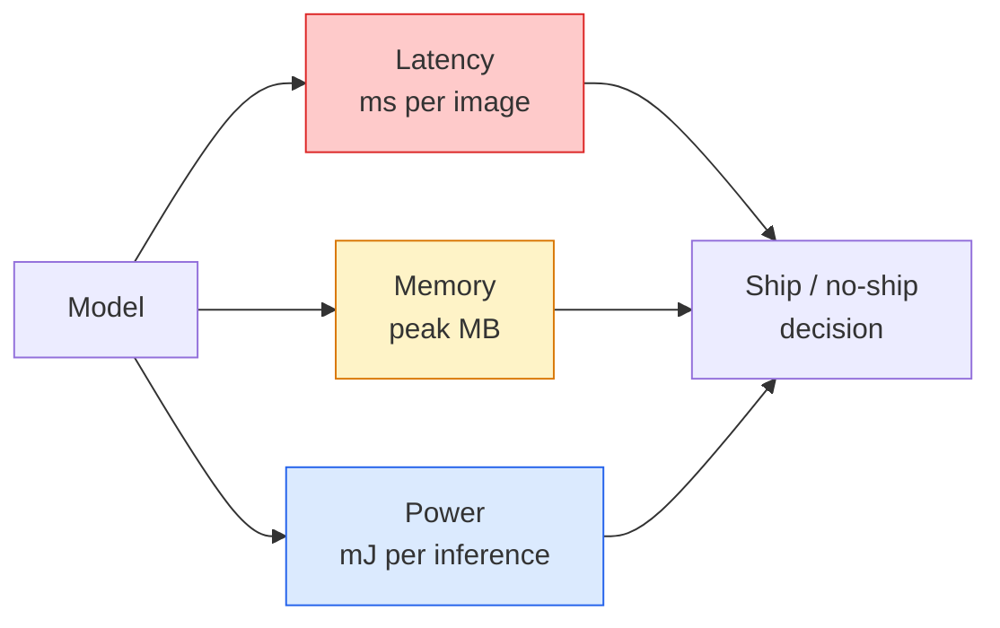

# 实时视觉——边缘部署

> 边缘推理是这样一门学问：让一个准确率 90 的模型在只有 2 GB RAM 的设备上以 30 fps 运行。每一个百分点的准确率都要用毫秒级的延迟来交换。

**类型：** 学习 + 构建  
**语言：** Python  
**前置知识：** 第四阶段第 04 课（图像分类），第十阶段第 11 课（量化）  
**时间：** 约 75 分钟  

## 学习目标

- 测量任意 PyTorch 模型的推理延迟、峰值内存和吞吐量，并能解读 FLOPs / 参数 / 延迟之间的权衡。
- 使用 PyTorch 的后训练量化将视觉模型量化为 INT8，并验证准确率损失小于 1%。
- 导出为 ONNX，并使用 ONNX Runtime 或 TensorRT 编译；列举三种最常见的导出失败及其修复方法。
- 解释在边缘约束条件下，何时选择 MobileNetV3、EfficientNet-Lite、ConvNeXt-Tiny 或 MobileViT。

## 问题

训练时的视觉模型是一个浮点数怪兽：1 亿参数，每次前向传播 10 GFLOPs，2 GB 显存。这些都无法装进手机、汽车信息娱乐单元、工业相机或无人机。部署视觉系统意味着将同样的预测能力塞进 100 倍小的预算中。

三个主要调节旋钮：模型选择（使用相同方法但更小的架构）、量化（INT8 而非 FP32）以及推理运行时（ONNX Runtime、TensorRT、Core ML、TFLite）。正确使用它们，区别在于一个只能在工作站上运行的演示和一个能在 30 美元的相机模块上出货的产品。

本课首先建立测量纪律（无法测量的东西就无法优化），然后逐步介绍这三个旋钮。目标不是学会每一个边缘运行时，而是知道有哪些杠杆可用，以及如何验证每个杠杆是否按预期工作。

## 概念

### 三个预算



- **延迟**：p50、p95、p99。仅平均 p50 会掩盖对实时系统至关重要的尾部行为。
- **峰值内存**：设备曾见过的最大值，而非稳态平均值。这一点很重要，因为在嵌入式目标上内存不足是致命的。
- **功耗/能量**：电池供电设备上每次推理的毫焦耳数。通常用 CPU/GPU 利用率 × 时间作为代理。

一张（模型、延迟、内存、准确率）表格是做出边缘决策的依据。每个单元格都应在目标设备上测量，而不是在工作站上。

### 测量纪律

每个边缘性能分析应遵循三条规则：

1. **预热**模型：在测量前先用 5-10 次虚拟前向传播预热。冷缓存和 JIT 编译会产生不具代表性的初始数字。
2. **同步**GPU 工作负载：在计时块前后使用 `torch.cuda.synchronize()`。否则你测量的是内核调度时间，而非内核执行时间。
3. **固定输入尺寸**到生产分辨率。224x224 上的延迟不等于 512x512 上的延迟。

### FLOPs 作为代理指标

FLOPs（每次推理的浮点运算次数）是一个廉价且与设备无关的延迟代理指标。适用于架构比较，但作为绝对墙钟时间会有误导性。一个 FLOPs 多 10% 的模型在实际中可能快 2 倍，因为它使用了硬件友好的运算（深度可分离卷积编译效果好，而大型 7x7 卷积则不然）。

规则：FLOPs 用于架构搜索，设备上延迟用于部署决策。

### 量化（一段话概括）

将 FP32 权重和激活替换为 INT8。模型大小下降 4 倍，内存带宽下降 4 倍，计算量在具有 INT8 内核的硬件（所有现代移动 SoC、所有配备 Tensor Core 的 NVIDIA GPU）上下降 2-4 倍。对于视觉任务，使用后训练静态量化通常只损失 0.1-1 个百分点的准确率。

类型：

- **动态**——将权重量化为 INT8，激活以 FP 计算。简单，加速幅度小。
- **静态（后训练）**——量化权重 + 在少量校准集上校准激活范围。比动态快得多。
- **量化感知训练（QAT）**——在训练期间模拟量化，使模型学会适应。准确率最好，但需要带标签的数据。

对于视觉任务，后训练静态量化用 5% 的努力获得 95% 的收益。只有当 PTQ 导致的准确率损失不可接受时才使用 QAT。

### 剪枝与蒸馏

- **剪枝**——移除不重要的权重（基于幅度）或通道（结构化剪枝）。在过参数化的模型上效果良好；对已经小巧的架构帮助不大。
- **蒸馏**——训练一个小学生模型模仿一个大教师模型的 logits。通常能恢复因缩小模型而损失的大部分准确率。这是生产级边缘模型的标准做法。

### 推理运行时

- **PyTorch eager**——慢，不适合部署。仅用于开发。
- **TorchScript**——已过时。已被 `torch.compile` 和 ONNX 导出取代。
- **ONNX Runtime**——中立的运行时。CPU、CUDA、CoreML、TensorRT、OpenVINO 都有 ONNX 的提供者。从这里开始。
- **TensorRT**——NVIDIA 的编译器。在 NVIDIA GPU（工作站和 Jetson）上延迟最低。可与 ONNX Runtime 集成或独立使用。
- **Core ML**——Apple 的 iOS/macOS 运行时。需要 `.mlmodel` 或 `.mlpackage`。
- **TFLite**——Google 的 Android/ARM 运行时。需要 `.tflite`。
- **OpenVINO**——Intel 的 CPU/VPU 运行时。需要 `.xml` + `.bin`。

实践中：PyTorch -> ONNX -> 为目标平台选择运行时。ONNX 是通用语言。

### 边缘架构选择器

| 预算 | 模型 | 原因 |
|--------|-------|------|
| < 3M 参数 | MobileNetV3-Small | 处处可编译，良好的基线 |
| 3-10M | EfficientNet-Lite-B0 | TFLite 上每参数最佳准确率 |
| 10-20M | ConvNeXt-Tiny | 每参数准确率最佳，CPU 友好 |
| 20-30M | MobileViT-S 或 EfficientViT | 具有 ImageNet 准确率的 Transformer |
| 30-80M | Swin-V2-Tiny | 如果栈支持窗口注意力 |

除非有特殊理由，否则全部量化为 INT8。

## 构建

### 第 1 步：正确测量延迟

```python
import time
import torch

def measure_latency(model, input_shape, device="cpu", warmup=10, iters=50):
    model = model.to(device).eval()
    x = torch.randn(input_shape, device=device)
    with torch.no_grad():
        for _ in range(warmup):
            model(x)
        if device == "cuda":
            torch.cuda.synchronize()
        times = []
        for _ in range(iters):
            if device == "cuda":
                torch.cuda.synchronize()
            t0 = time.perf_counter()
            model(x)
            if device == "cuda":
                torch.cuda.synchronize()
            times.append((time.perf_counter() - t0) * 1000)
    times.sort()
    return {
        "p50_ms": times[len(times) // 2],
        "p95_ms": times[int(len(times) * 0.95)],
        "p99_ms": times[int(len(times) * 0.99)],
        "mean_ms": sum(times) / len(times),
    }
```

预热、同步、使用 `time.perf_counter()`。报告百分位数，而非仅平均值。

### 第 2 步：参数和 FLOP 计数

```python
def parameter_count(model):
    return sum(p.numel() for p in model.parameters())

def flops_estimate(model, input_shape):
    """
    Rough FLOP count for a conv/linear-only model. For production use `fvcore` or `ptflops`.
    """
    total = 0
    def conv_hook(m, inp, out):
        nonlocal total
        c_out, c_in, kh, kw = m.weight.shape
        h, w = out.shape[-2:]
        total += 2 * c_in * c_out * kh * kw * h * w
    def linear_hook(m, inp, out):
        nonlocal total
        total += 2 * m.in_features * m.out_features
    hooks = []
    for m in model.modules():
        if isinstance(m, torch.nn.Conv2d):
            hooks.append(m.register_forward_hook(conv_hook))
        elif isinstance(m, torch.nn.Linear):
            hooks.append(m.register_forward_hook(linear_hook))
    model.eval()
    with torch.no_grad():
        model(torch.randn(input_shape))
    for h in hooks:
        h.remove()
    return total
```

对于真实项目，使用 `fvcore.nn.FlopCountAnalysis` 或 `ptflops`；它们能正确处理所有模块类型。

### 第 3 步：后训练静态量化

```python
def quantise_ptq(model, calibration_loader, backend="x86"):
    import torch.ao.quantization as tq
    model = model.eval().cpu()
    model.qconfig = tq.get_default_qconfig(backend)
    tq.prepare(model, inplace=True)
    with torch.no_grad():
        for x, _ in calibration_loader:
            model(x)
    tq.convert(model, inplace=True)
    return model
```

三个步骤：配置、准备（插入观察器）、用真实数据校准、转换（融合 + 量化）。要求模型已经融合（`Conv -> BN -> ReLU` -> `ConvBnReLU`），这由 `torch.ao.quantization.fuse_modules` 处理。

### 第 4 步：导出为 ONNX

```python
def export_onnx(model, sample_input, path="model.onnx"):
    model = model.eval()
    torch.onnx.export(
        model,
        sample_input,
        path,
        input_names=["input"],
        output_names=["output"],
        dynamic_axes={"input": {0: "batch"}, "output": {0: "batch"}},
        opset_version=17,
    )
    return path
```

`opset_version=17` 是 2026 年的安全默认值。`dynamic_axes` 让你能够以任意批次大小运行 ONNX 模型。

### 第 5 步：基准测试并比较不同方案

```python
import torch.nn as nn
from torchvision.models import mobilenet_v3_small

def compare_regimes():
    model = mobilenet_v3_small(weights=None, num_classes=10)
    params = parameter_count(model)
    flops = flops_estimate(model, (1, 3, 224, 224))
    lat_fp32 = measure_latency(model, (1, 3, 224, 224), device="cpu")
    print(f"FP32 MobileNetV3-Small: {params:,} params  {flops/1e9:.2f} GFLOPs  "
          f"p50={lat_fp32['p50_ms']:.2f}ms  p95={lat_fp32['p95_ms']:.2f}ms")
```

对 `resnet50`、`efficientnet_v2_s` 和 `convnext_tiny` 运行相同的函数，即可得到部署决策所需的对比表。

## 使用

生产环境通常收敛到以下三条路径之一：

- **Web / 无服务器**：PyTorch -> ONNX -> ONNX Runtime（CPU 或 CUDA 提供者）。最简单，对大多数情况足够好。
- **NVIDIA 边缘（Jetson、GPU 服务器）**：PyTorch -> ONNX -> TensorRT。延迟最低，工程工作量最大。
- **移动端**：PyTorch -> ONNX -> Core ML（iOS）或 TFLite（Android）。导出前先量化。

对于测量，`torch-tb-profiler`、`nvprof` / `nsys` 以及 macOS 上的 Instruments 可提供逐层分解。`benchmark_app`（OpenVINO）和 `trtexec`（TensorRT）提供独立的命令行数字。

## 产出

本课产出：

- `outputs/prompt-edge-deployment-planner.md` —— 一个提示模板，根据目标设备和延迟 SLA 选择骨干网络、量化策略和运行时。
- `outputs/skill-latency-profiler.md` —— 一项技能，编写包含预热、同步、百分位数和内存追踪的完整延迟基准测试脚本。

## 练习

1. **（简单）** 在 CPU 上测量 `resnet18`、`mobilenet_v3_small`、`efficientnet_v2_s` 和 `convnext_tiny` 在 224x224 下的 p50 延迟。报告表格，并找出每毫秒准确率最高的架构。
2. **（中等）** 对 `mobilenet_v3_small` 应用后训练静态量化。报告 FP32 与 INT8 的延迟以及在 CIFAR-10 或类似数据集的留出子集上的准确率损失。
3. **（困难）** 将 `convnext_tiny` 导出为 ONNX，通过 `onnxruntime` 的 `CPUExecutionProvider` 运行，并与 PyTorch eager 基线比较延迟。找出 ONNX Runtime 比 PyTorch 更快的第一个层，并解释原因。

## 关键术语

| 术语 | 人们常说 | 实际含义 |
|------|----------|----------|
| 延迟 | “多快” | 从输入到输出的时间；p50/p95/p99 百分位数，非平均值 |
| FLOPs | “模型大小” | 每次前向传播的浮点运算次数；计算成本的粗略代理 |
| INT8 量化 | “8 位” | 将 FP32 权重/激活替换为 8 位整数；大小约 1/4，速度 2-4 倍 |
| PTQ | “后训练量化” | 在不重新训练的情况下量化已训练的模型；简单，通常足够 |
| QAT | “量化感知训练” | 在训练期间模拟量化；准确率最好，需要带标签的数据 |
| ONNX | “中立格式” | 模型交换格式，所有主流推理运行时都支持 |
| TensorRT | “NVIDIA 编译器” | 将 ONNX 编译为针对 NVIDIA GPU 优化的引擎 |
| 蒸馏 | “教师 -> 学生” | 训练一个小模型模仿大模型的 logits；恢复大部分损失的准确率 |

## 延伸阅读

- [EfficientNet (Tan & Le, 2019)](https://arxiv.org/abs/1905.11946) —— 高效架构的复合缩放方法
- [MobileNetV3 (Howard et al., 2019)](https://arxiv.org/abs/1905.02244) —— 移动优先架构，采用 h-swish 和 squeeze-excite
- [A Practical Guide to TensorRT Optimization (NVIDIA)](https://developer.nvidia.com/blog/accelerating-model-inference-with-tensorrt-tips-and-best-practices-for-pytorch-users/) —— 如何真正获得论文中的吞吐量数字
- [ONNX Runtime docs](https://onnxruntime.ai/docs/) —— 量化、图优化、提供者选择
