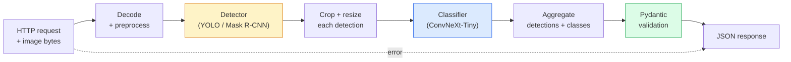

# 构建完整的视觉管线——顶点项目

> 一个生产级视觉系统是由数据契约串联起来的模型与规则链条。各个部件已在本阶段就绪；顶点项目将它们端到端地连接起来。

**类型：** 构建  
**语言：** Python  
**前置条件：** 第四阶段 01-15 课  
**时间：** 约 120 分钟  

## 学习目标

- 设计一个生产级视觉管线，能够检测物体、对它们进行分类，并输出结构化的 JSON —— 且每条失败路径都得到处理
- 将一个检测器（Mask R-CNN 或 YOLO）、一个分类器（ConvNeXt-Tiny）和一个数据契约（Pydantic）集成到同一服务中
- 对端到端管线进行基准测试，并确定第一个瓶颈（通常是预处理，然后是检测器）
- 部署一个极简的 FastAPI 服务，接受图片上传，运行管线，并返回带有分类结果的检测信息

## 问题所在

单个视觉模型有用，但视觉产品是由多个模型串联而成的。零售货架盘点是一个检测器加一个产品分类器再加一个价格 OCR 管线。自动驾驶是 2D 检测器加 3D 检测器加分割器加追踪器加规划器。医疗预筛查是分割器加区域分类器加临床医生界面。

将这些链条连接起来，正是区分机器学习原型与产品的关键。模型之间的每一个接口都是一处新的 bug 滋生地。每一次坐标变换、每一次归一化、每一次掩码缩放，都是静默失败的候选。管线的强度取决于它最薄弱的接口。

本顶点项目搭建了最小可行管线：检测 + 分类 + 结构化输出 + 服务层。第四阶段的其他一切内容都嵌入这个骨架中：将 Mask R-CNN 替换为 YOLOv8，添加 OCR 头部，添加分割分支，添加追踪器。架构是稳定的，组件是可插拔的。

## 概念

### 管线



七个阶段。两个模型阶段是昂贵的；其余五个阶段是 bug 藏身之处。

### 使用 Pydantic 的数据契约

每个模型边界都成为了一个类型化对象。这能化静默失败为显式错误。

```
Detection(
    box: tuple[float, float, float, float],   # (x1, y1, x2, y2), absolute pixels
    score: float,                              # [0, 1]
    class_id: int,                             # from detector's label map
    mask: Optional[list[list[int]]],           # RLE-encoded if present
)

PipelineResult(
    image_id: str,
    detections: list[Detection],
    classifications: list[Classification],
    inference_ms: float,
)
```

当检测器返回的边界框是 `(cx, cy, w, h)` 格式而不是 `(x1, y1, x2, y2)` 时，Pydantic 的验证会在边界处失败，你立刻就能发现，而不是去调试一个悄无声息返回空区域的后续裁剪操作。

### 延迟的根源

几乎所有视觉管线中都有三个不变的真相：

1. **预处理通常是最大的单一模块。** 解码 JPEG、颜色空间转换、缩放——这些是 CPU 密集型的，而且容易被忽视。
2. **检测器主导 GPU 时间。** GPU 时间的 70-90% 用在检测前向传播上。
3. **后处理（NMS、RLE 编码/解码）在 GPU 上廉价，在 CPU 上昂贵。** 始终要针对实际目标进行性能分析。

了解分布情况，才能将优化变成一个优先级列表。

### 失败模式

- **无检测结果** —— 返回空列表，不要崩溃。记录日志。
- **边界框越界** —— 在裁剪前将其限制在图像尺寸内。
- **裁剪区域过小** —— 对于尺寸小于分类器最小输入的边界框，跳过分类。
- **上传损坏** —— 返回 400 响应并附带特定错误码，而不是 500。
- **模型加载失败** —— 在服务启动时失败，而非在第一个请求时。

生产级管线会处理这些情况，而不用编写通用的 `try/except` 来隐藏失败。每个失败都有一个命名代码和一个响应。

### 批处理

生产级服务会服务多个客户端。跨请求批处理检测和分类可以成倍提高吞吐量。权衡：等待批次填满会引入额外延迟。典型设置：收集请求最多 20ms，然后一起批处理，处理，分发响应。`torchserve` 和 `triton` 原生支持这一点；负载可预测的小型服务会自行构建微批处理器。

## 构建它

### 步骤 1：数据契约

```python
from pydantic import BaseModel, Field
from typing import List, Optional, Tuple

class Detection(BaseModel):
    box: Tuple[float, float, float, float]
    score: float = Field(ge=0, le=1)
    class_id: int = Field(ge=0)
    mask_rle: Optional[str] = None


class Classification(BaseModel):
    detection_index: int
    class_id: int
    class_name: str
    score: float = Field(ge=0, le=1)


class PipelineResult(BaseModel):
    image_id: str
    detections: List[Detection]
    classifications: List[Classification]
    inference_ms: float
```

五秒的代码，就能在任何一个严肃管线上省下一小时的调试时间。

### 步骤 2：一个最小的 Pipeline 类

```python
import time
import numpy as np
import torch
from PIL import Image

class VisionPipeline:
    def __init__(self, detector, classifier, class_names,
                 device="cpu", min_crop=32):
        self.detector = detector.to(device).eval()
        self.classifier = classifier.to(device).eval()
        self.class_names = class_names
        self.device = device
        self.min_crop = min_crop

    def preprocess(self, image):
        """
        image: PIL.Image or np.ndarray (H, W, 3) uint8
        returns: CHW float tensor on device
        """
        if isinstance(image, Image.Image):
            image = np.asarray(image.convert("RGB"))
        tensor = torch.from_numpy(image).permute(2, 0, 1).float() / 255.0
        return tensor.to(self.device)

    @torch.no_grad()
    def detect(self, image_tensor):
        return self.detector([image_tensor])[0]

    @torch.no_grad()
    def classify(self, crops):
        if len(crops) == 0:
            return []
        batch = torch.stack(crops).to(self.device)
        logits = self.classifier(batch)
        probs = logits.softmax(-1)
        scores, cls = probs.max(-1)
        return list(zip(cls.tolist(), scores.tolist()))

    def run(self, image, image_id="anonymous"):
        t0 = time.perf_counter()
        tensor = self.preprocess(image)
        det = self.detect(tensor)

        crops = []
        detections = []
        valid_indices = []
        for i, (box, score, cls) in enumerate(zip(det["boxes"], det["scores"], det["labels"])):
            x1, y1, x2, y2 = [max(0, int(b)) for b in box.tolist()]
            x2 = min(x2, tensor.shape[-1])
            y2 = min(y2, tensor.shape[-2])
            detections.append(Detection(
                box=(x1, y1, x2, y2),
                score=float(score),
                class_id=int(cls),
            ))
            if (x2 - x1) < self.min_crop or (y2 - y1) < self.min_crop:
                continue
            crop = tensor[:, y1:y2, x1:x2]
            crop = torch.nn.functional.interpolate(
                crop.unsqueeze(0),
                size=(224, 224),
                mode="bilinear",
                align_corners=False,
            )[0]
            crops.append(crop)
            valid_indices.append(i)

        class_preds = self.classify(crops)

        classifications = []
        for valid_idx, (cls_id, cls_score) in zip(valid_indices, class_preds):
            classifications.append(Classification(
                detection_index=valid_idx,
                class_id=int(cls_id),
                class_name=self.class_names[cls_id],
                score=float(cls_score),
            ))

        return PipelineResult(
            image_id=image_id,
            detections=detections,
            classifications=classifications,
            inference_ms=(time.perf_counter() - t0) * 1000,
        )
```

每个接口都是类型化的。每条失败路径都有特定的处理决策。

### 步骤 3：连接检测器和分类器

```python
from torchvision.models.detection import maskrcnn_resnet50_fpn_v2
from torchvision.models import convnext_tiny

# Use ImageNet-pretrained weights for a realistic pipeline without training
detector = maskrcnn_resnet50_fpn_v2(weights="DEFAULT")
classifier = convnext_tiny(weights="DEFAULT")
class_names = [f"imagenet_class_{i}" for i in range(1000)]

pipe = VisionPipeline(detector, classifier, class_names)

# Smoke test with a synthetic image
test_image = (np.random.rand(400, 600, 3) * 255).astype(np.uint8)
result = pipe.run(test_image, image_id="demo")
print(result.model_dump_json(indent=2)[:500])
```

### 步骤 4：FastAPI 服务

```python
from fastapi import FastAPI, UploadFile, HTTPException
from io import BytesIO

app = FastAPI()
pipe = None  # initialised on startup

@app.on_event("startup")
def load():
    global pipe
    detector = maskrcnn_resnet50_fpn_v2(weights="DEFAULT").eval()
    classifier = convnext_tiny(weights="DEFAULT").eval()
    pipe = VisionPipeline(detector, classifier, class_names=[f"c{i}" for i in range(1000)])

@app.post("/detect")
async def detect_endpoint(file: UploadFile):
    if file.content_type not in {"image/jpeg", "image/png", "image/webp"}:
        raise HTTPException(status_code=400, detail="unsupported image type")
    data = await file.read()
    try:
        img = Image.open(BytesIO(data)).convert("RGB")
    except Exception:
        raise HTTPException(status_code=400, detail="cannot decode image")
    result = pipe.run(img, image_id=file.filename or "upload")
    return result.model_dump()
```

使用 `uvicorn main:app --host 0.0.0.0 --port 8000` 运行。用 `curl -F 'file=@dog.jpg' http://localhost:8000/detect` 测试。

### 步骤 5：对管线进行基准测试

```python
import time

def benchmark(pipe, num_runs=20, image_size=(400, 600)):
    img = (np.random.rand(*image_size, 3) * 255).astype(np.uint8)
    pipe.run(img)  # warm up

    stages = {"preprocess": [], "detect": [], "classify": [], "total": []}
    for _ in range(num_runs):
        t0 = time.perf_counter()
        tensor = pipe.preprocess(img)
        t1 = time.perf_counter()
        det = pipe.detect(tensor)
        t2 = time.perf_counter()
        crops = []
        for box in det["boxes"]:
            x1, y1, x2, y2 = [max(0, int(b)) for b in box.tolist()]
            x2 = min(x2, tensor.shape[-1])
            y2 = min(y2, tensor.shape[-2])
            if (x2 - x1) >= pipe.min_crop and (y2 - y1) >= pipe.min_crop:
                crop = tensor[:, y1:y2, x1:x2]
                crop = torch.nn.functional.interpolate(
                    crop.unsqueeze(0), size=(224, 224), mode="bilinear", align_corners=False
                )[0]
                crops.append(crop)
        pipe.classify(crops)
        t3 = time.perf_counter()
        stages["preprocess"].append((t1 - t0) * 1000)
        stages["detect"].append((t2 - t1) * 1000)
        stages["classify"].append((t3 - t2) * 1000)
        stages["total"].append((t3 - t0) * 1000)

    for stage, times in stages.items():
        times.sort()
        print(f"{stage:12s}  p50={times[len(times)//2]:7.1f} ms  p95={times[int(len(times)*0.95)]:7.1f} ms")
```

在 CPU 上的典型输出：预处理约 3 毫秒，检测 300-500 毫秒，分类 20-40 毫秒，总计 350-550 毫秒。在 GPU 上，检测为 20-40 毫秒，预处理和分类的相对重要性开始增加。

## 使用它

生产模板最终都归结为相同的结构，此外还包括：

- **模型版本控制** —— 始终在响应中记录模型名称和权重哈希值。
- **每个请求的追踪 ID** —— 为每个请求记录每个阶段的耗时，这样你就能将慢响应与阶段关联起来。
- **回退路径** —— 如果分类器超时，则返回不带分类结果的检测结果，而不是整个请求失败。
- **安全过滤器** —— NSFW / PII 过滤器在分类之后、响应离开服务之前运行。
- **批量端点** —— `/detect_batch` 接受图片 URL 列表进行批量处理。

对于生产级服务，`torchserve`、`Triton Inference Server` 和 `BentoML` 开箱即用地处理批处理、版本控制、指标和健康检查。直接运行 `FastAPI` 适用于原型和小规模产品。

## 交付它

本课程产出以下内容：

- `outputs/prompt-vision-service-shape-reviewer.md` —— 一个提示，用于审查视觉服务代码中的契约/响应形状违规，并指出第一个破坏性 bug。
- `outputs/skill-pipeline-budget-planner.md` —— 一项技能，根据目标延迟和吞吐量，为管线的每个阶段分配时间预算，并标记哪个阶段会首先超出预算。

## 练习

1. **（简单）** 在来自任意开放数据集的 10 张图片上运行管线。报告每个阶段的平均耗时以及每张图片的检测数量分布。
2. **（中等）** 在 `Detection` 中添加一个掩码输出字段，并将其编码为 RLE。验证即使对于包含 10 个物体的图片，JSON 大小也保持在 1MB 以内。
3. **（困难）** 在分类器前添加一个微批处理器：收集最多 10ms 内的裁剪结果，一次性通过 GPU 调用进行分类，然后按请求返回结果。测量在 5 个并发请求/秒下的吞吐量提升以及引入的延迟。

## 关键术语

| 术语 | 人们常说的 | 实际含义 |
|------|------------|----------|
| 管线 | “系统” | 一个有序的预处理、推理和后处理步骤链，每对步骤之间有类型化接口 |
| 数据契约 | “模式” | Pydantic / dataclass 定义，每个阶段的输入和输出都遵循该定义；在边界处捕获集成 bug |
| 预处理 | “模型之前” | 解码、颜色转换、缩放、归一化；通常是最大的 CPU 时间消耗者 |
| 后处理 | “模型之后” | NMS、掩码缩放、阈值化、RLE 编码；在 GPU 上廉价，在 CPU 上昂贵 |
| 微批处理器 | “收集后转发” | 一个聚合器，在固定窗口内等待多个请求，然后执行一次批量前向传播 |
| 追踪 ID | “请求 ID” | 每个请求的标识符，在每个阶段记录，以便端到端地追踪慢请求 |
| 失败码 | “命名错误” | 每个失败类别有特定错误码，而不是泛型 500；支持客户端重试逻辑 |
| 健康检查 | “就绪探针” | 一个廉价端点，报告服务是否可以应答；负载均衡器依赖于此 |

## 延伸阅读

- [Full Stack Deep Learning — 模型部署](https://fullstackdeeplearning.com/course/2022/lecture-5-deployment/) —— 生产级 ML 部署的权威概述
- [BentoML 文档](https://docs.bentoml.com) —— 支持批处理、版本控制和指标的服务框架
- [torchserve 文档](https://pytorch.org/serve/) —— PyTorch 的官方服务库
- [NVIDIA Triton Inference Server](https://developer.nvidia.com/triton-inference-server) —— 高吞吐量服务，支持批处理和多模型
