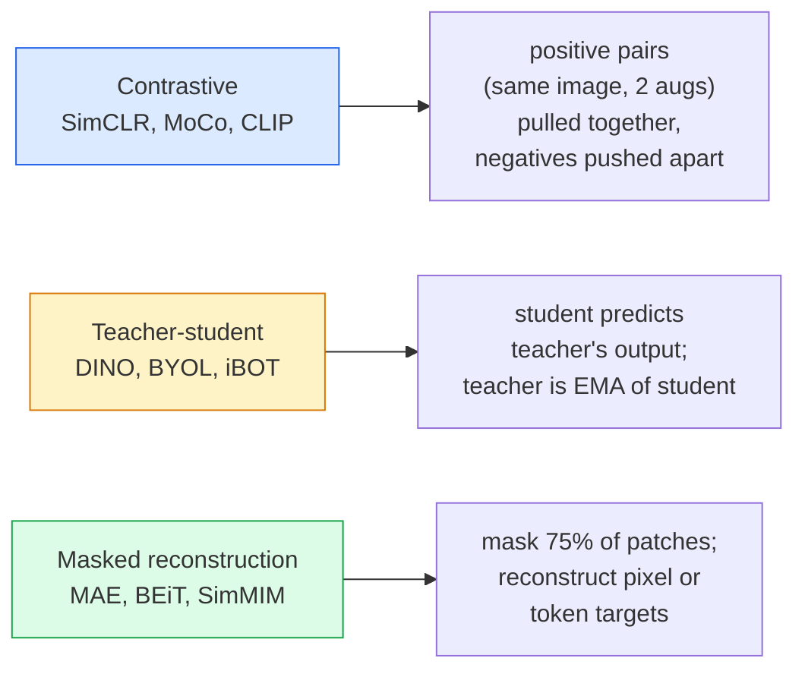

# 自监督视觉 — SimCLR、DINO、MAE

> 标签是有监督视觉的瓶颈。自监督预训练将其移除：从1亿张无标注图像中学习视觉特征，然后在1万张有标注图像上微调。

**类型：** 学习 + 构建  
**语言：** Python  
**前置条件：** 第四阶段第04课（图像分类）、第四阶段第14课（ViT）  
**时间：** ~75分钟

## 学习目标

- 追踪三大自监督家族——对比学习（SimCLR）、师生模型（DINO）、掩码重建（MAE）——并说明各自优化什么
- 从头实现 InfoNCE 损失，并解释为何 batch size 512 可行而 batch size 32 失败
- 解释 MAE 的 75% 掩码比例为何不是随意定的，以及它与 BERT 在文本上使用 15% 有何不同
- 使用 DINOv2 或 MAE ImageNet 检查点进行线性探测和零样本检索

## 问题

有监督的 ImageNet 有 130 万张标注图像，标注成本估计为 1000 万美元。医学和工业数据集更小，标注也更昂贵。每个视觉团队都会问：我们能否在廉价的无标注数据——YouTube 帧、网页抓取、摄像头录像、卫星扫描——上预训练，然后在少量有标注集上微调？

自监督学习就是答案。一个在 LAION 或 JFT 上训练的现代自监督 ViT，微调后能达到或超过有监督的 ImageNet 准确率。它在下游任务（检测、分割、深度估计）上的迁移效果也比有监督预训练更好。DINOv2（Meta，2023）和 MAE（Meta，2022）是当前可转移视觉特征的生产级默认选择。

概念上的转变在于：预文本任务——模型被训练去完成的任务——不必是下游任务。重要的是它迫使模型学习有用的特征。预测灰度图像的颜色、旋转图像并要求模型分类旋转角度、掩码图块并重建——这些方法都奏效过。能够扩展的三种方法是对比学习、师生蒸馏和掩码重建。

## 概念

### 三大家族



### 对比学习（SimCLR）

取一张图像，应用两种随机增强，得到两个视图。将两者通过同一个编码器加上投影头。最小化一个损失，该损失表示“这两个嵌入应该相近”，并且“这个嵌入应该与批次中所有其他图像的嵌入远离”。

```
Loss for positive pair (z_i, z_j) among 2N views per batch:

   L_ij = -log( exp(sim(z_i, z_j) / tau) / sum_k in batch \ {i} exp(sim(z_i, z_k) / tau) )

sim = cosine similarity
tau = temperature (0.1 standard)
```

这就是 InfoNCE 损失。它需要每个正样本对应多个负样本，因此 batch size 很重要——SimCLR 需要 512-8192。MoCo 引入了历史批次的动量队列，将负样本数量与 batch size 解耦。

### 师生模型（DINO）

两个架构相同的网络：学生和教师。教师是学生权重的指数移动平均（EMA）。两者都看到图像的增强视图。学生的输出被训练去匹配教师的输出——没有显式的负样本。

```
loss = CE( student_output(view_1),  teacher_output(view_2) )
     + CE( student_output(view_2),  teacher_output(view_1) )

teacher_weights = m * teacher_weights + (1 - m) * student_weights   (m ≈ 0.996)
```

为什么它不会坍缩成“预测常数”：教师的输出被居中（减去每个维度的均值）并锐化（除以小的温度值）。居中防止某个维度主导；锐化防止输出坍缩为均匀分布。

DINO 正是 DINOv2 扩展的基础，在 1.42 亿张精选图像上训练。得到的特征是当前零样本视觉检索和密集预测的最优水平。

### 掩码重建（MAE）

掩码掉 ViT 输入中 75% 的图块。只将可见的 25% 通过编码器。一个小型解码器接收编码器的输出加上掩码位置的掩码标记，并被训练去重建掩码图块的像素。

```
Encoder:  visible 25% of patches -> features
Decoder:  features + mask tokens at masked positions -> reconstructed pixels
Loss:     MSE between reconstructed and original pixels on masked patches only
```

使 MAE 生效的关键设计选择：

- **75% 掩码比例**——很高。迫使编码器学习语义特征；重建 25% 几乎微不足道（相邻像素高度相关，CNN 就能轻松搞定）。
- **非对称编码器/解码器**——大型 ViT 编码器只看到可见图块；小型解码器（8 层，512 维）处理重建。预训练速度比朴素的 BEiT 快 3 倍。
- **像素空间重建目标**——比 BEiT 的标记化目标更简单，且在 ViT 上效果更好。

预训练后，丢弃解码器。编码器就是特征提取器。

### 为什么是 75% 而不是 15%

BERT 掩码 15% 的 token。MAE 掩码 75%。差异在于信息密度。

- 自然语言的每个 token 熵高。预测 15% 的 token 仍然困难，因为每个掩码位置都有许多合理的补全。
- 图像图块熵低——一个未被掩码的邻域几乎总能精确决定掩码图块的像素。要使预测需要语义理解，就必须激进地掩码。

75% 足够高，使得简单的空间外推无法解决任务；编码器必须表示图像内容。

### 线性探测评估

自监督预训练后，标准评估是**线性探测**：冻结编码器，在其顶部在 ImageNet 标签上训练一个线性分类器。报告 top-1 准确率。

- SimCLR ResNet-50：~71%（2020）
- DINO ViT-S/16：~77%（2021）
- MAE ViT-L/16：~76%（2022）
- DINOv2 ViT-g/14：~86%（2023）

线性探测是特征质量的纯度量；微调通常会额外增加 2-5 个点，但也混入了头部重新训练的影响。

## 构建

### 步骤 1：双视图增强管道

```python
import torch
import torchvision.transforms as T

two_view_train = lambda: T.Compose([
    T.RandomResizedCrop(96, scale=(0.2, 1.0)),
    T.RandomHorizontalFlip(),
    T.ColorJitter(0.4, 0.4, 0.4, 0.1),
    T.RandomGrayscale(p=0.2),
    T.ToTensor(),
])


class TwoViewDataset(torch.utils.data.Dataset):
    def __init__(self, base):
        self.base = base
        self.aug = two_view_train()

    def __len__(self):
        return len(self.base)

    def __getitem__(self, i):
        img, _ = self.base[i]
        v1 = self.aug(img)
        v2 = self.aug(img)
        return v1, v2
```

每个 __getitem__ 返回同一张图像的两个增强视图；不需要标签。

### 步骤 2：InfoNCE 损失

```python
import torch.nn.functional as F

def info_nce(z1, z2, tau=0.1):
    """
    z1, z2: (N, D) L2-normalised embeddings of paired views
    """
    N, D = z1.shape
    z = torch.cat([z1, z2], dim=0)  # (2N, D)
    sim = z @ z.T / tau              # (2N, 2N)

    mask = torch.eye(2 * N, dtype=torch.bool, device=z.device)
    sim = sim.masked_fill(mask, float("-inf"))

    targets = torch.cat([torch.arange(N, 2 * N), torch.arange(0, N)]).to(z.device)
    return F.cross_entropy(sim, targets)
```

在调用前对嵌入进行 L2 归一化。`tau=0.1` 是 SimCLR 默认值；更小的温度会使损失更尖锐，需要更多负样本。

### 步骤 3：InfoNCE 的简单检查

```python
z1 = F.normalize(torch.randn(16, 32), dim=-1)
z2 = z1.clone()
loss_same = info_nce(z1, z2, tau=0.1).item()
z2_random = F.normalize(torch.randn(16, 32), dim=-1)
loss_random = info_nce(z1, z2_random, tau=0.1).item()
print(f"InfoNCE with identical pairs:  {loss_same:.3f}")
print(f"InfoNCE with random pairs:     {loss_random:.3f}")
```

完全相同的配对应该给出低损失（对于大批次和冷温度接近 0）。随机配对应该给出 log(2N-1) = ~log(31) = ~3.4（对于 16 对批次）。

### 步骤 4：MAE 风格的掩码

```python
def random_mask_indices(num_patches, mask_ratio=0.75, seed=0):
    g = torch.Generator().manual_seed(seed)
    n_keep = int(num_patches * (1 - mask_ratio))
    perm = torch.randperm(num_patches, generator=g)
    visible = perm[:n_keep]
    masked = perm[n_keep:]
    return visible.sort().values, masked.sort().values


num_patches = 196
visible, masked = random_mask_indices(num_patches, mask_ratio=0.75)
print(f"visible: {len(visible)} / {num_patches}")
print(f"masked:  {len(masked)} / {num_patches}")
```

简单、快速，且对于给定种子是确定的。真正的 MAE 实现会批量处理并保持每个样本的掩码。

## 使用

DINOv2 是 2026 年的生产标准：

```python
import torch
from transformers import AutoImageProcessor, AutoModel

processor = AutoImageProcessor.from_pretrained("facebook/dinov2-base")
model = AutoModel.from_pretrained("facebook/dinov2-base")
model.eval()

# Per-image embeddings for zero-shot retrieval
with torch.no_grad():
    inputs = processor(images=[pil_image], return_tensors="pt")
    outputs = model(**inputs)
    embedding = outputs.last_hidden_state[:, 0]  # CLS token
```

得到的 768 维嵌入是现代图像检索、密集对应和零样本迁移管道的骨干。在下游任务上微调很少需要超过一个线性头。

对于图像-文本嵌入，SigLIP 或 OpenCLIP 是等效的；对于 MAE 风格的微调，`timm` 仓库提供了每个 MAE 检查点。

## 产出

本课产生的文件：

- `outputs/prompt-ssl-pretraining-picker.md` — 一个提示，根据数据集大小、计算资源和下游任务选择 SimCLR / MAE / DINOv2。
- `outputs/skill-linear-probe-runner.md` — 一个技能，为任何冻结编码器 + 有标注数据集编写线性探测评估。

## 练习

1. **(简单)** 验证当降低对齐良好的嵌入的温度时 InfoNCE 损失下降，当降低随机嵌入的温度时损失上升。绘制 `tau 在 [0.05, 0.1, 0.2, 0.5]` 与损失的图表。
2. **(中等)** 实现一个 DINO 风格的居中缓冲区。展示没有居中的情况下，学生会在几个 epoch 内坍缩为一个常值向量。
3. **(困难)** 使用第 10 课中的 TinyUNet 作为骨干，在 CIFAR-100 上训练 MAE。报告在 10、50 和 200 epoch 的线性探测准确率。展示 MAE 预训练的线性探测在相同的 1000 张图像子集上优于从头训练的有监督线性探测。

## 关键术语

| 术语 | 人们说的 | 实际含义 |
|------|----------|----------|
| 自监督 (Self-supervised) | “无标签” | 一种预文本任务，从无标注数据中产生有用的表示 |
| 预文本任务 (Pretext task) | “假任务” | SSL 期间使用的目标（重建图块、匹配视图）；预训练后丢弃 |
| 线性探测 (Linear probe) | “冻结编码器 + 线性头” | 标准 SSL 评估：仅训练冻结特征之上的线性分类器 |
| InfoNCE | “对比损失” | 对余弦相似度做 softmax；正样本对是目标类，其他都是负样本 |
| EMA 教师 (EMA teacher) | “移动平均教师” | 教师权重是学生权重的指数移动平均；用于 BYOL, MoCo, DINO |
| 掩码比例 (Mask ratio) | “隐藏图块的百分比” | MAE 期间掩码的图块比例；视觉为 75%，文本为 15% |
| 表示坍缩 (Representation collapse) | “常数输出” | SSL 失败情况，编码器对所有输入输出常数向量；通过居中、锐化或负样本防止 |
| DINOv2 | “生产级 SSL 骨干” | Meta 的 2023 年自监督 ViT；2026 年最强的通用图像特征 |

## 进一步阅读

- [SimCLR (Chen et al., 2020)](https://arxiv.org/abs/2002.05709) — 对比学习参考
- [DINO (Caron et al., 2021)](https://arxiv.org/abs/2104.14294) — 使用动量、居中、锐化的师生模型
- [MAE (He et al., 2022)](https://arxiv.org/abs/2111.06377) — ViT 的掩码自编码器预训练
- [DINOv2 (Oquab et al., 2023)](https://arxiv.org/abs/2304.07193) — 将自监督 ViT 扩展为生产级特征
