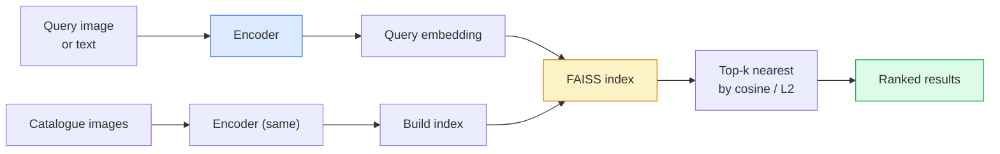

# 图像检索与度量学习

> 检索系统根据嵌入空间中的距离对候选对象进行排序。度量学习是一门塑造该空间的学科，目的是让距离的含义符合你的需求。

**类型：** 构建  
**语言：** Python  
**前置条件：** 第4阶段第14课（ViT）、第4阶段第18课（CLIP）  
**时间：** 约45分钟

## 学习目标

- 解释三元组损失、对比损失和基于代理的度量学习损失，并为给定数据集选择合适的损失
- 正确实现L2归一化和余弦相似度，并审查“相同物品”检索与“相同类别”检索的区别
- 构建一个FAISS索引，通过文本和图像进行查询，并为留出查询集报告recall@K
- 使用DINOv2、CLIP和SigLIP作为现成的嵌入主干，并了解每种方法的适用场景

## 问题

检索在生产视觉系统中无处不在：重复检测、以图搜图、视觉搜索（“查找相似产品”）、人脸重识别、监控中的人物重识别、电商中的实例级匹配。产品问题始终如一：“给定这张查询图像，对我的目录进行排序。”

两个设计决策决定了整个系统。嵌入——生成向量的模型。索引——如何大规模找到最近邻。在2026年，两者都是成熟商品（DINOv2用于嵌入，FAISS用于索引），这提高了门槛：难点在于为你的应用定义*什么算作相似*，然后塑造嵌入空间，使距离与之匹配。

这种塑造就是度量学习。这是一个虽小但杠杆率很高的学科。

## 概念

### 检索概览



### 四大损失族系

| 损失 | 需要 | 优点 | 缺点 |
|------|------|------|------|
| **对比损失** | (锚点, 正例) + 负例 | 简单，适用于任何成对标签 | 没有大量负例时收敛缓慢 |
| **三元组损失** | (锚点, 正例, 负例) | 直观；直接控制间隔 | 困难三元组挖掘代价高 |
| **NT-Xent / InfoNCE** | 成对样本 + 批次内挖掘的负例 | 可扩展到大批次 | 需要大批次或动量队列 |
| **基于代理的损失 (ProxyNCA)** | 仅类别标签 | 快速、稳定、无需挖掘 | 在小数据集上可能过拟合代理 |

对于大多数生产用例，先从预训练主干开始，仅当现成嵌入在测试集上表现不佳时，再添加度量学习微调。

### 三元组损失的形式化定义

```
L = max(0, ||f(a) - f(p)||^2 - ||f(a) - f(n)||^2 + margin)
```

将锚点 `a` 拉近正例 `p`，将其推离负例 `n`，并通过 `margin` 确保存在一个间隔。这种三图像结构可推广到任何相似性排序。

挖掘很重要：容易的三元组（`n` 已经远离 `a`）贡献零损失；只有困难三元组才能教会网络。半困难挖掘（`n` 比 `p` 远，但仍在间隔内）是2016年FaceNet的方法，至今仍占主导地位。

### 余弦相似度 vs L2

两种度量，两种约定：

- **余弦**：向量之间的角度。要求L2归一化的嵌入。
- **L2**：欧氏距离。适用于原始或归一化的嵌入，但通常与L2归一化 + 平方L2配合使用。

对于大多数现代网络，两者等价：当 `||a|| = ||b|| = 1` 时，`||a - b||^2 = 2 - 2 cos(a, b)`。选择与嵌入训练相匹配的约定；混合使用会悄然改变“最近”的含义。

### Recall@K

标准的检索度量：

```
recall@K = fraction of queries where at least one correct match is in the top K results
```

并排报告recall@1、@5、@10。如果recall@10大于0.95而recall@1低于0.5，说明嵌入空间结构正确但排序嘈杂——尝试更长的微调或重排序步骤。

对于重复检测，precision@K更重要，因为每个假阳性都是用户可见的错误。对于视觉搜索，recall@K是产品信号。

### FAISS 一句话简介

Facebook AI相似度搜索。事实上的最近邻搜索库。三种索引选择：

- `IndexFlatIP` / `IndexFlatL2` —— 暴力精确搜索，无需训练。最多约100万向量。
- `IndexIVFFlat` —— 划分为K个单元，仅搜索最近的几个单元。近似、快速、需要训练数据。
- `IndexHNSW` —— 基于图的索引，对多次查询最快，索引体积大。

对于10万向量，你可能想要基于余弦相似度的 `IndexFlatIP`。对于1000万向量，选择 `IndexIVFFlat`。对于1亿以上向量，结合乘积量化（`IndexIVFPQ`）。

### 实例级检索 vs 类别级检索

两个截然不同的问题却同名：

- **类别级** —— “在我的目录中找到猫。” 类别条件相似性；现成的CLIP / DINOv2嵌入效果良好。
- **实例级** —— “在我的目录中找到*这个确切产品*。” 需要对同一类别中视觉相似的对象进行细粒度区分；现成嵌入表现不佳；使用度量学习进行微调很重要。

在选择模型之前，始终问清楚你要解决的是哪一个。

## 构建它

### 步骤1：三元组损失

```python
import torch
import torch.nn.functional as F

def triplet_loss(anchor, positive, negative, margin=0.2):
    d_ap = F.pairwise_distance(anchor, positive, p=2)
    d_an = F.pairwise_distance(anchor, negative, p=2)
    return F.relu(d_ap - d_an + margin).mean()
```

一行代码。适用于L2归一化或原始嵌入。

### 步骤2：半困难挖掘

给定一批嵌入和标签，为每个锚点找到最困难的半困难负例。

```python
def semi_hard_negatives(emb, labels, margin=0.2):
    dist = torch.cdist(emb, emb)
    same_class = labels[:, None] == labels[None, :]
    diff_class = ~same_class
    N = emb.size(0)

    positives = dist.clone()
    positives[~same_class] = float("-inf")
    positives.fill_diagonal_(float("-inf"))
    pos_idx = positives.argmax(dim=1)

    semi_hard = dist.clone()
    semi_hard[same_class] = float("inf")
    d_ap = dist[torch.arange(N), pos_idx].unsqueeze(1)
    semi_hard[dist <= d_ap] = float("inf")
    neg_idx = semi_hard.argmin(dim=1)

    fallback_mask = semi_hard[torch.arange(N), neg_idx] == float("inf")
    if fallback_mask.any():
        hardest = dist.clone()
        hardest[same_class] = float("inf")
        neg_idx = torch.where(fallback_mask, hardest.argmin(dim=1), neg_idx)
    return pos_idx, neg_idx
```

每个锚点获得类内最困难的正例，以及一个比正例远但仍在间隔内的半困难负例。

### 步骤3：Recall@K

```python
def recall_at_k(query_emb, gallery_emb, query_labels, gallery_labels, k=1):
    sim = query_emb @ gallery_emb.T
    _, top_k = sim.topk(k, dim=-1)
    matches = (gallery_labels[top_k] == query_labels[:, None]).any(dim=-1)
    return matches.float().mean().item()
```

在L2归一化嵌入上按内积求top-k等同于按余弦求top-k。报告至少有一个正确邻居的查询比例的平均值。

### 步骤4：整合到一起

```python
import torch
import torch.nn as nn
from torch.optim import Adam

class Encoder(nn.Module):
    def __init__(self, in_dim=128, emb_dim=64):
        super().__init__()
        self.net = nn.Sequential(
            nn.Linear(in_dim, 128), nn.ReLU(),
            nn.Linear(128, emb_dim),
        )

    def forward(self, x):
        return F.normalize(self.net(x), dim=-1)

torch.manual_seed(0)
num_classes = 6
protos = F.normalize(torch.randn(num_classes, 128), dim=-1)

def sample_batch(bs=32):
    labels = torch.randint(0, num_classes, (bs,))
    x = protos[labels] + 0.15 * torch.randn(bs, 128)
    return x, labels

enc = Encoder()
opt = Adam(enc.parameters(), lr=3e-3)

for step in range(200):
    x, y = sample_batch(32)
    emb = enc(x)
    pos_idx, neg_idx = semi_hard_negatives(emb, y)
    loss = triplet_loss(emb, emb[pos_idx], emb[neg_idx])
    opt.zero_grad(); loss.backward(); opt.step()
```

经过几百步后，嵌入聚类形成每个类别一个簇。

## 使用它

2026年的生产堆栈：

- **DINOv2 + FAISS** —— 通用视觉检索。开箱即用。
- **CLIP + FAISS** —— 当查询是文本时。
- **微调后的DINOv2 + FAISS** —— 实例级检索、人脸重识别、时尚、电商。
- **Milvus / Weaviate / Qdrant** —— 围绕FAISS或HNSW的托管向量数据库封装。

对于最新的实例检索，配方是：DINOv2主干，添加嵌入头，在实例标注的成对数据上使用三元组或InfoNCE损失进行微调，在FAISS中建立索引。

## 交付物

本课程产生：

- `outputs/prompt-retrieval-loss-picker.md` —— 一个提示，为给定的检索问题选择三元组损失 / InfoNCE / ProxyNCA。
- `outputs/skill-recall-at-k-runner.md` —— 一个技能，编写一个清晰的评估框架，用于recall@K，包含训练集/验证集/画廊集划分和恰当的数据契约。

## 练习

1. **（简单）** 运行上面的简易示例。使用PCA在训练前后绘制嵌入，观察六个聚类的形成。
2. **（中等）** 添加一个ProxyNCA损失实现：每个类别一个学习到的“代理”，基于余弦相似度的标准交叉熵。与三元组损失在玩具数据上比较收敛速度。
3. **（困难）** 取1000张ImageNet验证图像，使用HuggingFace上的DINOv2生成嵌入，构建一个FAISS平面索引，并报告以相同图像作为查询时的recall@{1, 5, 10}（应为1.0），以及以ImageNet标签为真实标签的留出集上的recall。

## 关键术语

| 术语 | 人们常说的 | 实际含义 |
|------|-----------|----------|
| 度量学习 | “塑造空间” | 训练编码器，使其输出空间中的距离反映目标相似性 |
| 三元组损失 | “拉和推” | L = max(0, d(a, p) - d(a, n) + margin)；经典的度量学习损失 |
| 半困难挖掘 | “有用的负例” | 比正例离锚点更远但仍在间隔内的负例；经验上信息量最大 |
| 基于代理的损失 | “类原型” | 每个类别一个学习到的代理；基于与代理的相似性的交叉熵；无需配对挖掘 |
| Recall@K | “Top-K命中率” | 查询在前K个结果中至少有一个正确结果的比例 |
| 实例检索 | “找到这个确切的东西” | 细粒度匹配；现成特征通常表现不佳 |
| FAISS | “最近邻库” | Facebook的最近邻库；支持精确和近似索引 |
| HNSW | “图索引” | 分层可导航小世界；快速近似最近邻，内存开销小 |

## 延伸阅读

- [FaceNet: A Unified Embedding for Face Recognition (Schroff et al., 2015)](https://arxiv.org/abs/1503.03832) —— 三元组损失 / 半困难挖掘论文
- [In Defense of the Triplet Loss for Person Re-Identification (Hermans et al., 2017)](https://arxiv.org/abs/1703.07737) —— 三元组微调实用指南
- [FAISS documentation](https://github.com/facebookresearch/faiss/wiki) —— 每种索引及其权衡
- [SMoT: Metric Learning Taxonomy (Kim et al., 2021)](https://arxiv.org/abs/2010.06927) —— 现代损失及其关系的综述
