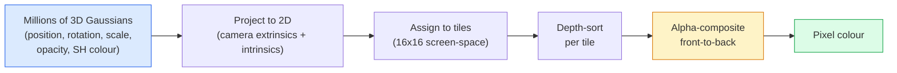

# 从零开始理解3D高斯泼溅

> 一个场景是数百万个3D高斯体的云团。每个高斯体都有位置、朝向、缩放、不透明度以及随视角变化的颜色。对它们进行光栅化，通过光栅化反向传播，就完成了。

**类型：** 动手构建
**语言：** Python
**前置知识：** 阶段4第13课（3D视觉与NeRF）、阶段1第12课（张量运算）、阶段4第10课（扩散基础，可选）
**时长：** 约90分钟

## 学习目标

- 解释为什么到2026年，3D高斯泼溅取代NeRF成为照片级逼真3D重建的生产环境默认方法
- 列出每个高斯体的六个参数（位置、旋转四元数、缩放、不透明度、球谐颜色、可选特征），并说明每个参数占用多少个浮点数
- 使用alpha合成从零实现一个2D高斯泼溅光栅化器，然后展示3D情况如何投影到相同的循环中
- 使用nerfstudio、gsplat或SuperSplat从20-50张照片重建场景，并导出为KHR_gaussian_splatting glTF扩展或OpenUSD 26.03的UsdVolParticleField3DGaussianSplat模式

## 问题所在

NeRF将场景存储为MLP的权重。每个渲染的像素都需要沿光线进行数百次MLP查询。训练需要数小时，渲染需要数秒，并且权重无法编辑——如果你想在场景中移动一把椅子，必须重新训练。

3D高斯泼溅（Kerbl, Kopanas, Leimkühler, Drettakis, SIGGRAPH 2023）彻底改变了这一切。一个场景是一组显式的3D高斯体。渲染是GPU光栅化，速度超过100 fps。训练只需要几分钟。编辑是直接的：平移一部分高斯体就能移动椅子。到2026年，Khronos Group已经批准了高斯泼溅的glTF扩展，OpenUSD 26.03发布了高斯泼溅模式，Zillow和Apartments.com用它来渲染房地产，大多数关于3D重建的新研究论文都是核心3DGS思想的变体。

心智模型很简单，但数学有足够多的活动部件，大多数介绍直接从光栅化开始，跳过了投影和球谐函数。本课程将构建整个内容——首先是一个2D版本，然后是3D扩展。

## 概念

### 高斯体携带什么

一个3D高斯体是空间中的一个参数化斑点，具有以下属性：

```
position         mu         (3,)    centre in world coordinates
rotation         q          (4,)    unit quaternion encoding orientation
scale            s          (3,)    log-scales per axis (exponentiated at render time)
opacity          alpha      (1,)    post-sigmoid opacity [0, 1]
SH coefficients  c_lm       (3 * (L+1)^2,)   view-dependent colour
```

旋转 + 缩放构建了一个3x3协方差矩阵：`Sigma = R S S^T R^T`。这就是高斯体在3D中的形状。球谐函数允许颜色随观察方向变化——高光、微妙光泽、随视角变化的光泽——而无需存储每视角纹理。使用阶数3的SH，每个颜色通道有16个系数，每个高斯体仅颜色就需要48个浮点数。

一个场景通常有1-5百万个高斯体。每个大约存储60个浮点数（3 + 4 + 3 + 1 + 48 + 杂项）。对于一个五百万高斯体的场景，这大约是240 MB——远小于具有逐点纹理的等效点云，并且比NeRF的MLP权重在高分辨率下重新渲染小一个数量级。

### 光栅化，而非光线行进



五个步骤，全部适合GPU。每个像素没有MLP查询。单张RTX 3080 Ti以147 fps渲染600万个泼溅体。

### 投影步骤

位于世界位置`mu`且具有3D协方差`Sigma`的3D高斯体投影到屏幕位置`mu'`处的2D高斯体，其2D协方差为`Sigma'`：

```
mu' = project(mu)
Sigma' = J W Sigma W^T J^T          (2 x 2)

W = viewing transform (rotation + translation of camera)
J = Jacobian of the perspective projection at mu'
```

2D高斯体的足迹是一个椭圆，其轴是`Sigma'`的特征向量。该椭圆内的每个像素都会接收到该高斯体的贡献，权重为`exp(-0.5 * (p - mu')^T Sigma'^-1 (p - mu'))`。

### Alpha合成规则

对于一个像素，覆盖它的高斯体按从后到前排序（或者等效地，使用反公式从前到后）。颜色使用与20世纪80年代以来每个半透明光栅化器相同的方程合成：

```
C_pixel = sum_i alpha_i * T_i * c_i

T_i = prod_{j < i} (1 - alpha_j)       transmittance up to i
alpha_i = opacity_i * exp(-0.5 * d^T Sigma'^-1 d)   local contribution
c_i = eval_SH(SH_i, view_direction)    view-dependent colour
```

这与NeRF的体积渲染**是同一个方程**，只不过现在是在显式的稀疏高斯体集上，而不是沿光线密集采样。这种一致性解释了为什么渲染质量与NeRF相当——两者都在积分相同的辐射场方程。

### 为什么这是可微分的

每一步——投影、瓦片分配、alpha合成、SH评估——相对于高斯体参数都是可微的。给定一张真实图像，计算渲染像素的损失，通过光栅化器反向传播，通过梯度下降更新所有`(mu, q, s, alpha, c_lm)`。经过约30,000次迭代，高斯体找到它们正确的位置、缩放和颜色。

### 密集化与剪枝

一组固定的高斯体无法覆盖复杂的场景。训练包括两种自适应机制：

- **克隆**：当高斯体的梯度幅度较大但其缩放较小时，在其当前位置克隆一个——这里需要更多细节。
- **拆分**：当一个大规模高斯体的梯度较高时，将其拆分为两个较小的高斯体——一个大高斯体太光滑，无法拟合该区域。
- **剪枝**：删除不透明度低于阈值的高斯体——它们没有贡献。

每N次迭代运行一次密集化。一个场景通常从约10万个初始高斯体（从SfM点播种）开始，在训练结束时增长到1-5M。

### 球谐函数（一段话）

随视角变化的颜色是单位球面上的函数`c(direction)`。球谐函数是球面上的傅里叶基。截断到阶数`L`，每个通道得到`(L+1)^2`个基函数。对新视角评估颜色是学习到的SH系数与在观察方向评估的基之间的点积。阶数0 = 一个系数 = 恒定颜色。阶数3 = 16个系数 = 足以捕获朗伯着色、高光和新月反射。标准高斯泼溅论文默认使用阶数3。

### 2026年的生产环境栈

```
1. Capture         smartphone / DJI drone / handheld scanner
2. SfM / MVS       COLMAP or GLOMAP derives camera poses + sparse points
3. Train 3DGS      nerfstudio / gsplat / inria official / PostShot (~10-30 min on RTX 4090)
4. Edit            SuperSplat / SplatForge (clean floaters, segment)
5. Export          .ply -> glTF KHR_gaussian_splatting or .usd (OpenUSD 26.03)
6. View            Cesium / Unreal / Babylon.js / Three.js / Vision Pro
```

### 4D与生成变体

- **4D高斯泼溅**——高斯体是时间的函数；用于体积视频（《超人2026》，A$AP Rocky的《Helicopter》）。
- **生成式泼溅**——文生泼溅模型（World Labs的Marble）能够凭空想象整个场景。
- **3D高斯无迹变换**——NVIDIA NuRec用于自动驾驶模拟的变体。

## 动手构建

### 第一步：一个2D高斯体

我们首先构建一个2D光栅化器。3D情况在投影后简化为它。

```python
import torch
import torch.nn as nn
import torch.nn.functional as F


def eval_2d_gaussian(means, covs, points):
    """
    means:  (G, 2)      centres
    covs:   (G, 2, 2)   covariance matrices
    points: (H, W, 2)   pixel coordinates
    returns: (G, H, W)  density at every pixel for every Gaussian
    """
    G = means.size(0)
    H, W, _ = points.shape
    flat = points.view(-1, 2)
    inv = torch.linalg.inv(covs)
    diff = flat[None, :, :] - means[:, None, :]
    d = torch.einsum("gpi,gij,gpj->gp", diff, inv, diff)
    density = torch.exp(-0.5 * d)
    return density.view(G, H, W)
```

`einsum`对每一对（高斯体，像素）执行二次型`diff^T Sigma^-1 diff`。

### 第二步：2D泼溅光栅化器

从后到前的Alpha合成。在2D中深度没有意义，所以我们使用一个学习的每高斯体标量来确定顺序。

```python
def rasterise_2d(means, covs, colours, opacities, depths, image_size):
    """
    means:     (G, 2)
    covs:      (G, 2, 2)
    colours:   (G, 3)
    opacities: (G,)     in [0, 1]
    depths:    (G,)     per-Gaussian scalar used for ordering
    image_size: (H, W)
    returns:   (H, W, 3) rendered image
    """
    H, W = image_size
    yy, xx = torch.meshgrid(
        torch.arange(H, dtype=torch.float32, device=means.device),
        torch.arange(W, dtype=torch.float32, device=means.device),
        indexing="ij",
    )
    points = torch.stack([xx, yy], dim=-1)

    densities = eval_2d_gaussian(means, covs, points)
    alphas = opacities[:, None, None] * densities
    alphas = alphas.clamp(0.0, 0.99)

    order = torch.argsort(depths)
    alphas = alphas[order]
    colours_sorted = colours[order]

    T = torch.ones(H, W, device=means.device)
    out = torch.zeros(H, W, 3, device=means.device)
    for i in range(means.size(0)):
        a = alphas[i]
        out += (T * a)[..., None] * colours_sorted[i][None, None, :]
        T = T * (1.0 - a)
    return out
```

速度不快——真正的实现使用基于瓦片的CUDA内核——但数学完全正确且完全可微。

### 第三步：可训练的2D泼溅场景

```python
class Splats2D(nn.Module):
    def __init__(self, num_splats=128, image_size=64, seed=0):
        super().__init__()
        g = torch.Generator().manual_seed(seed)
        H, W = image_size, image_size
        self.means = nn.Parameter(torch.rand(num_splats, 2, generator=g) * torch.tensor([W, H]))
        self.log_scale = nn.Parameter(torch.ones(num_splats, 2) * math.log(2.0))
        self.rot = nn.Parameter(torch.zeros(num_splats))  # single angle in 2D
        self.colour_logits = nn.Parameter(torch.randn(num_splats, 3, generator=g) * 0.5)
        self.opacity_logit = nn.Parameter(torch.zeros(num_splats))
        self.depth = nn.Parameter(torch.rand(num_splats, generator=g))

    def covs(self):
        s = torch.exp(self.log_scale)
        c, si = torch.cos(self.rot), torch.sin(self.rot)
        R = torch.stack([
            torch.stack([c, -si], dim=-1),
            torch.stack([si, c], dim=-1),
        ], dim=-2)
        S = torch.diag_embed(s ** 2)
        return R @ S @ R.transpose(-1, -2)

    def forward(self, image_size):
        covs = self.covs()
        colours = torch.sigmoid(self.colour_logits)
        opacities = torch.sigmoid(self.opacity_logit)
        return rasterise_2d(self.means, covs, colours, opacities, self.depth, image_size)
```

`log_scale`、`opacity_logit`和`colour_logits`都是无约束参数，在渲染时通过正确的激活函数映射。这是每个3DGS实现的标准模式。

### 第四步：将2D高斯体拟合到目标图像

```python
import math
import numpy as np

def make_target(size=64):
    yy, xx = np.meshgrid(np.arange(size), np.arange(size), indexing="ij")
    img = np.zeros((size, size, 3), dtype=np.float32)
    # Red circle
    mask = (xx - 20) ** 2 + (yy - 20) ** 2 < 10 ** 2
    img[mask] = [1.0, 0.2, 0.2]
    # Blue square
    mask = (np.abs(xx - 45) < 8) & (np.abs(yy - 40) < 8)
    img[mask] = [0.2, 0.3, 1.0]
    return torch.from_numpy(img)


target = make_target(64)
model = Splats2D(num_splats=64, image_size=64)
opt = torch.optim.Adam(model.parameters(), lr=0.05)

for step in range(200):
    pred = model((64, 64))
    loss = F.mse_loss(pred, target)
    opt.zero_grad(); loss.backward(); opt.step()
    if step % 40 == 0:
        print(f"step {step:3d}  mse {loss.item():.4f}")
```

经过200步，64个高斯体稳定在两个形状上。这就是整个思想——在显式几何基元上进行梯度下降。

### 第五步：从2D到3D

3D扩展保持相同的循环。增加的内容：

1. 每个高斯体的旋转是四元数，而不是单个角度。
2. 协方差为`R S S^T R^T`，其中`R`由四元数构建，`S = diag(exp(log_scale))`。
3. 投影`(mu, Sigma) -> (mu', Sigma')`使用相机外参和`mu`处透视投影的雅可比矩阵。
4. 颜色变为球谐函数展开；在观察方向进行评估。
5. 深度排序基于实际的相机空间z，而不是学习的标量。

每个生产环境实现（`gsplat`、`inria/gaussian-splatting`、`nerfstudio`）都使用基于瓦片的CUDA内核在GPU上精确执行此操作。

### 第六步：球谐函数评估

直到阶数3的SH基每个通道有16项。评估：

```python
def eval_sh_degree_3(sh_coeffs, dirs):
    """
    sh_coeffs: (..., 16, 3)   last dim is RGB channels
    dirs:      (..., 3)       unit vectors
    returns:   (..., 3)
    """
    C0 = 0.282094791773878
    C1 = 0.488602511902920
    C2 = [1.092548430592079, 1.092548430592079,
          0.315391565252520, 1.092548430592079,
          0.546274215296039]
    x, y, z = dirs[..., 0], dirs[..., 1], dirs[..., 2]
    x2, y2, z2 = x * x, y * y, z * z
    xy, yz, xz = x * y, y * z, x * z

    result = C0 * sh_coeffs[..., 0, :]
    result = result - C1 * y[..., None] * sh_coeffs[..., 1, :]
    result = result + C1 * z[..., None] * sh_coeffs[..., 2, :]
    result = result - C1 * x[..., None] * sh_coeffs[..., 3, :]

    result = result + C2[0] * xy[..., None] * sh_coeffs[..., 4, :]
    result = result + C2[1] * yz[..., None] * sh_coeffs[..., 5, :]
    result = result + C2[2] * (2.0 * z2 - x2 - y2)[..., None] * sh_coeffs[..., 6, :]
    result = result + C2[3] * xz[..., None] * sh_coeffs[..., 7, :]
    result = result + C2[4] * (x2 - y2)[..., None] * sh_coeffs[..., 8, :]

    # degree 3 terms omitted here for brevity; full 16-coefficient version in the code file
    return result
```

学习到的`sh_coeffs`为该高斯体存储“每个方向的颜色”。在渲染时，针对当前视图方向进行评估，得到3维RGB向量。

## 使用它

对于实际的3DGS工作，使用`gsplat`（Meta）或`nerfstudio`：

```bash
pip install nerfstudio gsplat
ns-download-data example
ns-train splatfacto --data path/to/data
```

`splatfacto`是nerfstudio的3DGS训练器。在RTX 4090上，典型场景的运行时间为10-30分钟。

2026年重要的导出选项：

- `.ply` — 原始高斯体点云（可移植，文件最大）。
- `.splat` — PlayCanvas / SuperSplat量化格式。
- glTF `KHR_gaussian_splatting` — Khronos标准，跨浏览器可移植（2026年2月RC版本）。
- OpenUSD `UsdVolParticleField3DGaussianSplat` — USD原生格式，适用于NVIDIA Omniverse和Vision Pro管线。

对于4D/动态场景，`4DGS`和`Deformable-3DGS`将相同的机制扩展到随时间变化的均值和透明度。

## 交付成果

本课程产出：

- `outputs/prompt-3dgs-capture-planner.md` — 一个提示词，用于为给定场景类型规划采集会话（照片数量、相机路径、光照）。
- `outputs/skill-3dgs-export-router.md` — 一个技能，根据下游查看器或引擎选择正确的导出格式（`.ply` / `.splat` / glTF / USD）。

## 练习

1. **（简单）** 在上方不同的合成图像上运行2D泼溅训练器。将`num_splats`在`[16, 64, 256]`中变化，绘制每个的MSE与步骤的关系图。找出收益递减点。
2. **（中等）** 扩展2D光栅化器，支持通过阶数2的谐波函数依赖于标量“视角”的每高斯体RGB颜色。在一对目标图像上进行训练，并验证模型能重建两者。
3. **（困难）** 克隆`nerfstudio`，在你拥有的任何场景（书桌、植物、人脸、房间）的20张照片上训练`splatfacto`。导出为glTF `KHR_gaussian_splatting`，并在查看器（Three.js `GaussianSplats3D`、SuperSplat、Babylon.js V9）中打开。报告训练时间、高斯体数量和渲染fps。

## 关键术语

| 术语 | 人们说的 | 实际含义 |
|------|----------|----------|
| 3DGS | "高斯泼溅" | 显式场景表示，由数百万个具有位置、旋转、缩放、不透明度、SH颜色的3D高斯体组成 |
| 协方差 | "高斯体的形状" | `Sigma = R S S^T R^T`；一个高斯体的朝向和各向异性缩放 |
| Alpha合成 | "从后到前混合" | 与NeRF的体积渲染相同的方程，现在作用于显式稀疏集 |
| 密集化 | "克隆与拆分" | 在重建欠拟合区域自适应添加新高斯体 |
| 剪枝 | "删除低不透明度" | 移除训练中透明度降至接近零的高斯体 |
| 球谐函数 | "随视角变化的颜色" | 球面上的傅里叶基；将颜色存储为观察方向的函数 |
| Splatfacto | "nerfstudio的3DGS" | 2026年训练3DGS最简单的路径 |
| `KHR_gaussian_splatting` | "glTF标准" | Khronos 2026扩展，使3DGS在浏览器和引擎之间可移植 |

## 延伸阅读

- [3D Gaussian Splatting for Real-Time Radiance Field Rendering (Kerbl et al., SIGGRAPH 2023)](https://repo-sam.inria.fr/fungraph/3d-gaussian-splatting/) — 原始论文
- [gsplat (Meta/nerfstudio)](https://github.com/nerfstudio-project/gsplat) — 生产质量的CUDA光栅化器
- [nerfstudio Splatfacto](https://docs.nerf.studio/nerfology/methods/splat.html) — 参考训练配方
- [Khronos KHR_gaussian_splatting extension](https://github.com/KhronosGroup/glTF/blob/main/extensions/2.0/Khronos/KHR_gaussian_splatting/README.md) — 2026年可移植格式
- [OpenUSD 26.03 release notes](https://openusd.org/release/) — `UsdVolParticleField3DGaussianSplat`模式
- [THE FUTURE 3D State of Gaussian Splatting 2026](https://www.thefuture3d.com/blog-0/2026/4/4/state-of-gaussian-splatting-2026) — 行业概览
