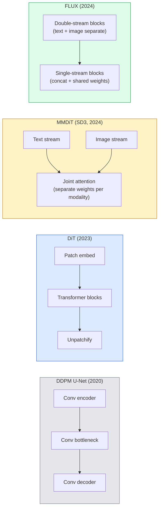

# 扩散变换器与整流流

> U-Net并非扩散的秘诀。将其替换为变换器，将噪声调度改为直线流，于是你得到了SD3、FLUX以及每一个2026年的文生图模型。

**类型：** 学习 + 构建  
**语言：** Python  
**前置知识：** 第4阶段第10课（扩散DDPM）、第4阶段第14课（ViT）、第7阶段第02课（自注意力）  
**时长：** 约75分钟  

## 学习目标

- 追溯从U-Net DDPM（第10课）到扩散变换器（DiT）、MMDiT（SD3）以及单流+双流DiT（FLUX）的演变过程
- 解释整流流：为什么噪声与数据之间的直线轨迹能让模型仅用20步而非1000步完成采样
- 实现一个微型DiT块和一个整流流训练循环，每段代码均不超过100行
- 根据架构、参数量和许可证区分模型变体（SD3、FLUX.1-dev、FLUX.1-schnell、Z-Image、Qwen-Image）

## 问题

第10课构建了一个带U-Net去噪器的DDPM。这套方案在2020-2023年间占据主导地位：U-Net + beta调度 + 噪声预测损失。它产生了Stable Diffusion 1.5和2.1以及DALL-E 2。

而2026年的每一个顶尖文生图模型都已经超越了它。Stable Diffusion 3、FLUX、SD4、Z-Image、Qwen-Image、Hunyuan-Image——没有一个使用U-Net。它们使用扩散变换器（DiT）。SD3和FLUX还将DDPM噪声调度替换为整流流，后者拉直了从噪声到数据的路径，并通过一致性或蒸馏变体实现了1-4步推理。

这一转变之所以重要，是因为它让基于扩散的图像生成变得可控、提示准确（SD3/SD4解决了文字渲染问题），并且达到了生产级别的速度。理解DiT + 整流流，就是理解2026年的生成式图像技术栈。

## 概念

### 从U-Net到变换器



- **DiT**（Peebles & Xie, 2023）—— 将U-Net替换为基于ViT的变换器，作用于潜在空间的图像块。通过自适应层归一化（AdaLN）进行条件控制。
- **MMDiT**（SD3, Esser et al., 2024）—— 两条流，分别为文本和图像标记使用独立的权重，共享联合注意力。
- **FLUX**（Black Forest Labs, 2024）—— 前N个块为类似SD3的双流，后面的块将标记拼接并共享权重（单流），以在更深层时提高效率。
- **Z-Image**（2025）—— 一个高效的6B参数单流DiT，挑战“不惜一切代价扩大规模”的观念。

### 整流流（一句话概括）

DDPM将正向过程定义为一个带噪声的SDE，其中`x_t`逐渐被破坏。学习的逆向过程是第二个SDE，需要通过1000个小步求解。

整流流定义了干净数据与纯噪声之间的**直线**插值：

```
x_t = (1 - t) * x_0 + t * epsilon,     t in [0, 1]
```

训练网络预测速度 `v_theta(x_t, t) = epsilon - x_0` —— 即从干净数据指向噪声的直线路径方向（`dx_t/dt`）。采样时，你沿着这个速度反向积分，从噪声逐步走向数据。得到的ODE非常接近一条直线，因此采样所需的积分步数大大减少。

SD3将这种方法称为**整流流匹配**。FLUX、Z-Image以及大多数2026年的模型都使用相同的目标函数。典型推理步数：20-30步欧拉法（确定性）对比旧DDPM机制下的50+步DDIM。蒸馏/涡轮/schnell/LCM变体可降至1-4步。

### AdaLN条件控制

DiT通过**自适应层归一化**来对时间步和类别/文本进行条件控制：从条件向量中预测`scale`和`shift`，并在LayerNorm之后应用它们。这比U-Net中的FiLM式调制更简洁，也是所有现代DiT的默认方式。

```
cond -> MLP -> (scale, shift, gate)
norm(x) * (1 + scale) + shift, then residual add * gate
```

### SD3与FLUX中的文本编码器

- **SD3** 使用三个文本编码器：两个CLIP模型 + T5-XXL。嵌入被拼接后作为图像流的文本条件。
- **FLUX** 使用一个CLIP-L + T5-XXL。
- **Qwen-Image / Z-Image** 变体使用自研的文本编码器，与其基础LLM对齐。

文本编码器是SD3/FLUX在理解提示方面远胜SD1.5的重要原因。仅T5-XXL就有4.7B参数。

### 无分类器引导依然有效

整流流改变了采样器，而非条件控制。无分类器引导（训练时有10%概率丢弃文本，推理时混合有条件和无条件预测）与整流流配合工作。大多数2026年模型使用引导尺度3.5-5——低于SD1.5的7.5，因为整流流模型默认更紧密地遵循提示。

### Consistency、Turbo、Schnell、LCM

这四个名称对应同一个思想：将一个慢速的多步模型蒸馏成一个快速的少步模型。

- **LCM（潜在一致性模型）** —— 训练一个学生模型，使其从任何中间`x_t`一步预测最终的`x_0`。
- **SDXL Turbo / FLUX schnell** —— 通过对抗性扩散蒸馏训练的1-4步模型。
- **SD Turbo** —— 将OpenAI风格的一致性模型适配到潜在扩散。

任何新模型的生产部署都会同时提供“全质量”检查点和“turbo / schnell”变体。Schnell（德语“快”，Black Forest Labs的命名惯例）可在1-4步内运行，适合实时管线。

### 2026年模型格局

| 模型 | 参数量 | 架构 | 许可证 |
|------|--------|------|--------|
| Stable Diffusion 3 Medium | 2B | MMDiT | SAI社区 |
| Stable Diffusion 3.5 Large | 8B | MMDiT | SAI社区 |
| FLUX.1-dev | 12B | 双流+单流DiT | 非商业 |
| FLUX.1-schnell | 12B | 同上，已蒸馏 | Apache 2.0 |
| FLUX.2 | — | 迭代FLUX.1 | 混合 |
| Z-Image | 6B | S3-DiT（可扩展单流） | 宽松许可 |
| Qwen-Image | ~20B | DiT + Qwen文本塔 | Apache 2.0 |
| Hunyuan-Image-3.0 | ~80B | DiT | 研究用途 |
| SD4 Turbo | 3B | DiT + 蒸馏 | SAI商业 |

FLUX.1-schnell是2026年的开源默认选择。Z-Image是效率领先者。FLUX.2和SD4是当前质量顶尖的。

### 这次阶段转变为何重要

DDPM + U-Net有效。DiT + 整流流**更好、更快，并且扩展更干净**。这一转变类似于NLP中从RNN到变换器的过渡：两种架构都解决了相同问题，但变换器能够扩展并占据主导。2026年关于图像、视频或3D生成的每一篇论文都使用DiT形状的去噪器，并且通常采用整流流目标函数。U-Net DDPM现在主要是教学用途（第10课）。

## 构建

### 步骤1：带AdaLN的DiT块

```python
import torch
import torch.nn as nn


class AdaLNZero(nn.Module):
    """
    Adaptive LayerNorm with a gate. Predicts (scale, shift, gate) from the conditioning.
    Init such that the whole block starts as identity ("zero init").
    """

    def __init__(self, dim, cond_dim):
        super().__init__()
        self.norm = nn.LayerNorm(dim, elementwise_affine=False)
        self.mlp = nn.Linear(cond_dim, dim * 3)
        nn.init.zeros_(self.mlp.weight)
        nn.init.zeros_(self.mlp.bias)

    def forward(self, x, cond):
        scale, shift, gate = self.mlp(cond).chunk(3, dim=-1)
        h = self.norm(x) * (1 + scale.unsqueeze(1)) + shift.unsqueeze(1)
        return h, gate.unsqueeze(1)


class DiTBlock(nn.Module):
    def __init__(self, dim=192, heads=3, mlp_ratio=4, cond_dim=192):
        super().__init__()
        self.adaln1 = AdaLNZero(dim, cond_dim)
        self.attn = nn.MultiheadAttention(dim, heads, batch_first=True)
        self.adaln2 = AdaLNZero(dim, cond_dim)
        self.mlp = nn.Sequential(
            nn.Linear(dim, dim * mlp_ratio),
            nn.GELU(),
            nn.Linear(dim * mlp_ratio, dim),
        )

    def forward(self, x, cond):
        h, gate1 = self.adaln1(x, cond)
        a, _ = self.attn(h, h, h, need_weights=False)
        x = x + gate1 * a
        h, gate2 = self.adaln2(x, cond)
        x = x + gate2 * self.mlp(h)
        return x
```

`AdaLNZero`初始化为恒等映射，因为其MLP权重初始化为0。训练使该块偏离恒等映射；这极大地稳定了深度变换器扩散模型。

### 步骤2：微型DiT

```python
def timestep_embedding(t, dim):
    import math
    half = dim // 2
    freqs = torch.exp(-math.log(10000) * torch.arange(half, device=t.device) / half)
    args = t[:, None].float() * freqs[None]
    return torch.cat([args.sin(), args.cos()], dim=-1)


class TinyDiT(nn.Module):
    def __init__(self, image_size=16, patch_size=2, in_channels=3, dim=96, depth=4, heads=3):
        super().__init__()
        self.patch_size = patch_size
        self.num_patches = (image_size // patch_size) ** 2
        self.patch = nn.Conv2d(in_channels, dim, kernel_size=patch_size, stride=patch_size)
        self.pos = nn.Parameter(torch.zeros(1, self.num_patches, dim))
        self.time_mlp = nn.Sequential(
            nn.Linear(dim, dim * 2),
            nn.SiLU(),
            nn.Linear(dim * 2, dim),
        )
        self.blocks = nn.ModuleList([DiTBlock(dim, heads, cond_dim=dim) for _ in range(depth)])
        self.norm_out = nn.LayerNorm(dim, elementwise_affine=False)
        self.head = nn.Linear(dim, patch_size * patch_size * in_channels)

    def forward(self, x, t):
        n = x.size(0)
        x = self.patch(x)
        x = x.flatten(2).transpose(1, 2) + self.pos
        t_emb = self.time_mlp(timestep_embedding(t, self.pos.size(-1)))
        for blk in self.blocks:
            x = blk(x, t_emb)
        x = self.norm_out(x)
        x = self.head(x)
        return self._unpatchify(x, n)

    def _unpatchify(self, x, n):
        p = self.patch_size
        h = w = int(self.num_patches ** 0.5)
        x = x.view(n, h, w, p, p, -1).permute(0, 5, 1, 3, 2, 4).reshape(n, -1, h * p, w * p)
        return x
```

### 步骤3：整流流训练

```python
import torch.nn.functional as F

def rectified_flow_train_step(model, x0, optimizer, device):
    model.train()
    x0 = x0.to(device)
    n = x0.size(0)
    t = torch.rand(n, device=device)
    epsilon = torch.randn_like(x0)
    x_t = (1 - t[:, None, None, None]) * x0 + t[:, None, None, None] * epsilon

    target_velocity = epsilon - x0
    pred_velocity = model(x_t, t)

    loss = F.mse_loss(pred_velocity, target_velocity)
    optimizer.zero_grad()
    loss.backward()
    optimizer.step()
    return loss.item()
```

与DDPM的噪声预测损失（第10课）比较：结构相同，目标不同。我们预测**速度** `epsilon - x_0`，而不是预测噪声`epsilon`，该速度沿着直线插值从数据指向噪声。

### 步骤4：欧拉采样器

整流流是一个ODE。欧拉法是最简单的，对于一个训练良好的整流流模型，在20步以上时其精度几乎与高阶求解器相当。

```python
@torch.no_grad()
def rectified_flow_sample(model, shape, steps=20, device="cpu"):
    model.eval()
    x = torch.randn(shape, device=device)
    dt = 1.0 / steps
    t = torch.ones(shape[0], device=device)
    for _ in range(steps):
        v = model(x, t)
        x = x - dt * v
        t = t - dt
    return x
```

20步。在训练好的模型上，这产生的样本可与1000步DDPM相媲美。

### 步骤5：端到端冒烟测试

```python
import numpy as np

def synthetic_blobs(num=200, size=16, seed=0):
    rng = np.random.default_rng(seed)
    out = np.zeros((num, 3, size, size), dtype=np.float32)
    yy, xx = np.meshgrid(np.arange(size), np.arange(size), indexing="ij")
    for i in range(num):
        cx, cy = rng.uniform(4, size - 4, size=2)
        r = rng.uniform(2, 4)
        mask = (xx - cx) ** 2 + (yy - cy) ** 2 < r ** 2
        colour = rng.uniform(-1, 1, size=3)
        for c in range(3):
            out[i, c][mask] = colour[c]
    return torch.from_numpy(out)
```

用整流流在这个任务上训练一个`TinyDiT`。经过500步后，采样的输出应该看起来像色彩模糊的斑点。

## 使用

对于使用FLUX / SD3 / Z-Image的实际图像生成，`diffusers`以统一API提供每一个：

```python
from diffusers import FluxPipeline, StableDiffusion3Pipeline
import torch

pipe = FluxPipeline.from_pretrained(
    "black-forest-labs/FLUX.1-schnell",
    torch_dtype=torch.bfloat16,
).to("cuda")

out = pipe(
    prompt="a golden retriever surfing a tsunami, hyperrealistic, studio lighting",
    guidance_scale=0.0,           # schnell was trained without CFG
    num_inference_steps=4,
    max_sequence_length=256,
).images[0]
out.save("surf.png")
```

三行代码。`FLUX.1-schnell`仅需四步。将模型ID替换为`black-forest-labs/FLUX.1-dev`可在20-30步配合CFG获得更高质量。

对于SD3：

```python
pipe = StableDiffusion3Pipeline.from_pretrained(
    "stabilityai/stable-diffusion-3.5-large",
    torch_dtype=torch.bfloat16,
).to("cuda")
out = pipe(prompt, guidance_scale=3.5, num_inference_steps=28).images[0]
```

## 交付

本课产出：

- `outputs/prompt-dit-model-picker.md` —— 根据质量、延迟和许可证约束，在SD3、FLUX.1-dev、FLUX.1-schnell、Z-Image、SD4 Turbo之间进行选择。
- `outputs/skill-rectified-flow-trainer.md` —— 编写一个完整的整流流训练循环，使用AdaLN DiT和欧拉采样。

## 练习

1. **(简单)** 在上述合成斑点数据集上训练TinyDiT 500步。比较分别使用10、20和50欧拉步产生的样本。
2. **(中等)** 通过将学习到的类别嵌入拼接到时间嵌入中（按颜色分为10个斑点“类别”）添加文本条件。用类别0、5和9采样，验证颜色是否匹配。
3. **(困难)** 计算整流流版本与DDPM版本（相同尺寸网络，相同数据，相同训练步数）生成样本之间的弗雷歇距离（FID代理）。报告哪个收敛更快。

## 关键术语

| 术语 | 通常说法 | 实际含义 |
|------|----------|----------|
| DiT | "扩散变换器" | 取代U-Net作为扩散去噪器的变换器；操作于分块的潜在表示 |
| AdaLN | "自适应层归一化" | 通过学习尺度、位移和门控在LayerNorm之后施加时间步/文本条件；所有现代DiT的标准做法 |
| MMDiT | "多模态DiT（SD3）" | 文本和图像标记使用独立的权重流，共享联合自注意力 |
| 单流/双流 | "FLUX技巧" | 前N个块为双流（每个模态独立权重），后面块为单流（拼接+共享权重）以提高效率 |
| 整流流 | "从噪声到数据的直线" | 数据与噪声之间的线性插值；网络预测速度；推理时需要更少的ODE步 |
| 速度目标 | "epsilon - x_0" | 整流流中的回归目标；从干净数据指向噪声 |
| CFG引导 | "无分类器引导" | 混合有条件和无条件预测；在整流流模型中仍然使用 |
| Schnell / turbo / LCM | "1-4步蒸馏" | 从全质量模型蒸馏出的小步变体；用于生产实时场景 |

## 延伸阅读

- [Scalable Diffusion Models with Transformers (Peebles & Xie, 2023)](https://arxiv.org/abs/2212.09748) — DiT论文
- [Scaling Rectified Flow Transformers (Esser et al., SD3论文)](https://arxiv.org/abs/2403.03206) — MMDiT和大规模整流流
- [FLUX.1 model card and technical report (Black Forest Labs)](https://huggingface.co/black-forest-labs/FLUX.1-dev) — 双流+单流细节
- [Z-Image: Efficient Image Generation Foundation Model (2025)](https://arxiv.org/html/2511.22699v1) — 6B单流DiT
- [Elucidating the Design Space of Diffusion (Karras et al., 2022)](https://arxiv.org/abs/2206.00364) — 扩散设计权衡的参考
- [Latent Consistency Models (Luo et al., 2023)](https://arxiv.org/abs/2310.04378) — LCM-LoRA如何实现4步推理
