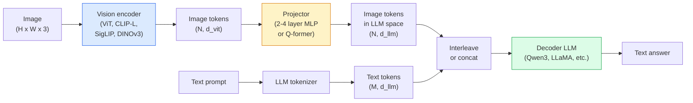

# 视觉语言模型 — ViT-MLP-LLM 模式

> 视觉编码器将图像转换为令牌。MLP 投影器将这些令牌映射到 LLM 的嵌入空间。语言模型完成其余工作。这个模式——ViT-MLP-LLM——是 2026 年所有生产级 VLM 的基础。

**类型：** 学习 + 应用  
**语言：** Python  
**前置知识：** 阶段 4 第 14 课（ViT）、阶段 4 第 18 课（CLIP）、阶段 7 第 02 课（自注意力）  
**时长：** 约 75 分钟

## 学习目标

- 阐述 ViT-MLP-LLM 架构，并解释三个组件各自的作用
- 比较 Qwen3-VL、InternVL3.5、LLaVA-Next 和 GLM-4.6V 在参数量、上下文长度和基准测试性能上的差异
- 解释 DeepStack：为什么多层级 ViT 特征比单层最后一层特征能更紧密地对齐视觉与语言
- 在生产环境中使用跨模态错误率（CMER）衡量 VLM 幻觉，并根据信号采取行动

## 问题

CLIP（阶段 4 第 18 课）提供了一个共享的图像和文本嵌入空间，足以用于零样本分类和检索。但它无法回答“这张图里有多少辆红色的车？”，因为 CLIP 不生成文本——它只计算相似度。

视觉语言模型（VLM）——Qwen3-VL、InternVL3.5、LLaVA-Next、GLM-4.6V——将 CLIP 家族的图像编码器与完整的语言模型结合在一起。模型看到图像加上问题，然后生成答案。2026 年，开源 VLM 在多模态基准测试（MMMU、MMBench、DocVQA、ChartQA、MathVista、OSWorld）上可与 GPT-5 和 Gemini-2.5-Pro 媲美甚至超越。

三部分（ViT、投影器、LLM）组合是标准配置。模型之间的差异在于使用哪种 ViT、哪种投影器、哪种 LLM、训练数据以及对齐策略。一旦你理解了这个模式，替换任何组件都是机械性的。

## 概念

### ViT-MLP-LLM 架构



1. **视觉编码器** —— 一个预训练的 ViT（CLIP-L/14、SigLIP、DINOv3 或其微调变体）。生成补丁令牌。
2. **投影器** —— 一个小型模块（2-4 层 MLP 或 Q-Former），将视觉令牌映射到 LLM 的嵌入维度。大部分微调发生在这里。
3. **LLM** —— 一个仅解码器的语言模型（Qwen3、Llama、Mistral、GLM、InternLM）。按顺序读取视觉 + 文本令牌，生成文本。

原则上，这三个部分都是可训练的。实践中，当投影器训练时，视觉编码器和 LLM 大部分保持冻结——仅用几十亿参数的信号，成本低廉。

### DeepStack

普通投影只使用最后一层 ViT 特征。DeepStack（Qwen3-VL）从多个 ViT 深度采样特征并堆叠起来。深层承载高层语义；浅层承载细粒度的空间和纹理信息。将两者都输入 LLM 缩小了“图像包含什么”（语义）与“具体在哪里”（空间定位）之间的差距。

### 三个训练阶段

现代 VLM 分阶段训练：

1. **对齐** —— 冻结 ViT 和 LLM。仅训练图像-标题对的投影器。教会投影器将视觉空间映射到语言空间。
2. **预训练** —— 解冻所有部分。在大规模交错的图像-文本数据（超过 5 亿对）上训练。构建模型的视觉知识。
3. **指令微调** —— 在精心整理的（图像、问题、答案）三元组上微调。教会对话行为和任务格式。这正是一个“具备视觉感知的 LM”变成可用助手的关键。

大多数 LoRA 微调针对第 3 阶段，使用小型标注数据集。

### 模型家族对比（2026 年初）

| 模型 | 参数量 | 视觉编码器 | LLM | 上下文 | 优势 |
|------|--------|------------|-----|--------|------|
| Qwen3-VL-235B-A22B (MoE) | 235B (22B 激活) | 定制 ViT + DeepStack | Qwen3 | 256K | 通用 SOTA，GUI 智能体 |
| Qwen3-VL-30B-A3B (MoE) | 30B (3B 激活) | 定制 ViT + DeepStack | Qwen3 | 256K | 更小的 MoE 替代方案 |
| Qwen3-VL-8B (密集) | 8B | 定制 ViT | Qwen3 | 128K | 生产级密集默认模型 |
| InternVL3.5-38B | 38B | InternViT-6B | Qwen3 + GPT-OSS | 128K | MMBench / MMVet 表现强劲 |
| InternVL3.5-241B-A28B | 241B (28B 激活) | InternViT-6B | Qwen3 | 128K | 与 GPT-4o 竞争 |
| LLaVA-Next 72B | 72B | SigLIP | Llama-3 | 32K | 开源，易于微调 |
| GLM-4.6V | 约 70B | 定制 | GLM | 64K | 开源，OCR 能力强大 |
| MiniCPM-V-2.6 | 8B | SigLIP | MiniCPM | 32K | 边缘友好 |

### 视觉智能体

Qwen3-VL-235B 在 OSWorld 上达到了全球最高性能——OSWorld 是一个用于操作 GUI（桌面、移动端、网页）的**视觉智能体**基准。模型看到截图，理解用户界面，并发出动作（点击、输入、滚动）。结合工具，它可以闭环完成常见的桌面任务。这也是 2026 年大多数“AI PC”演示背后的原理。

### 智能体能力 + RoPE 变体

VLM 需要知道视频中某一帧出现的**时间**。Qwen3-VL 从 T-RoPE（时间旋转位置嵌入）演进到**基于文本的时间对齐**——显式的时间戳文本令牌与视频帧交错排列。模型看到“`<timestamp 00:32>` 帧，提示”并可以推理时间关系。

### 对齐问题

抓取数据集中 12% 的图像-文本对包含不完全基于图像内容的描述。在这种数据上训练的 VLM 会无声地学会幻觉——编造物体、误读数字、捏造关系。在生产中，这是主要的失败模式。

Skywork.ai 引入了**跨模态错误率（CMER）** 来跟踪这个问题：

```
CMER = fraction of outputs where the text confidence is high but the image-text similarity (via a CLIP-family checker) is low
```

高 CMER 意味着模型在自信地说出图像中不存在的内容。监控 CMER 并将其视为生产 KPI，在他们的部署中将幻觉率降低了约 35%。诀窍不是“修复模型”，而是“将高 CMER 的输出分配给人工审查”。

### 使用 LoRA / QLoRA 微调

对于大多数团队来说，完整微调 70B 的 VLM 是不现实的。LoRA（秩 16-64）应用于注意力层和投影器层，或者 QLoRA 使用 4 位基础权重，可以在单个 A100 / H100 上完成。成本：5,000-50,000 个样本，100-5,000 美元计算费用，2-10 小时训练时间。

### 空间推理仍然薄弱

当前 VLM 在空间推理基准测试（上下、左右、计数、距离）上的得分率为 50-60%。如果你的用例依赖于“哪个物体在哪个上面”，请务必仔细验证——通用 VLM 的性能低于人类。对于纯空间任务，比 VLM 更好的替代方案可以是专门的姿态估计器、深度模型，或带后处理边界框几何的检测模型。

## 构建

### 第一步：投影器

这是你最常训练的部分。2-4 层 MLP，包含 GELU 激活函数。

```python
import torch
import torch.nn as nn


class Projector(nn.Module):
    def __init__(self, vit_dim=768, llm_dim=4096, hidden=4096):
        super().__init__()
        self.net = nn.Sequential(
            nn.Linear(vit_dim, hidden),
            nn.GELU(),
            nn.Linear(hidden, llm_dim),
        )

    def forward(self, x):
        return self.net(x)
```

输入是一个 `(N_patches, d_vit)` 的令牌张量。输出是 `(N_patches, d_llm)`。LLM 将每一行输出视为一个普通令牌。

### 第二步：端到端组装 ViT-MLP-LLM

最小 VLM 前向传播的骨架代码。实际代码使用 `transformers`，这里展示的是概念布局。

```python
class MinimalVLM(nn.Module):
    def __init__(self, vit, projector, llm, image_token_id):
        super().__init__()
        self.vit = vit
        self.projector = projector
        self.llm = llm
        self.image_token_id = image_token_id  # placeholder token in text prompt

    def forward(self, image, input_ids, attention_mask):
        # 1. vision features
        vision_tokens = self.vit(image)                     # (B, N_patches, d_vit)
        vision_embeds = self.projector(vision_tokens)       # (B, N_patches, d_llm)

        # 2. text embeddings
        text_embeds = self.llm.get_input_embeddings()(input_ids)  # (B, M, d_llm)

        # 3. replace image placeholder tokens with vision embeds
        merged = self._merge(text_embeds, vision_embeds, input_ids)

        # 4. run LLM
        return self.llm(inputs_embeds=merged, attention_mask=attention_mask)

    def _merge(self, text_embeds, vision_embeds, input_ids):
        out = text_embeds.clone()
        expected = vision_embeds.size(1)
        for b in range(input_ids.size(0)):
            positions = (input_ids[b] == self.image_token_id).nonzero(as_tuple=True)[0]
            if len(positions) != expected:
                raise ValueError(
                    f"batch item {b} has {len(positions)} image tokens but vision_embeds has {expected} patches."
                    " Every sample in the batch must be pre-padded to the same number of image placeholder tokens.")
            out[b, positions] = vision_embeds[b]
        return out
```

文本中的 `<image>` 占位令牌会被替换为真实的图像嵌入——与 LLaVA、Qwen-VL 和 InternVL 使用的模式相同。

### 第三步：CMER 计算

一个轻量级的运行时检查。

```python
import torch.nn.functional as F


def cross_modal_error_rate(image_emb, text_emb, text_confidence, sim_threshold=0.25, conf_threshold=0.8):
    """
    image_emb, text_emb: embeddings of image and generated text (normalised internally)
    text_confidence:     mean per-token probability in [0, 1]
    Returns:             fraction of high-confidence outputs with low image-text alignment
    """
    image_emb = F.normalize(image_emb, dim=-1)
    text_emb = F.normalize(text_emb, dim=-1)
    sim = (image_emb * text_emb).sum(dim=-1)        # cosine similarity
    high_conf_low_sim = (text_confidence > conf_threshold) & (sim < sim_threshold)
    return high_conf_low_sim.float().mean().item()
```

将 CMER 视为生产 KPI。按端点、提示类型、客户进行监控。CMER 上升表明模型开始在某个输入分布上产生幻觉。

### 第四步：可运行的玩具 VLM 分类器

演示投影器的训练过程。输入伪造的“ViT 特征”；一个小型 LLM 风格的令牌预测类别。

```python
class ToyVLM(nn.Module):
    def __init__(self, vit_dim=32, llm_dim=64, num_classes=5):
        super().__init__()
        self.projector = Projector(vit_dim, llm_dim, hidden=64)
        self.head = nn.Linear(llm_dim, num_classes)

    def forward(self, vision_tokens):
        projected = self.projector(vision_tokens)
        pooled = projected.mean(dim=1)
        return self.head(pooled)
```

可以在合成（特征，类别）对上训练，200 步以内拟合——足以展示投影器模式的有效性。

## 使用

2026 年生产团队使用 VLM 的三种方式：

- **托管 API** —— OpenAI Vision、Anthropic Claude Vision、Google Gemini Vision。零基础设施，但有供应商风险。
- **开源自托管** —— 通过 `transformers` 和 `vllm` 使用 Qwen3-VL 或 InternVL3.5。完全可控，前期投入较高。
- **领域微调** —— 加载 Qwen2.5-VL-7B 或 LLaVA-1.6-7B，在 5k-50k 个自定义样本上用 LoRA 微调，用 `vllm` 或 `TGI` 提供服务。

```python
from transformers import AutoProcessor, AutoModelForVision2Seq
import torch
from PIL import Image

model_id = "Qwen/Qwen3-VL-8B-Instruct"
processor = AutoProcessor.from_pretrained(model_id)
model = AutoModelForVision2Seq.from_pretrained(model_id, torch_dtype=torch.bfloat16, device_map="auto")

messages = [{
    "role": "user",
    "content": [
        {"type": "image", "image": Image.open("plot.png")},
        {"type": "text", "text": "What does this chart show?"},
    ],
}]
inputs = processor.apply_chat_template(messages, add_generation_prompt=True, tokenize=True, return_dict=True, return_tensors="pt").to("cuda")
generated = model.generate(**inputs, max_new_tokens=256)
answer = processor.decode(generated[0][inputs["input_ids"].shape[1]:], skip_special_tokens=True)
```

`apply_chat_template` 隐藏了 `<image>` 占位令牌的标记化；模型内部处理合并。

## 交付

本课程产出：

- `outputs/prompt-vlm-selector.md` —— 根据准确性、延迟、上下文长度和预算选择 Qwen3-VL / InternVL3.5 / LLaVA-Next / API。
- `outputs/skill-cmer-monitor.md` —— 提供用于在生产 VLM 端点中集成跨模态错误率、端点级仪表板以及告警阈值的代码。

## 练习

1. **(简单)** 使用任意开源 VLM，对五张图像运行三个提示（“这是什么？”、“数一数物体”、“描述场景”）。手动评分每个回答为正确 / 部分正确 / 幻觉。计算一个初步的类似 CMER 的比率。
2. **(中等)** 使用 LoRA（秩 16）对 Qwen2.5-VL-3B 或 LLaVA-1.6-7B 在 500 张目标域图像及其标题上进行微调。比较零样本与微调后的 MMBench 风格准确率。
3. **(困难)** 将 VLM 的图像编码器替换为 DINOv3（而不是默认的 SigLIP/CLIP）。仅重新训练投影器（冻结 LLM 和冻结 DINOv3）。测量密集预测任务（计数、空间推理）是否有所改善。

## 关键术语

| 术语 | 通常说法 | 实际含义 |
|------|----------|----------|
| ViT-MLP-LLM | “VLM 模式” | 视觉编码器 + 投影器 + 语言模型；所有 2026 年 VLM 的通用结构 |
| 投影器 | “桥梁” | 2-4 层 MLP（或 Q-Former），将视觉令牌映射到 LLM 嵌入空间 |
| DeepStack | “Qwen3-VL 特征技巧” | 多层级 ViT 特征堆叠而非仅最后一层 |
| 图像令牌 | “<image> 占位符” | 文本流中的特殊令牌，被投影后的视觉嵌入替换 |
| CMER | “幻觉 KPI” | 跨模态错误率；当文本置信度高但图像-文本相似度低时，该值较高 |
| 视觉智能体 | “会点击的 VLM” | 通过工具调用操作 GUI（OSWorld、移动端、网页）的 VLM |
| Q-Former | “固定数量令牌桥接器” | BLIP-2 风格的投影器，生成固定数量的视觉查询令牌 |
| 对齐 / 预训练 / 指令微调 | “三个阶段” | 标准 VLM 训练流程 |

## 延伸阅读

- [Qwen3-VL 技术报告（arXiv 2511.21631）](https://arxiv.org/abs/2511.21631)
- [InternVL3.5 推进开源多模态模型（arXiv 2508.18265）](https://arxiv.org/html/2508.18265v1)
- [LLaVA-Next 系列](https://llava-vl.github.io/blog/2024-05-10-llava-next-stronger-llms/)
- [BentoML：2026 年最佳开源 VLM](https://www.bentoml.com/blog/multimodal-ai-a-guide-to-open-source-vision-language-models)
- [MMMU：多学科多模态理解基准](https://mmmu-benchmark.github.io/)
- [制造业中的 VLM（Robotics Tomorrow，2026 年 3 月）](https://www.roboticstomorrow.com/story/2026/03/when-machines-learn-to-see-like-experts-the-rise-of-vision-language-models-in-manufacturing/26335/)
