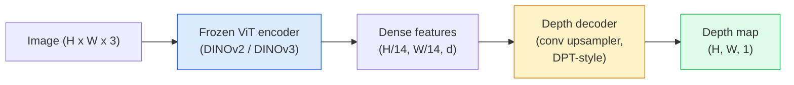

# 单目深度与几何估计

> 深度图是一种单通道图像，其中每个像素代表到相机的距离。在没有立体视觉或激光雷达的情况下，仅凭一帧RGB图像预测深度曾被认为是不可能的。到了2026年，一个冻结的ViT编码器加上一个轻量级头部，其精度已能接近真实值的百分之几。

**类型：** 构建 + 使用  
**语言：** Python  
**前置条件：** 第四阶段第14课（ViT）、第四阶段第17课（自监督视觉）、第四阶段第07课（U-Net）  
**时间：** 约60分钟

## 学习目标

- 区分相对深度和度量深度，并指出每个生产级模型（MiDaS、Marigold、Depth Anything V3、ZoeDepth）解决的是哪一种
- 使用 Depth Anything V3（DINOv2 骨干网络）对任意单张图像预测深度，无需相机标定
- 解释单目深度为何能仅从单张图像有效工作（透视线索、纹理梯度、学习先验），以及它无法恢复的内容（绝对尺度、遮挡几何）
- 利用深度图和针孔相机内参，将2D检测结果提升为3D点

## 问题描述

深度是2D计算机视觉中缺失的维度。给定RGB图像，你知道物体在图像平面上的位置，但不知道它们有多远。深度传感器（立体相机、激光雷达、飞行时间相机）能直接解决这个问题，但成本高、脆弱且测量范围有限。

单目深度估计——从单帧RGB图像预测深度——过去常常产生模糊且不可靠的结果。到了2026年，大规模预训练编码器改变了这一局面：Depth Anything V3 使用冻结的 DINOv2 骨干网络，生成的深度图能够泛化到室内、室外、医学和卫星等多个领域。Marigold 将深度估计重构为条件扩散问题。ZoeDepth 则回归出真实的度量距离。

深度也是连接2D检测和3D理解的桥梁：将检测框中每个像素乘以深度，就能将2D物体提升为3D点云。这正是每个AR遮挡系统、每个避障流程以及每个“拿起杯子”机器人核心所在。

## 核心概念

### 相对深度 vs 度量深度

- **相对深度** —— 有序的 `z` 值，不包含现实世界单位。“像素A比像素B近，但距离之比不以米为锚定。”
- **度量深度** —— 从相机出发的绝对距离（以米为单位）。需要模型学习图像线索与真实距离之间的统计关系。

MiDaS 和 Depth Anything V3 产生相对深度。Marigold 产生相对深度。ZoeDepth、UniDepth 和 Metric3D 产生度量深度。度量模型对相机内参敏感；相对模型则没有这个问题。

### 编码器-解码器模式



Depth Anything V3 冻结编码器，仅训练 DPT 风格的解码器。编码器提供丰富的特征；解码器将其插回图像分辨率并回归深度。

### 为何单张图像也能产生深度

一张2D图像包含许多与深度相关的单目线索：

- **透视** —— 3D中的平行线在2D中汇聚。
- **纹理梯度** —— 远处的表面纹理更小更密集。
- **遮挡顺序** —— 近处的物体遮挡远处的物体。
- **大小恒常性** —— 已知物体（汽车、人类）提供了近似尺度。
- **大气透视** —— 在户外场景中，远处的物体看起来更朦胧、更蓝。

一个在数十亿图像上训练过的ViT会内化这些线索。只要有足够的数据和强大的骨干网络，无需任何显式的3D监督，单目深度也能达到合理的精度。

### 单目深度做不到的事

- **绝对度量尺度** —— 没有内参或场景中的已知物体，网络无法给出绝对尺度。它可以预测“杯子距离是勺子的两倍”，但不知道杯子是1米还是10米远。
- **被遮挡的几何** —— 椅子的背面不可见，无法可靠推断。
- **真正无纹理/反射表面** —— 镜子、玻璃、均匀的墙面。网络会报告看似合理但错误的深度。

### 2026年的 Depth Anything V3

- 使用原版 DINOv2 ViT-L/14 作为编码器（冻结）。
- DPT 解码器。
- 在多样化的有姿态图像对上训练（除了光度一致性外，不需要显式深度监督）。
- 能够从**任意数量的视觉输入中**预测空间一致的几何，**无论是否已知相机姿态**。
- 在单目深度、任意视角几何、视觉渲染、相机姿态估计等任务上达到SOTA。

这将是2026年你需要深度时直接调用的模型。

### Marigold —— 扩散用于深度

Marigold（Ke 等人，CVPR 2024）将深度估计重构为条件图像到图像的扩散。条件：RGB。目标：深度图。使用预训练的 Stable Diffusion 2 U-Net 作为骨干网络。生成的深度图在物体边界处异常清晰。权衡：推理速度慢于前馈模型（需要10-50步去噪）。

### 相机内参与针孔相机

要将像素 `(u, v)` 及其深度 `d` 提升为相机坐标系下的3D点 `(X, Y, Z)`：

```
fx, fy, cx, cy = camera intrinsics
X = (u - cx) * d / fx
Y = (v - cy) * d / fy
Z = d
```

内参可以从 EXIF 元数据、标定板或单目内参估计器（Perspective Fields、UniDepth）获得。没有内参时，可以通过假设60-70°视场角和中等分辨率的主点来渲染点云——可用于可视化，但不能用于测量。

### 评估

两个标准指标：

- **AbsRel**（绝对值相对误差）：`mean(|d_pred - d_gt| / d_gt)`。越低越好。生产级模型通常在0.05-0.1之间。
- **delta < 1.25**（阈值精度）：满足 `max(d_pred/d_gt, d_gt/d_pred) < 1.25` 的像素比例。越高越好。SOTA模型可达0.9以上。

对于相对深度（Depth Anything V3、MiDaS），评估时需使用尺度平移不变的版本计算这两个指标。

## 构建环节

### 第1步：深度指标

```python
import torch

def abs_rel_error(pred, target, mask=None):
    if mask is not None:
        pred = pred[mask]
        target = target[mask]
    return (torch.abs(pred - target) / target.clamp(min=1e-6)).mean().item()


def delta_accuracy(pred, target, threshold=1.25, mask=None):
    if mask is not None:
        pred = pred[mask]
        target = target[mask]
    ratio = torch.maximum(pred / target.clamp(min=1e-6), target / pred.clamp(min=1e-6))
    return (ratio < threshold).float().mean().item()
```

在评估前务必遮掩无效深度像素（零值、NaN、饱和值）。

### 第2步：尺度-平移对齐

对于相对深度模型，在计算指标前需要将预测与真值对齐。使用最小二乘法拟合 `a * pred + b = target`：

```python
def align_scale_shift(pred, target, mask=None):
    if mask is not None:
        p = pred[mask]
        t = target[mask]
    else:
        p = pred.flatten()
        t = target.flatten()
    A = torch.stack([p, torch.ones_like(p)], dim=1)
    coeffs, *_ = torch.linalg.lstsq(A, t.unsqueeze(-1))
    a, b = coeffs[:2, 0]
    return a * pred + b
```

在评估 MiDaS / Depth Anything 时，先调用 `align_scale_shift` 再计算 `abs_rel_error`。

### 第3步：将深度提升为点云

```python
import numpy as np

def depth_to_point_cloud(depth, intrinsics):
    H, W = depth.shape
    fx, fy, cx, cy = intrinsics
    v, u = np.meshgrid(np.arange(H), np.arange(W), indexing="ij")
    z = depth
    x = (u - cx) * z / fx
    y = (v - cy) * z / fy
    return np.stack([x, y, z], axis=-1)


depth = np.random.uniform(0.5, 4.0, (240, 320))
intr = (320.0, 320.0, 160.0, 120.0)
pc = depth_to_point_cloud(depth, intr)
print(f"point cloud shape: {pc.shape}  (H, W, 3)")
```

一个函数，适用于所有3D提升应用。将点云导出为 `.ply` 格式，可在 MeshLab 或 CloudCompare 中打开。

### 第4步：使用合成深度场景进行冒烟测试

```python
def synthetic_depth(size=96):
    yy, xx = np.meshgrid(np.arange(size), np.arange(size), indexing="ij")
    # Floor: linear gradient from near (top) to far (bottom)
    depth = 1.0 + (yy / size) * 4.0
    # Box in the middle: closer
    mask = (np.abs(xx - size / 2) < size / 6) & (np.abs(yy - size * 0.6) < size / 6)
    depth[mask] = 2.0
    return depth.astype(np.float32)


gt = torch.from_numpy(synthetic_depth(96))
pred = gt + 0.3 * torch.randn_like(gt)  # simulated prediction
aligned = align_scale_shift(pred, gt)
print(f"before align  absRel = {abs_rel_error(pred, gt):.3f}")
print(f"after align   absRel = {abs_rel_error(aligned, gt):.3f}")
```

### 第5步：Depth Anything V3 的使用（参考）

```python
import torch
from transformers import pipeline
from PIL import Image

pipe = pipeline(task="depth-estimation", model="LiheYoung/depth-anything-v2-large")

image = Image.open("street.jpg").convert("RGB")
out = pipe(image)
depth_np = np.array(out["depth"])
```

三行代码。`out["depth"]` 是 PIL 灰度图；要用于数学计算需转换为 numpy。对于 Depth Anything V3，模型 ID 发布后替换即可，API 不变。

## 使用环节

- **Depth Anything V3**（Meta AI / ByteDance，2024-2026）—— 相对深度的默认选择。生产环境中最快的 ViT-large 骨干网络模型。
- **Marigold**（ETH，2024）—— 视觉质量最高，推理速度慢。
- **UniDepth**（ETH，2024）—— 度量深度，同时估计相机内参。
- **ZoeDepth**（Intel，2023）—— 度量深度；较老但依然可靠。
- **MiDaS v3.1** —— 传统但稳定；作为比较的基线。

典型集成模式：

1. 获取 RGB 帧。
2. 深度模型生成深度图。
3. 检测器生成检测框。
4. 将检测框中心点通过深度提升到3D；如果有可用点云则与之融合。
5. 下游应用：AR遮挡、路径规划、物体尺寸估计、立体替代。

对于实时应用，Depth Anything V2 Small（INT8量化）在消费级GPU上以518x518分辨率可达到约30 fps。

## 交付产物

本课程产出：

- `outputs/prompt-depth-model-picker.md` —— 根据延迟、度量vs相对需求以及场景类型，在 Depth Anything V3、Marigold、UniDepth、MiDaS 之间进行选择。
- `outputs/skill-depth-to-pointcloud.md` —— 一项技能，能从深度图构建点云，正确使用内参并导出为 `.ply` 格式。

## 练习

1. **(简单)** 在你的桌面上任意拍摄10张图像，用 Depth Anything V2 运行。将深度保存为灰度PNG并检查。找出一个物体，其预测深度看起来错误，并解释为什么单目线索失效了。
2. **(中等)** 给定 RGB + Depth Anything V2 深度，提升为点云并用 `open3d` 渲染。比较两个场景（室内/室外），指出哪个看起来更可信。
3. **(困难)** 拍摄五对图像，每对仅通过已知物体位置变化（例如，将瓶子向相机移动30厘米）而不同。使用 UniDepth 预测两幅图像的度量深度。报告预测的距离变化与真实的30厘米之间的差异。

## 关键术语

| 术语 | 人们常说 | 实际含义 |
|------|---------|---------|
| 单目深度 | “单张图像深度” | 从一帧RGB图像估计深度，没有立体视觉或激光雷达 |
| 相对深度 | “有序深度” | 有序的z值，没有现实世界单位 |
| 度量深度 | “绝对距离” | 以米为单位的深度；需要标定或使用度量监督训练的模型 |
| AbsRel | “绝对值相对误差” | mean( \|d_pred - d_gt\| / d_gt )；标准深度指标 |
| Delta精度 | “delta < 1.25” | 预测值在真值25%范围内的像素比例 |
| 针孔相机 | “fx, fy, cx, cy” | 用于将 (u, v, d) 提升为 (X, Y, Z) 的相机模型 |
| DPT | “密集预测变换器” | 基于卷积的解码器，用于冻结的ViT编码器之上进行深度估计 |
| DINOv2骨干网络 | “它之所以有效的原因” | 自监督特征，无需深度标签就能泛化到不同领域 |

## 延伸阅读

- [Depth Anything V3 论文页面](https://depth-anything.github.io/) —— 基于 DINOv2 编码器的 SOTA 单目深度
- [Marigold (Ke等, CVPR 2024)](https://marigoldmonodepth.github.io/) —— 基于扩散的深度估计
- [UniDepth (Piccinelli等, 2024)](https://arxiv.org/abs/2403.18913) —— 带内参的度量深度
- [MiDaS v3.1 (Intel ISL)](https://github.com/isl-org/MiDaS) —— 经典相对深度基线
- [DINOv3 博客文章 (Meta)](https://ai.meta.com/blog/dinov3-self-supervised-vision-model/) —— 提升深度精度的编码器家族
