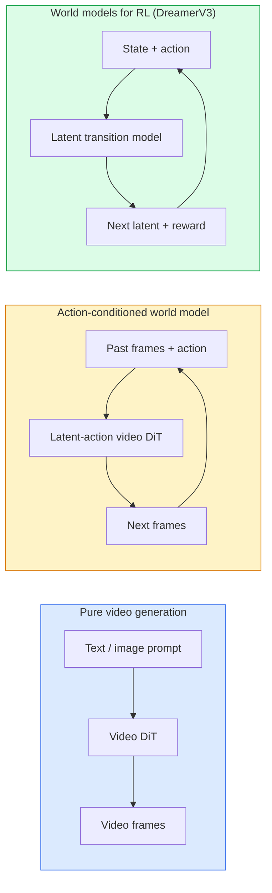

# 世界模型与视频扩散

> 能预测场景下一秒钟的视频模型就是世界模拟器。将预测条件化为动作，你就拥有了一个可学习的游戏引擎。

**类型：** 学习 + 构建  
**语言：** Python  
**前置知识：** 第四阶段第 10 课（扩散模型）、第四阶段第 12 课（视频理解）、第四阶段第 23 课（DiT + 整流流）  
**时间：** 约 75 分钟  

## 学习目标

- 解释纯视频生成模型（Sora 2）与动作条件世界模型（Genie 3、DreamerV3）之间的区别。
- 描述视频 DiT：时空块、3D 位置编码、跨 (T, H, W) 令牌的联合注意力。
- 追溯世界模型如何接入机器人技术：VLM 规划 → 视频模型模拟 → 逆动力学模型输出动作。
- 针对给定的使用场景（创意视频、交互式模拟、自动驾驶合成），在 Sora 2、Genie 3、Runway GWM-1 Worlds、Wan-Video 和 HunyuanVideo 之间进行选择。

## 问题

视频生成与世界模型在 2026 年交汇。能够生成连贯一分钟视频的模型，在某种意义上已经学会了世界如何运动：物体恒存、重力、因果、风格。如果你将该预测条件化为动作（向左走、打开门），视频模型就变成了一个可学习的模拟器，可以取代游戏引擎、驾驶模拟器或机器人环境。

其影响是具体的。Genie 3 从一张图像生成可交互的环境。Runway GWM-1 Worlds 合成无限可探索的场景。Sora 2 生成长达一分钟的视频，带有同步音频和模拟的物理。NVIDIA Cosmos-Drive、Wayve Gaia-2 和 Tesla DrivingWorld 为自动驾驶训练数据生成逼真的驾驶视频。世界模型范式正悄然接管机器人领域的模拟到真实迁移。

本节课是第四阶段的“全景”课。它将图像生成、视频理解和智能体推理连接成主导研究正趋之若鹜的架构模式。

## 概念

### 世界建模的三个家族



- **Sora 2** 是基于提示条件的纯视频生成。没有动作接口。你无法在生成过程中“操控”它。
- **Genie 3**、**GWM-1 Worlds**、**Mirage / Magica** 是动作条件世界模型。从观察到的视频中推断潜在动作，然后将未来帧预测条件化为动作。交互式——你可以按按键或移动摄像机，场景会做出响应。
- **DreamerV3** 和经典的强化学习世界模型家族在潜在空间中预测，并明确地以动作作为条件，通过奖励信号进行训练。视觉性较低；对样本高效的强化学习更有用。

### 视频 DiT 架构

```
Video latent:          (C, T, H, W)
Patchify (spatial):    grid of P_h x P_w patches per frame
Patchify (temporal):   group P_t frames into a temporal patch
Resulting tokens:      (T / P_t) * (H / P_h) * (W / P_w) tokens
```

位置编码是 3D 的：每个 (t, h, w) 坐标的旋转或可学习嵌入。注意力可以采用：

- **全联合** —— 所有令牌关注所有令牌。O(N²) 复杂度，N 为令牌数。对于长视频而言过于庞大。
- **分解式** —— 交替进行时间注意力（相同空间位置，跨时间：`(H*W) * T²`）和空间注意力（相同时间步，跨空间：`T * (H*W)²`）。TimeSformer 和大多数视频 DiT 采用此方式。
- **窗口式** —— 在 (t, h, w) 内的局部窗口。Video Swin 采用。

每个 2026 年的视频扩散模型都使用这三种模式之一，外加 AdaLN 条件（第 23 课）和整流流。

### 以动作作为条件：潜在动作模型

Genie 通过区分性地预测连续两帧之间的动作，学习每帧的**潜在动作**。然后，模型的解码器以推断出的潜在动作（而非显式的键盘按键）作为条件。在推理时，用户可以指定一个潜在动作（或从新的先验中采样一个），模型会生成与该动作一致的下一帧。

Sora 完全跳过了动作接口。其解码器从过去的时空令牌预测未来的时空令牌。提示条件化了开始；在生成过程中没有任何东西操控它。

### 物理合理性

Sora 2 在 2026 年的发布中明确强调了**物理合理性**：重量、平衡、物体恒存、因果关系。通过团队人工评分的合理性得分来衡量；与 Sora 1 相比，模型在掉落物体、角色碰撞以及故意失败（如跳跃失败）方面有明显改善。

合理性仍然是主要的失败模式。2024-2025 年的人物吃意大利面或用玻璃杯喝水的视频揭示了模型缺乏持久的物体表征。2026 年的模型（Sora 2、Runway Gen-5、HunyuanVideo）减少了这些问题，但并未完全消除。

### 自动驾驶世界模型

驾驶世界模型根据轨迹、边界框或导航地图生成逼真的道路场景。用途：

- **Cosmos-Drive-Dreams**（NVIDIA）—— 生成数分钟驾驶视频用于强化学习训练。
- **Gaia-2**（Wayve）—— 基于轨迹条件的场景合成，用于策略评估。
- **DrivingWorld**（Tesla）—— 模拟多种天气、时段、交通状况。
- **Vista**（字节跳动）—— 反应式驾驶场景合成。

它们替代了昂贵的数据采集过程，用于处理极端情况——夜间行人乱穿马路、结冰路口、不常见车型——否则需要数百万英里的驾驶数据。

### 机器人技术栈：VLM + 视频模型 + 逆动力学

新兴的三组件机器人循环：

1. **VLM** 解析目标（“拿起红色杯子”），规划高层动作序列。
2. **视频生成模型** 模拟执行每个动作后的样子——预测 N 帧后的观察结果。
3. **逆动力学模型** 提取能够产生这些观察结果的具体电机指令。

这取代了奖励塑造和样本密集的强化学习。世界模型负责想象；逆动力学模型则闭环控制动作。Genie Envisioner 是一个实例；许多研究小组正朝着这一结构趋同。

### 评估

- **视觉质量** —— FVD（Fréchet 视频距离）、用户研究。
- **提示对齐** —— 每帧的 CLIPScore、VQA 式评估。
- **物理合理性** —— 在基准测试套件（Sora 2 的内部基准、VBench）上进行人工评分。
- **可控性**（针对交互式世界模型）—— 动作 → 观察一致性；能否返回之前的状态？

### 2026 年模型格局

| 模型 | 用途 | 参数量 | 输出 | 许可 |
|-------|-----|------------|--------|---------|
| Sora 2 | 文本到视频、音频 | — | 1 分钟 1080p + 音频 | 仅 API |
| Runway Gen-5 | 文本/图像到视频 | — | 10 秒片段 | API |
| Runway GWM-1 Worlds | 交互式世界 | — | 无限 3D 展开 | API |
| Genie 3 | 从图像生成交互式世界 | 110 亿以上 | 可玩帧 | 研究预览 |
| Wan-Video 2.1 | 开源文本到视频 | 140 亿 | 高质量片段 | 非商业 |
| HunyuanVideo | 开源文本到视频 | 130 亿 | 10 秒片段 | 宽松许可 |
| Cosmos / Cosmos-Drive | 自动驾驶模拟 | 70-140 亿 | 驾驶场景 | NVIDIA 开放 |
| Magica / Mirage 2 | AI 原生游戏引擎 | — | 可修改世界 | 产品 |

## 构建

### 步骤 1：视频 3D 分块

```python
import torch
import torch.nn as nn


class VideoPatch3D(nn.Module):
    def __init__(self, in_channels=4, dim=64, patch_t=2, patch_h=2, patch_w=2):
        super().__init__()
        self.proj = nn.Conv3d(
            in_channels, dim,
            kernel_size=(patch_t, patch_h, patch_w),
            stride=(patch_t, patch_h, patch_w),
        )
        self.patch_t = patch_t
        self.patch_h = patch_h
        self.patch_w = patch_w

    def forward(self, x):
        # x: (N, C, T, H, W)
        x = self.proj(x)
        n, c, t, h, w = x.shape
        tokens = x.reshape(n, c, t * h * w).transpose(1, 2)
        return tokens, (t, h, w)
```

一个 3D 卷积，步长等于核大小，作为时空分块器。`(T, H, W) -> (T/2, H/2, W/2)` 的令牌网格。

### 步骤 2：3D 旋转位置编码

沿 `t`、`h`、`w` 轴分别应用旋转位置嵌入（RoPE）：

```python
def rope_3d(tokens, t_dim, h_dim, w_dim, grid):
    """
    tokens: (N, T*H*W, D)
    grid: (T, H, W) sizes
    t_dim + h_dim + w_dim == D
    """
    T, H, W = grid
    n, seq, d = tokens.shape
    if t_dim + h_dim + w_dim != d:
        raise ValueError(f"t_dim+h_dim+w_dim ({t_dim}+{h_dim}+{w_dim}) must equal D={d}")
    assert seq == T * H * W
    t_idx = torch.arange(T, device=tokens.device).repeat_interleave(H * W)
    h_idx = torch.arange(H, device=tokens.device).repeat_interleave(W).repeat(T)
    w_idx = torch.arange(W, device=tokens.device).repeat(T * H)
    # Simplified: just scale channels by frequencies. Real RoPE rotates pairs.
    freqs_t = torch.exp(-torch.log(torch.tensor(10000.0)) * torch.arange(t_dim // 2, device=tokens.device) / (t_dim // 2))
    freqs_h = torch.exp(-torch.log(torch.tensor(10000.0)) * torch.arange(h_dim // 2, device=tokens.device) / (h_dim // 2))
    freqs_w = torch.exp(-torch.log(torch.tensor(10000.0)) * torch.arange(w_dim // 2, device=tokens.device) / (w_dim // 2))
    emb_t = torch.cat([torch.sin(t_idx[:, None] * freqs_t), torch.cos(t_idx[:, None] * freqs_t)], dim=-1)
    emb_h = torch.cat([torch.sin(h_idx[:, None] * freqs_h), torch.cos(h_idx[:, None] * freqs_h)], dim=-1)
    emb_w = torch.cat([torch.sin(w_idx[:, None] * freqs_w), torch.cos(w_idx[:, None] * freqs_w)], dim=-1)
    return tokens + torch.cat([emb_t, emb_h, emb_w], dim=-1)
```

简化加法形式。真实的 RoPE 在频率上旋转配对通道；位置信息相同。

### 步骤 3：分解式注意力模块

```python
class DividedAttentionBlock(nn.Module):
    def __init__(self, dim=64, heads=2):
        super().__init__()
        self.time_attn = nn.MultiheadAttention(dim, heads, batch_first=True)
        self.space_attn = nn.MultiheadAttention(dim, heads, batch_first=True)
        self.ln1 = nn.LayerNorm(dim)
        self.ln2 = nn.LayerNorm(dim)
        self.ln3 = nn.LayerNorm(dim)
        self.mlp = nn.Sequential(nn.Linear(dim, 4 * dim), nn.GELU(), nn.Linear(4 * dim, dim))

    def forward(self, x, grid):
        T, H, W = grid
        n, seq, d = x.shape
        # time attention: same (h, w), across t
        xt = x.view(n, T, H * W, d).permute(0, 2, 1, 3).reshape(n * H * W, T, d)
        a, _ = self.time_attn(self.ln1(xt), self.ln1(xt), self.ln1(xt), need_weights=False)
        xt = (xt + a).reshape(n, H * W, T, d).permute(0, 2, 1, 3).reshape(n, seq, d)
        # space attention: same t, across (h, w)
        xs = xt.view(n, T, H * W, d).reshape(n * T, H * W, d)
        a, _ = self.space_attn(self.ln2(xs), self.ln2(xs), self.ln2(xs), need_weights=False)
        xs = (xs + a).reshape(n, T, H * W, d).reshape(n, seq, d)
        xs = xs + self.mlp(self.ln3(xs))
        return xs
```

时间注意力在每个空间位置内跨时间进行注意力；空间注意力在每个帧内跨位置进行注意力。两个 O(T² + (HW)²) 操作，而不是一个 O((THW)²) 操作。这是 TimeSformer 和所有现代视频 DiT 的核心。

### 步骤 4：组合一个小型视频 DiT

```python
class TinyVideoDiT(nn.Module):
    def __init__(self, in_channels=4, dim=64, depth=2, heads=2):
        super().__init__()
        self.patch = VideoPatch3D(in_channels=in_channels, dim=dim, patch_t=2, patch_h=2, patch_w=2)
        self.blocks = nn.ModuleList([DividedAttentionBlock(dim, heads) for _ in range(depth)])
        self.out = nn.Linear(dim, in_channels * 2 * 2 * 2)

    def forward(self, x):
        tokens, grid = self.patch(x)
        for blk in self.blocks:
            tokens = blk(tokens, grid)
        return self.out(tokens), grid
```

不是一个可工作的视频生成器；是一个结构演示，确保每个部分形状正确。

### 步骤 5：检查形状

```python
vid = torch.randn(1, 4, 8, 16, 16)  # (N, C, T, H, W)
model = TinyVideoDiT()
out, grid = model(vid)
print(f"input  {tuple(vid.shape)}")
print(f"tokens grid {grid}")
print(f"output {tuple(out.shape)}")
```

分块后期望 `grid = (4, 8, 8)` 和 `out = (1, 256, 32)`；然后头部将每个令牌投影成时空块，准备解分块成视频。

## 使用

2026 年的生产访问模式：

- **Sora 2 API**（OpenAI）—— 文本到视频、同步音频。高端定价。
- **Runway Gen-5 / GWM-1**（Runway）—— 图像到视频、交互式世界。
- **Wan-Video 2.1 / HunyuanVideo** —— 开源自托管。
- **Cosmos / Cosmos-Drive**（NVIDIA）—— 驾驶模拟开放权重。
- **Genie 3** —— 研究预览，需申请访问。

若构建交互式世界模型演示：从 Wan-Video 获得高质量，在其上叠加潜在动作适配器实现交互。对于自动驾驶模拟：Cosmos-Drive 是 2026 年的开放参考。

对于机器人技术，实际的技术栈：

1. 语言目标 -> VLM (Qwen3-VL) -> 高层计划。
2. 计划 -> 潜在动作视频模型 -> 想象的展开。
3. 展开 -> 逆动力学模型 -> 低层动作。
4. 执行动作 -> 观察反馈到步骤 1。

## 交付

本节课产出的内容：

- `outputs/prompt-video-model-picker.md` —— 根据任务、许可和延迟在 Sora 2 / Runway / Wan / HunyuanVideo / Cosmos 之间进行选择。
- `outputs/skill-physical-plausibility-checks.md` —— 一个技能，定义自动检查（物体恒存、重力、连续性），可在任何生成的视频发布前运行。

## 练习

1. **（简单）** 计算一段 5 秒 360p 视频的令牌数量，patch-t=2, patch-h=8, patch-w=8。推理在此规模下注意力的内存需求。
2. **（中等）** 将上面的分解式注意力模块替换为全联合注意力模块，测量形状和参数量。解释为什么分解式注意力对于真实视频模型是必要的。
3. **（困难）** 构建一个最小的潜在动作视频模型：取一个 (frame_t, action_t, frame_{t+1}) 三元组数据集（任意简单的 2D 游戏），训练一个以动作嵌入为条件的小型视频 DiT，并展示不同动作会产生不同的下一帧。

## 关键术语

| 术语 | 人们常说的 | 实际含义 |
|------|----------------|----------------------|
| 世界模型 | “可学习的模拟器” | 根据状态和动作预测未来观察结果的模型 |
| 视频 DiT | “时空 Transformer” | 具有 3D 分块和分解式注意力的扩散 Transformer |
| 潜在动作 | “推断的控制” | 从帧对中推断出的离散或连续动作潜在表示；用于条件化下一帧生成 |
| 分解式注意力 | “先时间后空间” | 每个模块中的两个注意力操作 —— 先跨时间、后跨空间 —— 以保持 O(N²) 可控 |
| 物体恒存 | “事物保持真实” | 视频模型必须学习的场景属性；在食物、玻璃器皿上是经典失败模式 |
| FVD | “Fréchet 视频距离” | 视频版本的 FID；主要视觉质量度量 |
| 逆动力学模型 | “从观察到动作” | 给定 (状态, 下一状态)，输出连接它们的动作；完成机器人循环 |
| Cosmos-Drive | “NVIDIA 驾驶模拟器” | 用于强化学习与评估的开放权重自动驾驶世界模型 |

## 延伸阅读

- [Sora 技术报告 (OpenAI)](https://openai.com/index/video-generation-models-as-world-simulators/)
- [Genie: Generative Interactive Environments (Bruce et al., 2024)](https://arxiv.org/abs/2402.15391) —— 潜在动作世界模型
- [TimeSformer (Bertasius et al., 2021)](https://arxiv.org/abs/2102.05095) —— 视频 Transformers 的分解式注意力
- [DreamerV3 (Hafner et al., 2023)](https://arxiv.org/abs/2301.04104) —— 用于强化学习的世界模型
- [Cosmos-Drive-Dreams (NVIDIA, 2025)](https://research.nvidia.com/labs/toronto-ai/cosmos-drive-dreams/) —— 驾驶世界模型
- [2026 年十大视频生成模型 (DataCamp)](https://www.datacamp.com/blog/top-video-generation-models)
- [从视频生成到世界模型 —— 综述仓库](https://github.com/ziqihuangg/Awesome-From-Video-Generation-to-World-Model/)
