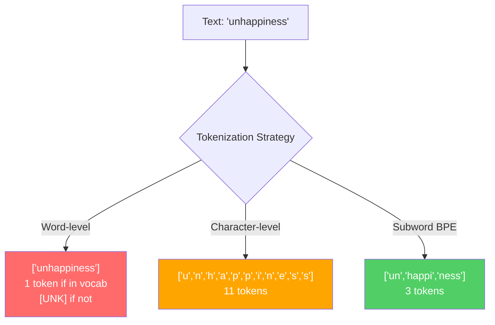
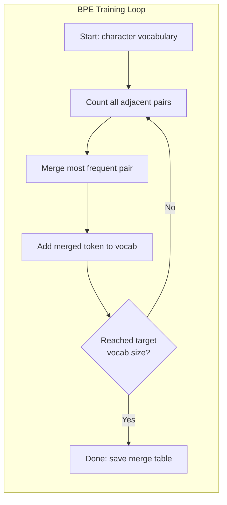
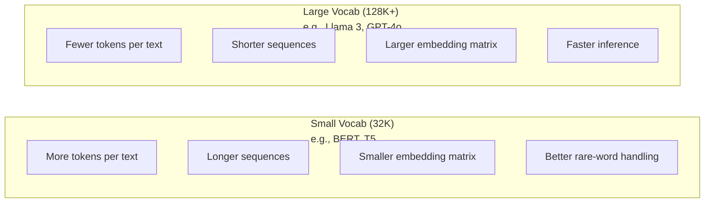

# 分词器：BPE、WordPiece、SentencePiece

> 你的LLM读的不是英语。它读的是整数。分词器决定了这些整数是承载意义还是浪费意义。

**类型：** 构建
**语言：** Python
**前置知识：** 阶段05（NLP基础）
**时间：** 约90分钟

## 学习目标

- 从头实现BPE、WordPiece和Unigram分词算法，并比较它们的合并策略
- 解释词汇量大小如何影响模型效率：太小会导致长序列，太大会浪费嵌入参数
- 分析跨语言和代码的分词产物，识别特定分词器在哪些场景下失效
- 使用tiktoken和sentencepiece库对文本进行分词，并检查生成的token ID

## 问题所在

你的LLM读的不是英语。它不读任何语言。它读的是数字。

从 "Hello, world!" 到 [15496, 11, 995, 0] 之间的鸿沟就是分词器。每一个单词、每一个空格、每一个标点符号在模型处理之前都必须转换为一个整数。这种转换并非中立的。它把假设嵌入到模型中，且之后无法撤销。

如果这一步搞错了，你的模型就会浪费容量来用多个token编码常见单词。"unfortunately" 变成了四个token而不是一个。你的128K上下文窗口对于多音节词密集的文本直接缩小了75%。如果做对了，同样的上下文窗口就能容纳两倍的意义。区分“这个模型擅长处理代码”和“这个模型在Python上经常崩溃”的关键往往在于分词器的训练方式。

你每次调用GPT-4或Claude的API都是按token计价的。模型生成的每个token都需要计算成本。表示一个输出所需的token越少，端到端推理就越快。分词不是预处理，它是架构的一部分。

## 概念

### 三种失败的方案（和一种成功的方案）

将文本转换为数字有三种显而易见的方法。其中两种在大规模场景下行不通。

**词级分词**按空格和标点拆分。"The cat sat" 变成 ["The", "cat", "sat"]。简单。但是像 "tokenization" 呢？或者 "GPT-4o"？又或者像 "Geschwindigkeitsbegrenzung" 这样的德语复合词？词级分词需要庞大的词汇表来覆盖每种语言里的每一个词。遇到一个未登录词，你就会得到可怕的 `[UNK]` token——模型在说“我完全不知道这是什么”。仅英语就有超过一百万个词形。再加上代码、URL、科学记数法以及另外100种语言，你需要一个无限的词汇表。

**字级分词**则走向了另一个极端。"hello" 变成 ["h", "e", "l", "l", "o"]。词汇表很小（几百个字符）。永远不会出现未知token。但序列变得非常长。一个原本是10个词级token的句子变成了50个字符级token。模型必须学习 "t"、"h"、"e" 放在一起表示 "the"——把注意力容量浪费在人类三岁就学会的东西上。

**子词分词**找到了折中点。常见词保持完整："the" 是一个token。罕见词分解成有意义的片段："unhappiness" 变成 ["un", "happi", "ness"]。词汇表保持可控（30K到128K个token）。序列保持较短。未知token几乎消失，因为任何词都可以从子词片段中构建出来。

所有现代LLM都使用子词分词。GPT-2、GPT-4、BERT、Llama 3、Claude——全都是。问题在于使用哪种算法。



### BPE：字节对编码

BPE是一种被改造用于分词的贪心压缩算法。这个想法简单到可以写在一张卡片上。

从单个字符开始。统计训练语料中每一个相邻对。将最频繁出现的对合并成一个新token。重复直到达到目标词汇量大小。

下面是在一个微型语料上运行BPE的例子，包含单词 "lower"、"lowest" 和 "newest"：

```
Corpus (with word frequencies):
  "lower"  x5
  "lowest" x2
  "newest" x6

Step 0 -- Start with characters:
  l o w e r       (x5)
  l o w e s t     (x2)
  n e w e s t     (x6)

Step 1 -- Count adjacent pairs:
  (e,s): 8    (s,t): 8    (l,o): 7    (o,w): 7
  (w,e): 13   (e,r): 5    (n,e): 6    ...

Step 2 -- Merge most frequent pair (w,e) -> "we":
  l o we r        (x5)
  l o we s t      (x2)
  n e we s t      (x6)

Step 3 -- Recount and merge (e,s) -> "es":
  l o we r        (x5)
  l o we s t      (x2)    <- 'es' only forms from 'e'+'s', not 'we'+'s'
  n e we s t      (x6)    <- wait, the 'e' before 'we' and 's' after 'we'

Actually tracking this precisely:
  After "we" merge, remaining pairs:
  (l,o): 7   (o,we): 7   (we,r): 5   (we,s): 8
  (s,t): 8   (n,e): 6    (e,we): 6

Step 3 -- Merge (we,s) -> "wes" or (s,t) -> "st" (tied at 8, pick first):
  Merge (we,s) -> "wes":
  l o we r        (x5)
  l o wes t       (x2)
  n e wes t       (x6)

Step 4 -- Merge (wes,t) -> "west":
  l o we r        (x5)
  l o west        (x2)
  n e west        (x6)

...continue until target vocab size reached.
```

合并表就是分词器。要对新文本编码，按学习到的顺序应用合并。训练语料决定了存在哪些合并，而这一选择永久地塑造了模型看到的内容。



### 字节级BPE（GPT-2、GPT-3、GPT-4）

标准BPE操作在Unicode字符上。字节级BPE操作在原始字节（0-255）上。这给了你一个恰好为256的基础词汇表，处理任何语言或编码，并且永远不会产生未知token。

GPT-2引入了这种方法。基础词汇表覆盖了每一个可能的字节。BPE合并在此基础上构建。OpenAI的tiktoken库实现了字节级BPE，其词汇量如下：

- GPT-2：50,257个token
- GPT-3.5/GPT-4：约100,256个token（cl100k_base编码）
- GPT-4o：200,019个token（o200k_base编码）

### WordPiece（BERT）

WordPiece看起来与BPE类似，但合并的选择方式不同。它不基于原始频率，而是最大化训练数据的似然度：

```
BPE merge criterion:      count(A, B)
WordPiece merge criterion: count(AB) / (count(A) * count(B))
```

BPE问的是：“哪个对出现得最多？” WordPiece问的是：“哪个对一起出现的频率高于随机预期？” 这个细微的差别产生了不同的词汇表。WordPiece偏爱那些共现令人惊讶的合并，而不仅仅是频繁的合并。

WordPiece还使用 "##" 前缀来表示续接子词：

```
"unhappiness" -> ["un", "##happi", "##ness"]
"embedding"   -> ["em", "##bed", "##ding"]
```

"##" 前缀告诉你这个片段延续了前面的token。BERT使用WordPiece，词汇量为30,522个token。所有BERT变体——DistilBERT、RoBERTa（其分词器实际上是BPE，但BERT本身是WordPiece）——都源于此。

### SentencePiece（Llama、T5）

SentencePiece将输入视为原始Unicode字符流，包括空白。没有预分词步骤。没有关于词边界的语言特定规则。这使它真正做到了语言无关——在中文、日语、泰语以及其他不以空格分隔单词的语言上也同样有效。

SentencePiece支持两种算法：
- **BPE模式**：与标准BPE相同的合并逻辑，应用于原始字符序列
- **Unigram模式**：从一个大型词汇表开始，迭代移除那些对整体似然度影响最小的token。与BPE相反——剪枝而不是合并。

Llama 2使用SentencePiece BPE，词汇量为32,000个token。T5使用SentencePiece Unigram，词汇量为32,000个token。注意：Llama 3切换到了基于tiktoken的字节级BPE分词器，词汇量为128,256个token。

### 词汇量大小的权衡

这是一个真正的工程决策，具有可衡量的后果。



具体数字。对于一个128K词汇量、4,096维嵌入，仅嵌入矩阵就有128,000 x 4,096 = 5.24亿个参数。对于32K词汇量，则是1.31亿个参数。仅凭分词器选择就造成了4亿个参数的差异。

但更大的词汇表能更积极地压缩文本。同一个英文段落，用32K词汇量需要100个token，用128K词汇量可能只需要70个token。这意味着生成时减少了30%的前向传播。对于一个服务数百万次请求的模型，这直接减少了计算成本。

趋势很明显：词汇量正在增长。GPT-2用了50,257。GPT-4用了约100K。Llama 3用了128K。GPT-4o用了200K。

| 模型 | 词汇量大小 | 分词器类型 | 每个英语单词平均token数 |
|-------|-----------|----------------|---------------------------|
| BERT | 30,522 | WordPiece | ~1.4 |
| GPT-2 | 50,257 | 字节级BPE | ~1.3 |
| Llama 2 | 32,000 | SentencePiece BPE | ~1.4 |
| GPT-4 | ~100,256 | 字节级BPE | ~1.2 |
| Llama 3 | 128,256 | 字节级BPE (tiktoken) | ~1.1 |
| GPT-4o | 200,019 | 字节级BPE | ~1.0 |

### 多语言税

主要基于英语训练的分词器对其他语言非常不友好。GPT-2分词器中的韩文平均每个词需要2-3个token。中文可能更差。这意味着韩国用户实际上拥有了一个只有英语用户一半大小的上下文窗口——为更少的信息密度支付相同的价格。

这就是为什么Llama 3将其词汇量从32K翻了两番到128K。更多token分配给非英语文字意味着跨语言的更公平压缩。

## 构建

### 第一步：字符级分词器

从基础开始。字符级分词器将每个字符映射到其Unicode码点。无需训练。没有未知token。只是一个直接的映射。

```python
class CharTokenizer:
    def encode(self, text):
        return [ord(c) for c in text]

    def decode(self, tokens):
        return "".join(chr(t) for t in tokens)
```

"hello" 变成 [104, 101, 108, 108, 111]。每个字符都是自己的token。这是我们改进的基线。

### 第二步：从零开始实现BPE分词器

真正的实现。我们在原始字节上训练（像GPT-2那样），统计相邻对，合并最频繁的，并按顺序记录每次合并。合并表就是分词器。

```python
from collections import Counter

class BPETokenizer:
    def __init__(self):
        self.merges = {}
        self.vocab = {}

    def _get_pairs(self, tokens):
        pairs = Counter()
        for i in range(len(tokens) - 1):
            pairs[(tokens[i], tokens[i + 1])] += 1
        return pairs

    def _merge_pair(self, tokens, pair, new_token):
        merged = []
        i = 0
        while i < len(tokens):
            if i < len(tokens) - 1 and tokens[i] == pair[0] and tokens[i + 1] == pair[1]:
                merged.append(new_token)
                i += 2
            else:
                merged.append(tokens[i])
                i += 1
        return merged

    def train(self, text, num_merges):
        tokens = list(text.encode("utf-8"))
        self.vocab = {i: bytes([i]) for i in range(256)}

        for i in range(num_merges):
            pairs = self._get_pairs(tokens)
            if not pairs:
                break
            best_pair = max(pairs, key=pairs.get)
            new_token = 256 + i
            tokens = self._merge_pair(tokens, best_pair, new_token)
            self.merges[best_pair] = new_token
            self.vocab[new_token] = self.vocab[best_pair[0]] + self.vocab[best_pair[1]]

        return self

    def encode(self, text):
        tokens = list(text.encode("utf-8"))
        for pair, new_token in self.merges.items():
            tokens = self._merge_pair(tokens, pair, new_token)
        return tokens

    def decode(self, tokens):
        byte_sequence = b"".join(self.vocab[t] for t in tokens)
        return byte_sequence.decode("utf-8", errors="replace")
```

训练循环是BPE的核心：统计对，合并获胜者，重复。每次合并都会减少总token数。经过 `num_merges` 轮后，词汇表从256（基础字节）增长到256 + num_merges。

编码时严格按照学习到的顺序应用合并。这一点很重要。如果合并1创建了 "th"，合并5创建了 "the"，那么编码必须先应用合并1，这样 "the" 才能在第5次合并中通过 "th" + "e" 形成。

解码是逆过程：在词汇表中查找每个token ID，连接字节，解码为UTF-8。

### 第三步：编码和解码往返

```python
corpus = (
    "The cat sat on the mat. The cat ate the rat. "
    "The dog sat on the log. The dog ate the frog. "
    "Natural language processing is the study of how computers "
    "understand and generate human language. "
    "Tokenization is the first step in any NLP pipeline."
)

tokenizer = BPETokenizer()
tokenizer.train(corpus, num_merges=40)

test_sentences = [
    "The cat sat on the mat.",
    "Natural language processing",
    "tokenization pipeline",
    "unhappiness",
]

for sentence in test_sentences:
    encoded = tokenizer.encode(sentence)
    decoded = tokenizer.decode(encoded)
    raw_bytes = len(sentence.encode("utf-8"))
    ratio = len(encoded) / raw_bytes
    print(f"'{sentence}'")
    print(f"  Tokens: {len(encoded)} (from {raw_bytes} bytes) -- ratio: {ratio:.2f}")
    print(f"  Roundtrip: {'PASS' if decoded == sentence else 'FAIL'}")
```

压缩比告诉你分词器的效率。0.50的压缩比意味着分词器将文本压缩到了原始字节的一半。越低越好。在训练语料上，压缩比会很好。在分布外的文本（如 "unhappiness"，它不在语料中）上，压缩比会更差——分词器会退回到字符级编码来处理未见过的模式。

### 第四步：与tiktoken比较

```python
import tiktoken

enc = tiktoken.get_encoding("cl100k_base")

texts = [
    "The cat sat on the mat.",
    "unhappiness",
    "Hello, world!",
    "def fibonacci(n): return n if n < 2 else fibonacci(n-1) + fibonacci(n-2)",
    "Geschwindigkeitsbegrenzung",
]

for text in texts:
    our_tokens = tokenizer.encode(text)
    tiktoken_tokens = enc.encode(text)
    tiktoken_pieces = [enc.decode([t]) for t in tiktoken_tokens]
    print(f"'{text}'")
    print(f"  Our BPE:   {len(our_tokens)} tokens")
    print(f"  tiktoken:  {len(tiktoken_tokens)} tokens -> {tiktoken_pieces}")
```

tiktoken使用完全相同的算法，但在数百GB的文本上训练了100,000次合并。算法是相同的。区别在于训练数据量和合并次数。你的分词器在一个段落上训练了40次合并，无法与tiktoken在大型语料上进行的100K次合并竞争。但机制是一样的。

### 第五步：词汇分析

```python
def analyze_vocabulary(tokenizer, test_texts):
    total_tokens = 0
    total_chars = 0
    token_usage = Counter()

    for text in test_texts:
        encoded = tokenizer.encode(text)
        total_tokens += len(encoded)
        total_chars += len(text)
        for t in encoded:
            token_usage[t] += 1

    print(f"Vocabulary size: {len(tokenizer.vocab)}")
    print(f"Total tokens across all texts: {total_tokens}")
    print(f"Total characters: {total_chars}")
    print(f"Avg tokens per character: {total_tokens / total_chars:.2f}")

    print(f"\nMost used tokens:")
    for token_id, count in token_usage.most_common(10):
        token_bytes = tokenizer.vocab[token_id]
        display = token_bytes.decode("utf-8", errors="replace")
        print(f"  Token {token_id:4d}: '{display}' (used {count} times)")

    unused = [t for t in tokenizer.vocab if t not in token_usage]
    print(f"\nUnused tokens: {len(unused)} out of {len(tokenizer.vocab)}")
```

这揭示了词汇中的齐普夫分布。少数token占主导地位（空格、"the"、"e"）。大多数token很少被使用。生产级的分词器会针对这种分布进行优化——常见模式使用短的token ID，罕见模式使用更长的表示。

## 使用

你的手写BPE可以工作了。现在看看生产工具是什么样的。

### tiktoken（OpenAI）

```python
import tiktoken

enc = tiktoken.get_encoding("cl100k_base")

text = "Tokenizers convert text to integers"
tokens = enc.encode(text)
print(f"Tokens: {tokens}")
print(f"Pieces: {[enc.decode([t]) for t in tokens]}")
print(f"Roundtrip: {enc.decode(tokens)}")
```

tiktoken使用Rust编写，带有Python绑定。它每秒编码数百万个token。同样的BPE算法，工业级实现。

### Hugging Face tokenizers

```python
from tokenizers import Tokenizer
from tokenizers.models import BPE
from tokenizers.trainers import BpeTrainer
from tokenizers.pre_tokenizers import ByteLevel

tokenizer = Tokenizer(BPE())
tokenizer.pre_tokenizer = ByteLevel()

trainer = BpeTrainer(vocab_size=1000, special_tokens=["<pad>", "<eos>", "<unk>"])
tokenizer.train(["corpus.txt"], trainer)

output = tokenizer.encode("The cat sat on the mat.")
print(f"Tokens: {output.tokens}")
print(f"IDs: {output.ids}")
```

Hugging Face tokenizers库底层也是Rust。它能在几秒内对GB级别的语料训练BPE。这是你在训练自己的模型时使用的工具。

### 加载Llama的分词器

```python
from transformers import AutoTokenizer

tokenizer = AutoTokenizer.from_pretrained("meta-llama/Llama-3.1-8B")

text = "Tokenizers are the unsung heroes of LLMs"
tokens = tokenizer.encode(text)
print(f"Token IDs: {tokens}")
print(f"Tokens: {tokenizer.convert_ids_to_tokens(tokens)}")
print(f"Vocab size: {tokenizer.vocab_size}")

multilingual = ["Hello world", "Hola mundo", "Bonjour le monde"]
for text in multilingual:
    ids = tokenizer.encode(text)
    print(f"'{text}' -> {len(ids)} tokens")
```

Llama 3的128K词汇量在压缩非英语文本方面明显优于GPT-2的50K词汇量。你可以自己验证——用多种语言编码同一个句子，统计token数量。

## 交付

本课程产出 `outputs/prompt-tokenizer-analyzer.md` —— 一个可复用的提示工程，用于分析任何文本与模型组合的分词效率。输入一段文本样本，它会告诉你哪个模型的分词器处理得最好。

## 练习

1. 修改BPE分词器，使其在每次合并步骤打印词汇表。观察 "t" + "h" 如何变成 "th"，然后 "th" + "e" 变成 "the"。追踪常见英语单词如何逐步组装。

2. 向BPE分词器添加特殊token（`<pad>`、`<eos>`、`<unk>`）。将它们分配为ID 0、1、2，并相应地移动所有其他token。实现一个预分词步骤，在运行BPE之前按空白进行拆分。

3. 实现WordPiece合并准则（似然比而非频率）。在相同的语料上以相同的合并次数训练BPE和WordPiece。比较生成的词汇表——哪一个产生了更具语言学意义的子词？

4. 构建一个多语言分词器效率基准。取10个分别用英语、西班牙语、中文、韩语和阿拉伯语写的句子。用tiktoken（cl100k_base）对每个句子进行分词，并测量每个字符的平均token数。量化每种语言的“多语言税”。

5. 在一个更大的语料库上（下载一篇维基百科文章）训练你的BPE分词器。调整合并次数，使压缩比在相同文本上达到tiktoken的10%以内。这迫使你理解语料大小、合并次数和压缩质量之间的关系。

## 关键术语

| 术语 | 人们说的 | 实际含义 |
|------|----------------|----------------------|
| Token | “一个词” | 模型词汇中的一个单元——可以是字符、子词、词或多词块 |
| BPE | “某种压缩玩意儿” | 字节对编码——迭代合并最频繁的相邻token对，直到达到目标词汇量大小 |
| WordPiece | “BERT的分词器” | 类似BPE，但合并是通过最大化似然比 count(AB)/(count(A)*count(B)) 来选择，而不是原始频率 |
| SentencePiece | “一个分词器库” | 语言无关的分词器，在原始Unicode上操作，无需预分词，支持BPE和Unigram算法 |
| 词汇量大小 | “它知道多少词” | 唯一token的总数：GPT-2有50,257，BERT有30,522，Llama 3有128,256 |
| 繁殖率 | “不是分词器术语” | 每个词的平均token数——衡量分词器在不同语言上的效率（1.0为完美，3.0意味着模型工作量是原来的三倍） |
| 字节级BPE | “GPT的分词器” | 在原始字节（0-255）而非Unicode字符上运行的BPE，保证任何输入都不会产生未知token |
| 合并表 | “分词器文件” | 训练过程中学习到的有序合并对列表——这就是分词器本身，顺序很重要 |
| 预分词 | “按空格拆分” | 在子词分词之前应用的规则：空白拆分、数字分离、标点处理 |
| 压缩比 | “分词器效率有多高” | 产生的token数除以输入字节数——越少意味着压缩越好，推理越快 |

## 延伸阅读

- [Sennrich et al., 2016 -- "Neural Machine Translation of Rare Words with Subword Units"](https://arxiv.org/abs/1508.07909) —— 将BPE引入NLP的论文，把1994年的压缩算法变成了现代分词的基础
- [Kudo & Richardson, 2018 -- "SentencePiece: A simple and language independent subword tokenizer"](https://arxiv.org/abs/1808.06226) —— 语言无关的分词，使多语言模型变得实用
- [OpenAI tiktoken repository](https://github.com/openai/tiktoken) —— 生产级BPE实现的Rust库，带有Python绑定，GPT-3.5/4/4o使用
- [Hugging Face Tokenizers documentation](https://huggingface.co/docs/tokenizers) —— 生产级分词器训练，拥有Rust性能
