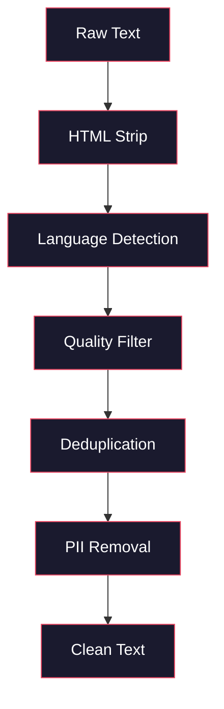
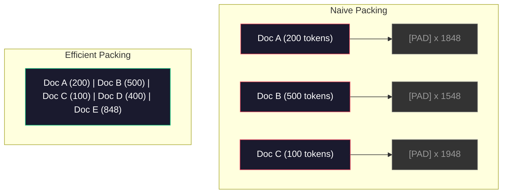

# 预训练数据管道

> 模型是一面镜子。它反映的是你喂给它的数据。你喂垃圾，它就会流利地输出垃圾。

**类型：** 构建  
**语言：** Python  
**前置条件：** 第10阶段，第01-02课（分词器，构建分词器）  
**时长：** ~90分钟

## 学习目标

- 构建一个流式数据管道，能够对数TB的文本进行分词、分块、打乱和批处理，而无需全部加载到内存
- 实现实际预训练管道中使用的数据质量过滤器（去重、语言检测、内容过滤）
- 创建固定长度的训练序列，并配备正确的注意力掩码和文档边界处理
- 分析管道吞吐量，确保数据加载器能够跟上GPU训练速度

## 问题

你有了一个分词器。现在你需要数据。

不是数据集。不是CSV文件。而是数TB的文本 —— 经过清洗、去重、质量过滤，分词为固定长度的序列，并以随机批次的形式提供，速度要足够快，让你的8 GPU集群永远不会等待下一个批次。

大多数人都认为训练LLM的关键在于模型架构。其实不然。Llama 3使用了15.6万亿个token。GPT-3使用了3000亿。DeepSeek-V2使用了8.1万亿。这三个模型的架构大致相同：堆叠的Transformer块，包含注意力层和前馈层。输出质量的差异主要来自数据。

DeepMind的Chinchilla论文精确地指出了这一点。在给定的计算预算下，模型参数与训练token之间存在一个最优比例。Chinchilla表明，2022年的大多数模型都严重欠训练 —— 它们相对于所看到的数据量来说参数过多。一个70B参数模型在1.4万亿token上训练（Chinchilla最优），其性能优于一个在3000亿token上训练的280B模型（Gopher）。

你的数据管道决定了你的模型是学习语言还是学习噪声。

## 概念

### 数据来源

每个大语言模型都基于多种来源的混合数据训练。确切构成是大多数实验室的机密，但我们足以了解各类别的情况。

| 来源 | 大小 | 质量 | 使用方 |
|------|------|------|--------|
| Common Crawl | ~250 TB 原始 | 低（需要重度过滤） | GPT-3, Llama, 大多数开源模型 |
| Wikipedia | ~20 GB | 高 | 每个主要LLM |
| GitHub 代码 | ~1 TB+ | 中（大量重复、死代码） | StarCoder, CodeLlama, DeepSeek-Coder |
| 书籍（BookCorpus, Pile） | ~100 GB | 高 | GPT-2, GPT-3, 早期模型 |
| 学术论文（arXiv, S2ORC） | ~100 GB | 高（对于STEM） | Llama, Galactica |
| StackOverflow, Reddit | ~100 GB | 中 | Llama, Falcon |
| 精选网页（C4, RefinedWeb） | ~5 TB | 中-高（已预过滤） | T5, Falcon |

Llama 3公开了其数据混合比例：大约50%网页数据、25%代码、13%书籍和学术论文、8%数学数据、4%多语言网页数据。总量为15.6万亿个token，来自超过5 TB原始文本的源。

比例与总大小同样重要。网页数据太多，模型就会变成Reddit复读机。代码太少，模型不会编程。数学太少，推理能力就差。获得正确的混合比例是训练LLM最困难的部分之一，没有公式 —— 需要实验和评估。

### 数据清洗

原始网页数据非常脏。典型的Common Crawl转储包含：

- HTML标签和JavaScript
- 样板文件头、页脚、导航菜单
- 重复页面（完全重复与近似重复）
- 机器生成的垃圾信息
- 个人身份信息（PII）
- 低质量文本（关键词列表、SEO垃圾）
- 以文本形式编码的非文本内容

清洗不是可选项。这是生成连贯段落的模型与输出混合着产品列表的HTML标签的模型之间的区别。



每一步消除一种噪声类别：

**HTML剥离：** 移除所有标记。仅保留可见文本内容。像 `trafilatura` 或 `readability` 这样的库可以提取文章内容，同时丢弃导航、广告和样板文件。

**语言检测：** 使用fastText的语言识别模型（lid.176.bin）对每个文档进行分类。过滤到目标语言。一个被分类为英文但置信度低于0.8的文档很可能不是干净的英文。

**质量过滤：** 这是最有趣的部分。RefinedWeb（Falcon背后的数据集）使用基于困惑度的过滤器：在Wikipedia上训练一个小型语言模型，然后对每个文档评分。高困惑度意味着文档不像Wikipedia —— 很可能是垃圾信息、关键词列表或机器生成内容。困惑度超过阈值的文档被移除。

**去重：** 影响最显著的清洗步骤。Common Crawl包含大量重复页面 —— 法律声明、Cookie通知、服务条款。在重复数据上训练浪费算力，并可能导致模型逐字记忆和复读特定段落。

**PII移除：** 姓名、电子邮件地址、电话号码、社保号码。对于结构化PII使用基于正则表达式的检测，对于上下文中的姓名使用NER模型。

### 使用MinHash去重

完全去重很容易：对每个文档计算哈希，移除重复。但近似重复才是真正的问题。同一篇新闻文章两个略有不同广告的版本就是近似重复。内容有95%相同，但逐字节比较则不相同。

MinHash + 局部敏感哈希（LSH）高效地解决了这个问题。


思路：

1. **分片（Shingling）：** 将每个文档转换为n元语法集合（例如，单词或字符的5-gram）。"the quick brown fox" 用3词分片变成 {"the quick brown", "quick brown fox"}。

2. **MinHash：** 对于每个文档的分片集合，计算k个哈希值。每个哈希值是在不同哈希函数下所有分片的最小哈希值。这创建了一个固定大小的“签名”，近似表示任意两个文档之间的Jaccard相似度。

3. **LSH：** 基于MinHash签名的频带（bands）将文档分组到桶中。在同一桶中的文档是候选近似重复。这避免了比较所有文档对 —— 你只比较候选对。

4. **验证：** 对于每个候选对，计算精确的Jaccard相似度。如果相似度超过阈值（通常为0.8），则移除其中一份副本。

Llama团队报告称，通过去重他们移除了大约38%的网页数据。这不是一个小数字。Common Crawl中超过三分之一是重复或近似重复内容。

### 序列打包（Sequence Packing）

你的模型期望固定长度的输入序列。而你的文档长度是变化的。有些是50个token。有些是50,000个token。

朴素方法：将所有文档填充到最大序列长度。这会在填充token上浪费大量算力，而这些token对学习毫无贡献。

更好的方法：将多个文档打包到一个序列中，用序列结束token分隔。一个2048 token的序列可能包含三个短文档，它们通过[EOS] token连接在一起。



注意力掩码必须正确设置。同一打包序列中，来自文档A的token不应关注来自文档B的token。这需要一个块对角注意力掩码。

长文档在序列边界处被截断或分割成块。分割点很重要：在句子中间分割会迫使模型看到不完整的想法。某些管道会尽量在段落或句子边界处对齐分割。

### Chinchilla缩放定律

对于固定的计算预算C（以FLOPs衡量），最优模型大小N和数据集大小D遵循：

```
N_opt ~ C^0.5
D_opt ~ C^0.5
```

在实践中，这意味着你应该大致等比例地扩展模型大小和数据集大小。一个参数多10倍的模型，需要大约多10倍的训练token才能达到相同的损失。

| 模型 | 参数 | 训练 Token | 是否符合Chinchilla最优？ |
|------|------|------------|--------------------------|
| GPT-3 | 175B | 300B | 否（欠训练3-4倍） |
| Chinchilla | 70B | 1.4T | 是（按设计） |
| Llama 2 | 70B | 2T | 过训练（有意为之） |
| Llama 3 | 70B | 15T | 严重过训练 |

Llama 3故意违反了Chinchilla定律。Meta发现，在远超计算最优比例的数据上过度训练，能够产生更好的推理模型。额外的训练成本只支付一次，但更小的模型在服务时永远更便宜。这有时被称为“推理最优”缩放方法，并且自2024年以来已成为行业标准。

## 构建

### 步骤1：文本清洗

剥离HTML，规范化空白，移除非文本内容。我们将使用公共领域文本（Project Gutenberg）作为小语料库。

```python
import re

def clean_text(text):
    text = re.sub(r"<[^>]+>", "", text)
    text = re.sub(r"http\S+", "", text)
    text = re.sub(r"[^\x20-\x7E\n]", "", text)
    text = re.sub(r"\n{3,}", "\n\n", text)
    text = re.sub(r" {2,}", " ", text)
    return text.strip()

def quality_filter(text, min_words=50, max_ratio_caps=0.3, max_ratio_special=0.1):
    words = text.split()
    if len(words) < min_words:
        return False
    caps_ratio = sum(1 for w in words if w.isupper()) / len(words)
    if caps_ratio > max_ratio_caps:
        return False
    special_chars = sum(1 for c in text if not c.isalnum() and not c.isspace())
    if special_chars / max(len(text), 1) > max_ratio_special:
        return False
    return True
```

质量过滤器捕获了SEO垃圾（全大写）、机器生成噪声（高特殊字符比例）和过短页面。仅这三个检查就能从网页抓取中移除大量垃圾。

### 步骤2：MinHash去重

从头实现MinHash。不需要外部库 —— 只需 `hashlib`。

```python
import hashlib
from collections import defaultdict

def get_shingles(text, k=5):
    words = text.lower().split()
    if len(words) < k:
        return set()
    return {" ".join(words[i:i+k]) for i in range(len(words) - k + 1)}

def minhash_signature(shingles, num_hashes=128):
    signature = []
    for i in range(num_hashes):
        min_hash = float("inf")
        for shingle in shingles:
            h = int(hashlib.sha256(f"{i}:{shingle}".encode()).hexdigest(), 16)
            min_hash = min(min_hash, h)
        signature.append(min_hash)
    return signature

def lsh_buckets(signature, bands=16):
    rows_per_band = len(signature) // bands
    buckets = []
    for b in range(bands):
        start = b * rows_per_band
        band_data = tuple(signature[start:start + rows_per_band])
        bucket_hash = hashlib.md5(str(band_data).encode()).hexdigest()
        buckets.append((b, bucket_hash))
    return buckets

def deduplicate(documents, threshold=0.8, num_hashes=128, bands=16):
    signatures = []
    shingle_sets = []
    for doc in documents:
        shingles = get_shingles(doc)
        shingle_sets.append(shingles)
        signatures.append(minhash_signature(shingles, num_hashes))

    bucket_map = defaultdict(list)
    for doc_idx, sig in enumerate(signatures):
        for band_id, bucket_hash in lsh_buckets(sig, bands):
            bucket_map[(band_id, bucket_hash)].append(doc_idx)

    duplicate_pairs = set()
    for bucket_docs in bucket_map.values():
        if len(bucket_docs) < 2:
            continue
        for i in range(len(bucket_docs)):
            for j in range(i + 1, len(bucket_docs)):
                duplicate_pairs.add((bucket_docs[i], bucket_docs[j]))

    removed = set()
    for i, j in duplicate_pairs:
        if i in removed or j in removed:
            continue
        s1, s2 = shingle_sets[i], shingle_sets[j]
        if not s1 or not s2:
            continue
        jaccard = len(s1 & s2) / len(s1 | s2)
        if jaccard >= threshold:
            removed.add(j)

    return [doc for idx, doc in enumerate(documents) if idx not in removed], len(removed)
```

`num_hashes=128` 和 `bands=16` 参数控制精确率与召回率的权衡。更多哈希值给出更准确的相似度估计。更多频带提高召回率（捕获更多重复），但代价是更多误报。这些值对于典型网页文本效果良好。

### 步骤3：分词并打包序列

取清洗、去重后的文本，进行分词，并打包成固定长度序列用于训练。

```python
def tokenize_corpus(documents, tokenizer):
    all_tokens = []
    for doc in documents:
        tokens = tokenizer.encode(doc)
        all_tokens.extend(tokens)
        all_tokens.append(tokenizer.eos_id)
    return all_tokens

def pack_sequences(token_ids, seq_length, pad_id=0):
    sequences = []
    attention_masks = []
    for i in range(0, len(token_ids), seq_length):
        seq = token_ids[i:i + seq_length]
        mask = [1] * len(seq)
        if len(seq) < seq_length:
            pad_count = seq_length - len(seq)
            seq = seq + [pad_id] * pad_count
            mask = mask + [0] * pad_count
        sequences.append(seq)
        attention_masks.append(mask)
    return sequences, attention_masks
```

### 步骤4：用于训练的数据加载器

生成随机化的打包序列批次。这就是训练循环所使用的数据。

```python
import random

class PreTrainingDataLoader:
    def __init__(self, sequences, attention_masks, batch_size, shuffle=True):
        self.sequences = sequences
        self.attention_masks = attention_masks
        self.batch_size = batch_size
        self.shuffle = shuffle

    def __len__(self):
        return (len(self.sequences) + self.batch_size - 1) // self.batch_size

    def __iter__(self):
        indices = list(range(len(self.sequences)))
        if self.shuffle:
            random.shuffle(indices)
        for start in range(0, len(indices), self.batch_size):
            batch_idx = indices[start:start + self.batch_size]
            batch_seqs = [self.sequences[i] for i in batch_idx]
            batch_masks = [self.attention_masks[i] for i in batch_idx]
            yield batch_seqs, batch_masks
```

### 步骤5：数据集统计信息

计算关键数字：总token数、唯一token数、压缩率、文档长度分布。

```python
from collections import Counter

def compute_statistics(documents, token_ids, sequences, tokenizer_vocab_size):
    total_chars = sum(len(d) for d in documents)
    total_tokens = len(token_ids)
    unique_tokens = len(set(token_ids))
    compression_ratio = total_chars / total_tokens

    doc_lengths = [len(d.split()) for d in documents]
    avg_doc_length = sum(doc_lengths) / max(len(doc_lengths), 1)
    max_doc_length = max(doc_lengths) if doc_lengths else 0
    min_doc_length = min(doc_lengths) if doc_lengths else 0

    token_counts = Counter(token_ids)
    top_tokens = token_counts.most_common(10)

    non_pad_tokens = sum(sum(1 for t in seq if t != 0) for seq in sequences)
    total_positions = sum(len(seq) for seq in sequences)
    utilization = non_pad_tokens / max(total_positions, 1)

    stats = {
        "total_documents": len(documents),
        "total_characters": total_chars,
        "total_tokens": total_tokens,
        "unique_tokens": unique_tokens,
        "vocab_utilization": unique_tokens / tokenizer_vocab_size,
        "compression_ratio": compression_ratio,
        "avg_doc_length_words": avg_doc_length,
        "max_doc_length_words": max_doc_length,
        "min_doc_length_words": min_doc_length,
        "num_sequences": len(sequences),
        "sequence_utilization": utilization,
        "top_10_tokens": top_tokens,
    }
    return stats
```

压缩率告诉你分词器在该语料库上的效率。英文文本通常压缩为每个token约3-4个字符。如果你看到每个token 1.5个字符，说明你的分词器拆分过细。如果看到8个以上，说明它学习了非常领域特定的合并。

序列利用率指示了你的打包序列中实际数据与填充的比例。低于90%意味着打包效率低下 —— 你在填充token上浪费算力。

## 使用

### 与HuggingFace Datasets对比

通过HuggingFace的datasets库加载相同的语料库，比较管道速度。

```python
from datasets import load_dataset
from transformers import AutoTokenizer

ds = load_dataset("wikitext", "wikitext-2-raw-v1", split="train")
tokenizer = AutoTokenizer.from_pretrained("meta-llama/Meta-Llama-3-8B")

import time

start = time.time()
tokenized = ds.map(
    lambda x: tokenizer(x["text"], truncation=True, max_length=2048),
    batched=True,
    num_proc=4,
)
hf_time = time.time() - start
total_tokens = sum(len(t) for t in tokenized["input_ids"])
print(f"HuggingFace: {total_tokens:,} tokens in {hf_time:.2f}s ({total_tokens/hf_time:,.0f} tokens/sec)")
```

HuggingFace管道在背后使用Rust分词器，并在4核上并行处理。你的纯Python管道会慢10-50倍。这个差距就是为何生产团队使用编译型分词器的原因。算法相同，实现语言不同。

## 产品输出

本课程提供了一个用于验证和调试LLM训练管道中数据质量的提示模板。见 `outputs/prompt-data-quality-checker.md`。

## 练习

1. **简单：** 在清洗管道中添加语言检测，使用一种简单的启发式方法（字符集分析）。仅过滤英文文档，并测量有多少文档被移除。
2. **中等：** 在MinHash近似去重之外，使用SHA-256哈希实现精确去重。比较在网页抓取语料库上两种方法捕获的重复数量。
3. **困难：** 构建一个基于困惑度的质量过滤器。在Wikipedia文本上训练一个小的二元语法语言模型，对每个文档按困惑度评分，移除得分最低的20%。比较在过滤后数据与未过滤数据上训练时模型输出的质量。

## 关键术语

| 术语 | 人们常说的 | 实际含义 |
|------|------------|----------|
| Common Crawl | "互联网" | 一个非营利组织，每月爬取网络 —— 约250TB原始数据，大多数LLM训练数据的起点 |
| MinHash | "某种哈希技巧" | 一种使用固定大小签名估计集合间Jaccard相似度的技术 —— 支持大规模近似重复检测 |
| LSH | "局部敏感哈希" | 一种将相似项分到同一桶中的方法 —— 将成对比较从O(n²)减少到近线性 |
| 序列打包 | "拼接文档" | 将多个文档放入固定长度序列，并配以正确的注意力掩码 —— 消除填充浪费 |
| Chinchilla缩放 | "用更多数据训练" | 对于固定计算预算，最优性能要求大致等比例扩展模型大小和训练token数 |
| 分娩率（Fertility） | "每个词的token数" | 每个单词的平均token数 —— 英文在GPT-4中约为1.3，非拉丁文字更高 |
| 数据混合 | "选择训练数据" | 代码、文本、数学、多语言数据的比例 —— 没有公式，需要实验 |
| 困惑度过滤器 | "质量评分" | 使用小型语言模型对文档评分 —— 高困惑度表示文本与干净的参考数据不同 |
| 去重 | "移除副本" | 消除完全重复和近似重复文档 —— 通常移除30-40%的原始网页数据 |
| 注意力掩码 | "要看哪些token" | 一个二进制掩码，防止在打包序列中跨文档边界进行注意力计算 |

## 延伸阅读

- [Hoffmann 等, 2022 —— 训练计算最优的大语言模型（Chinchilla）](https://arxiv.org/abs/2203.15556) —— 这篇论文改变了我们对数据规模的思考方式
- [Penedo 等, 2023 —— Falcon LLM 的 RefinedWeb 数据集](https://arxiv.org/abs/2306.01116) —— 如何过滤 Common Crawl 以获得高质量数据
- [Touvron 等, 2023 —— Llama 2：开放基础与微调聊天模型](https://arxiv.org/abs/2307.09288) —— Llama 2 数据管道细节
- [Lee 等, 2022 —— 对训练数据进行去重使语言模型更好](https://arxiv.org/abs/2107.06499) —— 为什么去重比你想象的更重要
- [Broder, 1997 —— 关于文档的相似性与包含关系](https://ieeexplore.ieee.org/document/666900) —— MinHash 原始论文
- [Meta, 2024 —— Llama 3 技术报告](https://arxiv.org/abs/2407.21783) —— 15.6T token、数据混合比例、过滤管道
