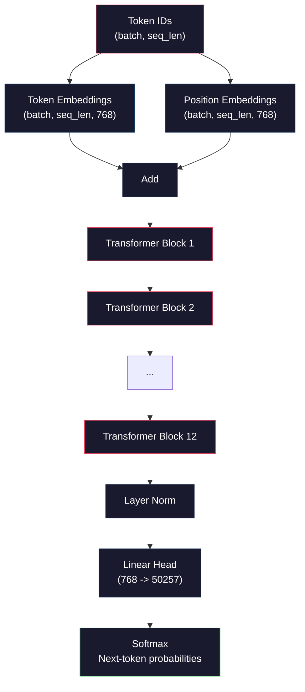
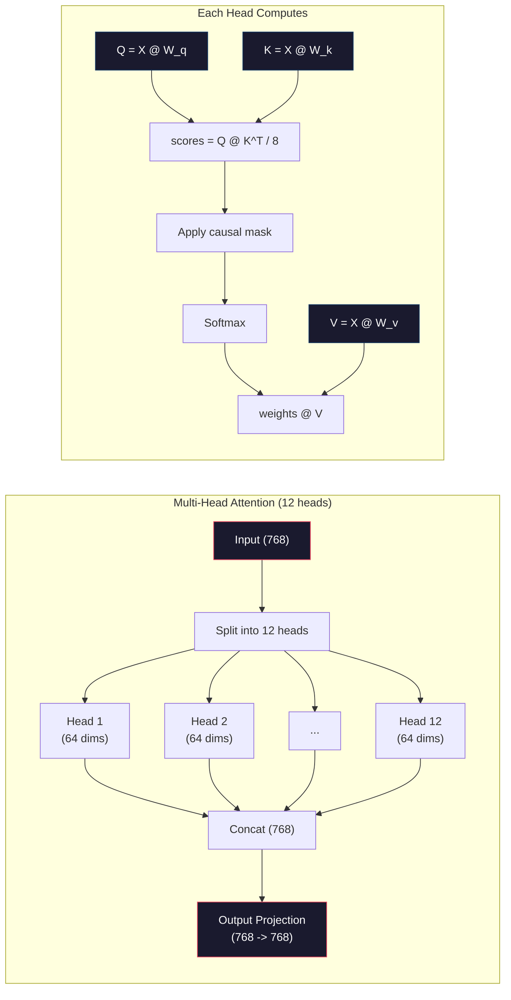
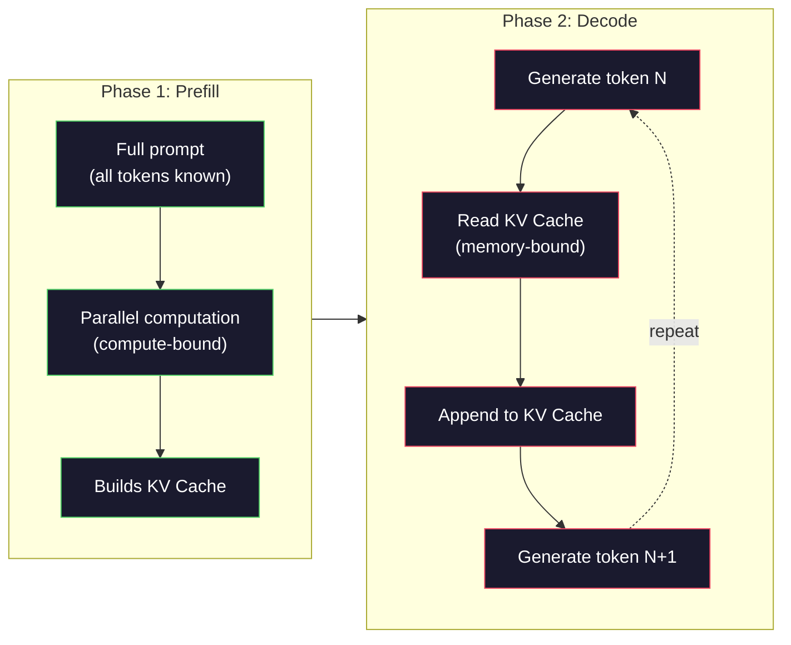

# 从头预训练一个迷你GPT（124M参数）

> GPT-2 Small 拥有 1.24 亿个参数。它包含 12 个 Transformer 层、12 个注意力头以及 768 维的嵌入向量。你可以在一张 GPU 上从零开始训练它，耗时仅需几小时。大多数人从未这样做过，他们直接使用预训练的检查点。但如果你不自己训练一个，你实际上并不理解你正在构建的产品背后模型内部发生了什么。

**类型：** 构建
**语言：** Python（使用 numpy）
**前置知识：** 阶段 10，课程 01-03（分词器、构建分词器、数据管道）
**时间：** ~120 分钟

## 学习目标

- 从零实现完整的 GPT-2 架构（124M 参数）：词元嵌入、位置嵌入、Transformer 块以及语言模型头
- 使用下一个词元预测和交叉熵损失在文本语料上训练 GPT 模型
- 实现带有温度采样以及 top-k/top-p 过滤的自回归文本生成
- 监控训练损失曲线，并验证模型是否学习到连贯的语言模式

## 问题所在

你知道什么是 Transformer。你读过架构图。你可以背诵"注意力就是一切"，并在白板上画出标注为"多头注意力"的方框。

然而这并不意味着你理解模型生成文本时实际发生了什么。

GPT-2 Small（带权重绑定）共有 124,438,272 个参数。每一个参数都是通过运行训练循环设置的：前向传播、计算损失、反向传播、更新权重。十二个 Transformer 块。每块十二个注意力头。一个 768 维的嵌入空间。一个包含 50,257 个词元的词汇表。每次模型生成一个词元时，所有 1.24 亿个参数都参与到一个单一的矩阵乘法链中，这个链将一个词元 ID 序列转化为下一个词元的概率分布。

如果你从未自己构建过这个模型，那你就是在与一个黑箱打交道。你可以使用 API。你可以进行微调。但当出现问题时——当模型产生幻觉、重复自身、拒绝遵循指令时——你没有任何心智模型来解释*为什么*。

本课程从零开始构建 GPT-2 Small。不是用 PyTorch，而是用 numpy。每一个矩阵乘法都可见。每一个梯度都由你的代码计算。你将亲眼看到 1.24 亿个数字如何共同预测下一个词。

## 核心概念

### GPT 架构

GPT 是一种自回归语言模型。"自回归"意味着它一次生成一个词元，每个词元都依赖于之前的所有词元。其架构是 Transformer 解码器块的堆叠。

以下是从词元 ID 到下一个词元概率的完整计算图：

1. 输入词元 ID。形状：(batch_size, seq_len)。
2. 词元嵌入查找。每个 ID 映射到一个 768 维向量。形状：(batch_size, seq_len, 768)。
3. 位置嵌入查找。每个位置 (0, 1, 2, ...) 映射到一个 768 维向量。形状相同。
4. 将词元嵌入与位置嵌入相加。
5. 经过 12 个 Transformer 块。
6. 最后的层归一化。
7. 线性投影到词汇表大小。形状：(batch_size, seq_len, vocab_size)。
8. Softmax 得到概率。

这就是整个模型。没有卷积，没有循环。只有嵌入、注意力、前馈网络和层归一化，堆叠 12 次。



### Transformer 块

12 个块中的每一个都遵循相同的模式。采用预归一化架构（GPT-2 使用预归一化，而非原始 Transformer 的后归一化）：

1. 层归一化
2. 多头自注意力
3. 残差连接（加回输入）
4. 层归一化
5. 前馈网络（MLP）
6. 残差连接（加回输入）

残差连接至关重要。没有它们，梯度在反向传播到达第 1 块时就会消失。有了它们，梯度可以通过"跳跃"路径直接从损失流向任何一层。这就是为什么你可以堆叠 12、32 甚至 96 个块（据传 GPT-4 使用了 120 个块）。

### 注意力：核心机制

自注意力让每一个词元都可以查看所有之前的词元，并决定对每个词元关注多少。以下是数学原理。

对于每个词元位置，从输入中计算三个向量：
- **查询 (Q)**："我在找什么？"
- **键 (K)**："我包含什么？"
- **值 (V)**："我携带什么信息？"

```
Q = input @ W_q    (768 -> 768)
K = input @ W_k    (768 -> 768)
V = input @ W_v    (768 -> 768)

attention_scores = Q @ K^T / sqrt(d_k)
attention_scores = mask(attention_scores)   # causal mask: -inf for future positions
attention_weights = softmax(attention_scores)
output = attention_weights @ V
```

因果掩码是 GPT 实现自回归的关键。位置 5 可以关注位置 0-5，但不能关注 6、7、8 等。这防止了模型在训练时通过"偷看"未来词元来作弊。

**多头注意力**将 768 维空间拆分为 12 个头，每个头 64 维。每个头学习不同的注意力模式。一个头可能跟踪句法关系（主谓一致）。另一个可能跟踪语义相似性（同义词）。另一个可能跟踪位置临近性（附近的词）。所有 12 个头的输出被拼接起来，并投影回 768 维。



除以 sqrt(d_k) —— sqrt(64) = 8 —— 是为了缩放。没有这一步，高维向量的点积会变得很大，将 softmax 推入梯度几乎为零的区域。这是原始论文《Attention Is All You Need》中的关键见解之一。

### KV 缓存：为何推理速度快

训练时，你一次性处理整个序列。推理时，你一次生成一个词元。如果不进行优化，生成词元 N 需要重新计算所有 N-1 个之前词元的注意力。这导致每个生成词元的复杂度为 O(N^2)，或者整个长度为 N 的序列总复杂度为 O(N^3)。

KV 缓存解决了这个问题。在计算每个词元的 K 和 V 之后，将它们存储起来。当生成词元 N+1 时，你只需要计算新词元的 Q，并查找之前所有词元缓存的 K 和 V。这将每个词元的 K 和 V 计算成本从 O(N) 降低到 O(1)。注意力分数的计算仍然是 O(N)，因为你需要关注所有之前的位置，但你避免了在输入上的冗余矩阵乘法。

对于具有 12 层和 12 个头的 GPT-2，KV 缓存存储 2（K + V）× 12 层 × 12 头 × 64 维 = 每个词元 18,432 个值。对于一个 1024 词元的序列，在 FP32 下大约为 75MB。对于具有 128 层的 Llama 3 405B，单个序列的 KV 缓存可能超过 10GB。这就是为什么长上下文推理受内存限制。

### 预填充 vs 解码：推理的两个阶段

当你向 LLM 发送提示词时，推理发生在两个不同的阶段。

**预填充**并行处理你的整个提示。所有词元都是已知的，因此模型可以同时计算所有位置的注意力。这一阶段受计算限制——GPU 在满吞吐量下进行矩阵乘法。对于 A100 上的 1000 词元提示，预填充大约需要 20-50ms。

**解码**一次生成一个词元。每个新词元都依赖于之前的所有词元。这一阶段受内存限制——瓶颈是从 GPU 内存读取模型权重和 KV 缓存，而不是矩阵数学运算本身。GPU 的计算核心大部分时间处于空闲状态，等待内存读取。对于 GPT-2，无论矩阵乘法需要多少 FLOPs，每个解码步骤所需时间大致相同，因为内存带宽是限制因素。

这一区别对于生产系统很重要。预填充吞吐量随 GPU 计算能力缩放（更多 FLOPS = 更快的预填充）。解码吞吐量随内存带宽缩放（更快的内存 = 更快的解码）。这就是为什么 NVIDIA 的 H100 专注于相对于 A100 的内存带宽改进——它直接加速了词元生成。



### 训练循环

训练 LLM 就是下一个词元预测。给定词元 [0, 1, 2, ..., N-1]，预测词元 [1, 2, 3, ..., N]。损失函数是模型预测的概率分布与实际下一个词元之间的交叉熵。

一个训练步骤：

1. **前向传播**：将批次通过所有 12 个块，得到每个位置的 logits（softmax 之前的分数）。
2. **计算损失**：logits 与目标词元（输入向右移动一个位置）之间的交叉熵。
3. **反向传播**：使用反向传播计算所有 1.24 亿个参数的梯度。
4. **优化器步骤**：更新权重。GPT-2 使用 Adam，配合学习率预热和余弦衰减。

学习率调度的重要性可能超出你的预期。GPT-2 在前 2000 步从 0 预热到峰值学习率，然后按照余弦曲线衰减。一开始学习率过高会导致模型发散。保持恒定的高学习率会在训练后期引起震荡。预热-然后-衰减的模式被所有主流 LLM 采用。

### GPT-2 Small：数据一览

| 组件 | 形状 | 参数数量 |
|-----------|-------|------------|
| 词元嵌入 | (50257, 768) | 38,597,376 |
| 位置嵌入 | (1024, 768) | 786,432 |
| 每块注意力 (W_q, W_k, W_v, W_out) | 4 x (768, 768) | 2,359,296 |
| 每块 FFN (up + down) | (768, 3072) + (3072, 768) | 4,718,592 |
| 每块层归一化 (2x) | 2 x 768 x 2 | 3,072 |
| 最后层归一化 | 768 x 2 | 1,536 |
| **每块总计** | | **7,080,960** |
| **总计 (12 块)** | | **85,054,464 + 39,383,808 = 124,438,272** |

输出投影（logits 头）与词元嵌入矩阵共享权重。这称为权重绑定——它减少了 38M 参数，并提升了性能，因为它强制模型对输入和输出使用相同的表示空间。

## 动手构建

### 步骤 1：嵌入层

词元嵌入将 50,257 个可能的词元中的每一个映射到 768 维向量。位置嵌入添加了关于每个词元在序列中位置的信息。两者相加。

```python
import numpy as np

class Embedding:
    def __init__(self, vocab_size, embed_dim, max_seq_len):
        self.token_embed = np.random.randn(vocab_size, embed_dim) * 0.02
        self.pos_embed = np.random.randn(max_seq_len, embed_dim) * 0.02

    def forward(self, token_ids):
        seq_len = token_ids.shape[-1]
        tok_emb = self.token_embed[token_ids]
        pos_emb = self.pos_embed[:seq_len]
        return tok_emb + pos_emb
```

0.02 的标准差初始化来自 GPT-2 论文。太大会导致初始前向传播产生极端值，破坏训练稳定性。太小会导致初始输出对于所有输入几乎相同，使得早期的梯度信号毫无用处。

### 步骤 2：带因果掩码的自注意力

首先是单头注意力。因果掩码在 softmax 之前将未来位置设置为负无穷，确保每个位置只能关注自身及更早的位置。

```python
def attention(Q, K, V, mask=None):
    d_k = Q.shape[-1]
    scores = Q @ K.transpose(0, -1, -2 if Q.ndim == 4 else 1) / np.sqrt(d_k)
    if mask is not None:
        scores = scores + mask
    weights = np.exp(scores - scores.max(axis=-1, keepdims=True))
    weights = weights / weights.sum(axis=-1, keepdims=True)
    return weights @ V
```

Softmax 实现中先减去最大值再取指数。没有这一步，exp(大数) 会溢出到无穷。这是一个数值稳定性技巧，不会改变输出，因为 softmax(x - c) = softmax(x) 对于任意常数 c 成立。

### 步骤 3：多头注意力

将 768 维输入拆分为 12 个头，每个头 64 维。每个头独立计算注意力。将结果拼接起来，再投影回 768 维。

```python
class MultiHeadAttention:
    def __init__(self, embed_dim, num_heads):
        self.num_heads = num_heads
        self.head_dim = embed_dim // num_heads
        self.W_q = np.random.randn(embed_dim, embed_dim) * 0.02
        self.W_k = np.random.randn(embed_dim, embed_dim) * 0.02
        self.W_v = np.random.randn(embed_dim, embed_dim) * 0.02
        self.W_out = np.random.randn(embed_dim, embed_dim) * 0.02

    def forward(self, x, mask=None):
        batch, seq_len, d = x.shape
        Q = (x @ self.W_q).reshape(batch, seq_len, self.num_heads, self.head_dim).transpose(0, 2, 1, 3)
        K = (x @ self.W_k).reshape(batch, seq_len, self.num_heads, self.head_dim).transpose(0, 2, 1, 3)
        V = (x @ self.W_v).reshape(batch, seq_len, self.num_heads, self.head_dim).transpose(0, 2, 1, 3)

        scores = Q @ K.transpose(0, 1, 3, 2) / np.sqrt(self.head_dim)
        if mask is not None:
            scores = scores + mask
        weights = np.exp(scores - scores.max(axis=-1, keepdims=True))
        weights = weights / weights.sum(axis=-1, keepdims=True)
        attn_out = weights @ V

        attn_out = attn_out.transpose(0, 2, 1, 3).reshape(batch, seq_len, d)
        return attn_out @ self.W_out
```

重塑-转置-重塑的舞蹈是多头注意力中最令人困惑的部分。实际过程如下：形状为 (batch, seq_len, 768) 的张量先变成 (batch, seq_len, 12, 64)，再变成 (batch, 12, seq_len, 64)。现在每个头都有自己的 (seq_len, 64) 矩阵用于运行注意力。注意力计算后，我们逆转这个过程：(batch, 12, seq_len, 64) 变成 (batch, seq_len, 12, 64)，再变成 (batch, seq_len, 768)。

### 步骤 4：Transformer 块

一个完整的 Transformer 块：层归一化、带残差的多头注意力、层归一化、带残差的前馈网络。

```python
class LayerNorm:
    def __init__(self, dim, eps=1e-5):
        self.gamma = np.ones(dim)
        self.beta = np.zeros(dim)
        self.eps = eps

    def forward(self, x):
        mean = x.mean(axis=-1, keepdims=True)
        var = x.var(axis=-1, keepdims=True)
        return self.gamma * (x - mean) / np.sqrt(var + self.eps) + self.beta


class FeedForward:
    def __init__(self, embed_dim, ff_dim):
        self.W1 = np.random.randn(embed_dim, ff_dim) * 0.02
        self.b1 = np.zeros(ff_dim)
        self.W2 = np.random.randn(ff_dim, embed_dim) * 0.02
        self.b2 = np.zeros(embed_dim)

    def forward(self, x):
        h = x @ self.W1 + self.b1
        h = np.maximum(0, h)  # GELU approximation: ReLU for simplicity
        return h @ self.W2 + self.b2


class TransformerBlock:
    def __init__(self, embed_dim, num_heads, ff_dim):
        self.ln1 = LayerNorm(embed_dim)
        self.attn = MultiHeadAttention(embed_dim, num_heads)
        self.ln2 = LayerNorm(embed_dim)
        self.ffn = FeedForward(embed_dim, ff_dim)

    def forward(self, x, mask=None):
        x = x + self.attn.forward(self.ln1.forward(x), mask)
        x = x + self.ffn.forward(self.ln2.forward(x))
        return x
```

前馈网络将 768 维输入扩展到 3072 维（4 倍），应用非线性激活，然后投影回 768 维。这种扩张-收缩模式为模型在每个位置提供了一个"更宽"的内部表示空间。GPT-2 使用 GELU 激活函数，但这里为简化使用 ReLU——对于理解架构来说，差异很小。

### 步骤 5：完整 GPT 模型

堆叠 12 个 Transformer 块。在前面添加嵌入层，在后面添加输出投影。

```python
class MiniGPT:
    def __init__(self, vocab_size=50257, embed_dim=768, num_heads=12,
                 num_layers=12, max_seq_len=1024, ff_dim=3072):
        self.embedding = Embedding(vocab_size, embed_dim, max_seq_len)
        self.blocks = [
            TransformerBlock(embed_dim, num_heads, ff_dim)
            for _ in range(num_layers)
        ]
        self.ln_f = LayerNorm(embed_dim)
        self.vocab_size = vocab_size
        self.embed_dim = embed_dim

    def forward(self, token_ids):
        seq_len = token_ids.shape[-1]
        mask = np.triu(np.full((seq_len, seq_len), -1e9), k=1)

        x = self.embedding.forward(token_ids)
        for block in self.blocks:
            x = block.forward(x, mask)
        x = self.ln_f.forward(x)

        logits = x @ self.embedding.token_embed.T
        return logits

    def count_parameters(self):
        total = 0
        total += self.embedding.token_embed.size
        total += self.embedding.pos_embed.size
        for block in self.blocks:
            total += block.attn.W_q.size + block.attn.W_k.size
            total += block.attn.W_v.size + block.attn.W_out.size
            total += block.ffn.W1.size + block.ffn.b1.size
            total += block.ffn.W2.size + block.ffn.b2.size
            total += block.ln1.gamma.size + block.ln1.beta.size
            total += block.ln2.gamma.size + block.ln2.beta.size
        total += self.ln_f.gamma.size + self.ln_f.beta.size
        return total
```

注意权重绑定：`logits = x @ self.embedding.token_embed.T`。输出投影重用了词元嵌入矩阵（转置）。这不仅仅是为了节省参数。它意味着模型使用相同的向量空间来理解词元（嵌入）和预测词元（输出）。

### 步骤 6：训练循环

对于一个真正的 124M 参数训练运行，你需要 GPU 和 PyTorch。这个训练循环在纯 numpy 中演示了小型模型的机制。我们使用一个小模型（4 层、4 头、128 维）以使其可操作。

```python
def cross_entropy_loss(logits, targets):
    batch, seq_len, vocab_size = logits.shape
    logits_flat = logits.reshape(-1, vocab_size)
    targets_flat = targets.reshape(-1)

    max_logits = logits_flat.max(axis=-1, keepdims=True)
    log_softmax = logits_flat - max_logits - np.log(
        np.exp(logits_flat - max_logits).sum(axis=-1, keepdims=True)
    )

    loss = -log_softmax[np.arange(len(targets_flat)), targets_flat].mean()
    return loss


def train_mini_gpt(text, vocab_size=256, embed_dim=128, num_heads=4,
                   num_layers=4, seq_len=64, num_steps=200, lr=3e-4):
    tokens = np.array(list(text.encode("utf-8")[:2048]))
    model = MiniGPT(
        vocab_size=vocab_size, embed_dim=embed_dim, num_heads=num_heads,
        num_layers=num_layers, max_seq_len=seq_len, ff_dim=embed_dim * 4
    )

    print(f"Model parameters: {model.count_parameters():,}")
    print(f"Training tokens: {len(tokens):,}")
    print(f"Config: {num_layers} layers, {num_heads} heads, {embed_dim} dims")
    print()

    for step in range(num_steps):
        start_idx = np.random.randint(0, max(1, len(tokens) - seq_len - 1))
        batch_tokens = tokens[start_idx:start_idx + seq_len + 1]

        input_ids = batch_tokens[:-1].reshape(1, -1)
        target_ids = batch_tokens[1:].reshape(1, -1)

        logits = model.forward(input_ids)
        loss = cross_entropy_loss(logits, target_ids)

        if step % 20 == 0:
            print(f"Step {step:4d} | Loss: {loss:.4f}")

    return model
```

损失起始值接近 ln(vocab_size)——对于 256 词元的字节级词汇表，即 ln(256) = 5.55。随机模型给每个词元分配相等的概率。随着训练进行，损失下降，因为模型学会了预测常见模式："th" 跟在 "t" 后面、句号后面跟空格，等等。

在生产环境中，你会使用 Adam 优化器配合梯度累积、学习率预热和梯度裁剪。前向-损失-反向-更新循环是相同的。优化器更复杂。

### 步骤 7：文本生成

生成过程使用训练好的模型一次预测一个词元。每个预测从输出分布中采样（或贪心地取 argmax）。

```python
def generate(model, prompt_tokens, max_new_tokens=100, temperature=0.8):
    tokens = list(prompt_tokens)
    seq_len = model.embedding.pos_embed.shape[0]

    for _ in range(max_new_tokens):
        context = np.array(tokens[-seq_len:]).reshape(1, -1)
        logits = model.forward(context)
        next_logits = logits[0, -1, :]

        next_logits = next_logits / temperature
        probs = np.exp(next_logits - next_logits.max())
        probs = probs / probs.sum()

        next_token = np.random.choice(len(probs), p=probs)
        tokens.append(next_token)

    return tokens
```

温度控制随机性。温度 1.0 使用原始分布。温度 0.5 使分布更尖锐（更确定——模型更常选择其最顶部的选项）。温度 1.5 使分布更平坦（更随机——低概率词元获得更大的机会）。温度 0.0 是贪心解码（总是选择概率最高的词元）。

`tokens[-seq_len:]` 窗口是必要的，因为模型有一个最大上下文长度（GPT-2 为 1024）。一旦超过，你必须丢弃最旧的词元。这就是大家常说的"上下文窗口"。

## 使用它

### 完整训练与生成演示

```python
corpus = """The transformer architecture has revolutionized natural language processing.
Attention mechanisms allow the model to focus on relevant parts of the input.
Self-attention computes relationships between all pairs of positions in a sequence.
Multi-head attention splits the representation into multiple subspaces.
Each attention head can learn different types of relationships.
The feedforward network provides nonlinear transformations at each position.
Residual connections enable gradient flow through deep networks.
Layer normalization stabilizes training by normalizing activations.
Position embeddings give the model information about token ordering.
The causal mask ensures autoregressive generation during training.
Pre-training on large text corpora teaches the model general language understanding.
Fine-tuning adapts the pre-trained model to specific downstream tasks."""

model = train_mini_gpt(corpus, num_steps=200)

prompt = list("The transformer".encode("utf-8"))
output_tokens = generate(model, prompt, max_new_tokens=100, temperature=0.8)
generated_text = bytes(output_tokens).decode("utf-8", errors="replace")
print(f"\nGenerated: {generated_text}")
```

在小语料和小模型上，生成的文本最多是半连贯的。它会从训练文本中学习一些字节级模式，但无法像 GPT-2 那样使用 40GB 训练数据和完整的 124M 参数架构进行泛化。重点不在于输出质量。重点在于你可以追踪每一个步骤：嵌入查找、注意力计算、前馈变换、logit 投影、softmax 和采样。每个操作都可见。

## 交付成果

本课程产出 `outputs/prompt-gpt-architecture-analyzer.md` —— 一个用于分析任何 GPT 风格模型架构选择的提示词。输入模型卡或技术报告，它会分解参数分配、注意力设计和缩放决策。

## 练习

1. 修改模型，使用 24 层和 16 个头，而不是 12/12。计算参数数量。将深度加倍与将宽度（嵌入维度）加倍相比，效果如何？

2. 实现 GELU 激活函数（GELU(x) = x * 0.5 * (1 + erf(x / sqrt(2)))），并用它替换前馈网络中的 ReLU。分别用两种激活函数训练 500 步，比较最终损失。

3. 在生成函数中添加 KV 缓存。在第一次前向传递后，存储每一层的 K 和 V 张量，并在后续词元中重用它们。测量加速效果：生成 200 个词元，分别使用和不使用缓存，比较挂钟时间。

4. 实现 top-k 采样（只考虑概率最高的 k 个词元）和 top-p 采样（核采样：考虑累积概率超过 p 的最小词元集合）。在温度 0.8 下，比较 top-k=50 与 top-p=0.95 的输出质量。

5. 构建训练损失曲线绘制器。训练模型 1000 步，绘制损失 vs 步数。识别三个阶段：快速初始下降（学习常见字节）、较慢的中期阶段（学习字节模式）、以及平台期（在小语料上过拟合）。无论你训练的是 128 维模型还是 GPT-4，这条曲线的形状都是相同的。

## 关键术语

| 术语 | 人们常说的 | 实际含义 |
|------|----------------|----------------------|
| 自回归 | "它一次生成一个词" | 每个输出词元都依赖于所有之前的词元——模型预测 P(词元_n \| 词元_0, ..., 词元_{n-1}) |
| 因果掩码 | "它看不到未来" | 一个上三角矩阵，填充 -inf，在训练时阻止关注未来位置 |
| 多头注意力 | "多种注意力模式" | 将 Q、K、V 拆分为并行的头（例如 GPT-2 中 12 个头，每个 64 维），以便每个头可以学习不同类型的关系 |
| KV 缓存 | "缓存提速" | 存储之前词元计算出的键和值张量，以避免自回归生成中的冗余计算 |
| 预填充 | "处理提示" | 第一个推理阶段，所有提示词元并行处理——受 GPU FLOPS 计算限制 |
| 解码 | "生成词元" | 第二个推理阶段，词元一次生成一个——受 GPU 带宽内存限制 |
| 权重绑定 | "共享嵌入" | 使用相同的矩阵用于输入词元嵌入和输出投影头——在 GPT-2 中节省 38M 参数 |
| 残差连接 | "跳跃连接" | 将输入直接加到子层输出上（x + sublayer(x)）——使梯度在深度网络中顺畅流动 |
| 层归一化 | "归一化激活值" | 在特征维度上归一化到均值 0 方差 1，带有可学习的缩放和偏置参数 |
| 交叉熵损失 | "预测有多错误" | -log(分配给正确下一个词元的概率)，对所有位置取平均——标准 LLM 训练目标 |

## 延伸阅读

- [Radford et al., 2019 -- "Language Models are Unsupervised Multitask Learners" (GPT-2)](https://cdn.openai.com/better-language-models/language_models_are_unsupervised_multitask_learners.pdf) —— GPT-2 论文，引入了 124M 到 1.5B 参数系列
- [Vaswani et al., 2017 -- "Attention Is All You Need"](https://arxiv.org/abs/1706.03762) —— 原始 Transformer 论文，提出缩放点积注意力和多头注意力
- [Llama 3 Technical Report](https://arxiv.org/abs/2407.21783) —— Meta 如何将 GPT 架构扩展到 405B 参数并使用 16K GPU
- [Pope et al., 2022 -- "Efficiently Scaling Transformer Inference"](https://arxiv.org/abs/2211.05102) —— 正式提出预填充 vs 解码及 KV 缓存分析的论文
