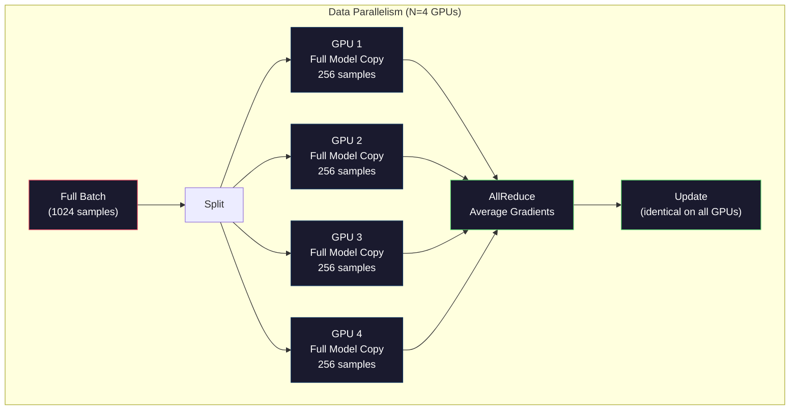
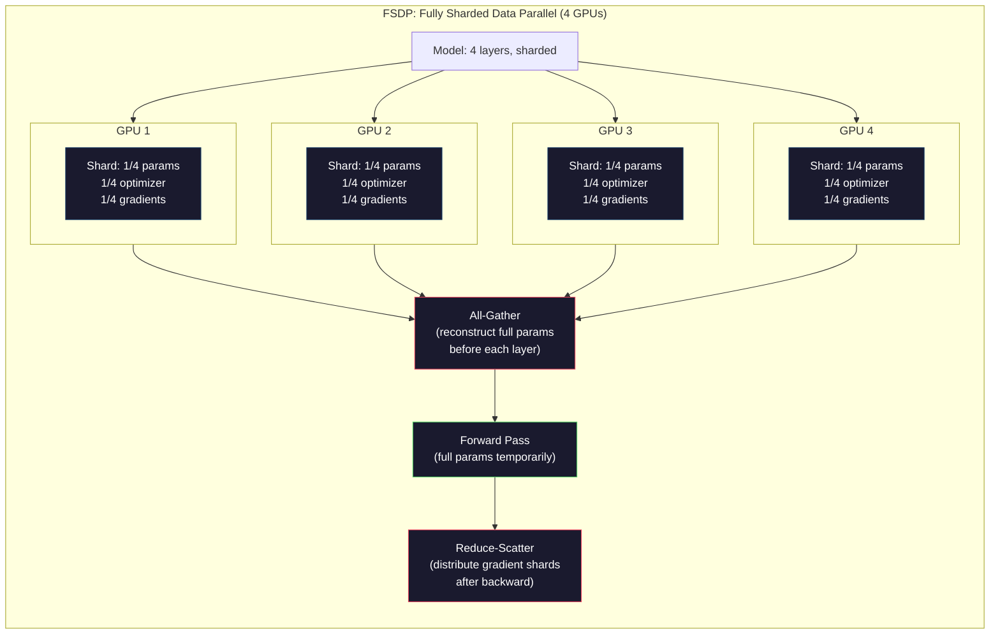
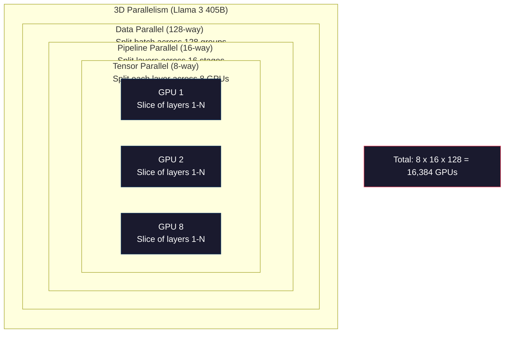

# 扩展：分布式训练、FSDP、DeepSpeed

> 你的124M模型在单GPU上训练。现在尝试70亿参数。模型装不进内存。数据在单台机器上需要数周时间。在规模面前，分布式训练不是选项——而是唯一的出路。

**类型：** 构建
**语言：** Python
**前置条件：** 阶段10，第04课（预训练一个迷你GPT）
**时间：** ~120分钟

## 学习目标

- 解释三种并行方式（数据并行、张量并行、流水线并行），以及根据模型和集群规模何时需要每种方式
- 使用PyTorch DDP实现数据并行训练，并在多个GPU之间同步梯度
- 计算给定模型大小的内存预算（权重 + 优化器状态 + 梯度 + 激活值），以确定最低硬件要求
- 配置FSDP或DeepSpeed ZeRO阶段，将模型状态分片到多个GPU上，使得超出单GPU内存的模型能够训练

## 问题所在

一个70亿参数的FP16模型，仅权重就需要14GB。Adam优化器为每个参数额外存储两个副本（一阶矩和二阶矩估计）。这又是28GB。反向传播过程中的梯度再增加14GB。在存储任何激活值之前，你已经用了56GB。

一块NVIDIA A100有80GB内存。

56GB out of 80GB consumed. That leaves 24GB for activations -- the intermediate values computed during the forward pass that must be kept alive for backpropagation. For a 2048-token sequence with a 4096-dimensional model, a single layer's activations use about 64MB. With 32 layers, you need 2GB per sample. A batch size of 8 requires 16GB. You have 24GB. A batch size of 12 blows up.

Now try 70B parameters. Weights alone: 140GB in FP16. Does not fit on one GPU. You need at least 2 A100s (2 x 80GB = 160GB) just to hold the weights. Add optimizer states and gradients and you need far more: 3+ GPUs minimum, and realistically 8-16 depending on sharding strategy.

Llama 3 405B was trained on 16,384 NVIDIA H100 GPUs. The training run cost an estimated $100 million in compute. DeepSeek V3 trained a comparable model for roughly $5.6 million by being clever about architecture (Mixture of Experts means only a fraction of parameters activate per token) and training efficiency.

This lesson covers the four strategies that make large-scale training possible: data parallelism, tensor parallelism, pipeline parallelism, and fully sharded data parallelism. You will simulate each one in pure Python to understand the mechanics before ever touching a distributed training framework.

## 概念

### 为何需要分布式

以下是真实模型的内存计算。每个数字都是计算得出的，而非估计值。

| 模型 | 参数量 | 权重(FP16) | Adam状态 | 梯度(FP16) | 总计(不含激活值) |
|-------|--------|----------------|-------------|------------------|----------------------|
| GPT-2 Small | 124M | 248 MB | 992 MB | 248 MB | 1.5 GB |
| Llama 3 8B | 8B | 16 GB | 64 GB | 16 GB | 96 GB |
| Llama 3 70B | 70B | 140 GB | 560 GB | 140 GB | 840 GB |
| Llama 3 405B | 405B | 810 GB | 3,240 GB | 810 GB | 4,860 GB |

"Adam状态"一栏是致命杀手。Adam为每个参数存储一个运行均值(m)和运行方差(v)，均为FP32。对于70B模型，即70B × 4字节 × 2 = 560GB。仅优化器就需要七块A100。

一块H100有80GB。Llama 3 405B至少需要61块H100来容纳权重、优化器和梯度。再加上激活值，数量还要增加。Meta使用16,384块GPU并非出于意愿——而是迫不得已。

### 数据并行

最简单的分布式策略。将完整模型复制到N块GPU上。将每个训练批次拆分为N等份。每块GPU在自己分得的数据分片上执行前向和反向传播。反向传播结束后，在所有GPU之间取梯度的平均值。每块GPU使用相同的平均梯度更新自己的权重副本，从而保持所有副本同步。

**优点：** 线性吞吐量缩放。N块GPU每步处理N倍的数据。通信仅限于梯度平均，并且可以与计算重叠。

**缺点：** 每块GPU持有模型、优化器状态和梯度的完整副本。对于70B模型，每块GPU需要840GB。数据并行不能降低每GPU内存占用。它只能减少训练时间。

**数学：** 有效批次大小 = 每GPU批次大小 × N。对于N=64块GPU，每GPU批次为16，有效批次为1,024。Llama 3每步使用的有效批次为1600万token。



### 张量并行

将单个层拆分到多个GPU上。一个矩阵乘法被分割到多个GPU上，各自计算结果的一部分。

考虑一个前馈层中的权重矩阵，形状为(8192, 8192)。采用4路张量并行，每块GPU持有(8192, 2048)的分片。每块GPU将输入与其分片相乘，得到部分结果。然后通过all-reduce或all-gather合并部分结果，得到完整输出。

**优点：** 降低每块GPU上模型权重的内存需求。将70B模型拆分到8块GPU上，每块GPU持有约87.5亿参数对应的权重。

**缺点：** 每个层之后需要快速的GPU间通信。每个matmul后的all-reduce会增加延迟。这在NVLink（节点内GPU之间900 GB/s）上效果良好，但在跨节点通过InfiniBand（400 Gb/s，约50 GB/s）连接时效果较差。张量并行几乎总是限制在单个节点内（8块GPU）。

**实际应用：** Megatron-LM是张量并行的先驱。Llama 3 405B在每个节点内使用8路张量并行。

### 流水线并行

按层拆分模型。GPU 1运行第1-8层。GPU 2运行第9-16层。GPU 3运行第17-24层。GPU 4运行第25-32层。数据在流水线中流动：GPU 1计算其层并将激活传递给GPU 2，GPU 2计算其层并传递给GPU 3，依此类推。

**优点：** GPU之间的通信最小化——仅在层边界传递激活值，激活值比梯度或权重小得多。由于带宽需求低，可以跨节点工作。

**缺点：** 流水线气泡。当GPU 4正在对微批次1执行前向传播时，GPU 1、2、3处于空闲状态（它们已经完成了自己的部分）。反向传播时模式相反。采用朴素流水线，GPU利用率仅为1/N（N为流水线阶段数）。

**GPipe和PipeDream** 通过将批次拆分为微批次来解决气泡问题。GPU 1完成微批次1的前向传递后，立即开始处理微批次2。这样就在流水线阶段之间实现了计算重叠。使用M个微批次和N个阶段，气泡比例下降为(N-1)/M。使用M=16个微批次、N=4个阶段，气泡为3/16 = 18.75%的空闲时间。

### FSDP：全分片数据并行

FSDP将数据并行的可扩展性与分片的内存效率相结合。每块GPU不再持有模型的完整副本，而是仅持有参数、梯度和优化器状态的1/N。

在某个层的前向传播之前，FSDP执行**all-gather**，将所有GPU上的完整参数收集到每块GPU的内存中。前向传播之后，每块GPU丢弃非本地的参数。在反向传播过程中，再次执行all-gather以重建参数用于梯度计算。反向传播之后，执行**reduce-scatter**将梯度分片分发出去，使得每块GPU只存储梯度的1/N。

**70B模型在8块GPU上的数学计算：**

| 组件 | 无FSDP | 有FSDP |
|-----------|-------------|-----------|
| 权重(FP16) | 140 GB per GPU | 17.5 GB per GPU |
| Adam状态(FP32) | 560 GB per GPU | 70 GB per GPU |
| 梯度(FP16) | 140 GB per GPU | 17.5 GB per GPU |
| **总计** | **840 GB per GPU** | **105 GB per GPU** |

无FSDP时，无法将70B模型放入单块80GB GPU。使用FSDP在8块GPU上，每块GPU占用105GB——等等，这仍然放不下。你至少需要16块GPU才能将每块GPU内存降至80GB以下，或者将FSDP与激活检查点（在反向传播时重新计算激活值，而非存储它们）结合使用。

通信成本高于普通数据并行，因为每个层之前都有all-gather。但内存节省使得之前不可能的训练成为可能。



### DeepSpeed ZeRO

DeepSpeed的ZeRO（零冗余优化器）在概念上与FSDP相同，但由微软独立开发。它定义了三个阶段，每个阶段更激进地分片：

| 阶段 | 分片内容 | 内存节省 | 通信量 |
|-------|--------|---------------|---------------|
| ZeRO-1 | 仅优化器状态 | ~4倍缩减 | 与数据并行相同 |
| ZeRO-2 | + 梯度 | ~8倍缩减 | 略微增加 |
| ZeRO-3 | + 参数 | ~N倍缩减 (N块GPU) | 每个层一次all-gather |

ZeRO-3与FSDP等价。名字不同，机制相同。PyTorch在DeepSpeed证明概念之后，将FSDP作为原生实现加入。

DeepSpeed还引入了ZeRO-Offload（将优化器状态卸载到CPU RAM，更便宜且容量更大）和ZeRO-Infinity（卸载到NVMe SSD）。这些方法以计算速度换取内存容量——卸载的操作较慢，但释放了GPU内存。

### 混合精度训练

现代训练同时使用多种浮点格式：

- **前向传播**：FP16或BF16（16位）。内存是FP32的一半。矩阵乘法在张量核心上快2倍。
- **主权重**：FP32（32位）。由优化器维护，用于权重更新时的数值精度。
- **损失缩放**：反向传播前将损失乘以一个大常数，防止FP16梯度下溢为零。优化器步骤前除以相同的常数。

BF16（Brain Float 16）具有与FP32相同的指数范围（8位指数），但精度降低（7位尾数，而FP32为23位）。它很少需要损失缩放，因为可以表示相同的数值范围。FP16有5位指数和10位尾数——可以表示精细的值，但在极端量级下会溢出/下溢。

Google的TPU原生使用BF16。NVIDIA的A100和H100同时支持FP16和BF16。业界已基本转向BF16，因为它消除了损失缩放的麻烦。

**7B模型的内存对比：**

| 精度 | 权重 | 优化器 | 梯度 | 总计 |
|-----------|---------|-----------|-----------|-------|
| 全部FP32 | 28 GB | 56 GB | 28 GB | 112 GB |
| 混合(BF16 + FP32主权重) | 14 GB | 56 GB | 14 GB | 84 GB |

混合精度在此模型上节省了28GB。优化器状态无论精度如何都保留在FP32中——这才是内存消耗的大头。

### Megatron-LM与三维并行

真正的大规模训练将三种并行方式结合：

- **数据并行** 跨节点组（扩大批次大小）
- **张量并行** 在节点内（将层拆分到8块GPU）
- **流水线并行** 跨节点（将层组拆分到多台机器）

Llama 3 405B在16,384块H100上：
- 每个节点内8路张量并行（每个节点8块GPU）
- 跨节点16路流水线并行（16个流水线阶段）
- 在剩余维度上128路数据并行（16,384 / 8 / 16 = 128）

这种三维分解（8 × 16 × 128 = 16,384）使你能够扩展到数千块GPU。每块GPU看到不同的数据分片（数据并行），持有每个层的一个切片（张量并行），并计算不同的层组（流水线并行）。

DeepSeek V3采用了不同的方法。它的混合专家架构每个token只激活671B参数中的37B。这意味着每块GPU只需要计算（并存储激活值）活跃参数。他们在2,048块H800 GPU上训练，不到Meta GPU数量的1/8，花费约560万美元，而Meta的估计花费为1亿美元。



## 动手构建

### 步骤1：模拟数据并行

将一个批次拆分到模拟的GPU上。每块GPU在其分片上执行前向传播。对"梯度"（我们模拟为损失值）取平均。

```python
import numpy as np

def simulate_data_parallelism(data, num_gpus, model_fn):
    batch_size = len(data)
    shard_size = batch_size // num_gpus
    remainder = batch_size % num_gpus

    gpu_losses = []
    gpu_gradients = []

    offset = 0
    for gpu_id in range(num_gpus):
        extra = 1 if gpu_id < remainder else 0
        shard = data[offset:offset + shard_size + extra]
        offset += shard_size + extra

        loss, grad = model_fn(shard)
        gpu_losses.append(loss)
        gpu_gradients.append(grad)

    avg_loss = np.mean(gpu_losses)
    avg_gradient = np.mean(gpu_gradients, axis=0)

    return avg_loss, avg_gradient
```

All-reduce操作（取梯度平均）是数据并行中唯一的通信。在实践中，NVIDIA GPU上使用NCCL库，它实现了环形all-reduce：每块GPU将其梯度的1/N发送给邻居，从另一个邻居接收1/N，经过N-1步后，每块GPU都获得了完整的平均值。总通信量：2 × 梯度大小 × (N-1)/N，对于大N趋近于2倍梯度大小。

### 步骤2：模拟张量并行

将权重矩阵拆分到多个GPU上。每块GPU计算部分矩阵乘法。合并结果。

```python
def simulate_tensor_parallelism(input_data, weight_matrix, num_gpus):
    d_in, d_out = weight_matrix.shape
    assert d_out % num_gpus == 0, f"d_out {d_out} not divisible by num_gpus {num_gpus}"
    shard_size = d_out // num_gpus

    partial_results = []
    for gpu_id in range(num_gpus):
        start = gpu_id * shard_size
        end = start + shard_size
        weight_shard = weight_matrix[:, start:end]

        partial = input_data @ weight_shard
        partial_results.append(partial)

    full_output = np.concatenate(partial_results, axis=-1)

    direct_output = input_data @ weight_matrix
    error = np.abs(full_output - direct_output).max()

    return full_output, error
```

误差应该恰好为零（或机器精度）。张量并行在数学上是精确的——它产生与在单块GPU上计算完整矩阵乘法相同的结果。拆分沿着输出维度进行，因此每块GPU生成不同的列块，拼接后重建完整结果。

对于列并行线性层（拆分输出维度），进行拼接。对于行并行（拆分输入维度），进行求和。在Transformer FFN中，第一个线性层（扩展）使用列并行，第二个线性层（压缩）使用行并行。这样避免了两个层之间的all-reduce。

### 步骤3：模拟流水线并行

将模型的层拆分到虚拟GPU上。展示气泡问题：早期阶段计算时，后期阶段空闲；后期阶段计算时，早期阶段空闲。

```python
def simulate_pipeline_parallelism(num_layers, num_stages, num_microbatches):
    layers_per_stage = num_layers // num_stages

    timeline = {}
    clock = 0

    for mb in range(num_microbatches):
        for stage in range(num_stages):
            start_time = max(
                timeline.get((stage, mb - 1, "fwd"), (0, 0))[1] if mb > 0 else 0,
                timeline.get((stage - 1, mb, "fwd"), (0, 0))[1] if stage > 0 else 0,
            )
            end_time = start_time + layers_per_stage
            timeline[(stage, mb, "fwd")] = (start_time, end_time)

    last_fwd_end = max(v[1] for v in timeline.values())

    for mb in range(num_microbatches - 1, -1, -1):
        for stage in range(num_stages - 1, -1, -1):
            deps = [last_fwd_end]
            if mb < num_microbatches - 1 and (stage, mb + 1, "bwd") in timeline:
                deps.append(timeline[(stage, mb + 1, "bwd")][1])
            if stage < num_stages - 1 and (stage + 1, mb, "bwd") in timeline:
                deps.append(timeline[(stage + 1, mb, "bwd")][1])
            start_time = max(deps)
            end_time = start_time + layers_per_stage
            timeline[(stage, mb, "bwd")] = (start_time, end_time)

    total_time = max(v[1] for v in timeline.values())
    compute_time = num_microbatches * num_stages * layers_per_stage * 2
    bubble_fraction = 1.0 - compute_time / (total_time * num_stages)

    return timeline, total_time, bubble_fraction
```

使用4个阶段和1个微批次，气泡比例为75%——任何时候都有四分之三的GPU空闲。使用16个微批次，气泡降至约19%。消除气泡的代价是内存：你必须同时存储所有正在处理的微批次的激活值。

### 步骤4：内存计算器

计算训练任意大小模型的精确内存需求。

```python
def memory_calculator(
    params_billions,
    precision_bytes=2,
    optimizer="adam",
    num_gpus=1,
    sharding="none",
    sequence_length=2048,
    batch_size_per_gpu=1,
    hidden_dim=None,
    num_layers=None,
):
    params = params_billions * 1e9

    weight_memory = params * precision_bytes

    if optimizer == "adam":
        optimizer_memory = params * 4 * 2
    elif optimizer == "sgd":
        optimizer_memory = params * 4
    else:
        optimizer_memory = 0

    gradient_memory = params * precision_bytes

    total_no_activation = weight_memory + optimizer_memory + gradient_memory

    if hidden_dim and num_layers:
        activation_per_layer = (
            sequence_length * batch_size_per_gpu * hidden_dim * precision_bytes * 4
        )
        activation_memory = activation_per_layer * num_layers
    else:
        activation_memory = params * precision_bytes * 0.5

    if sharding == "fsdp" or sharding == "zero3":
        weight_memory /= num_gpus
        optimizer_memory /= num_gpus
        gradient_memory /= num_gpus
    elif sharding == "zero2":
        optimizer_memory /= num_gpus
        gradient_memory /= num_gpus
    elif sharding == "zero1":
        optimizer_memory /= num_gpus

    per_gpu_total = weight_memory + optimizer_memory + gradient_memory + activation_memory

    return {
        "params_billions": params_billions,
        "weights_gb": weight_memory / 1e9,
        "optimizer_gb": optimizer_memory / 1e9,
        "gradients_gb": gradient_memory / 1e9,
        "activations_gb": activation_memory / 1e9,
        "per_gpu_total_gb": per_gpu_total / 1e9,
        "total_across_gpus_gb": per_gpu_total * num_gpus / 1e9,
        "fits_on_80gb": per_gpu_total / 1e9 <= 80,
        "num_gpus": num_gpus,
        "sharding": sharding,
    }
```

这个计算器回答了每位机器学习工程师都会问的问题："我需要多少块GPU？"输入模型大小，查看是否放得下。调整分片策略，直到每块GPU的总内存低于80GB。

### 步骤5：混合精度模拟

比较FP32、FP16和混合精度训练的内存使用。

```python
def mixed_precision_comparison(params_billions):
    params = params_billions * 1e9

    fp32_weights = params * 4
    fp32_optimizer = params * 4 * 2
    fp32_gradients = params * 4
    fp32_total = fp32_weights + fp32_optimizer + fp32_gradients

    fp16_weights = params * 2
    fp16_master = params * 4
    fp16_optimizer = params * 4 * 2
    fp16_gradients = params * 2
    fp16_total = fp16_weights + fp16_master + fp16_optimizer + fp16_gradients

    mixed_weights = params * 2
    mixed_optimizer = params * 4 * 2
    mixed_gradients = params * 2
    mixed_total = mixed_weights + mixed_optimizer + mixed_gradients

    return {
        "fp32_total_gb": fp32_total / 1e9,
        "fp16_with_master_gb": fp16_total / 1e9,
        "mixed_bf16_gb": mixed_total / 1e9,
        "savings_vs_fp32": 1 - mixed_total / fp32_total,
    }
```

对大多数人来说最令人惊讶的是：混合精度并没有将内存减半。优化器状态（Adam的m和v）无论精度如何都保留在FP32中。对于7B模型，FP32训练使用112GB。混合精度使用84GB。这只减少了25%，而不是50%。优化器占主导地位。

## 使用它

### 运行所有模拟

```python
def run_all_demos():
    print("=" * 70)
    print("DATA PARALLELISM SIMULATION")
    print("=" * 70)

    np.random.seed(42)
    data = np.random.randn(64, 32)
    weight = np.random.randn(32, 16)

    def model_fn(batch):
        output = batch @ weight
        loss = np.mean(output ** 2)
        grad = 2 * batch.T @ (batch @ weight) / len(batch)
        return loss, grad

    for n_gpus in [1, 2, 4, 8]:
        loss, grad = simulate_data_parallelism(data, n_gpus, model_fn)
        print(f"  {n_gpus} GPUs: loss={loss:.4f}, grad_norm={np.linalg.norm(grad):.4f}")

    print()
    print("=" * 70)
    print("TENSOR PARALLELISM SIMULATION")
    print("=" * 70)

    x = np.random.randn(4, 8192)
    W = np.random.randn(8192, 8192)

    for n_gpus in [1, 2, 4, 8]:
        output, error = simulate_tensor_parallelism(x, W, n_gpus)
        print(f"  {n_gpus} GPUs: output_shape={output.shape}, max_error={error:.2e}")

    print()
    print("=" * 70)
    print("PIPELINE PARALLELISM SIMULATION")
    print("=" * 70)

    for n_mb in [1, 4, 8, 16, 32]:
        _, total_t, bubble = simulate_pipeline_parallelism(32, 4, n_mb)
        print(f"  {n_mb:2d} micro-batches: total_time={total_t:4d}, bubble={bubble:.1%}")

    print()
    print("=" * 70)
    print("MEMORY CALCULATOR")
    print("=" * 70)

    configs = [
        (7, "none", 1),
        (7, "fsdp", 8),
        (70, "none", 1),
        (70, "fsdp", 8),
        (70, "fsdp", 16),
        (405, "fsdp", 64),
        (405, "fsdp", 128),
    ]

    print(f"  {'Model':>8} {'Sharding':>8} {'GPUs':>5} {'Per-GPU':>10} {'Fits 80GB':>10}")
    print("  " + "-" * 50)
    for params, shard, gpus in configs:
        result = memory_calculator(params, num_gpus=gpus, sharding=shard)
        fits = "Yes" if result["fits_on_80gb"] else "No"
        print(f"  {params:>6}B {shard:>8} {gpus:>5} {result['per_gpu_total_gb']:>8.1f}GB {fits:>10}")

    print()
    print("=" * 70)
    print("MIXED PRECISION COMPARISON")
    print("=" * 70)

    for params_b in [7, 13, 70, 405]:
        result = mixed_precision_comparison(params_b)
        print(f"  {params_b}B: FP32={result['fp32_total_gb']:.0f}GB, "
              f"Mixed BF16={result['mixed_bf16_gb']:.0f}GB, "
              f"Savings={result['savings_vs_fp32']:.0%}")
```

## 交付

本课程输出`outputs/prompt-distributed-training-planner.md`——一个提示词，接收模型大小和可用硬件，然后生成完整的分布式训练计划：并行策略、内存预算、通信开销和预期吞吐量。

## 练习

1. 修改内存计算器，加入激活检查点。使用检查点时，仅在每第K层存储激活值（典型K=1，意味着全部重新计算）。展示内存-计算权衡：检查点节省了多少内存，以及训练慢了多少（完全检查点大约增加33%的计算量）？

2. 扩展流水线并行模拟，实现PipeDream使用的1F1B（一次前向，一次反向）调度。比较4个阶段和8个微批次下与朴素调度的气泡比例。1F1B调度应该具有更小的峰值内存，因为它更早开始反向传播。

3. 实现梯度累积模拟。不在每个微批次后进行all-reduce，而是本地累积梯度K步，然后进行一次all-reduce。展示这如何将通信减少K倍，但产生完全相同的最终梯度（因此训练也相同）。

4. 构建成本估算器。给定模型大小、目标token数、GPU类型（A100每小时2美元，H100每小时3.5美元）和并行策略，估算总训练成本（美元）。对照已知成本验证：Llama 3 405B据报道花费约1亿美元，DeepSeek V3花费约560万美元。

5. 在内存计算器中加入ZeRO-Offload。假设每节点CPU RAM为512GB，NVMe为2TB。展示将优化器状态卸载到CPU如何允许70B模型在4块GPU上训练（而非16块），代价是优化器步骤减慢30-50%。

## 关键术语

| 术语 | 人们怎么说 | 实际含义 |
|------|----------------|----------------------|
| 数据并行 | "把模型复制到每块GPU上" | 每块GPU处理不同的数据分片；每一步后通过all-reduce取梯度平均 |
| 张量并行 | "把一层拆分到多块GPU上" | 划分权重矩阵，使每块GPU计算矩阵乘法的一部分；需要高速NVLink互连 |
| 流水线并行 | "把层拆分到多块GPU上" | 每块GPU运行不同的层组；数据在流水线中流动，使用微批次减少气泡 |
| FSDP | "分片一切" | 全分片数据并行——每块GPU持有1/N的权重、梯度和优化器状态；计算前进行all-gather |
| ZeRO | "DeepSpeed版的FSDP" | 零冗余优化器，分三个阶段：分片优化器（阶段1），+梯度（阶段2），+参数（阶段3） |
| All-reduce | "在GPU间取平均" | 集体操作，每块GPU最终得到所有GPU输入的和（或平均）——通常以环形all-reduce实现 |
| All-gather | "从所有GPU收集" | 集体操作，每块GPU最终得到所有GPU数据的拼接——FSDP中用于重建完整参数 |
| Reduce-scatter | "求和并分发" | 集体操作，对数据执行规约（求和）并将不同块散播到不同GPU——FSDP中用于梯度分片 |
| 混合精度 | "用半精度训练" | 前向/反向使用FP16/BF16，优化器状态使用FP32——节省约25%内存，而非50%，因为优化器占主导 |
| 流水线气泡 | "流水线中的空闲时间" | GPU因等待前一阶段数据而空闲的时间比例——通过使用更多微批次来减少 |

## 延伸阅读

- [Rajbhandari et al., 2020 -- "ZeRO: Memory Optimizations Toward Training Trillion Parameter Models"](https://arxiv.org/abs/1910.02054) —— DeepSpeed ZeRO论文，定义了三个分片阶段
- [Shoeybi et al., 2020 -- "Megatron-LM: Training Multi-Billion Parameter Language Models Using Model Parallelism"](https://arxiv.org/abs/1909.08053) —— NVIDIA针对Transformer的张量并行
- [Narayanan et al., 2021 -- "Efficient Large-Scale Language Model Training on GPU Clusters Using Megatron-LM"](https://arxiv.org/abs/2104.04473) —— 结合数据、张量和流水线并行的三维并行
- [Zhao et al., 2023 -- "PyTorch FSDP: Experiences on Scaling Fully Sharded Data Parallel"](https://arxiv.org/abs/2304.11277) —— PyTorch原生FSDP实现
- [Llama 3 Technical Report](https://arxiv.org/abs/2407.21783) —— 16,384 GPU训练，包含三维并行细节
- [DeepSeek-V3 Technical Report](https://arxiv.org/abs/2412.19437) —— MoE架构如何将训练成本降低一个数量级
