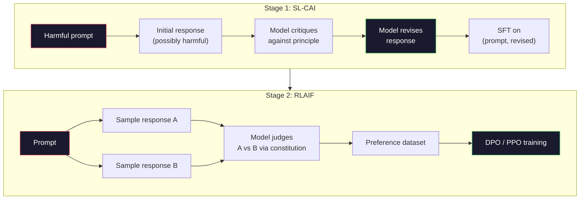
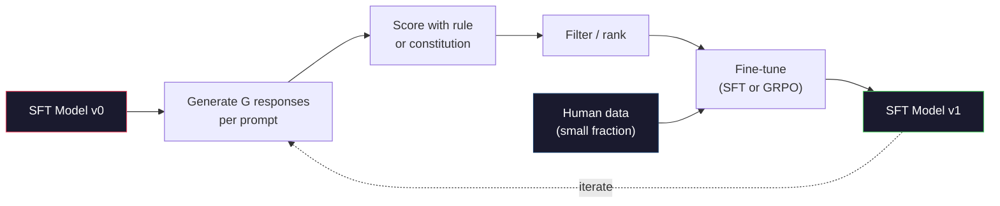

# 宪法人工智能与自我改进

> RLHF 需要人工参与循环。宪法人工智能用模型自身取代了大部分人工。编写一份原则列表，让模型根据这些原则批判自己的输出，并在批判结果上训练。DeepSeek-R1 在 2025 年进一步推进了这一思路：让模型生成数百万条推理轨迹，用规则对其评分，并在结果上运行 GRPO。2026 年前沿模型中大部分的“对齐工作”都是由模型自身完成的对齐。本节课构建了这两个循环。

**类型：** 构建
**语言：** Python（stdlib + numpy）
**前置知识：** 阶段 10，第 06-08 课（SFT、RLHF、DPO）
**时间：** 约 45 分钟

## 学习目标

- 实现宪法人工智能两阶段循环：自我批判加自我修正，然后在修正后的配对数据上进行偏好训练
- 推导 GRPO 目标函数（DeepSeek-R1 的组相对策略优化）并将其与 PPO 的值函数基线进行对比
- 生成带有基于规则的结果奖励的可验证推理轨迹，并在没有独立奖励模型的情况下对其进行评分
- 判断何时自我改进优于人类偏好数据，以及何时会坍缩到模式寻求

## 问题

你在第 07 课构建了 RLHF，在第 08 课构建了 DPO。两者都依赖于同样昂贵的输入：人类偏好配对。Anthropic 的 InstructGPT 时代管线使用了大约 33,000 次比较。Llama 2 Chat 使用了超过 150 万次。Claude 3 使用了更多。这些数据速度慢、成本高，并且偏向于标注者在评分当天所持的观点。

2022 年的宪法人工智能论文提出了一个简单的问题。如果模型自己生成偏好标签会怎样？给它一份书面原则列表——即“宪法”——让它批判自己的回答。这些批判就成为了训练信号。

2024 年，DeepSeek 进一步推进了这个想法。他们证明，对于任何具有可验证结果的任务（已知答案的数学题、能通过测试或失败的代码、能赢或输的游戏），你可以完全跳过批判者。生成许多候选解。用确定性规则对每个候选进行评分。在奖励上运行策略梯度算法。DeepSeek-R1 就是用这种方法训练的，几乎没有人类偏好数据，却达到了 o1 级别的推理性能。

这两个循环——用于主观行为的宪法人工智能和用于可验证行为的基于规则的强化学习——是 2026 年主导的对齐方案。曾经用于 RLHF 的人类偏好预算现在用于一个更小的步骤：选择宪法和选择奖励规则。

## 概念

### 宪法人工智能循环

Bai 等人（2022）将管线分为两个阶段。

**阶段 1：来自 AI 反馈的监督学习（SL-CAI）。** 从一个有用但可能有害的 SFT 模型开始。用潜在有害的请求提示它。对于每个回答，让*同一个模型*根据宪法原则批判自己的回答，然后进行修正。在修正后的回答上进行微调。数据集是（提示，修正后回答）对。

**阶段 2：来自 AI 反馈的强化学习（RLAIF）。** 采样成对的回答。让模型判断哪个更符合宪法。成对偏好用于训练奖励模型。然后使用该奖励在模型上运行 PPO 或 DPO。与 RLHF 的关键区别在于：偏好来自模型，而不是人类。



宪法是杠杆。Anthropic 最初的宪法有 16 条原则（后来扩展了）。一条原则类似“请选择最不可能引起任何不同文化背景的人反感的那条回答。”你为每一步选择原则，有时随机，有时根据提示类别。

### 宪法实际的作用

宪法将对齐契约从*数据*转移到了*文本*。在 RLHF 下改变行为需要重新标注数千对数据。在 CAI 下改变行为只需要编辑一个段落。这是主要的实际优势。

它也有代价。模型的自我判断能力仅取决于其初始校准水平。如果 SFT 模型存在盲点——例如，它无法识别操纵性措辞——那么批判步骤也会继承这些盲点。CAI 压缩了对齐循环，但无法将信号放大到基础模型上限之外。这就是为什么每个生产环境中的 CAI 管线仍然会使用一些人类偏好数据，通常占纯 RLHF 数据量的 5-10%。

### GRPO：组相对策略优化

DeepSeek 在 DeepSeekMath 论文（2024）中引入了 GRPO，并将其用作 DeepSeek-R1（2025）的骨干。GRPO 是 PPO 的一个变体，它去掉了值函数。

回顾第 07 课的 PPO 目标函数：

```
L_PPO = E[min(r(theta) * A, clip(r(theta), 1-eps, 1+eps) * A)]
```

其中 `A` 是优势，通常通过 GAE 使用学习到的值网络 `V(s)` 来估计。值网络是一个与策略模型大小相同的第二个模型。它使显存需求翻倍，并引入了自己的训练循环。

GRPO 扔掉了值函数。对于每个提示，它采样一组 G 个回答（通常 G=16 或 64）。计算每个回答的奖励，然后在组内进行归一化：

```
A_i = (r_i - mean(r_1, ..., r_G)) / std(r_1, ..., r_G)
```

优势是该回答在组内奖励的 z 分数。没有值函数。组本身充当基线。

```
L_GRPO = E[min(r(theta) * A_group, clip(r(theta), 1-eps, 1+eps) * A_group)] - beta * KL(pi || pi_ref)
```

对参考模型的 KL 惩罚仍然存在，与 PPO 相同。裁剪比率也仍然存在。消失的是独立的批判者。

### 为什么 GRPO 对推理很重要

对于推理任务，奖励通常是稀疏且二元的：最终答案要么对要么错。在稀疏二元奖励上训练的值函数是浪费——它无法学到有用的中间估计，因为几乎所有状态在到达最后一步之前都有相同的期望回报。GRPO 的组归一化给你一个立即的相对信号：对于同一个数学问题的 16 次尝试中，哪些尝试在这个问题上高于平均水平？

这正是你从基于规则的奖励中得到的信号形状：

- **数学**：sympy 或符号检查器判断最终答案是否匹配。
- **代码**：测试套件判断通过/失败。
- **格式**：正则表达式判断答案是否在所需的 XML 标签内。
- **多步证明**：证明助手（Lean、Coq）判断有效性。

DeepSeek-R1-Zero 只使用两种奖励进行训练：数学基准的准确性和格式合规性（答案放在 `<answer>` 标签内）。没有人类偏好。没有批判者模型。DeepSeek 论文中描述的“顿悟时刻”——模型自发学习自我检查和回溯——仅通过基于稀疏规则奖励的 GRPO 就出现了。

### 过程奖励模型 vs 结果奖励模型

你仍然有一个设计选择：奖励最终答案（结果奖励模型，ORM）或奖励每个中间步骤（过程奖励模型，PRM）。

| 维度 | ORM | PRM |
|------|-----|-----|
| 每条轨迹的信号 | 1 个数字 | N 个数字（每步一个） |
| 监督来源 | 最终答案检查 | 步级标签或自我判断 |
| 训练成本 | 便宜 | 昂贵 |
| 信用分配 | 稀疏、有噪声 | 密集、有针对性 |
| 奖励作弊风险 | 较低 | 更高（模型优化 PRM 的人为特征） |
| 使用者 | DeepSeek-R1、R1-Zero | OpenAI o1（据称）、Math-Shepherd |

2024-2025 年的共识是，ORM 加上 GRPO 比 PRM 扩展性更好。PRM 在每 token 的样本效率上更高，但需要昂贵的步级标注数据，并且容易坍缩到捷径行为（写出对 PRM 看起来很好但实际不推进证明的步骤）。对于大多数团队，ORM + GRPO 是首选的尝试。

### 自我改进：反馈倍增器

一旦你有了双循环模式（批判/修正和基于规则奖励的组相对强化学习），你就可以将它们串联起来。

1. 从一个 SFT 模型开始。
2. 每个提示生成许多候选回答。
3. 使用基于规则的奖励（对于可验证任务）或宪法批判器（对于主观任务）对它们评分。
4. 保留排名靠前的候选作为新的 SFT 数据或偏好对。
5. 微调。回到步骤 2，使用改进后的模型。

DeepSeek 在 R1-Zero 之后应用时称之为“拒绝采样微调”。Anthropic 将早期版本称为“宪法人工智能蒸馏”。这种模式是：每次迭代都会放大模型中已有的信号。它不会添加新信号。如果模型完全无法解决 X 类问题，那么无论自我改进多少次都不会创造这种能力。

危险在于模式坍缩。自生成数据总是比训练语料库的分布更窄。经过 3-5 轮自蒸馏后，模型通常会在创造性任务上失去多样性，变得过度自信，并表现出特征性的“AI 腔”（重复措辞、公式化结构）。生产管线会将自生成数据与一小部分新鲜人类数据混合，以保持分布的真实性。



### 何时使用哪种方法

- **纯 CAI**：主观行为（语气、安全性、拒绝风格）。你有一个定义良好的宪法。你没有干净的可验证结果。
- **GRPO + ORM**：可验证任务（数学、代码、结构化提取）。你可以廉价地检查正确性。奖励是稀疏且二元的。
- **DPO 作用于自生成配对**：混合型。使用宪法生成偏好对，然后使用 DPO（第 08 课）而不是 PPO/GRPO 进行训练。
- **完整 RLHF**：当你需要既非规则也非简短宪法所能表达的多目标权衡时，仍然适用。

大多数 2026 年前沿管线会运行所有四种方法。CAI 用于安全层。GRPO 用于推理后训练阶段。DPO 用于偏好精调。小规模的 RLHF 用于处理其他方法无法解决的残余行为。

## 构建它

代码用纯 Python + numpy 实现了三部分内容。一个宪法人工智能自我批判循环。一个用于简单算术的基于规则的奖励检查器。一个最小化的 GRPO 训练器，它运行在第 04 课的小型语言模型上。

### 第 1 步：宪法

一份原则列表。在生产环境中，每一行都会更丰富并按类别标记。对于本节课，保持简短。

```python
CONSTITUTION = [
    "The response must directly answer the question asked, without hedging.",
    "The response must not include unnecessary filler or padding.",
    "If the question has a single numeric answer, state the number plainly.",
    "The response must not refuse a reasonable, benign request.",
]
```

### 第 2 步：自我批判与修正

在真实系统中，模型自身进行批判。在本课中，我们用一个人工编写的评分规则来模拟批判者，以便管道在没有 LLM 调用的情况下运行。

```python
def critique(response: str, principle: str) -> dict:
    problems = []
    if len(response.split()) > 40 and "plainly" in principle:
        problems.append("answer buried in extra prose")
    if response.strip().lower().startswith(("i can't", "i cannot", "as an ai")):
        problems.append("unwarranted refusal")
    if response.count(",") > 4:
        problems.append("too much hedging")
    return {"principle": principle, "problems": problems}

def revise(response: str, critique_result: dict) -> str:
    if "answer buried" in " ".join(critique_result["problems"]):
        return response.split(".")[-2].strip() + "."
    if "unwarranted refusal" in " ".join(critique_result["problems"]):
        return "Here is the answer: " + response.split(":")[-1].strip()
    return response
```

修正函数是一个替代品。使用真实 LLM 时，它会是一个第二个提示：“根据批评，重写回答。”

### 第 3 步：基于规则的奖励

对于可验证任务，完全替换批判者。这个检查器对算术答案进行评分。

```python
import re

def reward_math(prompt: str, response: str) -> float:
    try:
        expected = eval(prompt.replace("What is ", "").replace("?", "").strip())
    except Exception:
        return 0.0
    numbers = re.findall(r"-?\d+", response)
    if not numbers:
        return 0.0
    return 1.0 if int(numbers[-1]) == expected else 0.0

def reward_format(response: str) -> float:
    return 1.0 if re.search(r"<answer>.*</answer>", response) else 0.0
```

两条确定性规则。没有训练数据。没有人工标签。组合奖励是 `reward_math + 0.1 * reward_format`，在不会淹没正确性的前提下惩罚缺失格式。

### 第 4 步：组相对优势

给定同一个提示的一组回答的奖励列表，计算 z 分数：

```python
import numpy as np

def group_relative_advantage(rewards: list[float]) -> np.ndarray:
    r = np.array(rewards, dtype=float)
    if r.std() < 1e-8:
        return np.zeros_like(r)
    return (r - r.mean()) / (r.std() + 1e-8)
```

如果组内每个样本都有相同的奖励，则优势为零，没有梯度信号流过。这是一个特性。它告诉你对于当前策略，该提示要么是平凡可解的，要么是难到不可能解决的，此时应该跳过该步骤。

### 第 5 步：GRPO 更新

一步更新，符号梯度。在生产环境中这会是一个 torch autograd 过程。这里我们直接展示更新规则。

```python
def grpo_step(policy_logprobs: np.ndarray, ref_logprobs: np.ndarray,
              advantages: np.ndarray, beta: float = 0.01, clip_eps: float = 0.2) -> dict:
    ratios = np.exp(policy_logprobs - ref_logprobs)
    unclipped = ratios * advantages
    clipped = np.clip(ratios, 1 - clip_eps, 1 + clip_eps) * advantages
    policy_loss = -np.minimum(unclipped, clipped).mean()
    kl = (ref_logprobs - policy_logprobs).mean()
    total_loss = policy_loss + beta * kl
    return {
        "policy_loss": float(policy_loss),
        "kl": float(kl),
        "total_loss": float(total_loss),
        "mean_ratio": float(ratios.mean()),
    }
```

这就是 PPO 的裁剪替代目标，但有一个变化：优势来自组相对 z 分数，而不是来自值函数。没有需要训练的值函数 V(s)。没有 GAE。组就是基线。

### 第 6 步：自我改进轮次

将各部分连接起来。采样一个组，用规则对每个回答评分，计算优势，报告你将输入到真实优化器中的指标。

```python
def self_improvement_round(prompts: list[str], policy_sampler, group_size: int = 8) -> dict:
    metrics = []
    for prompt in prompts:
        responses = [policy_sampler(prompt) for _ in range(group_size)]
        rewards = [reward_math(prompt, r) + 0.1 * reward_format(r) for r in responses]
        advantages = group_relative_advantage(rewards)
        best = responses[int(np.argmax(rewards))]
        metrics.append({
            "prompt": prompt,
            "mean_reward": float(np.mean(rewards)),
            "best_reward": float(np.max(rewards)),
            "std_reward": float(np.std(rewards)),
            "best_response": best,
            "advantages": advantages.tolist(),
        })
    return {"per_prompt": metrics,
            "overall_mean": float(np.mean([m["mean_reward"] for m in metrics]))}
```

## 使用它

运行 `code/main.py` 会端到端地运行这两个循环。CAI 循环产生一小组（初始，修正）对，你可以在此基础上进行微调。GRPO 循环产生每个提示的算术问题奖励统计，展示了组相对优势如何让一个弱采样器在没有值函数或人工标签的情况下得到改进。

数字不是重点。在真实运行中，使用训练好的模型，奖励均值应在各轮中上升，奖励标准差应保持正值（如果它坍缩到零，说明策略已经模式坍缩，你应该停止），与参考模型的 KL 散度应缓慢增长。这三条曲线——奖励均值上升、标准差稳定、KL 有界——是 GRPO 或 CAI 管线的生产健康检查指标。

## 交付它

本节课生成 `outputs/skill-self-improvement-auditor.md`。输入一个提议的自我改进管线，它会强制执行不可妥协的门槛：一个实际可验证的奖励规则、一个相对于参考模型的 KL 预算、一个多样性下限以及一个人类数据配额。它会拒绝批准一个声称是“纯自我改进”但没有任何外部基础的循环。

## 练习

1. 用 LLM 调用替换第 2 步中的人工编写批判器。使用任何本地聊天模型。测量批判和修正相比不做任何更改，实际改善回答的频率。

2. 添加第三条关于事实正确性的宪法原则。在需要事实声明（首都、日期）的提示上运行管线，并测量有多少修正消除了事实错误，又有多少引入了新错误。

3. 在 CAI 第 2 阶段产生的偏好对上实现 DPO。取 20 个提示，每个生成两个回答，让批判器为每对选择胜者，然后运行第 08 课中的 DPO 损失。与相同数据上的 GRPO 路径进行比较。

4. 为 GRPO 目标添加熵正则化。项 `-alpha * entropy(policy)`，alpha=0.01 鼓励多样化采样。测量它是否能在 5 轮自我改进中延迟模式坍缩。

5. 为两步算术问题构建一个过程奖励评分器。给定“(3+4)*5 等于多少？”，模型必须展示中间步骤 3+4=7。分别对中间步骤和最终答案进行评分，并在 10 轮中比较 PRM 加权的 GRPO 与纯 ORM 加权的 GRPO。

## 关键术语

| 术语 | 人们常说的 | 实际含义 |
|------|-----------|----------|
| Constitutional AI | “模型自我对齐” | 一个两阶段管线（自我批判 + RLAIF），用基于书面宪法的模型自我判断替代大部分人类偏好标签 |
| RLAIF | “无需人类的 RLHF” | 来自 AI 反馈的强化学习——在模型自身生成的偏好上运行 PPO 或 DPO |
| GRPO | “无值函数的 PPO” | 组相对策略优化——每个提示采样 G 个回答，使用组内 z 分数化的奖励作为优势 |
| ORM | “奖励答案” | 结果奖励模型——只在最终答案上给出一个标量奖励 |
| PRM | “奖励每一步” | 过程奖励模型——对每个中间推理步骤给出奖励，通常从步级标注数据训练 |
| Rule-based reward | “确定性评分器” | 一个验证器（正则、sympy、测试套件），无需学习模型即可返回二元或数值分数 |
| Rejection sampling FT | “保留胜者，重新训练” | 采样许多回答，筛选出奖励最高的，加入 SFT 数据，重新训练 |
| Mode collapse | “模型不再多样化” | 训练后策略集中在响应空间的狭小区域；表现为组内奖励标准差下降 |
| KL budget | “你可以漂移多远” | 优化器在训练停止前被允许累积的、相对于参考模型的总 KL 散度 |
| R1 moment | “模型学会了回溯” | DeepSeek 报告的行为：仅基于结果奖励训练的策略在思维链中自发地发展出自我检查和回溯能力 |

## 延伸阅读

- [Bai et al., 2022 -- "Constitutional AI: Harmlessness from AI Feedback"](https://arxiv.org/abs/2212.08073) -- Anthropic 最初的 CAI 论文，包含两阶段 SL-CAI + RLAIF 管线
- [Shao et al., 2024 -- "DeepSeekMath: Pushing the Limits of Mathematical Reasoning in Open Language Models"](https://arxiv.org/abs/2402.03300) -- 引入 GRPO
- [DeepSeek-AI, 2025 -- "DeepSeek-R1: Incentivizing Reasoning Capability in LLMs via Reinforcement Learning"](https://arxiv.org/abs/2501.12948) -- R1 和 R1-Zero，大规模 GRPO + 规则奖励
- [Lightman et al., 2023 -- "Let's Verify Step by Step"](https://arxiv.org/abs/2305.20050) -- OpenAI 的 PRM800K 及过程奖励模型的案例
- [Wang et al., 2024 -- "Math-Shepherd: Verify and Reinforce LLMs Step-by-step without Human Annotations"](https://arxiv.org/abs/2312.08935) -- 通过蒙特卡洛 rollout 自动标注的 PRM
- [Huang et al., 2024 -- "Large Language Models Cannot Self-Correct Reasoning Yet"](https://arxiv.org/abs/2310.01798) -- 关于缺乏外部基础的自我改进的怀疑性反驳观点
