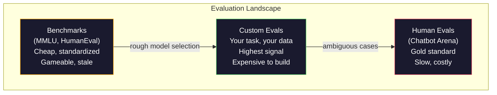
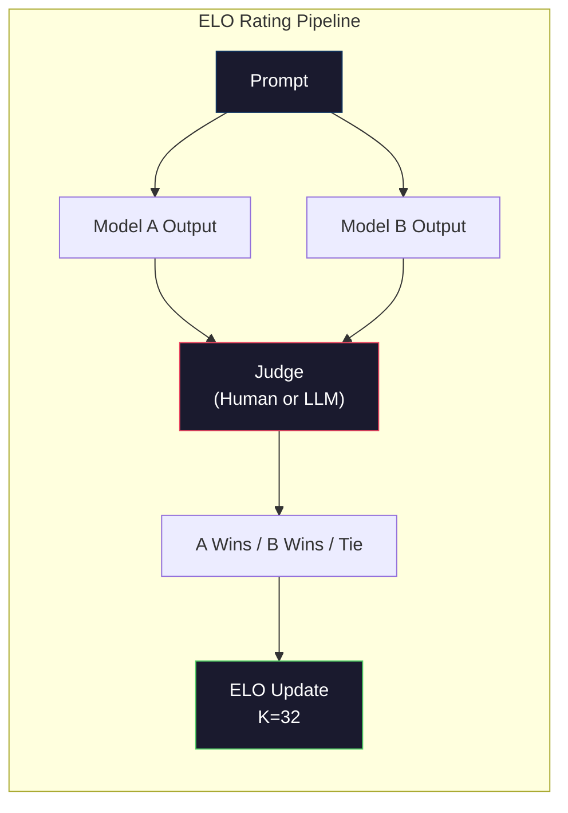

# 评估：基准测试、评测、LM Harness

> 古德哈特定律：当一个指标成为目标时，它就不再是一个好指标。每个前沿实验室都在“刷分”基准测试。MMLU 分数一路攀升，但模型仍然无法可靠地数出“strawberry”中有几个字母“r”。唯一重要的评测是你自己的评测——针对你自己的任务，使用你自己的数据。

**类型：** 构建
**语言：** Python
**前置条件：** 阶段 10，课程 01-05（从头构建 LLM）
**时长：** 约 90 分钟

## 学习目标

- 构建一个自定义评测框架，对语言模型运行多项选择和开放式基准测试
- 解释为什么标准基准测试（MMLU、HumanEval）会饱和，无法区分前沿模型
- 实现针对特定任务的评测，并使用合适的指标：精确匹配、F1、BLEU 以及 LLM 作为裁判评分
- 设计一个针对你具体用例的自定义评测套件，而不仅仅依赖公开排行榜

## 问题所在

MMLU 于 2020 年发布，包含 57 个学科的 15,908 道题目。三年之内，前沿模型就将其饱和。GPT-4 得分 86.4%。Claude 3 Opus 得分 86.8%。Llama 3 405B 得分 88.6%。排行榜被压缩到仅 3 个百分点的区间内，差异全是统计噪声，而不是实际能力的差距。

与此同时，这些模型却连一个 10 岁孩子都能轻松完成的任务都搞不定。Claude 3.5 Sonnet 在 MMLU 上得分 88.7%，但起初却无法数出“strawberry”中的字母个数——这个任务不需要任何世界知识或推理，只需逐字符迭代。HumanEval 用 164 道题目测试代码生成。模型得分超过 90%，但生成的代码仍然会在任何初级开发人员都能发现的边缘情况下崩溃。

基准测试成绩与实际可靠性之间的差距，是 LLM 评估的核心问题。基准测试告诉你模型在基准测试上的表现，但对于该模型在你特定任务、特定数据、特定失败模式下的表现几乎毫无信息。如果你在构建一个客服机器人，MMLU 毫不相关。如果你在构建一个代码助手，HumanEval 只覆盖函数级生成——它不涉及跨文件的调试、重构或代码解释。

你需要自定义评测。不是因为基准测试毫无用处——它们在粗略选择模型时仍有帮助——而是因为最终的评估必须完全匹配你的部署条件。

## 概念

### 评测全景

评测分为三类，各有不同的成本和信号质量。

**基准测试** 是标准化的测试套件。例如 MMLU、HumanEval、SWE-bench、MATH、ARC、HellaSwag。你对模型运行基准测试，得到一个分数。优点：所有人都使用相同的测试，因此可以比较模型。缺点：模型和训练数据越来越多地污染这些基准测试。实验室在包含基准测试问题数据上进行训练。分数上去了，能力可能并没有。

**自定义评测** 是你针对自己特定用例构建的测试套件。你定义输入、期望输出和评分函数。法律文档摘要器在法律文档上评估。SQL 生成器在你的数据库模式上评估。创建这些评测成本高昂，但它们是唯一能预测生产性能的评测。

**人工评测** 使用付费标注员根据有用性、正确性、流畅性和安全性等标准判断模型输出。这是开放式任务中自动评分失效时的黄金标准。Chatbot Arena 已收集超过 200 万个人类偏好投票，涵盖 100 多个模型。缺点：成本（每次判断 0.10-2.00 美元）和速度（数小时到数天）。



### 为什么基准测试会失效

三种机制导致基准测试分数不再反映真实能力。

**数据污染。** 训练语料库从互联网抓取数据。基准测试问题也存在于互联网上。模型在训练期间看到了答案。这不是传统意义上的作弊——实验室并非故意包含基准测试数据。但网络规模的抓取使得几乎无法排除。

**应试训练。** 实验室优化训练混合比例以提升基准测试成绩。如果训练混合中 5% 是 MMLU 风格的多选题，模型会学会格式和答案分布。MMLU 是四选一的多选题。模型会学到答案大致均匀分布在 A/B/C/D 上，即使模型不知道答案，这也有帮助。

**饱和。** 当每个前沿模型在基准测试上都能得到 85-90% 的分数时，基准测试就失去了区分度。剩下的 10-15% 题目可能模棱两可、标签错误，或者需要晦涩的领域知识。从 MMLU 的 87% 提升到 89%，可能只是模型多记了两个冷门题目，而不是变得更聪明了。

### 困惑度：快速健康检查

困惑度衡量模型对一个 token 序列的惊讶程度。形式化地说，它是平均负对数似然的指数化结果：

```
PPL = exp(-1/N * sum(log P(token_i | context)))
```

困惑度 10 意味着平均而言，模型在每个 token 位置上的不确定性相当于从 10 个选项中均匀选择。数值越低越好。GPT-2 在 WikiText-103 上的困惑度约为 30。GPT-3 约为 20。Llama 3 8B 约为 7。

困惑度有助于在相同测试集上比较模型，但它有盲点。一个模型可能因为擅长预测常见模式而获得低困惑度，但在处理罕见但重要的模式时表现糟糕。它也不能说明指令遵循、推理或事实准确性。将其作为合理性检查，而非最终结论。

### LLM 作为裁判

使用一个强模型来评估弱模型的输出。思路很简单：让 GPT-4o 或 Claude Sonnet 根据正确性、有用性和安全性对回复进行 1-5 分评分。使用 GPT-4o-mini 每次判断成本约 0.01 美元，并且与人工判断的一致性出奇地好——在大多数任务上大约有 80% 的一致率。

评分提示的重要性大于模型本身。模糊的提示（“评价这个回复”）会产生噪声大的分数。带有评分标准的结构化提示（“如果答案事实正确并引用来源给 5 分，正确但未引用来源给 4 分，部分正确给 3 分……”）会产生一致且可复现的分数。

失败模式：裁判模型表现出位置偏差（在成对比较中偏好第一个回复）、冗长偏差（偏好更长的回复）和自我偏好（GPT-4 对 GPT-4 输出的评分高于对同等 Claude 输出的评分）。缓解措施：随机化顺序、按长度归一化、使用与被评估模型不同的裁判。

### 来自成对比较的 ELO 评级

Chatbot Arena 的方法。向不同模型的同一个提示展示两种回复。由人类（或 LLM 裁判）选出更好的一个。通过数千次这样的比较，为每个模型计算 ELO 评级——与国际象棋中使用的系统相同。

ELO 的优势：相对排名比绝对评分更可靠，能优雅地处理平局，并且收敛所需的比较次数少于独立给每个输出打分。截至 2026 年初，Chatbot Arena 排名显示 GPT-4o、Claude 3.5 Sonnet 和 Gemini 1.5 Pro 在顶尖位置的 ELO 分数差距在 20 分以内。



### 评测框架

**lm-evaluation-harness**（EleutherAI）：标准的开源评测框架。支持 200 多个基准测试。一条命令即可对任何 Hugging Face 模型运行 MMLU、HellaSwag、ARC 等。被 Open LLM Leaderboard 使用。

**RAGAS**：专为 RAG 流水线设计的评估框架。衡量忠实度（答案是否与检索到的上下文匹配？）、相关性（检索到的上下文与问题相关吗？）和答案正确性。

**promptfoo**：基于配置的提示工程评测。在 YAML 中定义测试用例，针对多个模型运行，得到通过/失败报告。适用于对提示进行回归测试——确保提示更改不会破坏现有测试用例。

### 构建自定义评测

对生产环境而言，唯一重要的评测。流程如下：

1. **定义任务。** 模型具体应该做什么？要精确。“回答问题”太模糊。“给定一封客户投诉邮件，提取产品名称、问题类别和情感”才是可以评估的任务。

2. **创建测试用例。** 原型评测至少 50 个，生产环境至少 200 个。每个测试用例是一个 (输入, 期望输出) 对。包括边缘情况：空输入、对抗性输入、模糊输入、其他语言的输入。

3. **定义评分。** 结构化输出用精确匹配。文本相似度用 BLEU/ROUGE。开放式质量用 LLM 作为裁判。提取任务用 F1。按权重组合多个指标。

4. **自动化。** 每个评测用一条命令运行，无需手动步骤。以可随时间比较的格式存储结果。

5. **随时间追踪。** 单独的评测分数没有意义。你需要趋势线。上次提示更改后分数提高了吗？切换模型后分数下降了吗？将评测与提示一同进行版本管理。

| 评测类型 | 每次判断成本 | 与人类一致率 | 最适合 |
|-----------|--------------|--------------|--------|
| 精确匹配 | ~$0 | 100%（适用时） | 结构化输出、分类 |
| BLEU/ROUGE | ~$0 | ~60% | 翻译、摘要 |
| LLM 作为裁判 | ~$0.01 | ~80% | 开放式生成 |
| 人工评测 | $0.10-$2.00 | 不适用（即真实标准） | 模糊、高风险的场景 |

## 动手构建

### 第一步：一个极简评测框架

定义核心抽象。一个评测案例包含输入、期望输出和一个可选的元数据字典。评分器接收预测值和参考值，返回一个 0 到 1 之间的分数。

```python
import json
from collections import Counter

class EvalCase:
    def __init__(self, input_text, expected, metadata=None):
        self.input_text = input_text
        self.expected = expected
        self.metadata = metadata or {}

class EvalSuite:
    def __init__(self, name, cases, scorers):
        self.name = name
        self.cases = cases
        self.scorers = scorers

    def run(self, model_fn):
        results = []
        for case in self.cases:
            prediction = model_fn(case.input_text)
            scores = {}
            for scorer_name, scorer_fn in self.scorers.items():
                scores[scorer_name] = scorer_fn(prediction, case.expected)
            results.append({
                "input": case.input_text,
                "expected": case.expected,
                "prediction": prediction,
                "scores": scores,
            })
        return results
```

### 第二步：评分函数

构建精确匹配、Token F1 以及一个模拟的 LLM 作为裁判评分器。

```python
def exact_match(prediction, expected):
    return 1.0 if prediction.strip().lower() == expected.strip().lower() else 0.0

def token_f1(prediction, expected):
    pred_tokens = set(prediction.lower().split())
    exp_tokens = set(expected.lower().split())
    if not pred_tokens or not exp_tokens:
        return 0.0
    common = pred_tokens & exp_tokens
    precision = len(common) / len(pred_tokens)
    recall = len(common) / len(exp_tokens)
    if precision + recall == 0:
        return 0.0
    return 2 * (precision * recall) / (precision + recall)

def llm_judge_simulated(prediction, expected):
    pred_words = set(prediction.lower().split())
    exp_words = set(expected.lower().split())
    if not exp_words:
        return 0.0
    overlap = len(pred_words & exp_words) / len(exp_words)
    length_penalty = min(1.0, len(prediction) / max(len(expected), 1))
    return round(overlap * 0.7 + length_penalty * 0.3, 3)
```

### 第三步：ELO 评级系统

实现带 ELO 更新的成对比较。这正是 Chatbot Arena 用于模型排名的系统。

```python
class ELOTracker:
    def __init__(self, k=32, initial_rating=1500):
        self.ratings = {}
        self.k = k
        self.initial_rating = initial_rating
        self.history = []

    def _ensure_player(self, name):
        if name not in self.ratings:
            self.ratings[name] = self.initial_rating

    def expected_score(self, rating_a, rating_b):
        return 1 / (1 + 10 ** ((rating_b - rating_a) / 400))

    def record_match(self, player_a, player_b, outcome):
        self._ensure_player(player_a)
        self._ensure_player(player_b)

        ea = self.expected_score(self.ratings[player_a], self.ratings[player_b])
        eb = 1 - ea

        if outcome == "a":
            sa, sb = 1.0, 0.0
        elif outcome == "b":
            sa, sb = 0.0, 1.0
        else:
            sa, sb = 0.5, 0.5

        self.ratings[player_a] += self.k * (sa - ea)
        self.ratings[player_b] += self.k * (sb - eb)

        self.history.append({
            "a": player_a, "b": player_b,
            "outcome": outcome,
            "rating_a": round(self.ratings[player_a], 1),
            "rating_b": round(self.ratings[player_b], 1),
        })

    def leaderboard(self):
        return sorted(self.ratings.items(), key=lambda x: -x[1])
```

### 第四步：困惑度计算

使用 token 概率计算困惑度。实际中你会从模型的 logits 获取这些概率。这里我们用概率分布来模拟。

```python
import numpy as np

def perplexity(log_probs):
    if not log_probs:
        return float("inf")
    avg_neg_log_prob = -np.mean(log_probs)
    return float(np.exp(avg_neg_log_prob))

def token_log_probs_simulated(text, model_quality=0.8):
    np.random.seed(hash(text) % 2**31)
    tokens = text.split()
    log_probs = []
    for i, token in enumerate(tokens):
        base_prob = model_quality
        if len(token) > 8:
            base_prob *= 0.6
        if i == 0:
            base_prob *= 0.7
        prob = np.clip(base_prob + np.random.normal(0, 0.1), 0.01, 0.99)
        log_probs.append(float(np.log(prob)))
    return log_probs
```

### 第五步：汇总结果

计算整个评测运行中的汇总统计：均值、中位数、阈值通过率以及各指标的细分。

```python
def summarize_results(results, threshold=0.8):
    all_scores = {}
    for r in results:
        for metric, score in r["scores"].items():
            all_scores.setdefault(metric, []).append(score)

    summary = {}
    for metric, scores in all_scores.items():
        arr = np.array(scores)
        summary[metric] = {
            "mean": round(float(np.mean(arr)), 3),
            "median": round(float(np.median(arr)), 3),
            "std": round(float(np.std(arr)), 3),
            "min": round(float(np.min(arr)), 3),
            "max": round(float(np.max(arr)), 3),
            "pass_rate": round(float(np.mean(arr >= threshold)), 3),
            "n": len(scores),
        }
    return summary

def print_summary(summary, suite_name="Eval"):
    print(f"\n{'=' * 60}")
    print(f"  {suite_name} Summary")
    print(f"{'=' * 60}")
    for metric, stats in summary.items():
        print(f"\n  {metric}:")
        print(f"    Mean:      {stats['mean']:.3f}")
        print(f"    Median:    {stats['median']:.3f}")
        print(f"    Std:       {stats['std']:.3f}")
        print(f"    Range:     [{stats['min']:.3f}, {stats['max']:.3f}]")
        print(f"    Pass rate: {stats['pass_rate']:.1%} (threshold >= 0.8)")
        print(f"    N:         {stats['n']}")
```

### 第六步：运行完整流水线

将所有部分连接起来。定义一个任务，创建测试用例，模拟两个模型，运行评测，从成对比较中计算 ELO，并打印排行榜。

```python
def demo_model_good(prompt):
    responses = {
        "What is the capital of France?": "Paris",
        "What is 2 + 2?": "4",
        "Who wrote Hamlet?": "William Shakespeare",
        "What language is PyTorch written in?": "Python and C++",
        "What is the boiling point of water?": "100 degrees Celsius",
    }
    return responses.get(prompt, "I don't know")

def demo_model_bad(prompt):
    responses = {
        "What is the capital of France?": "Paris is the capital city of France",
        "What is 2 + 2?": "The answer is four",
        "Who wrote Hamlet?": "Shakespeare",
        "What language is PyTorch written in?": "Python",
        "What is the boiling point of water?": "212 Fahrenheit",
    }
    return responses.get(prompt, "Unknown")

cases = [
    EvalCase("What is the capital of France?", "Paris"),
    EvalCase("What is 2 + 2?", "4"),
    EvalCase("Who wrote Hamlet?", "William Shakespeare"),
    EvalCase("What language is PyTorch written in?", "Python and C++"),
    EvalCase("What is the boiling point of water?", "100 degrees Celsius"),
]

suite = EvalSuite(
    name="General Knowledge",
    cases=cases,
    scorers={
        "exact_match": exact_match,
        "token_f1": token_f1,
        "llm_judge": llm_judge_simulated,
    },
)

results_good = suite.run(demo_model_good)
results_bad = suite.run(demo_model_bad)

print_summary(summarize_results(results_good), "Model A (concise)")
print_summary(summarize_results(results_bad), "Model B (verbose)")
```

“好”模型给出精确的答案。“差”模型给出冗长的释义。精确匹配会严重惩罚冗长的模型。Token F1 和 LLM 作为裁判则更加宽容。这说明了指标选择的重要性：同样的模型根据评分方式的不同，可能看起来很棒或很糟糕。

### 第七步：ELO 锦标赛

在多轮次中运行模型之间的成对比较。

```python
elo = ELOTracker(k=32)

for case in cases:
    pred_a = demo_model_good(case.input_text)
    pred_b = demo_model_bad(case.input_text)

    score_a = token_f1(pred_a, case.expected)
    score_b = token_f1(pred_b, case.expected)

    if score_a > score_b:
        outcome = "a"
    elif score_b > score_a:
        outcome = "b"
    else:
        outcome = "tie"

    elo.record_match("model_a_concise", "model_b_verbose", outcome)

print("\nELO Leaderboard:")
for name, rating in elo.leaderboard():
    print(f"  {name}: {rating:.0f}")
```

### 第八步：困惑度比较

比较不同质量等级的“模型”之间的困惑度。

```python
test_text = "The quick brown fox jumps over the lazy dog in the garden"

for quality, label in [(0.9, "Strong model"), (0.7, "Medium model"), (0.4, "Weak model")]:
    log_probs = token_log_probs_simulated(test_text, model_quality=quality)
    ppl = perplexity(log_probs)
    print(f"  {label} (quality={quality}): perplexity = {ppl:.2f}")
```

## 使用它

### lm-evaluation-harness（EleutherAI）

在任何模型上运行基准测试的标准工具。

```python
# pip install lm-eval
# Command line:
# lm_eval --model hf --model_args pretrained=meta-llama/Llama-3.1-8B --tasks mmlu --batch_size 8

# Python API:
# import lm_eval
# results = lm_eval.simple_evaluate(
#     model="hf",
#     model_args="pretrained=meta-llama/Llama-3.1-8B",
#     tasks=["mmlu", "hellaswag", "arc_easy"],
#     batch_size=8,
# )
# print(results["results"])
```

### promptfoo

用于提示工程的基于配置的评测。在 YAML 中定义测试，并针对多个供应商运行。

```yaml
# promptfoo.yaml
providers:
  - openai:gpt-4o-mini
  - anthropic:claude-3-haiku

prompts:
  - "Answer in one word: {{question}}"

tests:
  - vars:
      question: "What is the capital of France?"
    assert:
      - type: contains
        value: "Paris"
  - vars:
      question: "What is 2 + 2?"
    assert:
      - type: equals
        value: "4"
```

### RAGAS 用于 RAG 评估

```python
# pip install ragas
# from ragas import evaluate
# from ragas.metrics import faithfulness, answer_relevancy, context_precision
#
# result = evaluate(
#     dataset,
#     metrics=[faithfulness, answer_relevancy, context_precision],
# )
# print(result)
```

RAGAS 衡量了通用评测所忽略的东西：模型的答案是否基于检索到的上下文，而不仅仅是抽象意义上的答案“正确”。

## 交付成果

本课程产出 `outputs/prompt-eval-designer.md` —— 一个可复用的提示，可针对任何任务设计自定义评测套件。给它一个任务描述，它会生成测试用例、评分函数以及通过/失败阈值建议。

还产出 `outputs/skill-llm-evaluation.md` —— 一个决策框架，可根据任务类型、预算和延迟要求选择正确的评估策略。

## 练习

1. 添加一个“一致性”评分器，将同一输入通过模型运行 5 次，并衡量输出匹配的频率。确定性输入上不一致的答案揭示了脆弱的提示或过高的温度设置。

2. 扩展 ELO 跟踪器以支持多个裁判函数（精确匹配、F1、LLM 作为裁判）并加权。比较当权重侧重于精确匹配与侧重于 F1 时，排行榜如何变化。

3. 为特定任务构建评测套件：将邮件分类为 5 个类别。创建 100 个测试用例，包含多样化的示例和边缘情况（可属于多个类别的邮件、空邮件、其他语言的邮件）。衡量不同“模型”（基于规则的、关键词匹配的、模拟的 LLM）的表现。

4. 实现污染检测：给定一组评测问题和一个训练语料库，检查评测问题（或近似改写）中有多大比例出现在训练数据中。这是研究人员验证基准有效性的方法。

5. 构建一个“模型差异”工具。给定两个模型版本的评测结果，突出显示哪些具体测试用例改进了、哪些退步了、哪些保持不变。这是评测版本的代码差异——对于理解更改是帮助还是损害至关重要。

## 关键术语

| 术语 | 人们常说的 | 实际含义 |
|------|-----------|---------|
| MMLU | “那个基准测试” | 大规模多任务语言理解——57 个学科的 15,908 道选择题，到 2025 年超过 88% 后饱和 |
| HumanEval | “代码评测” | OpenAI 的 164 个 Python 函数补全问题，仅测试孤立的函数生成 |
| SWE-bench | “真实编码评测” | 来自 12 个 Python 仓库的 2,294 个 GitHub 问题，衡量包括测试生成在内的端到端修复 bug |
| 困惑度 | “模型有多困惑” | exp(-avg(log P(token_i | context)))——越低表示模型对实际 token 赋予的概率越高 |
| ELO 评级 | “模型的国际象棋排名” | 根据成对胜负记录计算的相对技能评级，Chatbot Arena 用于对 100+ 个模型进行排名 |
| LLM 作为裁判 | “用 AI 给 AI 打分” | 一个强模型根据评分标准对弱模型输出进行评分，与人工裁判一致率约 80%，每次判断成本约 $0.01 |
| 数据污染 | “模型看到了测试集” | 训练数据包含基准问题，导致分数虚高而不反映实际能力提升 |
| 评测套件 | “一堆测试” | 经过版本管理的 (输入, 期望输出, 评分器) 三元组集合，用于衡量特定能力 |
| 通过率 | “正确百分比” | 评测案例中分数高于阈值的比例——比均值分更可操作，因为它衡量可靠性 |
| Chatbot Arena | “模型排名网站” | LMSYS 平台，拥有 200 万以上人类偏好投票，通过 ELO 评级产出最值得信赖的 LLM 排行榜 |

## 延伸阅读

- [Hendrycks et al., 2021 – "Measuring Massive Multitask Language Understanding"](https://arxiv.org/abs/2009.03300) —— MMLU 论文，尽管已饱和，但仍是引用最多的 LLM 基准测试
- [Chen et al., 2021 – "Evaluating Large Language Models Trained on Code"](https://arxiv.org/abs/2107.03374) —— OpenAI 的 HumanEval 论文，确立了代码生成评估方法
- [Zheng et al., 2023 – "Judging LLM-as-a-Judge"](https://arxiv.org/abs/2306.05685) —— 关于使用 LLM 评估 LLM 的系统性分析，包括位置偏差和冗长偏差的发现
- [LMSYS Chatbot Arena](https://chat.lmsys.org/) —— 众包模型比较平台，拥有 200 万以上投票，是最值得信赖的真实世界 LLM 排名
