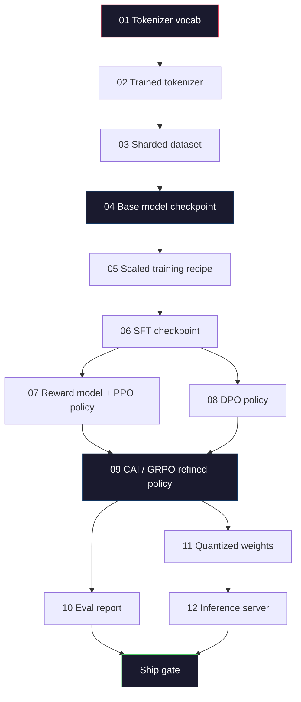
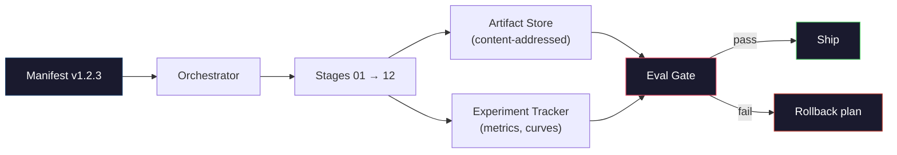

# 构建完整的 LLM 管线

> 从第01课到第12课的所有内容都是某条管线的某个阶段。本课是脚手架，将这些阶段整合成一个端到端的运行过程：分词、预训练、扩展、SFT、对齐、评估、量化、服务。你不会在笔记本电脑上训练一个70B模型。你要生成的是编排层、清单、评估门控和回滚计划——这些是2026年前沿团队用来决定发布什么的东西。这是顶点项目。

**类型：** 构建  
**语言：** Python（标准库）  
**前置要求：** 阶段10的所有课程01-12  
**时长：** 约120分钟

## 学习目标

- 将之前的十一门课程（分词器、数据、预训练、扩展、SFT、RLHF、DPO、CAI、评估、量化、推理）组合成一个可复现的管线规约
- 定义阶段间的工件契约：每个阶段消费什么、产生什么，以及下一阶段如何验证输入
- 构建一个编排器，用于跟踪实验、对工件进行哈希、并根据评估阈值门控发布决策
- 设计回滚计划：哪些工件便宜可重跑，哪些昂贵，以及一个损坏的检查点会带来什么代价

## 问题

之前的各门课程都各自有效。分词器训练好了。小型GPT预训练好了。SFT数据集组装好了。奖励模型训练好了。DPO运行过了。评估测量过了。量化权重导出过了。推理服务器启动了。每一个都是一个笔记本。每一个都有自己的约定、自己的输出路径、自己的种子。

前沿训练运行不是一个笔记本。Llama 3 405B 在大约54天内消耗了3000万H100小时。DeepSeek-V3 使用了约280万H800小时。在这期间，一个损坏的检查点、一次数据污染、一次评估回归就可能让团队损失一周的墙上时间和一个月的GPU预算。团队存活的方式是通过管线卫生：每个阶段都有确定的输入、确定的输出、一个清单、一个哈希和一个门控。

这是顶点项目。你不会在笔记本电脑上端到端运行管线。你要编写的是协调各阶段的编排器、描述运行的清单、门控发布决策的验证器，以及让第三方能够仅从单个文件重放你工作的回放计划。代码很小；纪律很大。

这种模式从100M到1T参数都保持不变。同样的四个组件——清单、编排器、评估门控、工件存储——运行Llama 3，也运行你的业余GPT。区别在于每个阶段配置内部的数字大小，而不是管线的形状。

## 概念

### 十二个阶段

每个阶段10课程都是一个阶段。以下是完整的依赖图。



阶段07和08可以并行运行。其他所有都是硬依赖。阶段02（分词器）的更改会使所有下游工件失效。阶段10（评估）的更改仅使发布决策失效。

### 清单

清单是单个文件，完整描述一次运行，足以重放它。管线产生的任何东西都不应依赖于不在清单中的状态。字段既枯燥又强制。

```
pipeline_version: 1.2.3
seed: 42
git_commit: a1b2c3d4
stages:
  01_tokenizer:
    recipe: bpe_32k
    input_hash: sha256:...
    output_hash: sha256:...
    wall_clock_sec: 3600
    cost_usd: 12
```

阶段N的输出哈希是阶段N+1的输入哈希。任何偏差都会导致管线停止。这是你及早发现数据损坏的方式。这也是另一个大洲的团队成员验证他们的重放产生了与你相同工件的途径。

在实践中，团队使用一个小型YAML模式加上一个清单检查器，它与上一次成功运行进行差异比较。超出预期字段（成本、墙上时间）的任何增量都是危险信号。

### 工件类型化

每个阶段的输出都是一个类型化的工件。不是目录 blob，不是 pickle，而是一个具有已知模式的命名类型。

| 阶段 | 工件类型 | 关键字段 |
|-------|--------------|-----------|
| 01-02 | Tokenizer | vocab.json, merges.txt, config.json, hash |
| 03 | Dataset | shards[], row count, token count, dedup stats |
| 04-05 | Checkpoint | weights.safetensors, config.json, optimizer state, step count |
| 06 | SFT Model | checkpoint + SFT recipe + data mix |
| 07 | Reward Model | RM checkpoint + preference data hash |
| 08-09 | Policy | checkpoint + reference hash + beta + KL budget consumed |
| 10 | Eval Report | benchmark scores + regression diffs + eval data hash |
| 11 | Quantized Model | quantized weights + calibration data + accuracy delta vs FP16 |
| 12 | Server Spec | endpoint + model hash + config + observability hooks |

类型化防止了最常见的失败模式：将阶段08的输出用作阶段06的输入，将DPO训练过的模型通过SFT路径发布。类型化工件和类型化阶段签名使这些错误成为编译时失败，而不是第五天的失败。

### 评估门控

发布不是“训练完成”。发布是“训练完成且评估门控通过”。门控在运行开始前定义。

```
gates:
  mmlu:      >= baseline + 0.5   # no regression
  humaneval: >= baseline + 1.0
  truthfulqa: >= baseline         # no drop
  safety_refusal_rate: <= 0.05
  kl_from_reference: <= 25.0
  cost_total_usd: <= 50000
```

每个门控都是一个数值阈值。没有“看起来不错”的门控。没有主观签署。如果所有门控通过，工件被标记为可发布。如果任何门控失败，运行被持有，等待指定的审阅者明确覆盖，覆盖本身也会记录在清单中。

两个门控能捕捉大多数灾难。*回归*门控（新模型必须在核心基准上至少与之前一样好）捕捉训练错误。*KL预算*门控（对齐后的策略不得比参考策略偏移超过X）捕捉对齐过度。每个生产管线都有这两个门控。

### 编排器

一小段代码，读取清单、调度阶段、跟踪工件，并在任何契约违规时停止。这不是 Airflow。这不是 Kubeflow。对于管线卫生，你需要一些你自己写的无聊代码。

编排器的工作很狭窄：

1. 从清单解析 DAG。
2. 对于每个阶段，检查预期输出是否已存在且哈希正确（如果存在则跳过）。
3. 运行阶段，捕获 stdout/stderr，测量墙上时间和成本。
4. 验证输出哈希是否与下游阶段预期的输入哈希匹配。
5. 失败时，写入带有确切失败阶段的局部清单并以非零退出。

那是200行Python。它看起来像本课 `code/main.py` 中的文件。在底层，真正的管线使用 `torchrun` 或 `ray` 在集群上执行各个阶段，但编排器本身运行在单个节点上。

### 实验跟踪与工件存储

两个外部系统支撑管线。

**实验跟踪器（wandb、neptune、mlflow）。** 记录损失曲线、评估指标、每个阶段的系统遥测。跟踪器是你三周后需要比较运行A和运行B时去的地方。团队几乎总是使用托管跟踪器——自己写会浪费本应用于训练的时间。

**工件存储（S3、R2、GCS）。** 用于检查点、数据集、分词器、评估报告的不可变对象存储。工件通过哈希寻址，而不是文件名。像 `latest.pt` 这样的文件名是隐患；`ckpt-7b-step-20000-sha256:abc123.safetensors` 是契约。

编排器同时写入两者。跟踪器是给人看图表的。工件存储是下一阶段查找输入用的。

### 成本核算

前沿运行有对应的美元数字。预算纪律在两个地方执行。

**运行前估算。** 从清单中，计算预期的 FLOPs（预训练：6 x 参数 x token数）、预期的 GPU 小时（FLOPs / 峰值吞吐量 / 利用率），以及按当前租赁费率计算的美元成本。如果估算超出预算门控，管线拒绝启动。

**运行中跟踪。** 逐阶段的墙上时间和成本记录到清单中。每个阶段之后，检查剩余预算。如果一个阶段超支，下一个阶段的门控将使用新的剩余预算进行评估。你不会在VC打电话时才发现没钱了。

Llama 3 报告的成本是6100万美元。DeepSeek-V3 报告主要预训练运行为560万美元。比例主要是硬件效率加上混合专家——但具体成本可见，因为两个团队都按阶段跟踪，而不是按运行。

### 可重现性与确定性

这两者不同。*可重现性*意味着相同的清单加上相同的代码加上相同的基础设施，能产生具有等效下游指标的计算点。*确定性*意味着比特级相同的输出。

现代 LLM 训练是可重现的但不是确定性的。分布式训练的规约顺序、GPU 内核非确定性（cuBLAS、flash-attn）以及混合精度舍入共同导致不同运行之间产生在1e-5级别上不同的浮点数。这对于最终指标来说没问题，它们不会移动。但如果你试图通过比特级差异进行调试，那就是致命的。解决方法是记录每个阶段的输入哈希、输出哈希和关键指标——如果这些匹配，即使权重不是比特级相同，运行也被视为“重现”。



### 回滚计划

在运行开始之前，写下每个阶段失败时的应对措施。分为三类。

- **便宜可重跑**（数小时）：分词器、评估、量化、推理服务器。直接重跑。
- **中等**（数天）：SFT、DPO、CAI。保留基础模型；只重跑对齐阶段。
- **昂贵**（数周和数百万美元）：预训练。这里的回滚计划不是“重跑”，而是“使用最后一个好的检查点，用修正后的数据重跑更便宜的下游阶段。”

由于阶段依赖是类型化且经过哈希的，编排器可以自动计算回滚集：使失败阶段及其所有后代失效。阶段06（SFT）的失败使06、07、08、09、10、11、12失效。阶段11（量化）的失败仅使11和12失效。提前确定这些可以避免团队在凌晨4点筋疲力尽时临时抱佛脚。

### 2026年观察到的生产配方

大多数前沿团队收敛到了相同的骨架。

- 分词器：128k BPE with byte fallback。在小型、平衡的多语言切片上训练。
- 预训练：10-20T token，主要是网页加代码加合成数据。Muon 或 AdamW 优化器。FSDP2 或 DeepSpeed ZeRO-3。梯度检查点。BF16权重，FP32主权重。
- SFT：50万-200万指令对，混合人工和合成，与评估集严格去重。
- 对齐：DPO 或 CAI + GRPO。仅当偏好信号对于 DPO 来说多维度过高时才使用 RLHF。
- 评估：MMLU-Pro、MATH、HumanEval+、GPQA、SWE-Bench Verified、LiveBench，加上一个公众从未见过的私有保留集。
- 量化：服务时使用4位 GPTQ 或 AWQ，对于精度差异重要的安全评估使用8位。
- 服务：vLLM、TensorRT-LLM 或自研。连续批处理。推测解码。KV 缓存逐出。

数字每六个月变化一次。骨架不变。

## 构建它

本课的代码是一个编排器和一个清单检查器，而不是十二个训练脚本。每个阶段都用占位符模拟，产生具有正确形状和哈希的输出工件。端到端运行编排器可以证明管线的管道在你在真正阶段上烧GPU钱之前就能工作。

参见 `code/main.py` 获取完整实现。关键部分：

- `Manifest` 数据类：管线版本、种子、git提交、阶段、门控。
- `Stage` 数据类：名称、类型、输入（哈希）、输出（哈希）、墙上时间、成本。
- `Orchestrator.run()`：解析 DAG、调度阶段、验证哈希、更新清单。
- `EvalGate.check()`：读取阈值、与最新评估报告比较、返回通过/失败。
- `ArtifactStore`（内存存根）：按哈希 put/get，模拟 S3。
- `CostTracker`：逐阶段和累积，超出上限时停止。

`main.py` 中的管线运行十二个占位阶段，生成一个清单，并演示一个失败的评估门控，展示被持有的运行的样子。将每个占位符替换为相应课程中的真实训练脚本，你就拥有一个真实前沿管线使用的基础骨架。

## 使用它

标准工作流有三个命令。

```
python code/main.py plan    # validate manifest, compute cost estimate, print DAG
python code/main.py run     # execute stages, writing to manifest.out.yaml
python code/main.py gate    # read manifest.out.yaml, apply eval gates, ship-or-hold
```

每次先运行 `plan`。大多数管线错误在规划阶段就暴露了——缺少门控阈值、过时的哈希、预算超支。运行 `plan` 是免费的。运行 `run` 是昂贵的。通过在便宜侧捕捉错误来省钱。

`gate` 的输出要么是 `SHIP`，要么是 `HOLD: <原因>`。被持有的运行不是失败；它是一个决策点。指定的审阅者要么覆盖（覆盖被记录），要么批准回滚。

## 发布它

本课产生 `outputs/skill-llm-pipeline-reviewer.md`。给它一个提议的管线清单，它会检查所有契约：阶段类型化、哈希链、门控、回滚计划、成本估算。如果清单缺少评估门控、无界的 KL 预算、或者运行混合了评估和训练数据，它会拒绝批准。

## 练习

1. 扩展编排器以支持阶段07和08的并行执行。使用标准库的 `concurrent.futures` 模块。确认最终清单记录了这两个阶段的输出，并且阶段09的输入哈希是两者的确定性组合。

2. 添加一个“污染检查”门控。给定评估数据集哈希和训练数据集分片，计算重叠（精确字符串匹配或13-gram匹配）。如果重叠超过0.1%，门控失败。输入一个被污染的训练集，确认门控阻止了运行。

3. 从基本原理实现一个成本估算器。对于阶段04（预训练），将 FLOPs 估算为 6 x 参数 x token数，假设在 H100 上 MFU（模型 FLOPs 利用率）为40%，BF16 峰值为 989 TFLOPs，GPU 小时价格为 $2.50。为在 2T token 上训练的 7B 模型报告估算值。与已发布的 Llama 2 数字进行比较。

4. 构建一个部分回滚。模拟阶段09（CAI）的失败，然后重跑阶段09到12，同时保留01-08缓存。编排器应能通过哈希检测到缓存的工件并跳过它们。测量与完全重跑相比节省的墙上时间。

5. 添加可观测性。为每个阶段发射 OpenTelemetry 跨度，属性包括参数、已见 token、损失和成本。将跨度管道输出到本地收集器。目的不是仪表板；目的是每个阶段的健康可以从单个跟踪 ID 追溯。

## 关键术语

| 术语 | 人们所说的 | 实际含义 |
|------|----------------|----------------------|
| Manifest | “配方文件” | YAML 或 JSON，描述管线版本、种子、逐阶段配置和门控阈值——足以重放一次运行 |
| Content-addressed | “按哈希而非名字” | 工件按其内容的 SHA-256 存储，因此永远不会混淆版本 A 和版本 B |
| Eval gate | “发布标准” | 基准指标和安全分数上的数值阈值，必须通过才能将工件标记为可发布 |
| KL budget | “对齐漂移了多远” | 对齐阶段中累积 KL(policy \|\| reference) 的上限，作为门控强制执行 |
| MFU | “你用了多少 GPU” | 模型 FLOPs 利用率——实现的 FLOPs 除以理论峰值。70B 规模下典型值为 40%，7B 下为 55% |
| Rollback plan | “坏了怎么办” | 每个阶段失败时预先写好的行动集：重跑、回退、用修正的输入重新训练 |
| Orchestrator | “指挥” | 读取清单、调度阶段、验证哈希、在契约违规时停止的进程 |
| Artifact store | “用于权重的版本化 S3” | 不可变的内容寻址对象存储——检查点、数据集、评估报告的单一数据源 |
| Reproducible | “重放时指标相同” | 权重比特级不同但下游指标等效——分布式 LLM 训练的现实目标 |
| Cost gate | “你不能超过 X” | 运行前成本估算加上运行中跟踪器——如果估算超出预算，管线拒绝启动 |

## 进一步阅读

- [Dubey et al., 2024 -- "The Llama 3 Herd of Models"](https://arxiv.org/abs/2407.21783) —— 最详细的公开前沿管线描述，包括数据、训练、对齐、评估
- [DeepSeek-AI, 2024 -- "DeepSeek-V3 Technical Report"](https://arxiv.org/abs/2412.19437) —— 效率优先的管线，成本约为 Llama 3 类训练的十分之一
- [Kaplan et al., 2020 -- "Scaling Laws for Neural Language Models"](https://arxiv.org/abs/2001.08361) —— 原始的计算-数据-参数缩放关系
- [Hoffmann et al., 2022 -- "Training Compute-Optimal Large Language Models (Chinchilla)"](https://arxiv.org/abs/2203.15556) —— 对 Kaplan 的修正，重新校准了现代数据预算
- [PyTorch FSDP2 documentation](https://pytorch.org/docs/stable/fsdp.html) —— 在 PyTorch 2.4+ 中替代 FSDP1 的分布式训练原语
- [Weights & Biases LLM Reports](https://wandb.ai/site/llms) —— 开源 LLM 运行的真实清单和实验跟踪器输出，可用作可抄袭的模板
