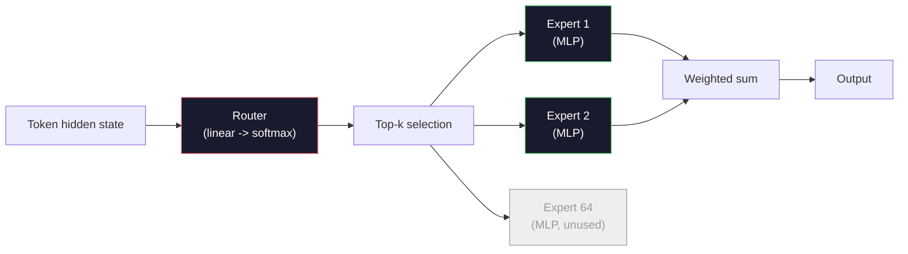

# 开放模型：架构详解

> 你在第04课从零构建了一个GPT-2 Small模型。2026年的前沿开放模型属于同一家族，只有五到六个具体变化：用RMSNorm替代LayerNorm，用SwiGLU替代GELU，用RoPE替代学习位置编码，用GQA或MLA替代完整MHA，以及大规模混合专家。你已经掌握的数学能覆盖其中95%。本课将逐行对比Llama 3、DeepSeek-V3、Mixtral、Qwen和Gemma，指出每种架构分歧的具体位置。

**类型：** 学习  
**语言：** Python（标准库）  
**前置条件：** 阶段10，第04、05、12课（预训练、扩展、推理）  
**时间：** 约45分钟

## 学习目标

- 读懂Llama 3、Mistral、Mixtral、Gemma 2、Qwen 2.5和DeepSeek-V3的config.json，解释每个字段的含义
- 针对每个模型，说明其相对于GPT-2 Small的具体架构变化，并从基本原理出发证明其合理性
- 仅通过配置即可计算任意开放模型的参数量、KV缓存大小和激活内存量
- 根据延迟、内存和能力约束，为部署目标选择最合适的开放模型

## 问题

你在第04课用350行numpy代码构建了一个GPT-2形状的模型。而Llama 3 405B有一份200页的技术报告。你的直觉是这两者天差地别。实际上并非如此。那200页描述的是同一个对象，仅有五到六个动机良好的修改，外加一千个关于扩展的细节。骨架——嵌入层、Transformer模块、注意力、MLP、归一化、输出头——没有改变。

本课是一份“差异对比”。针对每个主流开放模型家族，我们精确列出它相对于GPT-2改变了什么、为什么改变、以及代价是什么。学完本课后，你就能阅读一份全新的模型卡，并在脑海中将其翻译回GPT-2基准。

实际收益是：当Meta发布Llama 5或DeepSeek发布V4时，你不需要建立一个新的心智模型。你只需查看配置，看看有哪些已知旋钮被调整了，然后就能知道下游影响是什么。2026年的架构是一个有限的工具箱。每个新模型只是从中挑选了不同的子集。

## 概念

### 不变核心

所有自回归开放模型共享：

- 词嵌入矩阵（vocab_size × hidden_dim）。
- 堆叠的N个解码器模块：归一化、自注意力、残差连接、归一化、MLP、残差连接。
- 最终归一化和投射到vocab_size的线性头（通常与嵌入参数共享）。
- 因果掩码、下一个词元交叉熵损失。

这就是形状。其余的都是旋钮。

### 真正变化的六个旋钮

在2024-2026年的每一个前沿开放模型中，同样的六个设计选择被反复采用：

1. **归一化。** LayerNorm → RMSNorm。
2. **位置编码。** 学习绝对位置 → RoPE（以及变体：YaRN、NTK）。
3. **激活函数。** GELU → SwiGLU（或GeGLU）。
4. **注意力头共享。** MHA → GQA → MQA → MLA。
5. **稠密vs稀疏MLP。** 稠密 → 混合专家。
6. **预归一化位置。** 预归一化保持不变。后归一化已消亡。

其他一切（学习率调度、数据混合、批次大小、上下文长度）都属于训练配置，而非架构。六个旋钮。

### 旋钮1：RMSNorm

LayerNorm减去均值，除以标准差，然后缩放和平移。RMSNorm只保留缩放部分：

```
RMSNorm(x) = x / sqrt(mean(x^2) + eps) * gamma
```

没有减去均值。没有偏置。每个词元少一个矩阵乘法。Zhang和Sennrich（2019）认为它在机器翻译中与LayerNorm相当，同时速度提升10%。每个现代开放模型都使用它。

代价：无。收益：微小的吞吐量提升，代码更简单。

### 旋钮2：RoPE

在GPT-2中，学习位置嵌入是一个1024槽的查找表。位置1025超出了表格末尾。模型无法外推超过训练长度的上下文。

旋转位置嵌入（RoPE，Su等人，2021）通过在注意力点积之前，成对地旋转每个Q和K向量来注入位置信息。旋转角度是位置的确定性函数，因此没有需要学习的东西，也不会出现“用完”的情况。借助扩展技巧（NTK感知插值、YaRN），一个在8k上下文上训练的模型可以在推理时拉伸到128k，且准确度损失很小。

```
q_rotated = rotate(q, angle(pos))
k_rotated = rotate(k, angle(pos))
score = q_rotated . k_rotated
```

每个Llama、Mistral、Qwen、DeepSeek和Gemma都使用RoPE。Gemma 2使用混合方案（大部分层使用RoPE，其他层使用局部滑动窗口注意力）。

### 旋钮3：SwiGLU

GPT-2的MLP是 `x -> gelu(xW1 + b1) -> (...)W2 + b2`。SwiGLU（Shazeer 2020）将激活函数替换为门控乘积：

```
SwiGLU(x) = (xW1) * sigmoid(xW1) * xV
```

两个投影并行进行，而不是一个，通过Swish激活函数进行门控。经验上，在每个参数困惑度方面表现更强。Llama 2采用了它，所有人都跟进。MLP的隐藏大小通常设置为使总参数量与原始稠密MLP相匹配：如果GPT-2使用 `ff_dim = 4 * hidden`，那么SwiGLU使用 `ff_dim = (2/3) * 4 * hidden = 8/3 * hidden`。

### 旋钮4：注意力头共享

GPT-2使用了**多头注意力（MHA）**：每个头都有自己的Q、K、V投影。

**多查询注意力（MQA，Shazeer 2019）** 在所有头之间共享一个K和一个V。KV缓存减少num_heads倍，在典型模型上缩减12到32倍。在困难基准测试中准确度略有下降。

**分组查询注意力（GQA，Ainslie等人，2023）** 是中间方案：G组Q头共享一个K和一个V。Llama 3 8B使用GQA，有32个Q头和8个KV头（G=8），因此KV缓存相对于完整MHA缩小了4倍。

**多头潜在注意力（MLA，DeepSeek 2024）** 将K和V压缩成一个共享的低秩潜在表示，再将其按头解压回去。进一步减少KV缓存，同时保持每个头的表达能力。DeepSeek-V2和V3依赖它来实现长上下文性能。

| 方案 | KV头数 | KV缓存 | 准确度 |
|------|--------|--------|--------|
| MHA | num_heads | 完整 | 最佳 |
| GQA | num_groups (G < num_heads) | 减少num_heads / G倍 | 接近MHA |
| MQA | 1 | 减少num_heads倍 | 小幅下降 |
| MLA | 潜在表示，按头解压 | 比MQA更小 | 接近MHA |

对于任何超过约13B参数的模型，GQA或MLA几乎是强制性的。大规模下的完整MHA是KV缓存灾难。

### 旋钮5：混合专家

稠密MLP对每个词元激活其所有参数。MoE MLP在每个模块中有K个专家，并有一个路由网络为每个词元选择top-k个专家（典型值为top-2）。对于该词元，只有这些专家的权重参与前向传播。

```
router_logits = xW_r
indices, weights = top_k(router_logits, k=2)
output = sum_i weights[i] * expert[indices[i]](x)
```

吸引力所在：你可以拥有64个大小为7B的专家（因此总参数量巨大），但每个词元只运行其中2个（因此每个词元的计算量相当于稠密7B模型）。Mixtral 8x7B总参数量47B，但每个词元仅激活13B。DeepSeek-V3总参数量671B，但每个词元仅激活37B。



优点：相同的计算量，更多的参数，更好的容量。缺点：专家内存仍然需要驻留（因此服务需要比等量稠密模型更多的VRAM），路由负载均衡困难，在对齐阶段微调路由也是一个独立的研究领域。

### 旋钮6：预归一化保持不变

原始Transformer在每个子层之后应用层归一化。自GPT-2以来的每一个开放模型都将它放在每个子层**之前**。预归一化在深度训练中严格更容易。毋庸置疑。

### 逐模型差异

以下是使这一切具体化的表格。

| 模型 | 年份 | 总参数量 | 激活参数量 | 归一化 | 激活函数 | 位置编码 | 注意力 | MoE | 上下文长度 |
|------|------|-------------|---------------|------|-----------|----------|-----------|-----|---------|
| GPT-2 Small | 2019 | 124M | 124M | LayerNorm | GELU | 学习位置 | MHA（12头） | 否 | 1k |
| Llama 3 8B | 2024 | 8B | 8B | RMSNorm | SwiGLU | RoPE | GQA（32/8） | 否 | 128k |
| Llama 3 70B | 2024 | 70B | 70B | RMSNorm | SwiGLU | RoPE | GQA（64/8） | 否 | 128k |
| Llama 3 405B | 2024 | 405B | 405B | RMSNorm | SwiGLU | RoPE | GQA（128/16） | 否 | 128k |
| Mistral 7B | 2023 | 7.2B | 7.2B | RMSNorm | SwiGLU | RoPE | GQA | 否 | 32k |
| Mixtral 8x7B | 2023 | 47B | 13B | RMSNorm | SwiGLU | RoPE | GQA | 是（8个专家，top-2） | 32k |
| Gemma 2 9B | 2024 | 9B | 9B | RMSNorm（前+后） | GeGLU | RoPE + 滑动 | GQA | 否 | 8k |
| Qwen 2.5 72B | 2024 | 72B | 72B | RMSNorm | SwiGLU | RoPE（YaRN） | GQA（64/8） | 否 | 128k |
| DeepSeek V2 236B | 2024 | 236B | 21B | RMSNorm | SwiGLU | RoPE | MLA | 是（160个专家，top-6） | 128k |
| DeepSeek V3 | 2024 | 671B | 37B | RMSNorm | SwiGLU | RoPE | MLA | 是（256个专家，top-8） | 128k |

扫描各列。RMSNorm是通用的。SwiGLU或其近亲GeGLU是通用的。RoPE是通用的。GQA在7B以上是通用的，除非被MLA取代。MoE是高端模型的分水岭。

### 读取config.json

Llama 3 8B配置：

```
{
  "hidden_size": 4096,
  "intermediate_size": 14336,
  "num_hidden_layers": 32,
  "num_attention_heads": 32,
  "num_key_value_heads": 8,
  "max_position_embeddings": 131072,
  "rope_theta": 500000.0,
  "rms_norm_eps": 1e-5,
  "vocab_size": 128256
}
```

每个字段都对应你已经实现的内容。

- `hidden_size`：嵌入维度。
- `intermediate_size`：MLP隐藏大小（3.5倍hidden —— SwiGLU数学）。
- `num_hidden_layers`：堆叠深度。
- `num_attention_heads`：Q头数。
- `num_key_value_heads`：KV头数（GQA）。
- `max_position_embeddings`：训练上下文长度。
- `rope_theta`：RoPE基频。Meta将其从默认的10k扩展到500k以实现长上下文外推。
- `rms_norm_eps`：数值稳定性。
- `vocab_size`：词元数。

仅凭这些，你就可以计算总参数量、KV缓存和峰值激活内存。参见`code/main.py`中的精确公式。

### 激活内存预算

激活在超过数十亿参数时主导训练内存。预训练时的经验法则（使用梯度检查点）：

```
activation_mem ~ batch_size * seq_len * hidden_size * num_layers * bytes_per_element
```

对于Llama 3 8B，批次1，序列8192，BF16，32层，hidden 4096：使用检查点大约8 GB激活内存，不使用则40 GB。这就是闪存注意力和环注意力重要的原因——它们重写了注意力计算，使得激活能够适配。

### KV缓存预算

对于最大上下文长度的推理：

```
kv_cache = 2 * num_layers * num_kv_heads * head_dim * max_seq_len * bytes_per_element
```

Llama 3 8B，128k上下文，BF16，head_dim = hidden / num_heads = 128：
`2 * 32 * 8 * 128 * 131072 * 2 = 17.2 GB` 每个序列。

8B权重在BF16下为16 GB。单个128k序列的KV缓存比权重还要大。这就是推动GQA、MLA和KV缓存量化研究的内存压力。

### 每种模型何时胜出

- **单张80GB GPU，无MoE**：Llama 3 8B、Mistral 7B、Gemma 2 9B。易于服务，工具广泛。
- **单个节点（8×80GB），大容量**：Llama 3 70B、Qwen 2.5 72B。最高性能的稠密开放模型。
- **最大开放能力，接受MoE复杂性**：DeepSeek V3、Mixtral 8x22B。每个激活FLOP的最佳能力。
- **长上下文需求**：Llama 3（128k，带RoPE缩放）、DeepSeek（MLA优势）。
- **低延迟服务**：Gemma 2 9B（滑动窗口减少了长上下文计算量）。

## 实践构建

本课的代码是一个计算器。给定任意config.json，它输出各组件参数量、最大上下文下的KV缓存、SwiGLU MLP比率，以及关于架构的简要结论（稠密/GQA/MLA/MoE）。

```python
config = {
    "hidden_size": 4096, "intermediate_size": 14336,
    "num_hidden_layers": 32, "num_attention_heads": 32,
    "num_key_value_heads": 8, "vocab_size": 128256,
    "max_position_embeddings": 131072,
}
```

该脚本逐一查看架构字段，计算嵌入、注意力（含GQA缩减）、MLP（含SwiGLU扩展）、层归一化和输出头的参数量。然后计算指定上下文长度下的KV缓存，并打印摘要。

参见`code/main.py`的实现。

## 使用

在脚本中内置的Llama 3 8B、Mistral 7B、Mixtral 8x7B和DeepSeek V3配置上运行计算器。比较参数分解。注意MoE模型的总参数量远超稠密模型，但激活参数量通常更小。注意DeepSeek V3虽然总参数量更大，但其KV缓存小于Llama 3 405B——这就是MLA的威力。

然后，为你在本地拥有的任何模型插入配置，阅读摘要，并判断它是否适合你的GPU。

## 交付

本课产出`outputs/skill-open-model-picker.md`。给定一个部署目标（GPU类型、VRAM、上下文长度、延迟预算）和一个任务概况（聊天、代码、推理、长上下文），它推荐一个开放模型、来自第11课的量化方案以及来自第12课的推理栈，并针对六个架构旋钮给出明确的推理。

## 练习

1. 从HuggingFace读取Qwen 2.5 72B的配置。从头计算总参数量。与HF报告中报告的值进行比较，并找出差异的来源（头维度舍入、KV共享因子等）。

2. DeepSeek V3使用256个专家，top-8路由。计算激活专家与总专家数量的比率，并与Mixtral 8x7B的top-2 of 8进行比较。从稀疏（25%）到更稀有的稀疏（3%）的转变对每FLOP能力意味着什么？

3. 计算Llama 3 405B在128k上下文下，FP8和BF16时的KV缓存。FP8下是BF16的一半。在单个8×H100节点（每个80GB = 总计640GB，减去权重内存）上，你可以并行服务多少个序列？

4. Gemma 2在全注意力和滑动窗口注意力层之间交替。当一半的层使用4096个词元的滑动窗口而非全上下文时，写出KV缓存的数学公式。在总上下文8k时，这能节省多少内存？

5. 找一个在编写本课后发布的最新前沿开放模型。识别它选择了六个旋钮中的哪些，以及它是否引入了第七个旋钮。一旦新架构发布，本课程就会感觉过时——目标是更新你的表格，而不重建你的心智模型。

## 关键术语

| 术语 | 人们常说的 | 实际含义 |
|------|-----------|---------|
| RMSNorm | “没有均值的LayerNorm” | 仅根据均方根归一化，带有一个学习到的缩放——更便宜，性能与LayerNorm相当 |
| RoPE | “旋转位置” | 将每个Q和K向量在2D对中旋转一个依赖于位置的角度——借助扩展技巧可以外推超过训练长度 |
| SwiGLU | “新的MLP激活函数” | 带Swish的门控线性单元：`(xW1) * sigmoid(xW1) * xV` ——每个2024+开放模型的标准配置 |
| GQA | “中间方案注意力” | 分组查询注意力：G组Q头共享一个K和一个V头——在不牺牲MQA准确度的情况下缩小KV缓存 |
| MLA | “DeepSeek的注意力” | 多头潜在注意力：将K/V压缩成一个共享的低秩潜在表示，按头解压——大型模型中最小的KV缓存 |
| MoE | “稀疏专家” | 混合专家：每个模块有N个MLP，路由网络为每个词元选择top-k个专家——总参数量巨大，激活参数量小 |
| Top-k路由 | “每个词元选择k个专家” | 路由网络为每个专家计算一个分数，并激活分数最高的k个——典型k值为2（Mixtral）到8（DeepSeek） |
| YaRN | “拉伸RoPE” | 另一种RoPE扩展——插值旋转角度，在推理时将上下文从8k扩展到128k+ |
| 滑动窗口注意力 | “不关注所有内容” | 每个词元只关注最近的W个词元——将注意力代价限制在O(W)每个词元，用于Gemma 2和早期Mistral |
| 激活参数量 | “每个词元运行多少参数” | 对于MoE模型，每个词元参与前向传播的参数量（远小于总参数量）——决定每个词元的FLOPs |

## 进一步阅读

- [Dubey et al., 2024 -- "The Llama 3 Herd of Models"](https://arxiv.org/abs/2407.21783) —— 稠密Llama 3家族的架构和训练参考
- [DeepSeek-AI, 2024 -- "DeepSeek-V3 Technical Report"](https://arxiv.org/abs/2412.19437) —— MLA加无辅助损失的负载均衡再加671B MoE
- [Jiang et al., 2024 -- "Mixtral of Experts"](https://arxiv.org/abs/2401.04088) —— 标准MoE开放模型论文
- [Su et al., 2021 -- "RoFormer: Enhanced Transformer with Rotary Position Embedding"](https://arxiv.org/abs/2104.09864) —— RoPE论文
- [Shazeer, 2020 -- "GLU Variants Improve Transformer"](https://arxiv.org/abs/2002.05202) —— SwiGLU、GeGLU等
- [Ainslie et al., 2023 -- "GQA: Training Generalized Multi-Query Transformer Models"](https://arxiv.org/abs/2305.13245) —— GQA论文
- [Gemma 2 Team, 2024 -- "Gemma 2: Improving Open Language Models at a Practical Size"](https://arxiv.org/abs/2408.00118) —— 混合全+滑动注意力，前+后归一化
- [Qwen Team, 2024 -- "Qwen 2.5 Technical Report"](https://arxiv.org/abs/2412.15115) —— YaRN上下文扩展和长上下文训练方法
